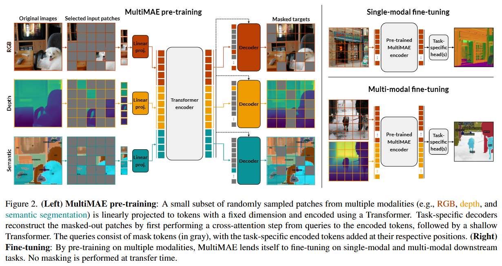

# 论文标题: MultiMAE: Multi-modal Multi-task Masked Autoencoders - CVPR 2022

### 一、引言与核心问题

本文研究的背景是自监督学习在计算机视觉领域的巨大成功，特别是基于掩码自编码器（Masked Autoencoders, MAE）的预训练范式。MAE通过对图像块进行大规模掩码并重构缺失像素，成功地为视觉Transformer（ViT）学习到了高质量的表征。然而，传统的MAE及其变体主要局限于单一模态（即RGB图像）的预训练，这限制了模型从多源信息中学习更全面、更鲁棒的场景理解能力。在现实世界中，视觉信息往往是多模态的，例如除了颜色（RGB），还包括深度（Depth）、语义分割图（Semantic Segmentation）等。如何有效利用这些可选的、额外的模态信息来增强模型的表征学习，同时又不牺牲其在单模态场景下的性能，是当前自监督学习面临的一个重要挑战。

**论文试图解决的核心任务是构建一个灵活且高效的、能够同时处理多模态输入和多任务输出的掩码自编码器预训练框架。**

*   **输入 (Input)**: 输入是多种视觉模态的数据，在本文的具体实现中，使用了RGB图像、深度图和语义分割图。所有输入模态首先被分割成不重叠的图像块（patches）。
    *   **RGB图像**: `[Batch_size, 3, 224, 224]`
    *   **深度图 (Depth)**: `[Batch_size, 1, 224, 224]`
    *   **语义分割图 (Semantic Segmentation)**: `[Batch_size, C, 224, 224]`，其中 `C` 是类别数。在处理时，分割图的每个类别索引首先被映射到一个64维的可学习嵌入向量，因此输入到投影层的实际上是 `[Batch_size, 64, 224, 224]`。
    *   在预训练阶段，模型接收的是从这三个模态中随机采样的一小部分（约1/6）图像块（patches）的集合。

*   **输出 (Output)**: 输出是所有输入模态的完整重构。模型需要根据稀疏的、混合的输入块，预测出所有模态被掩码的图像块。
    *   **重构的RGB图像**: `[Batch_size, 3, 224, 224]`
    *   **重构的深度图**: `[Batch_size, 1, 224, 224]`
    *   **重构的语义分割图**: `[Batch_size, C, 224, 224]`

*   **任务的应用场景**: 该预训练模型旨在为各种下游视觉任务提供一个强大的通用骨干网络。由于其多模态特性，它在需要多源信息融合的场景中尤其有价值，如自动驾驶（融合RGB、LiDAR深度、语义地图）、机器人感知、医学图像分析以及任何需要进行密集预测（如分割、深度估计）的场景。

*   **当前任务的挑战 (Pain Points)**:
    1.  **数据对齐与获取成本高**: 大规模、高质量、且像素级对齐的多模态数据集非常稀缺且昂贵。例如，同时获取RGB、精确深度和精细语义标注的数据集规模远小于纯RGB数据集。
    2.  **模型灵活性差**: 传统的模型要么只为单模态设计，要么在多模态训练后，推理时必须提供所有模态的输入，缺乏灵活性。如果某个模态在下游任务中不可用，模型性能可能会急剧下降甚至无法使用。
    3.  **计算复杂度**: 同时处理多个高分辨率的模态会带来巨大的计算和内存开销，使得预训练变得不切实际。

*   **论文针对的难点**: 本文主要聚焦于上述全部三个难点。
    1.  **针对数据成本**: 提出了使用**伪标签（pseudo labeling）**的方法，即利用现成的、在各自领域表现优异的单任务模型（如一个深度估计模型和一个语义分割模型）为大规模RGB数据集（如ImageNet）自动生成对应的深度和语义伪标签，从而巧妙地绕开了对真实多模态数据集的依赖。
    2.  **针对模型灵活性**: 设计的MultiMAE框架在预训练时学习了跨模态的预测能力，使其在微调和推理时，既可以利用所有可用的模态来提升性能，也可以在仅有RGB输入时保持强大的性能，甚至可以在只有深度图输入时工作。
    3.  **针对计算复杂度**: 继承并扩展了MAE的核心思想，即**只对一小部分可见的图像块进行编码（Encoder）**，极大地降低了ViT编码器中注意力机制的二次复杂度，使得同时处理三个模态的预训练在计算上是可行的。

### 二、核心思想与主要贡献

*   **直观动机与设计体现**: 核心动机在于，一个真正理解视觉场景的模型，应该能够从场景的一个方面（如物体的轮廓和颜色）推断出另一个方面（如它的空间位置和语义类别）。这种跨模态的“联想”能力是高级智能的体现。这一动机直接体现在其**跨模态掩码重构**任务中：模型被强制要求从稀疏的、可能仅来自单一模态的几个图像块，去重构所有其他模态的完整内容。例如，仅凭几个RGB图像块，模型就必须预测出完整的深度图和语义分割图。这种设计迫使模型学习模态间深层次的内在关联，而非仅仅学习每个模态内部的空间冗余。

*   **与相关工作的比较与创新**:
    *   **与MAE的比较**: 本工作是MAE在多模态、多任务领域的直接扩展。MAE证明了在单模态内进行掩码重构的有效性，而MultiMAE将其推广到模态之间，并设计了相应的多模态输入和多任务解码器结构。
    *   **与多任务学习的比较**: 传统的多任务学习通常是从一个共同的输入（如RGB）预测多个输出。MultiMAE的创新之处在于，它将多个任务的输出（深度、语义等）也作为了**可选的输入**，并将掩码机制引入其中，使得输入和输出域更加灵活和统一。
    *   **与多模态学习的比较**: 传统多模态模型通常需要所有模态同时存在。MultiMAE通过其独特的掩码采样策略，天然地为“部分模态缺失”的场景进行训练，从而获得了对输入模态的鲁棒性和灵活性。

*   **核心贡献与创新点**:
    1.  **提出MultiMAE框架**: 设计了一个简单、有效且可扩展的多模态多任务掩码自编码器框架。该框架能够灵活地整合任意数量的视觉模态作为可选输入，并同时学习重构它们。
    2.  **引入伪标签生成多模态数据集**: 创造性地使用预训练的单任务模型为大规模RGB数据集生成伪标签，解决了多模态自监督学习中数据稀缺的核心瓶颈，使得方法具有极高的普适性和可扩展性。
    3.  **设计多模态掩码采样策略**: 提出了一种基于狄利克雷分布（Dirichlet distribution）的采样策略，用于动态决定从每个模态中采样多少图像块。这种策略能够生成高度多样化的稀疏输入组合，有效促进了跨模态预测能力的学习。

### 三、论文方法论 (The Proposed Pipeline)

*   **整体架构概述**: MultiMAE的整体流程如图所示。在预训练阶段，首先从多个输入模态（RGB、深度、语义）中，使用一种特殊的采样策略选择一小部分（约1/6）可见的图像块（visible patches）。这些来自不同模态的图像块经过各自模态专属的线性投射层后，被送入一个共享的Transformer编码器（Encoder）进行深度特征提取。随后，多个并行的、任务专属的轻量级解码器（Decoders）利用编码器输出的特征，以及各自任务对应的掩码标记（mask tokens），分别重构出所有模态的完整图像。损失函数只在被掩码的位置进行计算。

*   **详细网络架构与数据流**:

    *   **数据预处理与分块**: 所有输入模态（如224x224的图像）都被切分为16x16大小的不重叠图像块，总计产生196个块。对于语义分割图，为了降低计算量，会先将其下采样4倍，然后使用4x4的块大小，同样产生196个块。

    *   **多模态掩码与采样 (Multi-modal Masking)**: 这是MultiMAE的核心之一。总共要从 `N_modalities * 196` 个块中选择固定数量（例如98个）的可见块。
        1.  **比例分配**: 首先，从一个对称狄利克雷分布 $\lambda \sim \text{Dir}(\alpha)$ 中采样一个比例向量 $\lambda = (\lambda_{rgb}, \lambda_{depth}, \lambda_{semantic})$，其中 $\sum \lambda_i = 1$。这个向量决定了此次迭代中，可见块分别有多少比例来自RGB、深度和语义模态。论文中发现 $\alpha=1$（相当于在单纯形上均匀采样）时效果最好，这能产生非常多样的组合，有时大部分块来自单一模态，有时则均匀分布。
        2.  **块采样**: 根据上一步分配的比例，计算出每个模态应提供的可见块数量（如 `num_visible_rgb = 98 * \lambda_{rgb}`），然后从该模态的196个块中随机无放回地采样相应数量的块。

    *   **多模态编码器 (Multi-modal Encoder)**:
        1.  **模态专属线性投射**: 每个模态都拥有一个独立的线性投射层。采样的可见块（例如，RGB块的维度是 `16*16*3=768`）被各自的投射层映射到Transformer的工作维度（例如ViT-B的768维），形成一系列Token。
        2.  **形状变换**: `[Num_visible_patches_modality_i, Patch_dim_i] -> [Num_visible_patches_modality_i, Transformer_dim]`。
        3.  **Token序列拼接**: 所有模态的可见Token被拼接成一个单一的序列。
        4.  **形状变换**: `[Total_num_visible_patches, Transformer_dim]`，其中 `Total_num_visible_patches` 是一个固定值（如98）。
        5.  **位置编码**: 为每个Token添加2D正弦-余弦位置编码，以保留其在原始2D图像中的空间信息。论文指出，模态信息通过各自独立的线性投射层的偏置项（bias term）隐式地编码，无需额外的模态嵌入。
        6.  **共享Transformer编码**: 拼接后的Token序列被送入一个标准的ViT编码器（如ViT-B）进行处理。由于只处理少量（1/6）的Token，计算效率非常高。编码器输出的也是一个 `[Total_num_visible_patches, Transformer_dim]` 的特征序列。

    *   **多任务解码器 (Multi-task Decoders)**:
        1.  **并行与专属**: 每个输出任务（重构RGB、重构深度等）都有一个独立的、轻量级的解码器。
        2.  **输入准备**: 每个解码器的输入包含两部分：(1) 来自编码器的`Total_num_visible_patches`个特征Token；(2) 对应任务的 `Num_masked_patches` 个可学习的掩码Token。
        3.  **跨模态信息融合**: 这是解码器的关键设计。在每个解码器内部，首先通过一个**交叉注意力层（cross-attention layer）**，其中掩码Token和可见Token作为查询（Queries），而编码器输出的所有可见特征Token作为键（Keys）和值（Values）。这一步允许每个解码器在重构自己的任务时，能够查询和利用来自所有输入模态的编码信息。
        4.  **浅层Transformer解码**: 交叉注意力之后，是几个标准的Transformer块（论文中为2个）和一个MLP层，用于完成最终的重构任务。解码器的维度较小（256维），保持了高效性。
        5.  **输出投射**: 解码器输出的Token序列最后通过一个线性层投射回每个块的原始维度（如RGB块为768维），并重新塑形为图像。
        6.  **形状变换**: `[196, Decoder_dim] -> [196, Patch_dim] -> [H, W, C]`。

*   **损失函数 (Loss Function)**:
    *   **设计理念**: 损失函数是多个任务重建损失的简单加权和。每个任务的损失只在其被掩码的图像块上计算。
    *   **构成**: $L_{total} = w_{rgb} L_{rgb} + w_{depth} L_{depth} + w_{semantic} L_{semantic}$
        *   **RGB损失 ($L_{rgb}$)**: 对RGB和标准化RGB（per-patch standardized RGB）的重构，使用均方误差（MSE Loss）。
        *   **深度损失 ($L_{depth}$)**: 对标准化的深度值，使用L1损失。
        *   **语义分割损失 ($L_{semantic}$)**: 将其视为一个逐像素分类问题，使用交叉熵损失（Cross-Entropy Loss）。
    *   **关注重点**: 该损失函数设计关注于像素或特征级别的精确重建，通过强制模型在信息极其稀疏的情况下完成跨模态的密集预测，来学习模态间的深层关联。

*   **数据集 (Dataset)**:
    *   **所用数据集**: 预训练在ImageNet-1K数据集上进行，这是一个大规模的RGB图像分类数据集。
    *   **特殊处理 (伪标签生成)**: 这是本文能够成功实施的关键。由于ImageNet-1K只有RGB图像，作者使用现成的SOTA模型为其生成了另外两种模态的伪标签：
        *   **深度伪标签**: 使用在Omnidata数据集上预训练的DPT-Hybrid模型生成。
        *   **语义分割伪标签**: 使用在COCO数据集上预训练的Mask2Former模型生成。
        *   这个过程是一次性的离线预处理，虽然计算成本不菲，但相比于采集真实数据仍然高效得多。这一策略使得MultiMAE可以应用于任何大规模的RGB数据集。

### 四、实验结果与分析

*   **核心实验结果**: 实验证明了MultiMAE的有效性和灵活性。
    *   **RGB-only微调**: 当下游任务只使用RGB作为输入时，MultiMAE的性能与专门为此设计的MAE相当，甚至在某些任务上更优。这表明学习多模态信息并不会损害其在单模态场景下的表征能力。
    *   **多模态微调**: 当下游任务可以利用额外的模态（如使用真实的深度图输入）时，MultiMAE的性能远超所有基线模型。如下表所示，在NYUv2数据集上进行语义分割时，同时输入RGB和真实深度（RGB-D）时，MultiMAE的mIoU达到了56.0，远高于MAE的49.3。这证明了MultiMAE成功学习到了如何有效融合和利用多模态信息。

    | 方法 (NYUv2语义分割) | RGB-only (mIoU) | Depth-only (mIoU) | RGB-D (mIoU) |
    | :------------------: | :-------------: | :---------------: | :----------: |
    |       MAE [35]       |      50.8       |       23.4        |     49.3     |
    | **MultiMAE (本文)**  |    **52.0**     |     **41.4**      |   **56.0**   |

*   **消融研究解读**:
    *   **预训练任务的影响**: 论文对使用不同模态组合（如只用RGB-D或RGB-S）进行预训练的模型进行了评估。结果显示，使用所有三种模态（RGB-D-S）进行预训练得到的模型是一个“通才”，在各种下游任务上都能取得非常好的、均衡的性能。而只用特定模态预训练的模型则在与其相关的下游任务上表现突出（如用深度预训练的模型在几何任务上表现更好），但在其他任务上较弱。这验证了任务多样性对学习通用表征的重要性。
    *   **掩码采样策略**: 对比了不同的狄利克雷分布参数 $\alpha$。实验表明，$\alpha=1$ 提供了最多样化的输入组合，迫使模型学习更强的跨模态推理能力，从而在下游任务中取得了最好的泛化性能。

*   **可视化结果分析**: 论文中的可视化结果极具说服力。
    *   **单模态预测**: 输入完整的单一模态（如只有深度图），MultiMAE能够合理地预测出另外两个模态（RGB和语义）。例如，从深度图可以恢复出物体的颜色和类别，这显示了模型学到了场景的几何、外观和语义之间的高度耦合关系。
    *   **跨模态交互 (图5)**: 一个惊艳的例子是，输入完整的深度图和极少数（两个）RGB块。当研究者仅仅改变其中一个RGB块（属于一只蜥蜴）的色调时，模型重构出的完整图像中，整只蜥蜴的颜色都随之改变，而背景颜色保持不变。这证明MultiMAE不仅仅是在“粘贴”颜色，而是真正理解了深度图提供的物体边界信息，并将颜色信息“传播”到了对应的物体区域，展现了其强大的场景理解和推理能力。

### 五、方法优势与深层分析

*   **架构/设计优势**:
    *   **灵活性与鲁棒性**: 通过在预训练中对输入模态进行随机组合掩码，MultiMAE天然地适应了模态缺失的场景。这使其在推理时，无论提供何种模态组合（甚至单模态），都能稳健地工作，并充分利用所有可用信息。这是其相较于传统多模态模型的最大优势。
    *   **计算效率**: 继承MAE的核心思想，编码器只处理稀疏的可见块，使得即使处理三个高维模态，预训练的计算成本仍在可控范围内。同时，任务专属的解码器设计得非常轻量，保证了扩展到更多任务时，计算成本仅呈线性增长。
    *   **通用性与可扩展性**: 伪标签策略使其可以应用于任何大型RGB数据集，极大地拓宽了应用范围。同时，其模块化设计（模态专属投射层、任务专属解码器）使得向系统中添加新的模态或任务变得非常直接和简单。

*   **解决难点的思想与实践**:
    *   MultiMAE解决核心难点的思想是**“通过生成式预训练，将多模态信息的学习从‘数据驱动’转向‘模型推理驱动’”**。
    *   在实践中，它通过以下方式实现：
        1.  **伪标签**解决了“数据驱动”的瓶颈，使模型不必依赖于昂贵的真实多模态数据。
        2.  **跨模态掩码重构**这一任务设计，将学习的目标设定为“模型推理”。模型被迫学习模态间的内在逻辑和因果关系，而不仅仅是统计相关性。
        3.  **灵活的架构设计**（稀疏编码、多解码器）则为这一雄心勃勃的学习目标提供了计算上的可行性，并保证了最终模型的实用性和灵活性。

### 六、结论与个人思考

*   **论文结论回顾**:
    *   本文成功地提出了MultiMAE，一个将掩码自编码器范式扩展到多模态、多任务领域的通用框架。通过结合伪标签技术和新颖的多模态掩码策略，MultiMAE不仅解决了多模态学习的数据瓶颈，还学习到了强大的、灵活的、可泛化到多种下游任务的视觉表征。

*   **潜在局限性**:
    *   **伪标签的质量上限**: 整个框架的性能在很大程度上取决于用于生成伪标签的“教师”模型的质量。如果教师模型存在偏差或错误，这些问题可能会被“蒸馏”并内化到MultiMAE的表征中。
    *   **模态扩展的局限**: 虽然框架理论上可扩展，但目前只验证了三种密集的、类似图像的视觉模态。对于更稀疏（如点云）、非结构化（如文本）或时序（如视频、音频）的模态，可能需要对分块、位置编码和网络结构进行更根本的调整。
    *   **计算成本**: 尽管编码器很高效，但生成伪标签和训练多个解码器仍然需要大量的计算资源，这可能成为其广泛应用的障碍。

*   **未来工作方向**:
    *   **探索更优的掩码策略**: 当前的掩码策略在模态间和空间上都是随机的。未来可以探索更具语义的掩码策略，例如，优先掩码掉信息量更少的区域，或根据模态间的依赖关系进行掩码，可能会引导模型学习更高效的表征。
    *   **端到端的伪标签生成**: 将伪标签的生成过程纳入到端到端的训练框架中，实现教师模型和学生模型（MultiMAE）的协同进化，可能会摆脱对固定质量教师模型的依赖。
    *   **向更多模态和任务扩展**: 将MultiMAE扩展到包含文本、音频、点云等更多样的模态，是其成为“通用感知模型”的关键一步。

*   **对个人研究的启发**:
    *   MultiMAE展示了如何通过巧妙的任务设计和工程解决方案（伪标签），在数据受限的情况下实现复杂的学习目标。这种“用模型的能力弥补数据的不足”的思想极具启发性。
    *   它强调了学习“跨域关系”的重要性。在很多研究领域，我们都面临着多个信息源，MultiMAE的跨模态预测范式提供了一种强制模型学习这些信息源之间内在关联的有效方法，而不仅仅是将它们简单拼接。这对于任何需要进行多信息融合的研究都有借鉴意义。