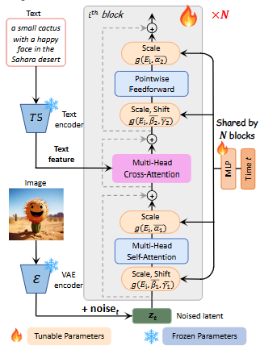

# 论文标题: PIXART-α: Fast Training of Diffusion Transformer for Photorealistic Text-to-Image Synthesis - arXiv 2023

### 一、引言与核心问题

本研究的背景在于，先进的文本到图像（Text-to-Image, T2I）生成模型，如Stable Diffusion和Midjourney，虽然取得了惊人的真实感和艺术效果，但其训练过程需要巨大的计算资源（通常是数千到数万个A100 GPU日），这不仅带来了高昂的经济成本和大量的碳排放，也为学术界和初创公司的技术创新设置了极高的门槛。因此，如何在保证生成质量的同时，大幅降低T2I模型的训练成本，成为了一个亟待解决的关键问题。

**论文试图解决的核心任务是什么？**

该论文的核心任务是高效的文本到图像合成。它旨在开发一个高质量的图像生成器，该生成器能够在资源消耗远低于现有顶尖模型的情况下，实现具有竞争力的图像生成质量、艺术性和语义控制能力。

*   **输入 (Input)**:
    1.  **文本提示 (Text Prompt)**: 描述期望生成图像内容的自然语言文本。该文本首先被一个预训练的T5-XXL语言模型编码为一系列高维词嵌入向量。根据论文，文本序列的长度被固定为120个token，因此其数据维度为 `[Batch_size, 120, Embedding_dim]`，其中`Embedding_dim`由T5-XXL模型决定。
    2.  **噪声图像潜变量 (Noisy Latent)**: 在扩散模型的反向去噪过程中，输入是一个从标准正态分布采样并通过前向过程加噪后的图像潜变量 $z_t$。该潜变量由一个预训练的变分自编码器（VAE）从真实图像编码而来。其数据维度为 `[Batch_size, Latent_Channels, Latent_Height, Latent_Width]`。
    3.  **时间步 (Timestep)**: 一个标量 $t$，表示当前去噪过程所处的时间步。它被编码为一个时间嵌入向量。

*   **输出 (Output)**:
    *   **预测噪声 (Predicted Noise)**: 模型在每个时间步的直接输出是预测的噪声 $\epsilon_\theta$。其数据维度与输入的噪声潜变量完全相同，即 `[Batch_size, Latent_Channels, Latent_Height, Latent_Width]`。
    *   **最终图像 (Final Image)**: 经过完整的迭代去噪过程后，得到的最终潜变量 $z_0$ 被送入VAE的解码器，生成一张RGB图像。其数据维度为 `[Batch_size, 3, Height, Width]`，论文中指出最高可支持到 $1024 \times 1024$ 分辨率。

*   **任务的应用场景**:
    这项技术深刻影响着众多下游应用，包括但不限于高级图像编辑、可控视频生成、3D资产创建、创意设计和艺术创作等领域。

*   **当前任务的挑战 (Pain Points)**:
    1.  **高昂的训练成本**: 现有SOTA模型需要极高的计算预算。例如，训练SDv1.5需要约6250个A100 GPU日，而RAPHAEL模型更是高达60000个A100 GPU日，对应数百万美元的成本，这成为了一个巨大的进入壁垒。
    2.  **低质量的训练数据**: 大规模图文配对数据集（如LAION）中的文本标题质量参差不齐，普遍存在描述不准确、信息含量低（例如，只描述了图像中的部分物体）和长尾效应（大量名词出现频率极低）等问题。这严重影响了模型学习图文对齐的效率，迫使其需要通过数百万次的迭代才能建立稳定的对齐关系。

*   **论文针对的难点**:
    这篇论文精准地聚焦于上述两大痛点，其核心目标是：1）通过创新的训练策略和网络架构设计，显著降低模型的训练时间和计算资源消耗；2）通过数据为中心的方法，提升训练数据的质量，从而加速和改善图文对齐的学习过程。

### 二、核心思想与主要贡献

本研究的直观动机源于一个核心问题：是否可以开发一个高质量的图像生成器，但其资源消耗对普通研究者和小型团队来说是可负担的？为了实现这一目标，论文的核心思想可以概括为“分解学习任务，优化网络效率，并精炼训练数据”。这一思想具体体现在其提出的三个环环相扣的设计中。

与最相关的工作，如基于U-Net的Stable Diffusion和基于Transformer的RAPHAEL相比，PIXART-α的创新之处在于它没有盲目地从零开始训练一个庞大的模型，而是采取了一种更“聪明”的策略。它借鉴了Diffusion Transformer (DiT) 的可扩展架构，但对其进行了轻量化和效率化的改造，使其更适用于T2I任务；同时，它将复杂的T2I训练过程分解为独立的阶段，并认识到数据质量是提升训练效率的关键，为此专门设计了自动标注流程。

论文的核心贡献可以清晰地归纳为以下三点：

1.  **训练策略分解 (Training Strategy Decomposition)**: 论文将复杂的T2I生成任务分解为三个更简单、更专注的子任务阶段：首先，通过在ImageNet上预训练一个类别条件模型来学习自然图像的像素分布；其次，使用高信息密度的图文数据专注于学习精确的文本-图像对齐；最后，利用高质量的美学数据对模型进行微调，以提升生成图像的艺术性。这种分解策略显著降低了训练难度和收敛时间。

2.  **高效的T2I Transformer架构 (Efficient T2I Transformer)**: 在DiT架构的基础上，论文进行了两项关键改进。第一，它将交叉注意力模块整合进Transformer块中，以有效注入文本条件。第二，它提出了`adaLN-single`模块，用一个全局MLP和轻量级的逐层可训练嵌入取代了DiT中为每个块配备的独立MLP，此举在保持生成能力的同时，显著减少了模型约26%的参数量和21%的GPU内存消耗。

3.  **高信息密度数据 (High-informative Data)**: 论文强调了图文数据中“概念密度”的重要性，并提出了一个创新的自动标注流程。它利用强大的视觉语言模型LLaVA对SAM（Segment Anything Model）和LAION数据集的图像生成详细、丰富的文本描述，有效解决了原始数据标题信息量不足的问题。这使得模型在每次迭代中能学习到更丰富的概念，从而极大地提升了图文对齐的学习效率。

### 三、论文方法论 (The Proposed Pipeline)

PIXART-α的整体工作流程遵循标准的潜在扩散模型（Latent Diffusion Model）框架。其核心是一个基于Transformer的去噪网络，该网络在VAE编码的图像潜在空间中运行。在生成过程中，从一个随机高斯噪声潜变量 $z_T$ 开始，模型在每个时间步 $t$ 接收当前的噪声潜变量 $z_t$、时间步嵌入以及来自T5-XXL文本编码器的文本条件嵌入。基于这些输入，模型预测出添加到干净潜变量中的噪声 $\epsilon$，然后从 $z_t$ 中减去该预测噪声以得到一个更清晰的潜变量 $z_{t-1}$。这个迭代过程重复进行，直到获得最终的潜变量 $z_0$，最后通过VAE解码器将其转换为最终的像素级图像。

**详细网络架构与数据流**

1.  **数据预处理**:
    *   **图像**: 原始图像首先通过一个预训练且冻结的 LDM VAE 编码器，被压缩到一个维度更低的潜在空间，得到潜变量 $z$。
    *   **文本**: 输入的文本提示被送入一个冻结的4.3B参数的Flan-T5-XXL模型进行编码，生成长度为120的token嵌入序列，作为文本条件。选择更长的序列（120 vs. 传统的77）是为了适应其自动生成的高密度、长描述的文本标题。

2.  **网络核心：高效T2I Transformer**:
    模型的主干网络定义于 `diffusion/model/nets/PixArt.py` 中的 `PixArt` 类。它采用了DiT-XL/2的尺寸（`depth=28`, `hidden_size=1152`, `num_heads=16`），但对其内部结构进行了关键修改。
    *   **数据流与形状变换**: 输入的图像潜变量 $z_t$（形状为 `[B, C, H, W]`）首先通过 `self.x_embedder`（一个`PatchEmbed`层）被切分成一系列不重叠的块（patches），并被线性投影为token序列，形状变为 `[B, N, D]`（`N`为块数量，`D`为`hidden_size`）。该序列与一个固定的2D正弦余弦位置编码 `self.pos_embed` 相加后，进入 Transformer 块堆栈。

    *   **改进的Transformer块 (`PixArtBlock`)**:
        *   **模块类型与设计细节**: 每个`PixArtBlock`的`forward`方法明确了其内部操作顺序为：**自注意力 (Self-Attention) -> 交叉注意力 (Cross-Attention) -> 前馈网络 (MLP)**。这种结构确保了在每个处理层级，图像自身的空间信息先被整合，然后才与文本语义信息进行深度融合。
        *   **代码实现细节**:
            *   为了计算效率，自注意力和交叉注意力都使用了 `xformers.ops.memory_efficient_attention` 库。
            *   为了实现从类别条件DiT模型的权重迁移，在`PixArt`的`initialize_weights`方法中，交叉注意力层 `cross_attn` 的输出投影权重被显式地初始化为零：`nn.init.constant_(block.cross_attn.proj.weight, 0)`。这使得交叉注意力在训练初期等效于一个恒等变换，保证了训练的稳定性。

    *   **`adaLN-single`模块**:
        *   **设计细节与作用**: 这是实现模型效率的核心，其完整实现逻辑清晰地展现在代码中。
            1.  **全局信号生成**: 在`PixArt`的`forward`方法中，输入的时间步嵌入`t`首先经过一个全局共享的MLP `self.t_block`，生成一个全局条件信号`t0`。该MLP的输出维度是 `6 * hidden_size`。这个`t0`在一次前向传播中只计算一次，然后被传递给所有的`PixArtBlock`。
            2.  **逐层调制**: 在每个`PixArtBlock`内部，都包含一个小的、可学习的参数 `self.scale_shift_table`，其形状为 `[6, hidden_size]`。这就是论文中提到的“层级特定的可训练嵌入 `E^(i)`”。
            3.  **核心计算**: `PixArtBlock`的`forward`方法中，通过 `(self.scale_shift_table[None] + t0.reshape(B, 6, -1)).chunk(6, dim=1)` 这一行代码，将全局信号`t0`与本层的`scale_shift_table`相加，然后切分成6个独立的张量。
        *   **门控机制 (Gating Mechanism)**: 代码揭示了一个论文未明确提及的细节。切分出的6个张量不仅包括用于归一化的`shift`和`scale`，还包括了`gate`。它们分别是：`shift_msa`, `scale_msa`, `gate_msa` (用于自注意力前) 和 `shift_mlp`, `scale_mlp`, `gate_mlp` (用于MLP前)。残差连接的实际形式是 `x = x + gate * F(modulate(norm(x)))`，其中`F`代表自注意力或MLP。这个门控机制允许模型动态地调整每个残差块的贡献，是一种比标准残差连接更灵活的设计。
        *   **形状与消融分析**: `adaLN-single`的设计将`depth`个独立的MLP（在标准DiT中）替换为1个全局MLP和`depth`个小的`[6, hidden_size]`参数表，极大地压缩了模型体积。论文的消融实验有力地证明了这一设计的有效性：与使用标准`adaLN`的基线相比，`adaLN-single`在GPU内存消耗上减少了21%（从29GB降至23GB），模型参数量减少了26%（从833M降至611M），而最终的图像生成质量和FID分数几乎没有损失。

**损失函数 (Loss Function)**

论文没有提出新的损失函数，而是沿用了扩散模型中标准的噪声预测目标。其设计理念是训练网络 $\epsilon_\theta$ 来预测在加噪过程中添加到干净潜变量 $z_0$ 上的噪声 $\epsilon$。

*   **数学形式**: 损失函数是预测噪声和真实噪声之间的均方误差（MSE），通常表示为L2损失：
    $$
    \mathcal{L} = \mathbb{E}_{z_0, \epsilon \sim \mathcal{N}(0, I), t} \left[ ||\epsilon - \epsilon_\theta(z_t, t, c)||^2 \right]
    $$
    其中，$z_0$ 是从数据集中采样的干净图像的潜变量，$\epsilon$ 是标准正态分布中采样的噪声，$t$ 是均匀采样的时间步，$c$ 是文本条件，$z_t = \sqrt{\bar{\alpha}_t}z_0 + \sqrt{1-\bar{\alpha}_t}\epsilon$ 是加噪后的潜变量。
*   **关注重点**: 该损失函数直接关注于模型在每个时间步对噪声的预测精度，通过优化这个简单的目标，模型隐式地学会了数据的分布，并能执行去噪过程。
*   **训练实施**: 在训练过程中，对每个样本随机采样一个时间步 $t$，计算该损失并反向传播更新模型参数。

**数据集 (Dataset)**

数据集的构建和处理是本研究的另一大核心贡献。

*   **所用数据集**: 论文的训练过程分阶段使用了多个数据集：
    1.  **ImageNet**: 用于第一阶段的像素依赖学习，训练一个类别条件的DiT模型。
    2.  **SAM & LAION**: 作为第二阶段图文对齐学习的核心数据源。
    3.  **JourneyDB & 内部数据集**: 包含4M JourneyDB和10M内部数据，共14M高质量图像，用于第三阶段的美学质量微调。

*   **特殊处理**: 论文没有直接使用原始的LAION和SAM数据集，而是进行了一项至关重要的预处理：**自动生成高密度标题**。
    *   **方法**: 他们使用了一个强大的视觉语言模型LLaVA-7B，并设计了一个特定的提示——“以非常详细的方式描述这张图片及其风格 (Describe this image and its style in a very detailed manner)”。
    *   **目的与效果**: Table 1的数据分析显示，这一处理取得了显著效果。例如，在LAION数据集上，经过LLaVA处理后，每张图片的平均名词数量从6.4个飙升至20.9个。这种“高信息密度”的数据使得模型在训练时能够更快速、更准确地学习到复杂的文本概念与视觉元素之间的对应关系，从而极大地提升了图文对齐的训练效率。

### 四、实验结果与分析

论文通过一系列定量和定性的实验，全面展示了PIXART-α的卓越性能和超高效率。

**核心实验结果**

核心的性能和成本比较呈现在Table 2中。该表将PIXART-α与包括DALL-E 2, Stable Diffusion v1.5, Imagen, 和RAPHAEL在内的多个主流T2I模型进行了对比。

| 指标 | #Params | #Images | FID-30K (COCO)↓ | GPU Days (A100)↓ |
|---|---|---|---|---|
| SDv1.5 | 0.9B | 2000M | 9.62 | 6,250 |
| Imagen | 3.0B | 860M | 7.27 | 7,132 |
| RAPHAEL | 3.0B | 5000M+ | **6.61** | 60,000 |
| **PIXART-α** | **0.6B** | **25M** | **7.32** | **753** |

从上表可以清晰地看出，PIXART-α在模型参数量（0.6B）和训练数据量（25M）都远小于其他模型的情况下，取得了极具竞争力的FID分数（7.32）。其FID表现优于SDv1.5，并逼近了训练成本高出近10倍的Imagen。最引人注目的是其训练成本：**753 A100 GPU日**。这仅为SDv1.5的**12%**，Imagen的**10.5%**，更是只有巨型模型RAPHAEL的**1.25%**。这组数据强有力地证明了论文方法在实现资源高效性方面的巨大成功。

**消融研究解读**

Figure 6中的消融实验深入剖析了模型设计的关键组成部分。实验对比了四种设置：1）从零开始训练（w/o re-param），2）使用标准`adaLN`模块，3）使用论文提出的`adaLN-single`模块，4）最终的完整模型（`adaLN-single-L`）。结果显示，重参数化（即加载ImageNet预训练权重）对于获得良好的初始性能至关重要，否则模型生成的图像质量明显较差。而`adaLN-single`与`adaLN`相比，在视觉效果和FID分数上几乎没有差异，但如前所述，它显著降低了GPU内存和模型参数。这证实了`adaLN-single`设计的有效性和高效性，是模型能够轻量化的关键。

**可视化结果分析**

论文中大量的可视化结果（如Figure 1, 8, 9, 12, 13, 14）直观地展示了PIXART-α的生成能力。Figure 1中的样本展示了模型在遵循复杂文本描述、生成多样化风格（从摄影到油画）和保持高保真度方面的强大能力。Figure 8和9中与Midjourney, DALL-E 2, SDXL等顶尖模型的直接对比，进一步证明了PIXART-α在图像质量、色彩、构图和语义对齐方面均达到了SOTA水准，甚至在某些复杂提示下表现更优。这些结果共同印证了，论文所提出的高效训练方法并未以牺牲最终的生成质量为代价。

### 五、方法优势与深层分析

**架构/设计优势**

PIXART-α的优势根植于其对训练效率的深刻理解和系统性优化，这主要体现在以下两个方面：

1.  **系统性的效率工程思想**: 论文的成功并非源于单一的某个技巧，而是一套组合拳。
    *   **分而治之的训练策略**: 训练策略的分解是其核心优势。它避免了让一个模型从零开始同时学习图像的底层像素统计规律、中层的图文语义对齐和高层的美学质量这三个耦合且难度各异的任务。通过加载ImageNet预训练的DiT，模型直接获得了一个关于自然图像分布的强大先验，这极大地简化了后续的学习。
    *   **架构的参数效率**: `adaLN-single`的设计是架构层面的一个精妙创新。代码证实，它通过一个全局MLP和小的逐层参数表，并辅以门控机制，高效地实现了条件注入。这不仅降低了训练成本，也使得模型在部署时对硬件的要求更低。

2.  **数据为中心的优化理念**:
    *   **提升信息密度**: 论文深刻洞察到，训练效率的瓶颈不仅在模型，更在于数据。通过LLaVA自动生成高质量的标题，它将“垃圾进，垃圾出”的模式转变为“精品进，优品出”。高信息密度的标题意味着模型在处理每一个样本时，都能接触到更丰富的语义概念和更精细的视觉描述，这使得图文对齐的学习过程从“大海捞针”变为“按图索骥”，效率自然指数级提升。

**解决难点的思想与实践**

总结来说，PIXART-α通过以下思想和实践，有效解决了T2I训练的核心难点：

*   **针对高昂成本**: 核心思想是**“复用+简化”**。
    *   **实践**: “复用”体现在其训练策略分解的第一步，即直接复用ImageNet预训练模型所包含的关于真实世界图像的先验知识。“简化”则体现在`adaLN-single`模块的设计上，它简化了模型架构，降低了计算和存储开销。这两个实践共同作用，从根本上降低了从零开始训练一个高质量T2I模型的资源门槛。

*   **针对数据质量低下**: 核心思想是**“投资于数据预处理”**。
    *   **实践**: 论文没有直接投入海量原始数据进行“暴力”训练，而是先投入少量计算资源（使用LLaVA进行标注）来提升数据质量。这种“数据投资”带来了极高的回报，使得后续的模型训练事半功倍。实践证明，在T2I这类任务中，数据质量的杠杆效应远大于数据数量。

### 六、结论与个人思考

**论文的主要结论回顾**

该论文成功地推出了一款名为 PIXART-α 的 Transformer 扩散模型。该模型在生成质量上达到了与业界领先模型相媲美的水平，同时将训练成本降低了1-2个数量级。其成功归功于三个协同设计的核心：分解式的训练策略、高效的T2I Transformer架构以及以高信息密度为目标的数据构建流程。这项工作为AIGC社区和初创公司提供了一条切实可行的路径，使他们能够以较低的成本开发自己的高质量生成模型。

**潜在局限性**

尽管PIXART-α取得了巨大成功，但论文在附录中也坦诚地指出了其存在的局限性（见Figure 19）：
1.  **精确计数能力不足**: 对于需要精确计数的提示（如“三本书”），模型可能生成错误数量的物体。
2.  **复杂细节的保真度**: 在处理具有复杂结构和精细细节的物体时，如人类的手部，生成结果仍可能出现不自然的瑕疵。
3.  **文本渲染能力较弱**: 由于训练数据中包含字体和字母的图像有限，模型在图像中生成清晰、准确文本的能力较弱。

**未来工作方向**

基于此项工作，未来的研究可以探索以下方向：
1.  **能力扩展**: 在已证明其高效性的基础上，可以探索将PIXART-α模型进一步扩大，看是否能以可控的成本超越现有所有模型的性能。
2.  **解决局限性**: 针对上述局限性，可以研究专门的模块或训练策略来增强模型的计数能力、对精细结构（如手部）的理解以及文本渲染能力。
3.  **多模态扩展**: 将PIXART-α高效的架构思想扩展到其他生成任务，如文本到视频、文本到3D等，有望在这些领域也实现类似的效率突破。

**对个人研究的启发**

这篇论文对我最大的启发在于，它雄辩地证明了在当前这个“模型越大越好”的时代，精巧的设计和聪明的策略依然具有巨大的价值。它提醒我们，当面临资源瓶颈时，不应仅仅考虑如何获取更多资源，而应退一步思考：**是否可以通过优化训练流程、改进模型架构、特别是提升数据质量来更高效地利用现有资源？** PIXART-α的成功是“系统性效率优化”和“数据中心AI”思想的完美结合，这为未来AI模型的设计提供了宝贵的范例。