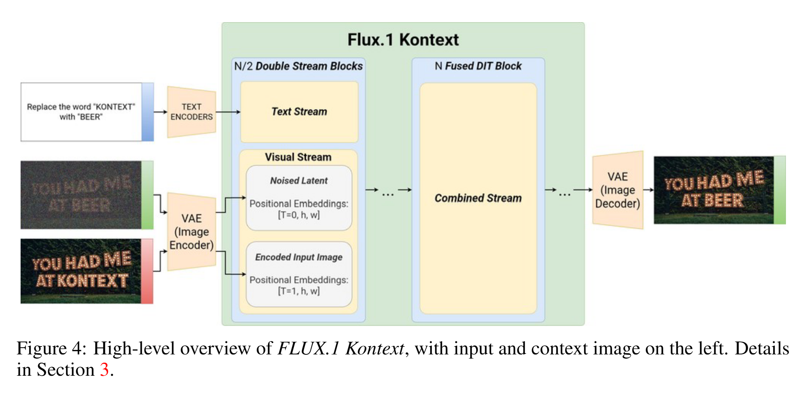
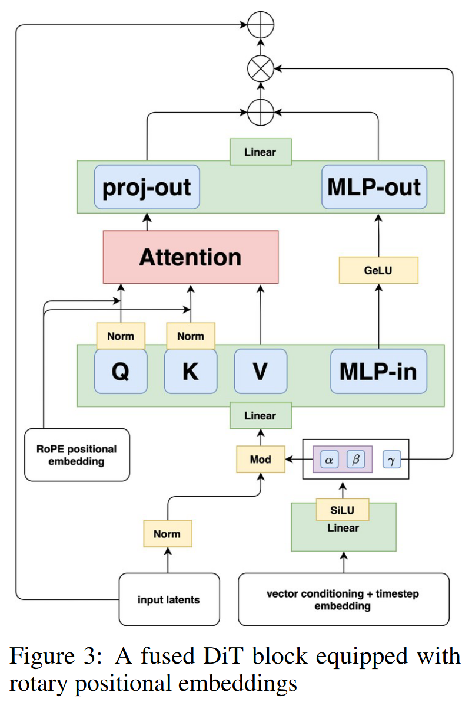

# 论文标题: FLUX.1 Kontext: Flow Matching for In-Context Image Generation and Editing in Latent Space - arXiv 2025

### 一、引言与核心问题

本研究的背景在于现代视觉内容创作对图像编辑工具日益增长的需求。无论是专业设计师还是普通用户，都期望能通过直观、自然的方式对图像进行精确且保持语义连贯的修改。传统的图像处理依赖于手动的像素操作，而早期基于深度学习的方法虽能实现特定任务，却往往缺乏灵活性和通用性。近年来，大规模生成模型的出现，特别是扩散模型，彻底改变了这一领域，使得通过文本指令进行复杂图像生成和编辑成为可能。然而，现有方法普遍面临三大挑战：首先，在连续的多轮编辑中，难以保持角色或物体身份的一致性，即“视觉漂移”问题；其次，基于迭代去噪的采样过程导致推理速度较慢，限制了模型的交互式应用潜力；最后，图像生成与图像编辑任务往往由不同的模型或架构处理，缺乏一个统一、高效的框架。

这篇论文旨在解决一个统一的**上下文感知图像生成与编辑 (In-Context Image Generation and Editing)** 核心任务。该任务旨在构建一个单一模型，能够根据用户提供的文本指令，结合可选的上下文图像，生成或编辑出符合要求的目标图像。

*   **输入 (Input)**: 模型的输入是多模态的，主要包括两部分：
    1.  一个可选的**上下文图像** $y \in \mathbb{R}^{H \times W \times 3}$ (或为空集 $\emptyset$)。

    2.  一条**自然语言指令** $c$ (a natural-language instruction)。

        在模型内部，图像首先通过一个变分自编码器 (VAE) 的编码器被转换为潜在表示 (latent representation)，其形状可表示为 $[B, H_l, W_l, C_l]$，其中 $B$ 是批量大小，$H_l, W_l$ 是潜在空间的高度和宽度，$C_l$ 是通道数。文本指令则通过标准的文本编码器转换为嵌入向量序列。

*   **输出 (Output)**: 模型的输出是一个**目标图像** $x \in \mathbb{R}^{H \times W \times 3}$。该图像在语义上遵循文本指令 $c$，并在内容、风格或身份上与上下文图像 $y$ 保持关联（当 $y$ 不为空时）。其数据维度与输入图像一致。

*   **任务的应用场景**: 这种统一的框架具有广泛的应用价值，例如：
    *   **故事板创作**: 保持角色在不同场景和情节中的一致性。
    *   **虚拟试衣/商品展示**: 在保持主体身份的同时，修改服装、背景或产品样式。
    *   **迭代式创意设计**: 允许设计师通过连续的指令快速探索和优化视觉概念。
    *   **个性化内容生成**: 根据用户提供的参考图生成具有特定风格或角色的新图像。

*   **当前任务的挑战 (Pain Points)**:
    1.  **一致性维持 (Consistency Maintenance)**: 在多轮编辑中，如何确保核心对象（如人物面部特征、服装、品牌Logo）的视觉特征不发生退化或改变，是当前方法的一大痛点。
    2.  **推理效率 (Inference Speed)**: 传统扩散模型需要数百步迭代采样，导致生成一张高分辨率图像耗时数十秒甚至更久，这严重阻碍了需要即时反馈的交互式应用。
    3.  **框架的统一性 (Framework Unification)**: 现有的解决方案通常将文本到图像生成 (T2I) 和图像到图像编辑 (I2I) 视为独立任务，需要不同的模型架构或训练策略，增加了系统复杂性和维护成本。

*   **论文针对的难点**: FLUX.1 Kontext 这篇论文明确地将目标设定为同时解决上述三个核心难点，即在**一个统一的框架**内，实现**高角色一致性**的**快速交互式**图像编辑与生成。

### 二、核心思想与主要贡献

本研究的直观动机源于一个简洁而强大的思想：是否可以将所有图像生成与编辑任务都视为一种“上下文条件下的生成”？具体而言，无条件的文本到图像生成可以被看作是以上下文为空集 $\emptyset$ 为条件的特殊编辑任务。基于此，论文提出了一种极为简单的**序列拼接 (sequence concatenation)** 方案来统一处理这两种任务。这一动机在技术上体现为：将上下文图像的潜在编码和目标图像的（噪声化）潜在编码在序列维度上直接拼接，然后送入一个共享的Transformer网络进行处理。通过为上下文和目标序列分配不同的位置编码，模型能够自然地学习它们之间的关系，从而实现对目标的精确控制。

与相关工作相比，例如像InstructPix2Pix这样的指令编辑模型，FLUX.1 Kontext 不再依赖于合成的指令-图像对进行训练，而是采用了一个更通用的关系对数据进行优化，并引入了真实世界众包基准KontextBench。相较于其他基于扩散模型的方法，它采用了**流匹配 (Flow Matching)** 框架，特别是**矫正流 (Rectified Flow)**，这种方法的理论特性保证了从噪声到数据的映射路径更“直”，从而可以用更少的步数完成高质量采样，极大地提升了速度。其核心创新在于将这种高效的流匹配机制与简洁的上下文注入方式相结合。

论文的核心贡献可以归纳为以下三点：
1.  **提出FLUX.1 Kontext，一个统一的流匹配模型**: 首次提出了一个基于流匹配Transformer的单一模型，无缝地集成了上下文图像生成与编辑、局部与全局编辑、风格参考和角色参考等多种任务。
2.  **实现了卓越的角色一致性与交互式速度**: 通过简洁的序列拼接和3D旋转位置编码（RoPE）设计，模型在多轮迭代编辑中表现出极强的角色和物体身份保持能力，同时借助流匹配和对抗蒸馏技术，将1024x1024图像的生成时间缩短至3-5秒，达到了交互级水平。
3.  **构建并发布KontextBench基准**: 为了更贴近真实世界应用场景，论文构建了一个包含1026个图像-提示对的众包基准，涵盖五大类编辑任务。该基准的发布为社区提供了一个评估上下文图像编辑模型综合能力的宝贵资源。

### 三、论文方法论 (The Proposed Pipeline)

FLUX.1 Kontext 的整体流程构建在一个名为 FLUX.1 的矫正流 Transformer 模型之上。其核心流程是：首先，利用一个预训练好的高质量 VAE 将输入的上下文图像 $y$ 和目标图像 $x$ 分别编码为潜在空间的 token 序列。然后，将上下文图像的 token 序列与添加了噪声的目标图像 token 序列进行拼接。这个拼接后的序列，连同文本指令的嵌入，被送入一个 Transformer 网络。该网络的目标是学习预测一个“速度场”（velocity field），这个速度场指明了如何将噪声化的目标 token “推向”其清晰的原始状态。训练完成后，在推理阶段，模型从一个纯噪声的潜在表示出发，通过数值求解器（如ODE solver）沿着学习到的速度场流动，仅需几步就能生成最终的清晰潜在表示，再由 VAE 解码器恢复为像素级的图像。

*   **详细网络架构与数据流**
    
    1. **数据预处理与编码**
    
       *   **图像编码**: 输入的上下文图像 $y$ 和目标图像 $x$ 首先通过一个冻结的 **Flux-VAE** 编码器。根据消融实验，该 VAE 在重构质量（PDist, SSIM, PSNR指标）上显著优于SD-VAE、SDXL-VAE等，为后续生成提供了高质量的潜在表示。输出为潜在 token 序列 $y_{\text{tokens}}$ 和 $x_{\text{tokens}}$。
       *   **文本编码**: 文本指令 $c$ 由标准文本编码器处理，生成文本嵌入序列【一个长序列 `text_embeddings` 和一个单一 token】。
    
    2. **Token 序列构建与位置编码** (Input latents)
    
       * **序列拼接**: `[处理后的 text_embeddings, 处理后的 (y_tokens + z_t)]` 的拼接，形状为 `[B, N_txt + (N_y + N_z_t), D]`
    
         *   第一步拼接：模型将上下文图像的潜在 token 序列 $y_{\text{tokens}}$ 和添加了噪声的目标图像潜在序列 $z_t$ 在**序列**维度上直接拼接，形成一个更长的视觉序列。这种设计简洁且支持不同的输入/输出分辨率。
         *   第二步拼接【仅作用于Fused DiT Block】：对于拼接后的图像 token 和文本嵌入序列，分别通过不同的线性层投影到 Transformer 内部的工作维度，随后在**序列**维度上拼接。
       * **3D RoPE 位置编码**: 为了让模型区分上下文和目标，并理解其空间结构，论文采用了三维旋转位置编码，为每个 token 赋予一个 $(t, h, w)$ 坐标。其中 $(h, w)$ 是空间位置。关键设计在于时间维度 $t$：对于目标图像的所有token，它们的 $t$ 值恒定为0；而对于上下文图像的token，它们的 $t$ 值被赋予一个恒定的非零偏移量（例如，对于第 $i$ 个上下文图像，其所有 token 的 $t=i$）。这相当于创建了一个“虚拟时间步”，巧妙地将上下文信息与待生成的目标在输入层面分离开来，同时保留了各自内部的空间结构。**RoPE 仅作在 Attention 中计算 Q 和 K 相似度时注入**。
    
         > 根据 `src/flux/sampling.py` 中的 `prepare` 函数，文本 token 的`(t, h, w)` 坐标全部都是 `(0, 0, 0)` ！
    
    3. **条件嵌入** (vector conditioning)

       - 将单一 token 的文本编码 `y`，加上时间步的编码`timestep_embedding(timesteps, 256)` 以及可选的指导强度的编码 `timestep_embedding(guidance, 256)` ，经过线性层输出调制和门控参数。
    
    4. **核心Transformer网络**
    
       * **混合流块设计**: 网络由两类Transformer块构成。前 $N/2$ 个块是双流块 (Double Stream Blocks，即 [MMDiT](./202405_MMDiT.md) + RoPE )，它们为图像token和文本 token 维护独立的权重，通过注意力机制进行信息交互。这种设计允许模型在早期阶段分别处理和细化两种模态的信息。
    
         > #### 第一阶段：条件准备与分发
         >
         > 1. 接收输入: 双流块接收四个主要输入：`img`（图像潜在 token 序列）、`txt`（文本嵌入序列）、`vec`（融合了时间步、指导强度和 CLIP 编码的全局条件向量）以及 `pe`（用于注意力计算的旋转位置编码参数）。
         > 2. 生成调制参数: `vec` 条件向量被送入两个独立的调制网络（`img_mod` 和 `txt_mod`）。`img_mod` 专门为图像流生成两套调制参数（`img_mod1` 和 `img_mod2`），而 `txt_mod` 专门为文本流生成两套调制参数（`txt_mod1` 和 `txt_mod2`）。每一套参数都包含 `shift`（位移）、`scale`（缩放）和 `gate`（门控）三个部分。`mod1` 用于注意力部分，`mod2` 用于 MLP 部分。
         >
         > #### 第二阶段：并行特征准备 (图像流与文本流)
         >
         > 在这一阶段，图像流和文本流**并行地**、使用**各自独立**的参数进行处理，为后续的注意力计算做准备。
         >
         > - 对于图像流 `img`
         >   1. 归一化: `img` 序列首先经过一个层归一化层 (`img_norm1`)。
         >   2. 特征调制 (AdaLN): 归一化后的 `img` 序列会被 `img_mod1` 的 `scale` 和 `shift` 参数进行调制。
         >   3. QKV 投影: 调制后的 `img` 序列被送入图像流专属的线性层 (`img_attn.qkv`)，生成 Query (`img_q`)、Key (`img_k`) 和 Value (`img_v`) 三个向量。
         >   4. QK 归一化: 生成的 `img_q` 和 `img_k` 再经过一次 RMSNorm 归一化 (`img_attn.norm`)，以稳定训练。
         > - 文本流 `txt` 会经历与图像流完全相同的四个步骤，但使用的是**文本流专属**的一套参数（`txt_norm1`, `txt_mod1`, `txt_attn.qkv`, `txt_attn.norm`）。
         >
         > #### 第三阶段：核心融合注意力
         >
         > 这是双流块中最关键的步骤，实现了图像和文本信息的深度交互。
         >
         > 1. QKV 拼接: 将第二阶段准备好的 `img_q` 和 `txt_q` 沿着序列长度维度拼接起来，形成一个更长的 Query 向量 `Q`。同样地，`img_k` 和 `txt_k` 被拼接成 `K`，`img_v` 和 `txt_v` 被拼接成 `V`。
         > 2. 注意力计算: 在这个拼接后的长序列上，执行一次标准的自注意力计算。在计算过程中，`pe` 参数会被用来对 `Q` 和 `K` 向量进行旋转（RoPE），从而注入位置信息。这次计算使得每个 token（无论来自图像还是文本）都能关注到所有其他 token。
         > 3. 结果分离: 注意力计算的输出是一个与输入 `V` 形状相同的长序列。这个序列会被根据原始的文本序列长度 `L_txt` 切分开，重新得到属于文本流的注意力输出 `txt_attn` 和属于图像流的注意力输出 `img_attn`。
         >
         > #### 第四阶段：并行后处理与更新 (图像流与文本流)
         >
         > 在这一阶段，图像流和文本流再次**并行地**、使用**各自独立**的参数进行处理，完成一个完整的 Transformer 块。
         >
         > - 对于图像流:
         >   1. 注意力输出投影: `img_attn` 结果首先经过图像流专属的线性投影层 (`img_attn.proj`)。
         >   2. 第一次残差连接: 投影后的结果被 `img_mod1` 的 `gate` 参数缩放，然后加回到原始的 `img` 输入上，完成第一个残差连接。
         >   3. MLP 块: 经过第一次残差连接的 `img` 序列，再次经过归一化 (`img_norm2`) 和 `img_mod2` 参数的调制。调制后的结果被送入图像流专属的 MLP 网络 (`img_mlp`) 进行非线性变换。
         >   4. 第二次残差连接: MLP 的输出被 `img_mod2` 的 `gate` 参数缩放，然后加回到第一次残差连接的结果上，完成第二个残差连接。
         > - 文本流会经历完全相同的四个步骤（投影、残差连接、MLP、残差连接），但使用的是文本流专属的一套参数（`txt_attn.proj`, `txt_mod1.gate`, `txt_norm2`, `txt_mod2`, `txt_mlp`）。
         >
         > 最终，双流块输出经过这两个残差连接更新后的 `img` 和 `txt` 序列，它们将作为下一个双流块的输入，或者在所有双流块处理完毕后，被拼接送入单流块。
    
         
    
       * **融合 DiT 块**: 后续的 $N$ 个块是**单流块 (Single Stream Blocks)**，也称为融合 DiT 块 (Fused DiT Block)。在这一阶段，图像和文本 token 序列被拼接在一起，由同一组权重处理。为了提升 GPU 利用率和计算效率，这些块采用了[融合前馈网络设计](https://arxiv.org/pdf/2302.05442)，将注意力的输入/输出线性层与 MLP 层融合，减少了参数量和内存访问，从而加速了训练和推理。
    
         > #### fused feed-forward blocks
         >
         > 1. 在标准的 Transformer 块中，通常有以下关键组件（忽略归一化和残差连接，仅关注计算流）：
         >
         >    - 注意力机制 (Attention):
         >      - Input -> `Linear_Q` -> Q
         >      - Input -> `Linear_K` -> K
         >      - Input -> `Linear_V` -> V
         >      - Q, K, V -> `Attention` -> `Output_Attention`
         >      - `Output_Attention` -> `Linear_Proj` -> `Output_Attention_Proj`
         >
         >    - 前馈网络 (MLP):
         >
         >      - `Output_Attention_Proj` -> `Linear_MLP_In` -> `MLP_Hidden_State`
         >      - `MLP_Hidden_State` -> `Activation (e.g., GELU)` -> `MLP_Activated_State`
         >      - `MLP_Activated_State` -> `Linear_MLP_Out` -> `Output_MLP`
         >
         >      传统上，`Linear_Q`, `Linear_K`, `Linear_V`, `Linear_Proj`, `Linear_MLP_In`, `Linear_MLP_Out` 都是独立的 `nn.Linear` 层。
         >
         > 2. `Fused DiT Block` 通过两个关键的融合线性层实现了 `fused feed-forward blocks` 的理念，极大简化了上述的计算流。
         >
         >    - `Linear (qkv and mlp_in)`: `self.linear1 = nn.Linear(hidden_size, hidden_size * 3 + self.mlp_hidden_dim)`
         >      - 融合作用: 这一层不再仅仅是生成 Q, K, V。它是一个更大的线性层，其输出维度是 `3 * hidden_size` (用于 QKV) 和 `mlp_hidden_dim` (用于 MLP 的输入) 的总和。
         >      - 数据流:
         >        - 经过预归一化和调制 (`Norm` -> `Mod`) 的输入 `x` 进入此 `Linear` 层。
         >        - 输出被拆分为两部分：
         >          - 一部分用于生成 Q, K, V（对应图中的 `Q`, `K`, `V` 路径）。
         >          - 另一部分直接作为 MLP 的输入 (`mlp` 变量，对应图中的 `MLP-in` 路径的起始点)。
         >      - **优化**: 将原本的 `Linear_Q`, `Linear_K`, `Linear_V` 和 `Linear_MLP_In` 四个独立的线性层融合为了一个单一的、更大规模的线性层。
         >
         >    - `Linear (proj and mlp_out)`: `self.linear2 = nn.Linear(hidden_size + self.mlp_hidden_dim, hidden_size)`
         >      - 融合作用: 这一层同样是一个更大的线性层，其输入维度是 `hidden_size` (来自注意力投影) 和 `mlp_hidden_dim` (来自激活后的 MLP 输出) 的总和。
         >      - 数据流:
         >        - 注意力计算的输出 (`attn`，经过 `Attention` 模块)
         >        - MLP 路径中激活函数 (`GELU`) 的输出 (`self.mlp_act(mlp)`)
         >        - 这两部分被拼接起来 (`torch.cat((attn, self.mlp_act(mlp)), 2)`)，然后作为 `self.linear2` 的输入。
         >      - **优化**: 将原本的 `Linear_Proj` 和 `Linear_MLP_Out` 两个独立的线性层融合为了一个单一的、更大规模的线性层。
         >
         > 3. `Fused Feed-Forward Blocks` 的优点
         >
         >    - 减少内存访问: 传统的多个小线性层之间，可能需要将中间结果频繁写入和读取 GPU 的全局内存。通过融合，这些操作可以在 GPU 的共享内存或寄存器中连续执行，显著减少了内存带宽瓶颈。
         >
         >    - 提高计算密度: 更大的矩阵乘法通常可以更有效地填充 GPU 的计算单元，提高算力利用率。
         >
         >    - 简化模型结构: 从 6 个线性层减少到 2 个线性层，模型定义更简洁。
         >
         >    - 更高效的训练和推理: 论文明确指出，这带来了“更高效的训练和推理”。
    
    5. **数据流与形状变换**
    
       *   输入图像 $y$ (shape: $[B, 3, H, W]$) $\rightarrow$ VAE Encoder $\rightarrow$ $y_{tokens}$ (shape: $[B, H_l \times W_l, C_l]$)。
       *   目标图像 $x$ (shape: $[B, 3, H, W]$) $\rightarrow$ VAE Encoder $\rightarrow$ $x_{tokens}$ (shape: $[B, H_l \times W_l, C_l]$)。
       *   $z_t = (1-t)x_{tokens} + t\epsilon$ (噪声化的目标token)。
       *   Transformer输入: 拼接后的视觉序列 $[y_{tokens}, z_t]$ (shape: $[B, N_y + N_x, C_l]$) 和文本嵌入。
       *   Transformer输出: 速度场预测 $v_{\theta}$ (shape: $[B, N_x, C_l]$)。
       *   最终的潜在表示通过ODE求解器积分得到，再由VAE Decoder $\rightarrow$ 输出图像 (shape: $[B, 3, H, W]$)。
       *   **消融分析**: 论文虽然没有传统的消融研究表格，但其对不同模型版本（[pro], [dev], [max]）的评估起到了类似作用。例如，[dev]版本专注于I2I任务训练，表明任务特定的微调能进一步提升性能；而[max]版本使用更多计算资源，在各项指标上普遍优于[pro]，验证了模型的可扩展性。
    
*   **损失函数 (Loss Function)**:
    *   **设计理念**: 论文采用**矫正流匹配损失 (Rectified-flow matching loss)**。其数学形式为：
        $$
        L_{\theta} = \mathbb{E}_{t \sim p(t), x, y, c} \left[ ||v_{\theta}(z_t, t, y, c) - (x - \epsilon)||^2 \right]
        $$
    *   **关注重点**: 该损失函数旨在让神经网络 $v_{\theta}$ 直接预测连接噪声 $\epsilon$ 和数据 $x$ 的向量场 $(x - \epsilon)$。这里，$z_t = (1-t)x + t\epsilon$ 是在潜在空间中从数据 $x$ 到标准高斯噪声 $\epsilon$ 的线性插值路径。$t$ 是一个时间变量，从一个对数正态分布中采样。这个损失函数直接优化了数据流动的方向和速度，使其尽可能沿着直线路径，这是矫正流能够实现快速采样的理论基础。
    *   **训练实施**: 训练从一个纯文本到图像的FLUX.1模型检查点开始，然后在使用图像-文本关系对的数据集上进行联合微调。当上下文图像 $y = \emptyset$ 时，模型就退化为文本到图像生成模式，从而保持了其T2I能力。

*   **数据集 (Dataset)**:
    *   **训练数据**: 论文提到他们收集并策划了数百万个关系对 $(x, y, c)$ 用于优化。
    *   **评估基准 (KontextBench)**: 这是一个重要的贡献。与以往依赖合成数据或受限于旧模型能力的基准不同，KontextBench是从真实世界用例中众包而来的。它包含1026个独特的图像-提示对，源自108个基础图像（包括个人照片、CC授权艺术作品和AI生成内容）。这确保了评估任务的多样性和真实性，覆盖了局部编辑、全局编辑、文本编辑、风格参考和角色参考五个核心类别。

### 四、实验结果与分析

论文通过与当前最强的专有及开源模型进行对比，全面展示了FLUX.1 Kontext的卓越性能。

*   **核心实验结果**: 实验结果在图像编辑（I2I）和图像生成（T2I）两方面都表现出色。在I2I任务的评估中（图8），FLUX.1 Kontext [max] 和 [pro] 版本在**文本编辑**和**角色保留 (Character Reference)** 任务上取得了最高的ELO评分，超越了gpt-image-1等顶尖模型。在**局部编辑**任务中也位居前列。在**全局编辑**和**风格参考 (SREF)** 方面，其性能仅次于gpt-image-1和Gen-4，但差距很小。
    
    以下是基于图8中“角色参考”任务的ELO评分对比，展示了其在关键痛点上的优势：
    
    | 指标 (ELO Rating)   | gpt-image-1 (high) | Gen-4 References | FLUX.1 Kontext [max] |
    | ------------------- | ------------------ | ---------------- | -------------------- |
    | Character Reference | 1103               | 954              | **1160**             |

    尤其值得注意的是其**推理速度**。根据图7b，FLUX.1 Kontext 在1024x1024分辨率下的I2I任务中，延迟仅为4-5秒，比gpt-image-1（20-40秒）快了近一个数量级，这为其交互式应用提供了坚实基础。

*   **可视化结果分析**:
    *   **角色一致性**: 图1和图12直观地展示了模型强大的角色一致性。在图1中，一只戴着VR眼镜的鸟在酒吧、电影院、超市等多个截然不同的场景中被连续生成，其形象和特征始终保持高度一致。图12的定量分析（AuraFace相似度）进一步证实，在连续5步编辑后，FLUX.1 Kontext Pro的平均面部相似度高达0.908，远高于gpt-image-1 (0.416) 和Runway Gen-4 (0.774)，显示出极低的“视觉漂移”。
    *   **迭代编辑能力**: 图10和图11展示了模型在产品设计和人像编辑中的迭代工作流。模型能从一个碗的样式生成一个匹配的花瓶，并进一步修改花瓶颜色，同时保持整体风格和光照不变。这证明了其在实际创作流程中的可用性。

### 五、方法优势与深层分析

*   **架构/设计优势**:
    *   **简洁高效的上下文注入**: 论文方法的核心优势在于其处理上下文信息的方式。放弃了复杂的交叉注意力或其他融合模块，转而采用简单的**序列拼接**配合**虚拟时间步的3D RoPE**。这种设计之所以有效，是因为它在输入表示层面就为模型清晰地区分了“条件”与“目标”，Transformer强大的序列处理能力足以从中学习到复杂的依赖关系。这种方式避免了交叉注意力可能带来的身份信息“泄露”或“稀释”问题，从而实现了卓越的角色保持能力。
    *   **流匹配带来的速度与质量**: 基于矫正流的框架是另一个关键优势。理论上，矫正流将数据点与噪声点之间的路径“拉直”，使得从噪声到数据的生成过程可以用更少的离散步骤来近似。这从根本上减少了采样所需的网络评估次数。再结合**对抗性扩散蒸馏 (LADD)**，将采样步数压缩到个位数，实现了质的飞跃，达到了交互速度，同时对抗性训练还有助于提升样本的视觉质量。
    *   **统一框架的可扩展性**: 将所有任务视为条件生成，并通过一个简单的机制（$y=\emptyset$）来处理无条件生成，使得整个框架异常简洁且具有良好的可扩展性。未来可以方便地将更多类型的条件（如多张参考图、深度图、姿态等）通过类似的方式融入模型。

*   **解决难点的思想与实践**:
    *   针对**一致性**难点，论文的核心思想是**“分离但不隔离”**。通过虚拟时间步的位置编码，在输入层面就将上下文和目标分离开，让模型明确“谁是参考，谁是目标”，避免了特征混淆。实践上，这种设计简单、无额外参数，且被证明非常有效。
    *   针对**速度**难点，论文选择了在数学原理上更优越的**流匹配**路径，并结合了业界前沿的**模型蒸馏**技术。思想上，是从“减少采样步数”这一根本问题入手；实践上，通过LADD技术，将一个需要多步采样的模型蒸馏成一个只需几步甚至一步就能出图的高效模型。
    *   针对**统一性**难点，论文的思想是**“化繁为简”**，抓住所有生成任务的共性——即都是一种条件概率分布 $p(x|condition)$ 的建模。实践上，通过巧妙地定义“空上下文”这一特殊条件，将T2I任务自然地融入了I2I框架中。

### 六、结论与个人思考

论文成功地介绍了一款名为FLUX.1 Kontext的统一图像生成与编辑模型。该模型通过结合流匹配的高效性与一种新颖而简洁的上下文处理机制，在保持极高角色一致性的同时，实现了前所未有的交互式编辑速度。此外，论文贡献的KontextBench基准也为该领域未来的研究提供了坚实的评估基础。

*   **潜在局限性**:
    1.  **误差累积**: 尽管单步和少数几步的编辑效果出色，但论文承认，在**过多的多轮编辑**（如超过六轮）后，图像质量可能会下降并出现可见的伪影（如图15所示），这表明误差会在迭代中累积。
    2.  **指令遵循的精确性**: 模型偶尔会无法精确遵循复杂的指令，可能会忽略或错误地解释提示中的某些特定要求。
    3.  **蒸馏引入的伪影**: 模型蒸馏过程本身可能会引入一些细微的视觉伪影，影响最终输出的保真度。

*   **未来工作方向**:
    *   **多上下文扩展**: 当前模型主要处理单个上下文图像，一个自然的扩展是支持多个图像作为上下文，从而实现更复杂的概念组合和风格融合。
    *   **视频领域应用**: 将这种上下文保持和迭代编辑的能力扩展到视频领域，实现连贯的视频编辑与生成，将是一个极具潜力的方向。
    *   **减少多轮退化**: 探索新的机制来抑制或修复在长期迭代编辑中累积的视觉误差，以实现“无限”流畅的内容创作。

*   **对个人研究的启发**:
    这篇论文给我的最大启发是，在解决复杂问题时，回归到问题的本质并寻求简洁的设计，有时会比堆砌复杂的模块更有效。FLUX.1 Kontext的上下文处理方式就是这样一个典范。它证明了在强大的基础模型（Transformer）之上，一个巧妙的输入表示设计就能解决长期以来的核心痛点。这鼓励我们在研究中更多地思考如何通过数据表示和模型输入的构建来引导模型学习，而不是仅仅专注于网络内部结构的复杂化。此外，该工作也凸显了从理论（流匹配）到实践（模型蒸馏）的系统性工程优化的重要性。