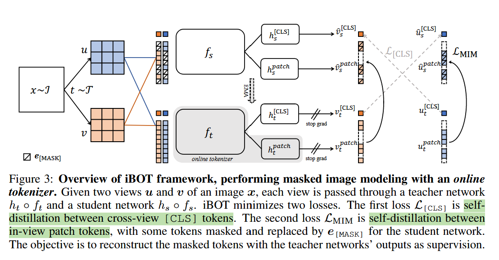

# 论文标题: iBOT: Image BERT Pre-Training with Online Tokenizer - ICLR 2022

### 一、引言与核心问题

本文的研究背景是自监督视觉表征学习（Self-Supervised Visual Representation Learning），特别是基于掩码图像建模（Masked Image Modeling, MIM）的范式。语言模型（如BERT）的成功很大程度上归功于掩码语言建模（MLM），它通过预测被掩盖的文本单元（token）来学习强大的语言表征。研究者们试图将这一思想迁移到计算机视觉领域，即MIM，以训练Vision Transformers (ViT)。然而，与文本不同，图像缺乏天然的、离散的语义单元，这为MIM带来了核心挑战：如何定义和获取高质量的视觉“词元”（visual token）。

**论文试图解决的核心任务是什么？**

本文的核心任务是提出一个高效的自监督预训练框架，通过掩码图像建模（MIM）来学习高质量的视觉表征，使其在各类下游视觉任务（如图像分类、目标检测、分割）上表现优异。

*   **输入 (Input)**:
    *   单张未标注的图像 `x`。在训练流程中，通常会通过数据增强生成两个全局视角（global views）`u` 和 `v`。
    *   **数据维度/Shape**: 对于标准的ViT输入，图像通常被缩放到一个固定尺寸，例如 `[Batch_size, 3, 224, 224]`。这些图像随后被切分成不重叠的图像块（patches）。对于ViT-B/16，即Patch大小为16x16，输入图像将被转换为一个序列，其形状为 `[Batch_size, Num_patches, Patch_dim]`，其中 `Num_patches = (224/16) * (224/16) = 196`。在送入Transformer前，会加上一个可学习的 `[CLS]` token，并融入位置编码，最终输入序列的形状为 `[Batch_size, 197, Hidden_dim]`。

*   **输出 (Output)**:
    *   一个经过预训练的Vision Transformer模型。该模型的参数（权重）包含了丰富的视觉表征，可以直接用于微调（fine-tuning）或作为特征提取器（feature extractor）应用于下游任务。
    *   在训练过程中，模型的直接输出是对于每个输入token（包括`[CLS]` token和patch tokens），在投影头（projection head）后的概率分布。
    *   **数据维度/Shape**: 经过Transformer和投影头后，输出的形状为 `[Batch_size, 197, K]`，其中 `K` 是视觉词元词表的大小（在本文中 `K=8192`）。

*   **任务的应用场景**: 预训练好的模型可以广泛应用于计算机图形学和计算机视觉的多个领域，包括但不限于：图像分类、目标检测、实例分割、语义分割、小样本学习以及对模型鲁棒性的提升。

*   **当前任务的挑战 (Pain Points)**:
    1.  **缺乏高质量的视觉分词器 (Tokenizer)**: 语言有明确的单词或子词单元，但图像是连续信号。如何将图像块（patches）映射到有意义的离散或软性语义“词元”是MIM的核心难题。
    2.  **现有分词器的局限性**: 以BEiT为代表的先前工作采用一个离线的、预训练好的分词器（如dVAE）。这种方法存在几个问题：
        *   **两阶段训练**: 需要先花费大量资源训练一个分词器，然后再用它来指导MIM预训练，流程繁琐。
        *   **语义层次低**: dVAE等分词器倾向于关注像素级别的低频细节和纹理重建，而非高层语义，这限制了模型学习抽象表征的能力。
        *   **域不匹配**: 分词器通常在特定的数据集（如ImageNet）上预训练，其“知识”是固定的，可能无法很好地适应其他数据域。

*   **论文针对的难点**: 本文主要聚焦于解决**高质量视觉分词器**的获取问题。它旨在设计一个无需独立预训练、能够与MIM任务联合优化、并能捕捉高层语义的**在线分词器 (Online Tokenizer)**。

### 二、核心思想与主要贡献

*   **直观动机与设计体现**:
    *   **直观动机**: 一个好的视觉分词器本身也应该具备强大的语义理解能力。既然如此，为什么不让分词器和目标模型一起学习和进化呢？自监督学习中的“自蒸馏”（self-distillation）框架（如DINO）已经证明，通过让一个学生网络（student）去匹配一个动量更新的教师网络（teacher）的输出来学习是可行的。iBOT将此思想巧妙地延伸：**教师网络本身就可以扮演那个理想的、动态演进的“在线分词器”**。
    *   **设计体现**: iBOT采用了一个孪生（siamese）的教师-学生网络架构。教师网络的输出被用作MIM任务的监督信号（即视觉词元）。由于教师网络是通过学生网络的动量平均（EMA）得到的，它的知识在训练中是动态更新的，从而实现了分词器的“在线”学习。

*   **与相关工作的比较与创新**:
    *   **与DINO的比较**: DINO通过对`[CLS]` token进行自蒸馏来学习全局语义表征。iBOT继承了DINO的`[CLS]` token蒸馏机制，但在此基础上**创新性地加入了针对patch tokens的掩码图像建模（MIM）任务**。这使得iBOT不仅能学习全局表征，还能学习到丰富的局部、部件级（part-level）语义。
    *   **与BEiT的比较**: BEiT使用一个固定的、离线预训练的dVAE作为分词器。iBOT最大的创新在于**用一个在线的、与主任务联合学习的教师网络取代了离线分词器**。这不仅简化了训练流程，更重要的是，分词器能够从当前数据集中持续提炼和更新知识，从而生成更高质量、更具语义的监督信号。

*   **核心贡献与创新点**:
    1.  **提出了iBOT框架，首次将在线分词器与MIM相结合**: 通过将教师网络作为在线分词器，实现了分词与表征学习的端到端联合优化，摆脱了对预训练离线分词器的依赖。
    2.  **统一了对比学习和掩码图像建模**: iBOT框架优雅地融合了两种主流的自监督学习范式。通过对`[CLS]` token的自蒸馏（类似对比学习）学习全局特征，同时通过对patch tokens的MIM学习局部特征。
    3.  **在多项基准测试中达到SOTA**: 实验证明，iBOT在ImageNet分类、COCO目标检测与分割、ADE20K语义分割等多个下游任务上均取得了当时最先进的性能，验证了其学习到的表征的强大泛化能力。

### 三、论文方法论 (The Proposed Pipeline)

* **整体架构概述**: iBOT的整体Pipeline基于一个孪生（siamese）的教师-学生网络架构。在一次训练迭代中，同一张输入图像`x`经过不同的数据增强，生成两个全局视图`u`和`v`。这两个视图分别送入学生网络（参数为 $θ_s$）和教师网络（参数为 $θ_t$）。教师网络的参数是学生网络参数的指数移动平均（EMA），更新更平滑。iBOT的核心是最小化两个损失函数：一个是作用于`[CLS]` token的自蒸馏损失 $\mathcal{L}_{[CLS]}$，另一个是作用于patch tokens的掩码图像建模损失 $\mathcal{L}_{MIM}$。

  

*   **详细网络架构与数据流**:
    1.  **数据预处理与Masking**:
        *   输入图像 `x` 生成两个增强视图 `u` 和 `v`。
        *   对学生网络的输入进行**块级掩码 (blockwise masking)**。例如，对视图`u`进行掩码，得到`û`。一部分图像块（patches）会被一个可学习的`[MASK]` token替换。
    2.  **网络前向传播**:
        *   学生网络接收掩码后的视图 `û` 和 `v̂`。教师网络接收原始的、未掩码的视图 `u` 和 `v`。
        *   网络主体是标准的ViT。以 `û` 为例，经过ViT backbone $f_s$ 和一个共享的3层MLP投影头 $h_s$ 后，得到每个token的输出 logits。
        *   **形状变换 (Shape Transformation)**:
            *   输入图像 `[B, 3, H, W]` -> 切块与嵌入 -> `[B, N+1, D]` (N=196, D=768 for ViT-B)
            *   经过ViT -> `[B, N+1, D]`
            *   经过投影头 `h` -> `[B, N+1, K]` (K=8192)
            *   经过Softmax -> `[B, N+1, K]`，得到最终的概率分布。
    3.  **两个核心模块的分析 (通过损失函数体现)**:
        *   **全局语义学习模块 ($\mathcal{L}_{[CLS]}$)**:
            *   **作用**: 这个模块继承自DINO，其目标是学习图像的全局语义表征，确保模型对不同视图下的同一物体有一致的理解。
            *   **实现**: 对学生网络输出的 `[CLS]` token (`û_{[CLS]}`) 和教师网络在**另一视图**下输出的 `[CLS]` token (`v_{[CLS]}`) 计算交叉熵损失。这个过程是跨视图（cross-view）且对称的（即同时计算 `u` 对 `v` 和 `v` 对 `u` 的损失）。
            *   **公式**: $\mathcal{L}_{[CLS]} = - \mathbf{p}_t(v_{[CLS]})^\top \log \mathbf{p}_s(\hat{u}_{[CLS]}) - \mathbf{p}_t(u_{[CLS]})^\top \log \mathbf{p}_s(\hat{v}_{[CLS]})$，其中 $\mathbf{p}$ 是经过softmax和中心化（centering）后的概率分布。
        *   **局部语义学习模块 ($\mathcal{L}_{MIM}$)**:
            *   **作用**: 这是iBOT的核心创新，旨在学习图像内部的、与部件相关的局部语义。
            *   **实现**: 这个损失是视图内（in-view）的。以视图`u`为例，学生网络的目标是根据掩码后的输入`û`，来重建教师网络（在线分词器）在**未掩码**输入`u`上为那些被掩盖的patch生成的输出分布。
            *   **关键设计1 (在线分词器)**: 教师网络 $h_t \circ f_t$ 充当分词器，它为每个原始patch token $u_i$ 生成一个概率分布 $\mathbf{p}_t(u_i)$。
            *   **关键设计2 (Soft Label)**: 监督信号不是一个硬性的类别ID（hard label），而是教师网络输出的软性概率分布（soft label）。这对于语义模糊的图像块至关重要，因为它允许模型表达不确定性。
            *   **公式**: $\mathcal{L}_{MIM} = - \sum_{i \in \text{masked}} \mathbf{p}_t(u_i)^\top \log \mathbf{p}_s(\hat{u}_i)$，同样地，损失是对称的。
        *   **消融实验分析**: 论文的Table 9清晰地展示了这两个模块的不可或缺性。如果只有 $\mathcal{L}_{MIM}$ 而没有 $\mathcal{L}_{[CLS]}$，模型性能会急剧下降（k-NN从69.1%降至9.5%），这表明没有全局语义的引导，MIM无法有效学习。反之，只有 $\mathcal{L}_{[CLS]}$（即DINO）虽然性能不错，但加入 $\mathcal{L}_{MIM}$ 后在各项指标上都有显著提升。

*   **损失函数 (Loss Function)**:
    *   **设计理念**: 最终的损失函数是上述两个损失的简单求和，没有任何加权。
        $
         \mathcal{L}_{\text{total}} = \mathcal{L}_{[CLS]} + \mathcal{L}_{MIM} 
        $
    *   **关注重点**: 这种设计同时关注了**全局表征的一致性**（通过 $\mathcal{L}_{[CLS]}$）和**局部细节的语义重建**（通过 $\mathcal{L}_{MIM}$）。
    *   **对性能的贡献**: 这种联合优化使得模型能够学习到一种分层的表征：`[CLS]` token捕获高级别的全局信息，而patch tokens则富含具体的、部件级别的语义信息。这对于需要密集预测（dense prediction）的下游任务（如分割和检测）尤其有利。

*   **数据集 (Dataset)**:
    *   **训练**: 主要在ImageNet-1K (IN-1K) 和 ImageNet-22K (IN-22K) 这两个大规模无标注图像数据集上进行预训练。
    *   **评估**: 在多个数据集上进行评估，包括：
        *   **分类**: ImageNet-1K
        *   **目标检测/实例分割**: COCO
        *   **语义分割**: ADE20K
        *   **迁移学习**: CIFAR-10/100, Flowers-102等。
    *   **特殊处理**: 论文使用了在自监督学习中常见且重要的**多尺度裁剪 (multi-crop augmentation)**策略，即从一张图中裁剪出两个高分辨率的全局视图和多个低分辨率的局部视图。这能有效帮助模型学习尺度不变性特征。

### 四、实验结果与分析

*   **核心实验结果**: iBOT在多个基准上都表现出色，显著优于之前的自监督方法，如DINO和BEiT。

    **ImageNet-1K 线性探测与微调 (ViT-B/16)**

    | 评估方法       | DINO (ICCV'21) | BEiT (ICLR'22) | **iBOT (本文)** |
    |----------------|----------------|----------------|-----------------|
    | 线性探测 (Lin.) | 78.2%          | -              | **79.5%**       |
    | 微调 (Fine-tune) | 83.6%          | 83.4%          | **84.0%**       |

    **COCO 目标检测 (APbox) 与 ADE20K 语义分割 (mIoU)** (ViT-B/16 backbone)

    | 任务             | DINO           | BEiT           | **iBOT (本文)** | 提升 (vs DINO) |
    |------------------|----------------|----------------|-----------------|-----------------|
    | COCO 检测 (APb) | 50.1           | 50.1           | **51.2**        | +1.1            |
    | ADE20K 分割 (mIoU)| 46.8           | 45.8           | **50.0**        | +3.2            |

    从表格中可以看出，iBOT不仅在分类任务上略有优势，在对局部特征要求更高的检测和分割任务上，其性能提升尤为显著（例如在ADE20K上提升了3.2 mIoU），这直接印证了其MIM模块学习局部语义的有效性。

*   **消融研究解读**: 如前所述，Table 9的消融实验是本文方法论的有力支撑。它证明了：(1) 在线分词器（通过 $\mathcal{L}_{[CLS]}$ 学习）对于MIM至关重要；(2) 共享`[CLS]`和patch tokens的投影头能促进语义传递，提升性能；(3) 使用软标签（softmax分布）比硬标签（hardmax）更适合MIM任务。

*   **可视化结果分析**: 论文中的Figure 4和Figure 6提供了令人信服的可视化证据。Figure 4展示了iBOT学习到的patch patterns，可以清晰地看到模型将语义上相似但外观不同的图像块（如不同汽车的前照灯、不同狗的耳朵）聚类在一起。这与BEiT的dVAE分词器（更关注颜色和纹理）形成了鲜明对比，证明了iBOT学习到了更高层次的抽象语义。Figure 6的自注意力图显示，iBOT能更精准地将注意力聚焦在物体的不同语义部件上，分割得更干净。

### 五、方法优势与深层分析

*   **架构/设计优势**:
    *   **优势详述**: iBOT的核心优势在于其**动态、自适应的在线分词器**。
        1.  **协同进化**: 分词器（教师网络）与表征学习器（学生网络）共同成长。随着学生网络学习到更好的表征，通过EMA传递给教师，教师就能提供更精确、更富语义的监督信号，形成一个正向循环的“自举”（bootstrapping）过程。
        2.  **语义丰富的监督**: 由于教师网络通过`[CLS]` token的自蒸馏学习全局语义，它本身就是一个强大的语义特征提取器。用它的输出作为MIM的监督，自然比dVAE等低级重建目标能引导模型学到更抽象的知识。
        3.  **任务统一**: 将全局（对比）和局部（掩码）学习目标统一在一个框架下，使得模型能够同时兼顾两种信息，学习到的表征更加全面和鲁棒。

*   **解决难点的思想与实践**:
    *   **核心思想**: iBOT背后的核心思想是**“用魔法打败魔法”**。它没有去设计一个复杂的、独立的模块来解决视觉分词这一难题，而是巧妙地意识到，一个理想的自监督学习模型本身就应该是一个强大的分词器。
    *   **实践手段**: 它通过**自蒸馏**这一成熟的实践手段，将教师网络实例化为这个“理想模型”。然后，将MIM任务重新定义为：**让学生网络去理解和预测这个更强大的教师网络（在线分词器）的“想法”（输出分布）**。这个简单的重定义，优雅地解决了离线分词器带来的所有痛点。

### 六、结论与个人思考

*   **论文结论回顾**: 本文提出了一个名为iBOT的自监督学习框架，它通过一个在线的、与主任务联合优化的教师网络作为分词器，成功地将掩码图像建模（MIM）与自蒸馏相结合。该方法不仅简化了训练流程，还使得模型能够学习到丰富的全局和局部语义表征，最终在图像分类、目标检测和语义分割等多个基准上取得了SOTA的性能。

*   **潜在局限性**:
    *   **计算成本**: 相比于DINO或BEiT（不含multi-crop），iBOT的计算成本更高，因为它需要同时处理两个损失，且MIM任务本身也增加了计算负担。
    *   **对超参数的敏感性**: 教师-学生框架通常对动量更新率、温度系数等超参数比较敏感，iBOT也不例外，可能需要仔细调参才能达到最佳性能。

*   **未来工作方向**:
    *   **扩展到其他模态**: iBOT的思想可以尝试扩展到视频、多模态（如视觉-语言）等领域，探索在线分词器在更复杂数据上的应用。
    *   **探索更高效的架构**: 未来的工作可以研究如何在保持iBOT性能的同时，降低其计算和内存开销。

### 七、代码参考与分析建议

*   **仓库链接**: [https://github.com/bytedance/ibot](https://github.com/bytedance/ibot)
*   **核心模块实现探讨**: 建议读者查阅作者提供的代码，重点关注以下几个部分的实现，以深入理解其工作方式：
    1.  **`ibot_loss.py`**: 这是整个框架的核心。可以重点查看`IBotLoss`类，理解 $\mathcal{L}_{[CLS]}$ 和 $\mathcal{L}_{MIM}$ 是如何被计算和组合的。特别是MIM损失的实现，包括如何对齐学生网络的掩码patch和教师网络的原始patch。
    2.  **`main_ibot.py`**: 这是训练的主入口。可以关注其中教师网络权重的动量更新（EMA）逻辑，以及多尺度裁剪（multi-crop）数据增强的具体实现。
    3.  **`vision_transformer.py`**: 查看模型定义，特别是共享投影头（shared head）是如何在代码中实现的，以及`[MASK]` token是如何被定义和使用的。