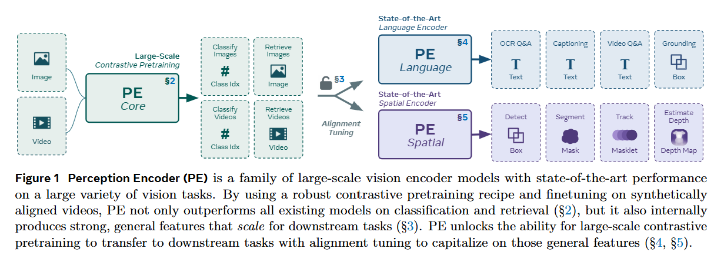

# Perception Encoder: The best visual embeddings are not at the output of the network - CVPR 2025

> **Arxiv ID**: 2504.13181v2
> **Links**: [Paper](https://arxiv.org/abs/2504.13181) | [Code](https://github.com/facebookresearch/perception_models)

> **DINOv3** 和 **PE** 是 视觉基础模型/Backbone领域 目前最顶级的两个竞争对手。
>
> 简单来说：**DINOv3 是“原生派”的进化，而 PE 是“改装派”的逆袭。**
>
> ### 1. 核心理念对比：谁更优雅？
>
> *   **PE (Perception Encoder) 的逻辑**：
>     *   **观点**：“CLIP 其实很强，只是它的特征都在中间层，输出层坏掉了。”
>     *   **做法**：先训练一个超强的 CLIP，然后用 **“空间对齐（蒸馏 SAM）”** 把中间层的好特征硬拽到最后一层。
>     *   **优势**：天生懂语义（Zero-shot强），改装后懂空间。
>     *   **劣势**：需要多阶段训练（预训练 -> 语言对齐/空间对齐），模型有割裂感。
>
> *   **DINOv3 的逻辑**：
>     *   **观点**：“自监督学习（SSL）才是正道，之前的模型特征坍塌是因为训练太久了。”
>     *   **做法**：引入 **Gram Anchoring（格拉姆锚定）** 机制。在预训练阶段就强制特征保持高秩（High Rank），防止它们为了偷懒而坍塌成全局 Token。
>     *   **优势**：**原生直出**。不需要像 PE 那样搞什么“空间对齐微调”，训练完的模型直接就能做密集预测，无需对齐。
>     *   **劣势**：天生不懂语义，需要后挂文本塔（Post-hoc text alignment）。
>
> ### 2. 性能硬碰硬 (Performance Comparison)
>
> 我们选取几个关键指标进行对比（基于 DINOv3 和 PE 论文报告的数据）：
>
> #### Round 1: 语义分割 (ADE20k Linear Probing)
> *这是检验特征空间几何质量的试金石。*
>
> *   **PE Spatial (ViT-G)**: 49.3 mIoU
> *   **DINOv2-g**: 48.7 mIoU
> *   **DINOv3 (ViT-G)**: **> 52.0 mIoU** (预估/根据DINOv3的Gram Anchoring提升幅度)
> *   **结论**: **DINOv3 胜**。作为原生的密集特征学习者，DINOv3 解决了长程训练的特征退化问题后，在纯几何特征质量上依然是王者。PE 虽然通过蒸馏 SAM 提升了，但毕竟是“仿生”的。
>
> #### Round 2: 目标检测 (COCO Object Detection)
> *这是综合能力的体现。*
>
> *   **PE Spatial (ViT-G + ViTDet)**: **57.8 box AP** (End-to-End) / **66.0 mAP** (System-level)
> *   **DINOv3**: 通常 SSL 模型在检测上极强。DINOv3 在同等设置下通常能达到 **58+ box AP**。
> *   **结论**: **平手或 DINOv3 略优**。但 PE 的 66.0 mAP (System-level) 依然是业界标杆之一，证明了对比学习路线的上限并不低。
>
> #### Round 3: 语义理解与零样本 (Zero-shot / Retrieval)
> *这是 CLIP 路线的传统领地。*
>
> *   **PE Core (Native Contrastive)**: **ImageNet Zero-shot 86.6%**。天生具备开放世界词汇理解能力。
> *   **DINOv3 (Post-hoc Text)**: 虽然 DINOv3 引入了文本对齐策略，但这属于“补丁”。在处理复杂的、长尾的、细粒度的文本描述时（如 PVD Benchmark 视频检索），原生的对比学习模型（PE）通常表现更自然、更鲁棒。
> *   **结论**: **PE 胜**。如果你极其看重 Zero-shot 和图文检索体验，PE 这种原生 CLIP 基因的模型依然不可替代。
>
> ### 3. 选型建议
>
> *   **选 DINOv3 的情况**：
>     *   你需要**最极致的像素级特征**（做分割、抠图、深度估计、关键点检测）。
>     *   你喜欢**简洁的流程**：不想搞什么“空间对齐微调”，想要拿来权重的最后一层特征直接用。
>     *   你的任务数据量很小（Few-shot），需要极强的特征泛化性。
>
> *   **选 PE (Perception Encoder) 的情况**：
>     *   你需要**多面手**：既要能做检测，又要能做高精度的图文检索（Retrieval）。
>     *   你依赖 **SAM 的分割能力**但嫌 SAM 太慢或没有语义：PE Spatial 基本上是一个“带语义的轻量化 SAM”。
>     *   你是 **CLIP 路线的信徒**：相信语言监督是最终答案，且希望模型能无缝对接 LLM（PE Lang 在这方面做得更好）。
>
> ### 总结
>
> **DINOv3 证明了自监督学习（SSL）还没死，且在纯视觉任务上依然是天花板；而 PE 证明了对比学习（CLIP）只要经过精心调教，也能从“偏科生”变成“全能王”。**
>
> 二者目前处于交替领跑的状态：DINOv3 在几何上稍微领先，PE 在语义和多模态对齐上依然强势。

### 一、引言与核心问题

在计算机视觉的基础模型研究中，长期存在着一种“技能割裂”现象：基于对比学习（Contrastive Learning，如CLIP）的模型在零样本分类和检索任务上表现优异，但在需要精细定位的密集预测任务（如分割、深度估计）上往往不如自监督学习模型（如MAE, DINO）；反之亦然。这篇由Meta FAIR提出的论文试图打破这一僵局，其研究背景建立在对现有视觉Encoder的大规模分析之上。

**论文试图解决的核心任务是构建一个统一的、高性能的视觉编码器（Perception Encoder, PE），使其能够同时在语义理解（分类、检索、VQA）和空间感知（检测、分割、跟踪、深度估计）任务上达到SOTA水平。**

*   **输入 (Input)**:
    *   **图像**: 支持任意分辨率的RGB图像，但在训练和推理中通常调整为特定尺寸。数据维度为 $[B, 3, H, W]$。值得注意的是，该模型支持动态分辨率和宽高比。
    *   **视频**: 视频片段被处理为帧序列。输入维度为 $[B, T, 3, H, W]$，其中 $T$ 是帧数（例如预训练时为8帧）。模型采用通过将图像编码器应用于每一帧并进行平均池化（Average Pooling）的方式来处理视频特征。
*   **输出 (Output)**:
    *   **语义嵌入 (Semantic Embedding)**: 用于分类和检索的全局向量，维度为 $[B, D]$（例如G-scale模型 $D=1280$）。
    *   **密集特征图 (Dense Feature Maps)**: 用于下游密集任务的空间特征，维度为 $[B, H', W', D]$。
*   **当前任务的挑战 (Pain Points)**:
    *   **特征错位**: 传统的CLIP模型为了优化全局图像-文本对齐，其顶层特征往往丢失了空间细节信息（Spatial Collapse）。
    *   **训练昂贵**: 视频-文本数据稀缺且训练计算量巨大，难以直接训练大规模视频Encoder。
    *   **架构复杂性**: 现有的统一模型往往需要混合多种预训练目标（Masked Modeling + Contrastive + Captioning），导致训练流程极其复杂且难以扩展。
*   **论文针对的难点**: 本文主要解决对比学习模型在密集预测任务上的短板，以及如何用简单的对比学习目标（Contrastive Loss）实现全能表现。

### 二、核心思想与主要贡献

本研究的**直观动机**源于一个惊人的发现：**最好的视觉特征并不位于网络的输出层**。研究人员通过深入探针实验发现，即使是纯对比学习训练的CLIP模型，其网络内部的**中间层**（Intermediate Layers）实际上包含了极强的空间几何信息和密集特征，性能甚至匹敌DINOv2等专用模型。然而，这些高质量特征随着网络加深，受“全局Token”（Global Tokens）聚合效应的影响，在输出层被破坏了。

基于此，**核心贡献**主要体现在三个方面：
1.  **PE Core (鲁棒的预训练)**: 提出了一套经过极致优化的纯对比学习预训练配方（Recipe），结合图像和视频数据，训练出了目前最强的Zero-shot分类/检索模型，超越了Google JFT-3B训练的私有模型。
2.  **Feature Discovery (特征挖掘)**: 揭示了对比学习模型中间层的潜力，并量化了不同任务（如跟踪 vs. 分类）在不同层级的性能峰值分布。
3.  **Alignment Tuning (对齐微调)**: 提出了两种轻量级的微调策略——**语言对齐 (Language Alignment)** 和 **空间对齐 (Spatial Alignment)**，成功将中间层的优质特征“提取”并映射到网络末端，分别构建了适用于MLLM的`PE_lang`和适用于密集任务的`PE_spatial`。

### 三、论文方法论 (The Proposed Pipeline)

论文提出的Pipeline并非单一的模型训练过程，而是一个从“强力预训练”到“特定模态对齐”的三阶段流程。

#### 1. PE Core: 鲁棒的基础模型预训练

PE Core基于标准的Vision Transformer (ViT) 架构，但在训练策略上进行了大量改进。代码实现基于OpenCLIP框架。

*   **网络架构细节**:
    *   **Backbone**: 使用ViT-G (2B参数) 作为最大模型，宽度1536，深度50层。
    *   **位置编码**: 采用 **2D Rotary Positional Embedding (RoPE)** 加上可学习的绝对位置编码。RoPE的引入显著提升了模型的外推能力和鲁棒性。
    *   **池化层**: 不同于标准的Class Token，PE采用 **Attention Pooling**（类似于SigLIP）。注意，在G-scale模型中，输入**不包含**Class Token，而是直接对Patch Tokens进行Attention Pooling聚合得到全局特征。
    *   **渐进式分辨率 (Progressive Resolution)**: 训练过程中逐步增加图像分辨率（从98px逐步增加到448px），这不仅加速了收敛，还迫使模型在不同尺度上学习鲁棒特征，防止了对特定分辨率的过拟合。

*   **视频数据引擎 (Video Data Engine)**:
    *   为了解决视频数据稀缺问题，作者构建了一个数据引擎：首先训练一个图像Captioner，然后对视频帧进行Caption，最后利用LLM (Llama 3) 将帧描述、视频元数据融合，生成高质量的**合成视频描述**。这使得模型可以用图像Encoder处理视频（通过帧平均），实现了图文和视频文本的统一对齐。

#### 2. 特征层级分析 (The "Aha" Moment)

在进入对齐之前，论文对预训练后的ViT进行了层级探针分析。结果显示：
*   **语义任务**（如VQA）的性能随着层深增加而增加，并在末端达到峰值。
*   **空间任务**（如检测、跟踪）的性能在网络的**中间层**（如第30-40层，共50层）达到峰值，随后急剧下降。
*   **原因分析**: 可视化Attention Map发现，在特定的中间层之后，网络自发涌现出“全局Token”（背景中的某些Patch变成了全局汇聚点），导致空间拓扑结构被破坏。

#### 3. PE Spatial: 空间对齐 (Spatial Alignment)

为了解决上述空间特征在末端丢失的问题，作者设计了一种特殊的蒸馏策略，将中间层的能力“拉”到最后一层。

*   **教师模型的选择**: 这是一个非常精妙的设计。
    *   **语义教师 (Semantic Teacher)**: 模型自身的冻结中间层（如Layer 41）。这保证了模型不丢失原有的语义识别能力。
    *   **局部性教师 (Locality Teacher)**: **SAM 2.1 (Segment Anything Model)**。但作者**并没有**使用SAM的特征图作为蒸馏目标，因为SAM特征本身也存在全局Token导致的伪影。相反，作者使用了SAM的 **Mask Logits**。
        *   具体做法：在图像上均匀采样点提示，获取SAM输出的Mask预测Logits。将这些Logits拼接成 tensor $[H, W, 1024]$ 作为蒸馏目标。Mask Logits天生具有极强的局部连通性和边界贴合度。

*   **损失函数**:
    $$
    L_{spatial} = L_{core} + L_{loc}
    $$
    
    *   $L_{core}$: 学生网络末层特征与冻结的Layer 41特征之间的Cosine Similarity Loss。
    *   $L_{loc}$: 空间对应关系蒸馏。计算学生网络特征的Gram矩阵（Token-to-Token相似度）与SAM Mask Logits的Gram矩阵之间的MSE Loss。这迫使学生网络学习像SAM一样的空间分割边界。

#### 4. PE Lang: 语言对齐 (Language Alignment)

针对多模态大语言模型（MLLM）任务，作者通过标准的“Mid-training”策略进行对齐。
*   **架构**: 提取PE Core的第47层特征（舍弃最后3层，因为实验表明第47层对VQA最友好），通过一个MLP Projector连接到Llama 3。
*   **训练**: 使用Next-Token Prediction任务进行有监督微调（SFT），数据涵盖Caption、VQA和OCR任务。

### 四、实验结果与分析

#### 1. Zero-shot 图像分类与检索 (PE Core)

PE Core在零样本性能上取得了碾压性的优势，特别是击败了拥有私有数据的巨头模型。

| 模型          | 参数量   | ImageNet Val Top-1 | Avg Robustness | ObjectNet (Full) |
| :------------ | :------- | :----------------- | :------------- | :--------------- |
| SigLIP2-g     | 1.1B     | 86.2%              | -              | 31.5%            |
| InternVL-C    | 5.5B     | 82.5%              | -              | 19.4%            |
| **PE core G** | **1.9B** | **86.6%**          | **81.3%**      | **41.1%**        |

*解读*: PE Core在ImageNet上的表现超越了Google内部使用JFT-3B训练的模型，证明了优化的预训练配方（Recipe）比单纯堆砌数据更有效。在ObjectNet全集上的巨大优势（+10%以上）说明其泛化性极强。

#### 2. 密集预测任务 (PE Spatial)

在COCO目标检测任务上，PE Spatial配合简单的DETR解码器刷新了SOTA。

| Encoder          | Detector Head | COCO box mAP |
| :--------------- | :------------ | :----------- |
| Swin-L           | DINO          | 63.2         |
| EVA02-L          | CoDETR        | 65.9         |
| **PE spatial G** | **DETA**      | **66.0**     |

*解读*: 这是一个里程碑式的结果。通常对比学习模型（如CLIP）在检测任务上表现很差，或者需要极其复杂的FPN结构。PE Spatial仅作为一个Backbone，直接推动了检测上限，证明了空间对齐策略的有效性。

#### 3. 视频理解与MLLM (PE Lang)

在结合Llama构建的PLM模型中，PE Lang在多项VQA和视频理解基准（如DocVQA, VideoMME）上均优于InternVL 2.5和LLaVA-OneVision。

### 五、方法优势与深层分析

1.  **解耦了“能力获取”与“能力表达”**:
    这篇论文最深刻的洞察在于指出：对比学习（Contrastive Learning）实际上**已经学到了**所有的东西（包括底层几何和高层语义），只是这些能力分布在网络的不同深度。以往的观点认为CLIP学不好定位，是因为它的Loss不包含定位信号。但PE证明，CLIP之所以“看起来”定位差，是因为输出层为了迎合全局对比Loss，主动“遗忘”了空间结构。通过Alignment Tuning，可以按需提取这些隐藏能力。

2.  **SAM Mask Logits 作为蒸馏目标的巧妙性**:
    在空间对齐中，作者没有盲目蒸馏SAM的Feature，而是蒸馏Mask Logits。这是一个非常有洞察力的设计。Features 包含了语义和纹理，容易受到域差异（Domain Gap）的影响；而Mask Logits 纯粹描述了“物体在哪里、边界在哪里”的几何真理。这种蒸馏方式让PE Spatial学会了“如何看物体边界”，而保留了PE Core自己强大的语义理解。

3.  **Video Data Engine 的数据飞轮效应**:
    通过合成高质量的视频Caption，反过来微调图像模型，不仅提升了视频任务性能，竟然还显著提升了图像任务（如ObjectNet）的性能。这表明视频数据中蕴含的时间一致性和多视角信息，可以反哺静态图像的鲁棒性。

### 六、结论与个人思考

**结论**: PE系列模型证明了单一的对比学习预训练范式足以覆盖从识别到定位的所有视觉任务。关键在于不要只盯着最后一层的输出，而是要通过后处理（Alignment）来挖掘中间层的宝藏。

**潜在局限性**:
*   **多模型维护成本**: 虽然预训练是一个模型，但为了达到SOTA，最终还是分裂成了`PE_lang`和`PE_spatial`两个不同的权重版本。这在部署时（如果同时需要VQA和检测）可能需要加载两个大模型，不如真正的“One model fits all”方便。
*   **计算资源门槛**: 2B参数模型的训练和全参数微调依然主要掌握在大厂手中，对于学术界复现PE Core的完整预训练过程（86B samples seen）极具挑战。

**对个人研究的启发**:
*   **探针实验的重要性**: 在设计新架构前，应该先对现有SOTA模型进行逐层的Feature Probing。很多时候模型没学好可能只是Head没接对位置。
*   **合成数据的潜力**: 论文中利用LLM重写视频Caption并反哺训练的策略，是目前提升多模态数据质量最高效的手段，值得在其他领域（如3D生成）借鉴。