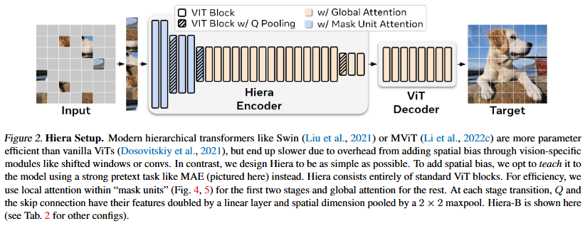

# 论文标题: Hiera: A Hierarchical Vision Transformer without the Bells-and-Whistles - arXiv 2023

### 一、引言与核心问题

本研究的背景源于计算机视觉领域中视觉Transformer (ViT) 的演进。标准的ViT虽然结构简洁、可扩展性强，但在参数利用效率上有所欠缺，因为它在整个网络中都使用固定的空间分辨率和通道数。为了解决这一问题，研究界借鉴了卷积神经网络 (CNN) 的成功经验，发展出了“分层”或“多尺度”的ViT架构，如Swin Transformer和MViT。这些模型通过在网络深层逐步降低空间分辨率、增加通道数来高效地学习从低阶到高阶的视觉特征。然而，在追求更高性能的过程中，这些分层ViT架构引入了大量为视觉任务特化设计的复杂组件，例如卷积层、窗口注意力 (Window Attention)、相对位置编码等“小零件 (bells-and-whistles)”。这些组件虽然带来了不错的精度和理论上更低的浮点运算数 (FLOPs)，但其复杂的实现却显著拖慢了模型在真实硬件上的训练和推理速度，并给适配高效的自监督预训练方法（如掩码自编码器MAE）带来了挑战。

*   **论文试图解决的核心任务是什么？**

    这篇论文的核心任务是图像和视频的特征表示学习，最终服务于下游的分类、检测和分割等任务。它旨在设计一个全新的骨干网络 (Backbone)，在保持分层架构优势的同时，实现极致的简洁、高效和高性能。

    *   **输入 (Input)**: 输入数据可以是单张图像或视频片段。
        *   对于**图像**，输入形态为 `[B, C, H, W]`，其中 `B` 是批量大小，`C=3` 是颜色通道，`H` 和 `W` 是图像的高和宽（例如，`224x224`）。
        *   对于**视频**，输入形态为 `[B, T, C, H, W]`，其中 `T` 是视频帧数（例如，`16` 帧）。
        输入数据首先会被一个“展平-嵌入 (Patchify)”层处理，该层类似于一个大步长的卷积。例如，对于一个 `4x4` 的Patch，步长为 `4`，它会将 `224x224` 的图像转换为 `56x56` 的网格，每个网格是一个独立的Token，因此初始序列的形状为 `[B, 56*56, D]`，其中 `D` 是初始的嵌入维度。

    *   **输出 (Output)**: 输出是经过骨干网络编码后的高级特征图。
        *   对于**分类任务**，这些特征会经过一个全局平均池化层和一个全连接分类头，最终输出一个类别概率向量，其形状为 `[B, N_classes]`，其中 `N_classes` 是类别总数。
        *   对于**检测和分割任务**，输出的是多尺度的特征图，这些特征图将被送入如FPN (Feature Pyramid Network) 等检测头中，最终输出边界框和掩码。

    *   **任务的应用场景**: 作为一个通用的视觉骨干网络，Hiera可广泛应用于图像分类、物体检测、实例分割、视频动作识别和视频中的时空动作定位等几乎所有主流的计算机视觉任务。

    *   **当前任务的挑战 (Pain Points)**:
        1.  **架构复杂性与实际速度的矛盾**: 现有的分层ViT为了引入归纳偏置 (Inductive Bias)——例如局部性 (Locality)——而集成了卷积、移位窗口等复杂操作。这导致理论计算量 (FLOPs) 与实际吞吐量 (Throughput) 之间出现巨大鸿沟，模型“看起来快，用起来慢”。
        2.  **与稀疏预训练的不兼容性**: 高效的掩码自编码器 (MAE) 预训练通过随机“删除”大部分图像块来实现加速，这是一种稀疏化的训练方式。然而，依赖于完整2D网格结构的卷积和窗口注意力机制在这种稀疏输入下会失效或变得异常复杂，阻碍了分层模型从这种强大预训练范式中受益。

    *   **论文针对的难点**: 本文精准地聚焦于上述两大难点。它旨在彻底简化分层ViT的架构，移除所有非必要的复杂组件，从而大幅提升模型的实际运行速度，并使其能够原生、高效地与稀疏的MAE预训练框架无缝结合。

### 二、核心思想与主要贡献

*   **直观动机与设计体现**: 本研究的直观动机源于一个深刻的洞察：架构层面的归纳偏置（如局部性）是否必须通过复杂的、手工设计的模块来“硬编码”？论文作者给出的答案是否定的。他们推断，一个足够强大的自监督预训练任务，能够让模型从海量数据中“学习”到这些必要的空间先验知识。这一动机直接体现在他们的技术设计中：他们选择了一个已有的复杂分层模型 (MViTv2) 作为起点，然后进行了一系列激进的“减法”，在强大的MAE预训练的加持下，逐步移除卷积、相对位置编码、池化注意力等复杂组件，最终只保留了最核心、最标准的Transformer模块，并构建出了Hiera。

*   **与相关工作的比较与创新**:
    本研究与MViTv2和Swin Transformer等分层视觉Transformer的工作最为相关。不同于这些工作通过增加架构复杂性来提升性能，Hiera反其道而行之，探索了架构简化的极限。其核心创新在于**证明了“强大的预训练”可以有效替代“复杂的架构设计”**。它并非简单地移除组件，而是提出了一套完整的简化流程，并设计了如“掩码单元注意力 (Mask Unit Attention)”等巧妙机制来适配简化后的架构和MAE预训练，最终实现了性能和速度的双重超越。

*   **核心贡献与创新点**:
    1.  **提出了Hiera架构**: 创造了一个极致简洁且高效的分层视觉Transformer。Hiera完全由标准的ViT模块构成，不含任何卷积、窗口注意力或其他定制化的视觉组件，从而在概念上和实现上都极为简单。
    2.  **验证了预训练可替代架构偏置**: 强有力地证明了，通过MAE这种强大的自监督预训练，模型可以自行学习到必要的空间归纳偏置，从而使得过去被认为是“必需品”的复杂架构设计变得冗余。
    3.  **实现了速度与精度的SOTA**: Hiera在保持甚至超越先前复杂模型精度的同时，实现了显著的速度提升（在图像任务上快1.3-2.4倍，在视频任务上快2.3-5.1倍），尤其在视频识别任务上树立了新的SOTA（State-of-the-Art）标杆。

### 三、论文方法论 (The Proposed Pipeline)

* **整体架构概述**

  Hiera的整体工作流程分为两个阶段：首先是基于掩码自编码器 (MAE) 的自监督预训练，然后是在各种下游任务上进行监督微调。其核心是一个纯粹由标准Transformer模块构成的分层编码器 (Encoder)。在预训练阶段，输入图像或视频的大部分图块 (patches) 会被随机掩码并“丢弃”，编码器仅处理剩余的可见图块。随后，一个轻量级的解码器 (Decoder) 会尝试根据编码后的特征来重建原始的被掩码内容。整个流程的设计哲学是化繁为简，将学习空间先验的重任从架构设计完全转移到预训练任务本身。

* **详细网络架构与数据流**

  Hiera的架构由一个展平-嵌入层 (Patch Embedding) 和四个分层阶段 (Stage) 组成。数据流动的过程如下：

  1.  **数据预处理与嵌入**:
      *   输入图像 `[B, 3, 224, 224]` 首先通过一个卷积核大小为4x4、步长为4的嵌入层，将其转换为 `[B, 56*56, 96]` 的Token序列 (以Hiera-B为例，初始通道数为96)。这一步将图像网格化，为Transformer处理做准备。

  2.  **MAE掩码**:
      *   与标准MAE直接在Token层面进行掩码不同，Hiera引入了**掩码单元 (Mask Unit)** 的概念。一个掩码单元是比Token更粗粒度的区域，例如`32x32`像素。对于`224x224`的输入，图像被划分为`7x7`个掩码单元。掩码操作作用于这些单元，例如，在0.6的掩码率下，`49`个单元中的约`29`个会被丢弃。这样做的好处是，即使在早期阶段Token分辨率很高（例如一个掩码单元对应`8x8`个Token），也能保证掩码的语义连贯性。编码器只接收未被掩码的单元所对应的Token序列。

  3.  **Hiera编码器 (四阶段分层结构)**:
      *   **Stage 1 & 2 (早期阶段，高分辨率)**:
          *   **模块类型**: 由多个标准的Transformer Block构成。
          *   **设计细节**: 为了效率，这两个阶段的注意力机制被设计为**掩码单元注意力 (Mask Unit Attention)**。这是一种局部注意力，其计算范围被限制在每个可见的掩码单元内部。由于掩码单元在输入时已经确定，这种局部注意力无需额外的窗口划分或移位操作，实现简单且没有计算开销。
          *   **形状变换**: 在每个阶段内部，Token序列的长度和维度保持不变。
      *   **阶段过渡 (Downsampling)**:
          *   在每个阶段之间，通过一个`2x2`的最大池化层 (MaxPool2d) 将空间分辨率减半（即Token数量减少为1/4），然后通过一个线性层 (Linear Layer) 将通道维度翻倍。例如，从Stage 1到Stage 2，Token序列的形状从 `[B, N, C]` 变为 `[B, N/4, 2*C]`。
      *   **Stage 3 & 4 (后期阶段，低分辨率)**:
          *   **模块类型**: 同样由标准的Transformer Block构成。
          *   **设计细节**: 在这两个阶段，由于Token序列长度已经大幅缩短，模型转而使用计算成本可接受的**全局自注意力 (Global Self-Attention)**，从而能够捕捉长距离依赖关系。
          *   **结合消融实验的作用分析**: 论文的Table 1清晰地展示了这一简化流程的有效性。
              *   将MViTv2中的相对位置编码替换为简单的绝对位置编码，速度提升且精度不降 (a)。
              *   将所有卷积替换为最大池化，并最终演化为“核大小=步长”的无重叠池化，彻底摆脱了对2D网格的依赖，移除了为稀疏训练设计的复杂“填充”技巧，同时带来了20%的速度提升和精度增长 (b, c, d)。
              *   将MViTv2复杂的池化注意力替换为掩码单元注意力，进一步带来了高达32%的速度提升，而精度几乎无损 (f)。这证明了在MAE预训练下，这些复杂模块是冗余的。

  4.  **MAE解码器**:
      *   解码器是一个轻量级的标准ViT。它的输入包括编码器输出的可见Token，以及为每个被掩码位置准备的可学习的 `[MASK]` Token。解码器通过对这些Token进行处理，最终通过一个线性层预测每个被掩码图块的原始像素值。

* **损失函数 (Loss Function)**

  *   **设计理念**: 预训练阶段的损失函数非常简单，遵循了MAE的设计。它计算解码器重建的图块与原始图块之间的**均方误差 (Mean Squared Error, MSE)**。
      $$
      \mathcal{L}_{\text{pretrain}} = \frac{1}{|\mathcal{M}|} \sum_{i \in \mathcal{M}} \| \mathbf{x}^{\text{recon}}_i - \mathbf{x}^{\text{orig}}_i \|^2_2
      $$
      其中，$ \mathcal{M} $是被掩码图块的索引集合，$ \mathbf{x}^{\text{recon}}_i $是重建的第$i$个图块，$ \mathbf{x}^{\text{orig}}_i $是原始的第$i$个图块。
  *   **关注重点**: 该损失函数直接关注像素级别的重建保真度。论文也探索了使用HOG (Histogram of Oriented Gradients) 特征作为重建目标，发现在某些设置下能带来轻微的性能提升 (Table 3c)。
  *   **对性能的贡献**: 这种简单的像素级重建任务，迫使模型学习到了丰富的、具有空间理解能力的视觉表示，这正是Hiera能够移除硬编码空间偏置的底气所在。

* **数据集 (Dataset)**
  *   **所用数据集**: 论文在多个大规模数据集上进行了实验。
      *   **预训练**: 主要使用 **ImageNet-1K (IN1K)** 进行图像模型的预训练，使用 **Kinetics-400 (K400)** 进行视频模型的预训练。
      *   **评估**: 在包括IN1K、Kinetics-400/600/700、Something-Something-v2 (SSv2)、COCO、AVA v2.2、iNaturalist和Places在内的多个基准上进行了广泛评估。
  *   **特殊处理**: 论文遵循了MAE等工作的标准数据增强策略，如随机裁剪、水平翻转等。在视频任务中，为了处理时空信息，Hiera的掩码单元在时间维度上也进行了扩展，例如变为`2 frames x 32x32 pixels`。除此之外，没有对数据集进行其他特殊的处理，体现了其方法的通用性。

### 四、实验结果与分析

*   **核心实验结果**

    Hiera在多个基准测试中取得了极为出色的结果，尤其是在速度和视频任务上。以下是ImageNet-1K图像分类和Kinetics-400视频分类任务上的关键结果对比：

    **ImageNet-1K (Top-1 准确率)**
    | 模型        | 预训练     | 准确率 (%) | FLOPs (G) |
    | ----------- | ---------- | ---------- | --------- |
    | ViT-L       | MAE        | 85.9       | 62        |
    | MViTv2-L    | Supervised | 85.3       | 42        |
    | MCMAE-L     | MCMAE      | 86.2       | 94        |
    | **Hiera-L** | **MAE**    | **86.1**   | **40**    |

    **Kinetics-400 (Top-1 准确率)**
    | 模型        | 预训练   | 准确率 (%) | FLOPs (G) x 视图 |
    | ----------- | -------- | ---------- | ---------------- |
    | ViT-L       | MAE      | 85.2       | 597 x 3 x 5      |
    | MViTv2-L    | MaskFeat | 84.3       | 377 x 1 x 10     |
    | **Hiera-L** | **MAE**  | **87.3**   | **413 x 3 x 5**  |

    *   **结果解读**: 在ImageNet-1K上，Hiera-L以远低于ViT-L和MCMAE-L的FLOPs，达到了极具竞争力的86.1%准确率，显著优于同为分层架构的MViTv2-L。在Kinetics-400视频分类任务上，Hiera-L的优势更为明显，准确率达到87.3%，比之前的SOTA模型ViT-L MAE高出2.1个百分点，同时FLOPs更低，实际速度快2.3倍，确立了新的性能前沿。

*   **消融研究解读**

    Table 1的消融研究是理解Hiera设计哲学的关键。它系统地展示了从MViTv2到Hiera的每一步简化操作带来的影响。实验证明，移除相对位置编码、用无重叠池化替代卷积、删除残差连接、用掩码单元注意力替换池化注意力，这些步骤不仅没有损害模型精度，反而在MAE预训练的帮助下，共同作用，使得模型的推理速度（im/s）从253.3提升到了惊人的531.4，实现了超过100%的加速，同时精度还略有提升（从85.6%到85.6%）。这雄辩地证明了这些复杂组件的非必要性。

*   **可视化结果分析**

    论文中的性能-速度对比图（Figure 1, 3）直观地展示了Hiera的优势。在这些图中，Hiera的模型系列（B, L, H等）总是位于图表的右上区域，代表着在每个模型规模下，它都比之前的SOTA方法（如ConvNextV2, ViT）同时拥有更高的准确率和更快的推理速度，形成了一个新的“帕累托前沿 (Pareto Frontier)”。

### 五、方法优势与深层分析

*   **架构/设计优势**

    *   **优势详述**: Hiera最大的优势在于其**极致的简洁性**。
        1.  **高硬件亲和力**: 由于只使用标准的Transformer模块和简单的最大池化，Hiera的计算模式非常规整，没有复杂的内存访问模式（如Swin的移位窗口）或异构计算（卷积与注意力的混合）。这使得它能被现代GPU等硬件高效执行，从而将理论上的FLOPs优势转化为实际的吞吐量优势。
        2.  **易于实现与扩展**: 简单的架构意味着更少的代码量、更低的维护成本和更容易的调试。同时，扩展到更大或更小的模型（如Hiera-T到Hiera-H）也只需简单地调整深度、宽度和头数等超参数，可扩展性极佳。
        3.  **与稀疏训练的完美契合**: 架构中没有任何组件依赖于完整的2D网格，这使得它能够原生、无痛地接入MAE的稀疏训练范式，充分享受其带来的训练加速红利（训练速度比监督学习快3倍，比MaskFeat快4.2倍，见Figure 7）。

    *   **原理阐释**: 这些优势背后的核心原理是**将学习归纳偏置的负担从架构设计转移到了数据驱动的预训练上**。MAE通过高掩码率的重建任务，迫使模型去理解物体的结构、场景的上下文等空间关系，从而内隐地学习到了强大的空间先验。一旦模型具备了这种能力，原本用于手动注入这些先验的复杂架构组件自然就变得多余了。

*   **解决难点的思想与实践**

    Hiera通过“**以简驭繁**”的核心思想，成功解决了当前分层ViT面临的“架构复杂性与实际速度脱节”以及“与稀疏预训练不兼容”两大难点。在实践中，它通过以下手段实现：
    1.  **釜底抽薪式的简化**: 它没有在现有框架上小修小补，而是直接移除了问题的根源——那些导致复杂和不兼容的视觉特化模块。
    2.  **拥抱强大的预训练**: 它没有因为简化架构而牺牲性能，而是通过引入MAE这一强大的自监督学习范式，为模型补上了缺失的“内功”，让模型从数据中学会智慧。
    3.  **巧妙的适配设计**: 针对简化后的架构和MAE的特性，设计了“掩码单元”和“掩码单元注意力”等轻量级但高效的机制，确保了二者能够协同工作，发挥出最大效能。

### 六、结论与个人思考

*   **论文的主要结论回顾**

    本论文成功地设计并验证了一款名为Hiera的极简分层视觉Transformer。通过证明强大的MAE预训练可以替代复杂的架构设计来学习空间偏置，Hiera在移除所有“bells-and-whistles”后，不仅没有损失性能，反而实现了在多个图像和视频基准上的精度与速度的双重提升，特别是在视频理解领域树立了新的SOTA。

*   **潜在局限性**

    1.  **对预训练的重度依赖**: Hiera的卓越性能高度依赖于大规模的MAE自监督预训练。从Figure 8的“从零开始的监督训练”实验可以看出，在没有MAE预训练的情况下，移除那些“bells-and-whistles”会导致性能显著下降。这意味着Hiera范式可能不适用于数据量有限、无法进行有效预训练的场景。
    2.  **通用性待进一步验证**: 尽管论文在多个主流视觉任务上进行了验证，但其在一些更特殊的领域，如医学影像、遥感图像或3D视觉任务中的表现仍是未知数。

*   **未来工作方向**

    1.  **探索更高效的预训练任务**: 是否存在比MAE更高效或能教会模型更丰富先验知识的预训练任务，从而可以进一步简化模型或提升性能？
    2.  **向其他模态迁移**: Hiera的“简化架构+强力预训练”的设计哲学是否可以成功迁移到其他数据模态，例如3D点云、音频频谱图或多模态数据处理中？
    3.  **与硬件的协同设计**: Hiera的简洁架构为软硬件协同设计提供了巨大的潜力。未来的工作可以探索针对Hiera这类规整计算模式的专用硬件加速器，以求达到极致的能效比。

*   **对个人研究的启发**

    这篇论文给我最大的启发是，在模型设计中要敢于做“减法”，并重新审视“架构”与“学习”之间的关系。很多时候，我们倾向于通过不断叠加复杂模块来解决问题，而Hiera提醒我们，回归本源，投资于更强大的学习范式，或许是通往更高性能和更高效率的更优路径。它鼓励我们去思考，在特定的学习框架下，哪些是真正不可或缺的核心组件，哪些又是可以被学习本身所替代的“脚手架”。