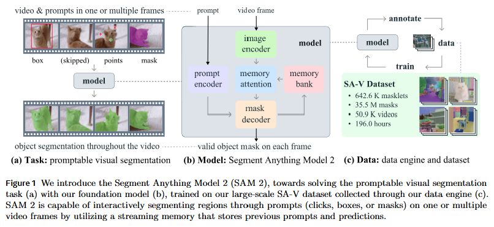
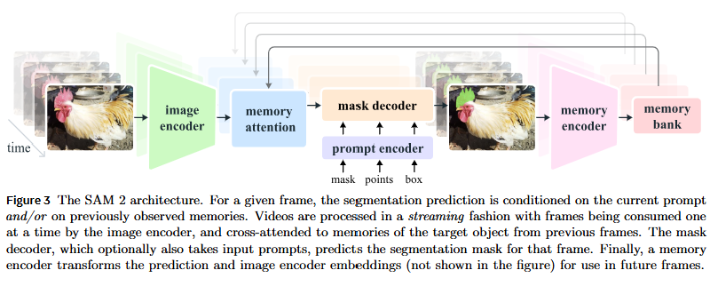

# 论文标题: SAM 2: Segment Anything in Images and Videos - arXiv 2024

### 一、引言与核心问题

*   **研究背景与重要性**
    Segment Anything Model (SAM) 的第一代开创了通用的、可提示的图像分割新范式，展现了基础模型在计算机视觉领域的巨大潜力。然而，图像本质上是现实世界的静态快照，无法捕捉物体的动态变化和时间连续性。随着视频内容的爆发式增长，以及在增强现实（AR）、虚拟现实（VR）、机器人技术、自动驾驶和视频编辑等领域的广泛应用，将分割能力从静态图像扩展到动态视频序列，实现一个能够“分割万物”的通用视觉系统，已成为一个迫切且重要的研究方向。SAM 2 正是在这一背景下，致力于将 SAM 的卓越能力自然地泛化到视频领域，解决视频中物体分割的独特挑战。

*   **论文试图解决的核心任务是什么？**
    论文的核心任务是**可提示化视觉分割 (Promptable Visual Segmentation, PVS)**，这是一个将图像分割泛化到视频领域的统一任务。该任务旨在根据用户在任意视频帧上提供的交互式提示（如点、框、掩码），对感兴趣的目标进行时空（spatio-temporal）分割，即在整个视频序列中生成并跟踪该目标的精确掩码（论文中称为 'masklet'）。

    *   **输入 (Input)**:
        1.  **视频 (Video)**: 一个视频序列，可以被视为一系列的图像帧。其数据维度通常为 `[Batch_size, Num_frames, Channels, Height, Width]`。在SAM 2的流式处理架构中，模型一次处理一帧，即 `[B, C, H, W]`。
        2.  **提示 (Prompts)**: 用户在任意一帧或多帧上提供的交互式输入。
            *   **点 (Points)**: 一系列点的坐标及其标签（前景/背景）。数据维度为 `[Batch_size, Num_points, 2]` (xy坐标) 和 `[Batch_size, Num_points]` (标签)。
            *   **框 (Boxes)**: 矩形边界框。数据维度为 `[Batch_size, 4]` (xyxy坐标)。
            *   **掩码 (Masks)**: 粗略的分割掩码。数据维度为 `[Batch_size, 1, H, W]`。

    *   **输出 (Output)**:
        *   **时空掩码 (Spatio-temporal Mask / Masklet)**: 模型为被提示的物体在视频的每一帧上生成的分割掩码序列。对于单帧的输出，其数据维度为 `[Batch_size, 1, H, W]`，表示一个二值的分割结果。整个视频的输出则是一个维度为 `[Num_frames, 1, H, W]` 的掩码序列。

    *   **任务的应用场景**:
        PVS 任务在多个领域有广泛应用，包括但不限于：
        *   **视频编辑**: 快速抠图、对象替换、局部调色等。
        *   **自动驾驶**: 对动态障碍物（如行人、车辆）进行持续跟踪和分割。
        *   **机器人与AR/VR**: 理解和交互环境中特定物体的时空范围。
        *   **医学影像分析**: 在动态影像（如超声波视频）中跟踪器官或病变区域。

    *   **当前任务的挑战 (Pain Points)**:
        将分割从图像扩展到视频引入了新的挑战：
        1.  **外观剧变**: 物体在视频中可能因运动、形变、光照变化、姿态改变等因素导致外观发生显著变化。
        2.  **遮挡与重现**: 物体可能被其他物体部分或完全遮挡，然后在后续帧中重新出现，模型需要维持对该物体的“记忆”。
        3.  **运动模糊与低分辨率**: 视频帧的质量通常低于高质量静态图像，运动模糊和较低的分辨率增加了分割的难度。
        4.  **计算效率**: 实时处理长视频序列对模型的计算效率提出了极高要求。
        5.  **交互修正的复杂性**: 传统的“SAM + 跟踪器”分离式方案在跟踪失败时，用户需要重新在当前帧进行复杂的标注（类似第一帧），而无法利用已有的上下文信息进行轻量级修正。

    *   **论文针对的难点**:
        SAM 2 主要聚焦于解决上述所有难点，特别是**通过一个统一的模型架构，有效处理时间连续性、物体外观变化和遮挡问题，并提供一个高效、轻量级的交互修正机制**（难点1, 2, 5）。同时，其流式处理架构也旨在实现高计算效率（难点4）。

### 二、核心思想与主要贡献

*   **直观动机与设计体现**
    SAM 2 的核心动机是将“图像视为单帧视频”，从而设计一个统一的模型架构来处理图像和视频分割。其关键洞察是，视频分割的核心在于利用时间上下文信息。这一动机直接体现在其**流式记忆架构 (streaming memory architecture)** 中：模型在处理当前帧时，不仅依赖当前帧的视觉信息和用户提示，还会通过一个**记忆注意力模块 (Memory Attention)** 回溯并利用存储在**记忆库 (Memory Bank)** 中的过去帧的信息（包括视觉特征和分割结果）。当模型处理单张图像时，记忆库为空，模型行为退化为标准的SAM，从而实现了对图像和视频任务的统一。

*   **与相关工作的比较与创新**
    与最相关的工作——“SAM + 独立视频跟踪器（如XMem）”的分离式方案相比，SAM 2 的创新在于其**端到端的统一模型**。分离式方案中，SAM仅用于生成初始帧或修正帧的掩码，而跟踪器负责传播。这种方式的弊端是两个模块间信息割裂，跟踪失败后修正成本高。SAM 2 将分割和跟踪能力融合在一个模型中，通过共享的记忆机制，使得模型在任何一帧的修正（例如，一个简单的点击）都能利用整个历史上下文，从而实现更高效、更鲁棒的交互式修正。

*   **核心贡献与创新点**
    1.  **统一的模型与任务**: 提出了一个统一的、可提示化的视觉分割（PVS）任务，并通过一个单一的、具备流式记忆能力的Transformer架构（SAM 2），同时解决了图像和视频中的“分割万物”问题。
    2.  **高效的数据引擎与大规模数据集**: 构建了一个“模型在环路中” (model-in-the-loop) 的高效数据引擎，利用SAM 2辅助标注，创建并发布了迄今为止最大的视频分割数据集 **SA-V (Segment Anything Video)**，包含超过64万个时空掩码（masklets），极大地推动了该领域的发展。
    3.  **卓越的性能与效率**: 实验证明，SAM 2 在视频分割任务上，相比之前的方法，交互次数减少了3倍以上，同时精度更高；在图像分割任务上，比第一代SAM快6倍，且精度相当或更高。

### 三、论文方法论 (The Proposed Pipeline)

*   **整体架构概述**
    SAM 2 的整体架构是一个流式处理模型。对于视频中的每一帧，它首先通过一个图像编码器提取该帧的视觉特征。然后，一个核心的**记忆注意力模块**会将当前帧的特征与存储在**记忆库**中的历史信息（过去帧的特征和分割掩码的编码）进行融合，生成一个包含了时空上下文的特征表示。最后，一个与SAM类似的**提示编码器和掩码解码器**会利用这个上下文感知的特征和用户的即时提示（点、框等），预测出当前帧的分割掩码。这个新生成的掩码随后会被一个**记忆编码器**处理，形成新的记忆存入记忆库，供后续帧使用。

*   **详细网络架构与数据流**
    
    
    
    *   **Image Encoder (图像编码器)**:
        *   **模块类型**: 论文使用了一个经过MAE预训练的Hiera ViT作为图像编码器。Hiera是一个层级式（hierarchical）的编码器。
        *   **设计细节**: 对于输入的每一帧图像（例如 `[1, 3, H, W]`），编码器会输出多尺度的特征图【通常结合FPN】。SAM 2 主要使用其输出的 stride=16 的特征图作为主要的视觉嵌入。
        *   **形状变换**: `[B, 3, H, W]` -> `[B, C, H/16, W/16]`。同时，它也提供 stride=4 和 stride=8 的高分辨率特征图，供后续的掩码解码器使用以提升细节精度。
        *   **作用分析**: 为每一帧提供一个与时间无关的、纯粹的视觉特征表示（unconditioned tokens）。这一步在整个视频处理中对每一帧只执行一次，保证了效率。
    
    *   **Memory Bank & Memory Encoder (记忆库与记忆编码器)**:
        *   **模块类型**: 记忆库是一个概念上的存储单元，通过一个FIFO（先进先出）队列管理。记忆编码器是一个轻量级的卷积网络。
        *   **设计细节**: 当一帧的掩码被预测出来后（例如 `[B, 1, H, W]`），记忆编码器首先通过`MaskDownSampler`（一个卷积网络）对掩码进行下采样，使其尺寸与视觉特征图对齐（`[B, C_mask, H/16, W/16]`），然后将其与该帧原始的、未经记忆融合的视觉特征（`[B, C, H/16, W/16]`）逐元素相加，再通过一个Fuser模块（如`CXBlock`）进行融合，生成该帧的**记忆特征 (memory feature)**。
        *   **形状变换 (Memory Encoder)**: (Input Mask `[B, 1, H, W]` + Input Feature `[B, C, H/16, W/16]`) -> Memory Feature `[B, C_mem, H/16, W/16]`。
        *   **数据流**: 记忆库存储两种记忆：1) 用户提供提示的帧（prompted frames）的记忆；2) 最近的N个（默认为6个）未被提示的、由模型自动预测的帧的记忆。此外，它还存储**对象指针 (object pointers)**，这是一个从掩码解码器输出token中提取的轻量级向量，用于表示物体的高层语义信息。
    
    *   **Memory Attention (记忆注意力模块)**:
        *   **模块类型**: 一个多层的Transformer解码器结构，每一层包含自注意力、交叉注意力和MLP。
        *   **设计细节**:
            *   **输入**:
                *   Query (Q): 当前帧的视觉特征，`[B, C, H/16, W/16]` -> `[B, HW/256, C]`。
                *   Key (K) & Value (V): 从记忆库中取出的所有历史记忆特征和对象指针。
            *   **处理流程**: 在每个`MemoryAttentionLayer`中，当前帧的特征首先经过一个**自注意力**层，以整合其内部的空间信息。然后，通过一个**交叉注意力**层，向记忆库中的历史记忆（包括空间特征图和对象指针）进行查询，从而将时间上下文信息注入到当前帧的特征中。
        *   **形状变换**: (Current Feature `[B, HW/256, C]` + Memories `[B, N_mem*HW/256 + N_ptr, C]`) -> Conditioned Feature `[B, HW/256, C]`。
        *   **作用分析**: 这是实现时间感知的核心。通过与历史信息交互，模型能够理解物体的运动轨迹，即便在当前帧被遮挡或外观变化，也能借助历史记忆进行稳定分割。
    
    *   **Prompt Encoder & Mask Decoder (提示编码器与掩码解码器)**:
        *   **模块类型**: 结构与第一代SAM基本一致。`PromptEncoder` 将稀疏（点、框）和稠密（掩码）的提示编码为嵌入向量。`MaskDecoder` 是一个双向Transformer，用于在提示嵌入和图像特征嵌入之间进行信息交互。
        *   **设计细节**:
            *   **输入**:
                1.  经过记忆注意力模块调节后的**上下文感知特征 (conditioned feature)**。
                2.  用户在当前帧提供的提示，由`PromptEncoder`编码后的嵌入。
            *   **输出**:
                1.  **分割掩码 (Masks)**: `[B, num_masks, H, W]`，支持多掩码输出以处理歧义性。
                2.  **IoU分数 (IoU scores)**: `[B, num_masks]`，对每个掩码质量的预测。
                3.  **对象指针 (Object Pointer)**: `[B, C]`，一个从解码器内部token中提取的特征向量，用于存入记忆库，表征物体的语义信息。
                4.  **遮挡分数 (Occlusion Score)**: 新增的一个输出头，用于预测当前帧目标是否可见。
        *   **作用分析**: 在融合了时空上下文的特征图上，根据用户的实时指令，最终生成当前帧的分割结果。
    
* **损失函数 (Loss Function)**
  *   **设计理念**: 模型在训练时联合优化多个目标。损失函数是一个加权和，主要包括：
      *   **分割损失**: 结合了 **Focal Loss** 和 **Dice Loss**，用于监督预测的掩码与真实掩码之间的差异。数学形式为 $L_{mask} = \lambda_{focal} L_{focal} + \lambda_{dice} L_{dice}$。
      *   **IoU预测损失**: 使用 **Mean Absolute Error (MAE) Loss** (或L1 Loss)，监督模型预测的IoU分数与真实IoU之间的差距。
      *   **遮挡预测损失**: 使用 **Cross-Entropy Loss**，监督模型判断物体在当前帧是否可见。
  *   **关注重点**: 这种复合损失函数设计，不仅关注像素级别的分割精度（Focal + Dice），还要求模型能准确评估自己分割结果的质量（IoU Loss），并理解物体在时间维度上的存在状态（Occlusion Loss）。
  *   **训练实施**: 训练过程模拟了交互式分割的场景，通过在视频片段中随机选择帧并模拟用户点击（采样于预测错误区域）来进行。

* **数据集 (Dataset)**
  *   **所用数据集**: 训练数据主要来自三部分：
      1.  **SA-V Dataset**: 团队通过自建的数据引擎收集的大规模视频分割数据集。
      2.  **公开视频分割数据集**: 如 DAVIS, MOSE, YouTube-VOS 等。
      3.  **SA-1B Dataset**: 第一代SAM使用的图像分割数据集，用于保证模型在静态图像上的性能。
  *   **特殊处理 (数据引擎)**: SA-V数据集的构建采用了创新的三阶段数据引擎：
      *   **阶段1 (SAM per frame)**: 使用原始SAM逐帧进行手动标注，速度慢但质量高。
      *   **阶段2 (SAM + SAM 2 Mask)**: 使用初步的SAM 2模型进行掩码传播，标注员只需在关键帧修正掩码，效率提升约5倍。
      *   **阶段3 (Full SAM 2)**: 使用完整的、支持点提示的SAM 2模型。标注员只需提供稀疏的修正点击，效率相比阶段1提升了约8.4倍。
      这个“模型在环”的策略，不仅大幅提升了标注效率，也使得模型能不断从自己难以处理的“困难样本”中学习，实现了数据和模型的共同进化。

### 四、实验结果与分析

*   **核心实验结果**
    SAM 2 在多个基准测试中展现了其领先性能。以下是关键的对比结果：

    *   **半监督视频对象分割 (Semi-supervised VOS)**: 在给定第一帧真值掩码的情况下，SAM 2 在17个视频数据集上的平均 J&F 指标全面超越了当时最先进的专门VOS模型（如 XMem++, Cutie）。

        | 指标 (J&F) on 17 datasets | SAM+XMem++ | SAM+Cutie | **SAM 2** |
        | ------------------------- | ---------- | --------- | --------- |
        | 1-click prompt            | 56.9       | 56.7      | **64.7**  |
        | 3-click prompt            | 68.4       | 70.1      | **75.3**  |
        | Ground-truth mask         | 72.7       | 74.1      | **79.3**  |

    *   **图像分割**: 在SAM原有的23个图像分割数据集（SA-23）上，SAM 2 在仅使用SA-1B数据训练时，性能与SAM持平，但速度快6倍。当混合了视频数据进行训练后，性能进一步提升。

        | 模型 (1-click mIoU)  | 数据    | SA-23 All | SA-23 Image | SA-23 Video | FPS       |
        | -------------------- | ------- | --------- | ----------- | ----------- | --------- |
        | SAM (ViT-H)          | SA-1B   | 58.1      | 60.8        | 54.5        | 21.7      |
        | **SAM 2 (Hiera-B+)** | SA-1B   | 58.9      | 60.8        | 56.4        | **130.1** |
        | **SAM 2 (Hiera-B+)** | our mix | **61.9**  | **63.3**    | **60.1**    | **130.1** |

*   **消融研究解读**
    论文附录中的消融实验证明了模型设计的有效性：
    *   **数据组合**: 实验（Appendix Table 7）表明，同时使用VOS数据集、SA-V数据集和SA-1B图像数据集进行混合训练，能在所有测试基准上取得最佳效果，证明了图像和视频数据共同训练的互补性。
    *   **记忆架构**: 实验（Appendix Table 11）证明了**对象指针（Object Pointers）** 的重要性。与仅使用空间记忆特征相比，额外交叉注意到对象指针能显著提升在长视频（LVOSv2）和SA-V验证集上的性能，说明这种轻量级的语义表示对于维持长期物体身份至关重要。

### 五、方法优势与深层分析

*   **架构/设计优势**
    1.  **统一与泛化**: SAM 2 的设计哲学是将图像视为特例，其流式记忆架构是处理时间序列数据的通用范式。这使得模型无需为图像和视频设计两套不同的逻辑，展现了基础模型的强大泛化能力。
    2.  **高效的上下文利用**: 记忆注意力机制允许模型在每一帧都动态地、选择性地关注历史信息。与RNN等序列模型相比，基于Transformer的注意力机制能更灵活地捕捉长距离依赖关系，例如一个物体被长时间遮挡后重现，模型仍能通过早期帧的记忆重新识别它。
    3.  **轻量级交互**: 核心优势在于修正错误的成本极低。由于记忆库的存在，当跟踪发生漂移时，用户在当前帧的一个简单点击，其信息会通过掩码解码器迅速整合，并指导模型在**已经融合了历史上下文**的特征图上进行推理。这远比“SAM+Tracker”方案中需要重新进行完整分割标注要高效得多。

*   **解决难点的思想与实践**
    SAM 2 解决视频分割核心难点的思想是**“用记忆对抗遗忘与变化”**。
    *   **对抗外观变化与遮挡**: 通过存储历史帧的视觉特征和分割结果（记忆），模型建立了一个关于物体随时间变化的动态模型。当物体外观剧变或被遮挡时，记忆注意力模块可以从记忆库中检索出未被遮挡或外观更典型的帧的信息，辅助当前帧的判断。
    *   **实现高效交互**: 实践中，对象指针（Object Pointers）这一设计尤为巧妙。它将复杂的时空掩码压缩成一个紧凑的语义向量，使得模型在交叉注意力时能以很低的计算成本查询大量历史帧的“物体身份”信息，这对于实现长期且鲁棒的跟踪至关重要。

### 六、结论与个人思考

*   **论文主要结论回顾**
    SAM 2 成功地将SAM的“分割万物”能力从图像扩展到了视频，提出了一个统一、高效且性能卓越的PVS模型。通过创新的数据引擎和大规模SA-V数据集，它不仅为社区提供了强大的新工具和资源，也为视觉基础模型的发展开辟了新的方向。

*   **潜在局限性**
    论文中也坦诚地指出了模型的局限性：
    1.  **复杂场景**: 在极度拥挤的场景中，或者当多个外观相似的物体（如多个杂耍球）相互作用时，模型可能会混淆目标。
    2.  **精细结构**: 对于快速移动的、具有非常细薄或精细结构的目标，跟踪的准确性可能会下降。
    3.  **镜头切换**: 模型可能难以处理视频中的突然镜头切换。

*   **未来工作方向**
    1.  **更强的运动建模**: 可以在模型中引入更显式的运动模型（如光流），以更好地处理快速运动和相似物体的区分问题。
    2.  **多对象协同跟踪**: 当前模型独立处理每个对象。未来可以探索多对象间的关系建模，利用场景上下文信息提高整体跟踪的效率和鲁棒性。
    3.  **自动化数据引擎**: 进一步自动化数据引擎中的验证和修正环节，降低对人工的依赖，实现更大规模、更高质量的数据自举。

*   **对个人研究的启发**
    SAM 2 的成功再次印证了“数据+模型”双轮驱动的强大威力。其数据引擎的设计思想——让模型参与到数据标注流程中，并专注于标注模型感到“困难”的样本——对于任何希望构建大规模、高质量数据集的研究都具有极高的借鉴价值。此外，其统一图像和视频的优雅设计，也启发我们思考如何在不同模态和任务之间寻找更通用的基础架构。