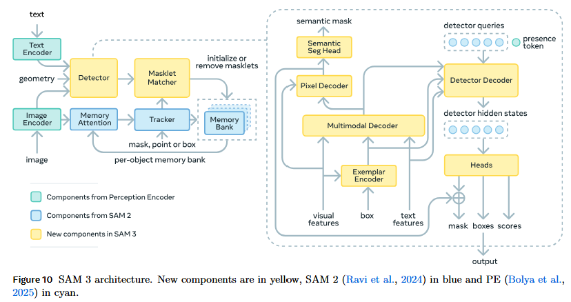

# SAM 3: Segment Anything with Concepts - arXiv 2025

> **Arxiv ID**: 2511.16719
> **Links**: [Paper](https://arxiv.org/abs/2511.16719) | [Code](https://github.com/facebookresearch/sam3)

### 一、引言与核心问题

这篇由 Meta Superintelligence Labs 带来的 **SAM 3** 标志着通用分割领域的一个重要转折点。虽然前作 SAM 和 SAM 2 在基于视觉提示（Visual Prompts，如点、框、掩码）的分割任务（Promptable Visual Segmentation, PVS）上取得了统治地位，但它们忽略了一个更贴近人类意图的高级任务：**基于概念的分割（Promptable Concept Segmentation, PCS）**。即，给定一个语义概念（如“黄色校车”或“条纹猫”），模型不仅要识别出该概念，还要在图像或视频中**穷尽地（Exhaustively）**分割并追踪所有符合该概念的实例。

#### 核心任务定义
论文的核心任务是 **PCS (Promptable Concept Segmentation)**，旨在统一图像和视频中的检测、分割与追踪。

> 注意区别于 SAM2 的核心任务 **PVS (Promptable Visual Segmentation)**，接受点（Points）、框（Boxes）和掩码（Masks）作为输入的提示。SAM 3 继承并保留了这些能力，统一了 PCS 和 PVS 两大任务。

*   **输入 (Input)**:
    *   **媒体数据**: 单张图像 $I \in \mathbb{R}^{3 \times H \times W}$ 或视频序列 $V = \{I_1, ..., I_T\}$。
    *   **提示 (Prompt)**:
        *   **文本**: 短名词短语（Noun Phrase, NP），经过 Tokenizer 处理后形状为 $[B, L_{text}, D]$。
        *   **视觉范例 (Image Exemplars)**: 可选。作为参考的正样本或负样本图像区域（Bounding Box + Label），编码后形状为 $[B, N_{ex}, D]$。
*   **输出 (Output)**:
    *   **掩码 (Masks)**: 针对图像为 $M \in \{0, 1\}^{N_{obj} \times H \times W}$；针对视频为时空掩码（Masklets），并带有唯一的身份 ID $ID \in \mathbb{N}^{N_{obj}}$。
    *   **置信度**: 每个预测对象的分类置信度。

#### 任务挑战 (Pain Points)
1.  **开放词汇的歧义性与泛化性**: 与 COCO/LVIS 等闭集不同，PCS 需要处理任意名词短语。这带来了“存在性”判断的难题（即判断图像中是否真的存在该概念，这比定位更难）。
2.  **穷尽性 (Exhaustivity)**: 传统分割模型往往只关注显著物体，而 PCS 要求找出所有实例（例如背景中微小的物体），这对数据的标注质量提出了极高要求。
3.  **视频中的时空一致性**: 在视频中，不仅要检测每一帧的新物体，还要维护已有物体的身份 ID，这要求模型在“语义识别”（Detector）和“身份保持”（Tracker）之间取得平衡。

---

### 二、核心思想与主要贡献

#### 直观动机
SAM 系列的短板在于缺乏语义理解能力。SAM 3 的动机是将 SAM 强大的几何分割能力与开放世界的语义理解相结合。设计上，作者并没有简单地将 CLIP 蒸馏到 SAM 中，而是采用了解耦设计：一个强大的图像级检测器负责语义识别，一个基于记忆的追踪器负责时空连续性，并通过一个全新的数据引擎来解决数据稀疏问题。

#### 核心贡献
1.  **架构创新（存在性解耦）**: 提出了 **Presence Head**，将“图像中是否存在该概念”的全局识别任务与“哪个物体是该概念”的局部定位任务解耦。这极大地提升了在开放世界中处理困难负样本（Hard Negatives）的能力。
2.  **统一的检测与追踪架构**: 模型由共享 Vision Encoder 的 Detector 和 Tracker 组成。Detector 负责语义和新物体发现，Tracker 继承 SAM 2 的记忆机制负责时空关联，避免了端到端追踪器中常见的任务冲突。
3.  **可扩展的数据引擎**: 构建了一个包含 **AI Annotators** 和 **AI Verifiers** 的闭环数据引擎。通过利用多模态大模型（MLLM）生成困难负样本并验证掩码质量，成功构建了包含 4M 概念和 1.4B 掩码的 SA-Co 数据集。
4.  **SA-Co Benchmark**: 发布了目前最大规模的 Promptable Concept Segmentation 评测基准，包含 20 种不同领域的细粒度概念。

---

### 三、论文方法论 (The Proposed Pipeline)

#### 1. 整体架构概述

SAM 3 采用了一个双阶段、条件化的架构。整个流程可以概括为：

1. 特征提取 (Backbone): 统一处理图像和文本，生成多尺度视觉特征和文本嵌入。
2. 提示融合与检测 (Detector): 一个 Transformer Encoder-Decoder 结构。它不仅负责“检测物体”，更核心的是负责将多模态提示（Text/Visual）注入到图像特征中，生成“条件化特征图 (Conditioned Features)”，并以此预测出初始的物体框、掩码和置信度。
3. 时空追踪与细化 (Tracker): 一个基于记忆的 Decoder。它接收 Detector 的输出（或前一帧的记忆），结合交互式点击（Clicks），在时空维度上生成最终的高精度 Masklets。

#### 2. 详细网络架构与数据流

将数据流严格按照下图的顺序，拆解为三个核心模块：**Backbone**, **Detector (Encoder-Decoder)**, 和 **Tracker**。

A. **统一感知骨干 (The Unified Perception Backbone)**：负责将原始像素和字符转换为高维特征。

- 模型的输入包括
  - Image: $I \in \mathbb{R}^{B \times 3 \times 1024 \times 1024}$ (Training/Inference 默认分辨率)。
  - Text: $T \in \mathbb{R}^{B \times L_{text}}$ (Token IDs)。
- 模型本体基于 Perception Encoder 架构，包含了两个语义对齐的Encoder：
  - Text Encoder：Causal Transformer (Max context len=32)。
    - 输出: Text Embeddings ($F_{text} \in \mathbb{R}^{B \times L_{text} \times D}$)。
  
  - Image Encoder (Vision Backbone)：基于 Hiera 或 ViT-L+，采用 Windowed Attention。
    - 多尺度输出 (FPN): 输出 3 个层级的特征图，Stride 分别为 32, 16, 8。
    - 特征融合 (Neck): 一个 `Sam3DualViTDetNeck` 模块将多尺度特征融合，并最终输出一个单一的高分辨率、高维度特征图。
    - 输出: Unconditioned Image Embeddings ($F_{img} \in \mathbb{R}^{B \times (H \cdot W) \times D}$)，通常 Stride=16，即 $64 \times 64$ 个 Tokens。
  

**B. 条件化检测器 (The Conditional Detector)**：负责将 Text/Prompt 信息注入图像特征。

*   Geometry Encoder (视觉提示编码)

    - 输入：用户提供的 Prompt Boxes。
    - 操作 (`SequenceGeometryEncoder`)：
      - ROI Align: 使用输入的 Boxes 从 `F_img` (Image Embeddings) 中裁剪出局部特征。
      - Projection: 卷积层 (`boxes_pool_project`) 将局部特征降维/投影。
      - Positional Encoding: 加入 Box 的几何位置编码。
    - 输出: Geometry Embeddings ($F_{geo} \in \mathbb{R}^{B \times N_{geo} \times D}$)。这些 Embeddings 携带了“参考物体”的视觉纹理信息。

*   Fusion Encoder (特征调节)：是连接 Text/Geometry 和 Image 的关键桥梁。

    - 输入：
      - Query (Src): Unconditioned Image Embeddings ($F_{img}$).
      - Key/Value (Memory): Prompt Tokens = Concat($F_{text}$, $F_{geo}$).
    - 结构 (`TransformerEncoder`) 为堆叠 6 层的 `TransformerEncoderLayer`。每个 Layer 内部数据流实现：
      1. Self-Attention: $F_{img} \leftarrow \text{SelfAttn}(F_{img})$。让图像各部分互通有无。
      2. Cross-Attention: $F_{img} \leftarrow \text{CrossAttn}(Q=F_{img}, K=Prompt, V=Prompt)$。这是核心：图像特征“主动查询”提示信息，将语义（Text）和视觉范例（Geo）注入到图像特征的对应区域中。
      3. FFN: 标准前馈网络。
    - 输出: Conditioned Image Embeddings ($F_{img}'$)。此时的图像特征已经“知道”要找什么了。

*   Detector Decoder (物体解码)

    - 输入：

      - Conditioned Image Embeddings ($F_{img}'$) 作为 Memory。

      - Object Queries: $Q=200$ 个可学习的查询向量 + 1 个 Presence Token。

        > 为了解决开放词汇检测中的幻觉问题（即对不存在的物体产生高置信度），论文引入了一个全局可学习的 Presence Token。Presence Token 与 Object Queries 一起进入 Decoder，但不参与二分图匹配（DAC）。
        >
        > *   输出: 通过一个 MLP 预测标量 $P(\text{NP is present})$。
        > *   推理评分: 最终得分为 $Score_{final} = P(query_i \mid present) \times P(present)$。这种分解使得模型在处理 Hard Negatives 时非常鲁棒。

    - 结构 (`TransformerDecoder`) 为堆叠 6 层的 `TransformerDecoderLayer`。每个 Layer 内部数据流实现:

      1. Self-Attention: Queries 之间交互，处理遮挡和去重。
      2. Cross-Attention (Text): Queries 再次直接关注 $F_{text}$ (可选，视配置而定)。
      3. Cross-Attention (Image): Queries 关注 $F_{img}'$，提取物体特征。引入了 Box-Region-Positional Bias 以聚焦注意力。

    - Heads (输出头):

      - Box Head: 预测 Bounding Box。
      - Class Head: 预测置信度。
      - Presence Head: 利用 Presence Token 预测全局存在性分数 $P(exists)$。
      - Mask Head: 利用 Query Embedding 和 $F_{img}'$ 做点积，生成 Detection Masks。

**C. 记忆追踪器 (The Memory-based Tracker)**：一个独立的时间序列模型，直接使用原始特征。

*   Prompt Encoder (提示编码器)：把各种形式的输入（点、框、掩码）统一编码。

    > 对于新物体 (New Object)：
    >
    > - 输入: 来自 Detector 的预测框 $Box_{det}$ 和预测掩码 $Mask_{det}$。
    > - 处理: $Box_{det}$ 被编码为 Sparse Token，$Mask_{det}$ 被下采样并编码为 Dense Embedding。
    > - 输出: 初始化的 **Track Query** (Token形式) 和 Track Mask Embedding (图像形式)。
    >
    > 对于老物体 (Existing Track)：
    >
    > - 输入: 上一帧 Mask Decoder 输出的 Output Token。
    > - 处理: 直接继承或经线性层投影。
    > - 输出: 当前帧的 **Track Query**。

*   Mask Decoder (掩码解码器)： Tracker 的核心计算单元（`TwoWayTransformer`），负责融合记忆、图像和查询。

    - 输入
      - Image Features: 当前帧 Backbone 输出的原始图像特征 $F_{img}$ (未经过 Detector 融合)。
      - Track Query: 来自 Prompt Encoder（新物体）或上一帧（老物体）。
      - Memory Features: 从 Memory Bank 中取出的过去 $N$ 帧的特征队列。
    - 内部处理流程
      1. Memory Attention: Track Query 首先作为 Query，去对 Memory Features 做 Cross-Attention。这步操作让 Query 向量“吸取”了该物体在历史帧中的外观特征。
      2. Image Attention: 更新后的 Track Query 转而作为 Query，对当前帧的 Image Features 做 Cross-Attention。这步操作是在当前帧中“搜索”该物体。
      3. Reverse Attention: 为了增强图像特征对物体的感知，Image Features 也会反过来对 Track Query 做 Cross-Attention（这就是 "Two-Way" 的含义）。
    - 输出
      - Mask Logits: 当前帧的高分辨率掩码预测。
      - Object Score: 一个标量，表示该物体在当前帧是否存在（用于判断是否被完全遮挡或移出视野）。
      - Output Token: 更新后的 Query 向量，将传递给下一帧作为 Track Query。

*   Memory Encoder (记忆编码器)

    - 输入：当前帧的原始图像特征 $F_{img}$ + 刚刚预测出的 Mask Logits。
    - 处理流程
      1. 将 Mask Logits 通过 Sigmoid 归一化。
      2. 将 Mask 与 $F_{img}$ 在通道维度拼接。
      3. 通过数层卷积网络进行融合与下采样。
    - 输出：New Memory Feature。这个特征被推入 Memory Bank 队列，挤掉最旧的一帧，完成记忆更新。

**D. 关联与仲裁 (Matching & Arbitration)**：这部分不是一个神经网络，而是一段决策逻辑。负责协调 Detector 和 Tracker 之间的关系。

- 数据准备:
  - 集合 D (Detections): Detector 在当前帧输出的所有 $N$ 个预测结果。每个结果包含 $\{Mask_{det}, Box_{det}, Score_{det}\}$。
  - 集合 T (Tracks): Tracker 在当前帧输出的所有 $M$ 个追踪结果。每个结果包含 $\{Mask_{track}, ID_{track}, Score_{track}\}$。
- 计算相似度矩阵:
  - 计算集合 D 和集合 T 之间两两的 IoU (Intersection over Union)，得到一个 $N \times M$ 的矩阵。
- 决策逻辑 (Matching Logic):
  1. 匹配成功 (Matched):
     - 若 $IoU(d_i, t_j) > 0.5$（阈值），判定 Detector 的第 $i$ 个检测结果就是 Tracker 的第 $j$ 个物体。
     - 数据流向: 系统会比较 $Score_{det}$ 和 $Score_{track}$。如果 Detector 的置信度极高（说明看得很清楚），而 Tracker 的置信度较低（可能跟丢了或漂移了），系统会强制使用 $Mask_{det}$ 来替代 $Mask_{track}$，并用这个“更准的 Mask”去运行 Memory Encoder，刷新记忆。这叫 **Re-conditioning (重置)**。
  2. 发现新物体 (New Born):
     - 若 $d_i$ 与任何 $t_j$ 的 IoU 都很低（$<0.1$），且 $Score_{det}$ 很高。
     - 操作: 系统分配一个新的全局唯一 ID (`New_ID`)，将 $d_i$ 的 Mask/Box 送入 Tracker 的 Prompt Encoder（如前所述），初始化一个新的 Track Query，放入 Tracker 的追踪列表。
  3. 物体丢失 (Lost/Terminated):
     - 若 $t_j$ 找不到匹配的 Detection，且 Tracker 自己的 $Score_{track}$ 也很低（认为物体没了）。
     - 操作: 该 ID 被标记为“丢失”。如果连续 $K$ 帧都丢失，该 ID 及其 Memory Bank 将被彻底删除，释放显存。

#### 3. 损失函数 (Loss Function)
训练采用了多任务联合监督：
*   检测损失: 遵循 DAC-DETR，包含 $L_{cls}$ (Focal Loss), $L_{box}$ (L1 & gIoU)。
*   分割损失: MaskFormer 风格的 $L_{mask}$ (Focal + Dice Loss)。
*   Presence Loss: 针对 Presence Head 的 Binary Cross Entropy (BCE) Loss，权重设为 20，强制模型学习图像级的存在性判断。
*   Video Loss: 包含 IoU 预测损失 (MAE) 和对象遮挡预测损失 (Cross-Entropy)。

#### 4. 数据引擎 (Data Engine)
这是论文工程量的体现，分为四个阶段：
1.  **Phase 1 (Human)**: 使用现有检测器 + SAM 2 生成伪标签，人类验证。
2.  **Phase 2 (Human + AI)**: 训练 **Llama 3.2** 作为 "AI Verifiers"。
    *   **MV (Mask Verification)**: AI 判断掩码质量。
    *   **EV (Exhaustivity Verification)**: AI 判断是否漏检。
    *   **Hard Negative Mining**: 利用本体论（Ontology）和 Llama 生成对抗性负文本，训练模型拒绝错误概念。
3.  **Phase 3 (Scaling)**: 扩展到 15 个领域，利用 AI Verifiers 极大地提升标注吞吐量。
4.  **Phase 4 (Video)**: 扩展到视频数据，重点挖掘高动态、拥挤场景。

---

### 四、实验结果与分析

#### 1. 核心实验结果 (PCS Task)
在 SA-Co/Gold 评测集上，SAM 3 展现了压倒性优势。评价指标采用了 **cgF1 (classification-gated F1)**，这是一个综合了图像级分类（IL_MCC）和正样本定位（pmF1）的指标。

| 方法              | cgF1 (Main) | IL_MCC (Image-level Cls) | pmF1 (Localization) |
| :---------------- | :---------: | :----------------------: | :-----------------: |
| OWLv2*            |    24.6     |           0.57           |        42.0         |
| GroundingDino-T   |     3.3     |           0.15           |        16.2         |
| Gemini 2.5 Flash  |    13.0     |           0.29           |        46.1         |
| **SAM 3**         |  **54.1**   |         **0.82**         |      **66.1**       |
| Human (Estimated) |    72.8     |           0.94           |        77.0         |

*注：SAM 3 的性能是 Strongest Baseline (OWLv2) 的两倍以上，且主要差距在于对 Concept 的理解和拒绝（IL_MCC）。*

#### 2. 视频分割结果
在 SA-Co/VEval 视频基准上，SAM 3 同样大幅领先。
*   对比 GLEE (Open-vocab Video Seg): SAM 3 的 cgF1 达到 30.3，而 GLEE 仅为 0.1（Zero-shot 泛化失败）。
*   对比 Tracking-by-Detection 基线: SAM 3 的端到端设计使其在 pHOTA（高阶追踪精度）上提升了约 3-5 个点。

#### 3. 消融研究解读
*   **Presence Head 的作用**: 移除 Presence Head 后，cgF1 下降了 1.5 点，但更重要的是 IL_MCC 下降了 0.05。这证明解耦设计对于抑制 False Positives 至关重要。
*   **Hard Negatives 的作用**: 训练数据中加入困难负样本，将 IL_MCC 从 0.44 提升至 0.68。这说明模型学会了“什么不是”与“什么是”同样重要。
*   **AI Verifiers 的贡献**: 使用 AI 验证器清洗数据，能填补 SAM 3 与人类表现之间约一半的差距 (+7.2 cgF1)。

---

### 五、方法优势与深层分析

#### 1. 架构设计的哲学：解耦与统一
SAM 3 最精妙的设计在于**解耦**。
*   **Recognition vs. Localization**: 传统的 DETR 强制每个 Query 同时学会“这是猫吗”和“猫在哪”。Presence Head 的引入将全局语义判断剥离，Query 只需关注局部匹配。这种 Inductive Bias 非常适合 Open-vocabulary 场景，因为很多时候文本 Concept 根本不在图中，强制 Query 寻找会产生严重的 Hallucination。
*   **Semantics vs. Identity**: 在视频中，SAM 3 没有采用 TrackFormer 那种将 Detection 和 Tracking Query 混合的做法，而是明确区分 Detector（负责语义、新物体）和 Tracker（负责时空连续性）。Detector 提供高质量的“重置信号”，解决了长视频追踪中的漂移问题。

#### 2. 数据为王：AI-in-the-loop 的范式转移
SAM 3 的成功在很大程度上归功于其 Data Engine。它展示了未来数据集构建的方向：**不再完全依赖人类标注，而是利用强模型（Llama）进行生成和验证，人类仅负责 Corner Case 的修正（Correction）**。
*   **Hard Negatives 的构造**: 论文利用 Ontology 寻找语义相近的词（如“猫” vs “豹”）作为负样本，这比随机采样负样本有效得多，迫使 Vision Encoder 学习更细粒度的特征。
*   **Exhaustivity**: 强调“穷尽性”标注是 PCS 任务区别于普通检测的关键。只有当模型见过“背景中模糊的小物体也需要分割”的数据分布，它才能真正由“Object Detector”进化为“World Segmenter”。

---

### 六、结论与个人思考

**主要结论**: SAM 3 成功地将 SAM 系列的几何分割能力扩展到了语义概念领域，并通过统一的架构和大规模的数据工程，在图像和视频的 PCS 任务上设立了新的 SOTA。它证明了 Promptable Concept Segmentation 是多模态 AI 的基础能力。

**潜在局限性**:
1.  **推理成本**: 视频推理时，Tracker 需要为每个物体维护状态。计算量随物体数量 $N$ 线性增长，在拥挤场景（如 100+ 物体）下难以实时。
2.  **长尾概念泛化**: 尽管有 Data Engine，但在极度细粒度或专业领域（如特定医疗器械）Zero-shot 能力仍有限，这受限于 PE Backbone 的预训练知识边界。
3.  **复杂推理缺失**: 目前仅支持名词短语。对于涉及关系推理（Referring Expression，如“坐在椅子上的人左边的狗”）的支持较弱，虽然论文展示了结合 MLLM 的 Agent 模式，但这增加了系统复杂性。

**对个人研究的启发**:
*   **Presence Token 的设计**: 在做任何 Open-set 任务时，显式建模 $P(existence)$ 是一个简单却极其有效的 Trick，能大幅提升 User Experience（减少乱检测）。
*   **数据闭环**: 在资源允许的情况下，与其手动标注少量数据，不如构建一个 Model-Assisted 的标注-验证流水线。AI Verifier 的思路（用大模型检查小模型的输出）非常值得借鉴。
*   **视频任务建模**: 明确区分检测器和追踪器的角色，并通过 Re-prompting 机制连接两者，比端到端黑盒更可控、更鲁棒。