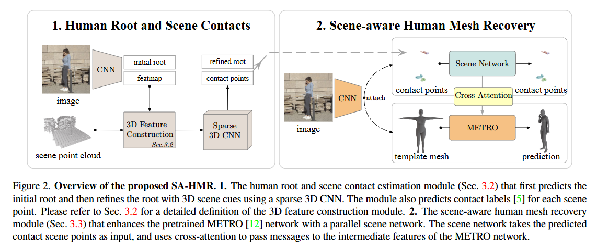

# 论文标题: Learning Human Mesh Recovery in 3D Scenes - CVPR 2023

### 一、引言与核心问题

这篇论文聚焦于计算机视觉与图形学交叉领域中的一个关键问题：在给定一个预先扫描好的3D场景和一个包含人类的单张RGB图像时，如何精确且高效地恢复出人体在场景中的三维网格模型（Human Mesh），包括其绝对姿态、体型和空间位置。这项技术对于增强现实、人机交互、机器人技术和运动分析等领域至关重要，因为它能使虚拟角色与真实世界环境进行物理上可信的交互。

*   **论文试图解决的核心任务是什么？**

    该研究的核心任务是**场景感知下的单目三维人体网格恢复 (Scene-Aware Monocular Human Mesh Recovery)**。

    *   **输入 (Input)**:
        *   **单张RGB图像 (Single RGB Image)**: 经过裁剪和缩放后，输入到网络的图像维度为 `[1, 3, 224, 224]`。这张图像捕捉了人与场景交互的瞬间。
        *   **场景点云 (Scene Point Cloud)**: 一个预先扫描好的、代表静态3D场景几何信息的点云，数据形态为 `[1, N_s, 3]`，其中 `N_s` 是位于相机视锥内的点的数量。该点云提供了场景的精确几何约束。

    *   **输出 (Output)**:
        *   **三维人体网格顶点 (3D Human Mesh Vertices)**: 一个符合SMPL（Skinned Multi-Person Linear Model）拓扑结构的、包含6890个顶点的三维网格，其数据维度为 `[1, 6890, 3]`。这个输出不仅定义了人体的姿态和体型，更重要的是，它包含了人体在场景坐标系下的绝对三维位置。

    *   **任务的应用场景**:
        *   **增强现实 (AR)**: 将虚拟角色无缝、逼真地置入真实场景中。
        *   **机器人与自动驾驶**: 帮助系统理解人类在环境中的行为和意图。
        *   **智能监控**: 在复杂的3D环境中进行高精度的行为分析。
        *   **虚拟试衣与人体工学**: 在特定场景下（如坐在椅子上、驾驶汽车）分析人体形态。

    *   **当前任务的挑战 (Pain Points)**:
        1.  **深度模糊性与遮挡**: 仅从单张2D图像中恢复3D信息本质上是一个病态问题（ill-posed problem）。尤其在有遮挡或缺乏深度线索时，很难确定人体的准确3D位置和姿态。
        2.  **物理合理性**: 传统的不考虑场景的HMR方法生成的网格常常会悬浮在空中或穿透场景物体，缺乏物理世界的真实感。
        3.  **效率低下**: 已有的场景感知方法（如PROX）大多依赖于迭代优化，通过最小化能量函数来使人体网格与场景适配。这个过程非常耗时（通常需要数十秒），无法满足实时应用的需求，并且对初始值和超参数敏感。

    *   **论文针对的难点**:
        这篇论文的核心目标是同时解决上述**效率**和**物理合理性**的挑战。它旨在设计一个**端到端的、无优化的**深度学习框架，该框架能够快速地（接近实时）生成物理上合理、且空间定位准确的人体三维网格。

### 二、核心思想与主要贡献

*   **直观动机与设计体现**:
    研究的直观动机是，人类与场景的交互信息（特别是接触点）是消除3D模糊性的关键线索。如果模型能首先理解“人的哪部分正在接触场景的哪个位置”，那么恢复出的整体姿态和位置就会更加准确。这一动机在论文的技术设计中被清晰地体现为一个两阶段的级联流程：
    1.  **定位与接触预测**: 首先利用图像和场景点云，通过一个专门的模块来预测人体的粗略3D位置（根节点root）以及场景中可能与人体发生接触的区域。
    2.  **融合与网格恢复**: 然后将这些显式的场景交互信息（接触点）通过一种新颖的注意力机制，注入到一个先进的HMR网络（METRO）中，从而引导最终网格的生成。

*   **与相关工作的比较与创新**:
    *   与**优化类方法 (如PROX)** 相比，本作最大的创新在于**完全放弃了耗时的迭代优化**，代之以一个高效的单次前向传播网络，将推理时间从数十秒缩短到约0.2秒。
    *   与**无场景的HMR学习方法 (如METRO)** 相比，本作的关键创新在于设计了一个**并行的场景网络和跨注意力（Cross-Attention）融合机制**，有效地将3D场景的几何约束整合到Transformer架构中，显著提升了全局定位精度和物理合理性。

*   **核心贡献与创新点**:
    1.  **首个无优化的场景感知HMR框架**: 提出了一个完全基于深度学习、无需迭代优化的端到端框架，实现了在精度和速度上的双重突破。
    2.  **基于稀疏3D卷积的根节点与接触点估计**: 设计了一个高效的模块，使用稀疏3D CNN来处理场景点云，从而精确地估计人体的绝对3D位置和密集的场景接触点，为后续的网格恢复提供了关键的几何先验。
    3.  **基于跨注意力的场景信息融合机制**: 提出了一种新颖的并行网络结构，通过跨注意力机制将人体顶点特征（作为Query）与场景接触点特征（作为Key/Value）进行交互，使得网络能够智能地将场景约束应用到对应的身体部位。

### 三、论文方法论 (The Proposed Pipeline)

* **整体架构概述**
  论文提出的SA-HMR（Scene-Aware Human Mesh Recovery）模型遵循一个清晰的两阶段流水线。第一阶段，“**人体根节点与场景接触点估计模块**”，负责在3D场景中对人体进行定位，并识别出场景中与人体接触的表面点。第二阶段，“**场景感知的人体网格恢复模块**”，将第一阶段的输出作为强先验信息，通过一个经过改进的Transformer网络，生成最终与场景适配的精确人体网格。

* **详细网络架构与数据流**

  **阶段一: 人体根节点与场景接触点估计 (Human Root and Scene Contacts)**
  1.  **初始根节点预测 (Initial Root)**:
      *   输入图像 `I ∈ R^[1, 3, 224, 224]` 首先通过一个2D CNN主干网络（HRNet）提取特征图 `F`。
      *   网络预测出根关节的2D热图（heatmap）和归一化深度图，通过argmax操作和深度值查找，得到一个初始的2.5D根节点位置 `r = (X, Y, Z)`。这是一个快速但不够精确的初始定位。
  2.  **3D特征构建 (3D Feature Construction)**:
      *   以初始根节点 `r` 为中心，对场景点云 `S` 进行筛选和体素化（Voxelization），形成一个稀疏的体素场。
      *   为每个体素 `s_i` 构建一个融合了**几何信息**和**视觉信息**的特征向量。该特征由两部分拼接而成：
          *   **几何偏移向量**: `o_i = r - s_i`，表示从体素中心指向初始人体根节点的向量，编码了相对位置信息。
          *   **投影图像特征**: 将体素中心 `s_i` 的3D坐标投影回2D CNN的特征图 `F` 上，并通过双线性插值采样得到对应的图像特征 `f_i`。
  3.  **根节点精炼与接触点分割**
      *   将构建好的稀疏体素特征场输入到一个**稀疏3D CNN** (基于TorchSparse库实现的SPVCNN) 中进行处理。
      *   该网络并行输出三个结果：
          *   一个精炼的偏移向量 `o'_i` 和置信度 `c_i`。最终的精炼根节点 `r*` 通过对所有体素的预测位置 `(o'_i + s_i)` 进行置信度加权平均得到。
          *   每个体素的接触类别标签，将场景点云分割成8类（7个身体部位的接触区+1个非接触区）。
      *   **此阶段输出**: 精炼后的人体根节点 `r*` 和带有接触标签的场景点云 `Ŝ_seg3d`。

  **阶段二: 场景感知的人体网格恢复 (Scene-aware Human Mesh Recovery)**
  这个模块的核心是对一个强大的HMR基线模型METRO进行改进，使其能够接收并利用场景信息。

  1.  **双流Transformer架构**: 模型包含两个并行的Transformer编码器分支（如图4所示）。
      * **人体分支 (Human Branch)**: 遵循原始METRO的设计。它将图像特征映射到SMPL模板网格的每个顶点上，形成一系列"顶点Token"。这些Token通过多层**自注意力 (Self-Attention)** 模块，捕捉身体各部位之间的内在关联。
      
      * **场景分支 (Scene Branch)**: 这是论文新引入的分支。它接收第一阶段输出的**接触点云 `Ŝ_seg3d`**作为输入，同样通过一个Transformer编码器（包含自注意力模块），为每个接触点生成一个特征嵌入，捕捉场景接触区域的几何结构。
      
        > 步骤一：初始几何特征嵌入
        >
        > - 首先，每个接触点的 `(X, Y, Z)` 坐标会经过一个MLP。
        > - 目的: 将三维的坐标映射到一个高维的特征空间中，为每个点生成了一个初始的几何特征向量，编码了点在空间中的绝对位置信息。
        >
        > 步骤二：语义特征赋予
        >
        > - 随后，从图像特征中提炼出7个身体部位的语义特征向量【人体分支的所有SMPL顶点特征值在自注意力之前，按顶点token划分不同的身体部位，并对不同部位进行average pooling得到的】。
        > - 根据每个接触点的预测标签，将对应的语义特征向量赋予该点。
        >
        > 步骤三：场景自注意力编码
        >
        > - 将步骤一生成的几何特征向量和步骤二赋予的语义特征向量进行拼接（Concatenate）。将拼接后的混合特征向量输入到一个专属于场景分支的Transformer编码器中。这个编码器内部包含自注意力模块。
        >
        > - 目的: 这一步至关重要！它让场景接触点之间互相“交流”。通过自注意力，每个接触点可以观察所有其他的接触点，并学习它们之间的空间关系。
        > - **输出**: 经过这个Transformer编码器后，输出的是最终的场景特征嵌入。此时，每个点的特征不仅知道“我是谁”，还知道了“我在一个什么样的几何结构里”。它捕捉到了接触区域的局部几何结构。
      
  2.  **交叉注意力融合 (Cross-Attention Fusion)**:
      
      *   这是连接两个分支、注入场景信息的关键。在一个或多个Transformer层中，执行一次**交叉注意力**操作。
      *   **Query**: 来自**人体分支**的顶点特征。
      *   **Key & Value**: 来自**场景分支**的接触点特征。
      *   **作用分析**: 这个设计让每个身体顶点能够“查询”场景的接触区域，并根据相似度（注意力权重）聚合最相关的场景几何信息。例如，手的顶点特征会更多地关注桌面的接触点特征，而脚的顶点特征则会关注地面的接触点特征。消融实验（表4）证明，这种基于跨注意力的后期融合策略远优于简单的早期特征拼接。【交叉注意力时，通过残差连接保留无接触点时的原信息，确保只是在原本的预测结果上添加偏移】
      
  3.  **最终网格回归**:
      *   经过融合后的顶点特征被送入一个共享的MLP回归头，最终预测出每个顶点的三维坐标，形成最终的人体网格 `V ∈ R^[1, 6890, 3]`。

* **损失函数 (Loss Function)**:
  模型的两个模块是分开训练的，各自拥有独立的损失函数。
  *   **根节点与接触点模块损失 `L_RC`**:
      *   `L_RC = L_R2D + w_rz * L_RZ + L_ROV + L_R3D + L_c`
      *   **设计理念**: 这是一个多任务损失，旨在全面监督根节点的定位和接触点的分割。
      *   **关注重点**:
          *   `L_R2D`: 根节点2D热图的MSE损失。
          *   `L_RZ`, `L_ROV`, `L_R3D`: 分别是针对相对深度、偏移向量和最终3D根节点的L1损失，用于精确回归3D位置。
          *   `L_c`: 场景体素接触分类的交叉熵损失，用于监督接触点的分割。
  *   **网格恢复模块损失 `L_HMR`**:
      *   `L_HMR = L_V + L_J + L_CP + L_GV`
      *   **设计理念**: 主要监督最终生成的人体网格的几何精度。
      *   **关注重点**:
          *   `L_V`, `L_J`: 顶点和关节点位置的L1损失（在与真值对齐后计算）。
          *   `L_CP`: 重建出的与场景接触的人体顶点的L1损失，确保接触部位的准确性。
          *   `L_GV`: 全局坐标系下顶点位置的L1损失，监督绝对位置。

* **数据集 (Dataset)**:
  *   **所用数据集**: 论文在两个主流的场景感知HMR数据集 **RICH** 和 **PROX** 上进行训练和评估。
  *   **特殊处理**:
      *   **RICH**: 对官方数据进行了筛选，移除了多目标、静态初始姿态等不适用的帧，并对数据进行了降采样。
      *   **PROX**: 该数据集的标注质量有限。为了获得更好的训练监督信号，作者使用了一个基于运动先验的优化方法 **HuMoR** 来对序列进行处理，生成了质量更高的伪真值（pseudo ground-truth）用于训练。

### 四、实验结果与分析

*   **核心实验结果**:
    论文在RICH和PROX两个数据集上都取得了当前最佳（State-of-the-Art）的性能，尤其是在衡量全局定位准确性的指标上优势明显。

    **表1: RICH 数据集评估结果**
    | 指标 (↓) | PROX [5] (优化) | METRO† [12] (学习) | **SA-HMR (本文)** |
    | :------: | :-------------: | :----------------: | :---------------: |
    | G-MPJPE  |      390.1      |       511.7        |     **264.6**     |
    |  G-MPVE  |      397.2      |       509.7        |     **272.7**     |
    |   PenE   |      15.5       |        33.6        |     **14.9**      |
    |  MPJPE   |      164.1      |        98.8        |     **93.9**      |

    **表2: PROX 数据集评估结果**
    | 指标 (↓) | PROX [5] (优化) | METRO† [12] (学习) | **SA-HMR (本文)** |
    | :------: | :-------------: | :----------------: | :---------------: |
    | G-MPJPE  |      172.0      |       265.6        |     **150.4**     |
    |  G-MPVE  |      178.5      |       262.7        |     **160.0**     |
    |   PenE   |      10.7       |        67.5        |     **26.9**      |
    |  MPJPE   |      101.1      |       117.1        |     **111.1**     |

    **结果解读**: G-MPJPE/G-MPVE是衡量在场景坐标系下关节/顶点的全局误差。SA-HMR在这两个核心指标上远超所有基线方法，说明它能极其准确地将人体放置在场景的正确位置。相比之下，无场景约束的METRO†方法全局误差很大，而基于优化的PROX虽然表现不错，但速度极慢（18.4s vs 0.2s）。

*   **消融研究解读**:
    *   **根节点估计模块 (表3)**: 实验证明，从初始的2.5D预测，到稀疏3D CNN的精炼，再到最终HMR模块的微调，人体根节点的定位误差（RtErr）被逐步、显著地降低（在RICH上从510.8mm降至246.5mm）。
    *   **场景信息融合方式 (表4)**: 将本文的并行网络与跨注意力机制，同一种在网络早期融合接触点特征的方案进行对比。结果显示，本文的后期融合策略在所有指标上均表现更优，证明了其设计的有效性。
    *   **模块上限分析 (表5)**: 通过使用真实的（Ground Truth）根节点和接触信息作为第二阶段的输入，模型的精度得到了巨大提升（G-MPJPE从264.6降至约76.7）。这表明，当前方法的性能瓶颈主要在第一阶段的根节点/接触点估计，未来若能提升该模块的精度，整体性能还有很大的提升空间。

*   **可视化结果分析**:
    图6的定性比较结果直观地展示了本文方法的优势。与其他方法相比，SA-HMR恢复的人体网格不仅姿态自然，而且与场景物体的交互（如坐、躺、扶）非常逼真，接触位置准确，没有明显的穿透或悬浮现象。

### 五、方法优势与深层分析

*   **架构/设计优势**:
    *   **解耦与级联**: 论文将复杂的场景感知HMR问题解耦为两个更易于处理的子问题：定位/接触估计 和 姿态/体型恢复。第一阶段使用专为处理稀疏点云设计的稀疏3D CNN，高效地提取关键的几何先验。第二阶段则利用Transformer强大的序列建模能力，并创新性地通过跨注意力机制将这些先验信息“注入”，实现了信息的高效利用。这种设计既专业对口又逻辑清晰。
    *   **从几何到语义的注意力**: 跨注意力机制的运用是点睛之笔。它不仅仅是简单的特征拼接，而是建立了一种从人体顶点（语义）到场景接触点（几何）的动态查询关系。这使得模型能够学习到一种隐式的对应关系，例如，它能学会当“手”的顶点特征作为查询时，应该更多地关注场景中“桌面”区域的特征。这种机制使得场景信息的融合更加智能和有效。

*   **解决难点的思想与实践**:
    论文的核心思想是**“用显式的几何预测来引导隐式的网格生成”**。
    *   针对**效率低下**的难点，它通过完全放弃迭代优化，设计了一个纯前向传播的网络来解决。
    *   针对**物理合理性**和**深度模糊性**的难点，它没有像传统方法那样在最后一步用碰撞损失来“惩罚”不合理的姿态，而是在网格生成之初就将**接触点**这一强几何约束引入网络。通过跨注意力机制，这些约束信息被深度整合到姿态的生成过程中，从根源上引导模型产生与场景兼容的、物理上合理的输出。

### 六、结论与个人思考

*   **论文的主要结论回顾**:
    这篇论文成功地设计了一个高效、准确的场景感知人体网格恢复框架SA-HMR。通过创新的两阶段设计，结合稀疏3D卷积和跨注意力Transformer，该方法在保持高速推理的同时，在标准 benchmarks 上实现了SOTA的精度，特别是在全局定位和物理合理性方面表现突出。

*   **潜在局限性**:
    1.  **依赖预扫描场景**: 该方法要求提供一个精确的场景点云作为输入，这在许多动态或未知的环境中是不可行的，限制了其普适性。
    2.  **性能瓶颈**: 如消融实验所示，模型的最终精度高度依赖于第一阶段根节点与接触点估计的准确性，该模块的误差会直接传递到最终结果。
    3.  **静态场景假设**: 该方法仅适用于静态场景，无法处理场景中物体发生移动或形变的情况。

*   **未来工作方向**:
    1.  **场景几何的在线估计**: 一个重要的方向是摆脱对预扫描场景的依赖，尝试从单张或多张图像中实时估计场景的几何表示（如深度图、SDF或点云），并将其与HMR网络结合。
    2.  **动态与可变形场景**: 将模型扩展到能够处理动态场景，例如，同时恢复与人交互的物体（如椅子、球）的运动和形变。
    3.  **端到端联合训练**: 当前模型是分阶段训练的，未来可以探索如何设计一个统一的框架，对两个模块进行端到端的联合训练，可能会带来性能的进一步提升。

*   **对个人研究的启发**:
    这篇论文展示了如何巧妙地将不同领域的先进技术（稀疏3D卷积、Transformer）结合起来，解决一个复杂的多模态问题。其“显式预测+隐式引导”的设计思想非常具有启发性，可以借鉴到其他需要融合几何与视觉信息的图形学任务中，例如三维重建、机器人抓取等。跨注意力作为一种强大的多模态信息融合工具，其应用潜力值得进一步挖掘。