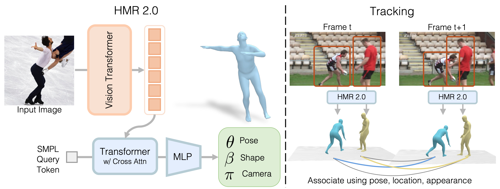

# 论文标题: Humans in 4D: Reconstructing and Tracking Humans with Transformers - CVPR 2023

### 一、引言与核心问题

本研究探讨了从单目图像和视频中进行人体三维重建与四维（3D+时间）追踪的挑战。在计算机图形学、计算机视觉和生物力学等领域，精确地从二维图像中恢复人体的三维姿态、形状和运动至关重要。尽管先前的工作已取得显著进展，但它们在处理非典型姿态、严重遮挡以及在复杂视频场景中维持个体身份连续性方面仍存在瓶颈。

**论文试图解决的核心任务是什么？**

该研究的核心任务是双重的：首先，提出一个名为HMR 2.0的全新模型，用于从**单张静态图像**中恢复出高质量的人体三维网格（Human Mesh Recovery）；其次，基于HMR 2.0构建一个名为4DHumans的完整系统，实现在**单目视频**中对多人进行鲁棒的四维重建与追踪。

*   **输入 (Input)**:
    *   对于核心的三维重建任务 (HMR 2.0)，输入是一张经过裁剪和缩放的单人RGB图像。根据补充材料，其具体维度为 `[Batch_size, 3, 256, 192]`。
    *   对于四维追踪任务 (4DHumans)，输入是未经处理的单目视频流。

*   **输出 (Output)**:
    *   HMR 2.0的直接输出是一组描述人体模型的参数 $\Theta = [\theta, \beta, \pi]$，用于驱动一个名为**SMPL (Skinned Multi-Person Linear Model)**的参数化人体模型。SMPL是一个通过少量参数控制人体姿态和体型的统计模型，广泛应用于人体三维重建领域。
        *   **姿态参数 (Pose)** $\theta \in \mathbb{R}^{24 \times 3 \times 3}$: 控制24个身体关节的旋转，采用旋转矩阵表示。
        *   **体型参数 (Shape)** $\beta \in \mathbb{R}^{10}$: 控制体型的主成分系数，决定高矮胖瘦。
        *   **相机平移 (Camera Translation)** $\pi \in \mathbb{R}^{3}$: 表示相机坐标系下的三维平移。
    *   通过将这些参数输入SMPL模型，最终生成一个包含约6890个顶点的三维人体网格模型 $M \in \mathbb{R}^{3 \times 6890}$。
    *   4DHumans系统的输出则是在视频的每一帧为每个被追踪到的人生成一个带有时序关系的、连续的三维网格序列。

*   **任务的应用场景**: 该技术可广泛应用于电影和游戏的动作捕捉、虚拟现实/增强现实中的数字人化身、体育运动分析、人机交互以及机器人模仿学习等场景。

*   **当前任务的挑战 (Pain Points)**:
    1.  **非常规姿态**: 传统基于卷积神经网络（CNN）的方法在处理舞蹈、体育运动等非常规或极端姿态时，由于感受野限制，难以捕捉全局依赖关系，导致重建结果不准确或不符合人体物理结构。
    2.  **遮挡与追踪**: 在包含多人的视频中，个体之间或个体与环境之间的遮挡是常态。这不仅使单帧重建变得困难，也极易导致追踪失败，即在遮挡后身份（ID）发生切换。
    3.  **模型与数据鸿沟**: 先前方法通常依赖于特定设计的网络模块（如部件引导的注意力机制）来处理特定挑战，这限制了模型的通用性和扩展性。同时，高质量的带有三维真值的训练数据稀缺，如何有效利用无标签或仅有二维标注的数据是一个关键问题。

*   **论文针对的难点**: 本文主要聚焦于上述的**非常规姿态重建**和**遮挡下的鲁棒追踪**两大难点。它通过引入一个完全基于Transformer的架构来解决第一个难点，并设计了一个在三维空间中进行追踪的框架来应对第二个难点。

### 二、核心思想与主要贡献

*   **直观动机与设计体现**: 论文的直观动机源于Transformer在自然语言处理和近期在计算机视觉任务中展示出的强大全局建模能力。作者认为，CNN的局部性是处理极端姿态的瓶颈，而Transformer的全注意力机制能够更好地捕捉图像中各部分之间的长距离依赖关系，从而理解整个人体的结构，即使在姿态非常规时也能做出合理推断。这一动机直接体现在其核心模型HMR 2.0的设计上，该模型摒弃了CNN主干网络，完全采用Vision Transformer (ViT) 作为编码器，实现了对人体姿态恢复任务的“Transformer化”（Transformerization）。

*   **与相关工作的比较与创新**: 本工作与经典的HMR (Human Mesh Recovery) [30] 和追踪系统PHALP [65] 关系最密切。
    *   相较于使用ResNet作为骨干的HMR [30] 及其众多变体（如PARE [34], PyMAF [89]），本文的HMR 2.0是首个端到端、完全基于Transformer的架构，不依赖任何特定于人体部位的先验设计，展示了通用架构在这一任务上的潜力。
    *   相较于依赖特定模型隐空间进行追踪的PHALP [65]，本文提出的PHALP'修改了追踪框架，使其在通用的SMPL参数空间中运作。这使得不同的三维重建模型（如HMR 2.0, PARE等）可以即插即用地接入该追踪系统进行公平比较和评估，极大地增强了系统的通用性和可扩展性。

*   **核心贡献与创新点**:
    1.  **提出HMR 2.0**: 一个完全基于Transformer的、端到端的人体三维网格恢复模型。它在处理非常规姿态方面展现出前所未有的鲁棒性，并在多个标准3D和2D评测基准上达到了当时的最佳性能。
    2.  **构建4DHumans系统**: 一个集成了HMR 2.0的、能够在三维空间中进行联合重建与追踪的完整系统。该系统通过在3D空间中进行数据关联，有效解决了遮挡导致的身份丢失问题，在多人追踪任务上取得了SOTA结果。
    3.  **验证了更优3D姿态对下游任务的价值**: 论文通过实验证明，由HMR 2.0生成的更精确的三维姿态能够显著提升下游任务（如视频中的动作识别）的性能，强调了高质量人体几何信息的重要性。

### 三、论文方法论 (The Proposed Pipeline)

* **整体架构概述**: 论文提出的方法包含两个主要部分：首先是核心的单帧三维重建模型**HMR 2.0**，它负责将输入的单张图像“提升”为SMPL参数。其次是**4DHumans**追踪系统，它将HMR 2.0作为“引擎”，在视频流中检测每一帧中的所有人，利用HMR 2.0进行三维重建，并在三维空间中通过一个时序预测模型将这些重建结果链接成稳定的轨迹。

  

*   **详细网络架构与数据流 (HMR 2.0)**:
    *   **数据预处理与编码器**:
        *   **输入**: 输入图像 `I` 的形状为 `[B, 3, 256, 192]`。
        *   **编码器 (Encoder)**: 采用一个在2D关键点预测任务上预训练过的Vision Transformer (ViT-H/16) 作为图像编码器。图像首先被分割成`16x16`的图块（Patches），并线性投影成一系列一维的图像令牌（Image Tokens）。
        *   **形状变换**: 输入图像 `[B, 3, 256, 192]` 经过分块和投影后，变为 `[B, 192, 1280]` 的令牌序列（$(256/16) * (192/16) = 16 * 12 = 192$个令牌，每个令牌维度为1280）。这些令牌随后通过ViT的多个Transformer层进行处理，输出同样形状为 `[B, 192, 1280]` 的特征令牌，此时的令牌已经蕴含了丰富的全局上下文信息。
        *   **消融实验分析**: Table 6中的(B1 vs B2)实验明确指出，将骨干网络从ResNet-50换成ViT-H，在3DPW数据集上的PA-MPJPE误差从53.4mm显著降低到34.4mm，在LSP-Extended上的PCK@0.05从0.35提升到0.48，这强有力地证明了ViT骨干网络对性能的巨大贡献，验证了“Transformerization”的有效性。

    *   **解码器与输出**:
        *   **解码器 (Decoder)**: 采用一个标准的6层Transformer解码器。
        *   **数据流**: 解码器的输入是一个**可学习的查询令牌 (Query Token)**，其形状为 `[B, 1, 2048]`。这个查询令牌在解码器的每一层中，通过**交叉注意力（Cross-Attention）**机制与编码器输出的192个图像令牌进行交互，从而聚合整个图像的信息来预测全局的人体参数。
        *   **形状变换与输出**: 经过6层解码器后，查询令牌的最终状态（形状仍为`[B, 1, 2048]`）被送入一个简单的线性层（MLP），直接回归出SMPL模型的参数 $\Theta = [\theta, \beta, \pi]$。
        *   **消融实验分析**: Table 6中的(B2 vs HMR 2.0b)对比显示，将传统的MLP+IEF头换成Transformer解码器，在2D指标上有明显提升（LSP-Extended PCK@0.05 从0.48提升到0.52），说明这种基于交叉注意力的参数回归方式比传统方法更有效。

*   **损失函数 (Loss Function)**:
    *   **设计理念**: 训练过程采用多任务学习的策略，结合了2D、3D监督信号以及一个对抗性先验，以确保重建结果的准确性和真实性。损失函数由以下几部分构成：
        *   **3D参数损失** $L_{smpl} = ||\theta - \theta^*||^2 + ||\beta - \beta^*||^2$: 当有SMPL真值参数 $\theta^*$ 和 $\beta^*$ 时，使用均方误差（MSE）进行监督。
        *   **3D关键点损失** $L_{kp3D} = ||X - X^*||_1$: 当有3D关键点真值 $X^*$ 时，对模型预测的3D关键点 $X$ 使用L1损失进行监督。
        *   **2D关键点损失** $L_{kp2D} = ||\pi(X) - x^*||_1$: 当只有2D关键点真值 $x^*$ 时，将预测的3D关键点 $X$ 通过相机模型 $\pi(\cdot)$ 投影到2D平面，并与2D真值计算L1损失。这是利用大量2D标注数据的关键。
        *   **对抗性损失** $L_{adv} = \sum_{k}(D_k(\theta_b, \beta) - 1)^2$: 引入一个判别器 $D_k$，用于区分预测的姿态和体型参数是否符合真实人体的分布，以防止生成不自然的体态。
    *   **训练实施**: 训练使用混合数据集，根据每个样本可用的标注类型，动态地选择性应用上述损失。此外，对于无标签数据（如AVA数据集），论文采用了一个离线的伪真值生成流程：先用现成的2D检测和姿态估计模型，然后用ProHMR [37]拟合出伪SMPL真值，再用于模型的训练。
    *   **对性能的贡献**: 这种结合多种监督信号和伪真值策略的损失函数设计，使得模型能够从多样化的数据源中学习，尤其是利用了大量的“in-the-wild”数据，这对于提升模型的泛化能力和对非常规姿态的鲁棒性至关重要。Table 6的(D1 vs D2)实验显示，增加更多训练数据（如AVA）能全面提升各项指标。

*   **数据集 (Dataset)**:
    *   **训练集**:
        *   **HMR 2.0a (基线模型)**: 使用传统数据集，包括Human3.6M, MPI-INF-3DHP, COCO, MPII。
        *   **HMR 2.0b (最终模型)**: 在HMR 2.0a的基础上，额外加入了InstaVariety, AVA, 和 AI Challenger 三个大规模“in-the-wild”数据集。这些新增数据集中的样本通过伪真值生成流程进行处理。
    *   **评估集**: 3DPW, Human3.6M, LSP-Extended, COCO, PoseTrack。

### 四、实验结果与分析

*   **核心实验结果**: 论文在多个基准上进行了详尽的评估，并取得了SOTA性能。以下是关键表格的解读：

    **Table 1: 3D重建误差 (越低越好)**
    | 指标 (mm) | PyMAF-X [88] | PARE [34] | HMR 2.0a | **HMR 2.0b** |
    |-----------|--------------|-----------|----------|----------------|
    | 3DPW PA-MPJPE | 47.1         | 50.9      | 44.5     | **54.3**       |
    | H3.6M PA-MPJPE| 37.2         | 50.6      | 33.6     | **32.4**       |
    *解读*：HMR 2.0在Human3.6M这一受控环境数据集上大幅领先。在更具挑战性的“in-the-wild”数据集3DPW上，HMR 2.0a同样领先，但HMR 2.0b为了在更广泛的非常规姿态上获得更好的泛化性（如Table 2所示），在3DPW上略有牺牲，这是一种权衡。

    **Table 2: 2D关键点投影精度 (PCK, 越高越好)**
    | 指标         | CLIFF [41] | PARE [34] | **HMR 2.0b** | 提升幅度 (vs CLIFF) |
    |--------------|------------|-----------|----------------|-----------------------|
    | LSP-Ext. @0.05| 0.32       | 0.27      | **0.53**       | 1.6x                  |
    | PoseTrack @0.05| 0.85       | 0.79      | **0.90**       | 6%                    |
    *解读*：在包含大量非常规姿态的LSP-Extended数据集上，HMR 2.0b的性能取得了压倒性优势，比次优方法提升了1.6倍，这直接证明了其处理极端姿态的强大能力。

    **Table 4: 4D追踪性能 (越高越好，ID Switches越低越好)**
    | 指标       | PHALP [65] | **4DHumans** | **4DHumans+ViTDet** |
    |------------|------------|--------------|---------------------|
    | HOTA↑      | 52.9       | 54.3         | **57.8**            |
    | IDs↓       | 541        | 421          | **382**             |
    | IDF1↑      | 76.4       | 77.9         | **79.1**            |
    *解读*：完整的4DHumans系统在所有追踪指标上都超越了之前的SOTA方法PHALP。特别是ID Switches（身份切换次数）显著降低了22%，表明其在遮挡情况下维持身份一致性的能力更强。当结合更强大的ViTDet检测器时，性能进一步提升。

*   **消融研究解读**: Table 6的消融实验清晰地揭示了模型成功的关键因素：
    1.  **骨干网络是核心**: 从ResNet换到ViT是性能提升的最大来源。
    2.  **数据多样性至关重要**: 增加“in-the-wild”数据能持续改进模型性能。
    3.  **预训练不可或缺**: 从随机初始化（P1）到使用在ImageNet和2D关键点任务上预训练的ViT（HMR 2.0b），性能有天壤之别。
    4.  **解码器设计有助益**: Transformer解码器优于传统的MLP头。

*   **可视化结果分析**: Figure 4和Figure 5的可视化结果直观地展示了HMR 2.0的优势。在各种具有挑战性的场景中（如瑜伽、舞蹈、体育），HMR 2.0的重建结果在形态上更自然、与图像对齐更准确。相比之下，PARE和PyMAF-X等方法在这些困难样本上经常出现肢体穿模、姿态怪异等问题。Figure 6则展示了4DHumans在长达一分钟的视频中，即使面对频繁遮挡和复杂互动，也能稳定追踪目标人物，没有发生身份切换。

### 五、方法优势与深层分析

*   **架构/设计优势**:
    *   **全局上下文建模**: ViT的自注意力机制使其能够从整个图像中提取特征，捕捉肢体间的远距离依赖关系。例如，即使一只手臂被遮挡，模型也能根据可见的身体其他部分（如肩膀、躯干的姿态）和图像全局信息，推断出被遮挡手臂的合理位置。这与CNN受限于局部感受野的特性形成鲜明对比。
    *   **通用性与简洁性**: HMR 2.0的架构非常通用，没有引入任何针对人体结构的手工设计（如部件分组、运动学约束等）。它证明了一个强大的通用视觉模型，在有足够数据和恰当训练策略的情况下，能够自行学习到人体的内在结构和约束，这为未来的模型设计提供了“少即是多”的思路。
    *   **解耦的追踪框架**: 4DHumans将重建与追踪解耦，并通过在SMPL参数这一通用三维空间中进行追踪，实现了高度的模块化。这种设计使得整个系统更加灵活，可以方便地更换更好的检测器或重建器模块来持续提升性能。

*   **解决难点的思想与实践**:
    *   **针对非常规姿态**: 核心思想是**用全局信息补偿局部歧义**。实践上，通过采用ViT作为骨干网络，并利用其在超大规模数据集（ImageNet + 2D姿态数据集）上的预训练，赋予模型强大的视觉先验和全局理解能力。
    *   **针对遮挡下的追踪**: 核心思想是**从2D追踪转向3D追踪**。在2D图像空间，遮挡会导致目标消失。但在3D空间中，即使某人在2D视图中被遮挡，我们依然可以根据其之前的运动轨迹，利用时序模型预测其在3D空间中的位置和姿态。当该人重新出现时，系统可以在3D空间中更容易地将其与预测轨迹进行匹配，从而维持身份的连续性。4DHumans系统正是这一思想的成功实践。

### 六、结论与个人思考

*   **论文结论回顾**: 本文成功地将Transformer架构引入到人体三维重建任务中，提出了HMR 2.0模型和4DHumans系统。研究表明，一个完全基于Transformer的通用架构，在结合大规模数据和合适的预训练后，能够在单帧人体三维重建（尤其是在非常规姿态上）和四维追踪任务上取得突破性进展。

*   **潜在局限性**:
    *   **SMPL模型的局限**: 整个方法依赖于SMPL模型，这使得它无法精细地表示面部表情、手部动作以及衣物的复杂动态。
    *   **个体交互建模的缺失**: 模型独立地重建场景中的每一个人，未能显式地建模人与人之间的物理交互（如接触、拥抱），导致在近距离交互场景下可能出现穿模。
    *   **相机坐标系**: 所有重建结果都在相机坐标系下，对于需要世界坐标系的应用（如场景理解），还需要额外的相机姿态估计算法。

*   **未来工作方向**:
    *   可以探索使用更富有表现力的全身模型（如SMPL-X）来替代SMPL，以实现对脸和手的同步重建。
    *   研究如何将多人物理交互的先验知识融入到模型中，以解决穿模问题。
    *   将该系统与场景重建、相机运动估计等技术结合，实现更大范围、更一致的四维世界重建。

### 七、代码参考与分析建议

*   **仓库链接**: [https://shubham-goel.github.io/4dhumans/](https://shubham-goel.github.io/4dhumans/)
*   **核心模块实现探讨**: 建议读者查阅作者提供的代码，重点关注以下几个模块的实现，以深入理解其工作方式：
    1.  **`HMR2.0`模型定义**: 查看ViT编码器和Transformer解码器的具体实现，特别是查询令牌（Query Token）的设计以及它如何与图像令牌进行交叉注意力计算。
    2.  **损失函数模块**: 理解多种损失（2D、3D、对抗性）是如何根据数据标注情况被动态组合和加权的。
    3.  **`PHALP'`追踪逻辑**: 分析其如何在SMPL参数空间而非隐空间中进行时序预测和数据关联，这是实现模型可插拔性的关键。