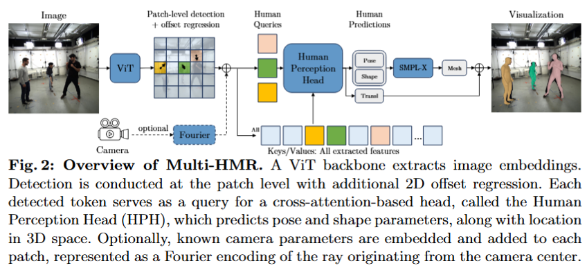

# 论文标题: Multi-HMR: Multi-Person Whole-Body Human Mesh Recovery in a Single Shot - arXiv 2024

### 一、引言与核心问题

本研究来自 NAVER LABS Europe，聚焦于计算机视觉与图形学交叉领域中的一个关键问题：从单张RGB图像中恢复多人的完整三维人体模型（Human Mesh Recovery, HMR）。这项技术在增强现实（AR）、虚拟现实（VR）、人机交互和机器人导航等领域具有巨大的应用潜力，因为它能够将二维图像中的人物信息提升到三维空间，实现对人体姿态、形状乃至表情的精细理解。

**论文试图解决的核心任务是什么？**

该论文的核心任务是开发一个高效且准确的**单阶段（single-shot）**模型，以端到端的方式直接从输入的单张图像中，同时检测并重建场景中所有人的**完整（whole-body）**三维网格模型。这里的“完整”指的是不仅包括身体的主要躯干和四肢，还涵盖了手部姿态和面部表情等高频细节。

*   **输入 (Input)**: 模型的输入是一张标准的单目RGB图像。
    *   **数据形态与维度 (Shape)**: 其数据维度为 `[Batch_size, 3, Height, Width]`，其中3代表RGB三个颜色通道。在论文的实验中，输入图像被处理成方形分辨率，例如 `448x448` 或 `896x896`。

*   **输出 (Output)**: 模型的输出是一个集合，包含了图像中检测到的 `N` 个人的三维信息。对于每个人 `n`，输出包含两部分：
    *   **三维人体网格模型 (3D Human Mesh)**: 通过 [SMPL-X](https://smpl-x.is.tue.mpg.de/) 参数化模型来表示。这组参数包括：
        *   姿态参数 $\theta$ (Pose): 控制身体、手部和下颌的关节旋转。
        *   体型参数 $\beta$ (Shape): 定义人体的整体高矮胖瘦。
        *   表情参数 $\alpha$ (Expression): 控制面部表情。
        *   这些参数共同构成了一个完整的人体网格，包含约10,475个顶点。
    *   **三维空间位置 (3D Location)**: 每个人的根关节（root joint）在相机坐标系下的三维平移向量 $t = (t_x, t_y, t_z)$。
    *   **数据形态与维度 (Shape)**: 输出可以被理解为一个 `N` 元素的列表，其中每个元素都是 `{SMPL-X_params, translation_vector}` 的组合。`N` 是在图像中动态检测到的人数。

*   **任务的应用场景**:
    *   **AR/VR**: 为用户创建逼真的虚拟化身（Avatar），实现沉浸式社交和互动。
    *   **人机交互**: 使机器人能够理解人类的姿态和意图，进行更自然的协作。
    *   **影视与游戏**: 自动化或辅助动画角色的动作捕捉流程。
    *   **运动科学与医疗**: 对运动员的动作或病人的康复情况进行三维量化分析。

*   **当前任务的挑战 (Pain Points)**:
    1.  **效率与错误累积**: 传统的多阶段（multi-stage）方法通常先使用一个独立的目标检测器识别人，然后在每个人的边界框（bounding box）内单独进行HMR。这种串联式流程不仅效率低下，而且检测阶段的误差会传递并影响后续的网格恢复精度。
    2.  **全局上下文缺失**: 基于裁剪图像块的方法，每个人的重建过程是相互隔离的，模型无法利用人与人之间的遮挡关系、相对位置等全局场景信息，这对于解决遮挡和深度排序问题至关重要。
    3.  **高频细节恢复困难**: 在单阶段模型中，不对身体局部（如手、脸）进行裁剪和放大，这意味着模型需要从分辨率相对较低的特征图中直接回归精细的姿态。这对于捕捉微妙的手指动作和面部表情是一个巨大的挑战。
    4.  **三维空间定位**: 准确估计每个在相机坐标系中的深度（Z轴位置）是一个病态问题（ill-posed problem），许多先前工作仅恢复根关节相对的网格，或预测相对深度，而非绝对的相机空间位置。

*   **论文针对的难点**: Multi-HMR模型的设计明确地瞄准了上述所有痛点。它追求一个**单阶段**的统一框架来解决效率和错误累积问题；通过**全局特征注意力机制**来利用上下文信息；通过引入一个**专门的合成数据集**来解决手部细节恢复的难题；并直接回归每个人在**相机空间**的绝对三维位置。

### 二、核心思想与主要贡献

**直观动机与设计体现**:

本研究的直观动机源于近年来Transformer在目标检测领域的成功，例如DETR。这些工作表明，可以将目标检测视为一个直接的集合预测问题（set prediction problem），利用Transformer的注意力机制从全局图像特征中解码出所有目标的信息。Multi-HMR将这一思想巧妙地迁移到多HMR任务中：**将场景中的每个人视为一个待预测的“目标”，模型需要直接从图像中“解码”出这个包含N个人三维信息的集合。**

这一动机清晰地体现在其核心技术设计——**人体感知头（Human Perception Head, HPH）**中。HPH采用交叉注意力（cross-attention）机制，让代表每个待检测人物的查询向量（query）能够与整个图像的特征图（keys and values）进行交互。这使得每个人的三维模型预测都能够基于对全局场景的充分理解，而非仅仅依赖于局部特征。

**与相关工作的比较与创新**:

与最相关的多HMR工作（如ROMP、BEV、PSVT）相比，这些方法虽然也是单阶段，但它们主要集中在**仅身体（body-only）**的网格恢复，并未解决手部和面部等高频细节的挑战。而那些能够处理**完整身体（whole-body）**的方法（如PIXIE, OSX, SMPLer-X），几乎都是针对单人场景设计的，并且严重依赖多裁剪（multi-crop）流程来保证手、脸的精度，无法高效处理多人场景。

Multi-HMR的创新之处在于，它**首次**将**单阶段**、**多人**和**完整身体**这三个关键特性成功地融合在一个统一的框架中，实现了性能和效率的突破。

**核心贡献与创新点**:

1.  **首个单阶段多完整身体HMR模型**: 提出了第一个能够在一个前向传播中同时处理多并恢复其完整身体（包括手和脸）三维网格的模型。该模型设计简洁、高效，且端到端可训练。
2.  **人体感知头 (Human Perception Head, HPH)**: 设计了一种新颖的、基于交叉注意力的解码器。它允许模型从全局图像特征中为每个检测到的人并行地、非层级化地回归其所有参数，有效利用了场景的全局上下文信息。
3.  **CUFFS合成数据集**: 为了解决单阶段方法难以恢复手部细节的问题，研究者创建并开源了一个名为CUFFS (Close-Up Frames of Full-body Subjects) 的合成数据集。该数据集包含大量人物近景图像，手部姿态清晰多样，为模型的精细化预测能力提供了关键的数据支持。

### 三、论文方法论 (The Proposed Pipeline)

**整体架构概述**:

Multi-HMR的整体流程清晰而优雅。首先，一张输入图像经过一个标准的视觉Transformer (ViT) 主干网络，提取出一个全局的、包含空间信息的特征图。接着，一个轻量级的检测模块在此特征图上以类似CenterNet的方式预测出每个人的中心点头部位置。这些检测到的位置所对应的特征向量被用作初始化查询（Queries），送入核心的人体感知头（HPH）。在HPH中，每个查询向量通过交叉注意力机制与全局特征图进行多次交互，不断优化自身的信息表示。最终，经过HPH处理后的查询向量被送入一个多层感知机（MLP），直接回归出每个人的SMPL-X参数和在相机坐标系下的深度，从而完成整个三维重建过程。

**详细网络架构与数据流**:

*   **数据预处理与主干网络**:
    *   **输入**: 图像 $I \in \mathbb{R}^{H \times W \times 3}$。
    *   **ViT Backbone**: 图像被分割成 $P \times P$ 大小的图像块（patches），例如 $14 \times 14$。每个图像块被线性嵌入为一个Token，并加上位置编码。这些Tokens被送入ViT编码器（如ViT-S, ViT-B, ViT-L），经过多层自注意力计算后，输出一个特征张量 $E \in \mathbb{R}^{(H/P) \times (W/P) \times D}$，其中 $D$ 是特征维度。
    *   **形状变换**: 例如，对于 $448 \times 448$ 的输入和 $14 \times 14$ 的patch大小，输出特征图的空间维度为 $32 \times 32$。ViT的特点是其整个处理过程中特征图的空间分辨率保持不变，这为后续的基于网格的检测提供了便利。
    *   **（可选）相机参数嵌入**: 如果相机的内参矩阵 $K$ 可知，模型可以为每个patch中心计算其在相机坐标系下的射线方向，并通过傅里叶编码将其嵌入为特征向量。该特征会与ViT输出的图像特征拼接，使得模型具备相机感知能力，从而提高三维定位的准确性。

*   **人体检测模块**:
    *   **Patch-level Detection**: 对于ViT输出的每个位置 `(i, j)` 的特征向量 $E^{i,j}$，一个简单的MLP会预测两个值：
        1.  一个置信度分数 $s^{i,j} \in [0, 1]$，表示该patch包含人体主要关键点（本文选择头部）的概率。
        2.  一个二维偏移量 $\delta = (\delta_u, \delta_v)$，用于精细化关键点在patch内的具体位置。
    *   通过对分数图 $s$ 设置阈值，即可得到所有检测到的人的粗略位置，再通过偏移量回归得到精确的二维坐标。

*   **人体感知头 (Human Perception Head - HPH)**:
    *   **模块类型**: 基于Transformer解码器的交叉注意力模块。
    *   **设计细节与数据流**:
        1.  **Query初始化**: 对于每个检测到的人 $n$，其对应的特征向量 $E_n$ 从特征图 $E$ 中被提取出来。这个特征向量与一个可学习的、依赖于patch位置的初始化向量以及SMPL-X的平均参数嵌入进行拼接和变换，形成初始查询向量 $Q_n^0$。所有 `N` 个人的初始查询向量被堆叠成 $Q^0 \in \mathbb{R}^{N \times (D+D')}$。
        2.  **Key-Value设定**: 整个ViT输出的特征图 $E$ 被用作交叉注意力层中的键（Keys）和值（Values）。
        3.  **迭代优化**: 查询矩阵 $Q$ 会经过 $L$ 个HPH块的迭代处理（论文中 $L=2$）。每个块内部包含：
            *   **交叉注意力 (Cross-Attention)**: $Q$ 作为查询，与来自全局特征图 $E$ 的 $K, V$ 进行注意力计算。这一步使得每个人的表示能够聚合来自全图的有用信息。
            *   **自注意力 (Self-Attention)**: 在查询向量集合 $Q$ 内部进行自注意力计算。这一步允许不同人的表示之间进行信息交互，有助于模型理解人与人之间的关系，例如避免碰撞和推断遮挡。
            *   **MLP (Feed-forward Network)**: 对每个查询向量进行特征变换。
    *   **形状变换**: 查询矩阵 $Q$ 的形状 `[N, Dim]` 在HPH中保持不变，但其内容表征在每一层都被持续优化。
    *   **消融实验分析**: 论文的Table 3表明，同时使用交叉注意力和自注意力（即完整的HPH设计）相比于只使用其中之一或使用简单的并行回归头，性能有显著提升，证明了全局上下文和实例间信息交互的有效性。

*   **参数回归与深度估计**:
    *   **输出**: 经过 $L$ 层HPH块处理后，最终的查询矩阵 $Q^L$ 被送入一个共享的MLP头。
    *   **回归目标**: 对于每个查询向量，MLP回归出其对应的SMPL-X参数（姿态、体型、表情）和深度信息。
    *   **深度参数化**: 模型不直接回归深度 $d$，而是回归一个在对数空间的“临近度” $\eta$，最终深度通过 $d = \exp(-\eta)$ 计算得到。这种参数化方式对焦距变化更具鲁棒性。最终的三维位置 $t$ 通过将二维检测坐标和预测的深度 $d$ 利用相机内参反投影回三维空间得到。

**损失函数 (Loss Function)**:

*   **设计理念**: 损失函数是一个多任务的组合，旨在从不同层面监督模型的输出，确保检测的准确性、三维模型的几何精度以及其在图像平面上的投影正确性。
*   **数学形式与关注重点**:
    *   $L_{det}$: 检测损失，采用二值交叉熵损失来监督人体中心热力图的生成。
    *   $L_{params}$: 参数回归损失，对预测的2D偏移量、SMPL-X参数（$\theta, \beta, \alpha$）和深度 $d$ 与真值（ground-truth）之间的 $L_1$ 范数进行监督。
    *   $L_{mesh}$: 网格顶点损失，计算预测的以根关节为中心的3D网格顶点与真值顶点之间的 $L_1$ 距离。这个损失直接监督几何形状的准确性。
    *   $L_{reproj}$: 重投影损失，将最终放置在相机空间中的3D网格（$M_n + t_n$）重新投影回2D图像平面，并计算其与2D真值关键点或轮廓之间的 $L_1$ 距离。这个损失确保了三维模型与二维图像的对齐。
    *   **总损失**: $L = L_{det} + L_{params} + \lambda(L_{mesh} + L_{reproj})$，其中 $\lambda$ 是一个平衡超参数。

**数据集 (Dataset)**:

*   **所用数据集**: 训练主要依赖大规模的**合成数据集**，因为它们能提供精确的3D网格真值标签，这是真实世界数据难以获取的。
    *   **BEDLAM**: 大规模多合成数据集，包含多样的体型、衣物和场景。
    *   **AGORA**: 具有高逼真度渲染效果的多合成数据集。
    *   **CUFFS (本文贡献)**: 针对性构建的近景、手部姿态丰富的合成数据集，共6万张图像。
*   **特殊处理**: Multi-HMR成功的关键之一是其训练数据的策略。
    *   **合成数据为主**: 实验（Table 2b）表明，仅使用合成数据训练的效果优于使用带有伪真值（pseudo ground-truth）的真实数据，这凸显了高质量3D标签的重要性。
    *   **CUFFS的引入**: 消融研究明确显示，加入CUFFS数据集后，手部的预测精度（EHF-H指标）得到了巨大提升，验证了其在弥补单阶段模型短板上的关键作用。

### 四、实验结果与分析

**核心实验结果**:

Multi-HMR在多个主流的body-only和whole-body基准测试中均取得了当前最佳（state-of-the-art）或极具竞争力的表现。其结果的突出之处在于，它用一个统一、简洁的模型，在多和完整身体两个维度上同时超越了那些为特定子任务设计的、结构更复杂的模型。

以下是论文中关键的对比表格（以AGORA和UBody数据集为例，数据来自Table 5）的解读摘要：

| 指标 (越低越好)       | 任务         | 基线方法 (PSVT) | 基线方法 (SMPLer-X) | 本文方法 (Multi-HMR) |
| --------------------- | ------------ | --------------- | ------------------- | -------------------- |
| **AGORA (PVE)**       | 多, 身体     | 94.1            | 71.7 (单)           | **61.1** (ViT-L)     |
| **UBody (PVE-All)**   | 单, 完整身体 | -               | 31.9                | **21.0** (ViT-L)     |
| **UBody (PVE-Hands)** | 单, 完整身体 | -               | 10.3                | **7.2** (ViT-L)      |

从上表可以看出，在多、身体任务上，Multi-HMR的PVE（Per-Vertex Error，平均顶点误差）远低于之前的SoTA方法PSVT。在完整身体任务上，即使与为单人设计的、依赖特征重采样等复杂技术的SMPLer-X相比，Multi-HMR在全身、特别是手部的精度上都取得了显著优势。

**消融研究解读**:

*   **架构选择**: Table 2a清晰地表明，“ViT + HPH”的组合优于传统的“HRNet + 回归头”或其他组合，证明了ViT主干和HPH解码器是架构成功的关键。
*   **训练数据**: Table 2b证明了合成数据的重要性，特别是CUFFS数据集对于手部精度提升的决定性作用。
*   **HPH设计**: Table 3验证了HPH中自注意力和交叉注意力的协同作用对于模型性能至关重要。

**可视化结果分析**:

论文中的Figure 5和Figure 11展示了在各种复杂场景下的重建结果。这些可视化结果直观地证明了模型的有效性：
1.  **多能力**: 能够稳健地处理包含多人的拥挤场景。
2.  **完整身体**: 即使在全身图像中，也能恢复出合理的手部姿态和面部细节。
3.  **三维定位**: 人物在场景中的深度排序和空间布局看起来自然且符合逻辑。

### 五、方法优势与深层分析

**架构/设计优势**:

*   **效率与简洁性**: 作为一个单阶段模型，Multi-HMR避免了多阶段流程的复杂性和耗时。其推理速度（Table 6b）几乎不受场景中人数的影响，展现出卓越的可扩展性，这对于实时应用至关重要。
*   **全局上下文感知**: HPH的核心设计——交叉注意力机制，是该方法性能强大的根本原因。它打破了传统基于裁剪框的局部视野限制，使得对每个人的预测都能考虑到整张图像的信息。这对于处理人与人之间的遮挡、推断被部分遮挡的身体姿态、以及更准确地将人放置在三维场景中都具有天然的优势。
*   **强大的特征表示**: 采用预训练的ViT作为主干网络，使其能够从强大的视觉先验知识中获益。ViT的全局感受野特性与HPH的全局注意力机制相得益彰，共同构成了模型强大的特征提取和解码能力。
*   **针对性数据策略**: 认识到单阶段模型在恢复高频细节上的固有困难，并主动通过构建CUFFS数据集来解决，这体现了对问题核心矛盾的深刻洞察和务实的工程解决思路。

**解决难点的思想与实践**:

Multi-HMR的核心思想是将多HMR任务**重新范式化为一个基于全局信息的集合预测问题**。

*   针对**效率和错误累积**的难点，它通过**端到端的单阶段设计**在实践中彻底解决了。
*   针对**全局上下文缺失**的难点，它通过**HPH的交叉注意力机制**，让每个预测实例都能“看到”全局图像，从而在实践中有效地利用了场景信息。
*   针对**高频细节恢复**的难点，它没有采用增加模型复杂度（如多级特征图融合或局部特征重采样）的传统路径，而是另辟蹊径，通过**构建CUFFS数据集**从数据层面为模型赋能，实践证明这是一种高效且有效的策略。
*   针对**三维空间定位**的难点，它通过**直接回归鲁棒的深度参数**并结合**相机感知嵌入**，在实践中实现了比以往方法更准确的绝对空间定位。

### 六、结论与个人思考

**论文的主要结论回顾**:

Multi-HMR成功地设计并实现了首个单阶段、多、完整身体的人体三维网格恢复模型。它不仅在概念上统一和简化了这一复杂任务，而且在多个权威基准上取得了业界领先的性能。该工作证明了，借助强大的Transformer架构和针对性的数据策略，直接从全局场景中解码出多人的精细三维模型是完全可行的。

**潜在局限性**:

*   **检测极限**: 该方法依赖于CenterNet式的检测范式，即每个网格单元（patch）最多检测一个目标。在极端拥挤、人中心点高度重叠的场景下，可能会出现检测失败（漏检）的情况。
*   **对关键点（头部）的依赖**: 由于检测是基于头部关键点的，如果人物的头部被完全遮挡或截断（out of frame），模型可能无法检测到该人物。
*   **参数化模型的局限**: SMPL-X模型本身虽然表达能力强，但对于一些非常规的姿态或复杂的衣物形变，其表示能力仍然有限。同时，基于运动学树的姿态表示可能导致误差从父关节累积到子关节。

**未来工作方向**:

*   **更鲁棒的检测机制**: 可以探索在HPH中引入类似DETR的可学习对象查询（learnable object queries），或者允许每个patch预测多个目标，以提高在极端拥挤场景下的鲁棒性。
*   **处理截断与遮挡**: 通过在训练数据中引入更积极的裁剪和遮挡增强，可以提升模型在部分可见情况下的泛化能力。
*   **探索新的三维表示**: 研究超越SMPL-X的参数化模型，或者探索基于神经场（如NeRF）的表示方法，可能会带来更高保真度的重建效果。

**对个人研究的启发**:

这篇论文给我最大的启发是，在解决复杂的计算机视觉问题时，**全局上下文**的利用和**数据策略**的创新同样重要，有时甚至比单纯堆叠更复杂的网络模块更为有效。Multi-HMR没有走传统的增加模型结构复杂度的老路，而是回归到任务的本质——一个集合预测问题，并利用Transformer强大的全局信息整合能力，同时辅以精准的数据“补丁”（CUFFS数据集）来攻克短板，这种解决问题的思路极具启发性。它也再次证明了Transformer架构在视觉感知任务中的巨大潜力。