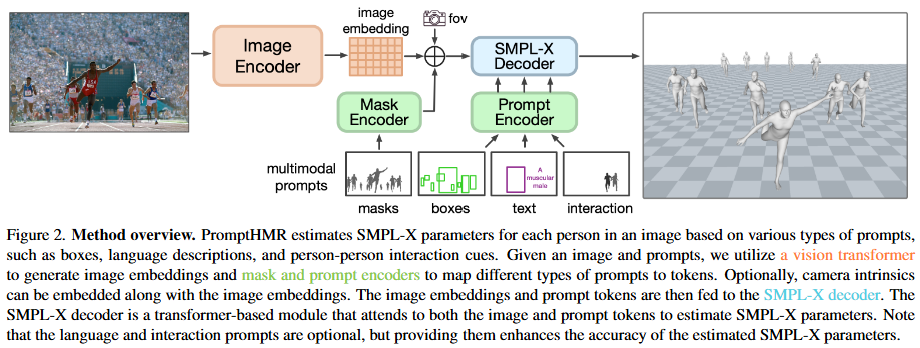

# PromptHMR: Promptable Human Mesh Recovery - CVPR 2025

> **Arxiv ID:** [2504.06397](https://arxiv.org/abs/2504.06397)
> **Code:** [https://github.com/yufu-wang/PromptHMR](https://github.com/yufu-wang/PromptHMR)

### 一、引言与核心问题

PromptHMR 是一篇旨在解决复杂场景下 **3D 人体姿态与形状估计 (HPS)** 的论文。传统的 HPS 方法通常遵循 "检测-裁剪-回归" 的范式，即先检测人体包围框，裁剪出单人图像，再回归 SMPL 参数。这种方法在严重遮挡、人群拥挤或截断场景下表现不佳，因为它丢失了全局场景上下文，且过度依赖检测器的准确性。

**核心任务**：
从一张全分辨率图像中，根据提供的“提示 (Prompts)”（如包围框、掩码、文本描述、交互信息），恢复出场景中特定人体的 SMPL-X 参数。

*   **输入 (Input)**:
    *   **图像**: 高分辨率全图 `[B, 3, 896, 896]`。使用 896x896 的大尺寸是为了在全图输入下保留远景人体的细节。
    *   **提示 (Prompts)**:
        *   **Spatial Prompts**: 
            *   Bounding Boxes: `[B, N, 4]` (支持全身框、半身框甚至仅人脸框)。
            *   Segmentation Masks: `[B, N, H, W]` (二进制掩码)。
            *   Keypoints: `[B, N, 17, 3]` (稀疏 2D 关键点，可选)。
        *   **Semantic Prompts**: 
            *   Text: `[B, N, D_clip]` (CLIP 文本嵌入，用于描述体型，如 "a tall person")。
            *   Interaction: `bool` (指示是否有人际交互)。
*   **输出 (Output)**:
    *   **SMPL-X 参数**:
        *   Pose $\theta$: `[B, N, 22, 3]` (使用 6D 旋转表示时为 `[B, N, 22, 6]`)。
        *   Shape $\beta$: `[B, N, 10]`。
        *   Translation $\tau$: `[B, N, 3]` (相机坐标系下的位移)。
    *   **Mesh**: 最终生成的 3D 人体网格。

**当前任务的挑战 (Pain Points)**:
1.  **检测与重建的矛盾**: 在拥挤场景中，检测器常漏检或给出错误的包围框，导致下游重建失败。
2.  **全局信息的缺失**: 裁剪图（Crop-based）方法丢失了人与人之间的相对位置和场景深度信息，难以处理交互（Interaction）和遮挡（Occlusion）。
3.  **体型歧义**: 单目图像难以准确恢复胖瘦高矮（Perspective Ambiguity），特别是对于宽松衣物或不常见体型。

**论文针对的难点**: 本文提出 "Promptable" 架构，允许利用 VLMs 或用户提供的**辅助信息（Side Information）**来引导重建过程，从而解耦检测与重建，并利用全图上下文解决遮挡和交互问题。

### 二、核心思想与主要贡献

*   **直观动机**: 既然单纯的图像回归器在语义理解（如体型描述）和抗遮挡上能力有限，而 Vision-Language Models (VLMs) 擅长理解语义但不擅长 3D 几何，为何不将两者结合？通过 "Prompt" 的方式，告诉网络“去重建那个穿红衣服的人”或者“这个人很强壮”，网络只需专注于几何回归。
*   **与相关工作比较**:
    *   对比 **HMR2.0/CLIFF** (Crop-based): PromptHMR 处理全图，保留了全局上下文，且不依赖完美检测框（支持 Face Box 重建全身）。
    *   对比 **BEV/Multi-HMR** (Full-image): 这些方法通常也是基于检测的。PromptHMR 引入了类似 SAM (Segment Anything) 的交互式 Prompt 机制，支持多模态输入。
*   **核心贡献**:
    1.  提出了首个 **Promptable HPS 架构**，支持 Box, Mask, Keypoints, Text 多种提示。
    2.  设计了 **Cross-Person Attention** 机制，显式建模人与人之间的交互，解决穿模和相对位置问题。
    3.  通过文本提示 (Text Prompt) 显著提升了体型 (Body Shape) 估计的准确性，缓解了单目视觉的歧义。

### 三、论文方法论 (The Proposed Pipeline)

PromptHMR 采用类似 SAM 的 Transformer 架构：**Image Encoder** 提取图像特征，**Prompt Encoder** 编码提示信息，**Lightweight Decoder** 融合两者并回归参数。

#### 1. Image Encoder (Vision Transformer)
*   **Backbone**: 采用 **ViT-L (DINOv2)**。
*   **输入处理**: 图像被缩放至 896x896，Patch Size 为 14。
*   **数据流**: `[B, 3, 896, 896]` $\to$ `[B, 4096, 1024]`。
*   **Camera Encoding**: 为了让特征感知相机参数（Intrinsics $K$），网络引入了一个 **Camera Encoder**。它将像素坐标 $(u, v)$ 根据 $K^{-1}$ 反投影为射线 (Rays)，使用傅里叶位置编码 (Fourier PE) 编码射线方向，并将其拼接到图像特征上，通过 $1 \times 1$ 卷积融合。

#### 2. Prompt Encoder
将各种稀疏或稠密提示映射为统一的 Token 空间 (Dim=1024)。
*   **Box / Keypoints (Sparse)**:
    *   使用 **Random Fourier Features** (正弦/余弦位置编码) 编码坐标。
    *   Box 编码为 2 个角点 Token (Top-Left, Bottom-Right)。
    *   如果是 Face Box 或 Truncated Box，网络在训练时通过数据增强（模拟噪声框）学会鲁棒处理。
*   **Text (Sparse)**:
    *   使用预训练的 **CLIP (ViT-L-14)** 提取文本特征，通过线性层投影到 1024 维。
    *   形状：`[B, N, 1, 1024]`。
*   **Mask (Dense)**:
    *   输入：二值掩码 `[B, N, H, W]`。
    *   **CNN Encoder**: 使用一个轻量级 CNN（包含 3 层卷积，步长为 2），将掩码下采样 4 倍，使其空间分辨率与 Image Embeddings 对齐。
    *   **融合方式**: 掩码特征被直接**相加 (Element-wise Sum)** 到 Image Embeddings 上，作为空间注意力偏置。

#### 3. SMPL-X Decoder (Two-Way Transformer)
这是一个改进版的 Transformer Decoder，负责从图像特征中提取特定人体的 3D 参数。
*   **Input Tokens**: 拼接以下 Token 作为查询 (Query):
    *   `SMPL_Token` (Learnable)
    *   `Depth_Token` (Learnable)
    *   `Sparse_Prompt_Tokens` (Box/Text features)
*   **Attention Block 设计**:
    每个 Block 包含四步交互：
    1.  **Self-Attention**: Query Tokens 之间的交互。
    2.  **Cross-Person Attention (关键创新)**:
        *   如果开启 `interaction` 提示，网络会将 Batch 内所有人体的 Query Tokens 视为一个序列。
        *   操作：`Rearrange: [B, N_tokens, D] -> [1, B * N_tokens, D]`。
        *   这允许第 $i$ 个人的 Token 注意到第 $j$ 个人的 Token，从而交换姿态信息，避免碰撞。
    3.  **Token-to-Image Cross-Attention**: Query 关注图像特征（提取人体外观）。
    4.  **Image-to-Token Cross-Attention**: 图像特征反向关注 Query（更新图像特征上下文，类似 SAM 的设计）。

#### 4. Regression Heads
Transformer 输出的 `SMPL_Token` 和 `Depth_Token` 分别送入 MLP 回归头：
*   **Pose Head**: 输出 $\theta \in \mathbb{R}^{22 \times 6}$ (6D Rotation)。
*   **Shape Head**: 输出 $\beta \in \mathbb{R}^{10}$。
*   **Cam Head**: 输出弱透视投影参数 $(s, t_x, t_y)$ 和 深度 $z$。

#### 5. 损失函数 (Loss Function)
采用标准的 HPS 损失组合：
*   **L_SMPL**: $\theta, \beta$ 的 MSE Loss。
*   **L_3D**: 3D 关节坐标和 Vertex 坐标的 L1 Loss。
*   **L_2D**: 投影 2D 关节的 L1 Loss (抗遮挡的关键)。
*   **L_Adv**: 对抗损失，确保生成的人体姿态符合真实分布。

#### 6. 数据集与训练策略
*   **训练数据**: 混合了 BEDLAM (合成), AGORA, COCO, MPII, 3DPW, CHI3D, HI4D。
*   **Prompt 模拟**: 训练时随机采样 Ground Truth Box，并对其添加噪声、裁剪（模拟仅检测到上半身或人脸），以训练网络对不完美 Prompt 的鲁棒性。
*   **Text 生成**: 使用 SHAPY 方法从 GT Shape 生成描述（如 "muscular", "short legs"）作为文本输入。

### 四、实验结果与分析

#### 1. 核心定量对比 (Reconstruction Accuracy)
在标准基准数据集 3DPW, EMDB, RICH 上，PromptHMR 均取得了 SOTA 或接近 SOTA 的结果。

| Dataset  | Metric (mm)   | HMR2.0 (Crop) | CameraHMR (Full) | **PromptHMR (Ours)** | 结论                                    |
| :------- | :------------ | :------------ | :--------------- | :------------------- | :-------------------------------------- |
| **3DPW** | PA-MPJPE      | 44.4          | 35.1             | **36.6**             | 优于大多数 Crop 方法，与 CameraHMR 持平 |
| **EMDB** | PA-MPJPE      | 61.5          | 43.3             | **41.0**             | 在复杂野外场景显著优于 HMR2.0           |
| **HI4D** | Pair-PA-MPJPE | -             | 80.6             | **39.5**             | **交互重建误差大幅下降 (主要优势)**     |

*注：Pair-PA-MPJPE 是衡量双人相对位置误差的指标，数值越低越好。*

#### 2. 消融研究 (Ablation Study)
*   **Text Prompt 的作用**: 在 HBW (Human Body w/ Shape) 数据集上测试，加入文本提示后，体型估计误差显著降低。这意味着 VLMs 的语义理解成功被转移到了几何重建中。
*   **Interaction Attention 的作用**: 实验表明，在不加交互模块时，双人重建常出现严重穿模。加入 Cross-Person Attention 后，Pair-PA-MPJPE 从 83.0mm 降至 47.9mm。

#### 3. 可视化分析
*   **鲁棒性**: 即使输入仅仅是**人脸框 (Face Box)**，PromptHMR 也能利用全图上下文准确“补全”并重建身体姿态，这是 Crop-based 方法完全做不到的。
*   **拥挤场景**: 在遮挡严重时，Mask Prompt 引导网络只关注可见区域，避免了将遮挡物误认为人体的一部分。

### 五、方法优势与深层分析

1.  **解耦检测与回归 (Decoupling Detection from Regression)**:
    传统的 Full-image 方法（如 BEV）需要在网络内部同时完成检测和回归，任务过于繁重。PromptHMR 将“在哪里 (Where)”的问题交给外部 Prompt（检测器、用户或 VLM），自己专注于“是什么 (What/How)”。这使得它能利用更强大的外部检测器（如 YOLO-World, GroundingDINO）。

2.  **全局感受野 (Global Receptive Field)**:
    输入 896x896 的全图并通过 ViT 编码，使得网络能够理解地平面（Ground Plane）约束和人与环境的比例关系。这对于解决**深度歧义 (Depth Ambiguity)** 至关重要，因为网络可以参考周围物体的大小来推断人的绝对尺度。

3.  **语义驱动几何 (Semantics-Driven Geometry)**:
    通过 CLIP 文本嵌入注入体型先验，本质上是引入了额外的约束条件。在单目图像中，"一个胖子站得远"和"一个瘦子站得近"在 2D 投影上可能相似。文本提示 "fat person" 直接打破了这种歧义，这是纯视觉方法难以解决的 ill-posed 问题。

### 六、结论与个人思考

**主要结论**: PromptHMR 证明了将 3D 人体重建设计为“可提示 (Promptable)”的任务是可行的，并且能够有效利用全图上下文和多模态信息来提升准确性和鲁棒性。

**潜在局限**:
*   **计算开销**: 896x896 的 ViT-L 编码器计算量巨大，推理速度可能较慢，难以在移动端实时运行。
*   **依赖 Prompt 质量**: 虽然对噪声框有鲁棒性，但如果 Prompt 完全错误（如指到了背景），网络可能会产生幻觉。
*   **Mask 依赖**: 虽然支持 Box，但最高精度的交互重建仍依赖高质量的 Mask，而获取 Mask 本身也是一个计算昂贵的过程（如需运行 SAM）。

**对研究的启发**:
*   **VLM Loop**: 这项工作为构建 "VLM $\leftrightarrow$ 3D" 的闭环系统铺平了道路。未来可以设计一个 Agent，先用 VLM 观察图片提出假设（"这里有个人在做交互"），然后生成 Prompt 给 PromptHMR 验证并重建，最后将 3D 结果反馈给 VLM 修正理解。
*   **Everything is Promptable**: 这种思路可以扩展到手部重建 (Hand)、人脸 (Face) 甚至通用物体 3D 重建。