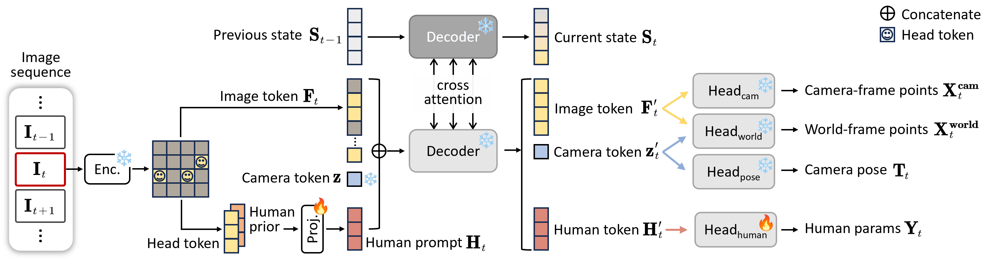

# 论文标题: HUMAN3R: EVERYONE EVERYWHERE ALL AT ONCE - arXiv 2025

### 一、引言与核心问题

**研究背景与重要性**
在计算机图形学与视觉领域，从单目视频中对动态的人体及其所在的三维场景进行同步重建（即4D Human-Scene Reconstruction）是一项至关重要的基础任务。它旨在恢复场景中所有人的三维运动（"Everyone"）、周围环境的几何结构（"Everywhere"），以及相机自身的轨迹。这项技术是实现增强现实（AR）、虚拟现实（VR）、人形机器人策略学习、自动驾驶和高级人机交互等前沿应用的核心基石。一个能够实时、准确、且在统一框架下完成此任务的模型，将极大地推动这些领域的发展。

**论文试图解决的核心任务是什么？**
该论文旨在解决从单目RGB视频流中进行在线的、实时的、全局坐标系下的多智能体（人）-场景联合四维重建问题。

*   **输入 (Input)**:
    *   一个连续的、随时间变化的单目RGB图像流 $I_t$。
    *   **数据维度/Shape**: 对于每一帧图像 $I_t \in \mathbb{R}^{H \times W \times 3}$，其中 $t$ 代表时间步。这是一个流式输入，模型在每个时间步只处理当前帧。

*   **输出 (Output)**:
    *   在每个时间步 $t$，模型会输出一个包含多个部分的、在世界坐标系下对齐的完整场景描述：
        1.  **多个人体的三维网格 (Multi-person Meshes)**: 一个包含 $N$ 个人的三维人体网格集合 $\{M^n \in \mathbb{R}^{V \times 3}\}_{n=1}^N$。每个人体由SMPL-X参数化模型表示，其中顶点数 $V = 10,475$。
        2.  **相机位姿 (Camera Pose)**: 相机的外参矩阵 $T_t \in \mathbb{R}^{3 \times 4}$ 和内参矩阵 $C_t \in \mathbb{R}^{3 \times 3}$。
        3.  **稠密三维场景 (Dense 3D Scene)**: 一个与输入图像像素对齐的稠密三维点云 $X_t \in \mathbb{R}^{H \times W \times 3}$。

*   **任务的应用场景**:
    *   **AR/VR**: 在真实世界中无缝叠加虚拟角色或物体，实现逼真的虚实交互。
    *   **机器人学**: 帮助人形机器人理解并预测人类行为，从而在共享空间中安全、自然地进行协作。
    *   **自动驾驶**: 精确感知和预测行人的运动轨迹，提升驾驶系统的安全性。
    *   **影视制作与游戏**: 以较低成本高效捕捉真实场景中的人体运动，用于动画制作和虚拟角色驱动。

*   **当前任务的挑战 (Pain Points)**:
    1.  **流水线复杂与误差累积 (Multi-stage Pipeline)**: 传统方法通常依赖于一个复杂的多阶段流水线，包括：首先使用目标检测器识别人体，然后用追踪算法关联不同帧中的同一个人，接着对每个人运行单人人体姿态估计算法（HMR），同时并行运行SLAM系统来估计相机位姿和稀疏场景，最后通过复杂的优化过程将这些独立的结果融合在一起。这个过程不仅计算开销巨大，而且每个模块的误差会向下游传递并累积，导致最终结果不稳定。
    2.  **重度依赖与部署困难 (Heavy Dependencies)**: 上述流水线依赖大量预训练的、彼此独立的“现成”模型（off-the-shelf models）。这使得整个系统的部署、维护和端到端优化变得异常困难，严重阻碍了其在资源受限设备上的实时应用。
    3.  **缺乏统一时空建模**: 各个模块独立工作，难以对人与场景、人与人之间的时空关系进行统一、连贯的建模，导致重建结果在物理真实性和长期一致性上存在缺陷。

*   **论文针对的难点**:
    本论文的核心目标是彻底颠覆上述复杂且割裂的技术范式。它主要针对**流水线复杂性**和**重度依赖**这两大痛点，旨在设计一个**单一、统一、端到端**的模型，能够在一个前向传播过程中，实时地联合输出所有重建结果（"all-at-once"），从而极大地提升效率、鲁棒性和易用性。

### 二、核心思想与主要贡献

*   **直观动机与设计体现**:
    研究的直观动机是，与其从零开始构建一个复杂的联合模型，不如站在巨人的肩膀上——利用一个强大的、预训练好的通用4D场景重建基础模型，并通过高效的方式“教会”它理解和重建其中特定的一类动态对象：人类。
    这一动机在技术设计上体现为：论文选择了一个名为 **CUT3R** 的SOTA级别的4D重建基础模型作为其骨干网络。CUT3R本身就能从视频中重建场景几何和相机位姿，并具有一个能够编码时空信息的循环记忆状态。Human3R的巧妙之处在于，它**冻结了CUT3R的全部主干参数**，仅通过引入少量可训练的、专门用于处理人体的“**适配器**”模块，并利用**视觉提示调优 (Visual Prompt Tuning, VPT)** 的思想，将人体重建任务“注入”到CUT3R强大的时空感知能力中。这种设计不仅极大地节约了训练成本，也完美地继承并利用了基础模型的强大先验知识。

*   **与相关工作的比较与创新**:
    *   **与CUT3R的比较**: CUT3R是本文的基础，但它只能输出通用的、非结构化的场景点云，无法显式地分离和重建出具有标准拓扑结构的人体骨骼和蒙皮网格（如SMPL-X模型）。Human3R的核心创新在于，它在CUT3R的框架内设计了一种机制，能够直接“解码”出结构化的人体参数。
    *   **与Multi-HMR等单帧多人HMR方法的比较**: Multi-HMR等方法虽然能在一张图像中重建多个人体，但它们通常在2D图像空间进行操作，缺乏对3D场景的感知，因此对相机内参非常敏感，且无法恢复人体在世界坐标系下的全局位置。Human3R通过将人体重建置于CUT3R提供的3D场景上下文中，天然地具备了尺度感知和全局定位能力，因此对相机内参具有更强的鲁棒性。
    *   **与JOSH3R等联合优化方法的比较**: JOSH3R等工作虽然也进行人-景联合重建，但仍依赖于多个预计算模块（如单人HMR、分割等）的结果，并通过迭代优化的方式进行融合，无法做到实时在线推理。Human3R则是一个完全的**前向传播 (feed-forward)** 模型，实现了真正的实时性能。

*   **核心贡献与创新点**:
    1.  **统一的“All-at-Once”框架**: 首次提出了一个单一、前向传播的统一框架，能够从单目视频中实时、在线地联合重建多个人体的全局运动、稠密场景几何以及相机轨迹，彻底摆脱了传统多阶段、多依赖的复杂流水线。
    2.  **高效的视觉提示调优策略**: 设计了一种新颖的、基于人体头部的视觉提示调优方法。该方法通过检测CUT3R特征图中的头部位置作为“锚点”，融合一个预训练的人体先验编码器 (Multi-HMR) 的特征，形成信息丰富的“人体提示 (Human Prompt)”，并将其注入解码器中，从而引导模型在不改变主干网络的情况下输出精确的人体参数。
    3.  **卓越的性能与效率**: 仅需在小规模合成数据集(BEDLAM)上进行一天的训练，模型便能在多项基准测试（包括局部人体网格恢复、全局人体运动估计、相机位姿估计等）上达到SOTA或极具竞争力的性能，同时保持15 FPS的实时推理速度和仅8GB的低显存占用。

### 三、论文方法论 (The Proposed Pipeline)

*   **整体架构概述**:
    Human3R的整体流程构建在冻结的CUT3R模型之上。对于输入的每一视频帧，首先由CUT3R的图像编码器提取出图像特征令牌（Image Tokens）。随后，一个轻量级的检测头在这些令牌中定位出所有人类的头部位置。利用这些位置索引，系统会从CUT3R的特征和另一个冻结的Multi-HMR人体先验编码器的特征中，分别提取出对应的“头部令牌”。这两组令牌被拼接并经过一个投影层，形成最终的“人体提示”。这些人体提示与原始的图像令牌及相机令牌一同被送入CUT3R的循环解码器。解码器在更新其内部场景记忆状态的同时，对所有令牌进行信息交互和提炼。最后，一个专为人体设计的新MLP头从被提炼后的人体提示中回归出SMPL-X参数，而CUT3R原有的头部则照常输出场景点云和相机位姿。整个过程一气呵成，无需任何迭代优化。

*   **详细网络架构与数据流**:
    1.  **数据预处理**: 输入视频帧 $I_t \in \mathbb{R}^{H \times W \times 3}$ 被送入网络。
    2.  **特征编码 (Frozen Encoders)**:
        *   **CUT3R图像编码器 (ViT-based)**: `Encoder_CUT3R` 将图像 $I_t$ 编码为一系列图像令牌 $F_t \in \mathbb{R}^{(H/16 \times W/16) \times C}$。
        *   **Multi-HMR人体先验编码器 (ViT-DINO based)**: `Encoder_HMR` 同样将图像 $I_t$ 编码为特征令牌 $F_{t, \text{HMR}}$。这两个编码器在训练期间均被冻结。
    3.  **头部检测与提示生成 (Trainable Modules)**:
        *   **头部检测**: 一个简单的MLP网络 `MLP_head` 作用于CUT3R的图像令牌 $F_t$，为每个令牌位置 $(i, j)$ 预测一个置信度分数 $s_t^{i,j}$，表示该位置是人头的概率。通过设定一个阈值 $\tau$，筛选出所有头部令牌的索引集合 $\{u_t\}_n$。
        *   **特征提取**: 根据索引 $\{u_t\}_n$，从 $F_t$ 和 $F_{t, \text{HMR}}$ 中分别提取出对应的头部令牌，得到 $F_t^u$ 和 $F_{t, \text{HMR}}^u$。
        *   **提示构建**: 将两组头部令牌在特征维度上进行拼接：$F_t^{\text{concat}} = [F_t^u; F_{t, \text{HMR}}^u]$。然后，一个可训练的投影层（MLP）`Head_projection` 将其映射为最终的人体提示 $H_t \in \mathbb{R}^{N_{\text{humans}} \times C_{\text{prompt}}}$。这一步的关键作用是注入了Multi-HMR带来的精细人体姿态和形状先验，弥补了CUT3R作为场景模型在人体细节上的不足。
    4.  **循环解码与信息融合 (Frozen Decoder)**:
        *   **输入聚合**: 将图像令牌 $F_t$、一个可学习的相机令牌 $z_t$ 和新生成的人体提示 $H_t$ 拼接在一起，作为CUT3R循环解码器 `Decoders` 的输入。
        *   **状态更新与特征提炼**: 解码器内部由两个交叉连接的Transformer Decoder组成，它接收当前帧的令牌输入和上一时刻的记忆状态 $S_{t-1}$，通过自注意力和交叉注意力机制进行复杂的时空信息交互。这个过程会输出更新后的记忆状态 $S_t$ 以及被场景上下文信息充分调制过的输出令牌 $[F'_t, z'_t, H'_t]$。
        *   **Shape Transformation**: 令牌在解码器内部的维度保持不变，但其承载的信息变得更加丰富和一致。例如，人体提示 $H_t$ 在经过解码器后变为 $H'_t$，其中已经隐式地包含了其在3D场景中的位置和与环境的交互信息。
    5.  **输出头 (Trainable & Frozen Heads)**:
        *   **人体参数回归 (Trainable)**: 一个新的MLP网络 `Head_human` 接收提炼后的人体提示 $H'_t$ 作为输入，直接回归出每个人的SMPL-X参数 $Y_t = \{(\theta, \beta, \alpha, P^{\text{cam}})_t\}_n$。
        *   **场景与相机输出 (Frozen)**: CUT3R原有的 `Head_world`、`Head_cam` 和 `Head_pose` 分别利用 $F'_t$ 和 $z'_t$ 输出世界坐标系下的点云 $X_t^{\text{world}}$、相机坐标系下的点云 $X_t^{\text{cam}}$ 和相机位姿 $T_t$。

*   **损失函数 (Loss Function)**:
    *   **设计理念**: 损失函数是一个多任务的加权和，其核心设计理念是：在学习新的人体重建任务的同时，必须通过监督CUT3R的原始输出来防止其遗忘从大规模数据中学到的强大场景重建先验（即“知识蒸馏”或“防止灾难性遗忘”）。
    *   **构成部分**:
        1.  $L_{\text{pointmap}}$: 场景点云损失，确保重建的场景几何是准确的。
        2.  $L_{\text{pose}}$: 相机位姿损失，确保相机轨迹的准确性。
        3.  $L_{\text{detection}}$: 头部检测损失（二元交叉熵），监督头部检测的准确性。
        4.  $L_{\text{smpl}}$: SMPL参数的L1回归损失，监督人体姿态、形状等参数。
        5.  $L_{\text{mesh}}$: 显式三维人体网格顶点的L1损失，提供更直接的几何监督。
        6.  $L_{\text{reproj}}$: 2D关节点的重投影损失，确保三维重建结果与二维图像观测一致。
    *   **训练实施**: 在训练中，这些损失项被加权求和，共同构成总的优化目标。只有与人体相关的模块（几个MLP头）的参数被更新。

*   **数据集 (Dataset)**:
    *   **所用数据集**: 训练和评估主要使用 **BEDLAM** 数据集。这是一个高质量的**合成**数据集，提供了带有精确标注的3D场景、相机位姿以及多个人体SMPL-X参数的视频序列。
    *   **特殊处理**: 作者仅使用了BEDLAM中场景几何明确的数据子集，排除了那些仅有HDRI背景的序列。最终使用了约5000个序列进行训练，1000个序列进行验证，每个序列中随机采样4帧作为一个训练样本。这种在小规模、高质量合成数据上的高效训练策略，凸显了该方法的参数和数据效率。

### 四、实验结果与分析

*   **核心实验结果**:
    Human3R在多个维度的评测中均展现出强大的竞争力。在最具挑战性的全局人体运动估计任务上，如下表所示（以EMDB-2数据集为例），Human3R相较于之前的SOTA在线方法（如WHAM）取得了显著的性能提升，特别是在长期轨迹精度（RTE降低了60%）上优势明显，这充分证明了其统一时空建模的优越性。

    | 指标 (EMDB-2)    | 方法    | 输入依赖 (Detection/Tracking/Local HMR等) | 类型    | WA-MPJPE (mm)↓ | W-MPJPE (mm)↓ | RTE (%)↓   |
    | ---------------- | ------- | ----------------------------------------- | ------- | -------------- | ------------- | ---------- |
    | (SOTA Offline)   | JOSH    | 需要                                      | Offline | 68.9           | 174.7         | 1.3        |
    | (SOTA Online)    | WHAM    | 需要                                      | Online  | 135.6          | 354.8         | 6.0        |
    | (本文方法)       | Human3R | **均不需要**                              | Online  | **112.2**      | **267.9**     | **2.2**    |
    | 提升幅度 vs WHAM | -       | -                                         | -       | -17.3%         | -24.5%        | **-63.3%** |

*   **消融研究解读**:
    论文中的消融实验清晰地证明了模型设计的合理性。
    1.  **人体先验的必要性**: 移除Multi-HMR提供的人体先验（"Human3R w/o Prior"）后，模型的各项指标均出现大幅下降。这表明，虽然CUT3R提供了强大的时空场景理解能力，但对于重建高质量、细节丰富的人体姿态和形状而言，来自专有领域模型（如Multi-HMR）的精细先验知识是不可或缺的。
    2.  **3D场景感知的优势**: 实验（图10）对比了Human3R与Multi-HMR在不同图像宽高比下的表现。结果显示，Multi-HMR的性能随宽高比变化而剧烈波动（因为它缺乏相机内参信息），而Human3R则表现得异常稳定。这有力地证明了，将人体重建置于一个尺度明确的3D场景上下文中，能够有效克服单帧2D方法对相机内参的敏感性，提升模型的鲁棒性。
    3.  **互惠互利**: 有趣的是，在为人体重建任务进行微调后，模型在通用的相机位姿估计和视频深度估计任务上的性能也略有提升（图8）。这说明对场景中的动态主体（人）进行显式建模，反过来也能帮助模型更好地理解和重建整个静态环境，实现了“人”与“景”的互惠。

### 五、方法优势与深层分析

*   **架构/设计优势**:
    1.  **知识继承与参数高效**: 该方法的核心优势在于其“站在巨人肩膀上”的哲学。通过冻结强大的预训练骨干网络，它继承了在大规模、多样化数据上学到的丰富时空先验知识，避免了从零开始训练的巨大成本和数据需求。同时，仅训练少量适配器模块（MLP）使其成为一种极其高效的参数调优范式。
    2.  **统一时空上下文**: 区别于将场景和人割裂处理的方法，Human3R在一个统一的循环记忆状态 $S_t$ 中对所有元素进行联合建模。这意味着在解码器内部，人体提示 $H_t$ 与图像/场景令牌 $F_t$ 进行了深度的信息交互。因此，对人体的估计天然地“感知”到了场景的几何约束（例如，人应该站在地面上），而对场景的理解也考虑到了动态人体的存在。这种统一上下文是实现高精度全局定位和长期一致性的关键。
    3.  **新颖的提示机制**: 将“检测”与“提示”相结合是一种巧妙的设计。它没有使用固定的、可学习的提示令牌，而是动态地从图像内容中识别出与任务最相关的区域（人头）作为提示的来源。这种内容自适应的提示机制比静态提示更加灵活和强大，特别是当场景中人数和位置不断变化时。

*   **解决难点的思想与实践**:
    Human3R通过“**基础模型 + 高效适配**”的核心思想，在实践中优雅地解决了传统方法的两大痛点。
    *   **针对“流水线复杂”与“重度依赖”**: 它用一个单一的、端到端的神经网络替换了过去由检测、追踪、HMR、SLAM等多个独立组件构成的复杂流水线。在推理时，只需将视频帧送入这个模型，即可得到所有结果。这不仅极大地简化了系统，也从根本上消除了模块间误差累积的问题。
    *   **实现方式**: 实践上，这是通过将人体重建任务重新表述为对一个通用4D重建模型的“**条件化生成**”问题来实现的。人体提示 $H_t$ 就扮演了这个“条件”的角色，它告诉解码器：“请在这些位置，利用你对时空和场景的理解，重建出符合人体结构和运动规律的对象。”

### 六、结论与个人思考

*   **论文结论回顾**:
    论文成功地提出并验证了Human3R，一个用于在线4D人-景重建的统一、高效且高性能的框架。它通过创新的提示调优方法，成功地将一个通用的4D重建基础模型适配到了特定的人体分析任务上，展示了基础模型在计算机视觉领域中的巨大潜力。

*   **潜在局限性**:
    1.  **对头部的依赖**: 当前的提示机制完全依赖于头部的可见性。在人群拥挤、遮挡严重或头部不可见的场景中，模型可能会失效。
    2.  **模型表达能力**: 人体由SMPL-X参数化模型表示，这意味着模型无法重建衣物、头发等非刚性表面细节，也无法表达超出SMPL模型空间的人体形态。
    3.  **交互与物理真实性**: 尽管模型能隐式地学习人与场景的交互，但它缺乏显式的物理约束。因此，在一些精细的接触和交互场景下（如人坐在椅子上），仍可能出现穿模等不真实的情况。

*   **未来工作方向**:
    1.  **更鲁棒的提示机制**: 可以探索融合更多人体关键点（如全身关节点）或像素级的身体部位分割图来生成提示，以降低对头部的单一依赖，提高在遮挡情况下的鲁棒性。
    2.  **更丰富的输出表示**: 可以探索将当前框架与高斯溅射 (Gaussian Splatting) 或神经场 (Neural Fields) 等更灵活的3D表示相结合，以生成更真实、更完整的人体和场景外观。
    3.  **显式物理与交互建模**: 将可微分的物理引擎或接触约束模型集成到框架中，可能会进一步提升重建结果的物理真实性。

*   **对个人研究的启发**:
    这篇论文最大的启发在于展示了一种极其高效和强大的“**模型复用与适配**”范式。在面对一个新的、复杂的视觉任务时，我们不一定需要从零设计一个庞大的专属网络，而是可以思考：是否存在一个相关的、已经在大规模数据上预训练好的基础模型？我们能否设计出一种轻量级的、任务相关的“适配器”或“提示”，将我们的特定任务“嫁接”到这个基础模型强大的通用表示能力之上？Human3R的成功雄辩地证明了，这条路径不仅可行，而且可能比传统方法更高效、更强大。