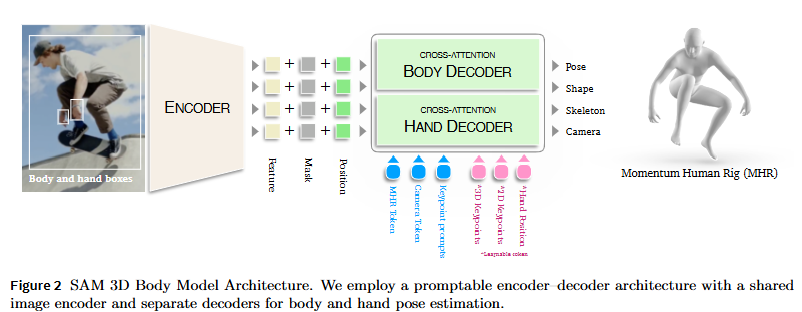

# 论文标题: SAM 3D Body: Robust Full-Body Human Mesh Recovery - [arXiv] 2025

### 一、引言与核心问题

*   **背景与重要性**: 3D 人体网格恢复 (Human Mesh Recovery, HMR) 是计算机视觉与具身智能的核心基础，旨在从单张图像中估计人体的 3D 姿态和形状。这项技术广泛应用于 AR/VR、动作捕捉、生物力学分析及机器人交互。尽管近年来进展显著，但在复杂场景（"In-the-wild"）中的鲁棒性仍是巨大挑战。
*   **核心任务**: 单目全雷达人体网格恢复 (Monocular Full-Body HMR)。
    *   **输入 (Input)**:
        *   **图像**: 单张 RGB 图像，尺寸通常经过裁剪和归一化处理。支持全图输入或人体/手部裁剪图。
        *   **提示 (Prompts, Optional)**: 稀疏的 2D 关键点 $K \in \mathbb{R}^{N \times 3}$ (坐标+置信度) 或分割掩码 (Segmentation Mask)。
    *   **输出 (Output)**:
        *   **MHR 参数**: Momentum Human Rig (MHR) 参数 $\theta \in \mathbb{R}^{519}$，包含全局旋转、身体姿态、形状系数、尺度系数、手部姿态和面部表情。
        *   **3D 网格**: 对应的 3D 顶点和骨骼关节位置。
    *   **当前挑战 (Pain Points)**:
        1.  **鲁棒性不足**: 现有模型在严重遮挡、罕见姿态（如倒立、瑜伽）、复杂交互场景下容易失效。
        2.  **身体/手部不平衡**: 专注于身体的模型往往忽略手部细节，而专注于手部的模型缺乏全身语境。两者的优化目标和分辨率需求往往冲突。
        3.  **数据质量与多样性**: 高质量的 3D 标注极其稀缺，现有的伪标签（Pseudo-GT）常含有系统性误差。
    *   **论文针对的难点**: 本文通过引入类似 SAM (Segment Anything Model) 的**可提示 (Promptable)** 架构设计，结合全新的**MHR** 参数化表达，以及一个基于视觉语言模型 (VLM) 挖掘的大规模数据引擎，旨在彻底解决鲁棒性和手部细节重建问题。

### 二、核心思想与主要贡献

*   **直观动机与设计体现**: 受到 SAM 在分割领域“提示驱动”范式的启发，作者认为 HMR 也应具备交互性和可提示性。通过在 Transformer 解码器中引入提示 Token，模型不仅能利用用户提供的线索（如点击关键点）来消除歧义，还能在推理阶段利用自身的高置信度预测作为提示进行自我修正。
*   **与相关工作的比较**:
    *   对比 **SMPL-based HMR (如 HMR 2.0, SMPLer-X)**: 摒弃了耦合严重的 SMPL 模型，采用了骨骼与形状解耦的 MHR 表示，使优化更稳定，解释性更强。
    *   对比 **Hand-only Methods**: 首次在一个模型中集成了高性能的独立手部解码器，实现了手部与身体的联合高精度重建，而非简单的拼接。
*   **核心贡献**:
    1.  **Promptable Architecture**: 提出了支持 2D 关键点、掩码、边界框等多种提示的 Encoder-Decoder 架构，允许用户或下游系统交互式地指导网格恢复。
    2.  **Two-Way Decoder Design**: 设计了共享图像编码器但独立的 **身体解码器 (Body Decoder)** 和 **手部解码器 (Hand Decoder)**，有效解决了全身与局部手部在分辨率和特征关注点上的冲突。
    3.  **Data Engine & MHR**: 构建了一个基于 VLM 挖掘的 700 万张图像的大规模数据集，并证明了 MHR 参数化表达在全雷达重建中的优势。

### 三、论文方法论 (The Proposed Pipeline)

*   **整体架构概述**: SAM 3D Body (3DB) 采用 Transformer 架构。图像经过 ViT 或 DINOv3 骨干网络提取特征。一组包含 MHR 参数、相机参数和提示信息的 Learnable Tokens 作为 Query 输入到两个并行的解码器中。解码器通过交叉注意力机制从图像特征中提取信息，并经过 MLP 最终回归出 MHR 参数。

*   **详细网络架构与数据流**:
    1.  **图像编码 (Image Encoder)**:
        
        *   输入图像 $I$ 经过骨干网络 (ViT-H 或 DINOv3) 得到稠密特征图 $F$。
        *   若存在手部裁剪图 $I_{hand}$，同样通过该共享编码器提取手部特征 $F_{hand}$。
        
    2.  **提示编码 (Prompt Encoder)**:
        *   **2D 关键点**: 使用位置编码 (Positional Encoding) 加上可学习的 Label Embedding 转换为 Token $T_{prompt}$。
        *   **掩码 (Mask)**: 通过卷积层编码后，直接逐元素加到图像特征 $F$ 上。
        
    3.  **Token 组装 (Queries)**:
        *   解码器的输入 Query $T$ 由多个部分拼接而成：$T = [T_{pose}, T_{cam}, T_{prompt}, T_{kpts}, T_{hand\_box}]$。
        
        > ###  Token 队列结构
        >
        > 在代码中，解码器的输入 `token_embeddings` 是通过 `torch.cat` 逐步拼接而成的（在序列长度上相加）。实际顺序如下：
        > $$
        > T_{total} = [\underbrace{T_{pose}}_{1}, \underbrace{T_{prev}}_{1}, \underbrace{T_{prompt}}_{N}, \underbrace{T_{hand}}_{2}, \underbrace{T_{kpts2D}}_{70}, \underbrace{T_{kpts3D}}_{70}]
        > $$
        > *(注：下标代表 Token 的数量)*
        >
        > 1. $T_{pose}$ (The Solver)
        >    - **核心解算 Token**。负责最终输出 MHR 参数（身体姿态、形状等）。
        >    - **来源**：Static Learnable Parameter，来自 `self.init_pose` ，在推理开始时，通过 `self.init_to_token_mhr` 映射为 Token。
        >    - **传递**：隐藏状态流转 (Hidden State Flow)。
        >      - 它是 Transformer 的主要“记忆载体”。Layer $i$ 的输出直接作为 Layer $i+1$ 的输入。
        >      - 每一层结束后，它的值都会改变，代表了模型对人体姿态的理解越来越深。
        > 2. $T_{prev}$ (The Anchor)
        >    - **上一轮预测的参考**。这在论文公式中常被省略或隐含在 $T_{pose}$ 的上下文中，但在代码中它是独立的。
        >    - **来源**：来自上一轮【区别于层】解码器输出的参数（Pose, Shape, Camera）。如果是第一轮，则初始化为零或默认值。
        >    - **传递**：静态增强 (Static Augment)。
        >      - 它不像 $T_{pose}$ 那样演化。它被放入 `token_augment` 变量中。在 Transformer 的每一层计算 Attention 之前，它会被**重新加回去** (Re-injection)。
        >      - **目的**: 无论网络思考多深，都要时刻提醒它：“你的出发点（上一轮预测）是这里，不要走偏了”。
        > 3. $T_{prompt}$ (The Hint)
        >    - **用户交互提示**
        >    - **来源**：用户输入的 2D 坐标 + 标签。经过 `self.prompt_encoder` 编码。
        >    - **传递**：静态增强 (Static Augment)。与 $T_{prev}$ 一样，它被放入 `token_augment`。每一层都会被强化，确保模型始终记得用户给的约束条件。
        > 4. $T_{hand}$ (The Detector)
        >    - **手部检测器**
        >    - **来源**：Learnable Parameter，来自 `self.hand_box_embedding`。
        >    - **传递**：隐藏状态流转。类似于 $T_{pose}$，它随层数加深而演化，最终输出手部的 Bounding Box。
        > 5. $T_{kpts2D}$ & $T_{kpts3D}$ (The Dynamic Probes)
        >    - **关键点专属 Token**。每个 Token 负责一个特定关节（如左肘、右膝）。
        >    - **来源**：Learnable Parameter，初始态来自 `self.keypoint_embedding`。
        >    - **传递**：基于预测的动态更新 (Geometry-aware Update)。
        >      - 这两个 Token 并不是简单地传给下一层，而是经过了一个 `keypoint_token_update_fn` (L1259) 的处理：
        >        1. **预测**: 取出当前层对该关节的 $(x, y)$ 坐标预测。
        >        2. **采样**: 用这个坐标去图像特征图上进行 **Grid Sample** (双线性插值采样)。
        >        3. **注入**: 将采样到的**视觉特征**加回到该 Token 中，送入下一层。
        >      - **含义**: 第 1 层猜“左肘在(10,10)”，它就去(10,10)看看长什么样；第 2 层发现不对，修正为“(12,15)”，第 3 层就会去(12,15)看。这是一种显式的注意力机制。
        
    4.  **双路解码器 (Two-Way Decoders)**:
        
        *   **Body Decoder**: 输入 Query $T$ 和全图特征 $F$。通过多层 Transformer Decoder Layer (Self-Attn -> Cross-Attn -> MLP) 更新 Tokens。
        *   **Hand Decoder**: 输入相同的 Query 但与手部裁剪特征 $F_{hand}$ 进行交互。这使得模型能在高分辨率下关注手部细节。
        *   **中间预测与自我提示 (Intermediate Predictions)**: 这是一个关键设计。解码器的每一层都会输出中间 MHR 参数和 2D 关键点预测。这些预测会被重新编码并注入到下一层的输入 Token 中，形成一种**层级迭代优化 (Iterative Refinement)** 机制。
        
    5.  **输出头 (Output Head)**:
        *   经过解码器更新后的 $T_{pose}$ 通过 MLP 回归出最终的 $\theta_{MHR}$。
        *   $\theta_{MHR}$ (519维) 包括：Global Rotation (6D), Body Pose (260 continuous), Shape (45 PCA), Scale (28 PCA), Hand Pose (54 $\times$ 2), Face (72)。
    
*   **损失函数 (Loss Function)**:
    *   采用多任务损失 $L_{train} = \sum \lambda_i L_i$：
        *   **关键点损失 (Keypoint Loss)**: $L_1$ 损失，计算预测的 2D/3D 关键点与 Ground Truth 的距离，并结合了不确定性加权。
        *   **参数损失 (Parameter Loss)**: $L_2$ 损失，直接监督回归出的 MHR 姿态、形状和尺度参数。
        *   **手部检测损失**: 对手部边界框预测使用 GIoU 损失和 $L_1$ 损失。
        *   **训练策略**: 采用了类似于 SAM 的模拟交互训练，随机采样关键点作为提示输入，强迫模型学会利用提示信息修正预测。

*   **数据集 (Dataset)**:
    *   **规模**: 训练集包含约 700 万张图像。
    *   **组成**: 混合了单图数据集 (COCO, AIChallenger)、多视点数据集 (Ego-Exo4D, Harmony4D) 和高质量合成数据 (Goliath)。
    *   **VLM 数据引擎**: 使用 VLM (Vision-Language Model) 自动挖掘“困难样本”（如“倒立的人”、“瑜伽动作”），针对性地进行标注，显著提升了长尾分布的性能。

### 四、实验结果与分析

*   **核心实验结果**:
    *   在多个基准测试中，3DB 均取得了 SOTA 性能，特别是在跨域 (Out-of-domain) 数据集上优势明显。

    | 指标 (MPJPE $\downarrow$) | 3DPW (In-domain) | EMDB (Out-of-domain) |
    | :------------------------ | :--------------- | :------------------- |
    | HMR 2.0                   | 81.3             | 118.5                |
    | CameraHMR                 | 56.0             | 70.3                 |
    | **3DB (Ours)**            | **54.8**         | **61.7**             |

*   **手部性能**: 尽管是全身模型，3DB 的手部重建精度 (PA-MPJPE 5.5mm on FreiHand) 达到了与专注于手部的 SOTA 方法 (如 HaMeR, 6.0mm) 相当甚至更好的水平，证明了双路解码器设计的有效性。
*   **用户偏好**: 在涉及 7800 名参与者的大规模用户调研中，3DB 在视觉质量上以 **5:1** 的比例大幅领先现有最佳方法 (NLF)。

### 五、方法优势与深层分析

*   **架构优势**:
    *   **提示驱动的消歧义**: 单目 3D 重建本质上是病态的（存在深度和遮挡歧义）。3DB 的 Promptable 架构允许模型在推理时利用额外的 2D 线索（如手腕位置）来锁定解空间。特别是在推理阶段，模型利用 Hand Decoder 产生的高精度手腕坐标作为“提示”反馈给 Body Decoder，这是一种巧妙的**自我提示 (Self-Prompting)** 策略。
    *   **MHR vs. SMPL**: MHR 显式解耦了骨骼长度 (Scale) 和皮下脂肪/肌肉 (Shape)。在 SMPL 中，改变 Shape 参数会同时改变骨骼长度，导致优化困难。MHR 的解耦使得网络更容易分别学习“这个人的骨架有多大”和“这个人有多胖/壮”。
*   **解决难点的思想**:
    *   **长尾分布问题**: 传统的均匀采样训练无法解决“倒立”或“极度扭曲”的姿态问题。作者通过 VLM 主动挖掘这些失效案例并进行针对性训练，从数据层面根本性地提升了鲁棒性。
    *   **多任务协同**: 通过共享骨干网络但分离解码器，模型既享受了全图特征带来的全局一致性，又拥有了局部裁剪特征带来的高频细节，解决了 HMR 领域长期的 Body-Hand Trade-off。

### 六、结论与个人思考

*   **结论**: SAM 3D Body 通过引入交互式提示机制、解耦的 MHR 表示以及大规模数据引擎，重新定义了单目 HMR 的 SOTA 标准。它不仅是一个高精度的重建模型，更是一个通用的、可交互的 3D 人体分析工具。
*   **潜在局限性**:
    *   **计算开销**: 使用 ViT-H 或 DINOv3 等大模型作为骨干网络，推理速度可能较慢，难以在移动端实时运行。
    *   **时序一致性**: 当前模型主要基于单帧图像，虽然在视频上表现尚可，但在极快动作下可能仍存在帧间抖动。
*   **对个人研究的启发**:
    *   **Decoder-Level Refinement**: 3DB 在解码器内部进行的 `Keypoint Token Update` 机制非常值得借鉴。这种在层间注入中间预测作为“Condition”的做法，本质上是一种隐式的 Recurrent 处理，能有效提升深度网络的推理能力。
    *   **Data-Centric AI**: 再次证明了“模型架构很重要，但数据筛选策略可能更重要”。利用 VLM 进行主动学习 (Active Learning) 式的数据挖掘是解决 Computer Vision 长尾问题的极佳思路。