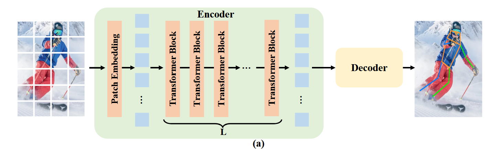

# Research Note: ViTPose++: Vision Transformer for Generic Body Pose Estimation - NeurIPS 2022

### 一、引言与核心问题

这篇论文探讨了在人体姿态估计这个计算机视觉的基础领域中，一个看似简单却极具启发性的问题：一个朴素的、非层级化的视觉Transformer（Vision Transformer, ViT）能否在不借助为该任务特制模块的情况下，取得优异的性能。传统方法通常依赖于卷积神经网络（CNN）或者在CNN基础上添加复杂的Transformer模块。该研究首先构建了一个名为**ViTPose**的简洁基线模型，证明了朴素ViT的巨大潜力。随后，为了解决更宏大的“通用姿态估计”问题，即如何让单一模型同时处理人类、动物等多种异构姿态数据，论文进一步提出了**ViTPose++**，一个基于知识分解（Knowledge Factorization）思想的多任务姿态估计模型。

*   **论文试图解决的核心任务是什么？**
    *   **输入 (Input)**: 论文探索了两种主流的姿态估计范式：
        1.  **自顶向下 (Top-down)**: 输入是经过目标检测器裁剪后的单个实例图像，例如一个人的图像。其数据形态为一张三通道的RGB图像，形状（Shape）为 `[Batch_size, 3, H, W]`，论文中常使用 `256x192` 的分辨率。
        2.  **自底向上 (Bottom-up)**: 输入是包含多个实例的完整场景图像。其数据形态同样是RGB图像，形状为 `[Batch_size, 3, H, W]`，论文中常使用 `512x512` 的分辨率。
    *   **输出 (Output)**: 模型的输出是针对每个待检测关键点的热力图（Heatmaps）。其数据形态为一个多通道的特征图，形状为 `[Batch_size, Nk, H', W']`，其中 `Nk` 是关键点的数量（例如MS COCO数据集中为17个），`H'` 和 `W'` 是输出热力图的高和宽，通常是输入尺寸的1/4（例如，对于 `256x192` 的输入，输出为 `64x48`）。
    *   **任务的应用场景**: 姿态估计是计算机图形学和视觉中的基础任务，广泛应用于角色动画、运动捕捉与分析、人机交互、虚拟现实、机器人学等领域。
    *   **当前任务的挑战 (Pain Points)**:
        1.  **模型复杂度**: 先前基于Transformer的工作往往需要复杂的、为特定任务设计的结构（如HRFormer中的高分辨率并行模块），或将其作为CNN骨干网的附属模块，这增加了模型的设计和实现难度。
        2.  **泛化与任务冲突**: 多数模型专注于单一类型的姿态估计（如仅限人类）。当尝试用一个模型处理多种异构数据集时（例如，同时处理人类、动物、手部等），简单的多任务学习会导致严重的性能下降，这被称为“任务冲突”（Task Conflict），因为不同任务（如识别人眼和识别猫眼）所需的特征表示可能存在差异。
    *   **论文针对的难点**: 本文的核心目标是解决上述两个挑战。首先，通过ViTPose证明一个**结构简单**的朴素ViT就能成为一个强大且高效的姿态估计骨干网络。其次，通过ViTPose++提出一种**优雅的机制**来解决多任务学习中的冲突问题，从而构建一个通用的姿态估计模型。

### 二、核心思想与主要贡献

*   **直观动机与设计体现**: 本研究的直观动机源于一个根本性的疑问：我们是否真的需要为姿态估计设计复杂的专用网络结构？论文的假设是，一个通用且强大的特征提取器（如ViT）本身就足以胜任。这一动机直接体现在**ViTPose**的设计上：它采用了最基础的ViT作为编码器，并搭配一个极其轻量的解码器。而对于**ViTPose++**，其动机是构建一个能处理多种姿态的“基础模型”。它借鉴了混合专家模型（Mixture-of-Experts, MoE）的思想，认为不同姿态任务间既有**共性知识**（如关节的连接性、对称性），也有**个性知识**（如不同物种的形态差异）。这一动机体现在其对ViT中前馈网络（FFN）层的巧妙分解，实现了共享知识和任务特定知识的解耦。

*   **与相关工作的比较与创新**:
    *   相较于那些使用CNN提取浅层特征，再用Transformer进行特征优化的方法（如TokenPose, TransPose），ViTPose**完全摒弃了CNN骨干网**，直接使用朴素ViT进行端到端的特征编码。
    *   相较于专门设计层级化Transformer结构来维持高分辨率特征图的方法（如HRFormer），ViTPose采用**非层级化的朴素ViT**，其结构更统一、简洁，却通过其强大的表示能力和对现代硬件的计算友好性取得了更优的速度-精度权衡。

*   **核心贡献与创新点**:
    1.  **提出了ViTPose**：一个极其简洁但性能卓越的姿态估计基线模型。该工作系统性地展示了朴素ViT在该任务上所具备的四大优良特性：**结构简单性**、**模型大小的可扩展性**（从20M到1B参数，性能持续提升）、**训练范式的灵活性**（对预训练数据、输入分辨率等不敏感）以及**知识的可传递性**。
    2.  **提出了ViTPose++**：一个面向通用姿态估计的新颖模型。它通过在Transformer的FFN层中引入“知识分解”（即部分共享的混合专家机制），成功地在单一模型中处理多种异构姿态数据集（如MS COCO, AP-10K等），有效缓解了任务冲突，并在多个基准上刷新了SOTA记录。
    3.  **全面的实验验证**: 论文在多达七个主流姿态估计基准上进行了详尽的实验，不仅在标准的自顶向下范式中取得了SOTA，还在自底向上范式中展示了其潜力，全面证实了所提方法的有效性和泛化能力。

### 三、论文方法论 (The Proposed Pipeline)

* **整体架构概述**: 整个流程非常直观。输入图像首先被送入一个朴素的ViT编码器以提取全局特征。编码器输出的特征序列被重塑为2D特征图，然后由一个轻量级的解码器进行上采样并回归出最终的关键点热力图。在ViTPose++中，其核心创新在于对ViT编码器内部FFN层的修改，使其能够区分并学习共享知识与任务特定知识。

  

*   **详细网络架构与数据流**:
    
    *   **编码器 (Encoder)**:
        *   **数据预处理与嵌入**: 输入图像 `X ∈ R^(H×W×3)` 被切分为一系列不重叠的16x16的图像块（Patches）。这些图像块被线性嵌入（Linear Embedding）成一系列一维的令牌（Tokens），数据形状变为 `F_0 ∈ R^(N×C)`，其中 `N = (H/16) * (W/16)` 是令牌的数量，`C` 是嵌入维度。
        *   **Transformer模块**: 令牌序列随后通过L个标准的Transformer模块。每个模块由一个多头自注意力（MHSA）层和一个前馈网络（FFN）组成，其间穿插着层归一化（LayerNorm）和残差连接。值得注意的是，在整个编码器中，令牌序列的形状 `(N×C)` 保持不变，这正是其“非层级化”的体现。
        *   **ViTPose++ 的核心改动 (PS-FFN)**: 在ViTPose++中，FFN的设计是关键。标准的FFN包含两个线性层。ViTPose++将**第二个线性层**分解为两部分：
            1.  **共享专家 (Shared Expert)**: 一个所有任务都共用的线性层。
            2.  **任务特定专家 (Task-specific Expert)**: 每个任务（如COCO、AP-10K）都拥有一个独立的线性层。
            数据流经第一个线性层和激活函数后，其输出 `F_FFN` 会同时输入到共享专家和当前任务对应的特定专家中，分别得到 `F_shared` 和 `F_specific`。这两个输出在通道维度上被拼接（Concatenate）起来，作为该FFN模块的最终输出。通过一个超参数 `α` 控制特定专家所占的通道比例。这种设计使得模型可以在训练时从所有数据中学习通用姿态知识（存放在共享专家中），同时为每个特定任务保留其独有知识（存放在特定专家中）。在推理时，共享专家和特定专家的权重可以被融合成一个单独的线性层，因此**不引入任何额外的计算开销**。
        *   **结合消融实验的作用分析**: 论文中的消融实验（表8）雄辩地证明了这一设计的合理性。实验发现，冻结MHSA层对性能影响很小（AP从75.8降至75.1），而冻结FFN层则导致性能大幅下降（AP从75.8降至72.8）。这表明**MHSA层更倾向于学习任务无关的、普适的特征关系，而FFN层则承载了更多的任务特定知识**。因此，将混合专家机制应用于FFN层是最高效和最合理的选择。
    
    *   **解码器 (Decoder)**:
        *   **设计理念**: 论文测试了多种解码器，旨在证明ViT编码器提取的特征质量非常高，以至于不需要复杂的解码过程。
        *   **经典解码器 (Classic Decoder)**: 由两个反卷积（Deconvolution）模块组成，将特征图逐步上采样4倍，最后通过一个1x1卷积层生成热力图。
        *   **简单/最小解码器 (Simple/Minimal Decoder)**: 实验证明，即使将解码器简化为简单的双线性插值上采样+单层卷积，甚至是单层线性投影+像素重组（PixelUnshuffle），ViTPose的性能也几乎没有损失（表2，AP下降<0.3）。这与基于ResNet的模型形成鲜明对比（AP下降约18），强有力地证明了ViT所学特征的**线性可分性**更强。
    
*   **损失函数 (Loss Function)**:
    *   论文遵循了姿态估计领域的标准做法，使用**均方误差（Mean Squared Error, MSE）**作为损失函数。它计算模型预测的热力图与用高斯核生成的基准（Ground-truth）热力图之间的像素级差异。
    *   数学形式为：$L = \frac{1}{N_k} \sum_{i=1}^{N_k} \sum_{p} (H_i(p) - \hat{H}_i(p))^2$，其中 $H_i$ 和 $\hat{H}_i$ 分别是第 $i$ 个关键点的基准热力图和预测热力图。

*   **数据集 (Dataset)**:
    *   **训练与评估**: 论文使用了非常广泛的数据集，包括：
        *   **人类**: MS COCO, AIC, MPII, OCHuman (用于评估遮挡场景), COCO-Wholebody (包含面部、手脚)。
        *   **动物**: AP-10K, APT-36K。
    *   **预训练**: 默认使用在ImageNet-1k上进行MAE（Masked Autoencoders）自监督预训练的模型。但论文也进行了重要实验（表4），证明仅使用姿态数据集（COCO+AIC）进行预训练也能达到相当的性能，这凸显了其在预训练数据选择上的灵活性。

### 四、实验结果与分析

*   **核心实验结果**: 论文在MS COCO验证集上的结果极具说服力。以自顶向下范式为例（表12）：

    | 模型 | 参数(M) | 速度(fps) | 输入分辨率 | COCO val AP |
|:--- |:--- |:--- |:--- |:--- |
| HRFormer-B | 43 | 78 | 384x288 | 77.2 |
| **ViTPose-H** | 632 | 241 | 256x192 | **79.1** |
| **ViTPose++-H** | 632 | 241 | 256x192 | **79.4** |

    从上表可以看出，尽管ViTPose-H的参数量远大于HRFormer-B，但其在A100 GPU上的推理速度却快了3倍以上，并且精度更高。这得益于ViT统一的计算结构（大量矩阵乘法）对现代并行计算硬件的高度友好性。而经过多任务训练的ViTPose++-H则在不增加推理耗时的情况下，进一步提升了精度。

*   **消融研究解读**: 如前所述，关于解码器和FFN/MHSA冻结的消融实验是理解本文方法优势的关键。它们分别证明了ViT特征的高质量以及将任务特异性建模集中于FFN层的正确性。

*   **可视化结果分析**: 论文中的可视化结果（图8）生动地展示了模型的学习能力。
    *   **特征图可视化**: 表明模型从浅层到深层，逐渐将注意力从整个图像聚焦到人体区域，并能有效忽略背景干扰。即使在人体部分被遮挡的情况下，模型也能根据可见部分的上下文，“猜测”出被遮挡关节的大致位置。
    *   **注意力图可视化**: 为了定位右腕，模型不仅关注右手腕本身，还会强烈关注整个右臂（如右上臂和右肘）。这直观地展示了模型是如何利用身体各部位之间的结构化关系来进行推理的，即它学习到了“右腕通常连接在右肘的末端”这一先验知识。

### 五、方法优势与深层分析

*   **架构/设计优势**:
    *   **简洁性与效率的统一**: ViTPose证明了，一个架构上极其简洁、统一的朴素ViT，凭借其强大的特征表示能力，结合现代硬件的并行计算优势，可以在姿态估计任务上实现精度和速度的双重领先。它打破了“高性能必须依赖复杂专用设计”的思维定式。
    *   **卓越的可扩展性**: 从ViTPose-S到ViTPose-G（1B参数），模型性能随着参数量的增加而稳定提升（图1），展现出CNN模型难以企及的可扩展性。这为构建更大、更强的姿态估计“基础模型”铺平了道路。

*   **解决难点的思想与实践**:
    *   论文解决“通用姿态估计”任务冲突的核心思想是**优雅的知识分解**。它没有采用暴力地为每个任务训练独立模型，也没有采用效果不佳的完全参数共享。ViTPose++通过其创新的PS-FFN结构，在实践中实现了“共享普适知识，保留特定知识”的理念。这使得模型在处理多样化数据时，不同任务间能够互相促进（正向迁移），而非互相干扰。例如，从动物数据中学到的对称性知识可能有助于人类姿态的估计，反之亦然。这种设计是其能够成为一个成功的通用姿态估计模型的关键。

### 六、结论与个人思考

*   **论文结论回顾**: 本文成功地将朴素ViT确立为姿态估计领域的一个强大、简洁且高效的基线。其提出的ViTPose++模型，通过巧妙的知识分解机制，为构建能够处理多种异构数据的通用姿态估计基础模型提供了一个切实可行的范例。

*   **潜在局限性**:
    1.  **极端姿态**: 论文自己也承认（图10），模型在处理一些非常规或极端的姿态（如滑雪）时仍会失败，尽管这个问题可以通过使用更大的模型和更多样化的数据来缓解。
    2.  **模型大小**: 尽管推理速度快，但ViTPose的大模型版本参数量巨大（ViTPose-H为632M），这可能给在资源受限的边缘设备上的部署带来挑战。

*   **未来工作方向**:
    1.  可以探索将目标检测与姿态估计统一在同一个ViT框架下，实现一个更为端到端的通用感知模型。
    2.  可以尝试结合自然语言描述（例如，"定位鼻尖和左耳垂"），探索对新物种或新关键点的零样本（Zero-shot）泛化能力，进一步增强模型的通用性。

### 七、代码参考与分析建议

*   **仓库链接**: [https://github.com/ViTAE-Transformer/ViTPose](https://github.com/ViTAE-Transformer/ViTPose)
*   **核心模块实现探讨**: 建议读者查阅作者提供的代码，重点关注以下几个部分的实现，以深入理解其工作原理：
    1.  **模型定义文件**中 `VisionTransformer` 类的实现，特别是其中FFN模块的部分。
    2.  在**ViTPose++**的实现中，寻找**Partially Shared FFN (PS-FFN)**是如何通过不同的线性层和路由机制来处理多任务数据的。
    3.  **解码器（Decoder）**部分的实现，对比不同解码器的代码复杂度。
    4.  训练流程中，数据是如何从多个数据集中采样并构建批次（mini-batch）的，以及如何将任务ID传递给模型以激活对应的“任务特定专家”。
