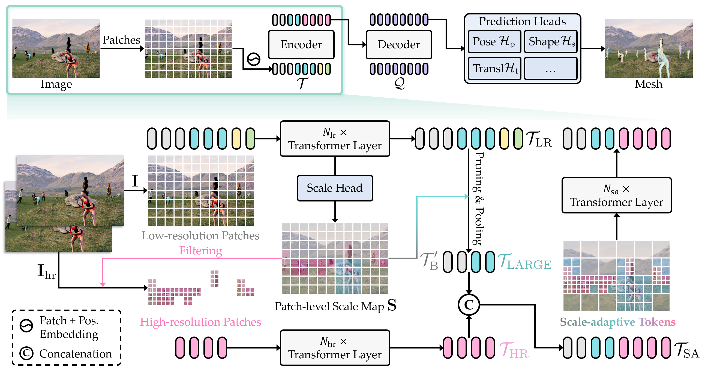

# 论文标题: SAT-HMR: Real-Time Multi-Person 3D Mesh Estimation via Scale-Adaptive Tokens - arXiv 2025

### 一、引言与核心问题

本文研究的背景是计算机视觉领域中的多视角人体三维网格估计（Multi-Person 3D Human Mesh Estimation），这是一项从单张RGB图像中定位场景中的所有个体，并为每个人恢复其三维身体姿态和形状的基础任务。该技术在社交互动分析、游戏角色动画制作、虚拟现实等领域具有广泛的应用前景。

*   **论文试图解决的核心任务是什么？**
    *   **输入 (Input)**: 模型的输入是一张单视角的RGB图像。其具体形态为 `[Batch_size, 3, H, W]` 的张量，其中 `H` 和 `W` 分别是图像的高和宽。论文中采用了一种混合分辨率策略，基础低分辨率图像的尺寸为 `(H, W)`，其中 `max(H, W) = 644`；在需要时，会从一个更高分辨率的图像版本 `(H_hr, W_hr)` 中提取特征，其中 `max(H_hr, W_hr) = 1288`。
    *   **输出 (Output)**: 模型的输出是场景中每个被检测到的人的参数化三维人体模型。具体来说，是SMPL (Skinned Multi-Person Linear Model)模型的参数，包括姿态参数 $\theta$、形状参数 $\beta$ 和三维平移向量 $t$。此外，模型还会输出每个人的二维边界框（Bounding Box）和置信度分数。
    *   **任务的应用场景**: 该任务的应用场景十分广泛，包括但不限于：虚拟现实/增强现实中的虚拟化身、电影和游戏产业中的角色动画和动作捕捉、体育运动中的姿态分析、以及人机交互和社交行为理解。
    *   **当前任务的挑战 (Pain Points)**:
        1.  **精度与效率的权衡**: 现有方法，特别是基于DETR（DEtection TRansformer）的单阶段（one-stage）方法，为了达到高精度，通常依赖于高分辨率的输入图像。这能显著提升对小尺度目标（如远离摄像机的儿童）的估计效果，但同时带来了巨大的计算开销，导致模型无法进行实时推理（如帧率仅有约5 FPS）。
        2.  **资源分配不均**: 对整张图像进行统一的高分辨率处理是一种计算资源的浪费。对于大尺度目标（如离相机很近的人），它们已经占据了足够多的像素和特征，进一步提升分辨率带来的精度增益微乎其微，但计算成本却急剧增加。
        3.  **全局与局部信息的丢失**: 传统的多阶段（multi-stage）方法通常先检测到每个人，然后裁剪并缩放到统一尺寸再进行处理。这种做法虽然简单，但会丢失个体在原始图像中的真实尺度、相对位置等重要的全局上下文信息，可能导致次优的估计结果。
    *   **论文针对的难点**: 本文主要聚焦于解决上述的**精度与效率的权衡**以及**资源分配不均**这两个核心难点。其目标是在不牺牲对小尺度目标的高精度的前提下，大幅降低计算成本，从而实现实时的多视角人体三维网格估计。

### 二、核心思想与主要贡献

*   **直观动机与设计体现**: 本研究的直观动机是：计算资源应当被智能地分配到最需要的地方。具体而言，对于图像中难以估计的小尺度人物，应该使用高分辨率特征来捕捉更多细节；而对于已经足够清晰的大尺度人物和信息量较少的背景区域，则可以使用低分辨率特征，甚至进一步压缩，以节省计算量。这一动机直接体现在其核心设计“尺度自适应令牌”（Scale-Adaptive Tokens）上。模型首先预测一个“尺度图”，然后依据该图动态地调整不同区域的特征令牌（token）的分辨率：小尺度区域的令牌被高分辨率令牌替换，背景区域的令牌被池化压缩，大尺度区域的令牌则保持不变。
*   **与相关工作的比较与创新**: 本工作与近期的单阶段方法如 Multi-HMR 和 AiOS 等最为相关，这些方法都采用了DETR式的架构，并通过高分辨率输入来提升性能。然而，这些工作并未解决高分辨率带来的效率瓶颈。SAT-HMR的创新之处在于，它没有对整个图像“一视同仁”，而是引入了一种动态的、内容感知的特征编码机制。它不再是简单地将高分辨率作为一种全局设置，而是将其作为一种按需分配的“稀缺资源”，从而在保持SOTA精度的同时，实现了数量级的效率提升。
*   **核心贡献与创新点**:
    1.  **提出尺度自适应令牌 (Scale-Adaptive Tokens)**: 设计了一种新颖的特征表示方法，能够根据图像中每个个体的相对尺度动态调整特征的分辨率，实现了对图像特征更高效的编码。
    2.  **实现实时高精度估计**: 通过智能地分配计算资源，所提出的SAT-HMR框架在保持与SOTA方法（如Multi-HMR）相当的精度的同时，将推理速度提升了约5.5倍（从231.7ms降至42.0ms），达到了实时处理（约24 FPS）的要求。
    3.  **建立了新的性能标杆**: 该方法为实时多视角人体三维网格估计任务设定了新的SOTA标准，成功地在精度和效率之间取得了前所未有的平衡。

### 三、论文方法论 (The Proposed Pipeline)

*   **整体架构概述**: SAT-HMR的整体架构建立在一个DETR式的基线上，包含一个Transformer编码器、一个解码器和多个预测头。其核心创新在于编码器阶段对图像特征的处理。整个流程首先从一张低分辨率图像中提取均匀的补丁（patches），并输入到一个浅层Transformer编码器中。接着，一个专门的“尺度头”（Scale Head）会根据这些初步的特征令牌预测出一个逐补丁的“尺度图”（Scale Map）。这个尺度图指导着后续的令牌操作：被识别为背景的令牌会被空间池化（Pooling）以减少数量；被识别为小尺度人物的令牌会被丢弃，并由从对应高分辨率图像中提取的、数量更多（4倍）的令牌所取代；而被识别为大尺度人物的令牌则保持不变。这些经过动态调整的、混合分辨率的“尺度自适应令牌”被拼接在一起，送入一个更深的主干Transformer编码器进行充分的特征学习，最后由解码器和预测头回归出每个人的SMPL参数。

*   **详细网络架构与数据流**:
    1.  **数据预处理与双分辨率输入**: 输入一张RGB图像，生成两个版本：一个基础低分辨率版本 $I \in \mathbb{R}^{H \times W \times 3}$ (e.g., $644 \times 644$) 和一个高分辨率版本 $I_{hr} \in \mathbb{R}^{H_{hr} \times W_{hr} \times 3}$ (e.g., $1288 \times 1288$)。
    2.  **浅层特征提取**:
        *   低分辨率图像 $I$ 被分割成 $k_{lr}$ 个 $14 \times 14$ 的补丁，线性嵌入后加上位置编码，形成低分辨率令牌 $T_{LR} \in \mathbb{R}^{k_{lr} \times D}$。
        *   高分辨率图像 $I_{hr}$ 也以同样方式处理，形成高分辨率令牌 $T_{FULL\_HR} \in \mathbb{R}^{4k_{lr} \times D}$。
        *   $T_{LR}$ 和 $T_{FULL\_HR}$ 分别通过一个浅层Transformer编码器（共享权重，包含 $N_{lr} = N_{hr} = 3$ 个层），进行初步的特征对齐和学习。
    3.  **尺度图预测 (Patch-level Scale Map)**:
        *   经过浅层编码器的 $T_{LR}$ 被送入一个MLP构成的“尺度头”，预测出一个尺度图 $S \in \mathbb{R}^{\frac{H}{P} \times \frac{W}{P} \times 2}$，其中 $P=14$ 是补丁大小。
        *   对于每个补丁位置 $(i, j)$， $S(i, j) = (c, s)$ 包含两个值：置信度 $c$ 表示该补丁是否属于某个人（前景），尺度值 $s$ 表示对应人物的相对大小，定义为 $s = \min(d_{bb} / S_{hr}, 1)$，其中 $d_{bb}$ 是人物在高分辨率图像中边界框的对角线长度，$S_{hr} = \max(H_{hr}, W_{hr})$。
    4.  **尺度自适应令牌生成**:
        *   根据尺度图 $S$，低分辨率令牌 $T_{LR}$ 被分为三组：
            *   **背景令牌 $T_B$**: 置信度 $c$ 低于阈值 $\alpha_c$ 的令牌。
            *   **小尺度令牌 $T_{SMALL}$**: 置信度 $c$ 高于 $\alpha_c$ 且尺度值 $s$ 低于阈值 $\alpha_s$ (实验中最佳为0.5)的令牌。
            *   **大尺度令牌 $T_{LARGE}$**: 置信度 $c$ 高于 $\alpha_c$ 且尺度值 $s$ 不低于 $\alpha_s$ 的令牌。
        *   **操作**:
            *   **背景令牌 $T_B$ 被池化**: 每4个相邻的背景令牌被空间池化成1个，生成 $T'_{B}$，数量减少约75%。消融实验（Table 4）表明，保留池化后的背景信息比完全丢弃能带来更好的性能，尤其是在大尺度人物上，这说明背景上下文是重要的。
            *   **小尺度令牌 $T_{SMALL}$ 被替换**: 这些令牌被丢弃，并从其在高分辨率图像中对应的 $2 \times 2 = 4$ 个高分辨率令牌中选取出来，形成 $T_{HR}$。
            *   **大尺度令牌 $T_{LARGE}$ 保持不变**。
        *   **拼接**: 将 $T'_{B}$, $T_{LARGE}$, 和 $T_{HR}$ 拼接起来，形成最终的尺度自适应令牌 $T_{SA}$。
    5.  **主干编码与解码**:
        *   $T_{SA}$ 被送入一个更深的主干Transformer编码器（包含 $N_{sa} = 9$ 个层）进行深度特征提取。
        *   编码后的特征与一组可学习的 "human queries" 一起送入一个包含6个层的Transformer解码器。
        *   解码器的输出最终通过多个MLP预测头，回归出每个人的SMPL参数（$\theta, \beta, t$）、边界框和置信度。

*   **损失函数 (Loss Function)**: 损失函数是一个多任务的加权和，旨在监督模型输出的各个方面。
    *   **设计理念**:
        $L = \lambda_{map}L_{map} + \lambda_{depth}L_{depth} + \lambda_{pose}L_{pose} + \lambda_{shape}L_{shape} + \lambda_{j3d}L_{j3d} + \lambda_{j2d}L_{j2d} + \lambda_{box}L_{box} + \lambda_{det}L_{det}$
    *   **关注重点**:
        *   $L_{map}$: 监督尺度图的预测。对置信度 $c$ 使用Focal Loss，对尺度值 $s$ 使用L1 Loss。这是确保尺度自适应机制准确工作的基础。
        *   $L_{pose}, L_{shape}, L_{j3d}, L_{j2d}$: 对SMPL的姿态、形状参数以及衍生的3D/2D关节点使用L1 Loss进行监督。
        *   $L_{box}$: 对预测的2D边界框使用L1 Loss和GIoU Loss。
        *   $L_{det}$: 对每个query的检测置信度使用Focal Loss。
        *   $L_{depth}$: 监督根关节的深度，使用基于相机焦距归一化的深度损失，以处理深度模糊性。
    *   **训练实施**: 在计算损失前，使用匈牙利匹配算法（Hungarian Matching）将预测结果与基准真值（Ground-Truth）进行一对一匹配。

*   **数据集 (Dataset)**:
    *   **所用数据集**: 训练时混合使用了多个数据集以增强模型的泛化能力。包括具有高质量三维真值的合成数据集 AGORA 和 BEDLAM，以及只有二维标注的真实世界数据集 COCO, Crowdpose, MPII 和 H3.6M。对于后者，使用伪真值（pseudo GTs）进行监督。
    *   **特殊处理**: 使用了丰富的数据增强策略，并混合了不同来源的数据进行训练。评估则在 AGORA, 3DPW, MuPoTS, 和 CMU Panoptic 等标准基准上进行，以全面衡量模型的性能和泛化能力。

### 四、实验结果与分析

*   **核心实验结果**: 论文在多个权威基准上进行了详尽的实验。在最具挑战性的 AGORA 测试集上，SAT-HMR 的结果尤为突出。

| 指标 (AGORA Test) | Multi-HMR [2] (Res. 1288) | AiOS [44] (Res. 1333) | **Ours (Res. 644*)** | 性能对比           |
| ----------------- | ------------------------- | --------------------- | -------------------- | ------------------ |
| Time (ms) ↓       | 231.7                     | 405.2                 | **42.0**             | **快 5.5 倍**      |
| MACs (G) ↓        | 6104.6                    | 314.5                 | **133.1**            | **计算量显著降低** |
| MVE (mm) ↓        | 61.1                      | 57.5                  | **63.3**             | **精度相当**       |
| F1-Score ↑        | 0.95                      | 0.94                  | **0.95**             | **精度相当**       |

    *   **结果解读**: 上表清晰地展示了SAT-HMR的核心优势。在关键的平均顶点误差（MVE）和F1分数上，本文方法（使用644*的混合分辨率）与使用更高分辨率（1288或1333）的SOTA方法Multi-HMR和AiOS性能相当。然而，在效率方面，SAT-HMR的推理时间仅为42.0ms，远快于Multi-HMR的231.7ms，计算量（MACs）也大幅降低。这证明了其在不牺牲精度的前提下，成功实现了实时性能。

*   **消融研究解读**:
    *   **分辨率的影响 (Fig. 2)**: 对基线模型的消融实验表明，输入分辨率从518提升到1288，对小尺度（0-10%）人物的误差降低了近35mm，而对大尺度（30%+）人物的误差改善则很小。这为“不同尺度人物对分辨率的需求不同”这一核心动机提供了坚实的数据支撑。
    *   **背景令牌的处理 (Table 4)**: 实验对比了丢弃所有背景令牌、不池化背景令牌和不同池化策略。结果显示，将背景令牌池化一次（即本文方法）能在性能和效率之间取得最佳平衡。完全丢弃背景会损害对大尺度人物（通常在图像边缘，更依赖全局上下文）的估计，而不池化则会增加不必要的计算开销。

*   **可视化结果分析**:
    *   论文中的可视化结果（Fig. 4, Fig. 6）直观地展示了方法的有效性。Fig. 6清晰地展示了模型预测的尺度图和生成的尺度自适应令牌，可以看到模型准确地为小尺度人物分配了更密集的（高分辨率）令牌，而背景区域的令牌则非常稀疏。Fig. 4的对比图显示，在处理包含多个小尺度人物的挑战性场景时，SAT-HMR的估计结果明显优于其他方法，后者要么漏检，要么姿态估计错误。

### 五、方法优势与深层分析

*   **架构/设计优势**:
    *   **优势详述**: 本文方法的核心优势在于其**动态计算资源分配**机制。传统方法要么为了速度牺牲小目标的精度（统一使用低分辨率），要么为了精度牺牲所有情况下的速度（统一使用高分辨率）。SAT-HMR通过尺度自适应令牌，打破了这种“一刀切”的模式。
    *   **原理阐释**: 这种优势背后的原理是**信息论中的效率原则**。图像中的信息密度是不均匀的，小尺度人物区域的信息密度远高于平坦的背景区域。SAT-HMR的设计，本质上是对图像进行了一次基于内容重要性的“重采样”，将计算的“比特率”优先分配给信息密度高的区域。通过浅层网络进行快速的区域重要性判断（即尺度图预测），再进行精细化的资源分配，从而以最小的计算代价获取最大的信息增益，最终实现了精度和效率的帕累托最优。

*   **解决难点的思想与实践**:
    *   **核心思想**: 论文的核心思想是“**按需分配**”（on-demand allocation）。
    *   **实践手段**:
        1.  **识别需求**: 通过一个轻量级的尺度头网络，快速识别出图像中哪些区域“需要”高分辨率特征。
        2.  **满足需求**: 通过从高分辨率图像中提取并替换令牌，精确满足小尺度区域的细节需求。
        3.  **节约资源**: 通过池化背景令牌和维持大尺度区域的低分辨率，积极地“节约”计算资源。
        这种将问题分解为“识别需求”和“满足需求”两步走的策略，是其在实践中成功解决精度-效率矛盾的关键。

### 六、结论与个人思考

*   **论文的主要结论回顾**:
    本文提出了一种名为SAT-HMR的新型单阶段框架，通过引入创新的“尺度自适应令牌”机制，成功地解决了多视角人体三维网格估计中长期存在的精度与效率的矛盾。该方法能够在保持与SOTA方法相当的精度的同时，实现实时推理，尤其在处理包含多尺度人物的复杂场景时表现出色。

*   **潜在局限性**:
    1.  **尺度估计的局限**: 论文提到，当前的尺度定义是基于2D边界框的，并未考虑人物的真实身高或年龄。这可能导致在一些特殊情况下（如儿童和成人在同一深度），模型会因为儿童的2D尺寸小而错误地分配更多资源，或产生深度估计偏差。
    2.  **模型能力的范围**: 目前模型仅支持身体部分的网格估计，并未扩展到包含手部和面部的全身（whole-body）估计。手部和面部同样是需要高分辨率细节的区域，将该方法扩展到全身估计是一个有价值但具有挑战性的方向。
    3.  **对遮挡的处理**: 尽管性能优越，但在严重遮挡或极端姿态的情况下，模型的表现仍有下降空间（如Fig. B5所示），这也是该领域普遍面临的难题。

*   **未来工作方向**:
    1.  **引入先验知识**: 可以在尺度估计中引入身高或年龄的先验知识，或者通过网络直接估计个体的三维尺度，以获得更准确的深度和资源分配。
    2.  **扩展至全身估计**: 可以将尺度自适应的思想应用到手部和面部区域，设计一个层级式的尺度自适应策略，以应对不同身体部位对分辨率的不同需求。
    3.  **视频序列应用**: 将该实时模型扩展到视频序列中，利用时序信息来进一步提升估计的稳定性和准确性，可能会带来更好的效果。

*   **对个人研究的启发**:
    SAT-HMR论文最重要的启发是“**动态和自适应**”的设计哲学。在许多计算机图形学和视觉任务中，我们都面临着计算资源有限与追求高质量输出之间的矛盾。这篇论文提供了一个非常优雅的范例：**不要对输入的所有部分都一视同仁，而是让网络学会判断“什么更重要”，并动态地将资源倾斜到这些重要的部分**。这种思想不仅限于本任务，完全可以被借鉴到其他领域，例如实时渲染中的自适应采样、神经辐射场（NeRF）中的重要性采样、纹理合成中的细节增强等。它提醒我们，在设计网络架构时，除了堆叠更深的层或使用更复杂的模块外，思考如何让计算本身变得更“智能”，可能是一条更具潜力的优化路径。