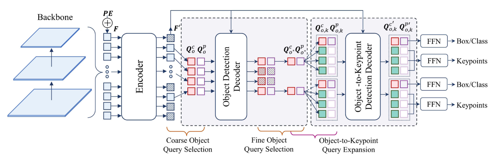
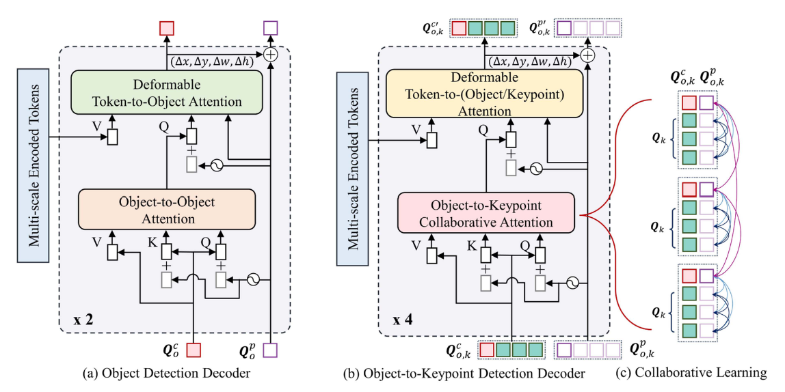

# 论文标题: ED-Pose++: Enhanced Explicit Box Detection for Conventional and Interactive Multi-Object Keypoint Detection - IEEE TRANSACTIONS ON PATTERN ANALYSIS AND MACHINE INTELLIGENCE, 2025

### 一、引言与核心问题

本论文聚焦于多目标关键点检测（Multi-object Keypoint Detection），也常被称为姿态估计（Pose Estimation）。这项技术在机器人、VR/AR、生物医学及人机交互等领域具有广泛应用，是精细化视觉理解的核心任务之一。尽管在特定类别（如人体）的关键点检测上已取得显著进展，但更具挑战性的“多类别、多目标”场景仍未被充分探索。现有方法，无论是依赖独立目标检测器的“自顶向下”（Top-down）范式，还是采用启发式分组的“自底向上”（Bottom-up）范式，都存在计算冗余、依赖性强或泛化能力弱等问题。近年来，基于DETR的端到端模型（如PETR）虽然简化了流程，但其隐式的姿态查询方式在处理不同物体类别（具有不同关键点定义）时面临困难。此外，高质量标注数据的获取是另一大瓶颈，人工标注耗时耗力，而传统的“模型预标注+人工修正”策略在处理域外（Out-of-Distribution）数据时效率低下。

**论文试图解决的核心任务是什么？**

本文旨在解决两大核心问题：1) 构建一个统一且高效的端到端框架，以解决通用的**多类别、多目标关键点检测**任务；2) 设计一种**人机交互机制**，显著降低关键点标注的成本和时间，尤其是在复杂和域外场景中。

*   **输入 (Input)**:
    *   **数据类型**: 单张RGB图像。
    *   **数据维度/Shape**: `[Batch_size, 3, Height, Width]`，其中通道数为3，代表RGB。

*   **输出 (Output)**:
    *   **数据类型**: 一个包含多个检测实例的集合。对于图像中的每一个被检测到的物体实例，模型会输出：
        1.  **类别标签 (Class Label)**: 标识物体所属的类别（如人、猫、狗、汽车等）。
        2.  **边界框 (Bounding Box)**: 描述物体位置的矩形框，通常表示为 `[center_x, center_y, width, height]`。
        3.  **关键点坐标 (Keypoints)**: 一组2D关键点，其数量和定义由物体类别决定。每个关键点的形式为 `[x, y, v]`，其中 `(x, y)` 是坐标，`v` 是可见性得分。
    *   **数据维度/Shape**: 输出是一个列表（长度为检测到的实例数），每个元素包含类别、边界框（`[4]`）和关键点（`[Num_keypoints, 3]`），其中 `Num_keypoints` 是动态变化的。

*   **任务的应用场景**:
    *   **动画与游戏**: 驱动虚拟角色的动作捕捉。
    *   **体育分析**: 分析运动员的动作姿态与技术。
    *   **人机交互**: 理解用户的手势和身体语言。
    *   **自动驾驶**: 检测行人和车辆的关键部位以预测其行为。
    *   **生物学研究**: 追踪动物的行为和运动模式。

*   **当前任务的挑战 (Pain Points)**:
    1.  **多类别动态性**: 不同类别的物体拥有不同数量和语义的关键点，要求模型具备动态适应能力，而非硬编码的结构。
    2.  **端到端训练稳定性**: 直接从图像端到端地预测所有实例的姿态，容易出现收敛缓慢、性能不及两阶段方法的问题。
    3.  **遮挡与密集场景**: 在拥挤的场景中，物体间的严重遮挡使得关键点定位和实例关联变得极其困难。
    4.  **高昂的标注成本**: 精确的关键点标注是一项劳动密集型任务，极大地限制了大规模、多样化数据集的构建。现有模型辅助标注在面对新类别或域外数据时，修正成本依然很高。

*   **论文针对的难点**:
    *   本文明确针对**多类别动态性**、**端到端训练稳定性**和**高昂的标注成本**这三个核心难点进行设计和优化。

### 二、核心思想与主要贡献

*   **直观动机与设计体现**:
    *   本文的**核心动机**是将复杂的多目标姿态估计问题分解为更简单、更明确的子问题。作者认为，直接回归所有关键点（如PETR）在语义上是模糊的。一个更稳健的思路是：**先找到物体（全局），再定位它的各个部分（局部）**。
    *   这一动机体现在其创新的**“双阶段显式框检测” (Dual-phase Explicit Box Detection)** 框架中。它不把关键点看作孤立的坐标，而是将其也视为一个微小的“框”，从而将物体检测和关键点检测统一在“框检测”这一共同范式下。整个流程被设计成一个级联结构：首先用一个**对象检测解码器**显式地预测出各个物体的边界框，为后续处理提供强有力的空间先验；然后，基于这些高质量的物体预测，一个**对象-关键点检测解码器**再来显式地预测每个物体内部的关键点“框”。这种由粗到精的级联方式，使得整个学习过程更加稳定和高效。

*   **与相关工作的比较与创新**:
    *   本研究与基于DETR的端到端姿态估计算法 **PETR** [13] 最为相关。两者都试图构建一个无需后处理（如NMS）的端到端框架。
    *   **关键创新**在于：
        1.  **查询初始化**: PETR使用随机初始化的姿态查询，而ED-Pose++从编码后的图像特征中**选择**高质量的查询，提供了更好的初始状态。
        2.  **显式级联 vs. 隐式并行**: PETR试图用一个解码器并行地回归所有姿态，查询与姿态的对应关系是隐式学习的。ED-Pose++则采用**显式的两阶段解码器**：先做物体检测，再做关键点检测。这种级联设计将复杂的姿态估计任务分解，降低了学习难度，并为处理多类别问题提供了清晰的框架。
        3.  **交互能力**: 此前的所有主流姿态估计算法均不具备交互式修正能力。ED-Pose++首次为端到端姿态模型引入了**人机交互回路**，这是一个全新的维度。

*   **核心贡献与创新点**:
    1.  **提出ED-Pose++框架**: 一个统一的、完全端到端的框架，通过“双阶段显式框检测”范式，首次高效地解决了**多类别、多目标关键点检测**的难题。
    2.  **设计了交互式修正机制**: 提出了一个包含**姿态错误建模 (Pose Error Modeling)** 和**人机反馈回路 (Interactive Human-Feedback Loop)** 的交互机制，能够利用极少的用户点击来精准修正预测结果，将标注效率提升了超过10倍。
    3.  **性能突破**: 作为首个完全端到端的模型，在COCO和CrowdPose等多个基准测试中，其性能**首次超越了**基于热力图的、更复杂的“自顶向下”方法，验证了其架构的优越性。

### 三、论文方法论 (The Proposed Pipeline)

* **整体架构概述**:
  ED-Pose++的整体流程是一个级联式的解码过程。给定一张输入图像，首先由一个标准的CNN主干网络（如ResNet, Swin Transformer）提取多尺度特征图。这些特征图经过一个Transformer编码器进行上下文信息融合，得到精炼的特征`F'`。接下来，模型进入核心的**双阶段解码器**：

  1.  **对象检测解码器 (Object Detection Decoder)**: 从编码器输出的特征中进行**粗粒度查询选择**，得到一组高质量的物体查询（包含内容和位置信息）。该解码器通过多层自注意力和交叉注意力机制，迭代地优化这些查询，最终预测出图像中所有物体的类别和边界框。
  2.  **对象-关键点检测解码器 (Object-to-Keypoint Detection Decoder)**: 在上一阶段的物体预测结果中，进行**细粒度查询选择**，保 置信度最高的物体。然后，通过一个**“对象到关键点”查询扩展**模块，为每个被保留的物体动态生成一套专属的关键点查询。最后，该解码器通过**协同学习机制**同时更新物体和其内部关键点的表示，输出最终精确的关键点位置。

  

* **详细网络架构与数据流**:
  *   **数据预处理与编码**:
      *   输入图像 `[B, 3, H, W]` 经过Backbone和Transformer Encoder，输出多尺度特征 `F'`，其形状类似于 `[B, T, D]`，其中 `T` 是Token总数，`D` 是特征维度（例如256）。
  *   **阶段一：对象检测解码器**:
      *   **粗粒度查询选择**: 不同于DETR的随机查询，模型会根据一个分类头对所有`T`个Token进行打分，选择Top-N（例如900）个作为初始的**对象内容查询** `Q_c_o`（`[B, N, D]`）。
      *   **位置查询生成**: `Q_c_o` 经过一个小型前馈网络（FFN）生成对应的**对象位置查询** `Q_p_o`（`[B, N, 4]`），表示初始的边界框。
      *   **解码过程**: `Q_c_o` 和 `Q_p_o` 被送入对象检测解码器。每个解码层包含：
          1.  **对象-对象注意力 (自注意力)**: 在`N`个对象查询之间传递信息，建模物体间的关系（如遮挡、相对位置）。
          2.  **Token-对象注意力 (交叉注意力)**: 对象查询与编码器输出的图像特征`F'`进行交互，从图像中吸收相关信息来更新自身。
          3.  **FFN**: 进行特征变换。
      *   **形状变换**: 在解码器内部，查询的形状 `[B, N, D]` 和 `[B, N, 4]` 保持不变，但其内容被不断优化。
  *   **阶段二：对象-关键点检测解码器**:
      *   **细粒度查询选择**: 在对象检测解码器输出的`N`个物体预测中，根据分类得分再次筛选，保留Top-M（例如100）个高质量的物体，得到 `Q_c_o*` 和 `Q_p_o*`。
      *   **“对象到关键点”查询扩展**: 这是连接两个解码器的关键桥梁。对于`M`个被选中的物体，模型为每个物体生成`K_n`个关键点查询（`K_n`是该物体类别`n`的关键点数量）。
          *   **关键点内容查询**: 初始化一组可学习的关键点类别嵌入 `V_e`（`[1, K_n, D]`），然后将其与每个物体的`Q_c_o*`相加，从而为每个物体实例生成一套独特的内容查询 `Q_c_k`（`[B, M, K_n, D]`）。
          *   **关键点位置查询**: 关键点“框”的中心坐标由`Q_c_o*`通过FFN回归得到，而其宽高则与对应物体框的宽高动态关联。
          *   **形状变换**: 此步之后，查询被整合为对象-关键点查询，形状为 `[B, M * (1+K_n), D]` 和 `[B, M * (1+K_n), 4]`。
      *   **协同学习与解码**: 整合后的查询被送入对象-关键点检测解码器。其注意力机制（Collaborative Attention）经过精心设计：
          *   允许**物体-物体**间的外部交互（全局上下文）。
          *   允许**物体-关键点**和**关键点-关键点**的内部交互（建模身体部件的结构关系）。
          *   **禁止了不同物体实例的关键点之间的交互**，以避免在密集场景中产生混淆，这是对“自底向上”方法缺陷的改进。
      *   经过多层解码，最终由多个FFN头回归出每个物体的最终边界框和所有关键点的位置。
  *   **ED-Pose++的扩展**:
      *   **多类别训练**: 在训练时，根据当前样本的**真实类别标签**，动态选择对应数量`K_n`和类型的`V_e`来进行查询扩展。
      *   **交互机制**:
          1.  **姿态错误建模 (训练时)**: 随机对真实关键点施加抖动、丢失、交换、反转等错误，生成错误的姿态查询`Q_e`，然后送入对象-关键点解码器，目标是重建出原始的正确姿态。这相当于一个去噪自编码任务，强迫模型学习姿态的内在结构约束，提升鲁棒性。
          2.  **人机反馈回路 (训练与推理)**: 在训练时，模拟用户点击，用真实值替换模型预测中最差的几个关键点，然后将这个“半对半错”的查询**再次送回解码器**进行一轮或多轮迭代优化，监督模型学会根据少数正确线索来修正全局。推理时，则接收真实用户的点击输入。

* **损失函数 (Loss Function)**:
  *   **设计理念**: 整体损失函数是一个多任务损失，通过匈牙利算法进行预测与真值的一对一匹配。总损失 `L = L_c + L_r + L_l`。
  *   **关注重点**:
      1.  **`L_c` (常规检测损失)**: 这是基础的检测损失，包含：
          *   **分类损失**: 对物体类别进行监督。
          *   **物体框回归损失**: L1损失和GIoU损失的组合。
          *   **关键点回归损失**: L1损失和 **OKS (Object Keypoint Similarity) 损失**的组合。OKS损失是一种归一化的L2距离，考虑了物体尺度，是姿态估计中更合理的度量。
      2.  **`L_r` (姿态重建损失)**: 在姿态错误建模任务中，对重建出的关键点与真实关键点计算L1损失。
      3.  **`L_l` (反馈回路损失)**: 在模拟交互后，对再次迭代精炼的预测结果计算与`L_c`类似的检测损失。
  *   **训练实施**: 这三个损失在训练中同时被计算和优化。

* **数据集 (Dataset)**:
  *   **所用数据集**: 论文在多个基准上进行了实验，包括：
      *   **人体**: COCO, CrowdPose, OCHuman, Human-Art。
      *   **动物**: AnimalPose (5个类别), AP-10K (60个物种)。
      *   **车辆**: Carfusion。
  *   **特殊处理**: 论文的核心特色之一是**多数据集联合训练**。在训练时，从不同数据集中采样，并根据每个数据集的特定类别和关键点定义，动态地构建模型输入和监督信号。这使得单个模型能够处理多样化的物体类别。

### 四、实验结果与分析

*   **核心实验结果**:
    *   论文展示了强大的性能。在COCO val2017数据集上，ED-Pose（ED-Pose++的基础版本）首次以端到端模型实现了对主流Top-down方法的超越。

    | 指标 (COCO val) | Backbone  | PETR [13] (One-stage) | SimpleBaseline [15] (Top-down) | Poseur [16] (Top-down) | ED-Pose (本文) |
    | --------------- | --------- | --------------------- | ------------------------------ | ---------------------- | -------------- |
    | AP              | ResNet-50 | 68.8                  | 70.4                           | -                      | **71.6**       |
    | AP              | Swin-L    | 74.3                  | -                              | 78.9 (HRFormer-B)      | **75.8**       |

    *   **解读**: 使用相同的ResNet-50骨干网络，ED-Pose比当时的SOTA端到端模型PETR高出2.8 AP，甚至比强大的两阶段方法SimpleBaseline高出1.2 AP。这证明了其显式框检测架构的有效性。在拥挤场景（CrowdPose数据集）中，其优势更为明显，AP提升高达9.1点，显示了其处理遮挡和实例区分的强大能力。
    *   在多类别交互任务中（Table VII），ED-Pose++显著降低了标注所需的点击次数（NoC@95）。例如，在COCO上，NoC@95从5.40（模型+手动修正）降低到1.91；在更复杂的AP-10K（60类动物）上，从16.16降低到6.34，效率提升巨大。

*   **消融研究解读**:
    *   **显式框检测的必要性 (Table XII)**: 移除物体边界框的监督损失后，模型在COCO上的性能骤降4.5 AP，在CrowdPose上更是暴跌9.9 AP。这证实了“先检测物体框”这一阶段为后续关键点定位提供了至关重要的空间先验，是整个框架成功的基石。
    *   **交互机制的组成部分 (Table XIII)**: 单独加入“姿态错误建模”能提升1.2 AP，并加速收敛；单独加入“人机反馈回路训练”能提升0.9 AP。两者结合使用，则能获得最大收益。这表明这两个模块分别从提升模型自身鲁棒性和学习利用外部线索两个角度增强了模型性能。

*   **可视化结果分析**:
    *   论文中的可视化结果（Fig. 9, 10, 11, 12）清晰地展示了模型的优点。Fig. 9显示了模型同时预测的物体框和关键点框，直观地体现了其核心工作机制。Fig. 10展示了其在多类别场景下的成功应用。Fig. 11和12则生动地演示了交互过程：仅需1-3次点击，模型就能将原本严重错误的姿态预测修正到近乎完美的程度，尤其是在域外艺术图像上，效果惊人。

### 五、方法优势与深层分析

*   **架构/设计优势**:
    *   **优势详述**: ED-Pose++的核心优势在于其**结构化的、由粗到精的显式建模范式**。
        1.  **降低学习难度**: 它将一个复杂的、高维的姿态预测问题分解为两个耦合但更简单的框检测任务。物体检测阶段处理了实例的定位、分类和尺度问题；关键点检测阶段则可专注于在物体框提供的强先验下，学习部件的内部几何构型。
        2.  **提升特征质量**: 通过“对象到关键点”的查询扩展机制，关键点查询不再是无根之萍，而是直接继承了其所属物体的丰富上下文信息，这使得关键点特征的提取更具针对性。
        3.  **强大的泛化能力**: 双阶段设计天然地解耦了“是什么物体”和“部件在哪里”。这使得模型在多类别任务上表现出色，因为它可以为新类别动态地加载和应用相应的关键点定义，而无需改变主体架构。交互机制中的姿态错误建模，相当于让模型见识了大量“病态”样本并学会“自愈”，极大地增强了模型对噪声和域外变化的鲁棒性。

*   **解决难点的思想与实践**:
    *   **核心思想**: **分解与显式化 (Decomposition and Explicit Modeling)**。
    *   **实践**:
        *   针对**多类别动态性**，通过**动态查询初始化**实践了这一思想。模型不是学习一个能处理所有类别的“万能”解码器，而是在运行时根据已识别的物体类别，动态地“装配”一个专用的关键点检测头。
        *   针对**端到端训练稳定性**，通过**级联解码器和查询选择**来实践。高质量的查询初始化和逐步求精的流程，为优化过程提供了稳定的梯度和明确的中间目标，避免了从零开始学习的巨大不确定性。
        *   针对**高昂的标注成本**，通过**交互式反馈回路**来实践。它将人的先验知识（几次点击）高效地融入到模型的推理过程中，让模型利用其学到的强大内部结构先验，将局部的修正“传播”为全局的优化，实现了人与机器智能的高效协同。

### 六、结论与个人思考

*   **论文的主要结论回顾**:
    *   本文成功地提出了ED-Pose++，一个创新的端到端框架，通过双阶段显式框检测，有效解决了传统方法在多类别、多目标关键点检测任务上的不足。同时，其引入的人机交互机制，为解决数据标注瓶颈问题提供了一个非常有效且高效的解决方案。

*   **潜在局限性**:
    *   **串行依赖**: 模型的级联特性意味着关键点检测的性能上限受制于物体检测阶段。如果物体检测器未能检出某个实例，后续阶段将无能为力。
    *   **推理速度**: 尽管训练收敛快，但双解码器以及交互时的迭代循环，可能会比一些单阶段并行模型在推理时稍慢，尤其是在需要多次交互修正时。
    *   **类别扩展性**: 虽然框架支持多类别，但添加一个全新的、训练集中未见的类别，仍需要重新收集数据并进行微调或重新训练，无法做到零样本（Zero-shot）的关键点检测。

*   **未来工作方向**:
    *   **向3D扩展**: 将这种显式框检测和交互式修正的思想应用于3D姿态估计和3D物体部件标注，这在自动驾驶和AR/VR中具有巨大价值。
    *   **交互式多任务学习**: 将关键点、分割掩码、深度图等多种标注任务融合在一个交互式框架中，利用用户在一个任务上的输入（如点击一个关键点）来同时优化其他相关任务的预测结果。
    *   **时间维度融合**: 将该框架扩展到视频领域，利用时间连续性来进一步提升检测的鲁棒性，并实现交互式的视频姿态标注。

*   **对个人研究的启发**:
    *   这篇论文最核心的启发在于**“显式建模”**的力量。在面对复杂的输出结构时，将其分解为有逻辑关系的、更简单的中间步骤，并为每个步骤提供明确的监督信号，是设计稳定且高性能模型的有效策略。此外，其将**人机交互**不仅仅视为一个应用，而是作为一种提升模型鲁棒性和泛化能力的**训练策略**，这种思路非常新颖，值得在其他计算机图形学和视觉任务中借鉴。