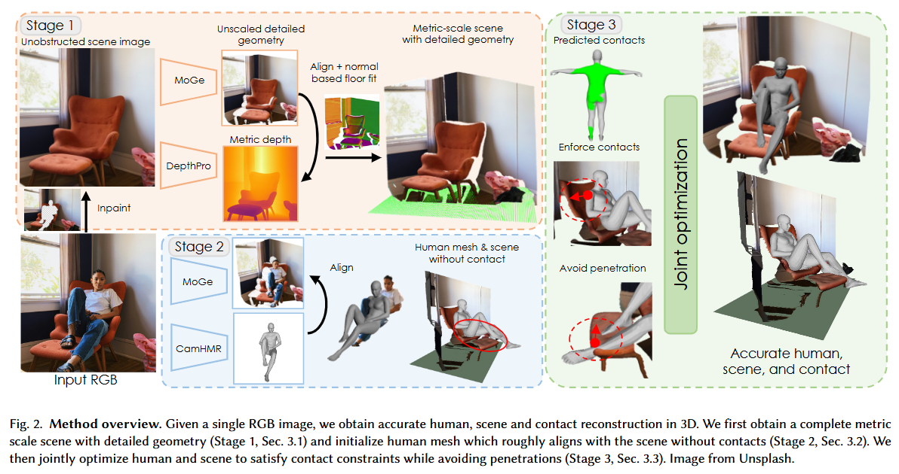

# [PhySIC: Physically Plausible 3D Human-Scene Interaction and Contact from a Single Image] - [SIGGRAPH Asia_2025]

> **Arxiv ID**: 2510.11649v1 [cs.CV]
> **Links**: [Paper](https://arxiv.org/abs/2510.11649) | [Project Page](https://yuxuan-xue.com/physic)

### 一、引言与核心问题

在计算机图形学与具身智能（Embodied AI）的交叉领域，如何从单张二维图像中恢复出三维空间内协调共存的人体与场景，一直是一个极具挑战性的课题。以往的研究往往割裂了这两者：要么专注于静态场景重建而忽略人体，要么在假设已知场景的前提下估计人体姿态。**PhySIC (Physically Plausible Human-Scene Interaction and Contact)** 的出现旨在打破这种隔阂，它提出了一种统一的框架，致力于解决单目视觉下的深度歧义、遮挡处理以及物理接触不一致性问题。

**论文试图解决的核心任务是：从单张RGB图像中联合重建具有物理合理性的三维人体和三维场景。**

*   **输入 (Input)**: 模型接收一张包含人体与环境的单目RGB图像，数据维度为 $I \in \mathbb{R}^{H \times W \times 3}$。该图像通常是在非受控的自然环境（in-the-wild）下拍摄的，可能包含复杂的背景、家具以及人体与环境的交互动作（如坐、站立、依靠等）。
*   **输出 (Output)**: 系统输出三个核心对齐的三维资产：(1) 具有公制尺度（Metric Scale）的SMPL-X人体网格模型（Vertices $V \in \mathbb{R}^{10475 \times 3}$）；(2) 稠密的场景表面几何（通常以点云或网格形式表示）；(3) 顶点级别的稠密接触图（Contact Map），明确指出人体表面哪些区域与场景发生了物理接触。
*   **应用场景**: 该技术可广泛应用于虚拟现实（VR）中的数字人交互、机器人导航中的人机共存理解、以及通过单一照片生成数字孪生场景等任务。
*   **当前任务的挑战 (Pain Points)**:
    1.  **深度与尺度的歧义性 (Scale Ambiguity)**: 单目图像缺乏绝对尺度信息，导致重建的人体往往像“巨人”或“侏儒”一样漂浮在场景中，无法确定真实的物理距离。
    2.  **物理接触的不可靠性**: 现有方法恢复的人体经常出现“悬空坐”（浮在椅子上方）或“穿模”（脚陷入地面）等违反物理规律的现象。
    3.  **严重遮挡 (Severe Occlusion)**: 人体与场景物体相互遮挡（例如人坐在桌子后），导致场景几何缺失，进而使得物理约束难以计算。

**论文针对的难点**: 本文主要聚焦于如何利用深度学习大模型（Foundation Models）提供的几何先验，通过一种**测试时优化**（Test-Time Optimization）的策略，在统一的公制空间内同时校准人体姿态和场景几何，特别是解决被遮挡区域的几何补全与物理接触约束。

### 二、核心思想与主要贡献

PhySIC 的核心设计动机在于“互为先验”：场景的物理结构限制了人体的可能姿态，而人体的姿态和接触关系又反过来为场景的尺度和几何提供了强有力的线索。

与现有的 SOTA 方法（如 HolisticMesh 或 PROX）相比，PhySIC 并没有简单地依赖端到端的回归网络，而是采用了一种**“初始化-补全-联合优化”**的多阶段策略。其最大的改进在于引入了**遮挡感知的物理约束**和**场景几何修补（Inpainting）**机制。它不像 PROX 那样需要预先扫描的静态场景，也不像 HolisticMesh 那样仅限于特定家具类别，而是能够处理任意场景。

**核心贡献总结**:
1.  **统一的公制重建框架**: 提出了首个能从单张图像处理多人、多场景类型且具备公制尺度的重建方法，有效解决了单目视觉下的尺度漂移问题。
2.  **遮挡感知的联合优化策略**: 设计了一套包含深度对齐、接触先验、防穿透（Interpenetration）的损失函数组合，并特意针对遮挡区域进行了掩码处理，防止优化过程在不可见区域产生错误的物理排斥。
3.  **场景几何的鲁棒补全**: 利用生成式修补技术恢复被人体遮挡的场景深度，并合成缺失的地平面（Floor Synthesis），为物理接触提供了可靠的几何支撑（Scaffold）。

### 三、论文方法论 (The Proposed Pipeline)

PhySIC 的整体流程并非一个单一的前馈神经网络，而是一个**级联的优化管线（Cascaded Optimization Pipeline）**。其工作流大致可以分为三个阶段：首先利用现有的最先进（SOTA）基础模型获取初始的人体、场景深度和接触图；接着对被遮挡的场景进行“幻觉”修补以构建完整的物理环境；最后通过一个精心设计的能量函数进行联合优化，将人体“吸附”到场景的正确位置上。

#### 1. 初始化与场景脚手架搭建 (Initialization & Scene Scaffold)

数据流始于单张 RGB 图像。系统并行地启动多个基础模型来提取初级特征：
*   **人体参数估计**: 使用 **CameraHMR** 回归出初始的 SMPL-X 参数（包括形状 $\beta$、姿态 $\theta$ 和弱透视相机参数）。
*   **公制深度估计**: 利用 **DepthPro** 或 **ZoeDepth** 预测绝对公制深度图 $D \in \mathbb{R}^{H \times W}$。这一步至关重要，因为它为整个场景提供了真实的物理尺寸单位（米）。
*   **接触区域预测**: 使用 **DECO** 预测人体表面的接触概率图 $C \in [0, 1]^{10475}$，这为后续的物理吸附提供了语义引导。

在这一阶段，系统执行了一个关键的**尺度对齐（Scale Alignment）**操作。由于透视投影的模糊性，初始的人体网格可能与场景深度图在尺度上不匹配。作者通过求解一个优化问题，计算全局缩放因子 $s$ 和平移向量 $t$，使得投影后的人体深度与预测的场景深度在可见区域内尽可能一致。

#### 2. 遮挡感知与几何补全 (Occlusion-Aware Inpainting)

为了计算准确的物理碰撞，必须知道人体背后的场景是什么样的。如果直接使用原始深度图，人体背后的椅子或墙壁是缺失的（由于遮挡）。
*   **人体移除与修补**: 系统首先利用人体分割掩码将原图中的人体“扣除”，然后使用 **PowerPaint** 等图像修复模型（Inpainting Model）填补RGB图像的空洞。
*   **深度图修补**: 对修补后的背景RGB图像再次运行深度估计，从而获得被遮挡区域的几何形状。
*   **地平面合成**: 针对深度估计器往往难以完美重建平整地面的问题，PhySIC 使用 RANSAC 算法在场景点云中拟合地平面方程。如果检测到地面，系统会显式地生成一个大地平面网格，确保脚部接触的稳定性。

#### 3. 联合优化 (Joint Optimization)

这是本论文最核心的算法模块。在拥有了初始人体、补全后的场景点云 $\mathcal{P}_s$ 和接触先验后，系统定义了一组可学习变量：人体姿态 $\theta$、全局位移 $t$、全局尺度 $s$ 以及相机内参 $K$。通过最小化总能量函数 $L_{total}$ 来精细调整这些参数。

**损失函数设计 (Loss Function)**:
总损失函数定义为 $L_{total} = \lambda_{j2d} L_{j2d} + \lambda_{d} L_{d} + \lambda_{c} L_{c} + \lambda_{i} L_{i} + \lambda_{reg} L_{reg}$。

*   **2D重投影损失 ($L_{j2d}$)**: 确保优化后的三维人体关节投影回二维图像平面后，与 OpenPose 或 ViTPose 检测到的 2D 关键点重合。
*   **深度对齐损失 ($L_{d}$)**:

$$
L_{d} = \frac{1}{|\mathcal{V}_{vis}|} \sum_{v \in \mathcal{V}_{vis}} \| (s \cdot v + t)_z - D(v_{proj}) \|_2
$$

该项强制人体的可见顶点深度与预测的场景公制深度保持一致。这是防止人体在场景中“前后漂移”的关键。
*   **接触损失 ($L_{c}$)**:
    对于 DECO 预测为“接触”的顶点（$C_v > 0.5$），该损失函数会将其拉向场景点云 $\mathcal{P}_s$ 中最近的表面点。这相当于一种物理吸附力，将屁股吸附在椅子上，将脚吸附在地面上。
*   **遮挡感知的防穿透损失 ($L_{i}$)**:
    这是论文的创新细节。传统的穿透损失会惩罚所有进入场景内部的人体顶点。然而，作者发现对于**被遮挡的人体部分**（如被桌子挡住的腿），直接施加穿透惩罚会导致姿态崩溃，因为场景几何在遮挡处可能是不准确的。因此，该损失被设计为：

$$
L_{i} = \sum_{v \in \mathcal{V}_{human} \setminus \mathcal{V}_{occ}} \text{ReLU}( \text{SDF}_{\mathcal{P}_s}(v) )
$$

即**仅对可见的人体部分**施加严格的防穿透约束，而对遮挡部分保持宽容，允许其保持由数据驱动的姿态先验。
*   **正则化损失 ($L_{reg}$)**: 防止人体姿态偏离初始的 CameraHMR 预测太远，保持姿态的自然性。

### 四、实验结果与分析

论文在 **PROX** (室内静态场景) 和 **RICH** (室内外多视角) 两个主要数据集上进行了评估。这里主要关注 PROX 数据集上的定量结果，因为它是该领域的标准基准。

**核心实验结果**:

| 指标 (PROX Dataset)               | PROX (Baseline) | HolisticMesh (SOTA) | PhySIC (本文方法) | 提升幅度     |
| :-------------------------------- | :-------------- | :------------------ | :---------------- | :----------- |
| **PA-MPJPE** ($\downarrow$)       | 73.31 mm        | 77.04 mm            | **41.99 mm**      | **~45%**     |
| **MPJPE** ($\downarrow$)          | 266.50 mm       | 202.80 mm           | 230.26 mm         | N/A (见分析) |
| **Contact F1 Score** ($\uparrow$) | 0.152           | 0.391               | **0.511**         | **+0.12**    |

*   **结果解读**:
    *   **姿态精度**: 在对齐后的平均关节误差（PA-MPJPE）上，PhySIC 取得了显著的进步（约 42mm），这几乎是之前 SOTA 方法误差的一半。这说明通过与场景的物理约束对齐，人体局部的姿态变得更加准确自然。
    *   **接触质量**: Contact F1 分数从 0.39 提升至 0.51，表明重建结果在物理交互上更可信，有效地捕捉到了坐姿和站姿的接触面。
    *   **关于 MPJPE**: 虽然 HolisticMesh 在绝对位置误差（MPJPE）上略优，但作者指出 HolisticMesh 经常在野外（in-the-wild）图像上失效或产生严重穿模。PhySIC 虽然在绝对位置数值上略高，但换来的是极高的物理合理性和泛化能力。

*   **消融研究 (Ablation Study)**:
    实验证明，如果不使用深度对齐损失 ($L_d$)，PA-MPJPE 会飙升至 69mm；如果不使用遮挡感知的防穿透损失，姿态误差也会显著增加。特别是**地平面合成（Floor Synthesis）**模块的加入，对提升接触指标起到了决定性作用。

### 五、方法优势与深层分析

**1. 鲁棒的尺度解耦机制**:
PhySIC 的最大优势在于它巧妙地解决了单目重建中的“尺度-深度”耦合问题。传统的透视投影中，物体变大和物体变近在图像上是相似的。PhySIC 利用 DepthPro 这种强先验的公制深度模型作为“锚点”，强制人体去适配场景的绝对尺度，而不是像以往方法那样让人体和场景在一个未知的相对尺度下“互猜”。

**2. 对遮挡的深刻理解 (Occlusion Reasoning)**:
在代码实现和公式设计层面，PhySIC 并没有盲目地应用物理约束。作者敏锐地意识到，在单目视觉中，被遮挡区域的场景几何是推测出来的（Inpainted），具有高度不确定性。因此，在 Loss 设计中显式地对遮挡区域进行 Mask 处理（在 $L_i$ 中排除 $\mathcal{V}_{occ}$），这是一种非常务实的工程智慧——**“对于看不见的地方，宁可相信数据驱动的姿态先验，也不要强行适配不可靠的几何推测”**。

**3. 极高的效率与泛化性**:
整个优化过程仅需约 **9秒**，端到端处理一张图片不到 27秒。相比于需要多视角视频流的方法，PhySIC 这种基于单图优化的轻量级方案，极大地降低了 3D 内容生成的门槛，使其能直接应用于数以亿计的互联网存量图片。

### 六、结论与个人思考

**结论**:
PhySIC 成功展示了如何通过整合现有的 2D 视觉基础模型（分割、修补、深度估计、姿态估计），并通过物理约束将它们“粘合”在一起，从而在单目图像上实现高质量的 3D 人-场重建。它证明了**明确的物理约束（显式优化）**在解决数据驱动模型的幻觉和漂移问题上具有不可替代的作用。

**潜在局限性**:
1.  **依赖基础模型的上限**: 该方法的性能严格受限于上游模型。如果 DepthPro 估计的深度完全错误，或者 Inpainting 填补的背景极其离谱，后续的优化不仅无法修正，反而会被误导。
2.  **刚性场景假设**: 目前的方法主要假设场景是刚性的（Rigid）。对于人坐在软沙发、躺在床上导致表面发生形变的情况，当前的刚性碰撞模型无法处理，可能导致接触面估计不准确。
3.  **地平面依赖**: 对于没有清晰地平面的复杂场景（如攀岩、空中动作），方法的约束能力可能会减弱。

**对个人研究的启发**:
PhySIC 的设计思路非常值得借鉴：在处理复杂的多模态一致性任务时，不一定非要训练一个巨大的端到端网络。利用**测试时优化（Test-Time Optimization）**作为胶水，将各个领域的 SOTA 模型（Expert Models）连接起来，往往能以更低的成本获得更好的泛化性。特别是对于“遮挡区域不施加硬约束”这一策略，在其他涉及不确定性的 3D 重建任务中具有普适的指导意义。