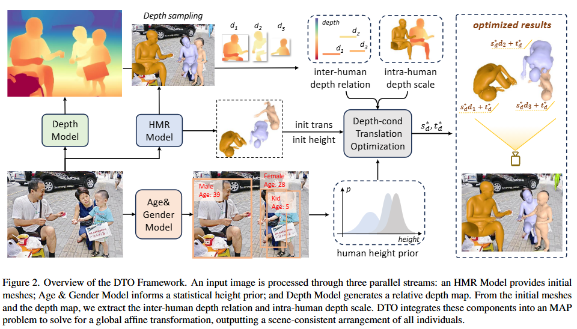
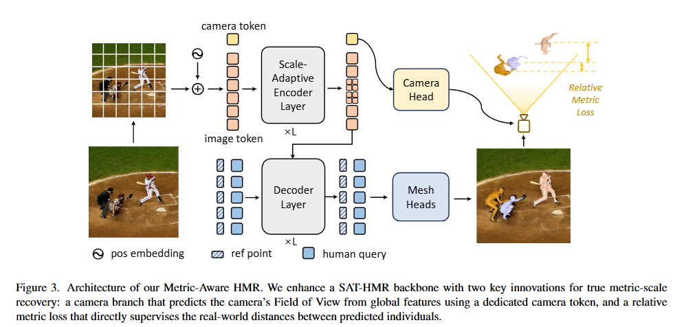
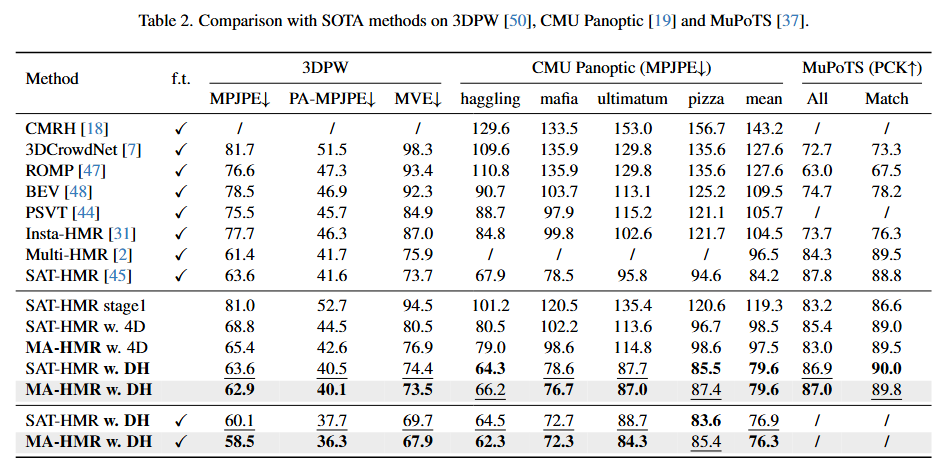
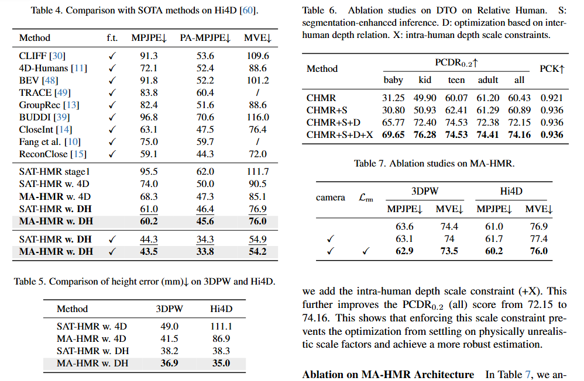

# Towards Metric-Aware Multi-Person Mesh Recovery by Jointly Optimizing Human Crowd in Camera Space - arXiv 2025

> Arxiv ID: [2511.13282](https://arxiv.org/abs/2511.13282)  
> Code: [https://github.com/gouba2333/MA-HMR](https://github.com/gouba2333/MA-HMR)

## 一、问题定义与研究目标

这篇论文研究的是单张图像多人 3D 人体网格恢复（multi-person human mesh recovery, multi-person HMR）：给定一张包含多人的 RGB 图像，恢复每个人的 3D pose、body shape、mesh 以及在相机坐标系中的 metric-scale 位置关系。与单人 HMR 相比，多人场景不仅要求每个人自身的 mesh 准确，还要求同一张图中不同人的深度顺序、真实尺度和相对距离在相机空间中一致。

**核心任务是什么**：论文试图解决 in-the-wild 多人 HMR 的两个层面问题。第一是数据层面：现有 pseudo-ground-truth（pGT，伪真值）生成流程通常逐人独立优化，把每个人单独拟合后再拼回同一图像，导致多人之间的深度和尺度互相冲突。第二是模型层面：端到端多人 HMR 模型如果用这种不一致 pGT 训练，就难以学习真实的 metric-scale scene layout。本文因此提出 DTO 生成 scene-consistent pGT，再用 DTO-Humans 训练 Metric-Aware HMR（MA-HMR）。

**输入（Input）**：DTO 的输入是一张多人 RGB 图像，以及若干 off-the-shelf 模型产生的初始信息：Detectron2 给出 person boxes 和 instance masks，CameraHMR 给出每个人初始 mesh，ViTPose 给出 2D keypoints 用于过滤和匹配，HumanFoV 给出相机内参估计，Depth Anything v2 给出 relative depth map，MiVOLO-v2 给出年龄和性别估计。MA-HMR 的输入则是一张完整多人 RGB 图像，模型从全图上下文中同时预测相机 FoV 和所有人的 mesh 参数。

**输出（Output）**：DTO 输出的是每个人在 camera space 中更一致的 translation，尤其是深度 $z_i^*=s_d^*d_i+t_d^*$，并相应 refine shape 以匹配修正后的身高。MA-HMR 输出每个人的人体模型参数和 metric-scale camera-space 结果，同时输出相机 vertical FoV。论文采用 AGORA 的 unified body model：pose $\theta\in\mathbb{R}^{24\times3}$，shape $\beta\in\mathbb{R}^{11}$，其中最后一个 shape component 控制 age-related blending；模型函数 $\mathcal{M}(\theta,\beta)$ 输出 mesh $V\in\mathbb{R}^{6890\times3}$，再通过 translation $T=(x,y,z)$ 放入 camera coordinate system。

**任务的主要应用场景**：多人动作理解、AR/VR、自动驾驶中的行人 3D 理解、体育分析、多人交互重建、拥挤场景下的三维人体标注，以及大规模 in-the-wild 训练数据自动生成。

**当前任务的关键挑战**：第一，真实多人图像很难获得带准确 3D mesh、camera parameter 和 scene-level metric layout 的标注。第二，逐人 pGT 拟合容易让不同人的高度、深度和相对尺度冲突，尤其是儿童、蹲坐姿态、遮挡和拥挤场景。第三，单图中相机 FoV、人体真实尺度和深度位置高度耦合，模型只看单人 crop 很难恢复全局 metric scene。第四，relative depth map 本身只有相对深度，缺少 metric scale 和 shift，需要用人体先验和几何约束把它锚定到相机空间。

**本文主要针对哪些挑战提出改进**：本文用 DTO 在数据生成阶段联合优化同图所有人的 camera-space translations，以修正 pGT 的 scene inconsistency；再用 DTO-Humans 训练 MA-HMR，让模型从 full-image context 中学习相机 FoV、人体尺度和相对深度关系。

## 二、核心思想与主要贡献

论文的直观动机是：人类判断多人场景中“谁离相机更近、谁更高、谁应该站在哪里”时，不会逐个人孤立判断，而会同时利用两类信息：人体身高先验和图像中的相对深度线索。现有 pGT 生成流程虽然能把单个人拟合得较好，但忽略了同一图像中多人的共同几何约束。因此作者把多人 translation refinement 写成一个 joint MAP problem，用 height prior 作为概率先验，用 monocular depth 提供 inter-human relative depth 和 intra-human scale 约束，求解一个全局 affine depth transform。

与本文最相关的工作包括 CameraHMR、4D-Humans、SAT-HMR、BEV、Multi-HMR 和 InstaHMR。CameraHMR / CamSMPLify 提供高质量单人 pGT，但逐人优化会破坏多人一致性。4D-Humans 提供大规模 in-the-wild pGT 来源，但仍受 per-person pipeline 限制。SAT-HMR 是强的 full-image multi-person HMR backbone，但如果训练标签缺少 metric scene consistency，模型仍然难以学到真实尺度关系。本文的关键差异在于：先用 DTO 修正大规模 pGT 的相机空间布局，再把这种 metric-aware supervision 注入端到端网络。

本文主要贡献有三点。第一，提出 Depth-conditioned Translation Optimization（DTO），在 camera space 中联合优化多人 translations，用 inter-human depth relation 和 intra-human depth scale 保证 scene-level consistency。第二，构建 DTO-Humans：0.56M 高质量 scene-consistent 多人图像、2.7M person instances，平均每图 4.8 人。第三，提出 Metric-Aware HMR（MA-HMR），在 SAT-HMR 基础上加入 camera branch 和 relative metric loss，使模型能端到端预测 metric-scale mesh 与 camera parameters。

## 三、方法与实现细节（全文重点）

论文方法可以分成两个层次：DTO 是离线优化框架，用于生成更一致的 pGT；MA-HMR 是用 DTO-Humans 训练的端到端模型，用于直接从单图预测 metric-aware 多人 mesh。

### 3.1 整体 Pipeline 概述

整体流程分为数据生成和模型训练两条线。数据生成阶段，先对每张多人图像做初始 per-person HMR：检测每个人、得到 mask 和 2D keypoints，用 CameraHMR 估计每个人的初始 mesh 和 camera-space placement，再用 HumanFoV、Depth Anything v2 和 MiVOLO-v2 提供相机、深度、年龄/性别信息。DTO 将同一图中所有人的 translation 统一放进一个 MAP optimization 中，求解全局 affine depth transform $(s_d,t_d)$，从而得到 scene-consistent pGT。训练阶段，作者把 DTO 应用于 CameraHMR 版本的 4D-Humans，得到 DTO-Humans，再用它训练 MA-HMR。MA-HMR 基于 SAT-HMR，增加 camera token / camera branch 来预测 vertical FoV，并使用 relative metric loss 监督近距离人对之间的真实相对深度。

### 3.2 端到端数据流

下面把 DTO-Humans 生成和 MA-HMR 训练/推理放在同一张表中，便于区分离线优化和端到端模型。

| 阶段 | 模块/操作 | 输入 | 输出 | 必要 shape / 维度 | 作用 |
|------|-----------|------|------|-------------------|------|
| 1 | 人体检测与分割 | 多人 RGB 图像 | person boxes、instance masks | 每人一个实例 | 给 per-person HMR 和 keypoint detection 提供目标区域 |
| 2 | 初始 HMR | 每个人 masked crop / crop | 初始 mesh、$\hat{\theta}_i,\hat{\beta}_i,\hat{h}_i,\hat{z}_i$ | $\theta\in\mathbb{R}^{24\times3}$，$\beta\in\mathbb{R}^{11}$ | 得到每个人独立估计的 mesh 和初始 camera-space depth |
| 3 | 2D keypoint 过滤 | masked crop、ViTPose keypoints、projected joints | valid / invalid mesh instance | 每人可见 keypoints | 过滤明显不可靠的初始 mesh |
| 4 | 年龄与性别估计 | body / face crop | age group、gender | categorical | 构造每个人的 anthropometric height prior |
| 5 | Relative depth map | 完整图像 | $D_{rel}$ | $H\times W$ depth map | 提供全图相对深度线索 |
| 6 | Inter-human depth relation | $D_{rel}$、visible mesh vertex projections | 每人代表深度 $d_i$ | scalar / person | 用 relative depth 约束不同人的前后关系 |
| 7 | Intra-human depth scale | mesh internal depth、$D_{rel}$ | $X$、$X_{min}$、$X_{max}$ | scalar scale range | 为 global depth scale $s_d$ 提供物理合理范围 |
| 8 | DTO MAP optimization | $\hat{h}_i,\hat{z}_i,d_i,\mu_i,\sigma_i,X_{min},X_{max}$ | $s_d^*,t_d^*$ | two scalars | 求解全图统一的 relative-to-metric depth affine transform |
| 9 | DTO pGT refinement | $s_d^*,t_d^*$、初始 mesh | $z_i^*$、refined shape、scene-consistent pGT | per-person metric layout | 生成 DTO-Humans 训练标签 |
| 10 | MA-HMR encoder | 完整多人图像 | multi-scale image features、camera token embedding | ViT-Base / SAT-HMR feature | 同时建模人群和相机上下文 |
| 11 | Camera branch | camera token embedding | vertical FoV $v$ | scalar | 预测相机内参，缓解 FoV-尺度-深度耦合 |
| 12 | HMR heads | image features | 多人 mesh / pose / shape / depth 等 | per-person predictions | 输出 metric-aware multi-person HMR 结果 |
| 13 | Relative metric loss | predicted / gt root relative depth | $\mathcal{L}_{rm}$ | pairwise close-person supervision | 显式监督近距离人对的真实相对深度距离 |

### 3.3 关键模块逐个拆解

#### 3.3.1 人体模型与相机模型

论文采用 AGORA 的 unified body model，它通过混合 SMPL 和 SMIL template 支持不同年龄段人体。模型参数为 pose $\theta\in\mathbb{R}^{24\times3}$ 和 shape $\beta\in\mathbb{R}^{11}$，其中 $\beta$ 的最后一个分量用于控制 age-related blending。模型函数输出 $V=\mathcal{M}(\theta,\beta)\in\mathbb{R}^{6890\times3}$，再加上 camera-space translation $T=(x,y,z)$ 得到最终 3D points：

$$
P=V+T.
$$

相机模型为标准 perspective camera，假设无 radial distortion，principal point 位于图像中心 $(c_x,c_y)$。方法不直接预测 focal length，而是预测 vertical field of view（FoV）$v$，再由图像高度 $H$ 计算：

$$
f=\frac{H}{2\tan(v/2)}.
$$

3D 点 $P=(X,Y,Z)$ 投影到图像平面：

$$
p=f\cdot\frac{(X,Y)}{Z}+(c_x,c_y).
$$

这个建模选择和 CameraHMR 一致：FoV 比直接回归 focal length 更适合连接全图相机属性和人体尺度关系。

#### 3.3.2 初始 per-person estimation

DTO 不是从零开始优化所有人体参数，而是在强单人 HMR 结果上做 scene-level correction。作者先用 Detectron2 的 segmentation head 得到 person boxes 和 masks。对每个 masked instance，用 CameraHMR 预测初始 mesh，并用 HumanFoV 估计相机内参，使初始 mesh 能放入 camera space。ViTPose-Base 检测 2D keypoints，用于过滤或匹配不可靠 mesh；实验实现中，visible keypoints 少于 5 的人会被丢弃。

补充材料说明 2D keypoint matching 是两阶段的。第一阶段用 ViTPose keypoints 去匹配高质量目标：如果已有 pGT，就匹配 pGT mesh 的 projected joints；如果没有 pGT，则用原始 unmasked crop 上 CameraHMR 预测的 mesh projection。第二阶段中，剩余未匹配 keypoints 再和 masked crop 推理得到的 mesh projection 匹配。若超过一半可见 keypoints 匹配成功，则该 instance 被视为有效；单个 keypoint 的匹配标准是 pixel distance 小于 half head height。这个过程的作用是让 DTO 不被严重错位的初始 mesh 污染。

#### 3.3.3 DTO 的 height prior

DTO 需要一个能约束真实尺度的先验。作者使用 MiVOLO-v2 估计每个人的 age 和 gender，并定义每个人高度 $h_i$ 的 Gaussian prior：

$$
P_i(h_i)=\mathcal{N}(h_i\mid\mu_i,\sigma_i).
$$

对于 15 岁以下人群，补充材料把年龄分为 baby、kid、teen 三组，并用 CDC growth statistics 拟合高度分布：baby 为 $\mathcal{N}(0.801,0.126^2)$，kid 为 $\mathcal{N}(1.122,0.120^2)$，teen 为 $\mathcal{N}(1.477,0.156^2)$。对于 adults，作者指出 CameraHMR 在坐姿、蹲姿等非站立姿态下常低估 canonical height，因此不直接信任模型高度，而是把 CameraHMR 初始高度 $\hat{h}_{CHMR}$ 与 gender-specific population mean 平均：

$$
\mu_i=\frac{\hat{h}_{CHMR}+\mu_{gender}}{2},\qquad \sigma_i^2=\sigma_{gender}^2.
$$

其中 male prior 为 $\mathcal{N}(1.784,0.076^2)$，female prior 为 $\mathcal{N}(1.647,0.071^2)$。这个 hybrid prior 同时保留模型对个体的估计和人口统计先验，用来抵消逐人拟合导致的身高偏差。

#### 3.3.4 Inter-human depth relation

Depth Anything v2 输出的是 relative depth map $D_{rel}$，它和真实 metric depth 的关系被建模为一个全局 affine transform：

$$
D_{metric}=s_dD_{rel}+t_d.
$$

为了把每个人和 relative depth map 连接起来，作者定义每个人的代表深度 $d_i$：将该人的 visible mesh vertices 投影到 2D 图像平面，在这些位置从 $D_{rel}$ 采样，然后求平均。这样 $d_i$ 就保留了同图多人之间的 relative depth ordering。DTO 后续不是逐人独立调 depth，而是统一求一个全图共享的 $s_d,t_d$，使所有人的 $d_i$ 一起落入合理的 metric scene。

#### 3.3.5 Intra-human depth scale

只有 inter-human depth relation 还不够，因为 $D_{rel}$ 的 scale 和 shift 未知，优化可能得到物理上不合理的全局尺度。为此作者引入 intra-human depth scale：对每个人，比较其 mesh 内部 depth variation 和 relative depth map 上对应位置的 variation，计算线性回归斜率 $X_i$ 和相关系数 $w_i$。再用相关系数加权平均：

$$
X=\frac{\sum_{i=1}^{K}w_iX_i}{\sum_{i=1}^{K}w_i}.
$$

这个 $X$ 表示从 relative depth scale 到 metric depth scale 的一个场景级估计。DTO 用它构造全局 scale $s_d$ 的可行区间：

$$
X_{min}=\alpha_1X,\qquad X_{max}=\alpha_2X.
$$

补充材料进一步说明 $\alpha_1,\alpha_2$ 是动态设置的。如果场景近似 planar，即 inter-person depth variance 小于 average intra-person depth variance，则所有人大致等距，intra-human scale 最可靠，设置 $\alpha_1=\alpha_2=1$，固定 $s_d=X$ 只解 $t_d$。否则设置 $\alpha_1=1,\alpha_2=5$，给优化留下更宽的 scale range，以补偿初始 HumanFoV / CameraHMR 可能高估焦距并导致深度偏大的倾向。

#### 3.3.6 DTO objective and solution

设第 $i$ 个人的初始 T-pose height 为 $\hat{h}_i$，初始 camera-space depth 为 $\hat{z}_i$，relative depth representative value 为 $d_i$。经过全局 affine transform 后，该人的修正后 depth 为：

$$
z_i^*=s_d d_i+t_d.
$$

由于 mesh 在 camera space 中按 depth 缩放，修正后身高写成：

$$
h_i=\hat{h}_i\cdot\frac{s_dd_i+t_d}{\hat{z}_i}.
$$

DTO 希望所有人的修正身高都尽可能符合各自的 height prior，因此 MAP 目标为：

$$
\max_{s_d,t_d}\prod_{i=1}^{K}\mathcal{N}\left(\hat{h}_i\cdot\frac{s_dd_i+t_d}{\hat{z}_i}\mid\mu_i,\sigma_i\right).
$$

取 negative log-likelihood，并加入 intra-human scale bound 后，得到约束二次规划：

$$
\min_{s_d,t_d}\sum_{i=1}^{K}\frac{\left(\hat{h}_i\cdot\frac{s_dd_i+t_d}{\hat{z}_i}-\mu_i\right)^2}{\sigma_i^2}\quad \text{s.t.}\quad X_{min}\le s_d\le X_{max}.
$$

补充材料将其化简为标准 least-squares。定义 $a_i=\frac{\hat{h}_id_i}{\hat{z}_i\sigma_i}$，$b_i=\frac{\hat{h}_i}{\hat{z}_i\sigma_i}$，$c_i=\frac{\mu_i}{\sigma_i}$，目标变为：

$$
L(s_d,t_d)=\sum_{i=1}^{K}(a_is_d+b_it_d-c_i)^2.
$$

先求 unconstrained 2x2 linear system 的解，再检查 $s_d$ 是否落在 $[X_{min},X_{max}]$ 内；若超界则 clamp 到对应边界，并解出对应 $t_d$。由于目标是 convex quadratic 且约束是线性的，该过程得到唯一全局最优。求得 $(s_d^*,t_d^*)$ 后，DTO 计算每个人最终 depth translation $z_i^*=s_d^*d_i+t_d^*$，并 refine shape parameters 以匹配修正后的身高。

#### 3.3.7 DTO-Humans dataset

DTO-Humans 是把 DTO 应用于 CameraHMR 版本 4D-Humans 后得到的大规模 scene-consistent pGT dataset。原始 4D-Humans 覆盖 InstaVariety、COCO、MPII、AI Challenger 等 in-the-wild 数据，共约 2M images。DTO 优化后，作者用 posterior probability 做质量过滤：对每个 optimized person 计算 standardized residual height：

$$
\frac{|h_i^*-\mu_i|}{\sigma_i}.
$$

如果一张图中所有人的平均 residual 超过 1.5，则丢弃该图，认为 DTO 没有找到足够符合人体先验的 scene-consistent 解。最终 DTO-Humans 包含 0.56M high-quality images 和 2.7M scene-consistent person instances，平均每张图 4.8 人。补充材料显示数据集中有 50.9K images 含 10 人或更多，并有较宽的 FoV 分布和更真实的人体高度分布；不过 minors 只占约 6.2%，低于均匀年龄分布下的理想比例。

#### 3.3.8 Metric-Aware HMR architecture

MA-HMR 建在 SAT-HMR 之上，继承其 Scale-Adaptive Encoder 用于 multi-scale feature extraction。关键改动是加入 camera branch：用一个 learnable camera token 替代 ViT-style encoder 中的标准 classification token，让它聚合全局 scene-level 信息。通过 encoder 后，camera token 的输出 embedding 进入 MLP head，回归相机 vertical FoV。

这个设计直接对应论文的问题设定：FoV、人体尺度和多人相对深度是耦合的，单人 crop 难以解决，必须依赖 full-image context。相机分支的参数开销很小，补充材料报告总参数量从 SAT-HMR 的 221.9M 增加到 223.7M，约 +0.8%；camera FoV regression head 是 4-layer MLP。

### 3.4 损失函数与训练目标

MA-HMR 的训练目标由 SAT-HMR 原有 HMR / detection / depth 监督，加上本文新增的 FoV loss 和 relative metric loss 组成。

**FoV loss** 用于监督 camera branch，继承 HumanFoV 的非对称形式。设预测 vertical FoV 为 $v_{pred}$，真值为 $v_{gt}$：

$$
\mathcal{L}_{fov}(v_{pred},v_{gt})=
\begin{cases}
3\|v_{gt}-v_{pred}\|^2, & \text{if } v_{pred}>v_{gt},\\
\|v_{gt}-v_{pred}\|^2, & \text{if } v_{pred}\le v_{gt}.
\end{cases}
$$

这个 loss 对 FoV overestimation 施加更大惩罚，延续 CameraHMR / HumanFoV 中对相机估计稳定性的处理。

**Relative metric loss** 用于显式教模型真实尺度下的人与人关系。它只作用在 ground-truth relative depth distance 小于 $\tau$ 的人对上，论文设 $\tau=1$m。对满足条件的人对 $(i,j)$，定义：

$$
\mathcal{L}_{rm}=\log(1+|rd_{pred}-rd_{gt}|).
$$

其中 $rd_{gt}$ 和 $rd_{pred}$ 分别是两个人 root joints 的 ground-truth 和 predicted relative depth distance。log 形式让梯度更稳定，同时聚焦 close-range predictions；这些近距离人对往往最需要准确的 metric relationship。

**总损失** 写成所有组件的 weighted sum：

$$
\mathcal{L}=\lambda_{map}\mathcal{L}_{map}+\lambda_{depth}\mathcal{L}_{depth}+\lambda_{pose}\mathcal{L}_{pose}+\lambda_{shape}\mathcal{L}_{shape}+\lambda_{j3d}\mathcal{L}_{j3d}+\lambda_{j2d}\mathcal{L}_{j2d}+\lambda_{box}\mathcal{L}_{box}+\lambda_{giou}\mathcal{L}_{giou}+\lambda_{det}\mathcal{L}_{det}+\lambda_{fov}\mathcal{L}_{fov}+\lambda_{rm}\mathcal{L}_{rm}.
$$

其中 $\mathcal{L}_{map}$、$\mathcal{L}_{depth}$、$\mathcal{L}_{pose}$、$\mathcal{L}_{shape}$、$\mathcal{L}_{j3d}$、$\mathcal{L}_{j2d}$、$\mathcal{L}_{box}$、$\mathcal{L}_{giou}$、$\mathcal{L}_{det}$ 来自 SAT-HMR 框架，分别约束 scale map、depth、SMPL pose/shape、3D/2D joints、box regression 和 detection。补充材料给出的权重为：$\lambda_{map}=4.0$、$\lambda_{depth}=0.5$、$\lambda_{pose}=5.0$、$\lambda_{shape}=3.0$、$\lambda_{j3d}=8.0$、$\lambda_{j2d}=40.0$、$\lambda_{box}=2.0$、$\lambda_{det}=1.0$、$\lambda_{fov}=0.5$、$\lambda_{rm}=0.5$。

### 3.5 数据集与数据处理

**DTO-Humans 构建数据**：DTO 作用于 CameraHMR 版本的 4D-Humans。4D-Humans 本身来自 InstaVariety、COCO、MPII、AI Challenger 等多种 in-the-wild sources。DTO 通过 height prior 和 monocular relative depth 把这些 per-person pGT 修正成 scene-consistent pGT，再用 standardized residual height 过滤失败样本。

**MA-HMR 训练数据**：训练中使用 AGORA、BEDLAM、CameraHMR 版本 4D-Humans，以及 DTO-Humans。AGORA 是 synthetic multi-person 数据，包含 4,240 个高质量 textured human scans，其中包括 257 个 child scans，训练约 14K images 和 173K person crops。BEDLAM 提供多样体型、肤色、服装、动作和场景的 monocular RGB video 及 3D body parameters。DTO-Humans 则提供 real-world 多人场景中的 scene-consistent pGT。

**评测数据**：Relative Human 用于评估 relative depth reasoning，包含约 7.6K images 和 24.8K+ person instances，并提供 adult/teenager/child/baby age categories 和 relative depth layers。3DPW、CMU Panoptic、MuPoTS 用于多人 pose / mesh benchmark。Hi4D 关注 close human-human interaction，包含 20 subject pairs、100 sequences 和 11K+ frames 的 4D textured scans / SMPL annotations。

**DTO 实现相关处理**：Detectron2 detection threshold 为 0.5，NMS threshold 为 0.7；ViTPose-Base 可见 keypoints 少于 5 的人会被丢弃；Depth-Anything-v2-Large 作为默认 depth model；MiVOLO-v2 基于 body 和 face crops 预测 age/gender。

### 3.6 训练流程、推理流程与复现备注

**DTO-Humans 生成流程**：对 4D-Humans 中的多人图像，先运行检测、分割、keypoint、CameraHMR、HumanFoV、Depth Anything v2 和 MiVOLO-v2。随后为每个人构造 height prior、代表深度 $d_i$ 和 intra-human scale 约束，再解 DTO 的 constrained quadratic problem 得到 $s_d^*,t_d^*$。最后用 standardized residual height 过滤不可靠图像，保留 scene-consistent pGT。

**MA-HMR 训练流程**：训练分四阶段。第一阶段从 SAT-HMR stage1 checkpoint 初始化，该 checkpoint 预训练于 AGORA、BEDLAM、COCO、MPII、CrowdPose 和 Human3.6M；然后在 AGORA、BEDLAM 和 CameraHMR 版本 4D-Humans 上继续训练 5 epochs，并使用 denoising strategy。第二阶段加入 camera branch 和 FoV loss，继续训练 5 epochs。第三阶段在 AGORA、BEDLAM 和 DTO-Humans 上使用 full loss 训练 5 epochs。第四阶段按不同 benchmark 做 fine-tuning。对于 4D-Humans pGT，作者沿用 SAT-HMR stage1，只监督 projected 2D keypoints。

**优化与增强**：所有训练阶段使用 AdamW，learning rate 为 $1\times10^{-5}$，weight decay 为 $1\times10^{-4}$。数据增强包括 random rotation、horizontal flipping、scaling 和 cropping。训练使用 2 张 NVIDIA A800 GPU，总 batch size 为 64。

**推理流程**：MA-HMR 输入完整多人图像，encoder 同时处理 human tokens / features 和 camera token。camera branch 预测 FoV，HMR heads 输出每个人的 mesh / pose / shape / depth 等结果。评测时用 confidence threshold 0.3 过滤低置信检测。

**复现备注**：论文和补充材料已经给出 DTO 目标、解析求解思路、主要训练阶段和关键超参。若要完全复现，仍需要查代码确认 SAT-HMR 继承部分的具体 head 输出格式、denoising strategy 的实现细节，以及 benchmark-specific fine-tuning 的每个数据集配置。

## 四、实验结果与有效性说明

实验结论可以分成三层：DTO 后处理是否有效、DTO-Humans 是否提供更好的训练数据、MA-HMR 架构是否进一步提升 metric-scale recovery。

**DTO 作为后处理的有效性**：在 Relative Human 上，CameraHMR baseline 的 PCDR$_{0.2}$ all 为 60.43。加入 segmentation-enhanced inference 后几乎不改变 relative depth（60.89），但加入 inter-human depth relation 后提升到 72.15，完整 DTO（+S+D+X）达到 74.16，并且 PCK 为 0.936。这说明 DTO 的主要收益来自利用 relative depth map 做多人 translation optimization，而 intra-human scale constraint 进一步防止全局 scale 落到不合理解。MuPoTS 上 CHMR+DTO 的 MPJPE 为 86.3，也是表中最低，说明 DTO 不只对拥挤儿童/成人混合场景有效，对 2-3 个成人的较普通多人场景也能改善 metric consistency。

**DTO-Humans 作为训练数据的有效性**：在 3DPW、CMU Panoptic、MuPoTS 和 Hi4D 上，SAT-HMR 用 DTO-Humans 训练通常明显优于用 CameraHMR 版本 4D-Humans 训练。典型例子是 CMU Panoptic mean MPJPE：SAT-HMR w. 4D 为 98.5mm，SAT-HMR w. DH 降到 79.6mm。Hi4D 上 SAT-HMR w. 4D 的 MPJPE 为 74.0mm，SAT-HMR w. DH 降到 61.0mm。这个对比直接支持论文的数据贡献：更 scene-consistent 的 pGT 能让同一 backbone 学到更好的多人空间关系。

**MA-HMR 的最终性能**：Relative Human 上，fine-tuned MA-HMR w. DH 的 PCDR$_{0.2}$ all 为 75.35，高于 fine-tuned SAT-HMR w. DH 的 72.89，也高于 optimization-based CHMR+DTO 的 74.16。3DPW 上，MA-HMR w. DH 不 fine-tune 时达到 62.9 MPJPE / 40.1 PA-MPJPE / 73.5 MVE，fine-tune 后达到 58.5 / 36.3 / 67.9。Hi4D 上，MA-HMR w. DH fine-tuned 后达到 43.5 MPJPE / 33.8 PA-MPJPE / 54.2 MVE，优于表中已有方法。Height error 上，MA-HMR w. DH 在 3DPW / Hi4D 分别为 36.9mm / 35.0mm，是表中最低，说明 relative metric supervision 不只改善 joint error，也改善了真实人体尺度。

**MA-HMR 消融**：在不做 benchmark-specific fine-tuning 的设置下，SAT-HMR w. DH baseline 在 3DPW 上为 63.6 MPJPE / 74.4 MVE，Hi4D 为 61.0 / 76.9。只加 camera branch 后，3DPW 略升到 63.1 / 74.0，但 Hi4D 变为 61.7 / 77.4，作者解释为 Hi4D 的 FoV 几乎固定在 $59.53^\circ\pm0.07^\circ$，与 baseline 默认 $60^\circ$ 接近，额外预测 FoV 反而引入不必要 variance。加入 camera branch 与 $\mathcal{L}_{rm}$ 后，3DPW 为 62.9 / 73.5，Hi4D 为 60.2 / 76.0，成为最好结果。这说明 camera prediction 需要 relative metric supervision 配合，才能真正解决 camera intrinsics 与 human scale 的耦合。

**局限性**：DTO 的主要瓶颈来自上游 relative depth map。补充材料展示的失败案例包括：严重遮挡导致 depth model 把背景人误判成前景深度，跳跃等 depth cue 模糊场景让模型使用错误启发式，partial visibility 或缺少 ground plane 时多人深度被错误压平。由于 DTO 继承这些 depth errors，最终 scene layout 会出现不合理解。换句话说，DTO 的优势依赖于 monocular depth estimation 质量，未来 depth model 的改进会直接提升该框架。
