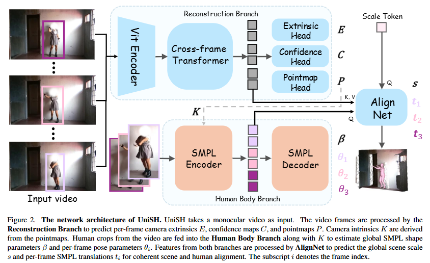

# UniSH: Unifying Scene and Human Reconstruction in a Feed-Forward Pass - CVPR 2026 (arXiv)

> **Arxiv ID**: 2601.01222v1

### 一、引言与核心问题

UniSH (Unified Scene and Human) 是一篇针对动态单目视频进行全场景4D重建的开创性工作。它旨在打破传统计算机视觉中“场景重建”与“人体网格恢复 (HMR)”各自为战的局面，提出了一个统一的前馈框架。该框架能够从一段单目视频中，同时恢复出具有公制尺度的3D场景点云、相机轨迹以及与场景对齐的、连贯的人体运动网格。

**论文试图解决的核心任务是什么？**

*   **输入 (Input)**:
    模型接收一段单目RGB视频作为输入。
    *   **数据形态**: $V \in \mathbb{R}^{B \times T \times 3 \times H \times W}$，其中 $B$ 为Batch size，$T$ 为视频帧数（通常切分为片段，如100帧），$H, W$ 为图像分辨率。
*   **输出 (Output)**:
    模型输出一个对齐的、具有绝对公制尺度的4D世界表征：
    *   **场景几何**: 每一帧对应的场景点云图 (Pointmaps) $P \in \mathbb{R}^{B \times T \times 3 \times H \times W}$ 和置信度图 $C$。
    *   **相机参数**: 每一帧的相机外参 $E \in SE(3)$ 和内参 $K$。
    *   **人体参数**: 全局统一的体型参数 $\beta \in \mathbb{R}^{10}$ 和每一帧的姿态参数 $\theta \in \mathbb{R}^{T \times D_{pose}}$ (SMPL参数)。
    *   **全局对齐**: 场景的绝对尺度因子 $s \in \mathbb{R}^1$ 和人体每一帧在世界坐标系下的平移向量 $t \in \mathbb{R}^{T \times 3}$。
*   **任务的应用场景**:
    这种联合重建技术是构建下一代交互系统的基石，广泛应用于增强现实 (AR)、虚拟现实 (VR)、具身智能 (Embodied AI) 以及协作机器人导航等领域，使机器能够理解人类与环境的物理交互。
*   **当前任务的挑战 (Pain Points)**:
    1.  **数据匮乏与Sim-to-Real鸿沟**: 现有的包含高质量场景、人体动作和相机参数的联合标注数据极为稀缺。研究者往往依赖合成数据 (如BEDLAM)，但这导致模型在真实世界视频 ("in-the-wild") 上的泛化能力极差，表现为场景几何失真和SMPL与场景的对齐错位。
    2.  **几何保真度低**: 通用的场景重建模型往往难以捕捉动态人体表面的高频细节，导致重建的人体表面模糊或平滑过度。
    3.  **优化方法的低效性**: 现有的联合重建方法 (如JOSH3R) 通常依赖于耗时的逐场景优化 (Test-time Optimization)，无法满足实时或大规模应用的需求。
*   **论文针对的难点**:
    UniSH 重点解决如何在缺乏真实世界联合标注的情况下，训练一个**前馈 (Feed-Forward)** 模型，不仅能实现公制尺度的场景-人体对齐，还能利用无标签视频大幅提升人体表面的几何重建细节。

### 二、核心思想与主要贡献

*   **直观动机与设计体现**:
    论文的直观动机在于“站在巨人的肩膀上”。既然现有的独立场景重建模型 (如 $\pi^3$) 和人体估计模型 (如 CameraHMR) 已经非常强大，为什么不利用它们作为强大的先验 (Priors)，并通过一个轻量级的桥梁将二者统一起来？UniSH 的设计正是基于这一思想，它不从头训练，而是通过一个名为 AlignNet 的模块融合两个专家分支的特征，并利用无标签数据进行自监督微调。
*   **与相关工作的比较与创新**:
    与 **JOSH3R** 等基于优化的方法相比，UniSH 是一个纯前馈网络，推理速度更快且全局一致性更好。与 **HuMSR** 或 **HMR-only** 方法相比，UniSH 不仅关注人体，还重建了稠密的场景几何，解决了人体“悬浮”或穿模的问题。最显著的创新在于其训练范式，它引入了一个“专家模型蒸馏”策略，利用单目深度估计专家 (MoGe-2) 来指导多视图重建模型学习人体的高频细节。
*   **核心贡献与创新点**:
    1.  **统一的前馈架构**: 提出了第一个能够在单次前向传播中联合恢复高保真场景点云、相机参数和公制尺度人体网格的框架。
    2.  **AlignNet 融合模块**: 设计了一个轻量级的 Transformer 解码器，有效地桥接了场景几何特征和人体特征，解决了单目视觉中的尺度歧义问题。
    3.  **基于无标签数据的训练范式**: 提出了一套包含“粗略定位”到“精细对齐”的两阶段监督方案，并结合深度专家蒸馏策略，有效利用海量野外视频提升了Sim-to-Real的泛化能力和几何精度。

### 三、论文方法论 (The Proposed Pipeline)

*   **整体架构概述**:
    UniSH 采用双分支结构：一个**重建分支 (Reconstruction Branch)** 负责恢复场景几何和相机位姿，一个**人体分支 (Human Body Branch)** 负责估计人体姿态和形状。这两个分支的特征被送入核心模块 **AlignNet**，后者预测全局场景尺度和人体平移，从而将独立的人体网格无缝集成到公制尺度的场景中。

*   **详细网络架构与数据流**:

    1.  **重建分支 (Reconstruction Branch)**:
        *   **设计**: 继承自 **$\pi^3$ (Pisces)** 架构。它使用 ViT-Large 作为 Backbone，提取图像特征。
        *   **核心模块**: **Cross-Frame Transformer**。这是一个包含36层的Transformer，特征在时间和空间维度上进行交替注意力机制 (Spatial and Global Self-Attention)，以聚合多视图信息。
        *   **输出**: 通过三个并行的 Head 分别预测：
            *   相机外参 $E$。
            *   场景点云图 (Pointmaps) $P$。
            *   置信度图 $C$。
        *   **形状变换**: 输入 $T$ 帧图像，输出 $T$ 个对应的点云图和相机参数。

    2.  **人体分支 (Human Body Branch)**:
        *   **设计**: 采用 **CameraHMR** 作为骨干。首先使用现成的检测器提取人体 Bounding Box $b_i$。
        *   **处理**: 将 Bounding Box、焦距 (来自重建分支) 和原图输入 ViTPose-Base 骨干网络。
        *   **输出**: 提取每帧的人体特征 $F_{hmr}$，并回归出共享的体型参数 $\beta$ 和每帧的姿态参数 $\theta_i$。
        *   **中间变量**: $F_{hmr}$ 是后续 AlignNet 的重要输入，蕴含了人体的语义和结构信息。

    3.  **AlignNet (桥接模块)**:
        *   **类型**: 2层 Transformer Decoder。
        *   **输入**:
            *   **Query**: 由一个可学习的尺度 Token $T_s$ 和人体分支特征 $F_{hmr}$ 拼接而成，即 $[T_s | F_{hmr}]$。
            *   **Key/Value**: 来自重建分支的几何特征 $F_{geo}$。
        *   **原理**: 该模块通过注意力机制，查询场景几何特征中与人体尺度和位置相关的信息。
        *   **输出**: 解码出全局场景尺度 $s$ 和每帧的人体平移向量 $T = \{t_i\}$。
        *   **作用**: 将归一化的相机空间人体网格转换到具有绝对尺度的世界坐标系中。

*   **训练策略与损失函数 (Loss Function)**:
    论文采用了一种**从粗到细 (Coarse-to-Fine)** 且利用**专家蒸馏**的训练策略，这是其性能超越基线的关键。

    1.  **阶段一 (Pre-training)**: 分别预训练重建分支和人体分支（利用已有权重）。
    2.  **阶段二 (Coarse Localization)**: 在合成数据 (BEDLAM) 上训练，进行粗略的定位学习。
    3.  **阶段三 (Fine-tuning on Real Data)**: 这是最关键的一步，直接在无标签野外视频上进行微调。
        
        *   **几何对齐损失 ($L_{align}$)**: 优化人体网格顶点 (SMPL vertices) 与重建的人体点云之间的距离。这迫使 SMPL 网格贴合重建出的点云表面。
        $$
		L_{align, i} = \sum_{v \in \mathcal{V}_{smpl}} \min_{p \in P_{human}} ||R_i(s \cdot v + t_i) - p||_2^2
        $$
        
        *   **深度排序正则化 ($L_{dreg}$)**: 约束重建的人体点云（前景）在深度上不能被 SMPL 网格遮挡（即点云应该在 SMPL 表面或更靠近相机的位置），防止 SMPL 模型“漂浮”在点云前方。
        $$
        L_{dreg, i} = \text{ReLU}(\bar{d}_{tgt, i} - \bar{d}_{src, i})
        $$
        *   **表面细节蒸馏 (Surface Refinement)**: 利用预训练的单目深度专家模型 **MoGe-2** 生成伪标签 (Pseudo-labels)。通过蒸馏 MoGe-2 的高频深度细节来细化重建分支的输出，使 UniSH 能够重建出衣服褶皱等精细结构，这是传统多视图几何方法难以做到的。
        *   **2D重投影损失 ($L_{j2d}$)**: 保证 3D 关节点投影回 2D 图像后与检测到的 2D 关键点一致。
    
*   **数据集 (Dataset)**:
    
    *   **合成数据**: BEDLAM (用于学习初始的公制尺度和粗略位置)。
    *   **真实数据**: 作者收集并筛选了一个大规模的**无标签野外舞蹈视频数据集** (1.2M 帧)。
    *   **评估数据**: Bonn (场景重建指标), EMDB-2, RICH (人体运动指标)。

### 四、实验结果与分析

*   **核心实验结果**:

    **1. 以人为中心的场景重建 (Bonn Dataset)**
    UniSH 在重建精度上显著优于基线方法，证明了其在动态场景下的鲁棒性。

    | 指标                           | DUSt3R | $\pi^3$ | VGGT  | **UniSH (Ours)** | **提升幅度**        |
    | :----------------------------- | :----- | :------ | :---- | :--------------- | :------------------ |
    | **Abs Rel** $\downarrow$       | 0.151  | 0.049   | 0.057 | **0.035**        | **~28% vs $\pi^3$** |
    | **$\delta < 1.25$** $\uparrow$ | 0.839  | 0.975   | 0.966 | **0.980**        | **SOTA**            |

    **2. 全局人体运动估计 (EMDB-2 / RICH)**
    虽然 UniSH 不是专为 HMR 设计的（它还要兼顾场景），但它在全局一致性指标上极具竞争力，甚至优于基于优化的 JOSH3R。

*   **消融研究解读**:
    *   **表面细化策略**: 表3显示，仅在合成数据 (BEDLAM) 上微调会导致性能下降 (Abs Rel 变差)，证实了 Sim-to-Real 的巨大鸿沟。而使用本文提出的“Real (Ours)”蒸馏策略，Abs Rel 达到最优，证明了利用无标签真实数据结合专家模型蒸馏的必要性。
    *   **AlignNet**: 实验证明 AlignNet 能有效预测尺度和平移，去掉该模块会导致严重的人体-场景错位。

*   **可视化结果分析**:
    论文展示了在野外视频上的重建效果。对比 $\pi^3$，UniSH 重建的人体点云明显更“像”人，保留了更多的体型特征；对比 MoGe-2，UniSH 保持了多帧之间的一致性（不会闪烁），同时拥有了接近 MoGe-2 的高频细节。在攀岩等复杂姿态下，SMPL 模型也能准确贴合墙壁几何。

### 五、方法优势与深层分析

*   **架构/设计优势**:
    *   **互补先验的融合**: UniSH 巧妙地结合了 $\pi^3$ 的**结构一致性** (Structural Consistency) 和 MoGe-2 的**局部高保真度** (Local High-fidelity)。$\pi^3$ 擅长恢复相机轨迹和稀疏几何，但对动态人体细节捕捉不足；MoGe-2 擅长单帧细节但缺乏全局一致性。UniSH 通过蒸馏将二者优点结合。
    *   **AlignNet 的隐式求解**: 传统方法通常需要通过复杂的 PnP 或优化算法来求解尺度和平移。AlignNet 将这一几何问题转化为一个特征匹配和回归问题，利用 Transformer 强大的上下文推理能力，从场景和人体的特征交互中直接推断出物理尺度。

*   **解决难点的思想与实践**:
    *   **解决 Sim-to-Real**: 传统的全监督训练受限于合成数据。UniSH 实际上采用了一种**自监督+蒸馏**的范式。它不依赖真实的 3D GT (这在野外数据中不存在)，而是依赖“几何一致性” (SMPL 需贴合 Point Cloud) 和“专家知识” (MoGe-2 的深度图) 作为监督信号。这种思想使得模型可以在无限的互联网视频上进行训练，从而获得强大的泛化能力。

### 六、结论与个人思考

*   **主要结论**:
    UniSH 成功展示了前馈网络在联合 4D 重建领域的潜力。通过合理的架构设计（双分支+AlignNet）和创新的训练策略（专家蒸馏+无标签自监督），它在无需昂贵优化的前提下，实现了 SOTA 级别的场景-人体联合理解。

*   **潜在局限性**:
    1.  **依赖专家模型**: 人体表面的重建质量很大程度上受限于教师模型 (MoGe-2) 的性能。如果 MoGe-2 在某些极端光照或遮挡下失效，UniSH 的精细度也会受损。
    2.  **动态背景处理**: 目前主要关注静态场景中的动态人体。如果背景本身也有大量动态物体（如行驶的车辆），场景重建分支可能会受到干扰，导致相机轨迹估计漂移。

*   **未来工作方向**:
    *   **端到端的全场景微调**: 目前人体分支和场景分支虽然联合推理，但在训练初期仍有独立预训练成分。未来可以探索完全端到端的联合训练，使场景线索反过来辅助人体姿态估计（例如，脚与地面的接触约束）。
    *   **向生成模型扩展**: 结合 3D Gaussian Splatting，将输出的点云升级为可渲染的 4D Gaussians，实现照片级真实的 4D 视频重绘。

*   **对个人研究的启发**:
    UniSH 证明了在缺乏 3D 标注的情况下，利用 2D 视频的一致性约束和 2.5D (深度图) 专家模型作为中间监督是非常有效的路径。这对于其他缺乏 3D GT 的领域（如动物重建、手物交互）具有很强的借鉴意义——即**不要强求 3D GT，而是去构造几何与物理约束**。