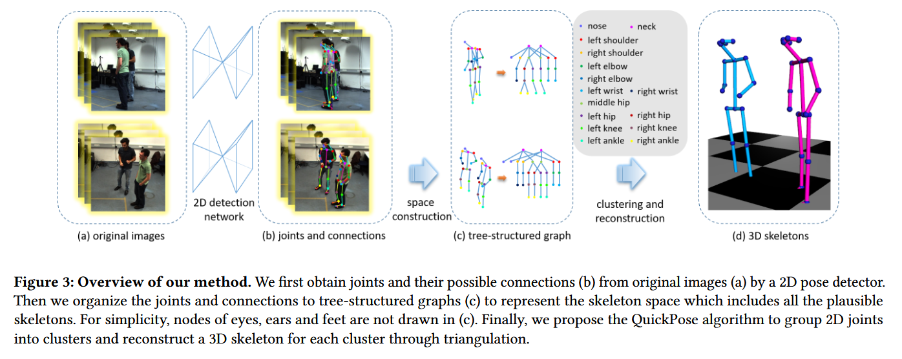

# 论文笔记: QuickPose: Real-time Multi-view Multi-person Pose Estimation in Crowded Scenes - SIGGRAPH 2022

### 一、引言与核心问题

本研究聚焦于计算机视觉和图形学中的一个关键问题：在拥挤场景下，如何利用多个同步且已标定的摄像机视角，实时、准确地重建出场景中所有人的三维（3D）姿态。这项技术（常被称为Multi-view Multi-person Pose Estimation, MMPE）是许多下游应用的基础，例如体育赛事转播中的运动分析、电影和游戏中的角色动画制作、人机交互以及虚拟现实/增强现实中的数字化身驱动等。

*   **论文试图解决的核心任务是什么？**
    *   **输入 (Input)**:
        1.  **原始输入**: 来自N个已标定且同步的摄像机的多视角视频流。数据形态为 `[N_views, T_frames, Height, Width, Channels]`。
        2.  **算法直接输入**: 论文的方法属于两阶段范式，其核心算法的输入是第一阶段（2D姿态检测）的输出结果。具体来说，是来自每个视角的2D关节点（joints）和肢体连接（connections）的检测结果。这些结果通常由现成的2D姿态检测器（如OpenPose）生成，包含了每个检测到的关节点的位置 `(x, y)` 及其置信度，以及关节点之间的连接关系。
    *   **输出 (Output)**: 场景中M个被检测到的人的3D骨骼姿态序列。对于每一帧，输出可以表示为一个列表，其中每个元素是一个人的3D骨骼，其数据维度可表示为 `[M_persons, K_joints, 3]`，其中K是骨骼模型的关节点数量，3代表 `(X, Y, Z)` 坐标。
    *   **任务的应用场景**: 体育转播、人机交互、游戏和电影的角色动画、虚拟现实、行为分析。
    *   **当前任务的挑战 (Pain Points)**:
        1.  **匹配歧义性**: 核心挑战在于如何跨越多个视角，将属于同一个人的2D身体观测（关节点或肢体）正确地匹配（或聚类）在一起。在拥-挤场景中，由于严重的遮挡和深度歧义，这个问题变得尤为棘手。
        2.  **方法论的困境**: 已有方法通常陷入两难境地。
            *   **身体级别 (Body-level) 匹配**: 此类方法先在每个2D视图中组装出完整的2D人体骨骼，然后跨视图匹配这些完整的骨骼。这种方法的优点是利用了完整的身体结构约束，匹配的元素少，速度可能较快。但其致命弱点是对2D检测的完整性和准确性要求极高。一旦某个人的2D骨骼因为遮挡而检测不全或出错，整个匹配就会失败，导致该人无法被重建，方法非常“脆弱”。
            *   **部件级别 (Part-level) 匹配**: 此类方法将2D检测结果分解为独立的身体部件（如手臂、腿等），然后跨视图匹配这些部件，最后再将匹配好的3D部件组装成完整的人体。这种方法对遮挡的鲁棒性更好，因为即使身体部分被遮挡，未被遮挡的部件仍可能被成功重建。但其缺点是忽略了同一视图内、同一人身上的不同部件之间的几何约束，导致匹配的歧义性大大增加，计算复杂度也随着人数和部件数量急剧上升。
    *   **论文针对的难点**: 本文旨在解决上述“身体级别”和“部件级别”匹配方法之间的根本矛盾。它试图设计一种新范式，既能像部件级方法一样对遮挡具有鲁棒性，又能像身体级方法一样利用身体内部的结构约束来降低匹配的歧义性，并最终实现实时处理。

### 二、核心思想与主要贡献

*   **直观动机与设计体现**:
    本文的直观动机是：在进行跨视图匹配时，我们不应该被强制要求要么匹配“完整的骨骼”，要么匹配“孤立的部件”。一个更合理的选择是，任何在2D视图中看起来“合理”的骨骼片段（无论它是一个单独的关节点，一个肢体，还是一个不完整的半身骨架），都应该被视为一个有效的匹配候选对象。
    这一动机直接体现在其核心技术设计上：论文提出了一个“**骨骼提案空间 (skeleton proposal space)**”的概念。这个空间包含了所有可能的、合理的2D骨骼片段（从单个关节点到完整骨骼）。然后，论文将多视图匹配问题重新定义为在这个高维、离散的空间中进行“**模式搜索 (mode seeking)**”，即寻找由来自不同视图、但在几何上高度一致的骨骼提案所组成的密集区域（cluster），每一个这样的密集区域就对应着一个真实存在的人。

*   **与相关工作的比较与创新**:
    本文与先前所有的两阶段MMPE工作都相关，但它创新性地提出了一种介于“身体级别”和“部件级别”之间的**混合匹配方案**。
    *   相较于**身体级别**匹配（如 Dong et al. [2019]），QuickPose不要求2D骨骼必须是完整的，从而通过考虑不完整的“骨骼提案”来处理遮挡，鲁棒性更强。
    *   相较于**部件级别**匹配（如 Zhang et al. [2020]），QuickPose在匹配时不处理孤立的部件，而是处理具有内部连接约束的“骨骼提案”，这保留了2D视图内的结构信息，极大地降低了匹配的歧义性。

*   **核心贡献与创新点**:
    1.  **新的问题范式**: 首次将多视图多人姿态估计问题，构建为一个在“骨骼提案空间”中进行模式搜索（mode seeking）的问题。这个新范式巧妙地统一了身体级别和部件级别方法的优点。
    2.  **高效的聚类算法 (QuickPose)**: 设计了一种名为QuickPose的高效聚类算法，它是QuickShift算法的一个变体，专门用于在骨骼提案空间中快速寻找密度峰值。该算法通过精心设计的树状数据结构和密度递增策略，实现了对海量骨骼提案的实时处理。
    3.  **SOTA的性能**: 实验证明，该方法在多个公开数据集上，无论是在处理速度还是重建精度方面，都达到了当时的业界领先水平（state-of-the-art）。

### 三、论文方法论 (The Proposed Pipeline)

*   **整体架构概述**:
    
    整个流程如图3所示，是一个清晰的两阶段流水线。首先，将来自多个摄像机的同步图像输入到一个标准的2D姿态检测网络（如OpenPose）中，得到每个视图中所有可能的2D关节点和肢体连接。接着，进入QuickPose的核心阶段：1) **空间构建**：将每个视图的2D检测结果组织成一个树状图，这个图隐式地定义了包含所有“骨骼提案”的搜索空间。2) **聚类与重建**：运行QuickPose算法，在该空间中搜索并聚类出分属于不同人的、跨视图一致的骨骼提案集合。最后，对每个聚类结果（代表一个人)中的2D关节点进行三角化，重建出最终的3D骨骼姿态。
    
*   **详细网络架构与数据流**:
    该方法的核心不是一个端到端的深度网络，而是一个基于几何的聚类算法。
    
    1. **数据预处理 (2D检测)**:
       *   **输入**: 多视图图像 `[N_views, H, W, C]`。
       *   **模块**: OpenPose [Cao et al. 2019]。
       *   **输出**: 每个视图的2D关节点和肢体连接集合。
    
    2. **骨骼提案空间构建**:
    
       *   **数据结构**: 对于每个视图 `v`，将检测到的关节点作为节点，肢体作为边，构建一个**树状图 `G_v`**。这个图的巧妙之处在于，图中的任意一个连通子图都构成一个“骨骼提案”。例如，一个节点是提案，一条边连接两个节点是提案，一个由多个肢体连接成的半身也是提案。这里并不生成所有显示的提案，而是用树状图+邻近搜索来表示整个空间提案空间。
       *   **数据流**: 这一步是将无结构的2D检测点集，转化为一种便于高效搜索邻近提案（例如，在现有提案上增加一个相连的关节点）的结构化表示。
    
    3. **QuickPose聚类算法**:
    
       
    
       *   **核心机制**: 模式搜索（Mode Seeking）。算法从一个最简单的提案（如单个根关节点）开始，形成一个初始聚类（cluster）。
       *   **迭代扩展 (Shift)**: 算法迭代地尝试将聚类中的某个骨骼提案 `x` “移动”到其邻居（即在 `G_v` 中与 `x` 相连、多一个关节点的提案）。
       *   **决策依据**: 是否执行“移动”的决策，取决于移动后的新聚类密度 `p(s)` 是否增加。密度 `p(s)` 是通过一个**亲和度函数 (Affinity Function)** 来计算的。
       *   **形状变换**: 在这个阶段，数据从独立的树状图 `G_v`，被组织成多个聚类 `s`。每个聚类 `s = {x^v1, x^v2, ...}` 是一个集合，包含了来自不同视图 `v1, v2, ...` 且被认为属于同一个人的骨骼提案。
    
    4. **3D重建**:
       *   **模块**: 对每个最终聚类中的关节点进行简单的三角测量（Triangulation）。
       *   **输出**: 最终的3D姿态 `[M_persons, K_joints, 3]`。
    
*   **损失函数 (Loss Function)**:
    严格来说，QuickPose算法本身没有一个在训练中优化的损失函数，因为它是一个几何聚类算法而非深度学习模型。其优化的目标函数是**聚类密度 `p(s)`**，该密度函数的设计是方法的关键。
    
    *   **设计理念**: 聚类密度 `p(s)` 被定义为该聚类中所有骨骼提案两两之间亲和度的总和。
        $$
        p(s) = \sum_{x^{v_1} \in s} \sum_{x^{v_2} \in s} \phi(x^{v_1}, x^{v_2})
        $$
    *   **亲和度函数 `φ`**: 两个骨骼提案 `x^v1` 和 `x^v2` 之间的亲和度 `φ` (Eq. 2) 是它们共有的、同类型关节点之间亲和度 `α` 的总和。
    *   **关节点亲和度 `α`**: 两个来自不同视图的同类型2D关节点 `d_j^v1` 和 `d_j^v2` 之间的亲和度 `α` (Eq. 1) 基于它们的**对极几何约束**。具体来说，它衡量的是从两个相机中心出发、穿过这两个2D点的两条射线在3D空间中的最短距离。距离越近，亲和度越高。
    *   **关注重点**: 这个密度函数本质上是在衡量一个假设（即聚类s中的所有2D提案都属于同一个人）的几何一致性。一个好的聚类，其内部所有提案都应该在3D空间中高度吻合，从而得到很高的总亲和度（密度）。
    
*   **数据集 (Dataset)**:
    *   **所用数据集**: 论文在多个公开基准上进行了评估，包括 **Shelf**, **CMU Panoptic**, 和 **4DA (4D Association)**。此外，他们还自己采集了一个新的 **Basketball** 数据集用于展示真实场景的应用。
    *   **特殊处理**: 论文遵循了各个数据集标准的评估协议，没有提及对数据集进行特殊的处理。

### 四、实验结果与分析

*   **核心实验结果**:
    论文在精度和速度上都展示了卓越的性能。以Shelf数据集为例，其结果远超当时的其他方法。

    | 指标 (Shelf Dataset) | Tanke and Gall [2019] | Dong et al. [2019] | Tu et al. [2020] | **本文方法 (Ours)** |
    | -------------------- | --------------------- | ------------------ | ---------------- | ------------------- |
    | Avg. PCP (%)         | 96.0                  | 96.9               | 97.0             | **98.1**            |
    | Time (ms)            | N/A                   | 90                 | 333              | **2.94**            |

    *解读*: 从表中可见，QuickPose不仅在平均正确部件百分比（PCP）上取得了最高的精度（98.1%），其处理速度（2.94ms）更是比其他方法快了1-2个数量级，真正实现了实时性。

*   **消融研究解读**:
    论文在Panoptic数据集上进行了消融研究（Table 3），分析了相机数量和场景中人数对性能的影响。
    *   **相机数量**: 随着相机数量从4增加到20，重建精度（PCP, MPJPE）稳步提升，这符合多视图几何的直觉（更多的视图提供了更强的约束）。但处理时间也随之增加，论文提到时间成本与视图数的平方相关。
    *   **人数**: 随着人数增加，处理时间的增长率相对平缓。这证明了该算法对拥挤场景的良好扩展性，是其核心优势之一。

*   **可视化结果分析**:
    *   **对比身体级方法 (Fig. 7)**: 在与Dong et al. [2019]的比较中，当一个坐着的人因严重遮挡导致2D检测器无法提取完整骨骼时，身体级方法失败了。而QuickPose由于能够匹配不完整的骨骼提案，成功地重建出了一个正确（尽管不完整）的3D姿态。
    *   **对比部件级方法 (Fig. 8)**: 在与Zhang et al. [2020]的比较中，部件级方法由于只考虑孤立部件，有时会陷入次优解，导致重建出不自然的姿态。而QuickPose因为其提案保留了内部连接，能够重建出更连贯、更准确的骨骼。

### 五、方法优势与深层分析

*   **架构/设计优势**:
    1.  **鲁棒性与精确性的统一**: QuickPose的核心优势在于其“骨骼提案”的设计。它不像身体级方法那样脆弱，因为它允许提案是不完整的，从而天然地适应了遮挡。同时，它又不像部件级方法那样充满歧义，因为每个提案（只要包含超过一个关节点）都保留了身体内部的2D结构约束（保留了部件之间置信度高的连接），这为跨视图匹配提供了更强、更可靠的线索。
    2.  **效率**: 尽管骨骼提案空间巨大，但通过将其组织成树状图，并采用高效的模式搜索算法（QuickPose），使得搜索过程变得可行且快速。算法只在有希望增加密度的方向上进行扩展，避免了全局的暴力搜索。

*   **解决难点的思想与实践**:
    论文解决MMPE核心难点的思想是“**化繁为简，分而治之**”的升华。它没有在“整体”和“部分”之间做非此即彼的选择，而是提出了一种更通用的表示——“提案”。这个思想的实践体现在：
    *   **在表示上**: 定义了“骨骼提案”这一灵活的中间表示。
    *   **在算法上**: 将匹配问题转化为一个定义良好、可高效求解的“模式搜索”问题。
    *   **在目标上**: 设计了基于对极几何的亲和度函数，为模式搜索提供了清晰的优化目标（最大化聚类密度）。

### 六、结论与个人思考

*   **论文的主要结论回顾**:
    本文提出了一种名为QuickPose的实时多视图多人3D姿态估计算法。通过将匹配问题创新性地构建为在“骨骼提案空间”中的模式搜索任务，该方法成功地结合了身体级匹配的精确性和部件级匹配的鲁棒性，在多个基准上实现了速度和精度的双重领先。

*   **潜在局限性**:
    1.  **依赖2D检测器**: 作为两阶段方法，其性能上限受制于上游2D姿态检测器的质量。如果2D检测器漏检或产生大量错误检测，QuickPose也无能为力。
    2.  **时间复杂性**: 尽管很快，但论文指出其时间复杂度与视图数量的平方相关，当相机数量非常庞大时（如上百个），实时性可能会成为挑战。
    3.  **缺乏时序信息**: 该方法是逐帧处理的，没有利用时序信息来平滑结果或处理短期遮挡，导致输出的3D姿态序列可能存在抖动。

*   **未来工作方向**:
    1.  **优化大规模视图下的效率**: 针对超多相机系统，研究更高效的聚类或搜索剪枝策略。
    2.  **融合时序信息**: 将QuickPose与跟踪算法结合，或在密度函数中引入运动先验，以生成更稳定、更连贯的动作序列。
    3.  **端到端学习**: 探索是否可以将这种基于几何的聚类思想，以可微分的方式融入到端到端的深度学习框架中。

### 七、代码参考与分析建议

*   **仓库链接**: [https://github.com/zju3dv/QuickPose](https://github.com/zju3dv/QuickPose)
*   **核心模块实现探讨**: 建议读者查阅作者提供的代码，重点关注以下模块的实现，以深入理解其工作原理：
    1.  **`QuickPose`算法**: 核心的聚类逻辑，特别是如何迭代地“shift”和更新聚类，以及如何维护多个有潜力的聚类分支。
    2.  **数据结构**: 用于表示“骨骼提案空间”的树状图是如何构建和遍历的。
    3.  **亲和度计算**: 关节点和骨骼提案之间亲和度函数（Affinity Function）的具体实现，这部分是算法决策的核心。