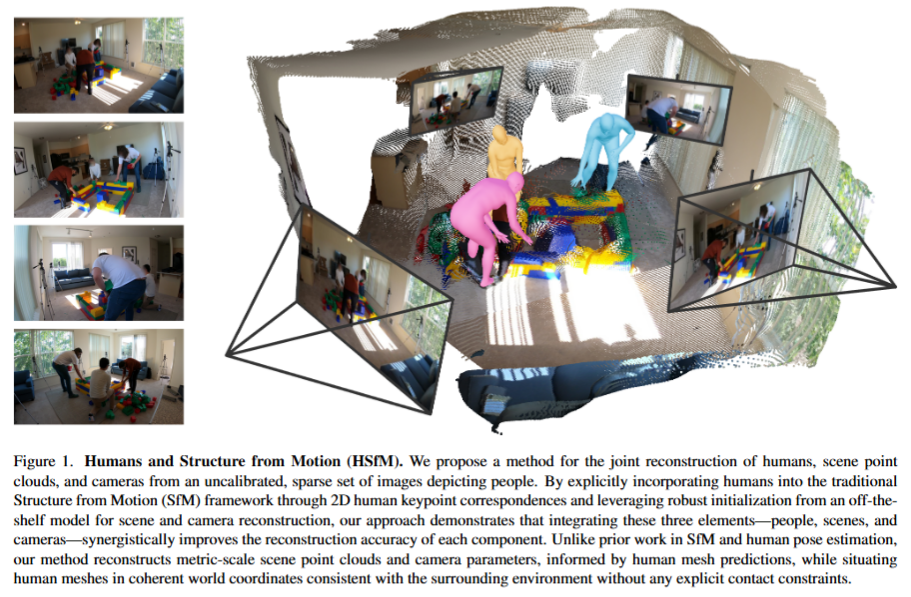
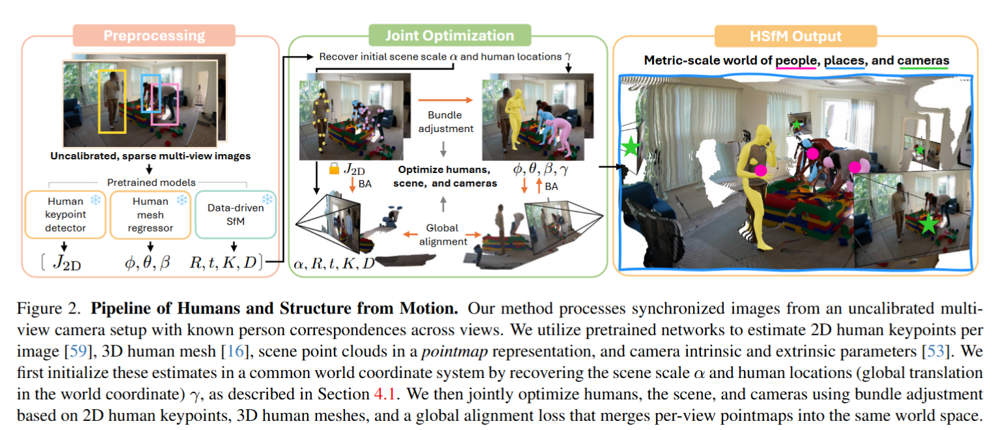
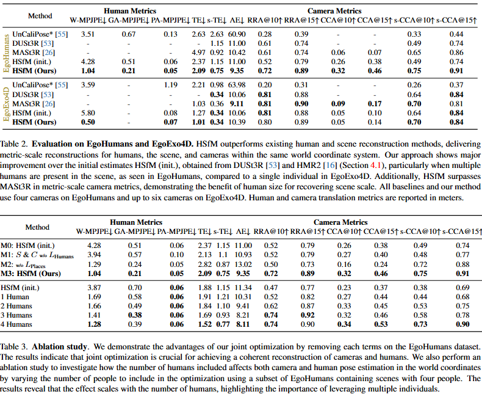

# Reconstructing People, Places, and Cameras - CVPR 2025

> **Paper**: [arXiv:2412.17806](https://arxiv.org/abs/2412.17806)
> **Code**: [GitHub - hongsukchoi/HSfM_RELEASE](https://github.com/hongsukchoi/HSfM_RELEASE)

### 一、引言与核心问题

在计算机视觉与图形学领域，**三维人体重建 (Human Mesh Recovery, HMR)** 与 **运动恢复结构 (Structure from Motion, SfM)** 长期以来是两个平行发展的子领域。传统的SfM技术（如COLMAP）擅长重建静态场景和相机轨迹，但在处理非刚性物体（如人）时往往表现不佳，且重建结果缺失真实的物理尺度（Metric Scale）。反之，基于深度学习的HMR方法虽然能从单图中恢复人体网格，但通常缺乏场景上下文，导致重建的人体在世界坐标系中“漂浮”或发生滑步，无法正确反映人与人、人与场景的空间关系。

**本文 (HSfM) 试图解决的核心任务是**：在无标定、稀疏视角（Sparse View）的输入条件下，**联合重建**具有真实物理尺度的多个人体网格、静态场景几何以及相机参数。

*   **输入 (Input)**:
    *   一组稀疏的RGB图像 $I = \{I_1, ..., I_N\}$，通常由未经标定的相机拍摄（例如不同手机拍摄的一组照片）。
    *   图像尺寸通常为 $[H, W, 3]$。
    *   假设已通过预处理（如Grounded-SAM-2）完成了跨视角的人员重识别（Re-ID）。

*   **输出 (Output)**:
    *   **相机参数**: $N$个视角的内参 $K \in \mathbb{R}^{3 \times 3}$ 和外参 $R \in SO(3), t \in \mathbb{R}^3$（具有真实米制尺度）。
    *   **人体网格**: $M$个个体的SMPL-X参数，包括体型 $\beta \in \mathbb{R}^{10}$、姿态 $\theta \in \mathbb{R}^{J \times 3}$、全局位移 $\gamma \in \mathbb{R}^3$ 和旋转 $\phi \in SO(3)$。
    *   **场景几何**: 每个视角的致密点云图 (Pointmaps) $P \in \mathbb{R}^{N \times H \times W \times 3}$，对齐在统一的世界坐标系下。

*   **当前任务的挑战 (Pain Points)**:
    1.  **尺度模糊性 (Scale Ambiguity)**: 单目或未标定SfM只能恢复“相对尺度”，无法得知场景的真实大小（是一只猫的大小还是通过建筑物的大小？）。
    2.  **非刚性困境**: 传统的SfM假设场景是静态刚体，人体作为动态前景通常被视为噪声被剔除，导致无法利用人体信息来辅助相机标定。
    3.  **空间一致性缺失**: 现有的HMR方法通常在相机坐标系下预测，直接拼接多视角结果会导致人体在3D空间中位置错乱、穿模或浮空。

*   **论文针对的难点**: 本文旨在打破人与场景的隔阂，利用人体先验（统计学上的身高体型）作为“尺子”来恢复场景的绝对尺度，同时利用场景的刚性结构作为“锚点”来校准人体的位置，实现互利共赢的联合优化。

### 二、核心思想与主要贡献

*   **直观动机与设计体现**:
    *   **“人是天然的尺子”**: 深度学习模型（如HMR2.0）在大规模3D人体数据上训练，隐式地记住了人类的统计学尺寸。如果我们将SfM重建的场景与HMR重建的人体对齐，就可以利用人体的尺寸将整个场景“拉伸”到真实的米制尺度。
    *   **“场景是天然的锚点”**: 场景的静态结构提供了强大的多视角几何约束。通过强制所有视角下的场景点云一致，可以反过来修正相机的位姿，从而得到更准确的人体全局位置。

*   **与相关工作的比较与创新**:
    *   对比 **UnCaliPose** 等工作：前者仅利用人体关键点进行SfM，忽略了背景信息，导致在少人或人体静止时极其不稳定。HSfM引入了致密的场景点云（Pointmaps），提供了更鲁棒的相机约束。
    *   对比 **DUSt3R/MASt3R**：这些最新的Dense SfM方法虽然能重建场景，但缺乏物理尺度，且无法处理动态人体。HSfM将DUSt3R的场景表征与SMPL-X人体模型结合，填补了这一空白。

*   **核心贡献**:
    1.  提出了 **HSfM (Humans and Structure from Motion)**，这是首个在无标定稀疏视角下联合优化人、场景和相机的框架。
    2.  设计了一套基于数据驱动先验的**初始化策略**，利用HMR预测的人体估算初始相机位姿和场景尺度，解决了联合优化的冷启动问题。
    3.  通过在EgoHumans和EgoExo4D数据集上的实验，证明了联合优化不仅大幅提升了人体定位精度（误差降低约3.5倍），同时也反哺了相机位姿估计的准确性。

### 三、论文方法论 (The Proposed Pipeline)

本文采用“初始化-联合优化”的两阶段策略。首先利用预训练大模型分别获取人体和场景的初始估计，然后通过构建一个包含多项约束的优化问题，端到端地微调所有参数。

#### 1. 预处理与初始化 (Initialization)

数据首先经过一系列预训练模型的处理，为优化提供初值：

*   **人体分支**:
    *   使用 **Grounded-SAM-2** 进行人员检测和分割，获取BBox和Mask。
    *   使用 **ViTPose** 提取2D关键点 $J_{2D} \in \mathbb{R}^{J \times 3}$ (含置信度)。
    *   使用 **HMR2.0** 预测每张图的人体SMPL参数。
    *   *关键初始化逻辑*: 由于HMR2.0预测是单目的，它隐含了真实的米制尺度（Metric Scale）。算法利用多视角下对应人体的2D投影误差，解算出一个初始的全局位移和相机外参。

*   **场景分支**:
    *   使用 **DUSt3R** 网络推理每张图的点云图 (Pointmaps) 和相对相机位姿。
    *   *尺度对齐 (Scale Alignment)*: DUSt3R输出是相对尺度的。代码中通过构建最小二乘问题 $Ax=b$，计算一个缩放因子 $\alpha$，将DUSt3R的相机轨迹与由HMR推导出的米制相机轨迹对齐。这一步至关重要，它将场景“拉伸”到了真实世界尺寸。

#### 2. 联合优化网络 (Joint Optimization)

这是一个基于梯度的**测试时优化 (Test-Time Optimization)** 过程，而非训练一个通用的推理网络。

*   **优化变量**:
    *   **场景**: DUSt3R的点云图 $P$（通过优化其Decoder的Latent或直接优化点云，代码实现中实际是调用DUSt3R的`GlobalAligner`进行微调）。
    *   **人体**: SMPL-X参数 $\{\theta_h, \beta_h, \gamma_h, \phi_h\}$。
    *   **相机**: 修正后的全局缩放因子 $\alpha_{res}$ 和相机外参。
    *   *注意*: 代码中分三个阶段 (Stage) 逐步释放变量的梯度，先优化全局位置和体型，最后优化精细姿态。

*   **损失函数 (Loss Function)**

    总损失 $L = \lambda_{human} L_{human} + \lambda_{scene} L_{scene}$

    1.  **人体重投影损失 ($L_{human}$)**:
        *   **形式**: $\sum_{c,h,j} w_{c,h,j} || \Pi(K_c, R_c, t_c, J_{3D}^{(h)}) - J_{2D}^{(c,h)} ||^2$
        *   **含义**: 将优化后的SMPL-X 3D关节 $J_{3D}$ 投影回每个相机视角，计算其与ViTPose提取的2D关键点 $J_{2D}$ 的L2距离。
        *   **细节**: 权重 $w$ 结合了关键点置信度。代码中对脚部等关键部位有额外的加权，以减少滑步。

    2.  **场景全局对齐损失 ($L_{scene}$)**:
        *   **形式**: 直接复用DUSt3R的 `global_aligner` 损失。
        *   **原理**: 强制不同视角下，对应像素点的3D投影在世界坐标系中重合。这实际上充当了传统的 **光束法平差 (Bundle Adjustment, BA)** 的角色，但作用于致密点云而非稀疏特征点。

#### 3. 形状变化 (Shape Transformation)

*   **SMPL-X Layer**: 输入 $\theta (1 \times 63), \beta (1 \times 10)$ $\rightarrow$ 输出 Vertices $(10475 \times 3)$, Joints $(144 \times 3)$。
*   **投影变换**: Joints $(N \times J \times 3) \xrightarrow{R, t} (N \times J \times 3) \xrightarrow{K} (N \times J \times 2)$。

### 四、实验结果与分析

#### 1. 核心实验结果 (EgoHumans & EgoExo4D)

*   **解读**: 
    *   **W-MPJPE** 的大幅下降（3.51m $\rightarrow$ 1.04m）证明了联合优化成功地将人体从“乱飞”的状态拉回了正确的世界位置。
    *   **相机精度提升**: 相比于纯场景重建方法（DUSt3R），引入人体约束后，相机参数（特别是平移误差TE）得到了显著改善。这证明了人体确实起到了“几何锚点”的作用。

#### 2. 消融研究 (Ablation Study)

*   **去除 $L_{scene}$**: 相机指标显著下降（CCA@15 降低约37%）。说明如果没有场景约束，仅靠人体关键点无法稳定求解相机参数，容易过拟合。
*   **去除 $L_{human}$**: 人体位置误差回升，且无法恢复真实尺度。说明人体是提供Metric Scale的唯一来源。
*   **初始化的重要性**: 如果不进行基于人体的尺度初始化（即设 $\alpha=1$），优化极易陷入局部最优，导致重建失败。

### 五、方法优势与深层分析

1.  **Synergy（协同效应）的数学本质**:
    *   HSfM 实际上是在解一个带约束的 **非线性最小二乘问题**。
    *   **场景项** 提供了高频的、刚性的几何约束，限制了相机 $R, t$ 的解空间，防止相机“漂移”。
    *   **人体项** 提供了低频的、语义的尺度约束，锁定了全局缩放因子 $\alpha$ 和人体的全局位移 $\gamma$。
    *   两者的结合消除了单目重建中的尺度自由度 (Scale Ambiguity) 和SfM中的结构模糊性。

2.  **鲁棒的初始化策略**:
    *   直接优化是一个非凸问题，极易发散。论文巧妙地利用了现有的SOTA模型（HMR2, DUSt3R）作为强大的初值猜测器。
    *   代码中的 `align_world_env_and_smpl_hsfm_optim.py` 展示了如何通过解析解（最小二乘法）在优化前先粗略对齐两个坐标系，这是一种非常工程化但极其实用的技巧 (Procrustes Analysis 思想的变体)。

### 六、结论与个人思考

*   **结论**: HSfM 成功证明了在野外无标定环境下，通过联合优化人、场景和相机，可以实现具有真实物理尺度的高精度3D重建。它打破了HMR和SfM的界限，为具身智能、AR/VR等需要理解“人-场景交互”的领域提供了新的范式。

*   **潜在局限性 (Limitations)**:
    *   **依赖静态场景**: 方法假设背景是刚性静态的。如果背景中有大量移动物体（如车流），DUSt3R的假设可能失效。
    *   **推理速度**: 由于是测试时优化 (Test-Time Optimization)，每处理一组图像都需要运行数千次迭代的梯度下降，速度远慢于前馈网络，难以实时运行。
    *   **Re-ID 依赖**: 严重依赖上游的Re-ID质量。如果多视角下的人员ID匹配错误，优化会直接崩溃。

*   **对个人研究的启发**:
    *   **跨模态约束的价值**: 本文的核心在于利用“语义先验”（人体身高）去约束“几何计算”（SfM）。这种思路可以扩展到其他对象，例如利用车、门窗等具有统计尺寸先验的物体来辅助SLAM或重建。
    *   **Foundational Model as Initialization**: 随着基础模型（如SAM, DUSt3R）的变强，未来的3D任务可能不再是从零训练，而是如何设计更好的优化能量函数，将这些大模型的输出“缝合”在一起。
