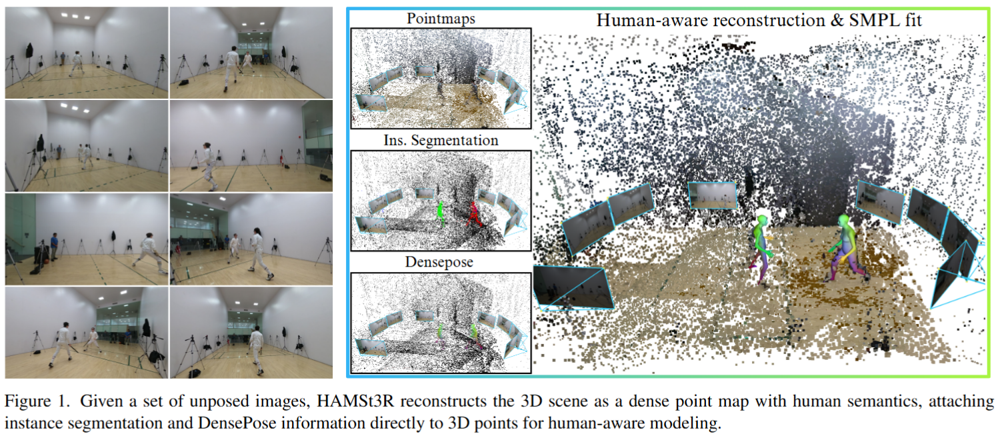
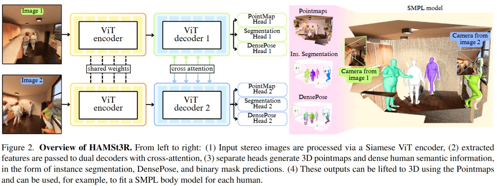

# HAMSt3R: Human-Aware Multi-view Stereo 3D Reconstruction - [Arxiv_2025]

> **Paper**: [2508.16433](https://arxiv.org/abs/2508.16433)

### 一、引言与核心问题

在计算机视觉与图形学领域，从稀疏的未校准图像中恢复场景的3D几何结构一直是一个经典且极具挑战性的问题。近年来，以DUSt3R和MASt3R为代表的基于学习的方法通过直接回归密集场景几何，展现出了超越传统SfM（Structure-from-Motion）管线的潜力。然而，这些方法主要在静态的室外场景（如建筑物）上进行训练，缺乏对“人”这一高度关节化（Articulated）、非刚性且常发生自遮挡的对象的理解。当场景中出现人物时，通用重建模型往往会产生几何扭曲或不完整的点云，无法有效捕捉人体结构。另一方面，专门的人体网格恢复（HMR）方法通常忽略环境背景，或者依赖极其复杂的迭代优化流程来融合人与场景。

**核心任务与输入输出**
HAMSt3R 旨在解决上述割裂问题，提出了一种端到端的联合重建方案。
*   **输入 (Input)**: 模型接收一对未校准的RGB图像作为输入，记为 $I_0, I_1 \in \mathbb{R}^{H \times W \times 3}$。在实际处理中，图像会被缩放至例如 518 像素的长边分辨率，并组成 Batch 输入。
*   **输出 (Output)**: 模型输出包含丰富的几何与语义信息：
    1.  **3D点图 (Pointmaps)**: $X \in \mathbb{R}^{H \times W \times 3}$，表示像素对齐的绝对3D坐标。
    2.  **实例分割掩码 (Instance Segmentation)**: 用于区分人与背景。
    3.  **DensePose 映射**: $P_{dp} \in \mathbb{R}^{H \times W \times 3}$，将图像像素映射到人体表面（SMPL模型）的UV坐标系中。
    4.  **DensePose 掩码**: $M \in \mathbb{R}^{H \times W}$，指示哪些区域是有效的人体表面。
*   **应用场景**: 该技术可广泛应用于增强现实（AR）、人机交互、机器人导航以及电影特效制作中的动作捕捉与环境重建。

**痛点与难点 (Pain Points)**
当前任务面临的主要挑战在于**几何与语义的鸿沟**。通用的3D重建模型（如MASt3R）缺乏人体先验，将人视为普通静态物体，导致重建失败；而传统的联合优化方法（如HSfM, JOSH）通常是非端到端的，它们依赖于离线检测器、迭代的Bundle Adjustment和复杂的优化策略，计算成本极高（单帧处理可能需数分钟），难以满足实时或大规模应用需求。HAMSt3R 试图通过引入强语义先验和多任务学习，在一个纯前馈（Feed-forward）网络中解决这一难题。

### 二、核心思想与主要贡献

**直观动机与设计体现**
本研究的直观动机在于：**若要重建好“人”，模型必须先“理解”人。** 仅仅依靠几何回归是不够的，模型需要具备区分“人”与“背景”的能力，并理解人体表面的拓扑结构。因此，HAMSt3R 并没有从零开始训练，而是利用了知识蒸馏（Knowledge Distillation）的思想，集成了一个既懂场景又懂人体特征的强编码器（DUNE），并通过增加特定任务头（Task Heads）来强制网络学习人体语义。

**与相关工作的比较**
该工作直接构建在 **MASt3R** 架构之上。与并发工作 **HSfM** 和 **JOSH** 相比，HAMSt3R 的最大创新在于摒弃了繁琐的测试时优化（Test-time Optimization）。HSfM 需要先运行DUSt3R，再运行HMR，最后通过全局优化融合两者；而 HAMSt3R 将这一切整合进单一网络的前向传播中，实现了效率的质的飞跃。

**核心贡献**
1.  **首个前馈式联合重建架构**: 提出了扩展自MASt3R的统一架构，能够在单次前向传播中同时输出场景几何、人体分割和DensePose信息。
2.  **语义增强的编码器策略**: 利用 DUNE 编码器，融合了通用视觉（DINOv2）、人体恢复（Multi-HMR）和3D重建（MASt3R）的特征表示。
3.  **大规模合成数据集构建**: 构建了包含52万张图像的混合数据集，结合了Infinigen的程序化场景生成和HumGen3D的人体生成，解决了此类任务数据稀缺的问题。

### 三、论文方法论 (The Proposed Pipeline)

#### 1. 整体架构概述

HAMSt3R 采用了孪生网络（Siamese Network）结构。两张输入图像分别经过共享权重的 ViT 编码器提取特征，随后进入带有交叉注意力机制（Cross-Attention）的双解码器进行交互，隐式地完成立体匹配。最后，解码出的特征被送入多个并行的预测头（Heads），分别负责几何重建、分割和人体姿态估计。

#### 2. 详细网络架构与数据流

*   **图像编码器 (The Strong Encoder)**:
    *   **模块设计**: 采用 ViT-B/14 架构。关键在于其权重并非随机初始化或仅在ImageNet上预训练，而是来自于 **DUNE** (Distilled UNiversal Encoder)。DUNE 通过蒸馏三个“老师”模型（DINOv2, Multi-HMR, MASt3R）的知识，使其输出的特征图 $F \in \mathbb{R}^{h \times w \times d}$ 兼具语义理解、人体结构感知和几何匹配能力。
    *   **处理策略**: 在训练过程中，该编码器是**冻结（Frozen）**的，以保留蒸馏得到的鲁棒特征。

*   **解码器 (Cross-Attention Decoder)**:
    *   **数据流**: 编码后的特征 $F_0, F_1$ 进入双路解码器。解码器层包含自注意力（Self-Attention）和交叉注意力（Cross-Attention）。
    *   **原理**: 交叉注意力机制允许 $I_0$ 的特征直接查询 $I_1$ 的特征，从而在特征空间实现类似于极线搜索（Epipolar Geometry Search）的匹配过程。
    *   **输出**: 产生增强后的特征表示 $F'_0, F'_1$，保持空间分辨率与Patch数量一致。

*   **多任务预测头 (Prediction Heads)**:
    这部分是HAMSt3R的核心扩展。所有头均作用于解码器输出的特征 $F'$。
    1.  **3D Pointmap Head (继承自MASt3R)**:
        *   线性回归头，输出点图 $X$ 和置信度图 $C$。它直接预测每个像素在第一张相机坐标系下的 $(x, y, z)$ 坐标。
    2.  **Instance Segmentation Head (新增)**:
        *   **设计**: 受到 Mask2Former 的启发，采用基于 Transformer 的设计。
        *   **功能**: 预测全貌人体掩码（包含头发、衣物）。这不仅是二值分类，而是区分具体实例。
    3.  **DensePose Head (新增)**:
        *   **设计**: 一个线性投影层。
        *   **输出**: 
            *   **RGB Map ($P_{dp}$)**: 输出3通道的坐标映射，代表SMPL模型的表面坐标。这是一个回归任务，而非原始DensePose的分类任务。
            *   **Binary Mask ($M$)**: 仅覆盖SMPL模型定义的裸体区域（不含宽松衣物/头发），用于后续的SMPL拟合。

#### 3. 损失函数 (Loss Function)

训练损失是多任务损失的加权和：

$$
L = L_{MASt3R} + \lambda_1 L_{seg} + \lambda_2 L_{dp} + \lambda_3 L_{mask}
$$

*   **$L_{MASt3R}$**: 包含点图回归损失（置信度加权）和匹配描述符的InfoNCE损失，确保几何结构的准确性。
*   **$L_{seg}$**: 结合了二值交叉熵（BCE）和 Dice Loss，用于优化分割质量。
*   **$L_{dp}$**: 采用L2损失进行直接回归监督：$L_{dp} = \|P_{dp} - P_{gt}\|_2^2$。这要求网络精确预测每个像素对应在人体模型上的位置。
*   **$L_{mask}$**: 交叉熵损失，用于监督DensePose的有效区域掩码。

#### 4. 数据集策略
为了训练这些头，作者构建了一个混合训练策略：每个Epoch包含50%的原始MASt3R数据（仅监督几何头）和50%的人体特定数据（监督所有头）。
*   **合成数据**: 使用 HumGen3D + Infinigen 生成了10k个场景、524k张图像。这提供了完美的Ground Truth（含深度、Mask、DensePose）。
*   **真实/半合成数据**: 补充了 BEDLAM（含SMPL GT的合成人+真实背景）、HuMMan 和 EgoBody 数据集，以缩小Sim2Real的差距。

### 四、实验结果与分析

#### 1. 核心实验结果

在 **EgoHumans** 和 **EgoExo4D** 两个以人为中心的基准上进行了评估。为了与基于优化的方法对比，HAMSt3R 的输出被用于拟合 SMPL 模型（作为后处理步骤）。

| 指标 (EgoExo4D)               | HSfM (Init) | HSfM (Full Opt) | UnCaliPose | **HAMSt3R (Ours)** |
| :---------------------------- | :---------- | :-------------- | :--------- | :----------------- |
| **W-MPJPE (m)** $\downarrow$  | 0.94        | 0.56            | -          | **0.51**           |
| **PA-MPJPE (m)** $\downarrow$ | 0.07        | **0.06**        | 0.09       | 0.09               |

*   **解读**: 
    *   在**世界坐标系误差 (W-MPJPE)** 上，HAMSt3R 显著优于 HSfM（0.51m vs 0.56m）。这意味着 HAMSt3R 能够更准确地将人放置在3D场景的绝对位置中，这是因为它同时理解场景几何和人体尺度。
    *   在**对齐后误差 (PA-MPJPE)** 上，HAMSt3R 略逊于 HSfM 的完全优化版本。这是合理的，因为 HSfM 进行了昂贵的测试时优化来微调姿态，而 HAMSt3R 是纯前馈预测。但考虑到速度差异，这一性能非常具有竞争力。

#### 2. 通用场景重建能力
为了验证模型没有“遗忘”通用场景重建能力，在 ScanNet, DTU, ETH3D 等数据集上进行了测试。结果显示 HAMSt3R 的性能与 DUNE 和 MASt3R 相当，证明了加入人体特定头并没有破坏模型对刚性几何的理解，实现了“鱼与熊掌兼得”。

#### 3. 运行效率
在4视图场景下，**HAMSt3R 仅需约 32秒**（包含SMPL拟合），而 **HSfM 需要 118秒**。若不进行SMPL拟合仅输出点云，HAMSt3R 仅需 14秒，实现了近一个数量级的加速。

### 五、方法优势与深层分析

#### 1. 架构设计的深层优势
HAMSt3R 的成功很大程度上归功于 **DUNE 编码器与多头设计的协同作用**。
*   **语义注入**: 原始的 MASt3R 纯粹依赖几何一致性，但在人体这种非刚性物体上，几何一致性是模糊的。DUNE 引入的 Multi-HMR 知识为网络提供了“人体结构先验”，即网络“以此为据”知道这堆像素应该组成一个手臂或头部。
*   **多任务正则化**: 增加 DensePose 和 Segmentation 任务不仅仅是为了输出这些结果，更是作为一种正则化手段（Auxiliary Tasks）。为了准确预测 DensePose，解码器必须在特征空间内精确区分人体表面和背景，这种区分能力反过来提升了 3D Pointmap 在人体区域的重建锐度。

#### 2. 解决难点的实践路径
针对“稀疏视角下的人体重建”这一难点，HAMSt3R 避开了传统的“先重建场景，再塞进人”的串行思路，而是采用了**并行解码**。通过在同一特征空间内同时解耦场景深度和人体语义，模型能够利用场景的尺度信息（通过地平面等线索）来约束人体的大小，同时也利用人体的尺度先验来校准场景的绝对尺度。这种隐式的互惠关系是其在 W-MPJPE 指标上表现优异的关键原因。

### 六、结论与个人思考

**主要结论**
HAMSt3R 成功证明了基于学习的纯前馈方法在复杂人-场联合重建任务中的可行性。它不仅保留了 MASt3R 在静态场景上的强大能力，还通过引入语义蒸馏和多任务学习，有效地解决了动态人体结构的重建难题。

**潜在局限性**
1.  **SMPL 拟合仍需后处理**: 虽然网络输出了 DensePose，但获得参数化的 SMPL Mesh 依然需要一个优化步骤（MvSMPLFitting）。如果能将 SMPL 参数回归直接整合进网络（类似于 HMR），将实现真正的端到端。
2.  **远距离小目标失效**: 补充材料中提到，当人物距离相机较远时，点云噪声会显著增加，导致 DensePose 预测崩溃。这是由于固定分辨率输入（518px）导致的像素信息丢失。

**未来工作与启发**
*   **时序扩展**: 目前模型是逐帧或逐对处理的。引入视频时序信息（Temporal Consistency）将极大提升对遮挡和运动模糊的鲁棒性。
*   **动态高斯泼溅 (Dynamic 3DGS)**: 既然 HAMSt3R 提供了精确的 3D 点和人体 Mask，将其作为初始化输入来训练动态 3D Gaussian Splatting 将是一个非常自然的后续工作，有望实现照片级真实的动态场景渲染。
