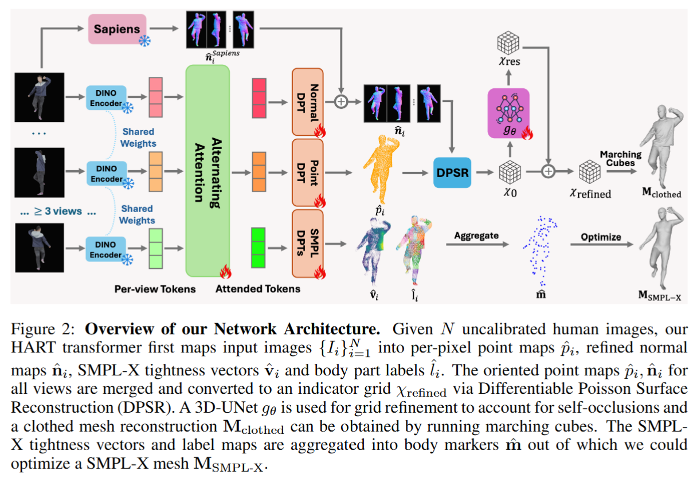
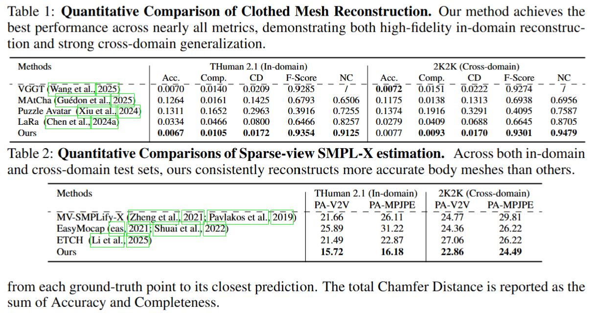
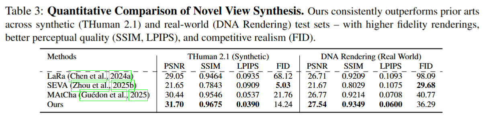

# HART: HUMAN ALIGNED RECONSTRUCTION TRANSFORMER - [ArXiv_2025]

> [arXiv:2509.26621v1](https://arxiv.org/abs/2509.26621)

### 一、引言与核心问题

HART (Human Aligned Reconstruction Transformer) 针对的是三维人体重建领域中一个极具挑战性且应用广泛的问题：如何从稀疏且未标定的视角高效重建高质量的人体几何与外观。在虚拟试衣、增强现实/虚拟现实 (AR/VR)、远程呈现以及数字内容创作等应用中，快速且鲁棒的三维人体数字化是核心需求。

**论文试图解决的核心任务：**
HART 旨在建立一个统一的框架，仅需少量输入即可同时输出高精度的穿衣人体网格、参数化人体模型 (SMPL-X) 以及用于新视角合成的 Gaussian Splatting 表示。

*   **输入 (Input)**: 模型接收一组稀疏的 RGB 图像作为输入。具体而言，输入数据形状为 $[Batch\_size, N, 3, H, W]$，其中 $N$ 代表视角数量（通常为 4-8 个），且这些图像是**未标定 (Uncalibrated)** 的，这意味着系统无法预先获知相机的内参或外参矩阵，必须从图像特征中直接推断。
*   **输出 (Output)**: 系统产生多层级的输出结果：
    1.  **穿衣人体网格 (Clothed Mesh)**: 一个水密 (Watertight) 的三角网格，形状为 $[Batch\_size, V, 3]$ (顶点) 和对应的面片索引。
    2.  **SMPL-X 参数**: 估计出的身体姿态 $\theta$、形状 $\beta$ 和位移 $t$，用于驱动标准的参数化人体模型。
    3.  **高斯泼溅表示 (Gaussian Splats)**: 用于光照级的新视角渲染，包含位置、协方差、颜色和不透明度等参数，数据量级取决于场景复杂度，约为 $[Batch\_size, 3N_{gaussians}]$。

**当前任务的挑战 (Pain Points)**:
该任务的主要痛点在于信息的极度稀疏性与人体结构的复杂性之间的矛盾。
首先，传统的隐式函数方法（如 PIFu）通常假设正交投影，这严重限制了其在真实世界透视图像中的泛化能力。
其次，基于 NeRF 或 3DGS 的方法通常需要密集的视角输入和精确的相机标定，且针对单个人体的优化时间过长（数分钟到数小时），不具备实时性或可扩展性。
最关键的难点在于**自遮挡 (Self-occlusion)**：在稀疏视角下，人体的某些部位（如背部、腋下）在输入图像中完全不可见。现有的前馈式 Transformer 方法（如 VGGT）虽然能预测可见区域的点云，但无法推断被遮挡部分的几何形状，导致重建结果出现空洞或结构缺失。此外，宽松的衣物遮挡了人体体表，使得准确估计内部的身体姿态（SMPL-X）变得异常困难。

**论文针对的难点**:
HART 专门聚焦于解决**稀疏视角下的几何补全**和**宽松衣物下的身体姿态估计**这两个核心难题。它试图通过引入显式的三维空间细化模块来修复自遮挡区域，并利用像素级的几何先验来穿透衣物推断人体结构。

### 二、核心思想与主要贡献

**直观动机与设计体现**:
HART 的核心动机在于“对齐 (Alignment)”——即穿衣几何重建应当与潜在的人体解剖结构对齐，同时也应当在多视角之间保持几何一致性。作者认为，单纯依靠点云回归无法解决遮挡问题，必须引入体积化的表示（Volumetric Representation）来进行全局的几何推理。这一动机体现在其独特的“先预测点图，再进行体积细化”的两阶段设计中。

**与相关工作的比较与创新**:
HART 的架构深受 VGGT 和 DUSt3R 等通用三维重建 Transformer 的启发，这些工作展示了直接从图像回归 3D 点图的强大能力。然而，HART 在此基础上进行了针对人体的关键改进。与 EasyMocap 等基于关键点优化的方法相比，HART 利用了密集的像素级预测，不仅能处理更复杂的姿态，还能在宽松衣物下提供更鲁棒的约束。与 PuzzleAvatar 等基于 SDS 的优化方法相比，HART 是纯前馈的，速度更快且几何结构更完整。

**核心贡献与创新点**:
1.  **统一的 Transformer 框架**: 提出了一个能够同时预测像素级点图 (Point Maps)、法线图 (Normal Maps) 以及 SMPL-X 紧致度向量 (Tightness Vectors) 的统一架构，实现了几何与语义的联合推断。
2.  **遮挡感知的泊松重建 (Occlusion-aware DPSR)**: 创新性地引入了一个 3D U-Net 模块嵌入到可微泊松表面重建 (DPSR) 流程中。该模块在体积空间内对指示函数 (Indicator Grid) 进行残差修正，有效地填补了稀疏视角带来的几何空洞，实现了真正的水密重建。
3.  **几何引导的高斯渲染**: 展示了利用重建出的高质量网格作为几何先验来初始化 Gaussian Splats，可以显著提升稀疏视角下的新视角合成质量，避免了常见的浮点伪影 (Floater Artifacts)。

### 三、论文方法论 (The Proposed Pipeline)

**整体架构概述**:
HART 采用了一个分阶段的级联架构。首先，输入图像经过一个共享权重的 Transformer 主干网络，解码出多通道的 2.5D 特征图（包含点、法线、SMPL-X 属性）。接着，这些 2.5D 信息被投影到 3D 空间并通过 DPSR 转化为体积网格，在此过程中引入 3D U-Net 进行几何修补。最后，利用预测的几何与语义信息分别优化 SMPL-X 参数和初始化 Gaussian Splatting 渲染模型。

**详细网络架构与数据流**:

1.  **特征提取与多头预测 (The Transformer Backbone)**:
    *   **模块设计**: 采用类似于 VGGT 的 Transformer 架构。图像首先被编码为 Patch Tokens，经过多层 Self-Attention 和 Cross-Attention 处理，捕捉视图间的几何对应关系。
    *   **预测头 (Heads)**: 解码器分为四个并行的分支（Heads），每个分支输出特定维度的特征图，尺寸均为 $[H, W]$：
        *   **Point Head ($\hat{p}_i$)**: 直接回归像素对应的 3D 坐标 $(x, y, z)$。
        *   **Normal Head ($\hat{n}_i$)**: 采用残差预测策略。利用 Sapiens 模型生成的法线图 $\hat{n}^{Sapiens}_i$ 作为先验，网络预测残差 $\Delta \hat{n}_i$，最终法线为 $\hat{n}_i = \text{normalize}(\hat{n}^{Sapiens}_i + \Delta \hat{n}_i)$。这种设计结合了 Sapiens 的强先验和特定视角的细节修正。
        *   **Tightness Head ($\hat{v}_i$)**: 预测从衣物表面指向内部身体表面的向量 $\hat{v}_i$。该向量被分解为方向 $\hat{d}_i$ 和模长 $\hat{b}_i$ 分别预测，即 $\hat{v}_i = \hat{b}_i \hat{d}_i$。这一步实现了对宽松衣物的穿透感知。
        *   **Label Head ($\hat{l}_i$)**: 预测每个像素属于 SMPL-X 模型 86 个预定义关键点的概率分布，用于建立语义对应。

2.  **几何融合与细化 (DPSR & 3D U-Net Refinement)**:
    *   **数据流**: 预测出的点图 $\hat{p}_i$ 和法线 $\hat{n}_i$ 根据预测的相机参数变换到世界坐标系 $\hat{n}_{world} = R_{c2w} \hat{n}_i$。
    *   **DPSR 转化**: 利用可微泊松表面重建 (DPSR) 将点云和法线转化为一个 3D 指示函数网格 (Indicator Grid) $\chi_{raw}$，形状通常为 $[D, H, W]$。
    *   **3D U-Net 细化**: 这是一个关键模块。由于 $\chi_{raw}$ 仅包含可见面信息，背部和遮挡区域是缺失或嘈杂的。网络将 $\chi_{raw}$ 下采样后输入到一个 3D U-Net 中，预测残差网格 $\chi_{res}$。
    *   **最终几何**: 修正后的网格 $\chi_{refined} = \chi_{raw} + \chi_{res}$ 通过 Marching Cubes 算法提取出最终的水密网格 (Clothed Mesh)。
    *   **形状变换**: $[N, H, W, 3]$ (点/法线) $\xrightarrow{DPSR}$ $[Grid\_Res^3]$ (体积网格) $\xrightarrow{3D U-Net}$ $[Grid\_Res^3]$ (修正网格) $\to$ Mesh。

3.  **SMPL-X 参数估计**:
    *   利用预测的紧致度向量 $\hat{v}_i$ 和语义标签 $\hat{l}_i$，将衣物表面的点“推”回身体表面，并聚合为稀疏的身体标记点 (Body Markers)。通过最小化这些标记点与 SMPL-X 模板对应点的距离，求解最优的姿态 $\theta$ 和形状 $\beta$。

**损失函数 (Loss Function)**:

论文采用多任务联合训练，总损失 $L_{total}$ 由以下部分加权组成：

*   **几何损失 ($L_{point}, L_{normal}$)**: 
    *   $L_{point}$: 计算预测点图与 Ground Truth 之间的 L2 距离。
    *   $L_{normal}$: 计算预测法线与 GT 法线的余弦距离，并引入置信度加权 $\hat{C}_n$，形式为 $\sum (\hat{C}_n \odot (1 - \hat{n}_i \cdot n_i)) - \alpha \log \hat{C}_n$。这种不确定性加权允许网络在纹理弱或边缘区域降低权重。
*   **SMPL 辅助损失 ($L_{SMPL}$)**:
    *   包含方向损失 $\mathcal{L}_{d}$ (余弦距离)、模长损失 $\mathcal{L}_{b}$ (MSE)、标签分类损失 $\mathcal{L}_{l}$ (Cross Entropy) 和置信度回归损失 $\mathcal{L}_{c}$。这些损失强制网络理解衣物与身体的空间关系。
*   **训练实施**: 采用了 Curriculum Learning 或分阶段训练策略，通常先预训练 Transformer 主干，再端到端微调几何细化模块。

**数据集 (Dataset)**:
*   **训练数据**: 主要依赖 **THuman 2.1** 数据集，包含约 2.3K 个高质量人体扫描。
*   **数据处理**: 为了模拟真实世界的稀疏视角，训练时随机采样 3-8 个视角，并随机进行色彩增强以提高泛化性。尽管只在合成数据上训练，实验表明该策略对真实图像（如 2K2K 和 DNA-Rendering 数据集）具有极强的泛化能力。

### 四、实验结果与分析

**核心实验结果**:
HART 在几何重建、SMPL-X 估计和新视角合成三个任务上均取得了显著优于现有方法的性能。 

| 指标 (THuman 2.1)                       | VGGT (Baseline) | MAtCha | HART (Ours) | 提升幅度         |
| :-------------------------------------- | :-------------- | :----- | :---------- | :--------------- |
| **Chamfer Distance** ($\times 10^{-3}$) | 0.0209          | 0.1425 | **0.0172**  | **~18%**         |
| **Completeness**                        | 0.0140          | 0.0161 | **0.0105**  | **显著提升**     |
| **PSNR** (Novel View)                   | -               | 30.44  | **31.70**   | **+1.26 dB**     |
| **LPIPS** (Novel View)                  | -               | 0.0537 | **0.0390**  | **更优感知质量** |

*解读*: HART 在 Chamfer Distance 上的提升主要归功于 Completeness（完整性）的大幅改善。VGGT 等方法在不可见区域往往产生较大的误差，而 HART 的 3D U-Net 有效补全了这些区域。

**SMPL-X 估计结果**:
在 SMPL-X 参数估计任务中，HART 相比于传统的 MV-SMPLify-X 和最新的 ETCH 方法，PA-V2V 误差降低了 6-27%。这证明了利用像素级紧致度预测比单纯依赖稀疏关键点更加鲁棒。

**可视化结果分析**:
定性结果显示，在处理宽松衣物（如裙子、长外套）时，HART 生成的网格表面平滑且连续，没有明显的断裂或伪影。相比之下，MAtCha 生成的几何充满噪声，而 VGGT 在背部区域常出现空洞。在新视角渲染中，HART 初始化的 Gaussian Splats 保持了锐利的边缘，避免了其他方法常见的“云雾状”模糊。

### 五、方法优势与深层分析

**架构/设计优势**:
HART 的最大优势在于其**显隐结合的混合几何管线**。
1.  **像素级精度与体积级完整性的平衡**: 纯点图回归（如 DUSt3R）精度高但拓扑差；纯体素方法（如 PIFu）拓扑好但细节丢失。HART 先利用 Transformer 在图像空间提取高频细节（点/法线），再利用 DPSR 和 3D U-Net 在体积空间修正拓扑和遮挡。这种设计既保留了 Transformer 对纹理特征的敏感度，又利用了 3D 卷积对几何连续性的归纳偏置。
2.  **残差法线设计的精妙之处**: 并不从零开始学习法线，而是基于 Sapiens 这一针对人体的基础模型进行残差修正。这使得模型在训练初期就能获得合理的人体形状，专注于学习衣物褶皱等 Sapiens 忽略的高频细节，极大加速了收敛并提升了最终质量。

**解决难点的思想与实践**:
针对“自遮挡”这一核心难点，HART 摒弃了仅依赖多视角几何一致性的传统思路（因为稀疏视角下总有死角），而是转向了“几何补全”的思路。3D U-Net 实际上学习到了人体的统计形状先验——即知道人体是封闭的、对称的。这种学习到的先验能够“脑补”出视线无法触及的背部区域，从而在根本上解决了稀疏视角的完整性问题。

### 六、结论与个人思考

**结论**:
HART 成功展示了前馈式 Transformer 在稀疏视角人体重建领域的潜力。它通过巧妙结合 2.5D 像素预测与 3D 体积细化，在仅使用 2.3K 合成数据训练的情况下，实现了对真实世界复杂衣物和姿态的鲁棒重建与渲染，为低成本、高效率的数字化身生成提供了一个强有力的基线。

**潜在局限性**:
1.  **分辨率瓶颈**: DPSR 和 3D U-Net 的计算开销随网格分辨率立方级增长，这限制了重建几何的精细度（如手指、发丝细节可能丢失）。
2.  **极度稀疏视角的鲁棒性**: 虽然 4 视角效果很好，但在 2-3 视角下，如果遮挡极其严重，3D U-Net 的补全能力可能会产生过度平滑或错误的几何推断。
3.  **光照解耦**: 当前框架主要关注几何和纹理渲染，并未显式解耦光照和材质（Albedo/Roughness），限制了其在重光照场景下的应用。

**对个人研究的启发**:
HART 的“Residual Normal Prediction”思路非常值得借鉴，即在通用大模型（如 Sapiens）的输出基础上学习残差，而不是重新训练，这可能是将基础模型适配到特定高精度任务的高效路径。此外，将显式的网格重建作为 Gaussian Splatting 的初始化约束，是解决 3DGS 在少样本下过拟合问题的有效手段，这一思路可迁移至场景重建等其他领域。