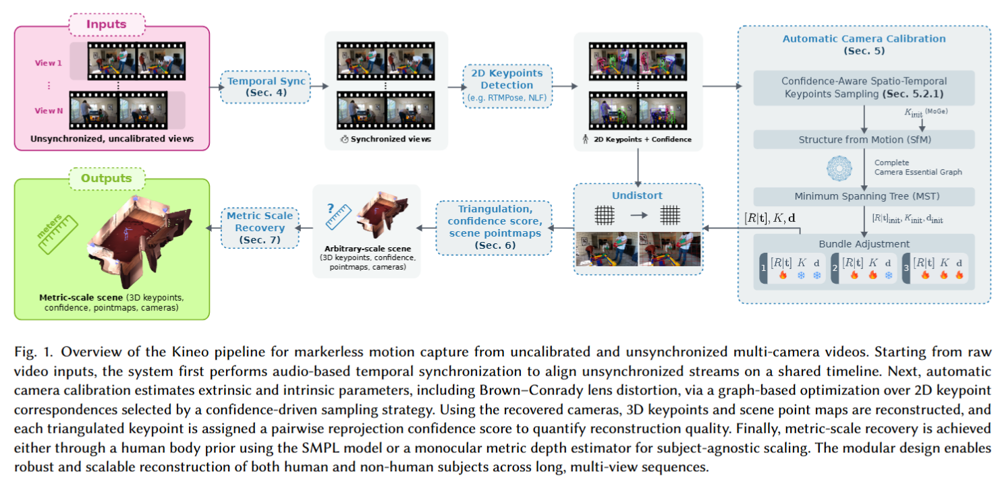

# Kineo: Calibration-Free Metric Motion Capture From Sparse RGB Cameras - arXiv 2025

> **Paper Link**: [arXiv:2510.24464v2](https://arxiv.org/abs/2510.24464)

### 一、引言与核心问题

在计算机图形学与视觉领域，无标记（Markerless）动作捕捉技术正逐渐从受控的实验室环境走向野外。然而，传统的无标记动捕系统通常依赖于繁琐的相机校准和硬件同步，限制了其对非专家用户的可用性。现有的“无校准”（Calibration-free）方法虽然试图打破这一限制，但往往面临计算成本高昂、缺乏度量尺度（Metric Scale）以及忽略镜头畸变等问题，导致在消费级相机（如GoPro）上的表现不佳。

**论文试图解决的核心任务是什么？**
本论文提出的 **Kineo** 旨在实现一个全自动、无校准的动捕流水线。

*   **输入 (Input)**: $N$ 个不同视角的**未同步、未校准**的 RGB 视频流。数据维度视具体视频时长和分辨率而定，例如 $N$ 个形状为 $[T, H, W, 3]$ 的视频张量，其中 $T$ 为时间帧数。
*   **输出 (Output)**: 
    1.  **度量尺度的 3D 关键点**: 形状为 $[T, J, 3]$ 的三维坐标（$J$ 为关节数），单位为米。
    2.  **相机参数**: 包含完整的内参（焦距、主点）、外参（$R, t$）以及 **Brown-Conrady 畸变系数**。
    3.  **场景点云图 (Scene Point Maps)**: 稠密的场景几何表示。
    4.  **3D 置信度分数**: 针对每个重构关键点的可靠性评分。
*   **应用场景**: 户外运动分析（如 EgoHumans 数据集中的场景）、低成本家庭娱乐动捕、非物质文化遗产记录（如手工艺动作捕捉）。
*   **当前任务的挑战 (Pain Points)**:
    1.  **几何不一致性**: 未校准相机的相对位置未知，且消费级广角镜头存在严重畸变。
    2.  **时间偏差**: 电池供电的相机无法实现硬件级帧同步。
    3.  **计算效率**: 现有的 SOTA 方法（如 HSfM）依赖于对每一帧运行昂贵的神经网络进行迭代优化，难以处理长视频。
    4.  **尺度模糊**: 纯视觉方法通常只能恢复到任意尺度（Arbitrary Scale），缺乏真实的物理尺寸。

### 二、核心思想与主要贡献

**直观动机与设计体现**
Kineo 的核心动机是**“回归几何本质，轻量化深度学习”**。作者认为，不应使用黑盒神经网络暴力回归相机参数，而应利用成熟且鲁棒的几何视觉算法（SfM, Bundle Adjustment），并将深度学习限制在它最擅长的领域——即 **2D 关键点检测**和**单目深度估计**。通过显式地对 2D 检测器的置信度进行建模，Kineo 能够智能地筛选出高质量的时空对应关系，从而在不牺牲精度的前提下大幅降低计算量。

**与相关工作的比较与创新**
与目前最先进的无校准方法 **HSfM** (Human Scene from Monocular video) 相比，Kineo 摒弃了基于 SMPL 参数化模型的逐帧迭代拟合。HSfM 依赖重型网络（HMR2.0, SAM, DUSt3R）联合优化人体和相机，计算极其缓慢且容易陷入局部最优。相反，Kineo 采用分层优化的策略：先通过置信度驱动的稀疏 SfM 求解相机，再恢复人体。

**核心贡献**:
1.  **置信度感知的时空采样策略 (Confidence-Aware Spatio-Temporal Subsampling)**: 提出了一种基于 2D 检测置信度的关键点筛选机制，用于鲁棒且高效的 Fundamental Matrix 估计，使得校准成本与视频时长脱钩。
2.  **图驱动的全局校准 (Graph-Based Global Calibration)**: 将相机网络建模为加权图，利用最小生成树 (MST) 初始化全局外参，并通过包含镜头畸变的 Bundle Adjustment 进行精细化。
3.  **度量尺度恢复与畸变建模**: 首次在无校准动捕中显式引入 Brown-Conrady 畸变模型，并提出了基于 SMPL 先验或 MoGe 单目深度的两种尺度恢复方案。

### 三、论文方法论 (The Proposed Pipeline)

Kineo 的整体架构遵循经典的 Structure-from-Motion (SfM) 范式，但针对动态人体场景进行了深度改造。流程从原始视频开始，经过音频同步、2D 检测、相机自校准，最终输出度量尺度的 3D 骨架。

#### 1. 时间同步与数据预处理
*   **音频同步**: 由于相机未同步，系统首先提取每个视频音轨的 **MFCC (梅尔频率倒谱系数)** 特征。相比于原始频谱图，MFCC 特征更紧凑且对噪声鲁棒。通过计算 MFCC 特征的互相关 (Cross-correlation) 来确定视频流之间的时间偏移 $\gamma_k$。
*   **2D 关键点检测**: 对同步后的视频帧，$I_t \in \mathbb{R}^{H \times W \times 3}$，利用现成的检测器（如 **NLF** 或 **RTMPose**）提取 2D 关键点。
    *   **输出**: 每一帧得到一组关键点 $x_{i,k} \in \mathbb{R}^{2}$ 和对应的置信度分数 $w_{i,k} \in [0, 1]$。这里 $i$ 是视角索引，$k$ 是关键点索引。

#### 2. 自动相机校准 (Automatic Camera Calibration)
这是论文的核心模块，旨在从动态的 2D 关键点中恢复静态的相机参数。

*   **内参初始化**: 利用单目几何估计器 **MoGe** 预测每张图的初始焦距。
*   **置信度感知的时空采样 (关键创新)**:
    传统的 RANSAC 随机采样容易受到噪声干扰。Kineo 定义了成对关键点对应关系的置信度：

$$
w_{ij,k} = \sqrt{w_{i,k} \cdot w_{j,k}}
$$

系统仅保留 $w_{ij,k} > \tau$ 的高质量对应关系，并在时间维度上进行均匀采样。这种策略极大地减少了 SfM 的输入数据量，同时提高了本质矩阵 (Essential Matrix) $E_{ij}$ 估计的鲁棒性。
*   **图基全局初始化**:
    构建一个相机图，节点为相机，边代表两两之间的相对位姿。边的权重被定义为 RANSAC 内点的平均 **Sampson 距离**（一种几何误差度量）。
    *   **算法**: 在图上计算**最小生成树 (MST)**。MST 路径定义了误差累积最小的相机级联顺序。通过沿 MST 传播相对位姿 $[R_{ij}|t_{ij}]$，将所有相机统一到同一坐标系下。
*   **多阶段集束调整 (Bundle Adjustment, BA)**:
    初始化的参数通过非线性优化进行精修。优化分为三个阶段逐步释放参数：(1) 仅优化位姿和3D点 $\to$ (2) 加入焦距 $\to$ (3) 加入 **Brown-Conrady 畸变系数** $d_i$。
    *   **损失函数**: 优化的目标是最小化加权重投影误差：

$$
L_{\text{reproj}} = \sum_{i=1}^{N} \sum_{m=1}^{M} w_{i,m} H_{\delta} \left( \| \pi(K_i, d_i, [R|t]_i, X_m) - x_{i,m} \|_2 \right)
$$

其中 $H_{\delta}$ 是 **Huber Loss**，用于抑制离群点；$w_{i,m}$ 是 2D 检测置信度；$\pi(\cdot)$ 是包含畸变模型的投影函数。

#### 3. 3D 重建与置信度评估
*   **三角化**: 使用加权直接线性变换 (Weighted DLT) 将校准后的 2D 点提升为 3D 点 $X_m$。权重直接来源于 2D 检测置信度。
*   **成对重投影置信度 (Pairwise Reprojection Confidence)**:
    为了量化 3D 点的质量，论文提出了一个新的度量标准。它计算所有视角对之间的重投影一致性，并由 2D 置信度加权：

$$
s_m = \frac{1}{Z} \sum_{i,j} \sqrt{w_i w_j} \cdot \exp(-\lambda \cdot \text{reproj\_error}_{ij})
$$

这为后续任务提供了一个不依赖于特定骨骼模型的质量评分。

#### 4. 度量尺度恢复 (Metric Scale Recovery)
由于单目 SfM 存在尺度模糊，Kineo 提供了两种恢复绝对尺度的方法：
1.  **基于 SMPL 先验**: 如果场景中有人，利用 SMPL 模型的统计骨骼长度作为参考，优化全局缩放因子 $\alpha$。
2.  **基于 MoGe**: 利用 MoGe 输出的 Metric Depth Map，通过比对重建点云与 MoGe 深度图的距离比例来确定 $\alpha$。这种方法适用于非人场景。

### 四、实验结果与分析

**核心实验结果**
实验在 **EgoHumans** (户外、广角畸变严重) 和 **Human3.6M** (室内受控) 数据集上进行。

| 指标 (EgoHumans)         | HSfM (SOTA Baseline) | HAMSt3R | **Kineo (Ours)** | **提升幅度** |
| :----------------------- | :------------------- | :------ | :--------------- | :----------- |
| **W-MPJPE (m)**          | 1.04                 | 3.80    | **0.17**         | **~83%**     |
| **Camera Trans Err (m)** | 2.09                 | 2.33    | **0.34**         | **~83%**     |
| **Camera Ang Err (°)**   | 9.35                 | 10.24   | **0.69**         | **~92%**     |

*解读*: Kineo 在所有指标上都大幅超越了 HSfM。特别是在 EgoHumans 数据集上，W-MPJPE 从米级误差（1.04m）降低到了分米级（0.17m），这意味着重建结果从“仅看个大概”提升到了“具有物理测量意义”。相机角度误差降低到 1 度以内，证明了其校准的高精度。

**消融研究解读**
*   **畸变模型的重要性**: 在去除畸变估计模块后，EgoHumans 上的 W-MPJPE 从 0.17m 恶化到 0.41m，相机平移误差翻倍。这证实了对于 GoPro 等运动相机，显式建模 Brown-Conrady 畸变是至关重要的，而这一点常被基于深度学习的方法（假设针孔模型）所忽略。
*   **采样策略**: 对比随机采样，Kineo 的置信度感知采样在保证精度的同时，极大地减少了 BA 的优化变量，使得处理长视频成为可能（例如处理 1小时20分钟的素材仅需 36分钟）。

**可视化结果**:
论文展示了将原始扭曲的 GoPro 图像利用估计的畸变参数进行“去畸变”的效果，直线特征（如篮球场边线）被成功拉直，直观验证了校准的准确性。

### 五、方法优势与深层分析

**架构/设计优势**
1.  **解耦与模块化**: Kineo 将 2D 检测与 3D 校准解耦。这意味着只要更换更强的 2D 检测器（如从 NLF 换到未来的新模型），整个系统的精度就能“免费”提升，而不需要重新训练庞大的端到端网络。
2.  **鲁棒的几何后端**: 相比于神经网络直接回归相机位姿（容易过拟合且难以保证几何一致性），Kineo 采用的 Bundle Adjustment 能够利用所有视角的几何约束，找到全局最优解。Huber Loss 的引入使其对错误的 2D 检测点具有极强的抗干扰能力。

**解决难点的思想与实践**
*   **针对计算效率**: 传统的 SfM 随着帧数增加计算量呈指数或平方级增长。Kineo 通过“置信度采样”巧妙地将长视频浓缩为一组最具代表性的几何约束集，使得校准过程拥有固定的计算预算，从而解决了长序列处理的难题。
*   **针对畸变**: 多数 Neural MoCap 方法默认输入已去畸变。Kineo 直面这一痛点，将畸变系数作为 BA 的优化变量。这种务实的设计使其能直接应用于原始消费级视频流。

### 六、结论与个人思考

**结论**: Kineo 成功证明了在深度学习时代，经典的几何方法（SfM, BA）结合高质量的神经检测器（Keypoint Detectors），在无校准动捕任务上依然可以碾压纯端到端的深度学习方法。它提供了一个高精度、快于实时、且具备度量尺度的解决方案。

**潜在局限性**:
1.  **依赖 2D 检测质量**: 如果场景中遮挡极其严重导致 2D 检测器完全失效，后续的几何优化将无米之炊。
2.  **刚体场景假设**: 音频同步和 SfM 假设相机之间相对静止。虽然论文提到可以处理动态场景中的静态相机，但如果是**移动相机**（Moving Camera）拍摄动态人体，当前的图优化逻辑可能需要结合 SLAM 技术进行扩展。

**对个人研究的启发**:
这篇论文是一个极佳的“反内卷”范例。它没有设计更复杂的 Transformer 或 Diffusion Model，而是重新审视了几何视觉的基础。这提示我们在研究中：
1.  **不要忽视经典几何**: 深度学习提供的特征匹配/检测能力，配合严谨的几何优化，往往比端到端黑盒更可靠。
2.  **数据质量优于数量**: 通过置信度筛选高质量数据点进行计算，比全量数据计算更高效且精度更高。
3.  **重视实际部署痛点**: 畸变校正和时间同步虽然听起来不“性感”，但这正是阻碍技术落地的真正门槛。