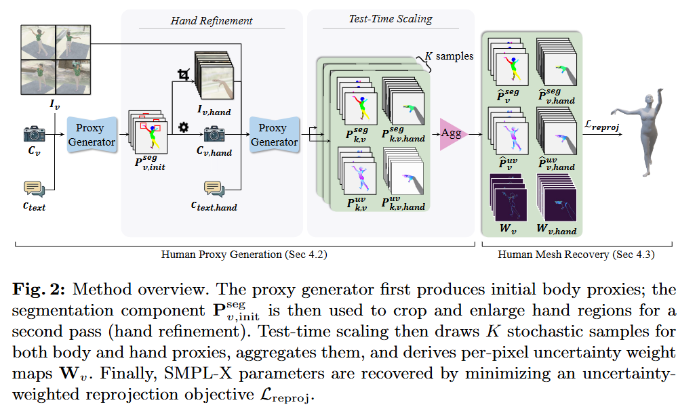
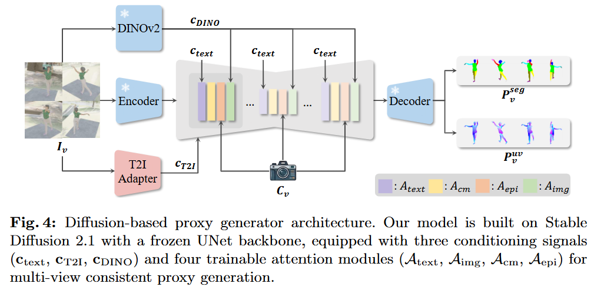
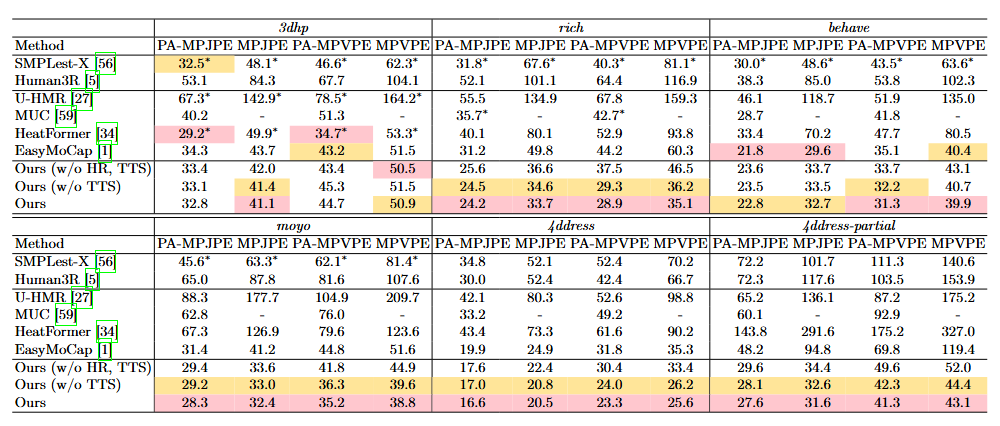
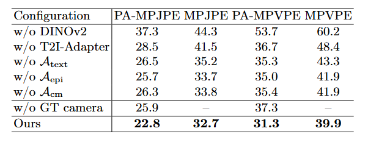

# DiffProxy: Multi-View Human Mesh Recovery via Diffusion-Generated Dense Proxies - [ArXiv_2026]

> [arXiv:2601.02267v2](https://arxiv.org/abs/2601.02267v2) | [Project Page](https://wrk226.github.io/DiffProxy.html)
>
> 说明：除显式标注的 `[Inference]` 和“未确认”外，本文内容均依据论文正文、图示、公式、实验结果与 arXiv source；本文未使用代码补全。

## 一、问题定义与研究目标

这篇论文研究的是“已标定多视角人体网格恢复”。给定同一时刻的多视角 RGB 图像和相机参数，目标是恢复一个与图像精确对齐的 SMPL-X 人体网格。作者明确反对“直接从像素端到端回归 SMPL-X 参数”的路线，认为此类方法把几何、对应关系、遮挡处理都压缩进一个黑盒回归目标里，误差相互耦合，很难定位和修正；相对地，传统 fitting 方法虽然可解释，但只依赖稀疏关键点，约束过弱，遇到遮挡、复杂姿态和宽松服装时容易失稳。

- **核心任务**：从多视角、已标定、透视相机下的人体图像中恢复精确的 SMPL-X 网格。
- **输入（Input）**：
  - 多视角 RGB 图像 $\{I_v\}_{v=1}^{N}$，$N\ge 1$；论文主实验固定用 4 个视角评测。
  - 每个视角的透视相机参数 $\{C_v\}=\{(\mathbf{K}_v,\mathbf{R}_v,\mathbf{t}_v)\}$。proxy generator 假设无镜头畸变。
  - 在推理第二阶段，还会从 full-body 图像中裁出左右手局部图像 $I_{v,\mathrm{hand}}$，并同步调整手部 crop 的相机内参 $C_{v,\mathrm{hand}}$；这是中间派生输入，不是原始输入。
  - 论文明确给出了 proxy 输出分辨率为 $\mathbb{R}^{256\times256\times3}$，但没有明确写出送入 Stable Diffusion 骨干前的 RGB resize 尺寸；训练渲染图像本身是 $1024\times1024$。
- **输出（Output）**：
  - 最终输出是标准 SMPL-X 网格参数 $\Theta=\{\boldsymbol{\beta},\boldsymbol{\theta},\boldsymbol{\psi},\mathbf{T}\}$ 对应的三维人体网格，其中论文实际优化的是 shape $\boldsymbol{\beta}\in\mathbb{R}^{10}$、pose $\boldsymbol{\theta}$、global translation $\mathbf{T}\in\mathbb{R}^{3}$，以及一个全局 scale；facial expression $\boldsymbol{\psi}$ 不优化。
  - 中间输出是每个视角的 dense proxy $\mathbf{P}_v=(\mathbf{P}_v^{\mathrm{seg}},\mathbf{P}_v^{\mathrm{uv}})$，二者都是 $256\times256\times3$ 图像；此外还有逐像素不确定性权重图 $\mathbf{W}_v\in\mathbb{R}^{256\times256}$。
  - 论文没有显式写出最终 SMPL-X 网格的顶点数，因此这里只能写成“标准 SMPL-X mesh”，不进一步猜测顶点维度。
- **应用场景**：论文的评测覆盖 studio capture、human-object interaction、outdoor scenes、challenging poses、loose clothing 等场景，因此目标场景是“多视角、精确几何对齐优先”的人体重建，而不是单目快速回归。
- **关键挑战**：
  - 端到端回归会产生“纠缠误差（entangled errors）”，导致 image-mesh misalignment 难以纠正。
  - 稀疏关键点 fitting 只约束少量关节，不约束整张可见表面，对遮挡、极端姿态和宽松衣物不鲁棒。
  - 早期 dense proxy 方法受限于 DensePose-COCO 的人工标注噪声和 CNN detector 的泛化能力，导致预测的 correspondence 不够精细。
  - 手部在 full-body 图像中通常少于 1% 像素，直接预测时细节不稳。
  - 扩散模型的单次采样仍可能在自遮挡、部件边界、视觉歧义区域出错，需要显式估计不确定性。
- **本文针对的改进点**：作者把“恢复 dense correspondence”本身看成一个更适合 diffusion 模型的 image-to-image 任务，再用这些 correspondence 去驱动可解释的 SMPL-X fitting，以此同时保留强视觉先验和明确几何约束。[Inference]

## 二、核心思想与主要贡献

这部分除特别说明外均依据论文正文与相关图示。

作者的核心判断是：multi-view HMR 的瓶颈不在“最终参数优化器不够强”，而在“中间表示不够好”。如果能为每个前景像素生成可靠的 pixel-to-surface correspondence，那么 fitting 就不再是“用少量 2D 关键点猜整个 3D mesh”，而是“让整块可见表面共同约束 SMPL-X”。这一思路直接把问题从参数回归转成了“dense proxy 生成 + 几何拟合”的双阶段流程。

与相关工作的关系可以概括为三条线。第一条线是 SMPLest-X、Human3R、U-HMR、MUC、HeatFormer 这类单/多视角端到端 HMR，它们直接预测 SMPL/SMPL-X 参数，推理快，但误差往往直接体现在 image-mesh 对齐上。第二条线是 EasyMoCap 这类 fitting-based 方法，它们保留了几何可解释性，但输入约束只有 sparse keypoints。第三条线是 DensePose、HoloPose、DecoMR、MeshPose 这类 dense proxy 方法，它们的方向其实很合理，但旧一代 proxy 标注和 detector 质量不够高。DiffProxy 的差异在于：它不直接回归 SMPL-X，而是用 Stable Diffusion 2.1 作为 dense proxy generator，在大规模纯合成数据上学出跨域泛化的 correspondence，再配合多视角 epipolar attention、手部精炼和测试时不确定性加权，让 dense proxy 真正变得“可用于高精度 fitting”。

本文最重要的贡献可以压缩成三点：

1. 提出 DiffProxy，用 diffusion-generated dense proxy 取代 sparse keypoint 作为 multi-view fitting 的中间表示，从而把密集视觉约束和几何优化结合起来。
2. 设计了 multi-conditional proxy generator：在冻结的 SD 2.1 UNet 上通过 text、T2I-Adapter、DINOv2 三路条件，加上跨模态注意力和 epipolar-constrained attention，实现多视角一致的 proxy 生成。
3. 引入 hand refinement 与 test-time scaling。前者把手部 crop 当成额外视角做第二次生成，后者利用多次随机采样估计逐像素不确定性，并把它直接写进 reprojection 权重图，提高最终 fitting 的稳定性。

## 三、方法与实现细节（全文重点）

本节除特别说明外均依据论文正文与附录性材料描述。需要注意的是，论文只公开了正文和 arXiv source，不包含补充材料里提到的 Algorithm 1，因此少量底层 lookup 细节只能保守地标成 `[Inference]` 或“未确认”。

### 3.1 整体 Pipeline 概述

DiffProxy 的完整流程分成四段。第一段是 synthetic data preparation：作者离线渲染大规模多视角人体图像，并且对每个像素直接生成精确的 SMPL-X segmentation/UV proxy，作为 diffusion 模型监督。第二段是 proxy generation：输入多视角 RGB 和相机参数，利用冻结的 SD 2.1 UNet 加轻量可训练模块，分别为每个视角生成 body-part segmentation 图和 UV correspondence 图。第三段是 hand refinement 与 test-time scaling：先用初始全身 proxy 找到手部区域并做高分辨率 hand crop，再对 body/hand proxy 做多次随机采样，聚合得到稳健 proxy 与逐像素不确定性权重。第四段是 mesh fitting：把每个前景像素映射到 SMPL-X 表面点，计算 uncertainty-weighted reprojection loss，并用 DPoser-X 作为 pose prior，最终优化出 SMPL-X mesh。

训练和推理并不完全对称。训练阶段只训练 proxy generator 和 VAE decoder refinement，不做端到端的 mesh fitting 反传；最终 mesh 是靠 test-time optimization 得到的。这意味着 DiffProxy 的核心是“高质量 correspondence + 经典优化”，而不是一个从输入到参数的单次前向模型。[Inference]

### 3.2 端到端数据流

下面的表把运行时数据流按模块展开。为了避免把论文没写的内容说得太满，凡是 hidden dim、head 数、token 数等没有在正文中出现的项目，都显式记为“未确认”。

| 阶段 | 模块/操作 | 输入 | 输出 | Shape 变化 | 作用 | 来源 |
|------|-----------|------|------|------------|------|------|
| 0 | 合成数据渲染（训练用） | 单个 SMPL-X 人体、8 个相机、背景/光照/遮挡资产 | 8 张 RGB 图 + 对应 segmentation/UV proxy | $1024\times1024$ RGB；proxy 监督随后被编码到 $256\times256\times3$ | 构建 pixel-perfect dense supervision | 论文 |
| 1 | 多视角输入整理 | $\{I_v\}_{v=1}^N$, $\{C_v\}$ | 条件特征 $\mathbf{c}_{text}, \mathbf{c}_{T2I}, \mathbf{c}_{DINO}$ | 图像分辨率未明确；proxy 输出目标是 $256\times256\times3$ | 把 RGB 和相机信息送入扩散骨干 | 论文 |
| 2 | 初始 body proxy generation | 多视角 full-body 图像与相机 | $\mathbf{P}_{v,\mathrm{init}}^{seg}, \mathbf{P}_{v,\mathrm{init}}^{uv}$ | 每个视角得到两张 $256\times256\times3$ 图 | 生成第一版全身 segmentation/UV correspondence | 论文 |
| 3 | Hand refinement | 初始 body segmentation、手部 crop $I_{v,\mathrm{hand}}$、调整后的 $C_{v,\mathrm{hand}}$ | $\mathbf{P}_{v,\mathrm{hand}}$ | 每个 full-body 视角再派生 left/right hand crop；默认总共 12 视图 | 放大手部细节，提升手指与手掌局部约束 | 论文 |
| 4 | Test-time scaling | 每个视角的 $K$ 个随机 proxy 样本 $\{\mathbf{P}_{k,v}\}_{k=1}^K$ | 聚合后的 $\hat{\mathbf{P}}_v^{uv}, \hat{\mathbf{P}}_v^{seg}, \mathbf{U}_v^{uv}, \mathbf{U}_v^{seg}, \mathbf{W}_v$ | $\hat{\mathbf{P}}_v^{uv}$ 仍为 $256\times256\times3$，$\mathbf{W}_v$ 为 $256\times256$ | 用采样分歧估计不确定性并转成 fitting 权重 | 论文 |
| 5 | Uncertainty-weighted mesh fitting | 所有视角的 proxy 与权重图、相机参数 | $\boldsymbol{\beta}, \boldsymbol{\theta}, \mathbf{T}, s$ 及最终 SMPL-X mesh | 输出维度取决于标准 SMPL-X 网格；论文未写顶点数 | 用 dense reprojection + pose prior 恢复 3D mesh | 论文 |

有两个 shape 细节值得单独说明。第一，proxy 不是一张 6 通道图，而是两张独立的 3 通道图：一张编码 segmentation，一张编码 UV。第二，论文明确给出了 proxy 输出大小和权重图大小，但没有给出 DINOv2 token 数、各 attention 的 hidden dimension、UNet block 内部通道等更细的网络 shape，因此这些内部张量形状无法从论文正文确认。

### 3.3 关键模块逐个拆解

这一小节按模块逐个拆开，并补上它们在整体 pipeline 中分别解决什么问题。

#### 3.3.1 Synthetic data preparation

作者完全依赖合成数据训练 proxy generator。训练集由两部分组成：67,650 个来自 BEDLAM + AMASS 的 clothed subject，以及 37,837 个来自 SynBody 的 subject，后者的姿态来自 MPI-3DHP 与 MoYo 的训练集，合计 105,487 个 multi-view sample、843,896 张图。所有背景、相机、光照、纹理都是合成的，因此作者强调评测数据不会和数据生成过程泄漏重合。

这个模块的重点不是“渲染得像”，而是“监督信号必须 pixel-perfect”。为了扩展场景覆盖，作者引入了 7,953 个 Amazon Berkeley Objects 遮挡物体、Hair20K 发型、863 个 Poly Haven HDR 环境图，以及物理服装仿真。这些因素直接决定 proxy 生成器在真实场景里是否能把复杂遮挡、宽松衣物和背景干扰消化成稳定 correspondence。

#### 3.3.2 Proxy 表示本身

DiffProxy 的核心中间表示是 $\mathbf{P}_v=(\mathbf{P}_v^{seg},\mathbf{P}_v^{uv})$。$\mathbf{P}_v^{seg}$ 用 RGB 颜色编码 semantic body-part label；$\mathbf{P}_v^{uv}$ 的前两个通道存储 UV 坐标，第三个通道固定为 1。这两个分量都被编码成 3 通道图，是因为作者要对接 SD 2.1 预训练 VAE decoder，且实验上比单通道表示重建质量更好。

这个设计的关键价值是：一个前景像素不再只对应“某个关节的大致方向”，而是对应到“SMPL-X 表面某个 body part 上的某个 UV 点”。换言之，proxy 把二维像素直接连接到三维网格表面，这比关键点提供的几何约束密度高得多。论文没有写 body-part palette 的精确类别数；手部 prompt 只明确说把每只手细分成 12 个 part（两块 palm、十根手指）。

#### 3.3.3 Multi-conditional diffusion proxy generator

proxy generator $G_\phi$ 建在 Stable Diffusion 2.1 上，UNet backbone 冻结，仅训练附加模块。输入是多视角 RGB 和透视相机参数 $\{C_v\}$，输出是每视角两个 proxy 图 $\mathbf{P}_v^{seg},\mathbf{P}_v^{uv}\in\mathbb{R}^{256\times256\times3}$。

生成过程由三类条件共同驱动：

- $\mathbf{c}_{text}$：文本 prompt，控制输出模式。全身与手部阶段用不同 prompt；手部 prompt 进一步把手划成 12 个语义部件。
- $\mathbf{c}_{T2I}=\mathcal{E}_{T2I}(I_v)$：来自 T2I-Adapter 的特征，以 residual feature 的方式提供像素级对齐约束。
- $\mathbf{c}_{DINO}=\mathcal{E}_{DINO}(I_v)$：来自 DINOv2 的 token，注入姿态与外观先验。

作者还单独设计了四个注意力模块：

- $\mathcal{A}_{text}$：text cross-attention，把文本条件注入 UNet。
- $\mathcal{A}_{img}$：image cross-attention，把 DINOv2 token 注入 UNet。
- $\mathcal{A}_{cm}$：cross-modality attention，把 UV 与 segmentation token 拼接起来，保证两种代理表征相互一致。
- $\mathcal{A}_{epi}$：multi-view epipolar attention，通过 epipolar-constrained self-attention 和 Plücker ray embeddings 建模多视角几何一致性。

论文没有提供上述注意力层的 head 数、hidden dim、堆叠层数、插入到 UNet 哪些 block 的精确位置，因此这些底层结构目前只能停留在“有这四种可训练注意力模块”的粒度，无法再往下写成层级清单。

训练时作者固定每个 sample 使用 $N=4$ 个视图，其中 2 到 4 个是 full-body view，剩余位置由同一相机视角裁出的 hand crop 填充；这样 body 与 hand 可以用统一网络联合训练。推理时则从随机 latent $\mathbf{z}_T\sim\mathcal{N}(0,I)$ 去噪，再用 VAE decoder 解码得到 proxy。

#### 3.3.4 Hand refinement

作者明确指出，在 full-body 图像中，手部像素通常少于 1%，因此直接在全身尺度上预测手部 correspondence 不可靠。为了解决这个问题，DiffProxy 使用两次前向：

1. 第一次只基于 full-body 视图生成初始 body proxy $\mathbf{P}_{v,\mathrm{init}}$。
2. 利用初始 segmentation $\mathbf{P}_{v,\mathrm{init}}^{seg}$ 定位左右手区域，并裁出放大的 hand crop $I_{v,\mathrm{hand}}$。
3. 裁剪时保持外参不变，只修改内参中的 focal length 和 principal point，得到 hand-specific camera $C_{v,\mathrm{hand}}$。
4. 第二次把这些 hand crop 当成额外视角，并切换到 hand-specific text prompt，再生成 refined hand proxy $\mathbf{P}_{v,\mathrm{hand}}$。

这个模块的本质不是另起一个手部网络，而是“把局部高分辨率视图并入同一个多视角扩散框架”，继续复用 cross-view attention。[Inference] 从消融结果看，hand refinement 在所有数据集上都有收益，例如 RICH 上 MPVPE 从 46.5 mm 降到 36.2 mm，4D-DRESS partial 上从 52.0 mm 降到 44.4 mm。

#### 3.3.5 Test-time scaling 与 uncertainty estimation

即使 proxy generator 足够强，扩散模型的单次采样仍可能在 self-occlusion、part boundary 或视觉歧义区域出错。因此作者在推理时对每个视角采样 $K$ 次 proxy，利用样本分歧估计不确定性，再把不确定性写进 fitting 权重图。

对 UV 分量，作者先做逐像素 median 聚合：

$$
\hat{\mathbf{P}}_v^{\mathrm{uv}}(x)
=
\operatorname{median}_{k=1..K}
\left[\mathbf{P}_{k,v}^{\mathrm{uv}}(x)\right],
$$

再定义三通道方差均值作为 UV uncertainty：

$$
\mathbf{U}_v^{\mathrm{uv}}(x)
=
\frac{1}{3}
\sum_{c=1}^{3}
\operatorname{Var}_{k=1..K}
\left[\mathbf{P}_{k,v}^{\mathrm{uv},(c)}(x)\right].
$$

对 segmentation 分量，作者先把每个样本量化到预定义 palette $\mathcal{P}_{view}$，然后做逐像素 majority voting 得到 $\hat{\mathbf{P}}_v^{seg}$。若像素 $x$ 上最多票的标签获得 $n_{max}(x)$ 票，则 segmentation uncertainty 定义为：

$$
\mathbf{U}_v^{\mathrm{seg}}(x)
=
\begin{cases}
1, & n_{max}(x)\le \frac{K}{2},\\[4pt]
2\left(1-\frac{n_{max}(x)}{K}\right), & \text{otherwise}.
\end{cases}
$$

最终逐像素可靠性权重是：

$$
\mathbf{W}_v(x)=
\left(1-\mathbf{U}_v^{\mathrm{uv}}(x)\right)
\left(1-\mathbf{U}_v^{\mathrm{seg}}(x)\right).
$$

这一步的意义很直接：如果某个区域在 $K$ 次采样里意见分裂，它就不该在最终优化里拥有和稳定区域同样大的权重。[Inference] 论文图 7 给出的典型案例是左右腿标签互换：单次采样可能错，但多次采样的分歧会把错误区域标成高不确定性，mesh fitting 随后会更依赖其它视角和更稳定像素。

#### 3.3.6 Uncertainty-weighted SMPL-X fitting

mesh fitting 阶段的输入是所有视角的聚合 proxy 与权重图。设 $\text{fg}(v)$ 是第 $v$ 个视角的前景像素集合，对每个 $x\in\text{fg}(v)$，作者根据该像素的 part label 和 UV 坐标，把它映射到 SMPL-X 表面的一个 3D 点，然后计算其重投影回原图后与像素 $x$ 的 L2 误差 $d(x)$。

相应的重投影损失是：

$$
\mathcal{L}_{reproj}
=
\sum_v
\sum_{x\in\text{fg}(v)}
\mathbf{W}_v(x)\,d(x)^2.
$$

当 test-time scaling 关闭，即 $K=1$ 时，所有像素权重默认为 1。为了约束姿态空间，作者额外使用 DPoser-X 的 one-step denoising loss 作为 whole-body pose prior：

$$
\mathcal{L}
=
\mathcal{L}_{reproj}
+ \lambda_{prior}\mathcal{L}_{prior},
\qquad
\lambda_{prior}=0.1.
$$

优化变量包括 shape $\boldsymbol{\beta}$、pose $\boldsymbol{\theta}$、translation $\mathbf{T}$ 和一个 global scale，使用 Adam 以 coarse-to-fine 的多阶段方式优化：先解全局位置，再解 body pose 与 shape，最后解手部 articulation。当相邻迭代的相对 loss 下降低于阶段阈值（1% 到 10%）时进入下一阶段。作者明确写出 shape 没有显式正则，facial expression $\boldsymbol{\psi}$ 也不优化。

这里有一个论文未完全展开的实现点。正文提到“根据 proxy label 和 UV 坐标把像素映射到 SMPL-X 表面点”，但补充材料里的 Algorithm 1 没有包含在 arXiv source 中，因此具体是通过 UV atlas 查找三角面、再用 barycentric interpolation 还原 3D 点，还是用其它离散化方式，正文无法确认。按问题定义看，最合理的实现应当是“body-part label 定位到局部 UV atlas，再由 UV 找到 mesh surface point”，但这一点只能记作 `[Inference]`，不能写成已经验证的事实。[Inference]

### 3.4 损失函数与训练目标

DiffProxy 的优化目标分成“proxy generator 训练目标”和“test-time mesh fitting 目标”两层，二者不是一个端到端联合损失。

#### 3.4.1 Proxy generator 的 diffusion loss

给定 ground-truth proxy $\mathbf{P}_v^*$，先用 VAE encoder 得到 latent $\mathbf{z}_0=\mathcal{E}_{VAE}(\mathbf{P}_v^*)$，再采样时间步 $t$ 和高斯噪声 $\boldsymbol{\epsilon}\sim\mathcal{N}(0,I)$。训练目标是标准 noise prediction：

$$
\mathcal{L}_{diff}
=
\mathbb{E}_{\mathbf{z}_0,\boldsymbol{\epsilon},t,\mathbf{c}}
\left[
\left\|
\boldsymbol{\epsilon}
- \boldsymbol{\epsilon}_{\phi}(\mathbf{z}_t,t,\mathbf{c})
\right\|_2^2
\right],
$$

其中

$$
\mathbf{z}_t
=
\sqrt{\bar{\alpha}_t}\mathbf{z}_0
+ \sqrt{1-\bar{\alpha}_t}\boldsymbol{\epsilon},
\qquad
\mathbf{c}
=
\{\mathbf{c}_{text},\mathbf{c}_{T2I},\mathbf{c}_{DINO}\}.
$$

这里 $\mathbf{c}_{text}$、$\mathbf{c}_{T2I}$、$\mathbf{c}_{DINO}$ 分别是文本条件、T2I-Adapter 特征和 DINOv2 token。论文没有给出采样调度器类型、时间步数量、classifier-free guidance 设置等更细节的扩散超参数，因此这些内容未确认。

#### 3.4.2 推理时的不确定性构造

严格说，$\mathbf{U}_v^{uv}$、$\mathbf{U}_v^{seg}$ 和 $\mathbf{W}_v$ 不是训练 loss，而是 test-time optimization 的权重构造。但它们决定了最终 fitting 的监督强度分布，因此也是方法的关键目标函数组成部分。

- UV 分支：用 median 聚合，方差表示不确定性。
- Segmentation 分支：用 majority voting 聚合，最多票数越低，不确定性越高。
- 权重图：$\mathbf{W}_v(x)=(1-\mathbf{U}_v^{uv}(x))(1-\mathbf{U}_v^{seg}(x))$。

这个设计把“多次随机采样的分歧”直接解释成“可靠性”，本质上是一种无需重新训练网络的 uncertainty calibration。[Inference]

#### 3.4.3 Mesh fitting 的目标

最终的 fitting loss 是：

$$
\mathcal{L}
=
\mathcal{L}_{reproj}
+ \lambda_{prior}\mathcal{L}_{prior},
\qquad
\lambda_{prior}=0.1.
$$

其中：

- $\mathcal{L}_{reproj}$ 约束每个前景像素对应的 3D 表面点投影回原图后与像素坐标一致；约束对象是“整块可见表面”，不是少量关节。
- $\mathcal{L}_{prior}$ 来自 DPoser-X，约束 body 和 hand pose 处于合理的人体姿态流形中。
- $\boldsymbol{\beta}$ 不加显式 regularization，这意味着 shape 更依赖 dense reprojection 自身的观测约束。

论文没有单独给出 $\mathcal{L}_{prior}$ 的展开式，而是直接引用 DPoser-X 的 one-step denoising loss，因此若要继续展开这个 prior 的数学形式，需要再读 DPoser-X 原文；本文不做越界推断。

### 3.5 数据集与数据处理

本节除特别说明外均依据论文正文中的数据集与实验设置描述。

#### 3.5.1 训练数据

训练完全基于合成数据。每个样本由单个人体、8 个相机视角以及配套的 segmentation/UV proxy 组成；渲染分辨率是 $1024\times1024$。数据来源如下：

- BEDLAM + AMASS：67,650 个 clothed subject。
- SynBody：37,837 个 subject，姿态来自 MPI-3DHP 与 MoYo 的训练集。
- 资产增强：7,953 个 ABO 遮挡物体、Hair20K 发型、863 个 Poly Haven HDR 环境图，以及基于物理的服装模拟。

作者明确排除了 MPI-3DHP 与 MoYo 的测试姿态，以及所有评测数据集的动作，以避免训练测试泄漏。

#### 3.5.2 一个训练样本如何构造

一个原始 synthetic sample 先渲染成 8 个 full-body 视角。实际训练 proxy generator 时，不是把 8 个视角全送入网络，而是固定抽 4 个视角作为训练预算，其中 2 到 4 个是 full-body，剩余 slot 用来自同一相机视角的 hand crop 填充。论文还提到使用了 random full-body / hand crops 和 bbox augmentation，但没有报告 bbox augmentation 的具体范围和采样策略，未确认。

#### 3.5.3 测试数据与协议

评测覆盖五个真实数据集和六个评测设置：

- 3DHP：用 subject S8 的 views 0/2/7/8，并按照 HeatFormer 的协议过滤 invalid masks。
- BEHAVE：官方 test split，4 views。
- RICH：test split 的前 4 个有效视角。
- MoYo：validation split，views 1/3/4/5。
- 4D-DRESS：无官方 split，评测整个数据集的 4 views。
- 4D-DRESS partial：在 4D-DRESS 上做随机 crop，测试局部可见性鲁棒性。

为了减少时间冗余，作者对大多数数据集每 5 帧取 1 帧，对 4D-DRESS 每 50 帧取 1 帧。另外，所有真实数据都不参与训练，也不做 dataset-specific fine-tuning。

### 3.6 训练流程、推理流程与代码补全说明

论文的训练、推理和实现可核查程度如下。

#### 3.6.1 训练流程

1. 离线渲染 synthetic multi-view RGB 图像与 pixel-perfect segmentation/UV proxy。
2. 对每个训练 sample 抽取 4 个视图，混合 full-body view 与 hand crop，并做 bbox augmentation。
3. 用 ground-truth proxy 经过 VAE encoder 得到 latent，按照 $\mathcal{L}_{diff}$ 训练 proxy generator；只更新 $\mathcal{A}_{text}$、$\mathcal{A}_{img}$、$\mathcal{A}_{cm}$、$\mathcal{A}_{epi}$ 和 T2I-Adapter，冻结 UNet backbone 与 DINOv2。
4. 单独微调 VAE decoder $\mathcal{D}$，减少 proxy 表示的量化伪影。
5. 训练超参数：batch size 2，Adam，learning rate $5\times10^{-5}$，30 epochs，4 张 RTX 5090，约 36 小时；VAE decoder refinement 为 batch size 8、learning rate $1\times10^{-6}$、100K iterations。

值得注意的是，论文没有描述“训练一个神经网络去直接输出 SMPL-X 参数”这一步；最终 mesh recovery 是推理期的优化过程。

#### 3.6.2 推理流程

1. 输入 4 个 full-body 视图及其相机参数，先做第一次 proxy generation，得到初始 body proxy。
2. 根据初始 segmentation 定位左右手，裁出 hand crop，更新 hand crop 对应的 camera intrinsics。
3. 第二次生成 proxy，默认形成 12 个视图：4 个 full-body + 每个全身视角对应的左右手 crop，共 8 个 hand crop。
4. 若启用 test-time scaling，则对这些 body/hand proxy 做 $K$ 次随机采样，默认 $K=3$，聚合得到 $\hat{\mathbf{P}}_v$ 与 $\mathbf{W}_v$。
5. 用 uncertainty-weighted reprojection loss 和 DPoser-X prior 进行 coarse-to-fine Adam 优化，依次求 global placement、body pose + shape、hand articulation，最终得到 SMPL-X mesh。

推理时间方面，论文给出的数量级是：第一次 4-view body proxy 生成约 3 秒；完整 12-view proxy 生成约 15 秒；启用 test-time scaling 时 proxy 时间与 $K$ 近似线性增长；mesh fitting 约 50 到 60 秒。

#### 3.6.3 代码补全说明与未确认项

这篇论文的主线和关键公式几乎都能从正文与 arXiv source 直接确认，本次笔记没有使用官方代码做 `[Code]` 级别补全。需要明确的是：

- arXiv source 不包含正文提到的 supplementary Algorithm 1，因此“part label + UV -> SMPL-X surface point”的精确 lookup / interpolation 过程未确认。
- 论文没有报告 UNet 内部通道配置、attention head 数、DINO token shape、diffusion sampler 细节、bbox augmentation 范围、每个 fitting stage 的具体学习率，因此这些实现参数未确认。
- 项目页给出了 GitHub 链接，但本次笔记遵循“论文优先”的原则，没有把代码仓库作为主要证据源；因此全文只有 `[Inference]` 标注，没有 `[Code]` 标注。

## 四、实验结果与有效性说明

本节除特别说明外均依据论文实验表格、消融结果与定性分析。

论文的实验结论可以概括成一句话：当中间表示从 sparse keypoints 换成 diffusion 生成的 dense proxy，并配上 uncertainty-weighted fitting 后，最终精度和跨数据集泛化都显著提升。

先看主结果。完整模型在 RICH、BEHAVE、MoYo、4D-DRESS 和 4D-DRESS partial 上都拿到了最好的 MPVPE，分别是 35.1、39.9、38.8、25.6 和 43.1 mm；与 fitting-based baseline EasyMoCap 相比，对应数值分别是 60.3、40.4、51.6、35.3 和 119.4 mm。其中最能体现方法价值的是 RICH 和 4D-DRESS partial：前者说明 dense proxy 在真实复杂背景下比 sparse keypoints 更稳定，后者说明方法在局部可见性很差时依然能依赖可见表面维持几何约束。

3DHP 的情况更微妙。完整模型在 3DHP 上的 MPJPE / MPVPE 是 41.1 / 50.9 mm，已经优于 EasyMoCap 的 43.7 / 51.5，也优于 HeatFormer 的 49.9 / 53.3；但 PA-MPJPE / PA-MPVPE 的最优仍来自 HeatFormer。作者在定性分析里指出，3DHP 的 GT mesh 与图像本身存在可见 offset，因此训练在该数据集上的方法更容易贴合这种标注偏置；这解释了为什么 DiffProxy 在视觉对齐上更紧，而 PA 指标未必全面领先。

两个新增模块也都有清晰贡献。hand refinement 从 `w/o HR, TTS` 到 `w/o TTS` 持续带来收益，例如 RICH 的 MPVPE 从 46.5 降到 36.2，4D-DRESS 的 MPVPE 从 33.4 降到 26.2，4D-DRESS partial 的 MPVPE 从 52.0 降到 44.4 mm。test-time scaling 则在 hand refinement 之后继续提供一轮稳定改进，例如 RICH 从 36.2 到 35.1、MoYo 从 39.6 到 38.8、4D-DRESS partial 从 44.4 到 43.1 mm。这组结果和图 7 的腿部标签互换案例是相互对应的：TTS 不是“让 proxy 本身更对”，而是让错误区域在 fitting 中自动降权。[Inference]

模块消融进一步说明 proxy generator 的三路条件和多种注意力都不是可有可无的。在 BEHAVE 上，去掉 DINOv2 后 MPVPE 从 39.9 恶化到 60.2，去掉 T2I-Adapter 变成 48.4，去掉 $\mathcal{A}_{text}$、$\mathcal{A}_{epi}$ 或 $\mathcal{A}_{cm}$ 也都会退化到 41.9 到 43.3 区间。这说明作者的设计不是“只靠一个大扩散骨干”，而是明确需要：文本条件区分输出类型，T2I 特征保证像素级对齐，DINOv2 提供视觉先验，Acm 保证 segmentation/UV 一致，Aepi 保证多视角一致。[Inference]

与 DensePose 的对比也很关键。在 MoYo 上，原生 DensePose 的 MPVPE 是 127.8 mm，使用作者合成数据微调 60 个 epoch 后也只能降到 111.4 mm，而 DiffProxy 是 38.8 mm。这表明单纯把训练数据换成更干净的合成数据还不够，真正起决定作用的是 diffusion backbone 带来的强视觉先验，以及它支持 hand refinement 和 test-time scaling 这两种推理时增强机制。

最后，论文也比较克制地给出了失败模式：即使 proxy 预测正确，纯 2D reprojection objective 仍可能在 3D 深度方向陷入局部最优，出现“2D 看起来对，但关节朝向在深度上翻转”的情况。这意味着 DiffProxy 虽然显著强化了 correspondence，但最终 fitting 仍受限于 2D 观测的深度歧义；作者也因此把未来方向指向更强的 3D 约束，例如跨视角三角化等。
