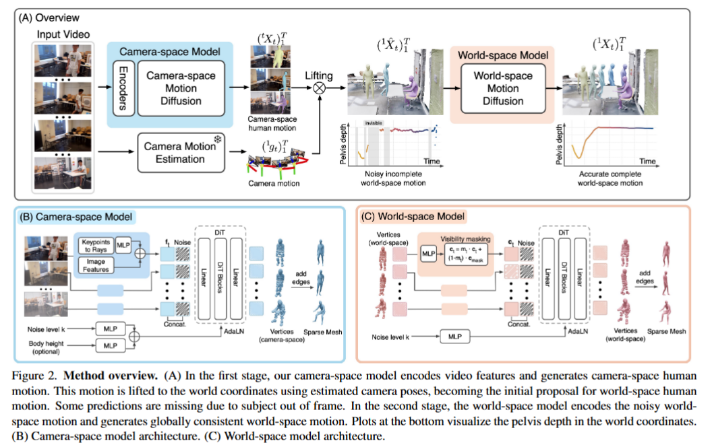

# DuoMo: Dual Motion Diffusion for World-Space Human Reconstruction - [ArXiv_2026] 

> arXiv:2603.03265v1 [cs.CV] 

### 一、引言与核心问题

在计算机视觉与图形学领域，从单目动态视频中感知并重建三维人体运动，是理解人类行为、构建增强现实（AR/VR）交互以及进行虚拟内容生成的基石。传统的动作捕捉（Motion Capture）依赖于受控的实验室环境，而现有的单目重建技术正努力向“In-the-wild”（无约束自然场景）演进，力求在统一的世界坐标系（World-space）下恢复一致且物理合理的人体运动。

**论文试图解决的核心任务是什么？**
本研究的核心任务是从带有噪声相机运动或不完整观测（如遮挡、截断）的单目无约束视频中，准确地重建出处于世界坐标系下的三维人体运动序列。

*   **输入 (Input)**: 
    *   包含 $T$ 帧的单目RGB视频序列 $I_{1:T}$。
    *   视频经过预处理提取的**二维密集关键点 (2D Dense Keypoints)** $L_{1:T} \in \mathbb{R}^{T \times 595 \times 2}$。
    *   基于图像提取的**视觉特征 (Image Features)** $F_{1:T}$。
    *   **目标身高 (Subject Height)** 作为条件输入，以缓解单目重建中的尺度模糊（Scale Ambiguity）问题。
    *   整体的数据输入维度在时间轴上设定为序列长度 $T=120$。
*   **输出 (Output)**: 
    *   在世界坐标系下的**三维稀疏网格顶点序列 (Sparse Mesh Vertices)** $^1X_{1:T} \in \mathbb{R}^{T \times 595 \times 3}$。该网格包含 $V=595$ 个顶点（基于MHR的LOD6级别），直接表征人体的姿态和形状，而不依赖中间的参数化模型（如SMPL）。
*   **任务的应用场景**: 扩展现实（XR）中的沉浸式交互、影视特效中的无标记动作捕捉、自动驾驶场景下的行人意图预测，以及具身智能（Embodied AI）的模仿学习数据构建。
*   **当前任务的挑战 (Pain Points)**: 目前的单目世界坐标系重建面临一个根本的**权衡（Trade-off）**：
    1.  **泛化性瓶颈**：端到端直接预测世界坐标的模型（如WHAM, GVHMR）往往在复杂的“In-the-wild”场景中表现不佳，因为它们严重受限于动捕棚数据集的运动分布。
    2.  **全局一致性缺失**：基于“提升（Lifting）”的方法首先在相机坐标系下预测人体，然后通过估计的相机轨迹转换到世界坐标系。这种方法虽然能较好地泛化到野外视频，但相机轨迹估计的微小误差（SLAM漂移）和深度模糊会直接导致世界坐标系下的人体出现严重的“脚部滑动（Foot Skating）”和物理不合理性。此外，将局部空间对齐到统一的规范化空间（如强行估计重力方向和地平面）在楼梯、斜坡等野外地形中极易失效。
*   **论文针对的难点**: 本文旨在打破上述泛化性与全局一致性的权衡，同时摆脱对全局地平面/重力方向的刚性依赖，并克服对参数化人体模型（SMPL）低维流形的依赖，实现更直接、更鲁棒的几何网格生成。

### 二、核心思想与主要贡献

**直观动机与设计体现**: 
既然单步端到端模型难以兼顾“从2D图像理解局部姿态”和“在3D世界中维持物理法则”，作者直观地提出：将这两个高度耦合的任务**解耦（Factorization）**。这一动机直接体现在本文提出的**双重运动扩散（Dual Motion Diffusion, DuoMo）**架构中。模型被拆分为两个独立的扩散模型（Diffusion Models）：一个负责在相机空间“看懂视频”，另一个负责在世界空间“理顺物理”。两者之间通过明确的几何提升（Geometric Lifting）操作连接，将局部估计的误差暴露为世界空间模型的“噪声输入”，从而利用生成模型的强大去噪能力进行全局一致性修复。

**与相关工作的比较与创新**: 
与TRAM、PromptHMR等基于Lifting的方法相比，DuoMo并未止步于简单的坐标转换或后处理优化，而是引入了一个强大的时序生成先验来精炼世界坐标系下的运动；与WHAM、GVHMR等直接预测方法相比，DuoMo不强制要求将人体对齐到一个规范的重力坐标系，而是巧妙地将**每个视频的首帧相机坐标系作为局部的“世界坐标系”**，这极大提升了模型在野外复杂地形下的鲁棒性。

**核心贡献与创新点**:
1.  **DuoMo双阶段扩散架构**: 提出了一种将人体运动重建解耦为“相机空间估计”和“世界空间精炼”的双扩散生成模型框架，有效兼顾了野外泛化能力与全局物理一致性。
2.  **Per-video坐标系建模**: 世界空间扩散模型被训练在“每视频独立”（相对于初始相机姿态）的坐标系下进行去噪，完全避开了容易出错的全局地面/重力对齐。
3.  **直接的网格顶点生成与接触约束**: 网络抛弃了回归SMPLX低维参数的传统路径，直接生成595个三维网格顶点的运动，并通过训练时的隐式接触损失（Contact Loss）有效消除了脚部滑动。

### 三、论文方法论 (The Proposed Pipeline)

**整体架构概述**:
DuoMo的Pipeline包含三大核心阶段：首先，**相机空间扩散模型**以视频特征和2D关键点为条件，生成相机视角下的三维网格顶点和根节点位置；接着，执行**几何提升（Geometric Lifting）**，利用估计的相机姿态将上述相机空间预测转换到以首帧为原点的世界坐标系中，形成一个包含深度的不准确、带噪声的运动提案（Noisy Proposal）；最后，**世界空间扩散模型**将这个噪声提案作为引导条件，生成平滑、物理一致且无脚部滑动的最终世界坐标系三维网格序列。在推理阶段，通过重投影和位移引导（Guided Sampling）进一步修正遮挡导致的漂移。

**详细网络架构与数据流**:

*   **数据预处理**: 
    给定视频 $I_{1:T}$，首先使用ViTPose提取23个稀疏关键点，随后送入冻结的SAM 3D Body网络生成密集的2D表面关键点 $L_{1:T} \in \mathbb{R}^{T \times 595 \times 2}$。同时，使用PromptHMR（或HMR2）提取图像帧的视觉特征 $F_{1:T}$。

*   **相机空间扩散模型 (Camera-space DiT)**:
    *   **输入与形状变换**: 该阶段旨在学习分布 $p(X_{cam} | L_{1:T}, F_{1:T}, h)$，其中 $h$ 为身高条件。输入为加噪的相机空间顶点 $P_t$ 和根节点 $r_t$（拼接后Shape为 $[B, T, 595 \times 3 + 3]$）。
    *   **DiT层设计**: 网络采用Diffusion Transformer (DiT) 架构。包含 $N=8$ 层自注意力层（Self-attention layers），模型维度 $d_{model} = 512$，具有8个注意力头（Attention Heads），前馈网络（FFN）隐藏层维度为2048。
    *   **条件注入**: 2D密集关键点 $L_{1:T}$、图像特征 $F_{1:T}$ 以及标量身高 $h$ 通过交叉注意力（Cross-attention）或自适应层归一化（AdaLN）作为Condition注入DiT。对于遮挡帧，通过阈值判断将不可见关键点的特征替换为可学习的Null Token。
    *   **输出**: 预测的无噪声相机空间顶点 $P_t$ 和根节点平移 $r_t$。

*   **几何提升中继 (Geometric Lifting)**:
    *   获取视频的相机外参序列 $g_t \in SE(3)$。
    *   将相机空间的顶点转换到世界空间（相对于视频第1帧）：$^1X_{t, noisy} = g_{1}^{-1} g_t(P_t + r_t)$。这一步得到的提案暴露了所有的相机姿态误差和单目深度模糊。

*   **世界空间扩散模型 (World-space DiT)**:
    *   **输入与形状变换**: 旨在学习全局一致的分布 $p(^1X_{1:T} | ^1X_{1:T, noisy})$。输入为加噪的世界空间运动 $^1X_{1:T}$。Shape为 $[B, T, 595 \times 3]$。
    *   **DiT层设计**: 结构与前置模型完全一致（8层DiT，512维，2048 FFN）。
    *   **条件注入**: 上一步生成的带噪提案 $^1X_{t, noisy}$ 被编码并作为条件输入，引导去噪过程逼近视频的实际观测。
    *   **推理引导 (Guided Sampling)**: 在DDIM采样期间，引入额外的梯度更新 $\hat{x}_0$ 以控制采样轨迹：
        1.  **2D重投影引导 ($L_{repro}$)**：计算生成的世界坐标系顶点重投影回图像平面后，与2D关键点 $L_t$ 的误差，防止长期运动漂移。
        2.  **位移引导 ($L_{disp}$)**：专门针对长时遮挡（>2秒）。计算遮挡前后的世界空间位移差与在此期间生成的根节点速度积分的误差，强制模型在遮挡结束后“对齐”到人的重新出现位置。

*   **基于MLP的SMPLX转换器 (可选输出)**:
    为了与主流基准对比，设计了一个级联MLP网络（包含3个Stage）。以零初始化的SMPLX参数为起点，计算预测的SMPLX稀疏网格与DiT输出网格的3D顶点误差，MLP吸收这些误差并迭代预测SMPLX参数 $\Delta\theta, \Delta\beta$。相比优化方法，此网络转换极快且能避免局部最优。

**损失函数 (Loss Function)**:
两个扩散模型采用预测干净数据（$\hat{x}_0$预测）的机制，分别进行独立训练：
1.  **相机空间损失**: $L_{Camera-space} = L_{vertices} + L_{position} + L_{joints}$。全部采用L1范数，监督网络输出的顶点坐标、根节点平移和回归出的人体关节点。
2.  **世界空间损失**: $L_{World-space} = L_{vertices} + L_{velocity} + L_{contact}$。
    *   *设计理念与作用*: 前两项监督世界坐标系下的绝对顶点位置和运动速度（防止抖动）。
    *   **核心亮点 ($L_{contact}$)**: 仅在人脚接触地面的帧（集合 $S$）上激活的L1顶点惩罚：
        $L_{contact} = \frac{1}{|S|} \sum_{t \in S} \left\| ^1X_{t,foot} - ^1X^*_{t,foot} \right\|_1$
        以往的方法通常依赖后处理的脚部锁定（Foot-locking），而DuoMo通过这一损失在训练DiT时就将物理合理的接触状态注入了生成先验中，从源头上减少了Foot Skating现象。

**数据集 (Dataset)**:
*   **训练集**: 结合了大规模动捕数据集 AMASS、Goliath 和合成/自然视频数据集 BEDLAM、3DPW。对于AMASS，作者模拟了类似WHAM的合成相机运动来生成训练对。密集关键点检测模型使用BEDLAM的3D标注转化为2D表面点进行训练。
*   **训练策略增强**: 为了促使扩散模型在早期步数给出优良估计，在采样时间步 $k$ 时进行了特殊增强：50%均匀采样，50%强制令 $k=1000$（完全噪声，模拟极度损坏的输入）。

### 四、实验结果与分析

**核心实验结果**:
DuoMo在主流世界坐标系重建数据集EMDB和RICH上均达到了State-of-the-Art，尤其是在全局度量（W-MPJPE）上展现了断崖式的领先。

| 指标 (Dataset: EMDB) | WHAM (直接预测) | GVHMR (直接预测) | GENMO (直接预测) | TRAM (提升法) | 本文方法 (DuoMo) | 提升幅度              |
| -------------------- | --------------- | ---------------- | ---------------- | ------------- | ---------------- | --------------------- |
| W-MPJPE (mm) ↓       | 354.8           | 276.5            | 202.1            | 222.4         | **167.1**        | **约17%**相对于第二名 |
| WA-MPJPE (mm) ↓      | 135.6           | 111.0            | 74.3             | 76.4          | **66.0**         | 约11%                 |
| RTE (%) ↓            | 6.0             | 2.0              | 1.2              | 1.4           | **1.1**          | -                     |
| Foot Skating ↓       | 4.4             | 3.5              | 8.8              | 11.0          | **3.7**          | 媲美带后处理的GVHMR   |

*(注: W-MPJPE仅对齐首末两帧，极其严苛地考察了全局漂移；WA-MPJPE为100帧片段级对齐。)*

**消融研究解读**:
1.  **架构解耦的必要性 (Dual Priors)**：在消融实验中，若仅使用“相机模型+直接提升”，运动极其不平滑且脚滑严重（Foot Skating 9.2）；若仅训练一个“端到端世界空间模型”，则预测不够准确（W-MPJPE 445.1）。DuoMo将两者结合，W-MPJPE骤降至167.1，证明了两阶段解耦——即在二维视觉证据和三维物理先验间做缓冲——的必要性。
2.  **相机误差鲁棒性分析**：作者模拟了不同级别的SLAM相机平移和旋转噪声。随着噪声增加，“直接提升法”的误差呈爆炸式增长，而DuoMo的W-MPJPE退化非常平缓。这有力地证明了**世界空间DiT本质上充当了一个强大的生成式正则化器（Generative Regularizer）**，它能牺牲微小的逐帧贴合度来换取整体物理运动的合理性与鲁棒性。

**可视化结果分析**:
在Egobody（第一视角头显佩戴者拍摄，晃动剧烈且包含大量截断和遮挡）的定性结果中，由于引入了采样期间的**重投影与位移引导（Guided Sampling）**，DuoMo即使在目标走出画面长达数秒后，依然能合理推断其在世界空间中的运动轨迹，并在人物重新入画时完美无缝对齐。相比之下，PromptHMR在深度模糊下崩溃，GVHMR则因剧烈相机运动发生严重漂移。

### 五、方法优势与深层分析

**架构/设计优势**:
1.  **优雅地化解病态问题（Ill-posed Problem）**: 从2D视频重建3D世界坐标系不仅存在深度模糊（单目视觉的固有缺陷），还叠加了相机运动（Ego-motion）的耦合。DuoMo的优势在于其**分而治之**的哲学。第一层DiT专注于解决“人是什么姿态”的视觉感知问题，它充分利用图像特征；第二层DiT则被剥离了视觉信息，变成了一个纯粹的三维物理运动去噪器。这种模块化设计使得特征提取和物理约束各司其职，大大降低了网络的学习难度。
2.  **相对局部世界坐标系的降维打击**: 试图在野外视频中估计全局重力方向（像GVHMR那样）是脆弱的，特别是在带有楼梯或复杂起伏的场景中。DuoMo将每个视频的“世界”锚定在第一帧相机的坐标下。在这个相对世界中，重力方向虽然可能不平行于Y轴，但人体运动本身的局部平滑性、接触点的相对静止属性依然是守恒的。DiT强大的模式匹配能力足以在这个非规范空间中去噪，这在原理上极大地增强了泛化能力。
3.  **网格顶点扩散的几何优越性**: 直接对稀疏网格 $X \in \mathbb{R}^{V \times 3}$ 施加扩散过程，而非SMPL的轴角（Axis-angle）参数。这使得网络能更直接地感知非线性的空间距离和接触关系。旋转参数的微小扰动会导致人体肢端产生巨大的几何位移，而在欧氏空间直接扩散顶点则具有更好、更平滑的梯度表现，这也是模型能在不使用复杂IK优化的前提下，仅靠接触损失 $L_{contact}$ 就解决脚滑的原因。

**解决难点的思想与实践**:
面对“局部泛化好但全局漂移”的难点，DuoMo的核心思想是将**“误差视为噪声”**。通过显式的几何映射（Lifting），将第一阶段产生的深度误差、SLAM相机漂移统一建模为三维轨迹的高斯或结构化噪声。然后，引入预训练在海量真实人体三维轨迹上的扩散模型，在采样的过程中自然地“抹平”这些违背物理常理的噪声点，这是一种利用数据驱动先验对抗几何不确定性的绝佳实践。

### 六、结论与个人思考 

**结论**: DuoMo通过创新的双重运动扩散架构，成功解耦了相机空间感知与世界空间一致性约束。其相对世界坐标系的设定和直接网格生成的策略，使其在极具挑战的“In-the-wild”数据集上实现了具有统治力的性能提升，显著降低了轨迹漂移和脚部滑动。

**潜在局限性**:
1.  **三维场景感知缺失**: 尽管模型生成了平滑的轨迹，但由于输入不包含任何环境的三维几何信息（如深度图、点云或SDF表征），生成的人体在复杂场景中不可避免地会出现与环境的穿模（Penetration）现象。
2.  **不确定性建模的硬阈值化**: 处理遮挡时，论文简单地依赖2D关键点检测模型的置信度阈值来决定是否用Null Token替换特征。这种二值化处理丢弃了检测网络输出的“软”不确定性概率，可能在半遮挡或运动模糊时引发不连贯。

**未来工作方向**:
1.  **场景约束的扩散引导**: 可以在推理阶段的 Guided Sampling 中，引入基于3D Gaussian Splatting 或 NeRF 渲染出的场景深度，增加一个类似于**碰撞惩罚（Collision Penalty）**或**环境接触引导（Environment Contact Guidance）**的梯度项，以实现真正 Scene-aware 的运动重建。
2.  **基于统一隐空间的连续重建**: 探索将这两种模型进一步融合为Latent Diffusion，利用统一的隐空间（Latent Space）编码同时处理图像特征与物理轨迹，可能会带来更快的推理速度（目前处理20秒视频仍需约35秒）。

**对个人研究的启发**:
本论文带来的最大启发在于**“如何优雅地使用扩散模型作为后处理/正则化器”**。在许多3D视觉任务（如SLAM、3D物体重建）中，我们往往被前端不可避免的噪声和误差所困扰。与其花费巨大精力设计复杂的后处理优化模块（如各类复杂的Bundle Adjustment或能量函数），不如将含有误差的初筛结果直接视为带噪样本（Noisy Proposal），训练一个针对该领域先验的扩散去噪模型。这种“生成即滤波”的范式，极有可能在未来取代绝大多数人工设计的三维平滑和优化算法。