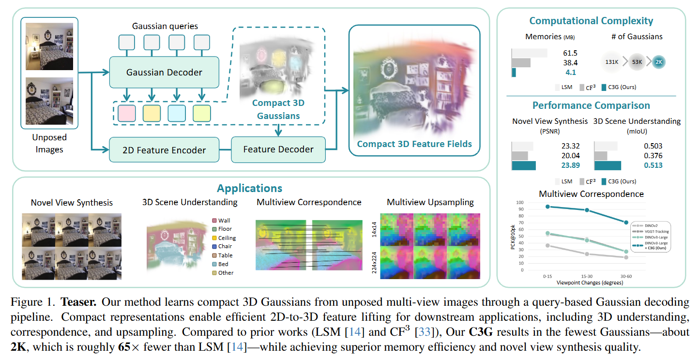
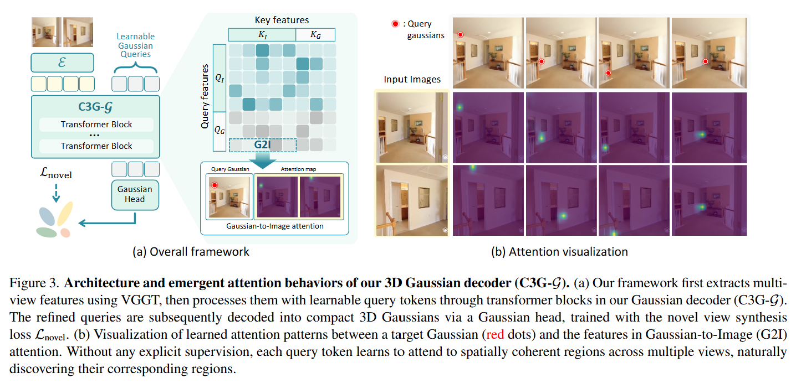
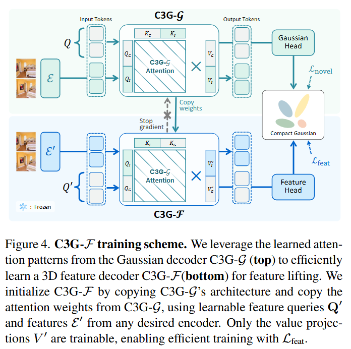
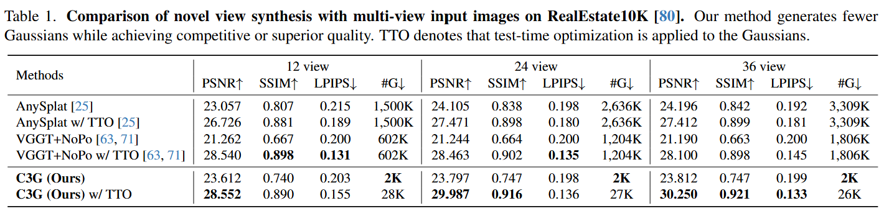

# C3G: Learning Compact 3D Representations with 2K Gaussians - ArXiv 2025

> **ArXiv ID**: [2512.04021](https://arxiv.org/abs/2512.04021)
> **Code**: [GitHub - cvlab-kaist/C3G](https://github.com/cvlab-kaist/C3G)

### 一、引言与核心问题

本论文针对的是从**稀疏视角（Sparse Views）**图像进行**3D场景重建（3D Reconstruction）**与**场景理解（Scene Understanding）**的任务。现有的主流前馈（Feed-forward）3D Gaussian Splatting (3DGS) 方法虽然速度快，但生成的3D表示冗余度极高，导致存储、计算和下游任务（如特征提升）效率低下。C3G 提出了一种能生成极其紧凑（仅约2000个高斯基元）且几何意义明确的3D表示框架。

*   **核心任务**: 从无位姿（Unposed）或稀疏的多视角图像中，直接预测出一个紧凑的3D Gaussian集合，用于新视角合成（Novel View Synthesis, NVS）和3D语义分割。
    *   **输入 (Input)**: 多张2D RGB图像。维度通常为 `[Batch_size, Num_views, 3, Height, Width]`。支持从少量（如2张）到多张图像的输入。
    *   **输出 (Output)**: 一个紧凑的3D Gaussian集合。维度为 `[Batch_size, Num_gaussians, Attributes]`，其中 `Num_gaussians` 约为 2048（相比传统方法的十万/百万级有显著减少）。属性包括位置、协方差（旋转+缩放）、不透明度、球谐系数（SH）以及可选的语义特征向量。
    *   **应用场景**: 3D场景重建、新视角合成、开放词汇3D场景分割（Open-vocabulary 3D Segmentation）、多视角特征聚合。

*   **当前痛点 (Pain Points)**:
    1.  **极度冗余**: 现有的前馈网络（如 pixelSplat, MVSplat, LSM）通常采用**逐像素（Per-pixel）**预测策略，即为输入图像的每个像素预测一个或多个高斯球。这导致高斯数量随输入分辨率线性增长（通常达百万级），但这其中大部分是冗余的或对几何贡献微小的。
    2.  **特征提升（Feature Lifting）困难**: 将2D基础模型（如CLIP, DINO, LSeg）的特征提升到3D时，由于高斯数量庞大，计算和存储开销巨大。现有方法往往被迫使用自编码器压缩特征维度，导致信息丢失。
    3.  **多视角不一致**: 独立提取的2D特征在不同视角间往往缺乏一致性，直接映射到3D会产生伪影。

*   **论文聚焦**: 本文旨在打破“像素-高斯”的一一对应束缚，通过**可学习的查询（Learnable Queries）**机制，仅在场景的关键几何位置生成少量高斯球，同时利用注意力机制解决特征一致性问题。

### 二、核心思想与主要贡献

*   **直观动机**: 人类理解场景时，并不会处理视网膜上的每一个像素，而是关注关键的物体和几何结构。同理，3D表示也不应受限于输入图像的像素网格。如果我们能用一组“查询向量”去主动“询问”图像中的几何信息，就能用极少量的基元表征整个场景。

*   **与相关工作的比较**:
    *   相比 **LSM / pixelSplat** (预测 ~130k+ Gaussians): C3G 仅使用 ~2k Gaussians，内存占用减少约 15 倍（4.1MB vs 61.5MB）。
    *   相比 **Feature-3DGS / CF3** (优化型方法): C3G 是前馈网络，无需通过繁琐的逐场景优化（Per-scene Optimization）即可生成特征场，且推理速度极快。

*   **核心贡献**:
    1.  **C3G-G (Geometry Decoder)**: 提出了一种基于Transformer的几何解码器，利用一组可学习的查询（Query Tokens）通过自注意力机制从多视角图像中聚合信息，直接解码出紧凑的3D Gaussians。
    2.  **C3G-F (Feature Decoder)**: 发现并利用了C3G-G中产生的**注意力图（Attention Maps）**具有天然的多视角对应能力。C3G-F **复用**这些注意力权重，将任意2D基础模型（VFM）的特征“灌注（Instill）”到3D高斯中，实现了无需繁重计算的高效特征提升。
    3.  **Emergent Consistency**: 即使没有显式的几何监督（仅靠RGB重建损失），模型也能自动学会将查询关注到具有几何一致性的物体区域。

### 三、论文方法论 (The Proposed Pipeline)

C3G 的整体 Pipeline 分为两个阶段：首先通过 **C3G-G** 从RGB图像解码几何（高斯参数），然后通过 **C3G-F** 利用几何解码器的注意力模式，将语义特征提升到这些高斯上。

#### 1. C3G-G: Compact 3D Gaussian Decoder

这是核心架构，负责从图像生成几何。

*   **数据流与网络架构**:
    1.  **图像编码 (Backbone)**:
        *   输入多视角图像 `I` (`[B, V, 3, H, W]`)。
        *   使用预训练的 **VGGT** (Visual Geometry Grounding on Transformers) 或 DINOv3 作为 Backbone `E(·)`。
        *   输出图像特征图 `F`，维度为 `[B, V, C, H', W']`。在代码实现中，这些特征被展平为 Tokens 序列。
    
    2.  **可学习查询 (Learnable Gaussian Queries)**:
        *   初始化一组固定的可学习参数 `Q`，形状为 `[Num_Gaussians, D]` (代码中默认 `Num_Gaussians=2048`, `D=2048`)。每个 Query 代表一个潜在的3D高斯基元。

    3.  **Transformer Decoder (GMAE)**:
        *   **拼接**: 将图像特征 Tokens `F` 和高斯查询 Tokens `Q` 拼接成一个长序列 `[F; Q]`。
        *   **自注意力 (Self-Attention)**: 输入到 `L=2` 层标准的 Transformer Decoder 中。
        *   **交互机制**: 这里的关键在于，高斯 Query 会通过自注意力机制查询图像 Tokens。由于是全自注意力（Full Self-Attention），Query 之间也会交互，这有助于它们“协商”各自负责的区域，避免重叠和冗余。
        *   **输出**: 经过 Transformer 处理后的 Refined Gaussian Tokens `Q'`。

    4.  **高斯头 (Gaussian Heads)**:
        *   使用轻量级的 MLP (`self.gmae_to_gaussians`) 将每个 `Q'` 解码为 3D Gaussian 的属性：
            *   **位置 (Means)**: 预测相对于预定义 Anchor 的偏移或绝对坐标。
            *   **不透明度 (Opacity)**: 通过 Sigmoid 激活。
            *   **协方差**: 预测缩放 (Scale) 和旋转 (Rotation, 四元数)。
            *   **颜色**: 预测球谐系数 (SH)。

    5.  **低通滤波训练策略 (Progressive Low-pass Filter)**:
        *   为了防止高斯在训练早期陷入局部极小值（因为位置预测不准导致梯度消失），引入了渐进式低通滤波器。
        *   具体实现是在 2D 投影时，人为增大高斯的 2D 半径（通过添加 `sI` 到协方差矩阵）。`s` 从初始的大值（如 10）随训练步数逐渐衰减到 0.3。

#### 2. C3G-F: Any-Feature 3D Lifting

这是利用几何先验进行特征提升的模块。

*   **核心洞察**: C3G-G 中的 Attention Map ($A = \text{Softmax}(Q K^T)$) 实际上已经编码了“哪个高斯对应图像的哪个区域”。
*   **架构复用**:
    *   C3G-F 的架构与 C3G-G 完全相同（复制权重）。
    *   **冻结注意力**: 在训练 C3G-F 时，**冻结** Transformer 中的 Key 和 Query 投影层（即固定 Attention Map），只训练 Value 投影层。
    *   **特征灌注 (Instill Transformer)**:
        *   输入: 任意 2D VFM 提取的特征 `F_feat` (如 LSeg, DINO)。
        *   过程: 使用 C3G-G 预先计算好的 Attention 权重，对 `F_feat` 进行加权聚合。
        *   **InstillAttention 模块**: 计算公式为 $Y_{out} = \text{Attention}(Q_{geo}, K_{geo}, V_{feat})$。即用几何的“眼”（Attention）去提取特征的“值”（Value）。
    *   **输出**: 每个高斯获得一个高维特征向量 `f_i`。

#### 3. 损失函数 (Loss Function)

*   **几何损失 (`L_novel`)**:
    *   在新视角渲染 RGB 图像，计算 **MSE Loss** 和 **LPIPS Loss**。
    *

$$
L_{novel} = \lambda_{MSE} \| \hat{I} - I_{gt} \|^2 + \lambda_{LPIPS} \text{LPIPS}(\hat{I}, I_{gt})
$$

*   **特征损失 (`L_feat`)**:
    *   如果训练 C3G-F，会增加特征渲染损失。
    *   将高斯特征渲染成 2D 特征图 $\hat{F}_{render}$。
    *   计算其与 2D VFM 提取的特征图 $F_{gt}$ 之间的 **Cosine Similarity Loss**。
    *   **注意**: 这里的 $F_{gt}$ 是直接从 VFM 提取的，无需 ground truth 语义标签。

### 四、实验结果与分析

*   **新视角合成 (RealEstate10K)**:
    *   在包含 12, 24, 36 张输入视角的设置下，C3G 仅用 **2K** 个高斯，就达到了与 AnySplat (使用 ~2600K 高斯) 相当甚至更好的 PSNR/SSIM 性能。
    *   **Test-Time Optimization (TTO)**: 经过短时间的测试时优化，C3G 的性能大幅超越 Baseline。这说明 C3G 预测的初始几何非常鲁棒，是极佳的优化起点。

*   **3D 场景理解 (ScanNet, Replica)**:
    *   **mIoU**: 在开放词汇分割任务上，C3G 超过了 LSM (Feed-forward) 和 CF3 (Per-scene Optimization)。
    *   **存储**: C3G 仅需 **4.1MB** 显存，而 LSM 需要 61.5MB，Feature-3DGS 需要 800MB+。
    *   **特征质量**: 实验表明，渲染出的特征图（Rendered Features）比直接从目标视角提取的特征图质量更高，证明了 C3G 具有多视角特征聚合和去噪的能力。

*   **多视角一致性 (Probe3D)**:
    *   在两视图对应点匹配任务中，使用 C3G 聚合后的特征（VGGT/DINOv3）相比原始特征，在 PCK@10px 指标上有巨大提升（例如从 ~34% 提升到 ~68%）。

### 五、方法优势与深层分析

1.  **打破“像素束缚”的查询机制**:
    *   传统方法被像素网格束缚，必须为平坦的墙壁或空旷区域预测大量无用高斯。C3G 通过 Transformer Decoder 的全局感受野和自注意力，允许模型自主决定“哪里需要高斯”。这种稀疏性是**自适应**的，类似于 DETR 在目标检测中去除 Anchor 的思路。

2.  **Attention Map 作为几何桥梁**:
    *   C3G-F 的设计非常精妙。它没有重新学习如何聚合特征，而是直接信任 C3G-G 学到的几何对应关系。这不仅节省了计算量（无需反向投影），而且保证了特征聚合在几何上是正确的（Geometrically Consistent）。这也解释了为什么它能解决多视角特征不一致的问题——它实际上是在 3D 空间中对特征进行了加权平均。

3.  **高效性与可扩展性**:
    *   由于高斯数量极少，渲染速度极快，且内存占用极低。这使得 C3G 非常适合移动端部署或大规模场景的实时交互。

### 六、结论与个人思考

*   **结论**: C3G 证明了 massive, per-pixel 的 3D 表示并非必须。通过精心设计的查询机制，极少量（~2K）的高斯基元足以高质量地表征复杂场景的几何和外观。这种紧凑表示对下游任务（如分割、编辑）极为友好。

*   **潜在局限性**:
    *   **细节丢失**: 虽然 2K 高斯对于结构重建足够，但对于极高频的纹理细节（如复杂的织物图案、文字），可能会因为基元数量不足而导致模糊。
    *   **泛化性依赖**: 模型的几何能力很大程度上依赖于强大的 Backbone (VGGT/DINOv3)。如果 Backbone 在某些域外数据上失效，C3G 的查询机制可能无法正确定位。

*   **未来工作方向**:
    *   **自适应高斯数量**: 目前是固定的 2048 个，未来可以设计动态 Token 数量机制，根据场景复杂度自动增减高斯。
    *   **生成式应用**: 这种紧凑的 Token 表示非常适合作为 Latent Diffusion Model 的输入，用于文本到 3D 的生成任务。

*   **个人启发**: C3G 再次印证了 "Less is More" 在 3D 视觉中的潜力。它提供了一种将 2D Foundation Models 的强大能力“无损”且“低成本”地注入 3D 空间的范式。这种利用 Attention Map 进行 Cross-modal 知识蒸馏的思路非常值得借鉴。