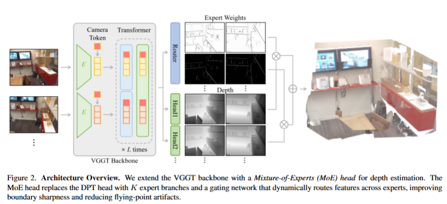

# MoE3D: A Mixture-of-Experts Module for 3D Reconstruction - arXiv 2026

> **Paper Link**: [arXiv:2601.05208v1](https://arxiv.org/abs/2601.05208)

### 一、引言与核心问题 (Introduction & Core Problem)

随着深度学习的发展，三维重建领域正经历从传统基于优化的方法（如Structure-from-Motion, SfM）向基于Transformer的前馈回归模型（如DUSt3R, VGGT）转变。这些新兴模型展现了强大的灵活性，能够直接从图像回归几何属性。然而，这篇论文指出了当前前馈式三维重建模型面临的一个关键瓶颈：**深度边界的模糊与“飞点”伪影（Flying Artifacts）**。

#### 核心任务与输入输出
*   **输入 (Input)**: 模型接收通过单个或多个视角的RGB图像序列。假设输入图像序列为 $(I_i)_{i=1}^N$，单张图像的数据维度通常为 $[3, H, W]$。在论文的实验设置中，使用了如 $518 \times 378$ (Hypersim) 和 $518 \times 154$ (VKITTI) 的分辨率，但模型设计支持任意分辨率输入。
*   **输出 (Output)**: 模型旨在输出每帧对应的稠密几何属性，包括：
    *   **深度图 (Depth Map)** $D_i \in \mathbb{R}^{H \times W}$。
    *   **点云图 (Point Map)** $P_i \in \mathbb{R}^{3 \times H \times W}$，即每个像素对应的世界坐标系下的3D点。
    *   **相机参数 (Camera Parameters)** $C_i$，包含外参（旋转和平移）及内参。
*   **应用场景**: 该技术广泛应用于机器人导航、自动驾驶环境感知、AR/VR内容生成以及基于图像的三维资产建模。

#### 核心痛点与挑战
尽管DUSt3R和VGGT等模型在全局几何恢复上表现出色，但在处理**深度不连续区域（Depth Discontinuities）**时面临严峻挑战。
1.  **多模态不确定性**: 在物体边缘，像素的真实深度往往呈现多模态分布（前景与背景的突变）。
2.  **回归损失的平均化效应**: 现有的模型通常使用单一的回归头配合 $\mathcal{L}_1$ 或 $\mathcal{L}_2$ 损失进行训练。为了最小化这种多模态分布下的误差，模型倾向于预测前景与背景深度的**平均值**。
3.  **结果**: 这种统计学上的平均导致了深度图边缘的模糊，并在3D空间中产生了连接前景与背景的“飞点”或“拉丝”现象，严重破坏了重建的几何质量。

### 二、核心思想与主要贡献 (Core Idea & Contributions)

本研究的直观动机在于：既然单个回归头无法同时妥善处理平滑区域和深度跳变区域的不确定性，那么是否可以引入**专家分工（Specialization）**机制？

作者受到大语言模型中混合专家（Mixture-of-Experts, MoE）架构的启发，提出了一种空间自适应的MoE设计。与传统MoE用于扩展模型容量不同，这里的MoE被用于**解决几何歧义**。通过在像素级别动态选择不同的“深度专家”，模型可以让某些专家专注于平滑表面，而让其他专家专注于处理高频的边缘突变，从而避免了单一预测头的平均化效应。

**主要贡献如下**：
1.  **MoE3D模块**: 提出了一种轻量级的混合专家深度预测头，能够无缝集成到现有的Transformer重建模型（如VGGT）中。该模块在保持前馈推理效率的同时，显著提升了边界锐度。
2.  **熵正则化策略**: 引入了针对门控网络（Gating Network）的逆熵正则化（Inverse Entropy Regularization），强制模型在像素级做出“硬选择”，进一步锐化了专家之间的分工边界。
3.  **性能提升**: 在仅增加约7%推理计算开销的情况下，该方法在NRGBD数据集上的多视图重建精度提升了30%以上，并在单目深度估计任务中有效消除了飞点伪影。

### 三、论文方法论 (The Proposed Pipeline)

#### 1. 整体架构概述

MoE3D建立在SOTA模型 **VGGT (Visual Geometry Grounded Transformer)** 之上。整体Pipeline保持了VGGT的“编码器-解码器”结构：图像序列首先通过共享的Transformer编码器提取特征，通过交叉注意力机制融合多视图信息。随后，解码器分支分别预测相机参数和几何信息。本文的核心改动在于将原有的标准深度预测头（DPT Head）替换为了**MoE DPT Head**。

#### 2. 详细网络架构与数据流

*   **Backbone (VGGT)**: 采用ViT作为骨干网络，处理输入的图像Patch。这一部分在微调阶段通常保持冻结（Frozen），以利用预训练的强大语义特征，同时避免灾难性遗忘。
*   **MoE DPT Head (深度预测头)**:
    *   **位置**: MoE模块并未应用于Transformer的Token层级，而是放置在DPT解码器的末端。具体来说，是在特征图经过一系列RefineNet融合并双线性插值恢复到全分辨率 $(H, W)$ 之后，进入最终卷积块之前。
    *   **专家设计 (Experts)**: 定义了 $K$ 个并行的专家网络。每个专家是一个轻量级的卷积子网络（由DPT预训练权重初始化并添加微小高斯扰动 $\mathcal{N}(0, \sigma^2)$ 以打破对称性）。输入为解码后的高分辨率特征图 $F \in \mathbb{R}^{C \times H \times W}$，输出为候选深度图 $D_k \in \mathbb{R}^{H \times W}$。
    *   **门控网络 (Gating Network)**: 一个并行的卷积分支 $g(\cdot)$，输入同样的特征图 $F$，输出每个像素点对 $K$ 个专家的权重logits。
    *   **混合机制**: 最终的深度预测 $D$ 是各专家预测的加权和：

$$
D(p) = \sum_{k=1}^{K} w_k(p) \cdot D_k(p)
$$

其中，$w_k(p) = \text{softmax}(g(F))_k$ 是像素 $p$ 处第 $k$ 个专家的归一化权重。

*   **数据流维度变化**:
    Input Images $[B, N, 3, H, W]$ $\rightarrow$ Features (ViT) $\rightarrow$ DPT Fusion $\rightarrow$ Dense Feature Map $[B, N, C_{feat}, H, W]$ $\rightarrow$ **MoE Layer** $\rightarrow$ Final Depth $[B, N, H, W]$。

#### 3. 损失函数 (Loss Function)

训练目标由三部分组成：

$$
\mathcal{L} = \lambda_d \mathcal{L}_{MoE} + \lambda_c \mathcal{L}_{camera} + \lambda_e \mathcal{L}_{entropy}
$$

1.  **MoE深度损失 ($\mathcal{L}_{MoE}$)**: 采用标准的 $\mathcal{L}_2$ 回归损失监督最终混合后的深度图与Ground Truth的差异。作者去除了VGGT原有的置信度加权和梯度损失，简化了优化过程。
2.  **相机损失 ($\mathcal{L}_{camera}$)**: 保持VGGT原有的相机参数回归损失，确保几何一致性。
3.  **熵正则化 ($\mathcal{L}_{entropy}$, 核心创新)**:
    为了避免门控网络输出均匀的权重（即退化为简单的模型平均），引入了逆熵损失：

$$
\mathcal{L}_{entropy} = - \frac{1}{HW} \sum_{p} \sum_{k=1}^{K} w_k(p) \log w_k(p)
$$

**设计理念**: 最小化熵会迫使 $w_k(p)$ 分布趋向于One-hot向量（即接近0或1）。这鼓励模型在每个像素点自信地选择一个最适合的专家，从而在深度不连续处实现不同专家负责不同区域（前景/背景）的“硬切割”，物理上对应更锐利的边缘。

#### 4. 数据集 (Dataset)
论文主要在高质量合成数据集上进行微调，以利用其完美的几何真值：
*   **Hypersim**: 包含复杂室内场景，提供无伪影的像素级深度真值。
*   **Virtual KITTI (VKITTI)**: 模拟户外驾驶场景，作为室内数据的补充。
*   **处理策略**: 仅使用 $\ell_2$ 损失进行监督，未启用数据增强，专注于验证架构改进带来的收益。

### 四、实验结果与分析 (Experiments)

#### 1. 核心实验结果
在多视图3D重建任务（NRGBD数据集）上，MoE3D在几何准确性上显著优于基线模型VGGT及其他SOTA方法。

| Method           | Accuracy $\downarrow$ (Mean) | Completeness $\downarrow$ (Mean) | Normal Consistency $\uparrow$ (Mean) |
| :--------------- | :--------------------------- | :------------------------------- | :----------------------------------- |
| DUSt3R           | 0.144                        | 0.245                            | 0.701                                |
| VGGT (Baseline)  | 0.073                        | 0.052                            | 0.769                                |
| **MoE3D (Ours)** | **0.055**                    | **0.035**                        | **0.800**                            |

*解读*: 相比VGGT，MoE3D将Accuracy误差降低了约24%，Completeness误差降低了约32%，法向一致性也有明显提升。这表明模型重建的表面不仅位置更准，而且几何细节（法向）更合理。

在单目深度估计任务（NYU-v2, KITTI等）中，MoE3D同样展现了优越性，特别是在KITTI数据集上取得了最低的绝对相对误差 (AbsRel: 0.064 vs VGGT: 0.076)。

#### 2. 边界质量评估
为了量化“锐利度”，作者在NYU-v2等数据集上提取边缘并计算指标。MoE3D在**F1 Score**和**mIoU**上均大幅领先VGGT（例如在NYU-v2上，F1从0.232提升至0.319），证明了其在处理深度跳变处的优越性。

#### 3. 可视化分析
论文中的定性结果非常直观：
*   **飞点消除**: 在物体边缘（如桌角、显示器边缘），VGGT通常会产生连连看式的“拉丝”网格，而MoE3D生成的点云在这些区域断开得非常干净。
*   **专家分工图**: 可视化门控权重图显示，不同的专家确实自发地分化为处理平滑区域（低频）和处理边缘细节（高频），验证了MoE设计的初衷。

### 五、方法优势与深层分析 (Deep Analysis)

#### 1. 架构设计的深层逻辑
MoE3D之所以成功，核心在于它在**连续回归任务中引入了离散选择机制**。
*   **解耦冲突**: 在深度学习回归任务中，单一网络很难同时拟合低频信号（平滑表面）和高频信号（阶跃边缘）。MoE结构允许网络参数解耦，一部分参数拟合平滑曲面，另一部分参数拟合突变，通过门控网络在空间上拼接。
*   **后融合策略的有效性**: 作者选择在全分辨率特征层之后引入MoE，而不是在Token层。这是因为边界问题本质上是高频的空间细节问题，必须在包含丰富空间信息的Feature Map上操作才最有效。

#### 2. 熵正则化的关键作用
如果没有 $\mathcal{L}_{entropy}$，MoE可能会退化为模型集成（Ensemble），即每个专家都预测差不多的结果，然后取平均。这反而会加剧模糊。通过强制最小化熵，强迫门控网络输出接近One-hot的分布，这在数学上等价于在训练过程中寻找局部最优的单一假设，从而在推理时能够输出锐利的“硬”边缘，而不是模糊的加权平均。

### 六、结论与个人思考 (Conclusion & Thoughts)

#### 1. 结论
MoE3D展示了一种简单而优雅的策略：通过在预训练Transformer的解码端引入带有熵正则化的MoE模块，可以有效解决回归模型固有的边界模糊问题。该方法计算成本低（~7% overhead），但对视觉质量（尤其是3D点云的纯净度）有质的提升。

#### 2. 潜在局限性
*   **对合成数据的依赖**: 论文主要依赖Hypersim和VKITTI等合成数据进行微调。虽然这规避了真实数据中Ground Truth不完美的问题（如LiDAR的稀疏性和噪声），但也可能引入Sim-to-Real的分布偏移，尽管作者声称泛化性良好，但在极端复杂的真实光照下表现仍需验证。
*   **显存消耗**: 虽然计算量增加不多，但K个并行的卷积头和全分辨率的特征图可能会略微增加显存占用。

#### 3. 个人思考与启发
这篇论文提供了一个非常好的思路：**当单一模型的拟合能力受限于数据的多模态分布时，不要盲目增加模型深度，而是尝试在输出端进行结构化的解耦。**
此外，它挑战了“回归模型必然导致平滑”的刻板印象。通过引入类似于分类（门控选择）的机制辅助回归，我们可以鱼与熊掌兼得。这对于其他需要高频细节生成的任务（如法向估计、光流估计）也具有重要的借鉴意义。未来可以探索将这种MoE机制引入到Base Model的预训练阶段，而不仅仅是作为微调模块，或许能学习到更鲁棒的几何表征。