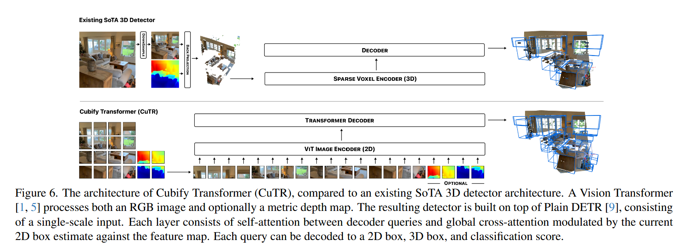

# 论文标题: Cubify Anything: Scaling Indoor 3D Object Detection - arXiv 2024

### 一、引言与核心问题

这篇论文关注室内3D物体检测任务，这是一个在计算机视觉和机器人领域都具有重要应用的研究方向。传统的2D物体检测主要依赖图像信息，而室内3D物体检测则需要从各种深度传感器（如ToF、LiDAR）获取的3D点云或网格数据中识别和定位物体。

*   **论文试图解决的核心任务是什么？**
    *   **输入 (Input)**:
        *   **RGB-D图像**: 论文主要关注从商用手持设备获取的单张RGB(-D)帧作为输入。这意味着输入可以是纯RGB图像，也可以是结合深度信息的RGB-D图像。
        *   **数据维度/Shape**: 对于RGB图像，通常为 `[Batch_size, 3, Height, Width]`，其中 `Height` 为 1024，`Width` 为 768。对于深度图，通常为 `[Batch_size, 1, Depth_Height, Depth_Width]`，其中 `Depth_Height` 为 256，`Depth_Width` 为 192。
    *   **输出 (Output)**:
        *   **3D边界框检测**: 输出是场景中每个被检测物体的9-DOF（自由度）3D边界框。这包括3D中心点（x, y, z）、3D尺寸（长, 宽, 高）以及围绕重力对齐坐标系的偏航角（yaw）。
        *   **数据维度/Shape**: 每个检测到的物体会输出一个包含其3D边界框参数的向量，例如 `[Batch_size, Num_detections, 9]`。
    *   **任务的应用场景**:
        *   **机器人导航与交互**: 机器人可以通过识别和定位周围的物体，更好地理解环境并进行安全的导航和操作。
        *   **增强现实 (AR) 与虚拟现实 (VR)**: 为AR/VR应用提供精确的3D物体位置信息，实现更真实的虚拟物体与现实环境的融合。
        *   **智能家居**: 用于智能设备的环境感知和自动化。
        *   **空间理解**: 帮助AI系统更好地理解物理空间中的物体分布和关系。
    *   **当前任务的挑战 (Pain Points)**:
        *   **数据集规模与多样性限制**: 现有室内3D物体检测数据集（如SUN RGB-D、ScanNet v2、ARKitScenes）通常规模较小，物体类别有限，多样性不足，且标注不够精确或完整，主要关注房间级物体，忽略了大量小物体。
        *   **标注质量与一致性问题**: 现有数据集的3D标注往往基于噪声的3D点云或网格重建，导致3D边界框重投影到2D图像时出现错位、不一致和抖动，影响模型训练的准确性。
        *   **3D表示与归纳偏置**: 大多数现有方法依赖于3D点云或体素表示，并引入复杂的3D归纳偏置（如稀疏卷积、K近邻），这使得模型设计与标注偏置纠缠，增加了计算复杂度，限制了模型的通用性和在不同硬件上的部署。
        *   **场景级而非图像级估计**: 许多3D物体检测方法侧重于场景级理解，而非单帧图像级的精确检测，这在实际应用中具有局限性。
    *   **论文针对的难点**:
        *   **数据集规模、准确性和多样性**: 论文首先通过引入大规模、高精度、多样的CA-1M数据集来解决现有数据集的局限性。
        *   **模型设计与3D归纳偏置**: 论文提出了一种纯Transformer架构的3D物体检测模型CuTR，旨在减少对复杂3D归纳偏置的依赖，使其能够更好地扩展到大规模数据，并提供像素级精确的2D/3D对齐。
        *   **噪声深度图的鲁棒性**: 论文通过其图像基线模型处理商用LiDAR传感器（通常带有噪声）的深度图，并展示了对噪声和不确定性的更强鲁棒性。

### 二、核心思想与主要贡献

*   **直观动机与设计体现**: 论文的直观动机是，现有室内3D物体检测受限于小规模、低质量的数据集以及依赖复杂3D归纳偏置的模型设计，未能充分利用图像丰富的语义信息和深度数据。这种动机体现在：
    *   **构建大规模、高质量数据集**: 引入CA-1M数据集，旨在提供空间上准确、像素级完美的3D物体标注，覆盖更广泛的物体类别和更大的场景范围。
    *   **简化模型架构**: 提出CuTR，一个基于Transformer的3D物体检测器，直接从2D特征预测3D边界框，避免了将输入抬升到3D空间进行处理的复杂性，从而减少了3D归纳偏置的依赖。
    *   **图像级检测**: 将3D物体检测任务重新定位到单帧图像级别，使其更贴近2D物体检测的范式，更具实用性。
*   **与相关工作的比较与创新**: 本研究与现有的点云基方法（如FCAF3D、TR3D、ImVoxelNet）和一些图像基方法（如Cube R-CNN）最为相关。
    *   **数据集方面**: CA-1M在规模、标注精度、物体多样性和2D/3D对齐方面显著优于ARKitScenes、SUN RGB-D和ScanNet++等现有数据集。CA-1M提供了9-DOF的3D边界框，并实现了空间真实感和像素级完美。
    *   **模型设计方面**: CuTR摒弃了点云基方法中常见的复杂3D操作（如稀疏卷积、K近邻），转而采用纯Transformer架构，直接从2D特征预测3D框。这使得模型更易于部署在消费级硬件上，并且在大量数据下表现出更好的泛化能力。
*   **核心贡献与创新点**:
    1.  **大规模、高质量数据集CA-1M**: 引入了一个名为Cubify-Anything 1M (CA-1M) 的新数据集，该数据集通过对ARKitScenes的底层激光扫描场景进行近乎穷尽的、类别不可知的3D物体边界框标注。CA-1M包含超过440K个独立物体，覆盖1000多个场景和3500多个手持设备捕获，最终生成超过1500万帧图像，具有像素级精度的2D/3D对齐，旨在解决现有数据集规模、准确性和多样性的限制。
    2.  **纯Transformer 3D物体检测基线CuTR**: 提出了Cubify Transformer (CuTR)，一个完全基于Transformer的3D物体检测器，它直接从RGB(-D)输入中提取的2D特征预测3D边界框，而无需复杂的3D点云或体素表示。这种设计减少了对3D归纳偏置的依赖，使其在CA-1M大规模数据集上表现优于现有点云基方法，并且能够处理商用LiDAR深度图中的噪声和不确定性。
    3.  **重新评估3D物体检测范式**: 论文通过CA-1M和CuTR的结合，挑战了传统观念，即点云基3D架构在室内3D物体检测中更优。实验结果表明，在数据丰富、准确的条件下，图像基模型在召回率和精度上均有显著提升，表明未来研究应更多关注图像基方法。

### 三、论文方法论 (The Proposed Pipeline)

*   **整体架构概述**: 论文提出的Cubify Transformer (CuTR) 是一个单阶段、单尺度的Transformer基3D物体检测器，其核心思想是直接从2D图像特征预测3D边界框，避免了将输入提升到3D空间进行点云或体素处理的复杂性。整个流程可以概括为：输入RGB图像和可选的深度图，通过ViT（Vision Transformer）骨干网络提取2D特征，然后将这些特征输入Transformer解码器，解码器利用交叉注意力机制预测2D和3D边界框，最终输出9-DOF的3D物体检测结果。

*   **详细网络架构与数据流**:
    *   **数据预处理**:
        *   **RGB图像**: 输入的RGB图像通常是高分辨率的，例如 1024x768。
        *   **深度图**: 可选的深度图通常分辨率较低，例如 256x192。
        *   **对齐与增强**: 在训练过程中，图像会随机增强，包括随机缩放（基准分辨率 1024x1024，缩放因子在0.25到1.25之间），随机裁剪，以及随机水平翻转。深度图会相应地进行增强以保持与图像相同的比例。
    *   **骨干网络 (Backbone)**: 基于Plain DETR（单尺度backbone+Transformer decoder）进行改动
        *   **层/模块类型**: Vision Transformer (ViT)，特别是采用窗口注意力机制（windowed attention, patch size 16x16）的ViT。
        *   **设计细节**:
            *   **RGB-D CuTR**: 采用MultiMAE作为骨干网络，它在一个预训练阶段同时处理RGB和仿射不变深度信息【归一化后的深度】。RGB和仿射不变深度被token化为patch后共同编码。MultiMAE能够处理非对称分辨率的RGB和深度输入，例如RGB图像 1024x768 和深度图 256x192。深度信息的仿射不变性被保留，但尺度参数被用于强制缩放3D边界框预测。
            *   **RGB CuTR**: 仅使用RGB图像作为输入时，骨干网络采用Depth-Anything，它是一个在海量无标注数据上预训练的ViT，用于单目深度预测，能够提供强大的仿射不变性。该网络与**RGB-D CuTR**是完全并列的编码器。
        *   **形状变换 (Shape Transformation)**: 输入图像（例如 1024x768x3）被分割成patch，经过ViT编码器后，输出一系列的特征token，其形状大致为 `[Batch_size, Num_patches, Feature_dim]`。
        *   **中间变量**: 输出的特征token捕捉了图像的局部和全局语义信息，作为后续3D边界框预测的基础。
    *   **3D边界框预测器 (3D Box Predictor)**:
        *   **层/模块类型**: 基于Plain DETR的2D检测架构，增加了直接预测3D边界框的MLP（多层感知机）模块。
        *   **设计细节**:
            *   **交叉注意力**: 解码器使用全局交叉注意力，并偏向于查询预测的2D边界框，这有助于在没有复杂3D操作的情况下，从2D特征中学习3D信息。
            *   **MLP输出**: 每个查询通过一个额外的MLP输出3D中心点在图像坐标系下的投影 $(x_p, y_p)$ 和深度 $z$，以及3D边界框的尺寸 $(l, w, h)$ 和朝向（orientation）。
            *   **反投影**: 利用已知的相机内参 $K$，可以将预测的 $(x_p, y_p, z)$ 反投影到3D空间，结合预测的尺寸和朝向，生成完整的3D边界框。
            *   **深度缩放 (RGB-D变体)**: 对于RGB-D变体，会利用度量深度图的仿射统计信息（均值 $\mu$ 和标准差 $\sigma$）来缩放预测的3D边界框，具体为 $z' = \sigma z + \mu$ 和 $(l', w', h') = (\sigma l, \sigma w, \sigma h)$。这有助于校正深度预测的尺度。
        *   **形状变换 (Shape Transformation)**: 解码器查询（例如 `[Num_queries, Feature_dim]`）通过交叉注意力与骨干网络的特征交互，最终通过MLP输出每个查询的3D边界框参数（例如 `[Num_queries, 9]`）。
        *   **中间变量**: 查询在解码过程中逐步细化对2D和3D边界框的预测。
    *   **3D边界框朝向 (3D Box Orientation)**:
        *   **重力对齐**: CuTR被设计为重力感知，需要相机到重力对齐坐标系的变换。这个变换可以通过陀螺仪/惯性测量获得，甚至可以通过神经网络估算。
        *   **仅预测偏航角 (Yaw)**: 尽管CA-1M数据集标注了3-DOF的朝向（俯仰、翻滚、偏航），CuTR目前仅监督预测偏航角。对于CA-1M中具有俯仰和翻滚的物体，论文在数据生成时通过寻找最佳的7-DOF重力对齐边界框来训练和评估。
    *   **结合消融实验的作用分析**:
        *   **骨干网络**: 论文在Table 8 中展示了MultiMAE预训练骨干网络相较于DINOv2和Depth-Anything在3D精度上的显著优势，这表明深度模态融合在预训练阶段对于3D边界框预测的重要性。
        *   **RGB分辨率**: Table 9 和Table 10 的消融实验表明，RGB分辨率的降低会导致远距离物体检测性能的显著下降，这说明高分辨率RGB信息对于克服深度不确定性和识别远处小物体至关重要。
        *   **CA-1M预训练**: Table 4 中显示，在CA-1M上进行预训练能够显著提升CuTR在Omni3D SUN RGB-D数据集上的性能，尤其是在AR25和AR50指标上，这证明了CA-1M数据集的规模和精度对于模型泛化能力的重要性，特别是对于缺少3D归纳偏置的CuTR模型。

*   **损失函数 (Loss Function)**:
    *   **设计理念**: 论文使用Chamfer损失来监督预测的3D边界框角点。
    *   **关注重点**: Chamfer损失关注预测边界框的几何形状与真实边界框的匹配程度。它衡量两个点集之间的距离，通常用于点云或几何形状的比较。
    *   **训练实施**: 训练过程中，采用标准的匈牙利匹配（Hungarian matching）对2D边界框预测进行真实值分配，这与DETR 的做法一致。CuTR避免使用NMS（非极大值抑制），这对于处理不同深度和大小的物体具有相似2D边界框的情况是有益的。
    *   **对性能的贡献**: 论文通过实验发现，与Omni3D 中提出的解耦Chamfer损失相比，并没有显著的性能提升，这表明标准的Chamfer损失足以有效地监督3D边界框的形状。避免NMS也有助于提高方法的可访问性，因为不同深度和大小的物体可能具有相似的2D边界框。

*   **数据集 (Dataset)**:
    *   **所用数据集**:
        *   **Cubify-Anything 1M (CA-1M)**: 论文主要引入并使用这个新的大规模数据集。CA-1M通过对ARKitScenes 的底层传感器数据进行重新标注构建，包含1000多个室内场景，3500多个手持设备捕获，总计超过439K个独立物体，1500万训练帧和180万验证帧。该数据集的标注直接在FARO激光扫描数据上进行，提供了高精度的9-DOF 3D边界框，且在像素级别与2D图像完美对齐。
        *   **SUN RGB-D**: 一个早期的室内3D数据集，包含10个类别，主要用于传统3D物体检测基准。论文使用其传统分割和Omni3D分割（38个类别）进行评估。
        *   **ScanNet++**: 一个高保真度的3D室内场景数据集，通过FARO激光扫描和手持设备捕获。论文利用其数据进行了一些消融实验，并与CA-1M进行比较。
        *   **ARKitScenes**: 使用iPad和LiDAR传感器捕获的房间数据。CA-1M是基于ARKitScenes的底层数据构建的。
    *   **特殊处理**:
        *   **CA-1M的构建**:
            *   **场景注册与标注渲染**: CA-1M使用激光扫描仪与手持设备捕获之间的注册关系，将FARO激光扫描上的3D边界框标注投影到手持设备捕获的每一帧上。这个渲染过程考虑了视锥和遮挡特性，生成了与2D和3D边界框都一致的标注。
            *   **标注工具**: 论文开发了一个3D标注工具，允许标注员在导航高分辨率3D点云的同时叠加RGB帧，并支持多视图图像辅助标注和模型辅助初始化（使用自举版CuTR画2D框来初始化3D物体）。
            *   **畸变处理**: 在渲染3D边界框到图像帧时，需要处理相机畸变（即使是主相机），以保持小物体和远距离物体的像素级准确对齐。
        *   **ScanNet++的派生标注**: 由于ScanNet++不提供明确的3D边界框标注，论文通过其3D实例分割标签和场景中第一面“墙”的法线来派生6-DoF（轴对齐）3D边界框，并进一步生成每帧的真实值。

### 四、实验结果与分析

*   **核心实验结果**: 论文通过在SUN RGB-D、Omni3D SUN RGB-D和CA-1M数据集上进行广泛实验，评估了CuTR与现有3D点云基方法和2D图像基方法的性能。所有方法都限制在100次检测。

    | Method                     | AP25 (Traditional SUN RGB-D) | AR25 (Traditional SUN RGB-D) | AP50 (Traditional SUN RGB-D) | AR50 (Traditional SUN RGB-D) | AP25 (Omni3D SUN RGB-D) | AR25 (Omni3D SUN RGB-D) | AP50 (Omni3D SUN RGB-D) | AR50 (Omni3D SUN RGB-D) | AP25 (CA-1M) | AR25 (CA-1M) | AP50 (CA-1M) | AR50 (CA-1M) |
    | -------------------------- | ---------------------------- | ---------------------------- | ---------------------------- | ---------------------------- | ----------------------- | ----------------------- | ----------------------- | ----------------------- | ------------ | ------------ | ------------ | ------------ |
    | ImVoxelNet [15] (RGB only) | 41.0                         | 74.9                         | 13.5                         | 29.0                         | 14.4                    | 39.0                    | 2.5                     | 8.8                     | 10.1         | 22.8         | 2.3          | 6.3          |
    | FCAF [14]                  | 63.5                         | **94.2**                     | 47.0                         | 72.5                         | 27.1                    | 56.5                    | 15.6                    | 30.4                    | 29.3         | 49.5         | 11.2         | 22.6         |
    | TR3D [16]                  | 66.2                         | 93.6                         | 49.7                         | 72.6                         | 27.1                    | **64.2**                | 15.2                    | 30.9                    | 22.0         | 51.9         | 4.4          | 20.0         |
    | TR3D + FF [16]             | **68.8**                     | 94.1                         | **51.7**                     | **73.7**                     | **29.1**                | 63.3                    | **15.5**                | **31.5**                | 24.8         | 52.9         | 4.7          | 21.0         |
    | Cube R-CNN [3] (RGB only)  | -                            | -                            | -                            | -                            | 18.9                    | 30.0                    | 5.3                     | 11.0                    | 4.6          | 20.1         | 1.0          | 4.7          |
    | CuTR (RGB only)            | 45.9                         | 75.3                         | 17.0                         | 40.2                         | 21.5                    | 40.4                    | 6.9                     | 16.9                    | 13.5         | 35.4         | 2.4          | 12.9         |
    | CuTR (RGB-D)               | 59.4                         | 87.2                         | 34.0                         | 56.4                         | 30.3                    | 60.2                    | 13.6                    | 29.0                    | **40.9**     | **62.3**     | **12.7**     | **29.1**     |

    *   **传统SUN RGB-D**: 在传统SUN RGB-D数据集上，CuTR（RGB-D）的表现与一些点云基方法相当，但在AP50上仍有差距。当移除深度信息时，CuTR（RGB only）显著优于最佳的3D基方法ImVoxelNet。
    *   **Omni3D SUN RGB-D**: 在更多样化的Omni3D SUN RGB-D数据集上，CuTR在AP25上显示出显著提升，优于点云基方法如FCAF和TR3D，且在高IoU阈值下的差距显著缩小。
    *   **CA-1M**: 在CA-1M数据集上，CuTR（RGB-D）能够以25% IoU水平召回近62%的“所有物体”（比最佳点云基方法多10%），即使没有深度信息，CuTR（RGB only）也能召回近35%的物体（比最佳RGB only方法多近13%）。CuTR在保持高召回率的同时，也保持了相对优秀的精度水平。FCAF在点云基方法中表现最佳，可能得益于其高分辨率输出特征。

*   **消融研究解读**:
    *   **高分辨率真实深度对点云基方法的影响**: Table 3 表明，当使用高分辨率的真实深度（FARO激光扫描）而非iPad Pro的机载LiDAR深度时，点云基方法（FCAF、TR3D）的性能在CA-1M数据集上显著提升。这表明点云基模型在处理嘈杂深度信号时存在局限性，而图像基方法（如CuTR）能够更好地隐式地推理这种不确定性，并利用丰富的图像信息作为指导。
    *   **CA-1M作为预训练数据集的影响**: Table 4 展示了在Omni3D SUN RGB-D上使用CA-1M预训练的结果。CuTR（RGB-D和RGB变体）的性能在所有指标上都有显著提升，超越了所有点云基方法。这表明CA-1M的大规模和高精度标注为模型提供了强大的泛化能力，尤其对于缺乏强3D归纳偏置的CuTR模型。Table 5 进一步比较了CA-1M与ARKitScenes和ScanNet++作为预训练数据集的效益，结果显示CA-1M提供了最大的收益，这归因于其定向3D边界框的规模和准确性。
    *   **模型大小的影响**: Table 7 表明，CuTR即使使用更小的ViT骨干网络（如ViT-S和ViT-T），也能保持与点云基方法相当的竞争力，显示了其良好的可扩展性。
    *   **深度融合模态选择**: Table 8 对比了使用MultiMAE、DINOv2和Depth-Anything作为预训练骨干网络对CuTR性能的影响。MultiMAE由于在预训练时学习了深度模态融合，在3D精度上表现最佳，强调了深度信息融合的重要性。
    *   **RGB分辨率对性能的影响**: Table 9 和Table 10 展示了降低RGB分辨率对CuTR性能的影响。当RGB分辨率从1024x768降至256x192时，3D检测的召回率和精度均有所下降，尤其是在远距离物体上。这表明高分辨率RGB信息对于远距离物体检测和克服深度不确定性是至关重要的。

*   **可视化结果分析**: 论文在Figure 7 中展示了CuTR与FCAF在CA-1M上的定性结果。
    
    *   CuTR能够更准确地捕获显著更多的物体（尤其是小物体）。
    *   CuTR对透明物体处理得很好，并且检测结果与图像的整体对齐更好。
    *   FCAF在生成整体令人满意的输出方面存在困难，经常遗漏（或分组）许多小而薄的物体，同时产生大量假阳性，并且难以正确预测边界框的旋转。
    *   这些可视化结果直观地证明了CuTR在处理复杂室内场景和多样化物体方面的优越性，以及其在深度精度和图像对齐方面的优势。

### 五、方法优势与深层分析

*   **架构/设计优势**:
    *   **减少3D归纳偏置**: CuTR摒弃了点云基方法中常见的复杂3D操作（如稀疏卷积、K近邻），转而采用纯Transformer架构。这种设计使得模型更具通用性，易于在多种硬件上部署，并且在处理大规模数据时具有更好的可扩展性。其原理在于，Transformer的自注意力机制能够捕捉长距离依赖，并直接从2D特征中学习3D信息，减少了对特定3D几何先验的依赖。
    *   **高效融合多模态信息**: CuTR能够有效地融合高分辨率RGB图像和低分辨率深度图。通过MultiMAE预训练的骨干网络，模型能够同时处理这两种模态，并在预训练阶段学习深度融合。在推理时，即使深度图存在噪声（来自商用LiDAR），CuTR也能利用RGB图像的丰富语义信息来弥补深度信息的不足，从而提升鲁棒性。
    *   **像素级精确的2D/3D对齐**: CA-1M数据集的标注过程确保了3D边界框在渲染到2D图像时具有像素级精度。CuTR利用这种高质量的标注，能够学习更精确的2D/3D对齐，这对于检测小物体和远距离物体至关重要。
    *   **端到端检测，无需NMS**: CuTR采用类似DETR的端到端检测范式，通过匈牙利匹配进行真实值分配，避免了传统物体检测流程中常见的NMS后处理。这简化了模型，并且在不同深度和大小的物体具有相似2D边界框时更具优势，提高了方法的可访问性。
*   **解决难点的思想与实践**:
    *   **数据驱动范式**: 论文的核心思想是通过构建大规模、高质量、多样化的CA-1M数据集，来推动室内3D物体检测的范式转变。CA-1M解决了现有数据集在规模、准确性、物体多样性上的限制，为模型提供了一个丰富且准确的训练环境。
    *   **简化与泛化**: 通过引入CuTR，论文实践了一种简化模型设计以实现更好泛化的思想。CuTR避免了对复杂3D归纳偏置的依赖，使得模型能够更好地从大规模数据中学习，并且对传感器噪声更具鲁棒性。这种方法证明，在数据足够丰富和准确的情况下，图像基模型可以超越传统点云基方法。
    *   **从场景级到图像级**: 论文强调了单帧图像级3D物体检测的重要性，这更符合实际应用的需求。CA-1M数据集和CuTR的设计都围绕这一目标，使得模型能够对单个RGB(-D)帧进行精确的3D物体检测。

### 六、结论与个人思考

论文成功地介绍了CA-1M数据集和CuTR模型，共同挑战了关于点云基3D架构在室内3D物体检测中更优的传统观念。研究结果有力地证明，在数据量充足、标注精确的情况下，图像基模型在召回率和精度上均能取得显著提升。这为未来室内3D物体检测的研究指明了新的方向，即更多地关注图像基方法，并利用高质量数据集来推动技术发展。

*   **潜在局限性**:
    *   **偏航角限制**: CuTR目前仅预测3D边界框的偏航角，而忽略了俯仰和翻滚角。尽管论文解释了这是为了简化模型和避免复杂性，但在某些需要完整6-DOF或9-DOF姿态估计的应用中，这可能是一个限制。未来的工作可能需要探索如何有效地预测完整的3D朝向。
    *   **对高质量深度数据的依赖**: 尽管CuTR在有噪声的深度数据上表现良好，但消融实验（Table 3）也显示，高质量的真实深度（FARO激光扫描）仍然能显著提升点云基方法的性能。这意味着，虽然CuTR更鲁棒，但如果输入深度数据的质量极差，其性能可能仍会受到影响。
    *   **类别不可知标注**: CA-1M数据集采用类别不可知（class-agnostic）标注。虽然这有助于实现“Cubify Anything”的宏大目标，即检测所有物体，但对于需要细粒度类别识别的应用，模型可能需要额外的分类头或更复杂的类别信息处理。
    *   **计算资源需求**: 尽管CuTR被设计为在消费级硬件上可访问，但其基于Transformer的架构仍然可能需要大量的计算资源进行训练，尤其是在大规模CA-1M数据集上。训练过程涉及8x4块V100 GPU节点，总批次大小为64，这对于个人研究者来说可能是一个挑战。
*   **未来工作方向**:
    *   **完整6-DOF/9-DOF姿态预测**: 探索更有效的方法来预测物体完整的3D姿态（包括俯仰和翻滚角），可能通过改进损失函数、引入新的姿态表示或利用更复杂的几何约束。
    *   **多传感器融合**: 虽然论文使用了RGB-D输入，但可以进一步探索融合更多模态信息，例如惯性测量单元（IMU）、热像仪数据等，以提高在各种复杂环境下的鲁棒性。
    *   **自监督/弱监督学习**: 鉴于高质量3D标注的成本，未来的工作可以探索利用CA-1M的丰富数据进行自监督或弱监督学习，以减少对显式标注的依赖，进一步扩展模型的泛化能力。
    *   **更高效的Transformer架构**: 探索更轻量级、更高效的Transformer架构，以进一步降低模型的计算成本和内存需求，使其在资源受限设备上的部署更加可行。
    *   **动态场景和运动物体检测**: 论文主要关注静态场景中的物体检测。未来的工作可以扩展到动态场景和运动物体的检测，这在机器人和自动驾驶等领域具有重要意义。
    *   **结合语义理解**: 虽然CA-1M是类别不可知的，但可以研究如何将细粒度语义理解整合到CuTR中，使其不仅能检测物体，还能理解其功能和属性，以支持更高级别的场景理解和人机交互。

*   **对个人研究的启发**:
    这篇论文对于3D物体检测领域的研究者具有重要的启发意义。它强调了高质量、大规模数据集在推动领域发展中的核心作用，并重新定义了图像基方法在3D检测中的潜力。对于我的研究而言，这意味着在设计模型时应更多地考虑如何利用现有2D视觉任务的成果和架构（如Transformer），并致力于构建或利用更优质的数据集来训练模型，而不是过度依赖复杂的3D几何先验。此外，将研究重点从纯粹的3D点云或体素处理转向融合2D图像和深度信息，以实现更鲁棒和可扩展的室内3D物体检测，将是一个有前景的方向。

### 七、代码参考与分析建议 (若GitHub仓库可访问)

目前论文中未直接提供GitHub仓库链接。建议读者自行查阅作者提供的代码（如果后续发布），重点关注以下模块的实现：

*   **Cubify Transformer (CuTR) 架构**: 特别是骨干网络（ViT的配置、MultiMAE或Depth-Anything的集成方式）和3D Box Predictor的实现。理解其如何从2D特征直接回归3D边界框，以及MLP层的具体设计。
*   **损失函数实现**: 检查Chamfer损失的实际实现，以及2D边界框预测与真实值之间的匈牙利匹配过程。
*   **数据加载与预处理**: 理解CA-1M数据集的加载流程，特别是RGB图像和深度图的同步增强、畸变处理以及3D边界框渲染到2D图像的细节。
*   **模型训练与评估脚本**: 观察训练循环、优化器配置（AdamW）、学习率调度、以及评估指标（AP25、AR25、AP50、AR50）的计算方式。