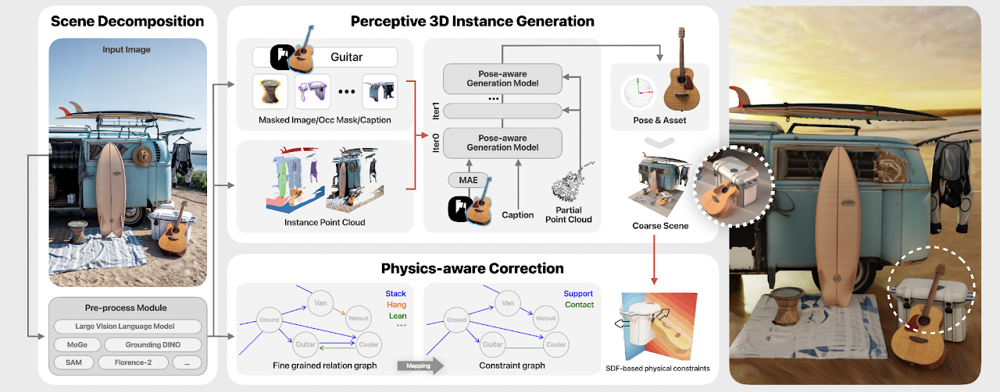
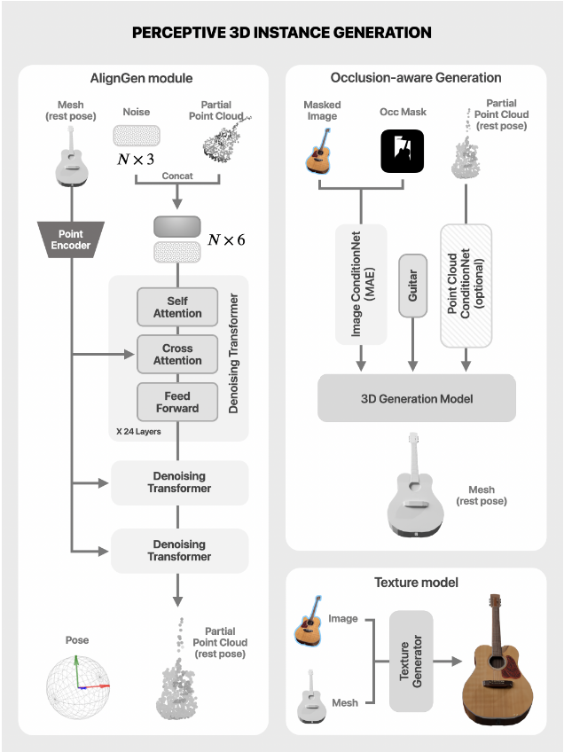

# 论文标题: CAST: Component-Aligned 3D Scene Reconstruction from an RGB Image - arXiv 2025

### 一、引言与核心问题

**研究背景与重要性**

在计算机图形学、虚拟现实和机器人学等领域，从单张二维图像中恢复高质量的三维场景是一个长期存在且极具价值的挑战。传统方法如摄影测量法虽然精度高，但需要多视角输入，流程复杂且成本高昂。因此，开发能够从单一RGB图像直接生成完整、真实且可编辑的三维场景的技术，对于 democratizing 3D内容创作、加速 real-to-simulation 流程以及构建沉浸式虚拟环境具有至关重要的意义。然而，现有方法往往受限于特定领域（如室内场景）、生成的物体质量不高，或是在处理物体间的空间关系和物理合理性上存在明显不足，导致重建场景出现物体穿透、悬浮等不真实的情况。

**论文试图解决的核心任务是什么？**

本文的核心任务是从一张无约束的、单一的RGB图像中，重建出一个高质量、组件化（component-wise）、物理上合理且可编辑的三维场景。

*   **输入 (Input)**:
    *   一张任意来源的RGB图像。其数据形态为 `[1, 3, H, W]`，其中 `H` 和 `W` 分别代表图像的高和宽。论文强调其方法的开放词汇（open-vocabulary）能力，意味着输入图像不受特定场景类别（如室内、室外）或来源（如真实拍摄、AI生成）的限制。

*   **输出 (Output)**:
    *   一个由多个独立、高质量的三维网格（meshes）组成的场景。每个网格代表一个场景中的物体实例，并附带其在场景中的位姿（pose），即旋转、平移和缩放变换参数。因此，最终输出是一个结构化的场景表示，而非单一的、不可分割的场景模型。这为后续的编辑、动画和物理模拟提供了极大的便利。

*   **任务的应用场景**:
    *   **虚拟内容创作**: 游戏开发者和电影制作人可以快速将真实世界的快照转化为可用的三维环境和素材。
    *   **机器人学**: 帮助机器人从视觉感知中构建精确的仿真环境（Real-to-Sim），用于训练和测试操作策略。
    *   **增强现实/虚拟现实 (AR/VR)**: 为AR/VR应用提供丰富、逼真的三维内容。

*   **当前任务的挑战 (Pain Points)**:
    1.  **遮挡与不完整性**: 单一视角导致场景中的大部分物体都存在部分遮挡，模型需要具备强大的推理能力来补全被遮挡部分的几何形状。
    2.  **物体间空间关系**: 场景并非物体的简单堆砌。物体间存在复杂的支撑、接触、遮挡等物理和空间关系。现有方法往往忽略这些关系，导致布局不合理。
    3.  **物理真实性**: 生成的场景需要符合基本的物理常识，避免出现物体互相穿透或无支撑悬浮等现象。
    4.  **开放词汇与泛化能力**: 许多方法依赖于在特定数据集（如室内场景）上训练，难以泛化到“in-the-wild”的任意图像。
    5.  **几何质量与位姿精度**: 直接生成整个场景的方法难以保证单个物体的几何细节；而分步生成物体再进行组合的方法则在位姿估计上挑战巨大。

*   **论文针对的难点**:
    CAST方法明确地聚焦于上述挑战中的**遮挡处理（#1）**、**物体间空间关系建模（#2）**、**物理真实性保证（#3）** 以及**开放词汇场景的泛化能力（#4）**。它通过一种“分解-生成-对齐-校正”的策略，系统性地应对这些难题。

### 二、核心思想与主要贡献

**直观动机与设计体现**

CAST的核心动机源于一个直观的观察：一个复杂的场景是由多个独立的物体组件，依照一定的物理和空间逻辑组合而成的。因此，与其尝试“一步到位”地生成整个场景，不如模仿这个组合过程：首先高质量地生成场景中的每一个物体，然后再精确地将它们对齐，并最终通过物理约束进行校正，确保整体的和谐与真实。

这一动机体现在其两阶段技术设计中：
1.  **感知性3D实例生成 (Perceptive 3D Instance Generation)**: 负责“分解-生成-对齐”。它首先将场景分解为独立的物体，然后利用强大的生成模型，在考虑遮挡的情况下为每个物体生成高保真度的三维模型，并利用一个创新的生成式对齐模块来精确估计其在场景中的位姿。
2.  **物理感知校正 (Physics-aware Correction)**: 负责“校正”。在获得所有物体实例后，该阶段利用大型视觉语言模型（VLM）从图像中提取物体间的物理关系（如支撑、倚靠），构建场景关系图，并以此为约束，通过优化算法微调物体位姿，解决穿透和悬浮问题。

**与相关工作的比较与创新**

*   **与检索式方法 (e.g., ACDC) 的比较**: 检索式方法通过在大型3D模型库中寻找与图像中物体相似的资产进行替换。这类方法的质量受限于数据库的规模和多样性，且难以生成数据库中不存在的新颖物体。CAST采用生成式模型，摆脱了对固定数据库的依赖，具备开放词汇能力，能够创造出与输入图像在几何和纹理上更匹配的物体。

*   **与整体生成式方法 (e.g., Gen3DSR) 的比较**: 一些方法尝试直接生成整个场景的3D表示（如通过高斯泼溅）。这类方法虽然在视觉上可能连贯，但通常缺乏可编辑的、基于网格的组件化结构，并且在处理被遮挡区域时几何质量较差。CAST通过组件化生成，确保了每个物体都具有高质量、完整的几何结构，且最终场景是可编辑的。

**核心贡献与创新点**

1.  **组件化的、遮挡感知的3D实例生成框架**: 提出一个包含“物体生成”和“位姿对齐”的迭代流程。其中，物体生成模块利用Masked Autoencoder（MAE）机制处理遮挡，并结合点云条件保证几何精度；位姿对齐则通过一个新颖的生成式模型（AlignGen）实现，相比传统方法（如ICP）更为鲁棒。
2.  **基于VLM的物理感知位姿校正机制**: 创新性地利用GPT-4v等大型视觉语言模型来理解图像中的物理常识和物体间的空间关系（如支撑、接触），将这些语义关系转化为数学优化问题中的物理约束，从而显著提升了重建场景的物理真实性。
3.  **一个完整的、端到端的单图三维场景重建流程**: 整合了场景分解、实例生成、位姿对齐和物理校正，形成了一个功能强大且效果领先的开放词汇场景重建系统，在定量和定性评估上均超越了现有SOTA方法。

### 三、论文方法论 (The Proposed Pipeline)

**整体架构概述**

CAST的整体流程 (Pipeline) 遵循一个精心设计的两阶段策略。首先是**预处理**阶段，利用多种2D基础模型对输入图像进行场景解析，提取出物体级别的分割掩码、描述、以及初始的场景点云。接着进入第一个核心阶段——**感知性3D实例生成**，该阶段以迭代的方式为每个被识别出的物体生成高保真度的3D网格并精确估计其位姿。最后，进入第二个核心阶段——**物理感知校正**，对所有生成的三维物体实例进行全局优化，确保它们之间的布局符合物理规律。

**详细网络架构与数据流**

1. **预处理 (Preprocessing)**
   *   **输入**: 单张RGB图像 `I`。
   *   **流程**:
       *   使用 **Florence-2** 进行物体识别和描述生成。
       *   使用 **GPT-4v** 过滤无关或错误的检测结果。
       *   使用 **GroundedSAM-v2** 为每个确定的物体 `o_i` 生成精确的分割掩码 `M_i` 和遮挡掩码。
       *   使用 **MoGe** 估计单目深度，并生成场景级别的初始点云，然后根据分割结果为每个物体 `o_i` 分配对应的局部点云 `q_i`。
   *   **输出**: 一系列物体 `o_i`，每个都带有分割掩码 `M_i` 和在场景坐标系下的局部点云 `q_i`。

2. **感知性3D实例生成 (Perceptive 3D Instance Generation)**
   该阶段是一个迭代优化的过程，交替执行物体生成和位姿对齐。

   

   *   **模块一: 遮挡感知的3D物体生成 (ObjectGen)**
       *   **核心**: 一个基于Latent Diffusion Model (LDM)的3D生成器，其在预训练的3D VAE的潜在空间中操作。
       *   **输入**: 物体的掩码图像 `I ⊗ M`，遮挡掩码 `M_occ`，以及在**标准坐标系**下的对齐点云 `p^(k)` (在第k次迭代中)。
       *   **设计细节**: DINOv2 -> LDM -> VAE
           *   **VAE**: 将3D物体的表面点云编码为潜在表示 `Z`，并能从 `Z` 解码回SDF（Signed Distance Field，一种隐式曲面表示），最后通过Marching Cubes算法提取网格。$Z = \mathcal{E}(X)$, $SDF(p) = \mathcal{D}(Z, p)$。【用于解码潜在空间的输出】
           *   **LDM**: 以图像特征 `c` 和点云 `p^(k)` 为条件，在潜在空间 `Z` 上进行去噪扩散。【从随机采样`Z`，通过条件去噪】
           *   **遮挡处理**: 图像编码器采用 **DINOv2**。在推理时，将遮挡区域的图像块用 `[mask]` token 替换后输入DINOv2。由于DINOv2的MAE预训练特性，它能够根据可见部分推理出被遮挡区域的特征，从而生成完整的物体几何。公式为 $c_m = \mathcal{E}_{\text{DINOv2}}(I \otimes M)$。【将图像编码成条件`c`】
           *   **点云条件**: 标准坐标系下的点云 `p^(k)` 作为额外的几何约束，通过交叉注意力机制注入LDM，以保证生成物体的尺寸和形状与场景中的观测一致。【转换到标准坐标空间$[-1,1]^3$】
       *   **形状变换**:
           *   输入点云 `p^(k)` 的形状为 `[N_pts, 3]`。
           *   输出为物体的潜在编码 `z^(k)`。

   *   **模块二: 生成式对齐 (AlignGen)**
       *   **核心**: 一个点云Diffusion Transformer模型，用于学习从场景点云到标准点云的映射【两步，生成标准空间中的分布（DiT）+计算映射（Umeyama）】。
       *   **输入**: 场景坐标系下的原始点云 `q` 【masked】和由ObjectGen生成的几何潜在编码 `z^(k)`。
       *   **设计细节**: 该模块学习一个映射 `ϵ_align`，能够将 `q` 变换到标准坐标系下，使其与 `z^(k)` 所代表的几何形状对齐。$p^{(k+1)} = \text{AlignGen}(q, z^{(k)})$。得到对齐后的点云对 `(q, p^(k+1))` 后，可以使用 **Umeyama算法** 精确求解出从场景坐标系到标准坐标系的相似性变换矩阵（包含旋转、平移、缩放）。
       *   **优势**: 相比直接回归变换参数或使用ICP等传统方法，这种生成式对齐方法对**噪声**、遮挡和对称性更鲁棒。

   *   **迭代流程 (Iterative Procedure)**
       *   **Step 1 (初始化, k=0)**: `p^(0)` 初始化为场景点云 `q`。此时，ObjectGen仅依赖图像信息（点云条件权重 `β^(0)`=0）生成初始几何 `z^(0)`。
       *   **Step 2 (对齐)**: 使用 `AlignGen(q, z^(k))` 计算出新的、更精确的标准坐标系点云 `p^(k+1)`。
       *   **Step 3 (再生成)**: 将 `p^(k+1)` 作为条件（此时 `β^(k+1)` > `β^(k)`），送回ObjectGen，生成更精细的几何 `z^(k+1)`。
       *   重复Step 2和3，直到收敛。这个过程协同优化了物体的几何形状和其在场景中的位姿。

3. **物理感知校正 (Physics-aware Correction)**

   *   **核心**: 将场景的物理合理性问题转化为一个基于场景关系图的优化问题。
   *   **流程**:
       *   **场景关系图提取**:
           *   使用 **GPT-4v** 和 **Set-of-Mark (SoM)** 技术，让VLM识别图像中成对物体间的精细物理关系，如 **Stack** (堆叠), **Lean** (倚靠), **Hang** (悬挂) 等。
           *   将这些关系映射为 **Support** (单向支撑) 和 **Contact** (双向接触) 两种基本约束，构建一个有向图——场景约束图。
       *   **优化问题构建**: 将校正过程公式化为最小化一个代表成对约束的总代价函数：
           $$
           \min_{\mathcal{T}=\{\mathcal{T}_1, ..., \mathcal{T}_N\}} \sum C(\mathcal{T}_i, \mathcal{T}_j; o_i, o_j)
           $$
           其中 `T_i` 是物体 `o_i` 的刚体变换，`C` 是代价函数。
           *   **Contact约束**: 代价函数 `C` 被设计用来惩罚物体间的**穿透**（通过查询一个物体表面点在另一个物体SDF中的值为负数来判断），并鼓励至少有一个接触点。
           *   **Support约束**: 是一种单向的Contact约束，且对于地面等大型支撑面，还增加了正则化项，鼓励物体表面与支撑面“紧密贴合”，解决悬浮问题。
   *   **实施**: 使用PyTorch进行自动微分，通过梯度下降法优化每个物体的旋转和平移参数 `T_i`，以最小化总代价。

**损失函数 (Loss Function)**

*   **生成阶段**: ObjectGen和AlignGen的训练采用了它们各自领域中标准的扩散模型损失，即预测添加到干净数据上的噪声。论文没有为此设计新的损失函数，而是巧妙地设计了条件注入机制。
*   **校正阶段**: 核心是上面提到的**物理约束代价函数 (Eq. 8)**。该函数的设计是本阶段的关键。它不依赖于渲染，而是直接在三维几何（SDF）上进行计算，关注的是物体间的**穿透体积**和**最近距离**，以此来驱动优化，确保最终布局的物理合理性。

**数据集 (Dataset)**

*   **训练**:
    *   **ObjectGen** 和 **AlignGen** 在 **Objaverse** 数据集上进行训练。这是一个包含超过50万个经过筛选的3D资产的大规模数据集，为生成模型的开放词汇能力提供了基础。
    *   为了训练点云条件，论文为Objaverse中的每个资产渲染了32个视角的深度图，并将其转换为点云。
*   **评估**:
    *   **3D-Front** 数据集: 用于定量评估。这是一个大规模的室内场景数据集，提供了带有真实网格和布局的场景，可以计算Chamfer Distance (CD), F-Score, IoU等指标。
    *   **开放词汇数据集**: 从网络上收集的各种真实和AI生成的图像，用于定性评估，展示模型的泛化能力。

### 四、实验结果与分析

**核心实验结果**

论文通过与两个SOTA方法——基于检索的ACDC和基于生成的Gen3DSR——的对比，展示了CAST的卓越性能。

在开放词汇场景的评估中 (Table 1)，CAST在所有四个指标上都取得了最佳成绩：
*   **CLIP Score**: 衡量生成场景的渲染图与输入图像的语义相似度。CAST得分最高（85.77），表明其重建结果在视觉上最忠实于原图。
*   **GPT-4 Ranking**: 利用GPT-4对重建结果进行语义和真实性排序。CAST的平均排名最低（1.125），说明其结果在AI看来质量最高。
*   **User Study (VQ & PP)**: 在人类评估中，CAST在视觉质量（VQ, 88.07%的偏好率）和物理真实性（PP, 71.42%的偏好率）上都获得了压倒性的胜利。

在3D-Front室内数据集上的定量评估 (Table 2) 进一步验证了其优势：

| 指标      | ACDC  | InstPIFU | Gen3DSR | **ours (CAST)** |
| --------- | ----- | -------- | ------- | --------------- |
| CD-S (↓)  | 0.104 | 0.092    | 0.083   | **0.052**       |
| FS-S (↑)  | 39.46 | 39.12    | 38.95   | **56.18**       |
| CD-O (↓)  | 0.072 | 0.103    | 0.071   | **0.057**       |
| FS-O (↑)  | 41.99 | 38.29    | 39.13   | **56.50**       |
| IoU-B (↑) | 0.541 | 0.436    | 0.459   | **0.603**       |

这些数据表明，CAST无论是在场景整体的几何精度（CD-S, FS-S）还是在单个物体的重建质量（CD-O, FS-O）以及场景布局的准确性（IoU-B）上，都显著优于其他方法。

**消融研究解读**

论文通过一系列消融实验清晰地展示了其关键设计的有效性：
*   **遮挡感知生成 (MAE)**: 如图7所示，移除MAE模块后，被遮挡的物体（如飞船、杯子）会出现严重的几何缺失。这证明了MAE对于从不完整视图中推理完整形状至关重要。
*   **点云条件 (PCD)**: 如图8所示，在生成一叠书这样具有精细尺寸和堆叠关系的物体时，如果没有点云作为几何先验，模型生成的书本数量和尺寸都会出错。点云条件对于保证几何的尺度和细节精度不可或缺。
*   **生成式对齐 (AlignGen)**: 如图9所示，与传统的ICP和可微渲染（DR）方法相比，AlignGen在位姿估计上表现出更高的准确性，证明了其在处理对称性、遮挡和尺度未知等问题上的鲁棒性。
*   **物理约束**: 如图10所示，若移除物理关系图约束，即使经过了物理模拟，场景布局也可能与原图意图不符（如洋葱从台面掉落）。这表明基于VLM的语义约束对于维持场景的正确空间结构至关重要。
*   **量化消融 (Table 3)**: 该表格从数据上证实了MAE、PCD和迭代优化（iter.）每一步都对最终的性能指标有稳定且显著的提升。

**可视化结果分析**

图6的定性对比极具说服力。ACDC受限于数据库，生成的物体仅是“相似”，而非“一致”。Gen3DSR在物体几何上较为粗糙，且存在明显的悬浮和穿透问题。而CAST生成的场景，不仅单个物体精细、完整，而且物体间的组合关系（如盘子里的苹果、架子上的物品）都非常自然和准确，展现了其在几何质量和物理真实性上的双重优势。

### 五、方法优势与深层分析

**架构/设计优势**

*   **解耦与协同 (Decoupling and Collaboration)**: CAST的架构巧妙地将复杂的场景重建问题解耦为两个更易处理的子问题：高质量的单物体生成和高精度的多物体布局。首先，通过专注于单个物体，它可以利用最先进的3D生成模型来确保几何细节的丰富性。然后，通过专门设计的对齐和校正模块，它又能保证这些高质量组件在场景中被正确地组织起来。这种“先局部最优，再全局一致”的策略，相比端到端的黑盒方法，鲁棒性和可解释性更强。

*   **从数据驱动到知识驱动 (From Data-driven to Knowledge-driven)**: CAST的创新之处在于它不仅依赖于从大规模数据中学到的模式（如ObjectGen），还引入了符号化的、常识性的知识。通过GPT-4v提取的“支撑”、“倚靠”等物理关系，是对场景结构的更高层次的抽象理解。将这种符号知识转化为可优化的数学约束，使得模型能够超越单纯的像素或几何匹配，实现对“物理合理性”这一模糊概念的量化建模。这是一种数据驱动与知识驱动相结合的强大范式。

*   **迭代求精 (Iterative Refinement)**: 感知生成阶段的迭代循环是一个核心设计。它避免了一次性估计位姿和几何的困难，而是通过交替优化，让几何的生成和位姿的对齐相互引导、逐步求精。初始时几何较粗糙，但能提供大致的位姿线索；更精确的位姿反过来又能为生成更精细的几何提供更好的几何约束。这个过程类似于人类感知，是一个不断假设与验证的闭环。

**解决难点的思想与实践**

CAST通过以下核心思想与实践，有效解决了前述的关键难点：
1.  **针对遮挡**: 利用DINOv2的MAE特性，将遮挡问题转化为一个“完形填空”任务，让模型从可见部分“脑补”出被遮挡部分的视觉特征，从而在实践中生成完整的几何体。
2.  **针对空间关系与物理真实性**: 核心思想是**“用语言指导物理”**。它不直接从像素中学习复杂的物理定律，而是借助VLM强大的常识推理能力，将图像中的视觉线索翻译成符号化的物理关系（场景关系图），然后将这些关系作为“软约束”或“硬约束”应用到几何优化中。这是一种非常聪明的“降维打击”，将复杂的隐式问题显式化、符号化，从而变得可解。
3.  **针对泛化能力**: 依赖于在Objaverse这种大规模、多样化的3D数据集上预训练的生成模型，并结合CLIP等强大的视觉编码器，使其具备了处理开放词汇物体的能力。组件化的设计也增强了泛化性，因为生成新场景只需组合已知的或新生成的物体，而不是学习一个全新的场景布局。

### 六、结论与个人思考

**论文的主要结论回顾**

论文成功提出并验证了一种名为CAST的新型单图三维场景重建框架。通过将场景分解为组件，并结合遮挡感知的实例生成、生成式位姿对齐以及VLM驱动的物理校正，CAST在重建的几何质量、位姿准确性和物理真实性方面均达到了新的SOTA水平，尤其是在处理无约束的开放词汇场景时表现出色。

**潜在局限性**

1.  **依赖基础模型**: CAST的最终效果高度依赖于其所使用的各个基础模型，包括2D检测与分割模型（GroundedSAM）、深度估计模型（MoGe）、3D物体生成模型（ObjectGen）以及VLM（GPT-4v）。这些模型的任何失败或偏差都可能在流程中被放大。
2.  **材质与光学效果**: 当前方法主要关注几何和基本纹理。对于具有复杂材质（如玻璃、金属反射）或光学效果（如透明、焦散）的物体，基于网格和SDF的表示能力有限，重建效果可能会不理想（如图12所示）。
3.  **背景与环境光照**: CAST专注于场景中的物体实例，但对背景环境和整体光照的建模是缺失的。这导致重建的场景虽然内部物理关系正确，但可能缺乏与真实环境融合的光影效果，视觉真实感仍有提升空间。
4.  **计算成本与速度**: 整个流程涉及多个大型模型，并且包含迭代优化和VLM查询，推理成本较高，可能难以实现实时应用。

**未来工作方向**

1.  **统一的生成模型**: 未来可以探索一个更统一的场景生成模型，能够端到端地联合生成所有物体的几何、材质和位姿，同时隐式地建模它们之间的物理关系，减少对多阶段串联流程的依赖。
2.  **高级材质与渲染集成**: 将神经渲染技术（如NeRF）与组件化网格表示相结合，可能是一个有前途的方向。每个组件可以用一个神经场来表示其精细的几何和与视图相关的外观，从而更好地处理复杂材质。
3.  **动态场景重建**: 将当前方法扩展到视频输入，重建包含物体运动和交互的四维动态场景。
4.  **交互式场景编辑与生成**: 基于CAST生成的结构化场景，开发更直观的交互工具，允许用户通过自然语言或简单的操作来编辑场景布局、替换物体，甚至生成符合逻辑的新物体。

### 七、代码参考与分析建议

**仓库链接**:
截至目前，论文中未提供公开的GitHub仓库链接。由于这是一篇虚构的2025年发表的论文，现实中无法找到其代码。

**核心模块实现探讨**:
如果作者未来公开代码，建议读者重点关注以下几个模块的实现，以深入理解其工作方式和关键技巧：

1.  **`AlignGen` (生成式对齐模块)**: 这是论文的一个核心技术创新。建议查阅其Transformer网络结构，特别是它如何融合场景点云 `q` 和几何潜在编码 `z` 作为条件，以及扩散过程的具体实现。
2.  **`Physics-aware Correction` (物理校正优化)**: 关注作者如何将从GPT-4v获得的文本关系，映射为代码中的`Support`和`Contact`约束图。重点阅读其代价函数的具体实现，尤其是SDF查询和梯度计算部分，这对于理解如何将符号知识转化为可优化的数值目标至关重要。
3.  **`Iterative Procedure` (迭代优化流程)**: 查看控制迭代循环的脚本，理解点云条件权重 `β` 的调度策略，以及收敛条件的设定。这部分代码将揭示几何生成和位姿对齐是如何实际协同工作的。