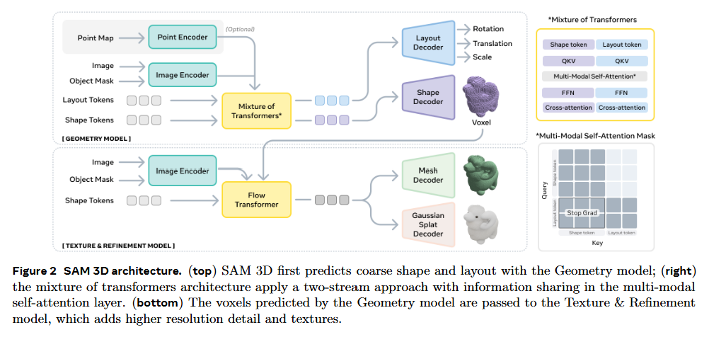

# SAM 3D: 3Dfy Anything in Images - [ArXiv_2025]

> **ArXiv ID**: 2511.16624v1
> **Links**: [Paper](https://arxiv.org/abs/2511.16624) | [Code](https://github.com/facebookresearch/sam-3d-objects) | [Project Page](https://ai.meta.com/sam3d)

### 一、引言与核心问题

在计算机视觉与图形学领域，从单张图像重建高保真3D物体一直是一个长期存在的挑战。尽管心理学研究早已表明人类能够通过“绘画线索”（pictorial cues）和物体识别经验从单张图像感知深度和形状，但计算机视觉算法在处理自然场景中的物体时仍面临巨大困难。现有的方法大多局限于合成数据或简单的隔离物体（isolated objects），难以应对真实世界中普遍存在的遮挡（occlusion）、复杂背景以及多样的光照条件。

**本论文试图解决的核心任务是：**
开发一个通用的生成模型，能够从**单张RGB图像**中预测出物体的**3D几何（Geometry）、纹理（Texture）以及在场景中的布局（Layout）**。

*   **输入 (Input)**:
    *   **图像与掩码**: 单张RGB图像 $I \in \mathbb{R}^{3 \times H \times W}$ 以及对应的物体二值掩码 $M \in \mathbb{R}^{1 \times H \times W}$。
    *   **可选输入**: 稀疏的场景点云图（Pointmap）$P$，通常由硬件传感器（如iPhone LiDAR）或单目深度估计模型获得，用于辅助布局估计。
    *   **编码形式**: 输入经过DINOv2编码器处理，提取全图特征（提供场景上下文）和物体裁剪特征（提供高分辨率细节）。

*   **输出 (Output)**:
    *   **3D形状与纹理**: 生成物体的3D表示，具体为网格（Mesh）或3D高斯（3D Gaussian Splats）。形状潜在空间分辨率为 $64^3$（通过上采样），纹理映射到相应的几何表面。
    *   **场景布局**: 物体在相机坐标系下的6自由度（6DoF）姿态，包括旋转 $R \in \mathbb{R}^6$（使用6D连续表示），平移 $t \in \mathbb{R}^3$，以及尺度 $s \in \mathbb{R}^3$。

*   **应用场景**:
    *   AR/VR内容生成、机器人感知（物体抓取与放置）、3D资产创建、游戏开发以及从2D照片重建可编辑的3D场景。

*   **当前任务的挑战 (Pain Points)**:
    1.  **3D数据匮乏（The Data Barrier）**: 相比于文本（Web text）和2D图像，配对的高质量自然图像-3D模型数据极其稀缺。
    2.  **域差异（Domain Gap）**: 在合成数据集（如Objaverse）上训练的模型难以泛化到真实照片，因为真实照片包含复杂的遮挡、阴影和传感器噪声。
    3.  **标注困难**: 人类标注员很难直接凭空画出准确的3D网格，导致大规模真实数据标注几乎不可能实现。

*   **论文针对的难点**:
    本论文主要聚焦于突破**数据瓶颈**。通过引入一种新颖的**“模型在环”（Model-in-the-Loop, MITL）**数据引擎，结合合成数据预训练和真实数据微调，解决真实世界中的泛化和遮挡重建问题。

### 二、核心思想与主要贡献

**直观动机与设计体现**:
论文的核心动机在于模仿大型语言模型（LLM）的成功路径：**大规模合成预训练 + 真实数据对齐（Alignment）**。作者认为，虽然人类难以直接创造3D模型，但人类非常擅长**判别**和**选择**。因此，系统设计了一个从“生成候选”到“人类选择/验证”的闭环管道。

**与相关工作的比较**:
与最近的SOTA工作（如Trellis, Hunyuan3D-2.0, LRM等）相比，SAM 3D不仅仅关注隔离物体的重建，更强调**场景布局的恢复**和**对严重遮挡的处理**。大多数前作依赖纯合成数据训练，而SAM 3D通过构建包含遮挡关系的半合成数据（"Flying Occlusions"）和真实标注数据，实现了对自然图像的鲁棒支持。

**核心贡献**:
1.  **SAM 3D模型**: 提出了一个两阶段的流匹配（Flow Matching）生成模型，能同时预测形状、纹理和布局，不仅生成物体本身，还能将其正确放置在3D场景中。
2.  **MITL数据引擎与大规模标注**: 构建了一个包含人类标注员和专业3D艺术家的混合数据管线，生成了规模空前的真实图像-3D配对数据（MITL-3DO数据集），包含约100万张图像和300万个验证过的3D形状。
3.  **SA-3DAO基准测试**: 发布了一个包含1000个由专业艺术家针对真实图像手动建模的高质量3D重建基准，填补了真实世界3D重建评估的空白。

### 三、论文方法论 (The Proposed Pipeline)

#### 1. 整体架构概述

SAM 3D采用了一种由粗到精（Coarse-to-Fine）的两阶段生成架构。第一阶段是**几何模型（Geometry Model）**，利用混合Transformer架构预测粗糙的几何形状和场景布局；第二阶段是**纹理与细化模型（Texture & Refinement Model）**，在几何体素的基础上细化细节并生成高保真纹理。两个模型均基于**条件整流流匹配（Conditional Rectified Flow Matching, CFM）**框架训练。

#### 2. 详细网络架构与数据流

**A. 输入编码 (Input Encoding)**
数据流始于特征提取。模型使用冻结权重的**DINOv2-ViT-L/14**作为图像编码器。为了兼顾全局语义和局部细节，模型提取两组特征：
* **Cropped Object**: 根据Mask裁剪并缩放的物体图像，提供高频纹理和几何细节。

* **Full Image**: 完整的原始图像，提供场景上下文、光照和尺度参考。

* 这两组特征（图像token + Mask token）被拼接后作为后续Transformer的条件输入 $c$。

  > 尺寸归一化 (Resize): **它们会被resize到相同的固定分辨率。**为了适配 DINOv2 (ViT) 的输入要求，无论是“完整的全图”还是“裁剪后的物体图”，在进入编码器之前都会被调整（Resize/Padding）到固定的尺寸。这意味着 **Cropped Object** 虽然在原图中物理尺寸可能很小，但经过Resize后，它在特征空间中占据了和全图一样多的Token数量。这正是该设计的核心目的：**为物体提供“变焦”般的高分辨率细节特征。**
  >
  > 编码器共享 (Shared Encoder)**: 通常使用同一个冻结权重的 DINOv2 编码器。** RGB图像（Full & Crop）都通过同一个预训练的大模型提取特征。这样做的好处是特征空间是对齐的，且DINOv2具有极强的语义理解能力。
  >
  > Cropped Object是按 Mask 边缘做的 Bounding Box (BBox) Crop，且通常包含背景。
  >
  > Mask 不仅仅是作为一种“掩码”去遮挡RGB特征，它本身被视为一种**独立的模态输入**，被编码成了**特征向量（Tokens）**。最终的 $c$ 是四组 Token 的序列拼接：$c = [\text{Full RGB Tokens}, \text{Full Mask Tokens}, \text{Crop RGB Tokens}, \text{Crop Mask Tokens}]$

**B. 阶段一：几何模型 (Geometry Model)**

*   **目标**: 联合建模 $p(O, R, t, s | I, M)$，其中 $O$ 是潜在空间体素（Latent Voxels）。
*   **架构**: 采用12亿参数（1.2B）的**Mixture-of-Transformers (MoT)** 架构。
    *   **MoT设计**: 包含两个并行的Transformer流。一个流处理形状Token（4096个tokens，对应 $16^3$ 空间分辨率），另一个流处理布局Token（1个token，包含 $R, t, s$）。
    *   **信息交互**: 尽管由不同的FFN处理，但在多模态自注意力（Multi-modal Self-Attention）层中，形状和布局Token可以相互交互，确保几何形状与姿态的一致性（例如，物体的旋转必须与其形状的主轴对齐）。
*   **形状变换**: 输入条件 $c$ -> MoT -> 输出 $16^3 \times 8$ 的潜在体素 -> 解码器上采样 -> $64^3$ 粗糙占用网格。

**C. 阶段二：纹理与细化模型 (Texture & Refinement Model)**
*   **目标**: 建模 $p(S, T | I, M, O)$，在粗糙几何 $O$ 的基础上生成精细几何 $S$ 和纹理 $T$。
*   **架构**: 6亿参数（600M）的**稀疏潜在流Transformer (Sparse Latent Flow Transformer)**。
    *   **稀疏化处理**: 仅处理几何模型输出的非空体素（Active Voxels），极大地降低了计算开销。
    *   **输入**: 接收来自阶段一的体素特征以及图像条件 $c$。
    *   **输出**: 预测每个体素的精细几何修正量和纹理特征（SLAT features）。
*   **解码**: 最终的潜在表示通过两个独立的VAE解码器（$D_m$ 和 $D_g$）分别解码为Mesh（用于几何评估）或3D Gaussian Splats（用于高质量渲染）。

#### 3. 损失函数 (Loss Function)

模型训练的核心目标是**条件整流流匹配 (Conditional Rectified Flow Matching, CFM)** 损失。

$$
L_{\text{CFM}} = \sum_{m \in \mathcal{M}} \lambda_m \mathbb{E}_{\tau, x_0^m} \left[ \| v_m - v_{\theta}^m(x_\tau^m, c, \tau) \|^2 \right]
$$

*   **变量定义**:
    *   $\mathcal{M} = \{S, R, t, s\}$ 代表所有模态集合。
    *   $x_1^m$: 真实数据（Ground Truth）。
    *   $x_0^m \sim \mathcal{N}(0, I)$: 初始高斯噪声。
    *   $x_\tau^m = \tau x_1^m + (1-\tau)x_0^m$: 时间步 $\tau \in [0, 1]$ 时的线性插值状态。
    *   $v_m = x_1^m - x_0^m$: 目标速度场（Target Velocity Field）。
    *   $v_{\theta}^m$: 神经网络预测的速度场。
*   **设计理念**: 相比于Diffusion模型预测噪声，Flow Matching直接预测从噪声到数据的直线轨迹的速度，训练更稳定且推断效率更高。
*   **偏好对齐 (DPO)**: 在后训练阶段，引入Diffusion-DPO损失，利用人类偏好数据对 $(x_w, x_l)$（胜者/败者）微调模型，迫使模型生成更符合人类感知的形状（如更好的对称性、更完整的结构）。

#### 4. 数据集与数据引擎 (Data Engine)

论文的数据策略是其成功的关键，分为三个阶段：
1.  **预训练 (Pre-training)**: 使用 **Iso-3DO** 数据集（270万个合成物体），在纯合成数据上学习基本的3D几何先验。
2.  **中训练 (Mid-training)**: 使用 **RP-3DO**（Render-and-Paste）数据集。
    *   **Flying Occlusions (FO)**: 将合成物体随机遮挡并粘贴到自然背景中，强制模型学习形状补全和抗遮挡能力。
    *   **Object Swap (OS)**: 替换图像中的真实物体为相似的合成物体，提供完美的“半真实”Ground Truth。
3.  **后训练 (Post-training)**: 真实世界对齐。
    *   **MITL-3DO**: 利用模型生成多个候选，人类标注员选择最佳结果并调整姿态（Layout）。
    *   **Art-3DO**: 对于模型无法生成的困难样本（Hard Cases），由专业3D艺术家手动建模。这部分数据虽少但质量极高，用于SFT（有监督微调）作为上限引导。

### 四、实验结果与分析

#### 1. 核心实验结果

在**SA-3DAO**（艺术家标注的真实基准）和**ISO3D**上进行的评估显示，SAM 3D在几何准确性和感知质量上均优于现有方法。

| 方法 (Model)  | F1@0.01 ($\uparrow$) | Chamfer Distance ($\downarrow$) | 纹理偏好胜率 (Texture WR) |
| :------------ | :------------------- | :------------------------------ | :------------------------ |
| Trellis       | 0.1475               | 0.0902                          | -                         |
| Hunyuan3D-2.1 | 0.1399               | 0.1126                          | 13.8% (vs SAM 3D)         |
| Direct3D-S2   | 0.1513               | 0.0962                          | -                         |
| **SAM 3D**    | **0.2344**           | **0.0400**                      | **Ref**                   |

*解读*: SAM 3D在几何指标（Chamfer Distance越低越好）上几乎将误差减半（0.09 -> 0.04），F1分数大幅提升，证明了其在真实复杂场景下重建的精确度。

#### 2. 人类偏好评估
在包含1000个真实图像样本的测试集中，人类评估者在**5:1**的比例下更偏好SAM 3D生成的形状，在**6:1**的比例下更偏好其场景重建效果。这表明定量的几何误差降低确实转化为了肉眼可见的质量提升。

#### 3. 消融实验解读
*   **数据引擎的迭代效应**: 图10显示，随着MITL数据引擎迭代次数增加，模型的Elo评分呈线性增长。这验证了“模型越好 -> 数据标注越快/越准 -> 模型更好”的正向循环。
*   **训练阶段的必要性**: 去掉MITL数据或Art-3DO数据都会导致性能显著下降（F1分数下降约10%-15%），证明了真实人类反馈数据在弥补合成数据域差异中的核心作用。

### 五、方法优势与深层分析

#### 1. 架构与设计优势
*   **MoT的解耦与交互**: Mixture-of-Transformers 架构允许模型专门化处理形状和布局，这比单纯将所有模态视为一长串Token更高效。特别是Layout Token作为全局信息，能指导局部Shape Token的生成，这种层级设计符合物体“先定位后塑形”的认知逻辑。
*   **稀疏计算**: 在第二阶段利用稀疏体素（Sparse Voxel）仅对物体表面进行细化，避免了在空的空间浪费算力，使得模型能够支持更高的等效分辨率。

#### 2. 解决难点的思想与实践
*   **以“选择”代“生成”解决标注瓶颈**: 这是一个非常务实且深邃的思想。通过让机器生成 $N$ 个候选（Best-of-N），将人类的任务简化为“选择”，极大地降低了3D数据采集的门槛。
*   **合成到真实的渐进式课程学习**: 
    *   Step 1 (Iso-3DO): 学会什么是3D物体。
    *   Step 2 (RP-3DO): 学会在图像中把物体“抠”出来并补全被遮挡的部分（通过Flying Occlusions强制学习）。
    *   Step 3 (MITL/Art-3DO): 学会真实世界的纹理分布和复杂的物理合理性。
    这种课程设置有效地平滑了从合成域到真实域的巨大鸿沟。

### 六、结论与个人思考

**结论**:
SAM 3D 展示了将LLM领域的**Scaling Law**和**Alignment**技术迁移到3D生成领域的巨大潜力。它证明了只要有合适的数据引擎，单图3D重建可以从“玩具级”迈向“实用级”，特别是在处理真实世界遮挡和布局方面取得了突破性进展。

**潜在局限性**:
1.  **分辨率限制**: 目前几何输出基于 $64^3$ 的潜在体素，对于极其精细的结构（如毛发、细线）可能仍显不足。
2.  **背面幻觉**: 单图重建本质上是一个病态问题（Ill-posed problem）。对于不可见区域，模型依赖统计先验进行“脑补”，这在某些特定物体上可能导致语义错误的纹理生成（例如背面文字错误）。
3.  **多物体交互**: 虽然支持Layout预测，但模型本质上还是逐个物体处理，缺乏对物体间物理接触（如挤压、支撑）的显式物理建模。

**个人思考**:
这篇论文最令我受启发的是其**数据工程的系统性**。在模型架构日趋同质化（Transformer + Flow Matching）的今天，真正的护城河在于如何构建一个能够自我进化的数据飞轮。MITL管线不仅解决了3D数据缺口，还通过引入Expert Policy（3D艺术家）处理长尾困难样本（Hard Examples），这种**“AI辅助大众标注 + 专家解决长尾”**的模式值得在其他数据稀缺领域（如机器人操作、医疗影像）借鉴。