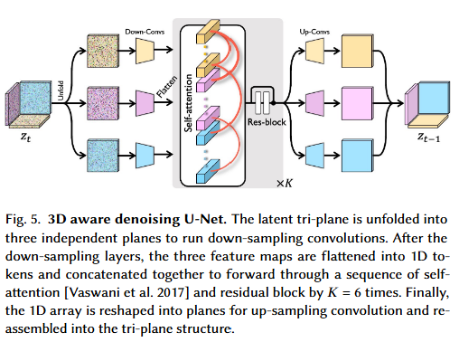

*   * # 论文标题: BlockFusion: Expandable 3D Scene Generation using Latent Tri-plane Extrapolation - arXiv 2024
    
      ### 一、引言与核心问题
    
      这篇论文的研究背景在于，随着虚拟现实（VR）、增强现实（AR）和视频游戏等领域的蓬勃发展，市场对大规模、高质量的3D内容的需求日益增长。尽管基于扩散模型的2D图像生成技术已相当成熟，但将其成功经验迁移至3D领域，特别是生成可无限扩展的大型场景，仍充满挑战。现有的3D生成方法大多局限于生成固定尺寸的单个物体，而少数尝试生成场景的方法，如从2D图像提升（2D-lifting），则常常因依赖不准确的深度估计而导致几何失真，难以扩展到房间级别以上的复杂场景。因此，如何直接在3D空间中生成几何精确、内容多样且能够无缝扩展的大型场景，是当前计算机图形学领域亟待解决的一个核心问题。
    
      *   **论文试图解决的核心任务是什么？**
    
          该研究的核心任务是**生成可无限扩展（unbounded）的高质量3D场景**。这不仅包括从无到有生成一个初始场景区块，更关键的是能够在一个已存在的场景基础上，通过外推（extrapolation）的方式，自回归地、无缝地生成新的相邻区块，从而构建出理论上无限大的虚拟世界。
    
          *   **输入 (Input)**:
              *   对于**初始生成**或**受控生成**，输入是一个二维布局图（2D Layout Map）。这是一个多通道的二值图像，每个通道代表一个物体类别（如墙、床、椅子等）。其**数据维度/Shape**为 `[Batch_size, M, 32, 32]`，其中 `M` 是物体类别总数，`32x32` 是与后续处理的隐空间分辨率对齐的特征图尺寸。
              *   对于**场景扩展**，输入是作为条件的、已知的相邻场景区块的隐式表征，即一个**隐空间三平面（Latent Tri-plane）**。其**数据维度/Shape**为 `[3, C, 32, 32]`，其中 `C` 是隐空间的特征通道数（论文中实验了2或16）。
    
          *   **输出 (Output)**:
              *   方法的直接输出是一个新的3D场景区块的隐式表征，同样是一个**隐空间三平面（Latent Tri-plane）**，其**数据维度/Shape**与输入三平面一致，为 `[3, C, 32, 32]`。这个隐式表征随后可以被解码成一个高分辨率的三维网格（Mesh），用于最终的可视化和应用。
    
          *   **任务的应用场景**:
              该任务的直接应用场景是**开放世界游戏**的程序化内容生成（PCG），可以自动创建广阔且多样的游戏地图。此外，它在**影视制作**、**建筑可视化**以及**元宇宙（Metaverse）**等需要大规模虚拟环境的领域也具有巨大的应用潜力。
    
          *   **当前任务的挑战 (Pain Points)**:
              1.  **高方差分布学习困难**: 与单个物体相比，3D场景在几何结构和物体布局上具有极高的多样性和复杂性。这种高方差性使得直接使用生成模型（尤其是扩散模型）学习其数据分布变得异常困难，容易导致生成结果质量低下或模式崩溃。
              2.  **无缝扩展与一致性**: 在扩展场景时，新旧区块的边界必须在几何上精确对齐，在语义上和谐过渡。确保这种无缝连接，避免出现裂缝、悬浮或风格突变，是一个重大的技术挑战。
              3.  **计算与内存开销**: 直接处理高分辨率的3D数据（如体素网格）会带来巨大的计算和内存负担，这限制了生成场景的规模和细节水平。
    
          *   **论文针对的难点**:
              BlockFusion这篇论文的设计精准地瞄准了上述三个核心难点。它通过**引入隐空间**来应对**高方差分布学习**的挑战；通过设计一种**基于扩散模型的外推机制**来解决**无缝扩展与一致性**问题；并通过在紧凑的**三平面（Tri-plane）**表征上进行操作，有效地降低了**计算与内存开销**。
    
      ### 二、核心思想与主要贡献
    
      *   **直观动机与设计体现**:
          本研究的直观动机源于2D领域中**潜在扩散模型（Latent Diffusion Model, LDM）**，如Stable Diffusion的巨大成功。LDM的核心思想是“先压缩，后扩散”：即将高维的像素数据通过一个自编码器（Autoencoder）压缩到一个低维、语义丰富的隐空间中，然后在这个隐空间上训练扩散模型。这样做极大地降低了计算复杂度，并使模型能更专注于学习数据的本质分布。BlockFusion巧妙地将这一思想迁移到了3D场景生成领域。它没有直接在原始、冗余的3D数据上进行扩散，而是设计了一个流程，将场景区块首先转化为一种名为“三平面”的中间表征，再通过一个变分自编码器（VAE）将其压缩到更紧凑的**隐空间三平面**上，最后在这个隐空间中进行扩散生成与外推。这一系列设计完美体现了其核心动机。
    
      *   **与相关工作的比较与创新**:
          *   与直接在**原始三平面**上进行扩散的先前工作（如Rodin, NFD）相比，BlockFusion的创新在于**引入了VAE压缩步骤**。论文通过实验证明，对于复杂的场景数据，直接在原始三平面上扩散会导致模型训练不稳定，生成结果崩塌。而通过VAE学习到的隐空间更加规整，分布更易于学习，从而首次实现了高质量的场景级别（而非物体级别）的扩散生成。
          *   与**2D提升**方法（如Text2Room）相比，BlockFusion的创新在于**直接在3D空间进行生成**。它摆脱了对不可靠的单目深度估计的依赖，从而能够生成几何结构更准确、更复杂的3D场景，并且具备了超越单个房间的扩展能力。
          *   在场景扩展技术上，BlockFusion借鉴了2D图像修复算法**Repaint**的核心思想，但创新地将其**应用于3D隐式表征的外推**。它通过在扩散模型的每个去噪步骤中，将已知区域的噪声信息同步到未知区域，从而引导生成过程，确保新旧区块的平滑过渡。
    
      *   **核心贡献与创新点**:
          1.  **提出了一种基于隐空间三平面（Latent Tri-plane）的扩散模型**，首次证明了通过“压缩-扩散”范式可以稳定、高质量地生成复杂的3D场景区块。这是方法成功的基石。
          2.  **设计并实现了一种有效的三平面外推（Extrapolation）机制**，该机制通过在去噪过程中同步重叠区域的特征，实现了场景的和谐、无缝扩展，为生成无限大的3D世界提供了可能。
          3.  **集成了一个二维布局图的条件控制机制**，允许用户通过简单的交互式操作来精确控制生成场景中物体的类别和空间布局，增强了模型的可控性和实用性。
    
      ### 三、论文方法论 (The Proposed Pipeline)
    
      
      
      * **整体架构概述**:
        BlockFusion的整体流程可以清晰地分为三个主要阶段。首先是**数据表征阶段**，将多样化的3D场景网格数据，通过逐区块拟合的方式，统一转换为一种称为“原始三平面（Raw Tri-plane）”的稠密神经场表征。其次是**隐空间学习阶段**，训练一个专门设计的变分自编码器（VAE），将高维、冗余的原始三平面压缩到一个低维、紧凑的“隐空间三平面（Latent Tri-plane）”中。最后是**生成与扩展阶段**，在这个高效的隐空间上训练一个扩散模型来学习场景区块的分布，并利用该模型，通过一种新颖的外推算法来逐步扩展场景。
    
      * **详细网络架构与数据流**:
      
        1.  数据预处理与原始三平面拟合:
            *   **数据预处理**: 论文使用的数据集包括3DFront等室内场景库和艺术家设计的室外场景。首先，使用Blender的体素重构工具将原始Mesh转换为水密（watertight）模型，确保物体内外有明确定义。然后，将大型场景随机裁剪成固定大小的立方体区块。这一步至关重要，它创造了一个包含大量被切割物体和多样化布局的数据集，对生成模型的鲁棒性提出了很高的要求。
            *   **模块类型**: 采用混合神经场（Hybrid Neural Field）来表示每个3D区块的几何形状。该场由一个三平面张量 `x` 和一个小型多层感知机（MLP）解码器组成。三平面是一种将3D空间分解为三个正交平面（XY, YZ, XZ）的因子化表示。
            *   **设计细节**: 对于任意查询点 $p \in \mathbb{R}^3$，首先将其投影到三个平面上，通过双线性插值查询各自的特征向量，然后将三个特征向量相加，送入MLP解码器，最终输出该点的符号距离函数（Signed Distance Function, SDF）值。SDF是一种隐式曲面表示，其值的符号表示点在物体内外，绝对值表示到物体表面的最近距离。
            *   **形状变换**: 此阶段的输出是**原始三平面 `x`**，其**形状 (Shape)** 为 `[3, 128, 128, 32]`，即3个平面，每个平面分辨率为128x128，特征维度为32。这个MLP解码器在所有区块间共享，被训练成一个通用的SDF解码器。
            *   **作用分析**: 这一步将离散的、拓扑结构各异的Mesh数据，转化为了统一、连续、稠密的神经场表征，为后续的神经网络处理奠定了基础。
      
        2.  VAE压缩至隐空间三平面:
      
            *   **模块类型**: 一个专门设计的变分自编码器（VAE），包含一个编码器 `E` 和一个解码器 `D`。
            *   **设计细节**: VAE的结构结合了残差网络（ResNet）、Transformer和特征金字塔网络（FPN）。编码器接收原始三平面，通过一系列下采样模块（包含ResBlock和Transformer）将其压缩为隐变量 `z`。解码器则从 `z` 出发，通过上采样模块将其恢复为原始三平面。值得注意的是，为了处理三平面之间的内在3D关联，模型在特征降维后会将三个平面的特征图展平（flatten）并拼接，送入Transformer层进行跨平面的信息交互，这体现了其**3D感知**的设计。
            *   **形状变换**: 编码器 `E` 将形状为 `[3, 128, 128, 32]` 的原始三平面 `x`，压缩成形状为 `[3, C, 32, 32]` 的**隐空间三平面 `z`**。论文中 `C` 实验了2和16两种配置。数据维度被大幅压缩（例如当C=2时，压缩率高达99.6%）。
            *   **作用分析**: 这是BlockFusion的核心创新。消融实验（Fig. 4, Table 3）明确表明，若没有这一步，直接在原始三平面上训练扩散模型会失败。VAE的压缩作用不仅是降低维度，更关键的是它将数据投影到了一个更平滑、更具语义结构的流形上，使得扩散模型能够轻松地捕捉其分布，从而稳定地生成高质量的结果。
      
        3.  隐空间扩散模型训练与外推:
      
            
      
            *   **模块类型**: 一个基于U-Net架构的时间条件去噪网络 `Ψ`，其结构与VAE中的编码器/解码器类似，同样采用了**3D感知的Transformer模块**来处理跨平面依赖关系。
            *   **数据流 (训练)**: 训练过程遵循标准的DDPM（Denoising Diffusion Probabilistic Models）流程。从未经压缩的隐空间三平面 `z_0` 出发，通过一个预定义的马尔可夫链在前向过程中逐步对其添加高斯噪声，得到任意时刻 `t` 的噪声样本 `z_t`。去噪网络 `Ψ` 的任务是接收 `z_t` 和时间步 `t` 作为输入，并预测出原始的 `z_0`。如果提供2D布局图 `l` 作为条件，则 `l` 会被直接拼接到 `z_t` 的三个平面特征上，作为额外的输入通道。
            *   **数据流 (外推/扩展)**: 这是推理阶段的核心。假设已知一个区块的隐空间三平面 `z^P`，目标是生成其相邻重叠区块 `z^Q`。
                1.  从一个完全随机的高斯噪声 `z_T^Q` 开始。
                2.  在每个去噪步骤 `t` (从 `T` 到 `1`)：
                    a.  首先，利用前向过程公式，从已知的 `z^P` 中采样出其在 `t` 时刻的噪声版本 `z_t^P`。
                    b.  然后，将当前的 `z_t^Q` 输入去噪网络 `Ψ`，得到一个对 `z_0^Q` 的初步预测。
                    c.  利用这个预测和 `z_t^Q`，计算出去噪一步后的结果 `z_{t-1}^Q`。
                    d.  **同步**: 将 `z_{t-1}^Q` 中与 `z^P` 重叠区域的部分，替换为从 `z_t^P` 相应区域计算出的去噪结果。这一步强制让新区块的生成过程与已知区块保持一致。
                3.  **重采样（Resampling）**: 为了进一步加强一致性，论文借鉴了Repaint的方法，在某些去噪步骤中，会向已去噪的样本中重新注入少量噪声，并重复执行若干次去噪步骤。消融实验（Fig. 12）表明，重采样能显著提高生成区块间的几何对齐精度。
            *   **后处理**: 最后，对生成的所有区块Mesh进行非刚性配准，以消除因隐空间操作可能导致的微小边界接缝。
      
        4.  条件嵌入分析
      
            - Timestep: 通过 AdaGroupNorm 或 Scale-Shift 机制进行条件注入。
            - 2D Layout Map: 通过交叉注意力机制进行条件注入。
    
            > BlockFusion 的条件嵌入主要发生在 U-Net 模型的 `forward` 过程中，通过时间步嵌入（Timestep Embedding）和二维布局图（2D Layout Map）作为交叉注意力（Cross-Attention）或直接特征拼接来影响去噪过程。
            >
            > #### 1. 时间步嵌入（Timestep Embedding）
            >
            > 时间步 `timestep` 是扩散模型中所有 U-Net 模型的通用条件。它编码了当前去噪的步长，指导模型在不同噪声水平下进行去噪。
            >
            > - **来源文件**: `src/diffusers/models/embeddings.py` 和 `src/diffusers/models/unet_2d_condition.py` (以及 `unet_2d.py`, `unet_3d_condition.py` 等所有使用 U-Net 的文件)。
            >
            > - **关键部分分析**:
            >
            >   - **`get_timestep_embedding` 函数 (`src/diffusers/models/embeddings.py`)**: 这个函数实现了位置编码（positional encoding），将离散的时间步 `timesteps` 转换为连续的、高维的正弦/余弦嵌入向量。这是扩散模型中常见的将时间信息融入模型的方式。
            >
            >     ```python
            >     def get_timestep_embedding(
            >         timesteps: torch.Tensor,
            >         embedding_dim: int,
            >         flip_sin_to_cos: bool = False,
            >         downscale_freq_shift: float = 1,
            >         scale: float = 1,
            >         max_period: int = 10000,
            >     ):
            >         # ... 省略实现细节 ...
            >         emb = torch.cat([torch.sin(emb), torch.cos(emb)], dim=-1)
            >         # ...
            >         return emb
            >     ```
            >
            >   - **`Timesteps` 类 (`src/diffusers/models/embeddings.py`)**: `Timesteps` 类是 `get_timestep_embedding` 函数的一个封装，用于方便地在模型中使用时间步嵌入。
            >
            >   - **`TimestepEmbedding` 类 (`src/diffusers/models/embeddings.py`)**: 这个类进一步将 `Timesteps` 生成的嵌入通过线性层和激活函数进行处理，得到 U-Net 内部使用的 `temb` (time embedding) 特征。在一些情况下，它还可以接受额外的 `condition` 输入进行融合。
            >
            >     ```python
            >     class TimestepEmbedding(nn.Module):
            >         # ...
            >         def forward(self, sample, condition=None):
            >             if condition is not None:
            >                 sample = sample + self.cond_proj(condition) # 额外的条件在这里可以和时间嵌入融合
            >             sample = self.linear_1(sample)
            >             # ...
            >             return sample
            >     ```
            >
            >   - **U-Net 中的使用 (`src/diffusers/models/unet_2d_condition.py` 的 `UNet2DConditionModel` `forward` 方法)**: 在 U-Net 的 `forward` 方法中，`timestep` 首先被 `self.time_proj`（通常是 `Timesteps`）处理，然后通过 `self.time_embedding` 生成 `emb`。这个 `emb` 会被传递给 U-Net 的所有下采样块（`down_blocks`）、中间块（`mid_block`）和上采样块（`up_blocks`）中的 ResNet 模块，通过 **AdaGroupNorm** 或 **Scale-Shift** 机制进行条件注入。
            >
            > #### 2. 二维布局图条件（2D Layout Map Conditioning）
            >
            > 论文中提到布局图会作为额外的条件来指导生成。在代码中，这与 `UNet2DConditionModel` 中的 `encoder_hidden_states` 和 `PositionNet` 相关。
            >
            > - **来源文件**: `src/diffusers/models/embeddings.py` (`PositionNet`), `src/diffusers/models/attention.py` (`BasicTransformerBlock`), `src/diffusers/models/unet_2d_condition.py` (`UNet2DConditionModel`)。
            >
            > - **关键部分分析**:
            >
            >   - **`PositionNet` 类 (`src/diffusers/models/embeddings.py`)**: 这个类是专门用于处理边界框（boxes）和掩码（masks）等位置信息的。它将这些几何条件编码成特征，这些特征可以与文本嵌入或其他高级语义特征结合。
            >
            >     ```python
            >     class PositionNet(nn.Module):
            >         # ...
            >         def forward(
            >             self,
            >             boxes, # 输入的边界框信息
            >             masks, # 输入的掩码信息
            >             positive_embeddings=None, # 可以是文本嵌入或其他正面条件
            >             phrases_masks=None,
            >             image_masks=None,
            >             phrases_embeddings=None,
            >             image_embeddings=None,
            >         ):
            >             # ...
            >             xyxy_embedding = self.fourier_embedder(boxes) # 将边界框转换为傅里叶嵌入
            >             # ...
            >             # 这里会根据 feature_type 将 positive_embeddings/phrases_embeddings/image_embeddings 与 xyxy_embedding 结合
            >             # ...
            >             objs = self.linears(torch.cat([positive_embeddings, xyxy_embedding], dim=-1))
            >             # ... 或 objs = torch.cat([objs_text, objs_image], dim=1)
            >             return objs # 输出结合了位置信息的特征
            >     ```
            >
            >     `PositionNet` 能够将用户提供的边界框和对应的语义（例如，来自 `positive_embeddings` ）编码成一个更丰富的特征表示 `objs `。这个 `objs ` 随后会作为 `cross_attention_kwargs` 中的 `gligen` 参数传递给 U-Net。
            >
            >   - **U-Net 中的 `encoder_hidden_states` (`src/diffusers/models/unet_2d_condition.py` 的 `UNet2DConditionModel` `forward` 方法)**: `encoder_hidden_states` 通常是文本编码器输出的特征。在 BlockFusion 的布局条件下，这个参数也可以承载 `PositionNet` 生成的布局信息。
            >
            >     ```python
            >     class UNet2DConditionModel(ModelMixin, ConfigMixin, UNet2DConditionLoadersMixin):
            >         # ...
            >         def forward(
            >             self,
            >             sample: torch.FloatTensor,
            >             timestep: Union[torch.Tensor, float, int],
            >             encoder_hidden_states: torch.Tensor, # 通常是文本嵌入，也可以是布局嵌入
            >             class_labels: Optional[torch.Tensor] = None,
            >             timestep_cond: Optional[torch.Tensor] = None,
            >             attention_mask: Optional[torch.Tensor] = None,
            >             cross_attention_kwargs: Optional[Dict[str, Any]] = None,
            >             added_cond_kwargs: Optional[Dict[str, torch.Tensor]] = None,
            >             # ...
            >         ):
            >             # ...
            >             # 2.5 GLIGEN position net
            >             if cross_attention_kwargs is not None and cross_attention_kwargs.get("gligen", None) is not None:
            >                 cross_attention_kwargs = cross_attention_kwargs.copy()
            >                 gligen_args = cross_attention_kwargs.pop("gligen")
            >                 cross_attention_kwargs["gligen"] = {"objs": self.position_net(**gligen_args)}
            >             # ...
            >     ```
            >
            >     这里可以看到 `gligen_args` 会传入 `self.position_net` ，其输出的 `objs` 会被赋值给 `cross_attention_kwargs["gligen"]` 。这说明 `PositionNet` 的输出作为一种特殊的交叉注意力条件被注入。
            >
            >   - **交叉注意力层 (`src/diffusers/models/attention.py` 的 `BasicTransformerBlock` `forward` 方法)**: U-Net 中的 `BasicTransformerBlock` 包含自注意力（self-attention）和交叉注意力（cross-attention）层。`encoder_hidden_states` 被用于交叉注意力，使得模型能够将条件信息融入到图像特征中。
            >
            >     ```python
            >     class BasicTransformerBlock(nn.Module):
            >         # ...
            >         def forward(
            >             self,
            >             hidden_states: torch.FloatTensor,
            >             attention_mask: Optional[torch.FloatTensor] = None,
            >             encoder_hidden_states: Optional[torch.FloatTensor] = None, # 这里的 encoder_hidden_states 接收条件
            >             encoder_attention_mask: Optional[torch.FloatTensor] = None,
            >             timestep: Optional[torch.LongTensor] = None,
            >             cross_attention_kwargs: Dict[str, Any] = None,
            >             class_labels: Optional[torch.LongTensor] = None,
            >         ):
            >             # ...
            >             attn_output = self.attn1(
            >                 norm_hidden_states,
            >                 encoder_hidden_states=encoder_hidden_states if self.only_cross_attention else None, # 自注意力层如果只进行交叉注意力，也可能用到
            >                 attention_mask=attention_mask,
            >                 **cross_attention_kwargs,
            >             )
            >             # ...
            >             if gligen_kwargs is not None: # 如果有 gligen 条件，这里进行融合
            >                 hidden_states = self.fuser(hidden_states, gligen_kwargs["objs"])
            >             # ...
            >             if self.attn2 is not None: # 交叉注意力层
            >                 # ...
            >                 attn_output = self.attn2(
            >                     norm_hidden_states,
            >                     encoder_hidden_states=encoder_hidden_states, # 核心的条件输入
            >                     attention_mask=encoder_attention_mask,
            >                     **cross_attention_kwargs,
            >                 )
            >                 hidden_states = attn_output + hidden_states
            >             # ...
            >     ```
            >
            >     `encoder_hidden_states` 作为 `key` 和 `value` 向量输入到交叉注意力机制中，与 `hidden_states` （即图像特征）的 `query` 向量进行交互，从而将布局信息（或其他条件）融入到图像特征的生成中。`gligen_kwargs` 的存在表明可能有一种特殊的条件融合机制，这在 `GatedSelfAttentionDense` 类中实现。
            >
            > #### 3. 总结条件嵌入的关键部分：
            >
            > - **时间步嵌入**: 通过 `Timesteps` 和 `TimestepEmbedding` 类，将时间步信息编码为 `temb`，并以 AdaGroupNorm 或 Scale-Shift 方式注入到 U-Net 的 ResNet 块中。
            >   - **来源**: `src/diffusers/models/embeddings.py`, `src/diffusers/models/resnet.py`
            > - **布局条件（2D Layout Map）**: 通过 `PositionNet` 将用户定义的边界框和语义信息转换为高级特征 `objs`。这些 `objs` 作为 `cross_attention_kwargs` 中的 `gligen` 参数，在 U-Net 的 `BasicTransformerBlock` 中通过 `GatedSelfAttentionDense` 模块与图像特征进行融合。
            >   - **来源**: `src/diffusers/models/embeddings.py`, `src/diffusers/models/attention.py`, `src/diffusers/models/unet_2d_condition.py`
            > - **3D 感知卷积（Tri-plane Specific）**: `Conv3DAwareUNet`、`Conv3DAwareUNetMidBlock2D` 以及底层的 `GroupConv` 和 `Conv3DAware` 模块，通过特殊的2D卷积分组和特征聚合机制，确保在处理三平面数据时，模型能够感知并利用3D空间信息。
            >   - **来源**: `src/diffusers/models/lora.py`, `src/diffusers/models/unet_2d.py`, `src/diffusers/models/unet_2d_blocks.py`
            > - **外推中的特征注入**: 在 U-Net 的 `forward` 过程中，通过 `down_block_additional_residuals` 和 `mid_block_additional_residual` 参数，将来自已知区块的重叠区域三平面特征作为残差项，注入到 U-Net 的不同层级，以指导新区块的生成，确保平滑过渡。
            >   - **来源**: `src/diffusers/models/unet_2d_condition.py`
            >
            > 通过这些机制，BlockFusion 能够有效地整合时间步、2D布局和3D空间信息，以实现可扩展的高质量3D场景生成。虽然代码库是通用的 Hugging Face Diffusers 框架，但这些特定的模块和参数组合，以及在 `Conv3DAwareUNet` 中对卷积层的替换，揭示了 BlockFusion 对条件嵌入的独特处理。
      
      * **损失函数 (Loss Function)**:
        *   **原始三平面拟合损失 (L_geo)**:
            *   **设计理念**: 这是一个几何损失，由三部分构成: $L_{geo} = L_{SDF} + L_{Normal} + L_{Eikonal}$。
            *   **关注重点**: $L_{SDF}$ 确保模型输出的SDF值与采样点的真实SDF值一致；$L_{Normal}$ 确保在物体表面上的SDF梯度（即法线）与真实法线一致；$L_{Eikonal}$ 是一个正则化项，约束SDF场的梯度模长处处为1，这是SDF的物理本质。这个损失函数综合保证了最终恢复出的几何形状的准确性。
        *   **VAE训练损失 (L_AE)**:
            *   **设计理念**: $L_{AE} = L_{rec}(x, D(E(x))) + L_{KL} + L_{geo}$。
            *   **关注重点**: $L_{rec}$ 是原始三平面 `x` 与其重构版本 `D(E(x))` 之间的L1重建损失，保证信息保真度。$L_{KL}$ 是VAE中标准的Kullback-Leibler散度项，用于正则化隐空间分布，使其接近标准正态分布。最关键的是，训练VAE时也使用了应用在重构结果上的 $L_{geo}$，这迫使VAE学习到的隐空间必须能够保留精确的几何信息。
        *   **扩散模型训练损失 (L_LTD)**:
            *   **设计理念**: $L_{LTD} = ||\Psi(z_t, \gamma(t), l) - z_0||^2_2$。
            *   **关注重点**: 这是一个简单的均方误差（MSE）损失，目标是让去噪网络 `Ψ` 的输出尽可能地接近真实的、未加噪声的隐空间三平面 `z_0`。
      
      ### 四、实验结果与分析
      
      *   **核心实验结果**:
          论文将BlockFusion与当时最先进的室内场景生成方法Text2Room进行了比较。由于Text2Room是文本到3D，而BlockFusion是布局到3D，为了公平比较，作者用自然语言描述BlockFusion的输入布局图，作为Text2Room的输入。结果显示BlockFusion在几何质量上具有压倒性优势。
      
          | 指标                     | Text2Room [Höllein et al. 2023] | 本文方法 (BlockFusion) | 提升幅度 |
          | :----------------------- | :-----------------------------: | :--------------------: | :------: |
          | **几何感知质量 (GPQ)**   |              1.92               |        **4.44**        |  +2.52   |
          | **几何结构完整性 (GSC)** |              1.92               |        **4.58**        |  +2.66   |
      
          **解读**: 上表为室内场景纯几何形状生成的用户研究结果(5分制，越高越好)。从用户评分可以看出，BlockFusion生成的场景在几何形状的感知质量和结构完整性方面远超Text2Room。可视化结果（Fig. 9）也直观地印证了这一点：Text2Room生成的物体（如床、椅子）有明显的扭曲和变形，而BlockFusion生成的几何体则非常规整和真实。
      
      *   **消融研究解读**:
          *   **隐空间 vs. 原始三平面**: 这是最重要的消融研究。Table 3和Fig. 4的结果显示，直接在原始三平面上训练扩散模型（Raw tri-plane Diff.）生成的物体是无法辨认的“坍塌”形状，而本文的隐空间三平面扩散模型（Latent tri-plane Diff.）则能生成清晰、多样的物体。定量指标上，本文方法的覆盖度（COV）得分比前者高出一倍以上（例如CD度量下为51.83% vs 23.99%），表明其生成的多样性远胜前者。这强有力地证明了VAE压缩步骤的必要性和有效性。
          *   **重采样次数的影响**: Fig. 12展示了在场景扩展时，不同重采样次数 `R` 对几何一致性的影响。当 `R=0`（即只有布局约束，没有同步过程）时，两个区块在重叠区的倒角距离（Chamfer Distance）非常大，意味着几何严重不匹配。随着 `R` 的增加，距离迅速下降，并在 `R=3` 左右趋于稳定。这说明同步外推和重采样机制对于保证无缝拼接至关重要。
      
      *   **可视化结果分析**:
          *   **大规模场景生成**: 论文的Fig. 1, 7, 8展示了最终生成的村庄、城市和大型室内场景，视觉效果震撼。这些结果直观地展示了BlockFusion作为一种可扩展场景生成器的强大能力，这是之前的方法难以企及的。
          *   **可控性与创造性**: Fig. 11展示了在相同初始区块和不同条件下（无条件 vs. 布局条件）的外推结果，证明了布局图对生成内容的有效控制。Fig. 14更有趣，它展示了利用布局图引导模型生成了训练集中不存在的、形如数字“24”和心形的房间，体现了模型的泛化能力和“创造性”。
      
      ### 五、方法优势与深层分析
      
      *   **架构/设计优势**:
          *   **优势详述**: BlockFusion的核心优势在于其**分而治之**的策略。它没有试图用一个单一的、端到端的模型去解决从原始数据到最终生成的所有问题，而是将这个复杂任务分解为三个更易于处理的子问题：**几何表征**、**分布压缩**和**隐空间生成**。
              1.  **几何表征的鲁棒性**: 通过将所有3D区块统一拟合为基于SDF的原始三平面，它为后续处理提供了一个统一、连续且信息稠密的输入，屏蔽了原始Mesh数据的复杂性。
              2.  **分布压缩的有效性**: VAE的设计是整个方法的“胜负手”。通过在损失函数中强制加入几何约束（$L_{geo}$），它确保了压缩过程不仅降低了维度，还保留了生成高质量几何形状所必需的关键信息。这使得后续的扩散模型可以工作在一个“甜蜜点”上——一个既低维易于学习，又富含结构信息的隐空间。
              3.  **隐空间生成的稳定性与效率**: 在这个紧凑的隐空间中训练扩散模型，极大地提高了训练的稳定性和效率，使其能够成功学习复杂场景的分布，而不会像在原始高维空间中那样轻易失败。
      
      *   **解决难点的思想与实践**:
          *   针对**高方差分布学习困难**，BlockFusion的核心思想是**降低问题复杂度**。实践上，它通过VAE将原始的、细节繁杂、方差巨大的三平面数据，映射到一个更抽象、更本质的隐空间。在这个空间里，许多无关紧要的高频细节被滤除，相似的语义结构被映射到邻近的区域，整个数据分布变得更加规整，从而让扩散模型得以成功学习。
          *   针对**无缝扩展与一致性**，其核心思想是**信息同步引导**。实践上，它通过巧妙地应用Repaint算法，在每一步去噪过程中，都强制用“已知”的确定性信息（来自相邻区块的噪声样本）去校准“未知”的生成部分。这种迭代式的、由已知到未知的引导，确保了新生成的区块在生长过程中始终“记得”要与邻居保持一致，最终实现了从几何到语义的和谐过渡。
      
      ### 六、结论与个人思考
      
      *   **论文的主要结论回顾**:
          这篇论文成功地提出并验证了一个名为BlockFusion的框架，它能够生成多样化、几何一致且可无限扩展的大型3D场景。实验证明，其核心的“隐空间三平面扩散”策略，相比以往的方法，在生成质量、稳定性和可扩展性方面都取得了显著的突破，为大规模3D内容的全自动生成迈出了重要一步。
      
      *   **潜在局限性**:
          1.  **细节精度有限**: 由于隐空间三平面的分辨率（32x32）相对较低，该方法难以生成非常精细的几何细节，例如椅子的细腿或复杂的雕刻。
          2.  **物体朝向控制缺失**: 当前的2D布局图只能控制物体的类别和大致位置，无法精确控制其旋转和朝向。
          3.  **纹理生成分离**: 该方法本身只生成几何模型，纹理是通过第三方工具（如Meshy, Text2tex）后处理添加的。如何为生成的大型场景生成全局一致且高质量的纹理，仍然是一个开放的挑战。
      
      *   **未来工作方向**:
          1.  **超分辨率**: 研究在三平面表征上的超分辨率技术，以在不显著增加基础模型负担的情况下，提升生成模型的细节表现力。
          2.  **更强的可控性**: 在条件输入中引入物体的朝向信息（例如，一个朝向图），训练模型以实现对场景中物体姿态的更精确控制。
          3.  **几何与纹理的联合生成**: 探索能够在一个统一的框架内联合生成几何和纹理的方法，以解决当前分离式流程可能带来的不匹配和不一致问题。
      
      *   **对个人研究的启发**:
          这篇论文再次证明了“**表征学习优先**”在处理复杂高维数据时的重要性。与其设计一个越来越复杂的生成模型去硬磕原始数据，不如先花心思设计一个优秀的自编码器，找到一个“更好”的潜在空间，往往能起到事半功倍的效果。此外，它将2D领域的成熟算法（如Repaint）创造性地迁移并适配到3D隐式表征上的做法，也为解决其他领域的跨维度问题提供了富有启发性的思路。
