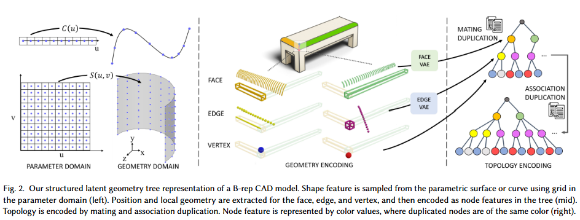

# 论文标题: BrepGen: A B-rep Generative Diffusion Model with Structured Latent Geometry - ACM Trans. Graph. 2024

### 一、引言与核心问题

**研究背景与重要性**: 在计算机辅助设计（CAD）领域，边界表示法（Boundary Representation, B-rep）是描述三维实体模型的行业标准。它通过精确定义模型的几何元素（如参数化的曲面和曲线）和拓扑关系（即面、边、顶点的连接关系）来构建水密（water-tight）的实体。与多边形网格（Mesh）等近似表示不同，B-rep能够精确表达复杂的自由曲面，是工业设计和制造的基石。因此，开发能够直接生成高质量B-rep模型的AI系统，将极大解放设计师的生产力，变革当前依赖大量手动操作的设计流程。

**论文试图解决的核心任务是什么？**

该论文的核心任务是实现对复杂B-rep格式的CAD模型的直接、无条件和有条件的生成。

*   **输入 (Input)**:
    *   **训练阶段**: 输入是单个B-rep格式的CAD模型。该模型包含复杂的几何（平面、圆柱、自由曲面等）和拓扑信息。
    *   **推理/生成阶段**:
        *   **无条件生成**: 输入为随机高斯噪声，不依赖任何先验信息。
        *   **有条件生成**: 输入为随机高斯噪声和一个类别标签（例如，“椅子”、“桌子”），以指导生成特定类型的物体。
    *   论文将其方法巧妙地转化为了一个固定结构的树状数据的生成任务。因此，在模型内部，输入可以看作是符合特定树状结构、填充了高斯噪声的特征向量。

*   **输出 (Output)**:
    *   输出一个完整、多样且通常情况下为水密的B-rep格式CAD模型。该模型由一组精确的几何图元（parametric surfaces/curves）及其正确的拓扑连接关系构成。

*   **任务的应用场景**:
    *   **概念设计与创意生成**: 快速生成大量新颖的设计方案，激发设计师灵感。
    *   **设计自动化与补全**: 根据用户提供的部分模型（例如几个曲面），自动补全剩余部分，形成完整设计（CAD Autocompletion）。
    *   **设计风格迁移与插值**: 在不同设计风格之间进行平滑过渡，创造融合多种特征的新模型（Design Interpolation）。

*   **当前任务的挑战 (Pain Points)**:
    1.  **混合数据类型的挑战**: B-rep模型是一种复杂的图结构，同时包含连续的几何信息（参数化曲面/曲线的控制点或参数）和离散的拓扑信息（面、边、顶点的邻接关系）。如何在一个统一的生成框架中处理这两种异构数据是一个核心难点。
    2.  **可变拓扑结构的挑战**: 不同CAD模型的拓扑图结构千差万别，一个实体可能由几个面构成，也可能由几百个面构成，每个面的边界边数量也不同。这种可变尺寸和结构的图数据难以被标准的深度学习模型（如CNN或固定尺寸的Transformer）直接处理。
    3.  **对精确性和有效性的高要求**: 生成的B-rep模型必须是“水密”的，即所有面片能完美缝合成一个封闭的实体，这要求拓扑关系完全正确，且几何元素在边界处精确对齐。任何微小的错误都可能导致模型失效。
    4.  **自由曲面生成的难度**: 以往的方法大多局限于由简单基元（如直线、圆弧）构成的草图进行拉伸得到的棱柱体，难以生成包含自由曲面（如NURBS）的复杂模型。

*   **论文针对的难点**: 本文的核心设计，即**结构化隐式几何表示**，主要针对上述的**混合数据类型**和**可变拓扑结构**两大挑战。通过将B-rep图巧妙地转化为一个固定结构的层级树，它成功地将复杂的拓扑生成问题转化为一个更易于处理的、在固定结构上进行连续特征生成的任务，从而也间接解决了自由曲面生成的问题。

### 二、核心思想与主要贡献

*   **直观动机与设计体现**:
    *   **动机**: 直接生成B-rep的复杂图结构非常困难，但生成固定结构的数据（如图像）是扩散模型等深度生成模型的强项。那么，是否能将一个可变的B-rep图结构，“伪装”成一个固定结构的数据表示，从而利用现有强大生成模型的威力？
    *   **设计体现**: 这一动机直接催生了本文的核心创新——**结构化隐式几何表示**。论文将B-rep模型从一个图（Graph）“解构”成一个层级树（Tree）：根节点代表实体，其下是面（Face）节点，每个面节点下是构成其边界的边（Edge）节点，每个边节点下是其端点（Vertex）。为了处理图中的共享关系（如一条边被两个面共享），论文引入了**“节点复制 (Node Duplication)”**机制。一条共享边会在其所属的两个面节点下各出现一次，成为两个独立的子节点。这样，复杂的拓扑连接关系就被巧妙地**隐式编码**进了节点的几何特征中——拥有相似几何特征的节点即被认为是拓扑上的同一个元素。为了解决每层子节点数量不一的问题，论文进一步使用节点复制进行“填充”，将树的每一层都扩展到固定的宽度。至此，一个可变的B-rep图就完全转化成了一个结构固定的、特征为连续值的层级树，完美适配了后续的扩散模型。

*   **与相关工作的比较与创新**:
    *   本文与`SolidGen`等直接B-rep生成工作最为相关。`SolidGen`采用自回归的方式，先生成顶点，再生成边，最后连接成面，这个过程步骤繁多且容易累积误差。
    *   **创新之处**: `BrepGen`摒弃了这种显式、分步构建拓扑的思路。它的核心创新在于通过**节点复制**机制，将拓扑信息**隐式地融入**到几何特征的生成中。它不是去预测“哪条边和哪个面连接”，而是生成所有“组件”（面、边、顶点）的几何特征，然后通过后处理“寻找”几何上重合的组件来恢复拓扑。这种**“先生成、后匹配”**的范式，将离散的拓扑生成问题转化为了连续的几何特征生成问题，极大地降低了任务的复杂度。

*   **核心贡献与创新点**:
    1.  **提出了一种新颖的结构化隐式几何表示**：通过层级树和节点复制机制，成功将具有可变拓扑的B-rep图转化为结构固定的数据表示，统一了几何与拓扑的生成过程。
    2.  **设计了一个强大的B-rep生成扩散模型**: 基于上述表示，设计了一个分阶段的Transformer扩散模型，能够生成包含复杂自由曲面和精确拓扑的高质量CAD模型，性能超越现有技术。
    3.  **构建并开源了一个新的家具B-rep数据集**: 该数据集包含大量具有自由曲面的真实设计模型，填补了现有CAD数据集的空白，将推动该领域未来的研究。

### 三、论文方法论 (The Proposed Pipeline)



* **整体架构概述**: `BrepGen`的流程可以概括为“编码-生成-解码”三部曲。首先，将输入的B-rep模型通过“结构化隐式几何表示”编码成一个固定结构的层级树。然后，使用一个由四个Transformer组成的级联式潜在扩散模型，自顶向下地序贯生成树中所有节点的特征（包括位置和形状的隐式编码）。最后，通过一个基于启发式规则的后处理步骤，检测并合并树中的重复节点，从而解码出最终的B-rep拓扑结构，并微调几何细节。

* **详细网络架构与数据流**:
  1.  **数据预处理 (B-rep to Tree)**:
      
      * 一个B-rep模型被分解为`Solid -> Faces -> Edges -> Vertices`的层级树。
      
      *   **几何编码**:
          *   **Face**: 一个面节点的特征由两部分组成：`F = [Fp, Fz]`。
              
              * `Fp`: 面的轴对齐包围盒（Axis-Aligned Bounding Box）坐标，`shape: [6]`。
              
                > 轴对齐 (Axis-Aligned): Bounding Box的所有边都必须严格地与坐标系的XYZ轴平行。
              
              *   `Fz`: 描述面局部形状的隐式向量。这是通过在面的UV参数域上均匀采样一个`32x32`的点阵`Fs` (`shape: [32, 32, 3]`)，然后用一个VAE（Variational Autoencoder）将其压缩得到的。`Fz`的`shape`为`[4, 4, 3]`。
              
          *   **Edge**: 边节点的特征类似，`E = [Ep, Ez]`。
              
              *   `Ep`: 边的轴对齐包围盒坐标，`shape: [6]`。
              *   `Ez`: 边的局部形状隐式向量，由沿曲线参数化方向采样32个点`Es` (`shape: [32, 3]`)后经由另一个VAE压缩得到，`shape: [4, 3]`。
              
          *   **Vertex**: 顶点特征就是其三维坐标`(x, y, z)`，`shape: [3]`。
          
      *   **拓扑编码** (Node Duplication):
          
          *   Mating Duplication: 为解除图的共享结构，共享的边和顶点会在各自的父节点下被复制。
          * Association Duplication: 为统一树的宽度，随机复制子节点，直到达到预设的最大分支数量（例如，每个实体最多50个面，每个面最多40条边）。
          
            > **Association Duplication** 是BrepGen用来将可变大小的 B-rep（边界表示）数据转换成固定大小的树结构的一种巧妙方法。在CAD模型中，一个实体（solid）可以由任意数量的面（face）组成，而每个面又可以由任意数量的边（edge）界定。这种可变性使得直接使用神经网络处理变得困难。
            >
            > - 核心思想：为一个实体和每个面预定义一个固定的、最大的子节点数量（即最大面数和最大边数），然后通过随机复制现有的面或边来填充，直到达到这个最大数量。这个 Duplication 由 DiT 模块学习。
            >
            > - 优点
            >   1. 统一数据结构： 将所有CAD模型都转换成具有相同结构的树，方便神经网络处理。
            >   2. 避免过拟合： 随机选择要复制的节点，有助于防止模型在训练过程中过拟合。
            >
            > - 代码实现
            >
            >   在`dataset.py`中，Association Duplication的实现主要体现在`SurfPosData`和`EdgePosData`这两个数据集类中。
            >
            >   1. 面的Association Duplication
            >
            >      在`SurfPosData`类的`__getitem__`方法中，我们可以看到面的复制过程：
            >
            >      ```python
            >      class SurfPosData(torch.utils.data.Dataset):
            >       """ Surface position (3D bbox) Dataloader """
            >       def __init__(self, input_data, input_list, validate=False, aug=False, args=None):
            >         self.max_face = args.max_face
            >         # ...
            >       def __getitem__(self, index):
            >         # ...
            >         # Padding
            >         surf_pos = pad_repeat(surf_pos, self.max_face)
            >         # ...
            >      ```
            >
            >       这里的`pad_repeat`函数（定义在`utils.py`中）是实现“Association Duplication”的关键。它接收一个面的包围盒数组`surf_pos`和预设的最大面数`self.max_face`，然后重复数组中的元素直到总数达到`self.max_face`。
            >
            >   2. 边的Association Duplication
            >
            >      同样地，在`EdgePosData`类的`__getitem__`方法中，我们能找到边的复制过程：
            >
            >      ```python
            >      class EdgePosData(torch.utils.data.Dataset):
            >       """ Edge Position (3D bbox) Dataloader """
            >       def __init__(self, input_data, input_list, validate=False, aug=False, args=None):
            >         self.max_edge = args.max_edge
            >         # ...
            >       def __getitem__(self, index):
            >         # ...
            >         edge_pos_new = []
            >         for pos in edge_pos_duplicated:
            >             random_indices = np.random.permutation(pos.shape[0])
            >             pos = pos[random_indices]
            >             pos = pad_repeat(pos, self.max_edge) #make sure some values are always repeated
            >             random_indices = np.random.permutation(pos.shape[0])
            >             pos = pos[random_indices]
            >             edge_pos_new.append(pos)
            >         edge_pos = np.stack(edge_pos_new)
            >         # ...
            >      ```
            >
            >      这段代码对每个面所属的边进行处理。首先，它随机打乱边的顺序，然后调用`pad_repeat`函数将边的数量填充到预设的最大边数`self.max_edge`。最后，它再次打乱顺序，以增加随机性。
            >
            > - 生成阶段的处理：为了得到最终的、有效的B-rep模型，需要进行后处理来移除这些重复的节点。
            >   1. 检测重复面： 通过比较面的包围盒和几何特征来识别重复的面。
            >   1. 检测重复边： 同样，通过比较边的包围盒和几何特征来识别重复的边。
            >   1. 重建拓扑关系： 在移除重复节点后，需要重新构建面、边、顶点之间的邻接关系。
            >   1. 联合优化： 最后，通过一个优化过程来微调所有几何元素的位置，以确保它们能完美地拼接在一起，形成一个 watertight 的实体。
      
  2.  **级联式潜在扩散模型 (Latent Diffusion Module)**:
      *   这是一个由四个独立的Transformer Denoiser组成的序列，严格按照从粗到细、自顶向下的顺序生成树的特征。
      *   **数据流与形状变换**:
          1.  **Denoiser 1 (Face Position)**: 输入高斯噪声，输出所有面节点的包围盒特征`Fp`。
          2.  **Denoiser 2 (Face Shape)**: 输入带噪声的面形状隐向量`Fz`，以第一步生成的`Fp`为条件，输出去噪后的`Fz`。
          3.  **Denoiser 3 (Edge Position)**: 输入带噪声的边包围盒`Ep`，以其父节点（面）的完整特征`F = [Fp, Fz]`为条件，输出去噪后的`Ep`。
          4.  **Denoiser 4 (Edge-Vertex Shape)**: 输入带噪声的边-顶点联合隐向量`Ezv`，以其父节点（面）特征`F`和刚生成的边位置`Ep`为条件，输出去噪后的`Ezv`。
      *   **条件注入**: 条件信息（如父节点的特征）通过简单的将其嵌入向量与子节点的嵌入向量相加来实现，而非使用复杂的交叉注意力机制。
      *   **消融实验的作用分析**: 论文的消融研究（6.4.1节）有力地证明了这种统一生成几何和拓扑的方法的优越性。当尝试将拓扑生成和几何生成分为两步时（先生成拓扑邻接矩阵，再根据拓扑生成几何），仅拓扑生成这一步的有效率就极低（仅6.2%），说明显式生成正确的拓扑非常困难。`BrepGen`的统一方法巧妙地规避了这个问题。
  
* **损失函数 (Loss Function)**:
  *   **设计理念**: 论文采用了标准Denoising Diffusion Probabilistic Models (DDPM)的训练目标。对于上述四个Denoiser网络中的每一个，其损失函数都是预测所添加的高斯噪声`ε`与真实噪声之间的L2距离。
  *   **数学形式**: $L = \mathbb{E}_{t, x_0, \epsilon} \left[ || \epsilon - \epsilon_\theta(\sqrt{\bar{\alpha}_t}x_0 + \sqrt{1-\bar{\alpha}_t}\epsilon, t) ||^2 \right]$
      *   其中，$x_0$是干净的原始节点特征，$\epsilon$是随机采样的高斯噪声，$\epsilon_\theta$是待优化的Denoiser网络，$t$是扩散步数。
  *   **关注重点**: 该损失函数直接优化模型在每个时间步上对噪声的预测能力，从而间接学习数据的逆向扩散过程（即生成过程）。它完全关注于节点特征的精确重建，模型的拓扑学习能力是通过节点复制机制和特征重建的压力**隐式**获得的。

* **数据集 (Dataset)**:
  *   **所用数据集**: 论文在三个数据集上进行了评估：
      1.  `DeepCAD`: 包含约17万个机械零件模型，主要由草图拉伸构成，几何形状相对简单。
      2.  `ABC Dataset`: 一个大规模的真实工业零件数据集，几何和拓扑都非常复杂。
      3.  `Furniture B-rep Dataset`: 论文**自己构建并开源**的数据集，包含6,171个跨10个类别的家具模型。这个数据集的特色是包含了大量由自由曲面构成的模型，这是之前数据集中所缺乏的。
  *   **特殊处理**: 对所有数据集，论文都进行了严格的过滤和预处理。例如，移除了包含多个实体（Bodies）的模型，并将所有模型规范化到`[-3, 3]`的坐标范围内。

### 四、实验结果与分析

*   **核心实验结果**:
    论文在`DeepCAD`数据集上与`DeepCAD`（基线方法）和`SolidGen`进行了详细的定量比较。结果表明，`BrepGen`在所有评估指标上均取得了最优性能。

    | 指标 (DeepCAD数据集) | DeepCAD | SolidGen | **BrepGen (本文方法)** | 说明                                   |
    | -------------------- | ------- | -------- | ---------------------- | -------------------------------------- |
    | **COV (%) ↑**        | 65.46   | 71.03    | **73.87**              | 覆盖率更高，生成多样性更好             |
    | **MMD (x10²) ↓**     | 1.29    | 1.08     | **1.04**               | 与真实数据分布更接近                   |
    | **JSD (x10²) ↓**     | 1.67    | 1.31     | **1.28**               | 与真实数据分布更接近                   |
    | **Novel (%) ↑**      | 87.4    | 99.1     | **99.8**               | 生成样本新颖性极高，几乎不与训练集重合 |
    | **Unique (%) ↑**     | 89.3    | 96.2     | **99.7**               | 生成样本内部重复度低                   |
    | **Valid (%) ↑**      | 46.1    | 60.3     | **62.9**               | 生成水密有效模型的比例最高             |

    **结果解读**: `BrepGen`不仅在衡量生成样本与真实数据分布相似度的指标（COV, MMD, JSD）上全面领先，而且在衡量生成质量的关键CAD指标——**有效率（Valid ratio）**上，也显著优于之前最好的方法`SolidGen`。这充分证明了其方法在生成高质量、多样化且结构正确的B-rep模型方面的优越性。

*   **消融研究解读**: 论文通过消融实验验证了其统一生成框架的必要性。将拓扑和几何生成解耦为两阶段后，模型性能急剧下降，特别是第一阶段生成的拓扑有效率极低，证明了显式生成复杂拓扑的巨大困难，反衬出`BrepGen`隐式方法的巧妙之处。

*   **可视化结果分析**: 论文展示了大量高质量的可视化结果（如图6, 7, 10）。特别是在`Furniture`数据集上的生成结果（图10），清晰地展示了`BrepGen`生成具有平滑自由曲面（如沙发、灯具）的能力，这是以往方法无法企及的，极具说服力地证明了其方法的突破性。

### 五、方法优势与深层分析

*   **架构/设计优势**:
    *   **优势详述**: `BrepGen`的核心优势在于其创新的**问题转化**思路。它没有“硬碰硬”地去解决可变图生成这一难题，而是通过**结构化隐式几何表示**，将问题巧妙地转化为了一个在固定结构上进行连续特征生成的任务。
    *   **原理阐释**:
        1.  **解耦复杂性**: 节点复制机制将拓扑连接的“离散决策”问题，转化为寻找几何上相似节点的“连续匹配”问题。模型只需要专注于生成几何上正确的面和边，而无需分心于它们之间复杂的连接关系。拓扑约束被自然地、隐式地施加在几何特征的学习过程中。
        2.  **拥抱强大工具**: 转化为固定结构的树之后，就可以直接利用表现卓越的Transformer和扩散模型。Transformer强大的序列建模能力非常适合处理树中节点间的层级依赖关系，而扩散模型则保证了生成结果的高质量和多样性。
        3.  **通用性强**: 这种表示法理论上可以编码任意复杂的B-rep拓扑，使其能够处理从简单机械件到复杂自由曲面家具的各种模型，具有很强的通用性。

*   **解决难点的思想与实践**:
    *   **核心思想**: **隐式建模 (Implicit Modeling)**。论文的核心思想在于，不直接对复杂的、离散的拓扑结构进行建模和生成，而是将其隐式地编码到连续的几何特征空间中。
    *   **实践手段**:
        1.  **编码**: 通过**节点复制**，将拓扑关系转化为几何特征的冗余。
        2.  **生成**: 使用**扩散模型**，在一个连续的隐式空间中学习和生成这些带有冗余信息的几何特征。
        3.  **解码**: 通过**后处理匹配**，从生成的冗余几何特征中恢复出唯一的拓扑结构。
        通过这一系列实践，`BrepGen`成功地将一个棘手的图生成问题，转化为了一个深度生成模型擅长的、在固定结构上的连续数据生成问题。

### 六、结论与个人思考

*   **论文主要结论回顾**: 论文提出了一种名为`BrepGen`的新型B-rep生成模型。其核心是一种创新的结构化隐式几何表示，能够将复杂的B-rep图转化为固定结构的层级树。基于此，`BrepGen`使用潜在扩散模型成功生成了包含自由曲面和复杂拓扑的高质量CAD模型，在多个数据集上取得了SOTA性能，并为领域贡献了一个宝贵的新数据集。

*   **潜在局限性**:
    1.  **依赖启发式后处理**: 模型的最后一步依赖于基于距离阈值的启发式匹配算法来恢复拓扑。这种方法可能不够鲁棒，且阈值的选择对结果影响较大。一个端到端的可学习解码器可能是更理想的方案。
    2.  **单实体限制**: 当前方法仅支持生成单个封闭实体（single body solid），无法生成由多个零件组装而成的复杂装配体（assembly）。
    3.  **无法保证100%有效性**: 尽管有效率已经很高，但扩散模型的生成过程和后处理步骤仍然无法从理论上保证生成的每个模型都是水密的。

*   **未来工作方向**:
    1.  **可学习的解码器**: 研究如何用一个神经网络替代启发式的后处理步骤，实现端到端的拓扑恢复。
    2.  **装配体生成**: 将该思想扩展到多实体装配体的生成，可能需要对层级树结构进行扩展，以包含组件间的约束和关系。
    3.  **可控性增强**: 探索更精细的生成控制方法，例如通过草图、文本描述甚至功能性需求来指导B-rep模型的生成。

### 七、代码参考与分析建议

*   **仓库链接**: [https://github.com/samxuxiang/BrepGen](https://github.com/samxuxiang/BrepGen)
*   **核心模块实现探讨**: 建议读者查阅作者提供的代码，重点关注以下几个核心模块的实现，以深入理解其工作机制：
    1.  **数据预处理模块**: 关注将B-rep文件（如STEP格式）解析并转化为本文提出的层级树和节点特征的代码。这是理解其核心表示法的关键。
    2.  **后处理模块 (`post_processing.py` 或类似文件)**: 详细阅读其中关于检测和合并重复节点以恢复拓扑的算法实现。这将揭示启发式规则的具体细节和阈值设定。
    3.  **模型架构 (`model.py` 或类似文件)**: 查看四个级联Transformer Denoiser的具体实现，特别是条件信息是如何嵌入和传递的。