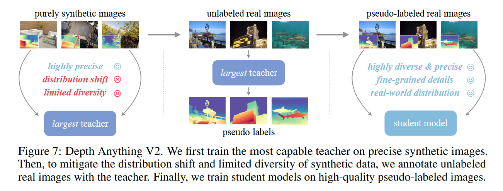

# 论文笔记: Depth Anything V2 - NeurIPS 2024

### 一、引言与核心问题

这篇论文《Depth Anything V2》聚焦于计算机视觉领域的基础性任务——单目深度估计（Monocular Depth Estimation, MDE）。MDE的重要性不言而喻，它从单张二维图像中恢复三维场景深度信息，是3D重建、自动驾驶、机器人导航以及近年来兴起的AI生成内容（AIGC）等众多应用的关键技术。

然而，现有的MDE方法普遍陷入一个两难的境地。一类是以Marigold等模型为代表、基于生成模型（如Stable Diffusion）的方法，它们能够生成非常精细的深度细节，但通常模型参数量巨大、推理速度慢，且在面对复杂或非常规场景布局时，其鲁棒性往往不足。另一类是以本文的前作Depth Anything V1和MiDaS为代表、基于判别式模型的方法，它们通常更轻量、高效，对复杂场景的整体结构理解更鲁棒，但其生成的深度图往往细节粗糙、存在过平滑现象。

**论文试图解决的核心任务是什么？**

该研究的核心任务是构建一个单目深度估计的**基础模型 (Foundation Model)**，旨在打破上述“细节”与“鲁棒性”之间的固有矛盾，实现一个既能生成精细入微的深度细节，又能保持对复杂开放世界场景的强大鲁棒性，同时还兼顾模型效率和可扩展性的统一框架。

*   **输入 (Input)**: 模型的输入是一张标准的单通道RGB图像。在训练阶段，为了标准化处理，图像的短边被缩放到518像素，然后进行随机裁剪，因此输入网络的具体形状为 `[Batch_size, 3, 518, 518]`。在推理时，模型可以处理任意分辨率的图像。

*   **输出 (Output)**: 模型的输出是一张单通道的相对深度图。具体来说，它预测的是**仿射不变的逆深度 (affine-invariant inverse depth)**，其数据形状为 `[Batch_size, 1, H, W]`，与输入图像的尺寸相对应。这意味着输出值本身不具备真实的物理尺度（米），但准确地反映了场景中各点之间的相对远近关系。通过后续的微调，该模型也可以被适配于度量深度估计任务。

*   **任务的应用场景**:
    *   经典应用: 3D重建、自动驾驶车辆的环境感知、机器人导航与避障。
    *   现代应用: AI生成内容（例如，为2D图像生成3D效果）、视频编辑、3D场景与游戏资源生成。

*   **当前任务的挑战 (Pain Points)**:
    1.  **数据质量与细节的矛盾**: 真实世界的深度数据集（通过深度传感器、立体匹配或运动恢复结构SfM获得）虽然多样，但普遍存在严重的**标签噪声**和信息缺失。例如，它们无法准确测量透明/反光物体（如玻璃、镜子）的深度，在弱纹理区域容易失效，且对动态物体处理不佳。更重要的是，这些数据集的深度标签往往是粗糙的，缺乏精细的物体轮廓和微小结构（如图3、图4a所示），这从根本上限制了模型学习精细细节的能力。
    2.  **合成数据的“理想”与“现实”鸿沟**: 合成数据（来自图形学渲染引擎）可以提供完美、精确、无噪声的像素级深度真值，尤其是在精细结构和挑战性材质上（如图4b）。然而，它存在两大固有缺陷：一是与真实世界图像之间存在明显的**分布差异 (Distribution Shift)**，渲染出的图像往往过于“干净”和“规整”，导致纯靠合成数据训练的模型向真实世界泛化时性能不佳（如图6）；二是**场景覆盖度有限**，无法穷尽真实世界中无限的场景类型、光照条件和物体组合。
    3.  **模型设计的两难选择**: 正如背景所述，模型设计者不得不在生成模型的“精细细节”和判别式模型的“高效鲁棒”之间做出权衡，缺乏一个两全其美的解决方案。

*   **论文针对的难点**: 本文的核心设计全面地回应了上述所有挑战。它旨在彻底解决由数据质量问题引发的细节-鲁棒性权衡，并提出了一套创新的流程来有效弥合合成数据与真实世界之间的鸿沟。

### 二、核心思想与主要贡献

**直观动机与设计体现**:
本文的作者洞察到，MDE领域的瓶颈主要源于**数据 (Data)**，而非模型架构本身。既然真实标签数据质量堪忧，而合成数据又存在泛化难题，那么一个直观且大胆的想法是：我们能否**彻底抛弃有噪声的真实标签数据**，转而利用合成数据的“精确性”和真实数据的“多样性”各自的优势？

这一动机深刻地体现在了论文提出的三步走策略中：
1.  首先，用最**精确**的合成数据来训练一个能力超群的“教师模型”。
2.  然后，利用这个“教师模型”去为海量、**多样**的无标签真实世界图像生成高质量的“伪标签”。
3.  最后，用这个结合了精确性与多样性的“伪标签数据集”来训练轻量高效的“学生模型”。

通过这种方式，模型从合成数据中学到的“精细描绘能力”被成功地“迁移”到了真实世界的数据分布上。

**与相关工作的比较与创新**:
本作与`Depth Anything V1`直接相关。V1已经认识到大规模无标签数据的重要性，并将其用于提升模型鲁棒性。但V1的训练仍然依赖于一个混合了真实标签数据和合成数据的集合。V2则更为激进和纯粹，它在论文的消融实验（B.9节，图12）中论证了即使是高质量的真实标签数据（如HRWSI），由于其固有的标签粗糙度，也会“污染”和损害模型学习精-grained predictions的能力。因此，V2在教师模型训练阶段**完全弃用**了所有真实标签数据，提出了一个更优越、更清晰的“教师-伪标签-学生”知识蒸馏流程，以解决数据根源上的问题。

**核心贡献与创新点**:
1.  **提出了一种全新的以数据为中心的MDE训练范式**: 论文雄辩地证明，为了追求极致的深度细节，应当在训练强大的教师模型时完全放弃带噪声的真实标签数据，仅使用高质量的合成数据。这颠覆了以往“数据越多越好”的朴素认知，强调了“数据质量优先”的原则。
2.  **构建了一套高效弥合合成-真实域差异的流程**: 通过教师模型为海量（62M）无标签真实图像生成伪标签，该方法成功地将合成数据的高精度特性迁移到了真实世界的数据分布上，有效解决了模型的泛化难题。这不仅是简单的知识蒸馏，更是一种大规模、跨域的知识“转录”。
3.  **发布了一个高质量的评估基准DA-2K**: 鉴于现有基准（如NYU-D V2）存在标签噪声、场景单一、分辨率低等问题，无法公正地评估现代MDE模型的真实能力，作者们构建并推出了DA-2K。该基准包含覆盖8大类挑战性场景的高分辨率图像和由人类专家精心标注的稀疏深度对，为社区提供了一个更精确、更全面的评估工具。

### 三、论文方法论 (The Proposed Pipeline)

**整体架构概述**:
论文提出的方法论是一个清晰的、分阶段的训练流程，其核心在于数据的精心设计和知识的有效传递：

1.  **阶段一：教师模型训练 (Teacher Training)**。首先，选用一个参数量巨大、能力最强的视觉基础模型（DINOv2-Giant）作为编码器，并**只在高质量的合成数据集上进行训练**。这个阶段的目标是打造一个对深度信息有极致精细理解的“专家”教师。
2.  **阶段二：伪标签生成 (Pseudo-Label Generation)**。利用训练好的教师模型，对一个规模庞大（62M张图片）且场景极其丰富的无标签真实世界图像库进行推理，生成对应的深度图。这些生成的深度图便构成了高质量的**伪标签数据集**。
3.  **阶段三：学生模型训练 (Student Training)**。最后，使用这个大规模的伪标签真实数据集来训练一系列不同尺寸（从Small到Giant）的“学生模型”。值得注意的是，在此阶段，原始的合成数据不再被使用。这一步旨在让学生模型学会在真实世界的数据分布上做出既精确又鲁棒的深度预测。

**详细网络架构与数据流**:
*   **网络骨干**:
    *   **编码器 (Encoder)**: 采用了一系列不同规模的**DINOv2**模型（ViT-S, B, L, G）。DINOv2是一个通过自监督学习预训练的强大的Vision Transformer，它能提供非常优质的视觉语义特征，这是模型能够理解复杂场景的基础。
    *   **解码器 (Decoder)**: 沿用了经典的**DPT (Dense Prediction Transformer)** 架构。DPT专门设计用于将Vision Transformer提取的特征图进行高效的上采样和融合，最终生成像素级的密集预测（在此即深度图）。
*   **数据流**:
    一张RGB图像 `[B, 3, H, W]` 首先通过DINOv2编码器提取多层次的特征。随后，这些特征被送入DPT解码器，经过一系列融合与上采样操作后，最终输出一个单通道的逆深度图 `[B, 1, H, W]`。
*   **关键的消融实验分析**:
    *   **伪标签的必要性 (Table 5)**: 表5的实验结果是支撑整个方法论的关键。它对比了仅使用合成数据训练（`Du`列为✗）和同时使用合成数据与伪标签真实数据训练（`Du`列为✓）的模型性能。结果显示，引入伪标签真实数据后，模型在各项指标上，尤其是在新提出的DA-2K基准上的准确率（Acc %），获得了巨大的飞跃（例如ViT-S从89.8%提升至95.3%）。这强有力地证明了第二和第三阶段对于弥合领域差异、提升泛化能力是不可或缺的。
    *   **编码器的选择 (Table 13)**: 论文对比了多种预训练编码器，实验表明DINOv2在合成数据到真实世界的迁移任务上，性能显著优于BEiT、SAM等其他模型，验证了其作为骨干网络的优越性。
    *   **分辨率提升特性 (B.8节)**: 论文还发现了一个有趣的现象，即模型在推理时使用比训练时（518x518）更高分辨率的输入，可以自然地输出更精细的深度图，这为实际应用提供了极大的便利。

**损失函数 (Loss Function)**:
论文的损失函数设计简洁而有效，主要在MiDaS工作的基础上进行了优化和应用。
*   **设计理念**:
    1.  **尺度与位移不变损失 ($L_{ssi}$)**: 这是为相对深度估计量身定制的损失。它在比较预测深度与真值深度时，能够忽略两者之间全局的尺度和偏移差异，使模型专注于学习正确的相对深度关系。
    2.  **梯度匹配损失 ($L_{gm}$)**: 该损失项旨在惩罚预测深度图与真值深度图在**梯度**上的差异，也就是要求两者在边缘和局部结构上保持一致。论文的一个重要发现是（B.7节，图10），当配合使用高精度的合成数据时，该损失对于提升预测结果的**锐度 (sharpness)** 和细节表现极为有效。论文中将$L_{ssi}$和$L_{gm}$的权重比设为1:2，突出了对细节的重视。
*   **训练实施**:
    *   在训练学生模型时，除了上述两个损失，还额外引入了一个来自V1的**特征对齐损失**，目的是保留DINOv2编码器预训练时学到的丰富语义信息。
    *   此外，对于伪标签数据，训练时会忽略每个样本中损失最高的10%的区域，以此来过滤掉伪标签中可能存在的噪声或不可靠的预测。

**数据集 (Dataset)**:
*   **合成训练集 (用于教师模型)**: 共计595K张图片，来源于5个著名的合成数据集（BlendedMVS, Hypersim, IRS, TartanAir, VKITTI 2），确保了深度真值的精确性。
*   **无标签真实数据集 (用于伪标签生成)**: 规模高达62M张图片，来源于8个大型公共数据集（如ImageNet, Places365, Open Images等），确保了场景、物体、风格的极致多样性。
*   **评估基准 (DA-2K)**: 作者自建。包含1000张高分辨率图像和2000个稀疏像素对的相对深度标注。这些图像覆盖了室内、室外、非真实、透明/反光、恶劣天气等8大类场景，标注过程通过模型投票和人工复核确保了极高的精确度，是对现有基准的一个重要补充和升级。

### 四、实验结果与分析

**核心实验结果**:
论文最核心的实验结果体现在其自建的DA-2K基准上（Table 3）。

| 方法                 | 模型尺寸 | DA-2K 准确率 (%) |
|----------------------|----------|--------------------|
| Marigold [31]        | -        | 86.8               |
| Geowizard [20]       | -        | 85.8               |
| Depth Anything V1 [89]| -        | 88.5               |
| **Depth Anything V2 (Ours)** | **ViT-S**| **95.3**           |
| **Depth Anything V2 (Ours)** | **ViT-B**| **97.0**           |
| **Depth Anything V2 (Ours)** | **ViT-L**| **97.1**           |
| **Depth Anything V2 (Ours)** | **ViT-G**| **97.4**           |

解读：这张表格的结果极具说服力。即使是最小的Depth Anything V2模型（ViT-S），其准确率也达到了95.3%，远远超过了所有先前的SOTA方法，包括以细节见长的Marigold。这证明了新方法在各种挑战性场景下的卓越性能和鲁棒性。随着模型尺寸的增加，性能稳步提升，最大的ViT-G模型达到了97.4%的惊人准确率。

有趣的是，在旧的、有噪声的基准上（Table 2），V2的指标仅与V1“相当”。作者明智地指出，这恰恰反映了旧基准的局限性——它们无法衡量V2在精细细节、透明物体处理等方面的巨大进步，这些进步反而可能因为与“不完美的真值”冲突而导致指标下降。

**可视化结果分析**:
论文中的可视化对比图（如图1, 13, 14, 15）直观地展示了V2的优越性。相比V1，V2的深度图边缘更清晰，细节更丰富（如栏杆、树叶）；相比Marigold，V2在保持细节的同时，对场景的整体结构理解更正确，不会产生离奇的错误；相比ZoeDepth，V2的度量深度模型在精细结构上（如自行车轮辐）表现也更胜一筹。图16更是精彩地展示了伪标签的魔力：仅靠合成数据训练的模型在真实图像上表现脆弱，而经过伪标签真实数据训练后，即使是小模型也获得了惊人的鲁棒性。

### 五、方法优势与深层分析

**架构/设计优势**:
本文方法的真正优势不在于新颖的模块或复杂的网络结构，而在于其**数据处理哲学和训练流程的根本性创新**。
*   **优势详述与原理阐释**:
    1.  **从源头保证精度**: 传统方法试图从充满噪声的真实数据中“去粗取精”，效果事倍功半。本文反其道而行之，通过在训练教师模型时完全隔离噪声源（即真实标签数据），并利用合成数据完美的GT和$L_{gm}$损失，从一开始就让模型学到了“画素描”般精细刻画世界的能力。这是一个“正本清源”的设计。
    2.  **以可控方式拥抱真实**: 传统方法直接用合成数据训练，模型会“水土不服”。本文的伪标签流程则像一位尽职的翻译，它将教师模型学到的关于“精细几何”的“语言”，逐字逐句地“翻译”并“标注”到海量的真实世界“语料库”上。学生模型直接学习这个被“翻译”好的真实语料库，自然就能同时理解几何精度和真实世界的光影、纹理分布，从而完美解决了域适应难题。
    3.  **高效的知识传递**: 相比于复杂的特征层对齐等知识蒸馏技术，基于伪标签的蒸馏方式更简单、直接且风险更低。它在预测结果层面进行监督，避免了不同尺寸模型间特征空间不匹配可能带来的优化难题，使得知识能够顺畅地从1.3B参数的巨型教师模型传递到仅25M参数的小型学生模型。

**解决难点的思想与实践**:
总结来说，论文通过**“隔离-提纯-迁移”**的核心思想，在实践中解决了MDE领域的长期痛点。
*   **隔离**: 将有噪声的真实标签数据与追求精度的教师模型训练过程隔离开来。
*   **提纯**: 在纯净的合成数据环境中，利用合适的损失函数，提纯出对三维几何的精细理解能力。
*   **迁移**: 通过大规模伪标签这一桥梁，将提纯出的能力安全、高效地迁移到能够在真实世界中泛化的学生模型上。

### 六、结论与个人思考

**论文结论回顾**:
《Depth Anything V2》成功地提出了一个强大的单目深度估计基础模型，它在深度图的精细度、鲁棒性和模型效率上都达到了新的高度。其核心贡献在于揭示了一条通往强大MDE模型的关键路径：**以高质量的合成数据训练教师，再通过大规模伪标签真实数据训练学生**。同时，DA-2K基准的发布也为社区未来的研究提供了更可靠的评判标准。

**潜在局限性**:
*   **计算成本**: 论文也承认，使用62M的图像进行伪标签生成和训练，其计算开销是巨大的，这可能成为资源有限的研究者复现或跟进的障碍。
*   **教师模型的天花板**: 学生模型的性能上限受限于教师模型。而教师模型的能力又受限于现有合成数据集的多样性。如果合成数据本身无法覆盖某些特定的、罕见的场景，教师模型也无能为力，这个问题会传递给学生模型。

**未来工作方向**:
*   研究更高效地利用大规模无标签数据的方法，例如主动学习策略，只挑选最有信息量的样本进行伪标签和训练。
*   探索构建更多样、更逼真的大规模合成数据集的方法，以进一步提升教师模型的性能上限。
*   将此数据驱动的训练范式推广到其他相关的密集预测任务，如表面法线估计、语义分割等。

### 七、代码参考与分析建议

*   **仓库链接**: [https://github.com/DepthAnything/Depth-Anything-V2](https://github.com/DepthAnything/Depth-Anything-V2)
*   **核心模块实现探讨**: 作者已经开源了代码。为了深入理解其工作方式，建议读者在查阅代码时，重点关注以下几个方面：
    1.  **数据处理流水线 (`Dataset`类)**: 查看代码如何处理合成数据和伪标签数据，特别是训练时对伪标签进行top-k损失区域忽略的实现。
    2.  **损失函数模块**: 仔细阅读`$L_{ssi}$`和`$L_{gm}$`损失的具体代码实现，理解其计算细节和参数设置。
    3.  **训练脚本**: 分析训练脚本，了解作者是如何分阶段进行训练的，以及针对不同阶段（教师/学生训练）的优化器、学习率等超参数设置。
    4.  **模型定义文件**: 检查DINOv2和DPT是如何被整合在一起的，以及不同尺寸模型的具体配置。

通过对这些核心部分的分析，可以更透彻地理解论文思想在实际代码层面的落地细节。