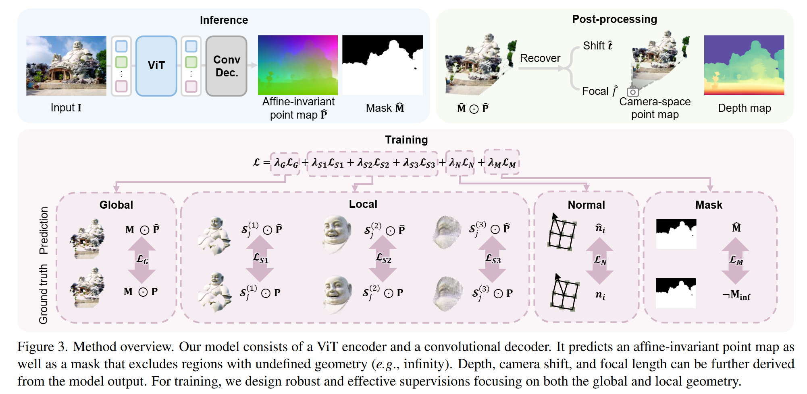

# 论文标题: MoGe: Unlocking Accurate Monocular Geometry Estimation for Open-Domain Images with Optimal Training Supervision - arXiv 2025

### 一、引言与核心问题

本研究的背景是计算机视觉中的一个基础而又充满挑战性的任务：从单张二维图像中恢复三维几何信息（Monocular 3D Geometry Estimation）。这一任务对于增强现实、机器人导航、场景理解和3D内容创作等领域至关重要。尽管近年来基于多视图的方法（如Structure-from-Motion）已取得显著进展，但单目几何估计因其固有的不适定性（ill-posed nature）——即单个2D视图可能对应无限多种3D场景解——仍然是一个开放性难题。

**论文试图解决的核心任务是什么？**

该论文的核心任务是开发一个强大的基础模型，能够从任意领域的单张RGB图像中，直接、准确地估计出场景的三维几何结构。

*   **输入 (Input)**: 输入是单张RGB图像 $I$。其数据维度为 `[Batch_size, 3, H, W]`，其中3代表RGB三个通道，H和W分别为图像的高和宽。模型被设计为能处理各种不同长宽比和分辨率的开放域图像。

*   **输出 (Output)**: 模型主要输出两个部分
    1.  **仿射不变点图 (Affine-invariant Point Map)** $P$：这是一个与输入图像尺寸相同的点云图，数据维度为 `[Batch_size, 3, H, W]`。其中每个像素 `(u, v)` 对应一个三维空间点 `(X, Y, Z)`。这里的“仿射不变”是关键，意味着模型预测的3D点云 $P_{pred}$ 与真实世界坐标下的点云 $P_{gt}$ 之间相差一个未知的全局缩放因子 $s$、一个三维平移向量 $t$，即 $P_{gt} \approx s \cdot P_{pred} + t$。
    2.  **有效几何区域掩码 (Mask)** $M$：这是一个单通道的掩码，数据维度为 `[Batch_size, 1, H, W]`。它用于标识图像中哪些区域包含有效的几何信息，而哪些区域（如天空、纯色背景）的几何是未定义的。

*   **任务的应用场景**: 该任务的成果可广泛应用于：3D感知图像编辑（如在新视角下插入物体）、深度图引导的图像合成、新视角合成（Novel View Synthesis）、三维场景理解，并可为基于视频或多视图的三维重建提供高质量的几何先验。

*   **当前任务的挑战 (Pain Points)**
    1.  **固有的模糊性 (Inherent Ambiguity)**: 单目深度估计（Monocular Depth Estimation, MDE）是该任务的传统前序步骤，但其输出的深度图具有尺度模糊性（scale ambiguity），即无法确定场景的真实物理尺寸。要从深度图恢复三维形状，必须知道相机的内参（如焦距），而从单张图像中准确估计内参本身就是一个极具挑战性的问题。错误的内参会导致严重的几何畸变。
    2.  **焦距-距离模糊性 (Focal-Distance Ambiguity)**: 近年来，一些工作（如DUSt3R）尝试直接预测点云以绕过内参估计。然而，它们通常预测的是“尺度不变”点图，这种表示无法区分“使用长焦镜头拍摄的远处物体”和“使用广角镜头拍摄的近处物体”。如图4(a)所示，这两种情况可能产生相似的2D图像和相似的预测几何形状，但在训练时，它们的真实相机参数和3D位置却截然不同，这会给网络的学习带来不一致和矛盾的监督信号，从而损害模型的精度和泛化能力。
    3.  **次优的训练监督 (Suboptimal Supervision)**: 现有的方法在将预测结果与真实值（Ground Truth）对齐以计算损失时，采用的对齐算法（Alignment Solver）通常较为粗糙，例如使用简单的中位数对齐或最小二乘法。这些方法对异常值敏感，无法在各种复杂的场景下都提供最优的对齐，导致监督信号质量不高，限制了模型学习高质量几何的能力。
    4.  **局部几何精度不足 (Lack of Local Geometry Precision)**: 全局对齐（Global Alignment）的损失函数难以捕捉场景中物体之间的精细相对位置和局部细节。例如，在全局尺度上，两个物体间的相对距离可能很模糊，导致模型难以学习精确的局部结构。

*   **论文针对的难点**: 本文（MoGe）的设计核心正是为了解决上述的**第2、3、4点难点**。它通过引入一种新的几何表示和一套精心设计的监督机制，旨在从根本上提升单目几何估计的准确性和鲁棒性。

### 二、核心思想与主要贡献

*   **直观动机与设计体现**: 本研究的直观动机是：**要实现高精度的单目几何估计，精心设计的训练监督机制比网络架构本身更为关键**。作者认为，现有方法的性能瓶颈主要源于监督信号中的模糊性和次优性。这一动机直接体现在论文的两大核心设计上：
    1.  **仿射不变点图表示**：通过引入一个额外的平移自由度 $t$，将监督从“尺度不变”升级为“仿射不变”，从而能够有效解耦焦距和相机位置带来的模糊性，为网络提供更一致、更明确的学习目标。
    2.  **最优化的全局与局部监督**：设计了一个数学上更优、对异常值更鲁棒的对齐求解器（ROE Solver）用于全局形状学习，并创新性地提出了一种多尺度的局部几何损失，通过在局部区域内进行独立对齐，强制模型学习更精细的局部结构。

*   **与相关工作的比较与创新**
    *   **相较于传统MDE方法 (如MiDaS, ZoeDepth)**: MoGe不需要预先知道或估计相机内参，而是直接输出三维点云，并能从中反解出相机焦距和位移，形成了一个更完整的几何估计流程。
    *   **相较于直接点图估计方法 (如DUSt3R)**: DUSt3R采用尺度不变点图，未能解决焦距-距离模糊性。MoGe提出的仿射不变点图表示是其关键创新，通过增加平移项，显著改善了监督的一致性，从而在理论和实践上都优于DUSt3R的表示。

*   **核心贡献与创新点**
    1.  **提出仿射不变点图 (Affine-invariant Point Map) 表示**：首次将仿射不变性引入单目点图估计，有效解决了焦距-距离模糊性问题，为模型训练提供了更稳定和一致的监督信号。
    2.  **设计了一套全新的高效监督机制**
        *   **ROE (Robust, Optimal, and Efficient) 对齐求解器**：提出了一个用于计算全局损失的高效对齐算法，它能找到最优的缩放和平移参数，且对异常值具有很强的鲁棒性。
        *   **多尺度局部几何损失 (Multi-scale Local Geometry Loss)**：通过在不同尺度的局部球形区域内进行独立的仿射对齐，极大地增强了模型对局部几何细节的监督和学习能力。
    3.  **实现了SOTA性能和强大的泛化能力**：在大量数据集上的零样本（zero-shot）评估表明，MoGe在3D点图、深度图和相机视场角（FOV）估计等多个任务上均显著超越了现有最先进的方法。

### 三、论文方法论 (The Proposed Pipeline)

*   **整体架构概述**
    MoGe的整体流程（Pipeline）简洁而高效。模型以单张图像为输入，通过一个基于 Vision Transformer 的编码器提取强大的图像特征，然后由一个轻量级的卷积解码器将这些特征上采样，最终预测出与输入图像同分辨率的仿射不变点图 $P$ 和有效区域掩码 $M$。在推理阶段，模型输出的仿射不变点图可以被用于后处理，以恢复出相机焦距 $f$ 和 Z 轴平移 $t_z'$，从而得到具有尺度不变性的深度图和相机空间中的点云。整个方法的核心创新不在于网络结构，而在于其独特的输出表示和训练目标的设计。

    > #### 仿射不变点图
    >
    > 点图 (Point Map) 是与输入图像 `H x W` 尺寸相同的**三维坐标数组**。图像中的每个像素 `(u, v)` 都对应一个三维空间点 `P = (X, Y, Z)`。而仿射不变 (Affine-invariant) 指的是，模型预测出的点图 $P_{pred}$ 被认为是“正确”的，只要它与真实世界（Ground Truth）的点图 $P_{gt}$ 之间满足一个仿射变换关系即可。一个通用的仿射变换包括：线性变换（缩放、旋转、剪切）+ 平移。 在论文中，这个关系被简化为最重要的两个部分：一个全局缩放因子 $s$ 和一个三维平移向量 $\mathbf{t}$。
    >
    > “仿射不变点图”的数学含义是： 模型输出一个点图 $P_{pred}$，我们不去直接比较它和 $P_{gt}$ 的差异，而是先找到最优的 $s$ 和 $\mathbf{t}$，使得 $s \cdot P_{pred} + \mathbf{t}$ 与 $P_{gt}$ 尽可能地接近，然后再计算它们之间的误差（损失）。
    > $$
    > \text{Loss} = \min_{s, \mathbf{t}} \| (s \cdot P_{pred} + \mathbf{t}) - P_{gt} \|
    > $$
    > 相比之下，一个“尺度不变点图”的监督方式（缺少了平移项 $\mathbf{t}$）是：
    > $$
    > \text{Loss} = \min_{s} \| (s \cdot P_{pred}) - P_{gt} \|
    > $$

*   **详细网络架构与数据流**

    *   **数据预处理**: 输入图像 $I \in \mathbb{R}^{H \times W \times 3}$ 会经过一系列数据增强，包括色彩抖动、高斯模糊、JPEG压缩伪影和随机裁剪等，以提升模型的泛化能力。
    *   **编码器 (Encoder)**: 模型采用一个在 DINOv2 上预训练的 ViT-Large 模型作为编码器。输入图像被分割成一系列16x16的图像块（patches），然后送入 Transformer 结构中进行深度特征提取。ViT 强大的全局感受野和特征表达能力为后续的几何预测奠定了坚实的基础。
    *   **解码器 (Decoder)**: 解码器是一个轻量级的基于卷积神经网络（CNN）的上采样模块。它接收来自 ViT 编码器的特征图，并通过一系列卷积和上采样操作，逐步恢复空间分辨率，直至输出与原图尺寸一致。
    *   **输出头 (Output Heads)**: 解码器末端接有两个并行的输出头。
        1.  一个卷积层输出3通道的仿射不变点图 $P \in \mathbb{R}^{H \times W \times 3}$【相当于通过预测 depth 反投影到点云】。
        2.  另一个卷积层输出1通道的有效区域掩码 $M \in \mathbb{R}^{H \times W \times 1}$，其值经过Sigmoid激活函数，表示每个像素属于有效几何区域的概率。
    *   **形状变换 (Shape Transformation)**: 数据流中的形状变换是标准的 Encoder-Decoder 模式。例如，一张 `[B, 3, 384, 512]` 的图像输入 ViT 后，可能得到 `[B, C, 24, 32]` 的特征图（其中C是特征维度），解码器再逐步将其上采样回 `[B, C', 384, 512]`，最终通过输出头得到 `[B, 3, 384, 512]` 的点图和 `[B, 1, 384, 512]` 的掩码。
    *   **结合消融实验的作用分析**: 消融实验清晰地证明了模型设计的有效性。将输出表示从本文的仿射不变点图替换为其他形式（如尺度不变深度图或点图），所有指标均出现显著下降。这表明**仿射不变表示是有效解决监督模糊性、提升性能的关键**。

*   **损失函数 (Loss Function)**
    MoGe的损失函数是其成功的核心，由多个部分加权构成：$L = \lambda_G L_G + \sum_{s \in S} \lambda_s L_s + \lambda_N L_N + \lambda_M L_M$。

    1.  全局点图监督损失 (Global Point Map Supervision, $L_G$):
        该损失用于保证预测点云在整体上与真实点云形状一致。其数学形式为：
        $$
        L_G = \sum_{i \in \mathcal{M}} \frac{1}{z_i} \| s \mathbf{p}_i + \mathbf{t} - \bar{\mathbf{p}}_i \|_1
        $$
        其中，$\mathbf{p}_i$ 是预测的第 $i$ 个点，$\bar{\mathbf{p}}_i$ 是对应的真实点，$s$ 和 $\mathbf{t}$ 是通过 ROE 求解器计算出的最优对齐参数，$\mathcal{M}$ 是有效区域掩码，$1/z_i$ 是一个权重项，用于平衡不同深度区域的监督信号。ROE 求解器通过一种高效的并行搜索算法，取代了传统低效且不鲁棒的对齐方法。消融实验证明，**ROE求解器相比最小二乘法或中位数对齐法，能够带来巨大性能提升**，是保证全局形状准确的关键。
    
    2.  多尺度局部几何损失 (Multi-scale Local Geometry Loss, $L_S$):
        这是本文的另一大创新，旨在弥补全局损失在局部细节上的不足。其核心思想是：在多个尺度下，随机采样一些锚点，围绕每个锚点定义一个球形邻域，然后**在这个局部邻域内独立地进行仿射对齐**并计算 L1 损失。
        $$
        L_{\mathcal{S}}(\alpha) = \sum_{j \in \mathcal{H}_\alpha} \sum_{i \in \mathcal{S}_j} \frac{1}{\bar{z}_i} \| s_j \mathbf{p}_i + \mathbf{t}_j - \bar{\mathbf{p}}_i \|_1
        $$
        其中，$\mathcal{H}_\alpha$ 是随机采样的锚点集合，$\mathcal{S}_j$ 是以锚点 $j$ 为中心的局部区域，$(s_j, \mathbf{t}_j)$ 是该区域独立计算的对齐参数。论文中使用了三个尺度（$\alpha = 1/4, 1/16, 1/64$），分别对应粗、中、细三个层次的局部细节监督。消融实验表明，**移除 $L_S$ 会导致局部几何精度指标大幅下降，证明了其在精细结构学习中的不可或缺性**。
    
    3.  **法线损失 (Normal Loss, $L_N$)**: 采用预测点云和真实点云的表面法线之间的角度差作为损失，以提升生成表面的平滑度和质量。
    
    4.  **掩码损失 (Mask Loss, $L_M$)**: 对预测的有效区域掩码 $M$ 使用二元交叉熵损失进行监督，使其能够准确区分天空等无效几何区域。
    
*   **数据集 (Dataset)**
    MoGe的训练采用了一种大规模、多源的策略。

    *   所用数据集: 论文收集了21个公开数据集，总计约900万帧图像。这些数据来源极其多样，覆盖了室内场景（ARKitScenes, Hypersim）、户外驾驶（Waymo, A2D2）、物体扫描（Objaverse）以及各种合成数据（MatrixCity, TartanAir）等。
    *   特殊处理: 由于不同数据集的标签质量参差不齐，论文为不同类型的数据（如合成数据、SfM重建数据、LiDAR数据）分配了不同的损失函数组合，例如对高质量数据使用更精细的局部损失。此外，为了平衡不同数据集的贡献，论文使用DINOv2提取图像特征，并通过图像检索的方式计算每个数据集相对于一个大规模通用图像库（OpenImages）的分布概率，以此来确定各数据集在训练中的采样权重。

### 四、实验结果与分析

*   **核心实验结果**
    MoGe在8个不同的零样本测试集上进行了全面的评估，并在点图、深度图和相机FOV估计这三个核心任务上均取得了当前最佳（SOTA）性能。以下是其在仿射不变深度估计任务上的核心结果对比（摘自表2）：

    | 方法            | NYUv2 (Reld↓) | KITTI (Reld↓) | ETH3D (Reld↓) | GSO (Reld↓) | 平均 (Reld↓) |
    | --------------- | ------------- | ------------- | ------------- | ----------- | ------------ |
    | Marigold        | 4.63          | 7.29          | 6.08          | 2.78        | 8.41         |
    | GeoWizard       | 4.69          | 8.14          | 6.90          | 2.00        | 8.44         |
    | DA V2           | 4.16          | 6.77          | 4.63          | 1.44        | 7.04         |
    | **Ours (MoGe)** | **2.92**      | **3.94**      | **2.69**      | **0.94**    | **4.72**     |

    从表中可见，MoGe的平均相对误差（Reld）为4.72，远低于其他所有SOTA方法（例如，比性能第二的DA V2降低了超过30%的误差），展示了其压倒性的优势。在点图估计任务上，其性能提升更为显著，比之前的最佳方法降低了约35%的误差。

*   **消融研究解读**
    表4的消融实验系统地验证了MoGe各个设计模块的有效性：
    1.  表示方法的重要性: 证明了仿射不变点图表示优于其他所有变体。
    2.  ROE求解器的关键作用: 证明了ROE求解器在提供鲁棒和最优对齐方面远超传统方法。
    3.  局部损失的必要性: 证明了多尺度局部损失 $L_S$ 对于学习精细几何结构至关重要。
    4.  掩码预测的有效性: 证明了显式预测无效区域掩码优于使用大数值标签的策略。

*   **可视化结果分析**
    图7中的定性比较结果极具说服力。与其他方法相比，MoGe生成的3D点云在结构上更加规整、失真更小。例如，在第三行的汽车样本中，其他方法（包括利用真实相机内参的Metric3D V2和DA V2）都显示出明显的拉伸和形变，而MoGe生成的汽车结构则非常完整和准确。这直观地证明了MoGe优秀的泛化能力和几何保真度。

### 五、方法优势与深层分析

*   **架构/设计优势**
    MoGe的成功并非源于复杂的网络架构，而是其在数学原理和学习目标上的深刻洞见。
    1.  **根本上解决监督模糊性**: 仿射不变点图表示法从根源上解决了单目几何估计中的焦距-距离模糊性。通过允许一个额外的平移自由度，模型在训练时可以将预测与真实几何进行更灵活、更一致的对齐，使得网络能够专注于学习场景的内在几何结构，而不是被变化的相机参数所干扰。
    2.  **监督的精确性与鲁棒性**: ROE求解器为全局对齐提供了一个近乎最优的解，确保了全局形状监督的准确性。同时，其对异常值的鲁棒设计（通过截断）使得模型能够从含有噪声的真实世界数据中有效学习。
    3.  **兼顾全局与局部**: 创新的多尺度局部几何损失 $L_S$ 完美地补充了全局损失。它像一个“几何放大镜”，迫使模型在不同尺度上关注并校正局部区域的几何偏差，从而实现了从整体轮廓到局部细节的全方位高精度重建。

*   **解决难点的思想与实践**
    论文的核心思想是**“优化监督”**。它识别出当前领域的核心瓶颈在于训练监督信号的质量，而非模型容量。
    *   **针对“焦距-距离模糊性”**: 实践上，通过将输出从尺度不变升级为仿射不变，并利用ROE求解器找到这个仿射变换，成功地在训练中消除了该模糊性。
    *   **针对“次优的训练监督”**: 实践上，设计了ROE求解器这一高效、鲁棒的优化算法，取代了过去粗糙的对齐策略。
    *   **针对“局部几何精度不足”**: 实践上，设计了$L_S$损失，通过“分而治之”的策略，在小范围内进行独立的、更精确的监督。

### 六、结论与个人思考

*   **论文的主要结论回顾**
    MoGe提出了一种用于开放域图像的单目几何估计新方法。其核心在于通过引入仿射不变点图表示和一套包含最优全局对齐与多尺度局部监督的训练机制，显著提升了模型的准确性、泛化能力和对几何细节的保真度，在多个基准测试上取得了SOTA性能，为单目3D视觉领域提供了一个强大的基础模型。

*   **潜在局限性**
    1.  **细小结构恢复**: 正如论文在补充材料中所述，模型在恢复非常精细的结构（如栅栏、细线）时可能会失败。这可能是由于训练数据中的噪声以及模型自身容量的限制。
    2.  **时间一致性**: 作为一个单帧模型，MoGe在处理视频时无法保证帧间的时间一致性，可能会产生闪烁或抖动。将其扩展到视频输入是一个有待解决的挑战。

*   **未来工作方向**
    1.  **视频几何估计**: 将MoGe的思想扩展到视频领域，设计一个能够进行端到端时序连贯几何重建的模型将是极具价值的方向。可以考虑引入光流、循环结构或时序注意力机制来保证一致性。
    2.  **与生成模型结合**: 将MoGe作为几何先验，与强大的2D或3D生成模型（如Diffusion Model, NeRF）结合，有望在3D内容生成和场景编辑等领域实现更高质量、更可控的效果。

*   **对个人研究的启发**
    MoGe的成功给我的最大启发是，在解决复杂的视觉问题时，回归问题的本质、精心设计学习目标和监督信号，有时比堆砌更复杂的网络结构更为重要。它展示了通过深刻理解问题的几何或物理本质，并将其转化为优雅的数学约束，可以带来巨大的性能突破。