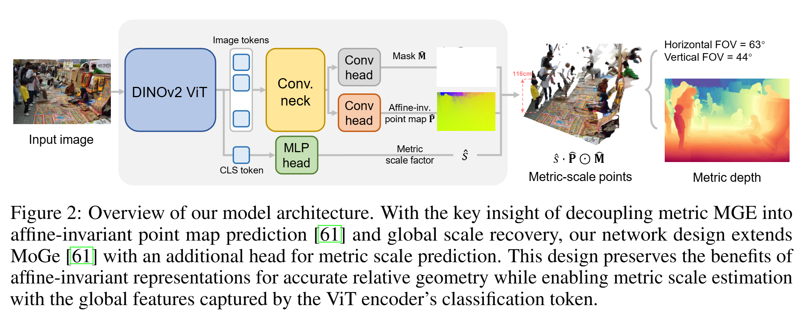

# 论文标题: MoGe-2: Accurate Monocular Geometry with Metric Scale and Sharp Details - arXiv 2025

### 一、引言与核心问题

本文的研究背景聚焦于单目几何估计（Monocular Geometry Estimation, MGE），这是一项从单张二维图像中恢复三维场景几何结构的基础性计算机视觉任务。随着大规模数据集和基础模型的兴起，MGE 取得了显著进展。然而，理想的 MGE 方法需要在三个关键方面同时表现出色：几何结构的相对准确性、具有真实世界物理单位的度量尺度（metric scale）、以及能够捕捉精细表面变化的几何粒度。现有方法往往在这些目标之间进行权衡，例如，一些方法能恢复准确的相对几何，但缺乏度量尺度；另一些方法追求精细细节，却可能牺牲整体的几何精度。因此，如何在一个统一的框架内同时实现这三个目标，是当前 MGE 领域面临的核心挑战。

**论文试图解决的核心任务是什么？**

本文的核心任务是开发一个开放域的单目几何估计模型 MoGe-2，它能从任意单张图像中，恢复出一个具有精确度量尺度和清晰细节的三维点图（3D point map）。

*   **输入 (Input)**:
    *   单张RGB图像 $I$。
    *   **数据维度/Shape**: `[Batch_size, 3, H, W]`，其中 `H` 和 `W` 分别是图像的高和宽。模型支持可变分辨率的输入。

*   **输出 (Output)**:
    *   一个与输入图像像素对齐的三维点图 $P_{metric}$，其中每个点的坐标都具有真实的度量尺度（例如，米）。
    *   **数据维度/Shape**: `[Batch_size, 3, H, W]`，其中3个通道分别对应三维空间中的X, Y, Z坐标。同时，模型内部也预测了相机的内参（焦距和主点偏移），使得这个点图可以被正确地解释和使用。

*   **任务的应用场景**:
    *   **增强现实 (AR)**: 将虚拟物体无缝地放置在真实世界场景中。
    *   **机器人与自动驾驶**: 用于场景理解、障碍物规避和自主导航。
    *   **三维内容创作与编辑**: 为图像编辑、新视角合成和场景重建提供几何先验。
    *   **即时定位与地图构建 (SLAM)**: 为SLAM系统提供度量尺度的几何初始化。

*   **当前任务的挑战 (Pain Points)**:
    1.  **尺度模糊性 (Scale Ambiguity)**: 从单张图像中恢复的几何结构本质上缺少绝对尺度信息。这是一个固有的病态问题。
    2.  **相对几何与度量尺度的权衡**: 强制模型直接预测度量尺度，可能会干扰对场景相对几何结构的学习，导致形状失真。这是因为场景的尺度（室内 vs. 室外）差异巨大，使得网络输出值的动态范围过大，难以优化。
    3.  **数据质量与细节恢复的矛盾**: 真实世界的数据（如LiDAR、SfM）虽然提供了宝贵的监督信号，但往往存在噪声、不完整性和对齐错误，尤其是在物体边缘和薄结构处，这极大地限制了模型学习恢复精细几何细节的能力。而纯合成数据虽然细节清晰，但与真实世界存在领域差距（domain gap），导致在真实图像上泛化能力不足，几何精度下降。

*   **论文针对的难点**:
    本文明确地针对上述第2和第3个难点进行设计。它通过解耦（decoupling）设计来解决相对几何与度量尺度的权衡问题，并通过一个创新的数据精炼管线（data refinement pipeline）来解决真实数据质量与细节恢复的矛盾。

### 二、核心思想与主要贡献

*   **直观动机与设计体现**:
    本研究的直观动机是，一个场景的**相对几何结构**（物体的形状、布局）和它的**全局度量尺度**（整个场景是几米还是几百米）是两个不同性质的问题。前者是一个密集的、像素级别的预测任务，而后者则更依赖于对整个场景内容的全局理解。因此，将这两个任务解耦，用不同的网络模块和信息源来分别处理，应该能避免它们之间的相互干扰，从而同时优化两者。这一动机直接体现在其网络架构设计上：模型保留了其前身MoGe的仿射不变（affine-invariant）几何预测分支来保证相对几何精度，并额外增加了一个独立的、利用全局特征（ViT的CLS token）的MLP头来专门预测全局尺度因子。

*   **与相关工作的比较与创新**:
    本研究与 **MoGe** [61] 最为相关，MoGe-2 正是建立在 MoGe 之上的扩展。MoGe 成功地预测了高质量的仿射不变点图，但在度量尺度和精细细节上有所欠缺。MoGe-2 的核心创新在于，它在不牺牲 MoGe 相对几何精度的前提下，成功地引入了度量尺度预测和细节恢复能力。与 **Depth Anything V2** [67] 等利用合成数据提升细节的方法相比，MoGe-2 的创新之处在于它没有抛弃真实数据，而是提出了一套精炼真实数据的流程，从而在保证细节锐利度的同时，维持了由真实数据带来的高几何精度。

*   **核心贡献与创新点**:
    1.  **解耦的度量几何估计框架**: 提出了一个将度量几何估计任务分解为“仿射不变的相对几何预测”和“全局尺度因子预测”的框架。这种解耦设计保留了仿射不变表示在学习相对几何上的优势，同时稳定、准确地引入了度量尺度。
    2.  **实用的真实数据精炼管线**: 设计了一套结合合成数据先验来过滤和补全真实世界训练数据的方法。该方法能有效去除真实数据中的噪声和不匹配，并用清晰的几何结构填充缺失区域，从而在不牺牲几何精度的前提下，显著提升了模型恢复精细细节的能力。
    3.  **SOTA性能**: 实验证明，MoGe-2 在相对几何精度、度量尺度准确性和边界锐利度这三个关键指标上，同时达到了当前最佳水平，超越了以往所有基线方法。

### 三、论文方法论 (The Proposed Pipeline)

* **整体架构概述**:
  MoGe-2的整体流程始于一个DINOv2-ViT骨干网络，它负责从输入的单张RGB图像中提取强大的视觉特征。这些特征随后被送入两个解耦的预测头：一个卷积解码器（继承自MoGe）用于预测一个仿射不变的3D点图，它精确地描述了场景的相对几何结构；另一个轻量级的MLP头则利用DINOv2输出的全局场景描述符（CLS token）来预测一个单一的全局度量尺度因子。最终，通过将尺度因子应用于仿射不变点图，即可恢复出具有精确度量尺度和丰富细节的最终3D几何。此外，为了提升细节恢复能力，论文在训练阶段引入了一个关键的数据精炼步骤，利用合成数据的锐利边界先验来清洗和增强真实世界数据集。

* **详细网络架构与数据流**:
  *   **数据预处理**: 输入图像 `I` 被缩放到合适的分辨率，以匹配 DINOv2 编码器期望的patch数量。
  *   **特征编码 (Encoder)**:
      
      *   **层/模块类型**: 使用预训练的 DINOv2-ViT-Large 作为图像编码器。
      *   **设计细节**: DINOv2以其强大的、无需监督学习到的视觉表征能力而著称。模型从 DINOv2 的多个中间 Transformer 层（第6, 12, 18, 24层）提取多尺度特征，并将它们融合，形成用于密集预测的特征金字塔。同时，编码器输出的分类令牌 (CLS token) 被单独分离出来，它编码了关于整个图像的全局上下文信息。
      *   **形状变换**: 输入图像 `[B, 3, H, W]` 经过 DINOv2 后，输出两部分：(1) 一系列 patch 特征图，将被送入卷积颈部；(2) 一个全局CLS token特征向量，形状为 `[B, D]`，其中 `D` 是特征维度。
  *   **相对几何预测分支 (Geometry Branch)**:
      
      *   **层/模块类型**: 一个共享的 **卷积颈部 (Convolutional Neck)** 和一个任务特定的 **卷积头 (Convolutional Head)**。
      *   **设计细节**: 颈部网络由一系列的残差块 (ResBlocks) 和上采样层 (转置卷积) 组成，逐步将编码器提取的低分辨率特征图恢复到更高分辨率。这个过程融合了多尺度信息。几何预测头连接在颈部网络之后，输出最终的仿射不变点图。
      *   **形状变换**: 编码器特征经过颈部和头部的上采样和解码，最终输出一个形状为 `[B, 3, H_out, W_out]` 的张量，即仿射不变点图 $\hat{P}$。【另有 `[B, 1, H_out, W_out]` 的掩码 $\hat{M}$ 】
  *   **度量尺度预测分支 (Scale Branch)**:
      *   **层/模块类型**: 一个 **CLS令牌条件化的MLP头 (CLS-token-conditioned MLP Head)**。
      *   **设计细节**: 这是一个简单的两层多层感知机（MLP）。它的输入是 DINOv2 编码器输出的 CLS token 特征向量。这种设计基于一个核心洞察：全局度量尺度是一个与整个场景相关的属性，而 CLS token 正是捕获这种全局信息的理想载体。输出经过指数函数确保尺度为正。
      *   **形状变换**: `[B, D]` 的 CLS token 输入 MLP 后，输出一个标量尺度因子 $\hat{s}$ ，形状为 `[B, 1]`。
      *   **作用分析**: 表4的消融实验有力地证明了这一设计的优越性。与直接预测尺度变换点图的“纠缠式(Entangled)”设计，或使用卷积头从局部特征中预测尺度的“解耦式 (Conv. head) ”设计相比，使用 CLS-MLP 头的方案在度量几何精度上取得了最佳性能，同时保持了最高的相对几何精度。这证实了利用全局信息（CLS token）来预测全局属性（尺度）并将其与局部几何预测解耦的正确性。
  *   **真实数据精炼 (Real Data Refinement)**:
      *   这是一个在训练数据准备阶段执行的离线流程，而非网络的一部分，但对最终性能至关重要。
      1.  **不匹配点过滤 (Mismatch Filtering)**: 首先，训练一个仅使用合成数据的 MoGe 模型，记为 $G_{\text{syn}}$ 。然后，将这个模型应用于真实的 RGB 图像以生成伪深度图。对于每个真实数据点，比较其在小邻域内的局部几何结构与 $G_{\text{syn}}$ 预测的局部几何结构。若最优对齐后数据点间差异过大，则将该真实数据点标记为不可靠并过滤【$O_j = \{i \ | \ \|s^*_j \mathbf{p}_i + \mathbf{t}^*_j - \hat{\mathbf{p}}_i\| > \hat{r}_j, \ i \in \hat{S}_j\}$】。这种局部对齐比较是关键，它避免了 $G_{\text{syn}}$ 模型可能存在的全局尺度偏差问题，只利用其可靠的局部结构信息。
      2.  **几何补全 (Geometry Completion)**: 在过滤掉噪声点后，数据图中出现了孔洞。此时，使用对数空间的泊松方程求解【$\min_{\{\tilde{d}_i\}_{i \in \tilde{\mathcal{M}}_{\text{filtered}}}} \sum_{i \in \tilde{\mathcal{M}}_{\text{filtered}}} \|\nabla(\log \tilde{d}_i) - \nabla(\log \hat{d}_i)\|^2, \quad \text{s.t.} \quad \tilde{d}_i = d_i, \forall i \in \mathcal{M}_{\text{unfiltered}}$】来填充这些区域。该方法以剩余的可靠真实数据点作为边界条件，用$G_{\text{syn}}$预测的深度图的梯度来填充内部。这巧妙地实现了“借用”合成数据的锐利细节（梯度信息），同时“锚定”于真实数据的准确绝对深度（边界值），最终生成了既准确又细节丰富的训练标签。

* **损失函数 (Loss Function)**:
  * **设计理念**: 损失函数同样体现了解耦思想，由两部分独立构成。
  
  *   **几何损失 $L_G$**:
      *   **数学形式**: $L_G = \sum_{i \in M} \frac{1}{z_i} ||s^* \hat{P}_i + t^* - P_i||_1$
      *   **关注重点**: 这是从MoGe继承的鲁棒 L1 损失。它计算预测的仿射不变点图 $\hat{P}$ 在通过最优尺度 $s^*$ 和平移 $t^*$ 对齐到真值点图 $P$ 后的误差。$s^*$ 和 $t^*$ 是通过鲁棒的 ROE 对齐算法在线计算的。该损失专注于学习准确的相对几何，而将尺度的影响通过在线对齐排除了。
      
  *   **尺度损失 $L_s$**:
      * **数学形式**: $L_s = ||\log(\hat{s}) - \text{stopgrad}(\log(s^*))||_2^2$
      
      * **关注重点**: 这是一个简单的 L2 损失，在对数空间中监督 MLP 头预测的尺度因子 $\hat{s}$ 接近于从几何损失中在线计算出的最优尺度因子 $s^*$。
      
      * **训练实施**: `stopgrad` 操作至关重要。它阻断了尺度损失的梯度回传到几何预测分支，从而确保了尺度学习任务不会对相对几何的学习产生干扰，这是实现解耦的关键技术细节。
      
        >  为什么不需要预测 $\hat{t}$ : 模型的几何分支，在海量数据的“引导”和自身网络结构（从像素到点云的空间映射）的“约束”下，最终学会的能力并不仅仅是预测一个仿射不变的“形状”，而是预测一个已经“隐式定位”好的、只是尺度需要被校正的点云 $\hat{P}_{\text{affine}}$。
  
* **数据集 (Dataset)**:
  
  *   **所用数据集**: 论文使用了非常大规模和多样化的数据集进行训练，总共24个，包括：
      *   16个合成数据集 (如Hypersim, TartanAir等)
      *   3个LiDAR扫描数据集 (如Waymo, Argoverse2等)
      *   5个SfM重建数据集 (如MegaDepth, ScanNet++等)
  *   **特殊处理**: 最关键的处理就是上文详述的真实数据精炼管线。通过这个流程，论文实际上是为LiDAR和SfM数据集生成了一套新的、质量更高的训练标签。

### 四、实验结果与分析

*   **核心实验结果**:
    论文在10个标准测试集上进行了全面的评估。MoGe-2在各项指标上均取得了领先或极具竞争力的结果，尤其是在平衡各个方面性能的能力上。

    **表1: 相对几何评估 (平均排名)**
    
    | 指标 (越低越好) | MoGe | UniDepth V2 | Depth Pro | **Ours (MoGe-2)** |
    | :-------------- | :--: | :---------: | :-------: | :---------------: |
    | 平均排名        | 2.53 |    2.88     |   4.52    |     **2.05**      |
    
    **表2: 度量几何评估 (平均排名)**

    | 指标 (越低越好) | UniDepth V2 | Depth Pro | Metric3D V2 | **Ours (MoGe-2)** |
    | :-------------- | :---------: | :-------: | :---------: | :---------------: |
    | 平均排名        |    2.51     |   3.83    |    2.75     |     **1.95**      |
    
    **表3: 边界锐利度评估 (F1分数, 越高越好)**

    | 方法       | MoGe | UniDepth V2 | Depth Pro | **Ours (MoGe-2)** |
    | :--------- | :--: | :---------: | :-------: | :---------------: |
    | 平均F1分数 | 4.67 |    3.75     | **1.50**  |       1.75        |
    
    从上表可见，MoGe-2在相对几何和度量几何上都取得了最佳的平均排名。在边界锐利度上，虽然Depth Pro略高，但MoGe-2远超其他方法，且Depth Pro在几何精度上表现不佳（见图6鳄鱼的例子）。MoGe-2是唯一一个在所有三个维度（相对几何、度量几何、锐利度）都名列前茅的方法。
    
*   **消融研究解读**:
    表4的消融研究揭示了模型设计的关键。
    1.  **尺度预测头设计**: 对比"Entangled"、"Decoupled (Conv. head)"和"Decoupled (CLS-MLP)"三种设计，CLS-MLP方案在度量几何误差（`Rel_p`从10.0/9.62降至9.20）和深度误差（`Rel_d`从17.9/17.7降至16.5）上均取得最低值，验证了解耦和利用全局信息进行尺度预测的有效性。
    2.  **数据精炼的作用**: 对比"Synthetic data only", "w/ Raw real data", "w/ Improved real data"三种训练数据配置，结果显示：
        *   仅使用合成数据，锐利度最高（F1=13.3），但几何精度最低。
        *   加入原始真实数据后，几何精度大幅提升（`δ^p`从87.3%升至92.2%），但锐利度下降（F1=10.3）。
        *   使用本文精炼后的真实数据，几何精度几乎保持不变（`δ^p`=91.9%），同时锐利度得到显著恢复（F1=12.5）。这完美证明了数据精炼管线在平衡几何精度和细节锐利度方面的关键作用。

*   **可视化结果分析**:
    图6的定性比较非常直观。在室内和室外场景中，MoGe-2预测的几何不仅在度量尺度上（如2.94m vs 2.98m）与真值最为接近，而且在物体边界（如椅子腿、汽车轮廓）上比MoGe和UniDepth V2清晰得多。相比之下，以锐利度著称的Depth Pro虽然细节丰富，但在鳄鱼等开放域图像上出现了严重的几何扭曲，证明了其泛化能力的不足。

### 五、方法优势与深层分析

*   **架构/设计优势**:
    *   **优势详述**:
        1.  **关注点分离**: 模型的解耦架构是一种高效的“分而治之”策略。相对几何分支可以专注于学习复杂的局部空间关系，而不被场景间巨大的尺度变化所干扰。尺度预测分支则可以轻装上阵，仅需从全局信息中回归一个标量，任务更简单、更稳定。
        2.  **信息与任务的匹配**: 将全局信息（CLS token）用于预测全局属性（尺度），将局部和半全局信息（卷积特征）用于预测密集属性（几何），这种信息与任务的精准匹配是架构高效的根本原因。
        3.  **数据优势的融合**: 数据精炼管线并非简单地混合数据，而是通过“过滤-补全”的流程，巧妙地将合成数据的“锐利梯度”与真实数据的“准确深度”融合在了一起，创造出一种比原始数据更优质的训练信号。
    *   **原理阐释**: 这种设计之所以有效，是因为它遵循了视觉感知的基本原理。人类感知一个场景时，也是先快速获得场景类型、大致尺度等全局信息（"这是一个室内房间"），然后再去关注物体的具体形状和细节。MoGe-2的架构在某种程度上模拟了这一过程。

*   **解决难点的思想与实践**:
    1.  **解决“几何-尺度权衡”**: 核心思想是**解耦**。实践上，通过设计两个独立的网络分支，并使用`stopgrad`在损失层面彻底切断它们的梯度依赖，从而实现了端到端的、无干扰的联合训练。
    2.  **解决“数据-细节矛盾”**: 核心思想是**数据融合而非替换**。实践上，通过一个基于局部几何对齐的过滤机制，识别并剔除真实数据中的不可靠部分，再利用泊松重建，以真实数据为锚点、合成数据为细节参考进行填充，从而在不损害真实数据带来的精度和泛化性的前提下，注入了合成数据的细节优势。

### 六、结论与个人思考

*   **论文的主要结论回顾**:
    本文成功地提出了MoGe-2，一个在单目几何估计任务中，首次同时在相对几何精度、度量尺度准确性和细节锐利度上均达到SOTA水平的模型。其核心贡献在于创新的解耦式架构和实用的数据精炼管线，为解决MGE领域的长期挑战提供了有效且优雅的方案。

*   **潜在局限性**:
    *   **极细结构**: 如论文所述，模型对于头发、细线等极度精细的结构捕捉能力仍然有限。
    *   **尺度先验依赖**: 模型的度量尺度预测依赖于在训练数据中学到的语义和尺度先验。对于训练集中未见过或极端的场景（例如微距摄影或航拍图像），其尺度预测可能会出现偏差。
    *   **结构规整性**: 在前景和背景尺度差异巨大的情况下，可能会难以保持远景中大型结构的绝对规整性（如建筑物的直线）。

*   **未来工作方向**:
    *   **架构增强**: 可以探索更先进的网络架构，例如结合注意力机制来更好地处理长距离依赖，以改善对大型规整结构的一致性预测。
    *   **多源先验融合**: 引入更多的真实世界先验，如物理约束、场景语法等，来处理尺度模糊性和 out-of-distribution 的情况。
    *   **交互式优化**: 允许用户通过稀疏输入（如几个点的深度值）来交互式地纠正和优化预测的几何与尺度，提高在特定应用中的可用性。