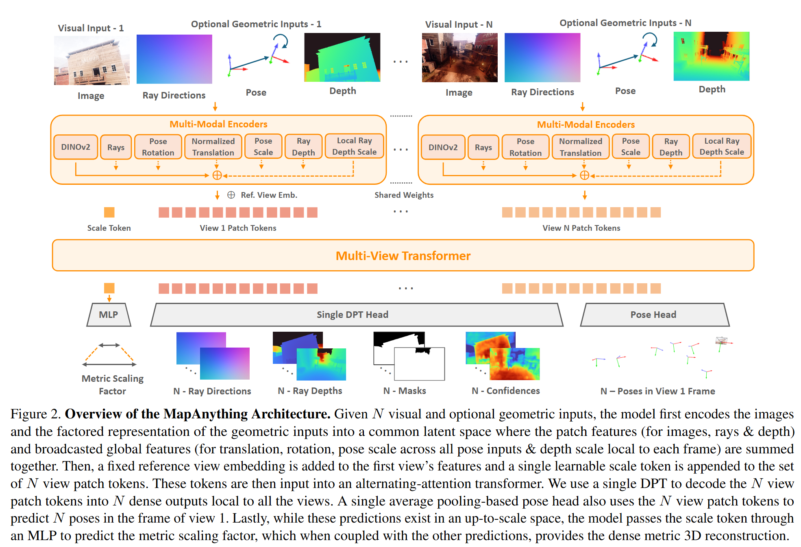

# 论文标题: MapAnything: Universal Feed-Forward Metric 3D Reconstruction - arXiv 2025

### 一、引言与核心问题

本论文的研究背景聚焦于计算机视觉与图形学中的一个基础且持久的挑战：从多视图图像中进行三维重建（3D Reconstruction）。传统方法通常将此问题分解为多个独立的子任务，如特征匹配、姿态估计、相机标定、多视图立体匹配（MVS）和捆绑调整（Bundle Adjustment, BA），流程复杂且环环相扣。近年来，深度学习尤其是Transformer架构的进步，推动了端到端的“前馈式”（Feed-Forward）重建方法的发展，旨在用一个统一的模型直接从输入图像生成三维场景。MapAnything正是在这一趋势下的重要进展，它旨在构建一个通用的、灵活的三维重建“骨干网络”（Backbone），能够处理极其多样的输入组合，并以单一前馈方式输出带有真实物理尺度（Metric-Scale）的三维重建结果。

*   **论文试图解决的核心任务是什么？**
    该论文旨在解决一个统一的多视图度量三维重建任务（Universal Multi-view Metric 3D Reconstruction）。其核心是设计一个单一模型，能够灵活地处理超过12种不同的三维视觉子任务，如无标定运动恢复结构（Uncalibrated SfM）、已标定多视图立体匹配（Calibrated MVS）、单目深度估计、相机定位等。

    *   **输入 (Input)**: 模型的输入设计极为灵活，以一组包含 $N$ 张视图的数据为单位。
        *   **必需输入**:
            *   $N$ 张RGB图像 $\hat{I} = (\hat{I}_i)_{i=1}^N$。数据形态为 `[N, 3, H, W]`。
        *   **可选输入 (Optional Geometric Inputs)**: 针对全部或部分视图，可以提供以下任意组合的几何信息。
            *   **相机内参 (Intrinsics)**: 以每个像素的光线方向向量 $R = (R_i)_{i \in S_r}$ 来表示，这是一种通用的中心相机模型表达。数据形态为 `[N_r, H, W, 3]`，其中 $N_r$ 是提供内参的视图数量。
            *   **相机外参/位姿 (Poses)**: 以相对于第一视图的姿态表示，包括由四元数 $Q=(Q_i)_{i \in S_q}$ 表示的旋转和由平移向量 $T=(T_i)_{i \in S_t}$ 表示的位置。数据形态分别为 `[N_q, 4]` 和 `[N_t, 3]`。
            *   **深度图 (Depth)**: 每个像素的射线深度 $D=(D_i)_{i \in S_d}$。可以是稠密的，也可以是稀疏的。数据形态为 `[N_d, H, W]`。

    *   **输出 (Output)**: 模型输出一个“因子化”（Factored）的度量三维场景表示。
        *   **全局度量尺度因子 (Global Metric Scaling Factor)**: 一个标量 $m \in \mathbb{R}$，用于将整个重建结果统一到真实的物理尺度。
        *   **每视图的几何信息**: 对于 $N$ 个输入视图中的每一个，输出：
            *   **光线方向 (Ray Directions)**: $R_i \in \mathbb{R}^{H \times W \times 3}$，即相机内参。
            *   **尺度待定深度图 (Up-to-scale Ray Depths)**: $\tilde{D}_i \in \mathbb{R}^{H \times W \times 1}$，这是一个相对深度图。
            *   **相机位姿 (Camera Poses)**: $P_i \in \mathbb{R}^{4 \times 4}$，相对于第一视图坐标系的相机位姿，包括旋转和尺度待定的平移。
            最终，通过组合这些因子化的输出，可以得到最终的度量三维重建结果 $X^{\text{metric}} = m \cdot X_i$，其中 $X_i$ 是由位姿 $P_i$ 和局部点云 $L_i = R_i \odot \tilde{D}_i$ 变换得到的在世界坐标系下的尺度待定点云。

    *   **任务的应用场景**:
        *   增强现实（AR）与虚拟现实（VR）中的场景理解与交互。
        *   机器人导航与环境感知。
        *   自动驾驶中的高精度地图构建。
        *   数字孪生与城市建模。
        *   电影特效与游戏制作。

    *   **当前任务的挑战 (Pain Points)**:
        1.  **输入异构性 (Heterogeneous Inputs)**: 现实世界的重建任务中，可用的信息源千差万别。有些只有图像，有些有IMU提供的位姿，有些则有LiDAR提供的稀疏深度。现有模型通常针对固定输入设计，难以灵活利用所有可用的辅助信息。
        2.  **任务多样性 (Diverse Tasks)**: 传统上，SfM、MVS、相机标定等都是由不同的专用算法解决的。构建一个能够同时处理这些任务的统一模型，需要一个高度灵活且表达能力强的架构。
        3.  **度量尺度恢复 (Metric Scale Ambiguity)**: 仅从图像进行重建本质上存在尺度不确定性。要恢复真实的物理尺度，通常需要额外的传感器信息（如GPS、IMU）或特定的场景假设。如何在一个统一框架内有效融入度量信息并预测尺度是一个核心难点。
        4.  **计算效率与扩展性**: 传统的BA等优化方法计算成本高昂。而现有的端到端方法在处理大量视图时，计算复杂度和显存消耗会急剧增加，扩展性受限。

    *   **论文针对的难点**: MapAnything 主要聚焦于解决上述的 **输入异构性**、**任务多样性** 和 **度量尺度恢复** 这三大难点。它通过创新的因子化场景表示和灵活的输入编码机制，成功地将多种三维视觉任务统一到一个单一的前馈模型中。

### 二、核心思想与主要贡献

*   **直观动机与设计体现**:
    本研究的直观动机是：一个真正通用的三维重建系统，应当像一个“瑞士军刀”，能够根据当前可用的“工具”（输入信息）灵活地解决问题。如果已知相机内参，模型就不应该再浪费精力去预测它；如果已知精确的度量位姿，模型就应该利用这些信息来指导重建并输出符合真实尺度的结果。
    这一动机主要体现在两个设计上：
    1.  **灵活的输入编码**: 模型为图像、光线方向、位姿、深度等每一种可能的输入都设计了专门的编码器，并将它们编码到同一个共享的特征空间中进行融合。通过在训练时对这些可选输入进行随机组合（概率性输入），模型学会了在有辅助信息时利用它，在没有时则从图像中推断它。
    2.  **因子化的场景表示 (Factored Scene Representation)**: 这是论文最核心的洞见。不同于直接预测耦合的场景表示（如点云），MapAnything将场景分解为一系列相对独立的几何因子：每视图的局部几何（光线方向、深度）和全局结构（相机位姿、度量尺度）。这种解耦的设计使得模型可以对场景的不同方面进行独立或联合的推理与监督，极大地增强了模型的灵活性和对不同任务的适应性。

*   **与相关工作的比较与创新**:
    MapAnything与DUSt3R [72]、VGGT [66] 等前馈式重建工作最为相关。
    *   **相较于DUSt3R/MASt3R**: 这些工作预测的是一个耦合的场景表示（点云），需要复杂的后处理来恢复相机参数和几何，并且输入是固定的（仅图像）。MapAnything直接预测解耦的几何因子，无需后处理，并且能处理异构输入。
    *   **相较于VGGT**: VGGT在多视图推理上取得了巨大进步，但同样仅限于图像输入，且其预测包含冗余信息（例如，同时预测点云、相机和深度）。MapAnything通过完全因子化的表示消除了这种冗-余，并且扩展到了更广泛的输入模态。
    *   **相较于Pow3R**: Pow3R是少数尝试利用先验（Priors）作为输入的工作之一，但它仅限于双视图、简单的针孔相机模型，并且无法处理度量尺度信息。MapAnything则支持任意数量的视图、通用中心相机模型，并能有效利用和预测度量尺度。

*   **核心贡献与创新点**:
    1.  **提出一个统一的、端到端的前馈模型**: 该模型能够处理超过12种不同的三维重建任务配置，在单一模型中实现了前所未有的任务通用性。
    2.  **设计了因子化的场景表示**: 将场景分解为光线方向、深度、位姿和全局度量尺度。这种解耦表示是实现模型灵活性和高效性的关键，使得模型能够灵活处理异构输入和在具有部分标注的异构数据集上进行有效训练。
    3.  **实现了SOTA性能与开源贡献**: 实验证明，MapAnything在多个基准测试中达到或超越了为特定任务设计的专用模型。同时，论文开源了代码、数据处理流程和预训练模型，为社区构建未来的三维/四维基础模型提供了坚实的基础。

### 三、论文方法论 (The Proposed Pipeline)

*   **整体架构概述**:
    MapAnything的整体流程遵循一个编码器-处理器-解码器的模式。首先，对于给定的 $N$ 个视图，一个多模态编码器（Multi-Modal Encoders）将输入的图像和可选的几何信息（光线、位姿、深度）分别编码并融合成统一的、与视图相关的Patch特征。随后，一个全局的多视图Transformer（Multi-View Transformer）负责在所有视图的特征之间进行信息交互和推理。最后，几个专门的解码头（Decoder Heads）从Transformer的输出特征中回归出最终的因子化场景表示：每视图的光线方向、深度、相机位姿，以及一个全局的度量尺度因子。

*   **详细网络架构与数据流**:
    *   **数据预处理与编码** (Encoding Images & Geometric Inputs):
        
        1. 图像并行编码
        
           - 输入 $N$ 个视图的图像数据，每个视图的 形状 (Shape) 为 `[B, 3, H, W]`，其中 `B` 是每个视图的批大小（在多GPU训练中，这通常是 `imgs_per_gpu / num_views`）。
           - 拼接 (Concatenation): 为了进行高效的批处理，函数首先使用 `torch.cat` 将 $N$ 个视图的图像张量沿着批次维度（dim=0）拼接成一个大的张量。 `N` 个 `[B, 3, H, W]` -> `[N*B, 3, H, W]`。
           - 编码: 将这个大的张量一次性送入 DINOv2 (ViT-L) 编码器。 `[N*B, 3, H, W]` -> `[N*B, 1024, H/14, W/14]`。这里的 `1024` 是DINOv2 ViT-L的嵌入维度，`14` 是Patch大小。
           - 切分 (Chunking): 将编码后的特征张量沿着批次维度切分成 $N$ 块，还原为与输入视图对应的特征列表。 `[N*B, 1024, H/14, W/14]` -> `N` 个 `[B, 1024, H/14, W/14]` 的张量列表。
           - 输出一个包含 $N$ 个元素的列表，每个元素都是对应视图的图像Patch特征，形状为 `[B, 1024, H/14, W/14]`。
        
        2. 几何信息编码与因子化：是模型灵活性的核心，融合的基本原则是逐元素相加。
        
           * 光线方向 (Ray Directions / Intrinsics)
        
             > 光线方向指从相机的光心出发到像素点的方向，相当于相机的内参
        
             * 输入光线方向图，形状为 `[B, H, W, 3]`。
        
             * 编码: 通过一个专门的、轻量的CNN编码器进行编码 `[B, H, W, 3]` -> `[B, 1024, H/14, W/14]`。该编码器的输出维度和空间尺寸与DINOv2的输出完全对齐。
        
             * 融合: 将编码后的光线方向特征与对应视图的图像特征进行逐元素相加。
        
                > `fused_features = image_features + ray_features`。
        
           * 深度 (Depth)
        
             1. 输入深度图，形状为 `[B, H, W, 1]`。
             2. 因子化
                - 归一化深度: 对每个深度图，计算其非零像素的平均值，得到深度尺度 `depth_norm_factor` (一个标量)。然后用原始深度图除以该尺度，得到归一化深度图。
                - 深度尺度: `depth_norm_factor` 本身。
             3. 编码
                - 归一化深度编码: 归一化深度图（经过对数缩放）被送入轻量 CNN 编码器 `[B, H, W, 1]` -> `[B, 1024, H/14, W/14]`。
                - 深度尺度编码: 深度尺度（经过对数缩放）被送入一个MLP编码器 `[B]` -> `[B, 1]` -> `[B, 1024]`。
             4. 融合: 首先，将归一化深度特征与（可能已经融合了光线特征的）图像特征相加。然后，将深度尺度特征 `[B, 1024]` 通过广播扩展到 `[B, 1024, H/14, W/14]`，再与上述结果相加。该视图的每个Patch都获得了相同的深度尺度信息。
        
           * 相机位姿 (Camera Pose)
        
             1. 输入旋转（四元数 `[B, 4]`）和位移（平移向量 `[B, 3]`）。
             2. 因子化: 计算所有输入视图平移向量的平均模长，得到位姿尺度 `pose_trans_norm_factors`。然后用原始平移向量除以该尺度，得到归一化的平移方向。
             3. 编码
                - 旋转编码: 四元数送入MLP编码器 `[B, 4]` -> `[B, 1024]`。
                - 平移方向编码: 归一化平移向量送入MLP编码器 `[B, 3]` -> `[B, 1024]`。
                - 位姿尺度编码: 位姿尺度 `pose_trans_norm_factors` 取对数后送入MLP编码器 `[B]` -> `[B, 1]` -> `[B, 1024]`。
             4. 融合: 将上述三个编码后的特征（旋转、平移方向、位姿尺度），全部通过广播扩展到 `[B, 1024, H/14, W/14]`，然后逐元素相加到累积的特征图上。
        
           * 最终融合层: 在所有可能的几何特征都通过逐元素相加融合完毕后，代码应用了一个 `LayerNorm`。这会稳定融合后的特征，为其进入Transformer做准备。形状 `[B, 1024, H/14, W/14]` 保持不变。
        
        3. Transformer输入序列构建
        
           - 展平 (Flattening): 将每个视图融合后的特征展平为Patch序列 `[B, 1024, H/14, W/14]` -> `[B, Num_patches, 1024]`，其中 `Num_patches = (H/14) * (W/14)`。
           - 拼接 (Concatenation): 将 $N$ 个视图的Patch序列沿着序列长度维度（dim=1）进行拼接。`N` 个 `[B, Num_patches, 1024]` -> `[B, N*Num_patches, 1024]`。
           - 添加 `scale_token`: 创建一个可学习的参数 `self.scale_token`（形状为 `[1024]`），并将其扩展到 `[B, 1, 1024]`。然后，将其拼接在整个Patch序列的最前面 `[B, N*Num_patches, 1024]` -> `[B, N*Num_patches + 1, 1024]`。
           - 维度投影: 在送入Transformer之前，这一长序列的特征维度会从1024被一个线性层投影到Transformer的工作维度768，形状为 `[B, N*Num_patches + 1, 768]`。
        
        4. MapAnything模型在将特征序列送入其核心的多视图Transformer之前，没有添加任何新的、显式的位置编码。
        
           - 论文明确指出：We find that the patch-level positional encoding from DINOv2 suffices.
        
    *   **多视图Transformer** (Multi-View Transformer):
        
        1.  **Token准备**: 将 $N$ 个视图的Patch Tokens $F_{E,i}$ 展平并拼接在一起。为了区分参考视图（默认为第一视图），会给第一视图的Tokens加上一个固定的“参考视图嵌入”（Reference View Embedding）。最关键的是，在所有视图的Tokens集合前，会附加一个可学习的 `scale_token`。这个`scale_token`的设计是专门用来聚合场景的全局度量尺度信息的。
        2.  **核心结构**: Transformer主体采用了一个24层的交替注意力（Alternating-Attention）结构。这种结构在处理多视图数据时比标准自注意力更高效，它交替地在空间维度（一个视图内的所有Patches）和视图维度（不同视图间的对应Patches）上执行注意力操作。这使得模型既能理解单个视图的内部结构，又能建立跨视图的几何对应关系。
        3.  **形状变换**: 输入Transformer的Tokens形状为 `[1, N*Num_patches + 1, 768]` (维度被MLP投影到768)。经过24层处理后，输出形状保持不变。
        
    *   **解码与输出** (Factored Scene Representation Prediction):
        
        1.  **几何解码**: 将Transformer输出的对应于 $N$ 个视图的Patch Tokens，分别送入一个共享的DPT解码头。这个解码头负责预测密集的、逐像素的输出，包括光线方向 $R_i$ 和尺度待定深度 $\tilde{D}_i$。
        2.  **位姿解码**: 将Transformer输出的 $N$ 视图Patch Tokens 输入到一个基于平均池化的卷积姿态头（Pose Head），预测出每个视图相对于第一视图的位姿 $P_i$（由四元数 $Q_i$ 和尺度待定平移 $\tilde{T}_i$ 组成）。
        3.  **尺度解码**: 将Transformer输出的 `scale_token` 经过一个简单的2层MLP，预测出全局度量尺度因子 $m$。作者发现对MLP的输出取指数（exponential scale）能更好地处理尺度变化范围大的情况。
        4.  **最终组合**: 通过上述步骤，模型得到了所有因子化的输出 $\{m, (R_i, \tilde{D}_i, P_i)_{i=1}^N\}$，它们可以被直接组合以形成最终的度量三维重建。
    
*   **损失函数 (Loss Function)**:
    *   **设计理念**: 损失函数的设计紧密围绕其因子化的输出。它由多个分量组成，分别监督场景表示的不同方面，并通过加权求和构成总损失。一个关键的设计是在对深度、点云和尺度等依赖于尺度的量计算损失时，使用了对数空间（log-space），这对于处理不同场景的巨大尺度差异至关重要。
    *   **具体构成**:
        *   $L_{\text{rays}}$ 和 $L_{\text{rot}}$: 分别监督光线方向和姿态旋转。这些量与尺度无关，使用简单的回归损失（如L1或L2）。
        *   $L_{\text{translation}}$: 尺度不变的平移损失，在比较预测平移和真实平移前，会先将它们归一化。
        *   $L_{\text{depth}}$ 和 $L_{\text{lpm}}$ (local pointmaps): 对数空间中的深度和局部点云损失。使用了 $f_{\text{log}}(x) = (x/\|x\|) \cdot \log(1+\|x\|)$ 变换，这有助于稳定训练。
        *   $L_{\text{pointmap}}$: 置信度加权的全局点云损失，同样在对数空间中计算。
        *   $L_{\text{scale}}$: 对数空间中的度量尺度因子损失，监督预测的尺度因子 $m$。
        *   其他损失: 还包括法线损失 $L_{\text{normal}}$ 和多尺度梯度匹配损失 $L_{\text{GM}}$ 以捕捉精细几何细节，以及一个用于预测有效区域的掩码损失 $L_{\text{mask}}$。
    *   **总损失**: $\mathcal{L} = 10 \cdot \mathcal{L}_{\text{pointmap}} + \mathcal{L}_{\text{rays}} + \dots + 0.1 \cdot \mathcal{L}_{\text{mask}}$。权重表明全局点云的一致性是最重要的监督信号之一。
    *   **对性能的贡献**: 这种多分量的、基于对数空间的损失函数设计，使得模型能够从具有不同标注（例如，某些数据集只有位姿，没有深度）的数据集中学习，并稳定地处理各种尺度的场景，是实现模型通用性的关键保障。

*   **数据集 (Dataset)**:
    *   **所用数据集**: MapAnything在一个包含13个不同数据集的大规模集合上进行训练，涵盖了室内、室外、街景、合成数据等多种场景。其中包括BlendedMVS, Mapillary, ScanNet++, TartanAirV2等。这种多样性是训练一个通用模型的基础。
    *   **特殊处理**:
        1.  **MPSD元数据**: 论文对原本是单目深度数据集的MPSD进行了处理，获取了相机位姿和内参信息，将其转变为一个大规模的多视图度量尺度数据集。
        2.  **多视图采样**: 训练时并非随机采样图像，而是预先计算数据集中图像间的共视性（covisibility），然后通过随机游走（random walk）的方式采样出具有良好几何连接性的视图序列。这确保了输入给模型的多视图数据在几何上是相关的，有助于学习对应关系。

### 四、实验结果与分析

*   **核心实验结果**:
    MapAnything在广泛的3D视觉任务中展现了卓越的性能。在多视图重建任务中（图5），无论输入视图数量从2增加到100，MapAnything的性能（点云精度、姿态精度、深度精度）都稳定优于包括VGGT和Pow3R在内的基线方法。更重要的是，当提供额外的几何输入（如内参、位姿）时，其性能会得到显著提升，这证明了其有效利用异构输入的能力。

    以下是双视图重建任务上的核心结果对比（Table 2），展示了在仅使用图像输入时，MapAnything已经取得了SOTA性能。

    | 输入           | 方法            | Points rel $\downarrow$ | Pose ATE $\downarrow$ | Depth rel $\downarrow$ | Rays err° $\downarrow$ |
    | :------------- | :-------------- | :---------------------- | :-------------------- | :--------------------- | :--------------------- |
    | a) Images Only | DUSt3R [72]     | 0.20                    | 0.08                  | 0.17                   | 2.55                   |
    |                | VGGT [66]       | 0.20                    | 0.07                  | 0.13                   | 2.34                   |
    |                | **MapAnything** | **0.18**                | **0.03**              | **0.08**               | **0.99**               |

    从表格中可以看出，在所有关键指标上，MapAnything都显著优于之前的SOTA方法。姿态误差（Pose ATE）和光线方向误差（Rays err°）的降低尤为明显，这直接得益于其更优的架构和训练策略。

*   **消融研究解读**:
    论文中的Table 5a对场景表示（Scene Representation）进行了关键的消融研究。
    *   **结果**: 实验比较了四种不同的场景表示方法：仅局部点云+位姿（Local PM + Pose）、仅光线+深度+位姿（RDP）、局部点云+位姿+尺度（LPMP & Scale），以及论文最终采用的光线+深度+位姿+尺度（RDP & Scale (ours)）。结果清晰地表明，“RDP & Scale (ours)”在所有输入配置下都取得了最佳性能。
    *   **解读**: 这项研究雄辩地证明了**因子化场景表示**和**显式尺度预测**的极端重要性。与直接预测点云相比，将几何分解为RDP（光线、深度、位姿）使得学习目标更清晰、更稳定。而单独引入一个`scale_token`来专门处理全局度量尺度，相比于让网络隐式地学习尺度，效果要好得多。这验证了论文的核心设计选择。

*   **可视化结果分析**:
    图4和图6展示了令人印象深刻的可视化结果。图4中，MapAnything重建的场景比VGGT更完整、更少伪影，尤其是在处理大视差变化、无纹理表面（如水面）和季节变化等挑战性场景时表现出色。图6则展示了模型在室内、室外、艺术品、甚至是单张图像等多种不同领域上的泛化能力，重建结果在几何上相当精细。这些结果直观地证明了MapAnything的鲁棒性和泛化能力。

### 五、方法优势与深层分析

*   **架构/设计优势**:
    *   **优势详述**: MapAnything的优势根植于其**“分解-征服”（Divide and Conquer）**的哲学。
        1.  **因子化表示的灵活性**: 将场景分解为光线、深度、位姿和尺度，使得每个部分都可以被独立地提供为输入或作为预测目标。这从根本上解决了处理异构输入和监督的问题。当提供内参（光线）时，网络可以将注意力更多地放在深度和位姿的推断上。这种设计原理上比那些试图从固定输入推断一切的模型更高效、更精确。
        2.  **显式度量尺度建模**: 通过专用的`scale_token`和尺度解码器，模型将困难的度量尺度恢复问题从复杂的几何推理中分离出来。这个`scale_token`在Transformer中可以聚合所有视图中与尺度相关的线索（例如，输入深度或位姿的度量尺度），从而做出更鲁棒的全局尺度预测。
        3.  **通用的中心相机模型**: 使用光线方向来表示相机内参，而不是传统的焦距、主点等参数，使得模型能够自然地支持各种相机类型（针孔、鱼眼等），只要它们是中心投影模型即可，这极大地增强了模型的通用性。

    *   **原理阐释**: 这些设计之所以能带来优势，是因为它们将一个高度耦合、病态的逆问题（从2D图像恢复3D世界）分解成了多个更简单、更良定的子问题。网络不再需要学习一个从像素到度量点云的“黑盒”映射，而是学习每个几何因子之间的关系以及如何从不同线索中推断它们。这种基于几何先验的结构化设计，使得学习过程更稳定，泛化能力也更强。

*   **解决难点的思想与实践**:
    MapAnything通过**“统一建模”**和**“概率化输入”**的核心思想，在实践中解决了其针对的核心难点。
    *   **统一建模**: 它没有为SfM、MVS等不同任务设计不同的模型或分支，而是提出了一个统一的因子化表示，使得所有这些任务都可以被看作是在这个表示空间中填补缺失信息（当某些因子作为输入时）或完全推断（当只有图像输入时）。
    *   **概率化输入**: 在训练阶段，通过以一定的概率随机组合不同的几何输入，模型被“强迫”学习如何在信息不完整的情况下进行推理。这使得训练出的单一模型天然地具备了处理任意输入组合的能力，而无需为每种组合进行专门的微调或训练。这是一种极其高效和可扩展的训练策略。

### 六、结论与个人思考

*   **论文的主要结论回顾**:
    MapAnything成功地构建了一个通用、灵活且强大的前馈式三维重建骨干网络。它通过创新的因子化场景表示和灵活的输入处理机制，将多种三维视觉任务统一到一个单一模型中，并在多个基准上取得了SOTA性能。这项工作为构建未来的通用三维视觉基础模型铺平了道路。

*   **潜在局限性**:
    1.  **静态场景假设**: 当前模型没有考虑动态物体或场景变化，这在现实应用（如自动驾驶）中是一个重要的限制。
    2.  **噪声鲁棒性**: 论文提到模型没有显式地对输入几何信息中的噪声或不确定性进行建模。如果输入的位姿或深度含有较大误差，可能会对重建结果产生负面影响。
    3.  **内存与计算**: 尽管使用了高效的注意力机制，但Transformer的计算和内存消耗仍会随着视图数量和图像分辨率的增加而显著增长，这可能限制其在超大规模场景或实时应用中的部署。

*   **未来工作方向**:
    1.  **动态场景扩展**: 将时间维度引入模型，例如通过4D因子化表示来捕捉场景流（Scene Flow）和物体运动，是下一个重要的研究方向。
    2.  **不确定性建模**: 引入概率建模方法（如贝叶斯神经网络或扩散模型），使模型能够量化其预测的不确定性，并能更鲁棒地处理带噪输入。
    3.  **高效场景表示**: 探索更高效的场景表示方法，如神经场（NeRF）或三维高斯溅射（3D Gaussian Splatting），来替代基于像素的显式点云表示，可能有助于解决可扩展性问题，并实现新视角合成等更丰富的应用。

*   **对个人研究的启发**:
    MapAnything最重要的启发在于其**“解耦”**和**“统一”**的设计哲学。在面对复杂的多模态、多任务问题时，试图设计一个端到端的“黑盒”模型可能并非最优解。相反，深入分析问题的内在结构，将其分解为一系列更基本、更独立的因子，并为这些因子设计专门的、可交互的模块，往往能带来更强的鲁棒性、灵活性和泛化能力。这种思想不仅适用于三维重建，也对机器人学、具身智能等需要融合多源信息进行决策的领域具有重要的借鉴意义。