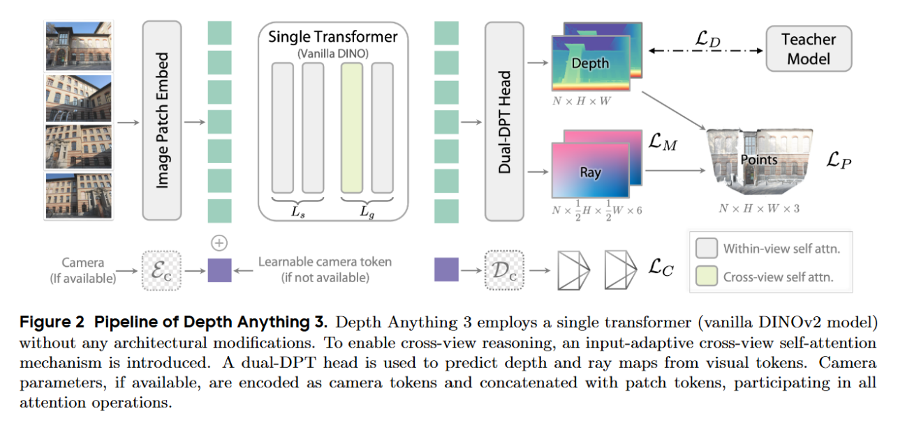
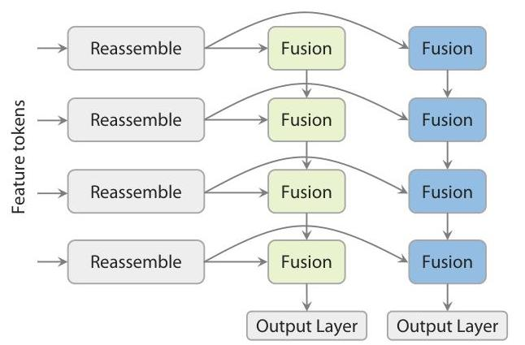

# 论文标题: Depth Anything 3: Recovering the Visual Space from Any Views - arXiv 2025

### 一、引言与核心问题

本论文的研究背景聚焦于计算机视觉领域一个长期且核心的目标：从二维图像中恢复三维空间信息。传统上，这一目标被分解为多个独立的任务，如单目深度估计（Monocular Depth Estimation）、运动恢复结构（Structure from Motion, SfM）和多视图立体匹配（Multi-View Stereo, MVS）。尽管这些任务在概念上高度重叠，但学界主流范式是为每个任务设计高度特化的模型。近年来，虽然有工作尝试构建统一模型来处理多任务，但这些模型往往依赖复杂、定制化的架构，从头开始联合优化，难以有效利用大规模预训练模型的强大能力。

**论文试图解决的核心任务是什么？**
该论文旨在回归到一个更本质的目标：**从任意数量的视觉输入（单张、多张或视频流）中，恢复出具备空间一致性的三维几何结构**。这是一个统一的、通用的视觉几何估计任务，无论是否提供相机位姿先验，模型都应能稳健地工作。

*   **输入 (Input)**:
    *   **图像**: 任意数量 $N_v$ 的图像集合 $\{I_i\}_{i=1}^{N_v}$，其中每张图像 $I_i \in \mathbb{R}^{H \times W \times 3}$。
    *   **相机位姿 (可选)**: 每张图像可选地关联一个相机参数 $v_i \in \mathbb{R}^9$，它由平移向量 $t_i \in \mathbb{R}^3$、旋转四元数 $q_i \in \mathbb{R}^4$ 和视场角（Field of View）参数 $f_i \in \mathbb{R}^2$ 组成。当位姿未知时，模型也能自主估计。

*   **输出 (Output)**:
    *   **深度图 (Depth Maps)**: 对应输入的 $N_v$ 张图像，输出 $N_v$ 张像素对齐的深度图 $\{D_i\}_{i=1}^{N_v}$，其中 $D_i \in \mathbb{R}^{H \times W}$。
    * **光线图 (Ray Maps)**: 同样对应 $N_v$ 张图像，输出 $N_v$ 张像素对齐的光线图 $\{M_i\}_{i=1}^{N_v}$，其中 $M_i \in \mathbb{R}^{H \times W \times 6}$。该光线图的每个像素包含一个6维向量 $(t, d)$，其中 $t \in \mathbb{R}^3$ 是光线原点（即相机中心），$d \in \mathbb{R}^3$ 是光线方向向量。

      > - 前3个通道 (Channels 0-2): 代表光线原点 (Origin) $t \in \mathbb{R}^3$。对于同一张图的所有像素，这个值是相同的，就是相机在世界坐标系中的中心位置。
      > - 后3个通道 (Channels 3-5): 代表穿过该像素的光线方向 (Direction) $d \in \mathbb{R}^3$。这个方向向量是从相机中心出发，穿过像素中心，指向世界空间的。
      >
      > ### why? 
      >
      > 传统的相机位姿由一个旋转矩阵 $R$ 和一个平移向量 $t$ 定义。直接让神经网络预测一个有效的旋转矩阵（需要满足正交性约束）非常困难。而光线图将这个几何约束分解到了每个像素上，变成了一个密集的回归问题，这更适合深度学习网络来处理。有了深度图 $D(u, v)$ 和光线图 $M(u, v) = (t, d)$，我们可以用一个极其简单的公式重建出三维点 $P$：
      > $$
      > P = t + D(u, v) \cdot d
      > $$
      > 这个简洁的公式完美地统一了深度和位姿，是整个方法的核心。
    
*   **任务的应用场景**: 该任务是众多下游应用的基石，包括机器人导航、增强/混合现实（AR/MR）、三维重建、以及新视角合成（Novel View Synthesis）等。

*   **当前任务的挑战 (Pain Points)**:
    1.  **任务割裂**: 不同的3D视觉任务（单目、双目、多目）通常需要不同的模型，缺乏一个通用框架。
    2.  **架构复杂性**: 已有的统一模型（如VGGT）架构复杂，包含多个独立的Transformer模块，难以从单一的、大规模预训练模型中有效迁移知识。
    3.  **数据异构性**: 训练一个通用模型需要整合来自不同来源（合成数据、真实雷达扫描、SfM重建）的数据，这些数据质量参差不齐，深度标签往往是稀疏、带噪或不完整的。
    4.  **表征冗余**: 一些统一模型为了提升精度，会预测冗余的几何信息（如位姿、深度、局部/全局点云），这可能导致不同预测目标之间相互纠缠，反而影响性能。

*   **论文针对的难点**: 本文主要聚焦于解决**架构复杂性**、**数据异构性**和**表征冗余**这三个核心难点，旨在提出一个极简、可扩展且高效的统一视觉几何估计框架。

### 二、核心思想与主要贡献

*   **直观动机与设计体现**: 本研究的直观动机源于对人类空间智能的模仿——即从任意视觉信号中感知三维世界的能力。论文作者反思了当前领域复杂化、定制化的趋势，并提出了两个根本性问题：是否存在一个最小化的预测目标集合？一个单一、朴素的Transformer模型是否足以胜任此任务？这两个问题的肯定回答构成了论文的核心设计哲学。这一“极简主义”动机体现在两个方面：1) 采用单一的预训练Vision Transformer (DINOv2) 作为骨干网络，不做任何结构上的特化修改；2) 提出并仅预测“深度-光线图”（depth-ray）这一最小且完备的几何表征，避免了多任务学习的复杂性。

*   **与相关工作的比较与创新**: 本研究与VGGT和Pi3等统一几何模型最为相关。与VGGT的多阶段、多Transformer的复杂架构不同，DA3采用单一Transformer，结构更简洁，且能完全继承预训练模型的强大能力。与DUSt3R预测点图（point map）的方式不同，DA3的“深度-光线图”表征能更好地保证多视图几何一致性。其核心创新在于，它证明了在统一几何估计任务上，“少即是多”（less is more）——一个简单的架构配合精心设计的训练范式和输出表征，可以超越更复杂的专门化设计。

*   **核心贡献与创新点**:
    1.  **极简统一架构**: 提出了一种仅使用**单个朴素Transformer（vanilla DINOv2）**作为骨干的统一视觉几何估计模型（DA3），能够处理任意数量、带或不带位姿的输入图像，实现了架构上的极大简化和高效扩展。
    2.  **最小化几何表征**: 创新地提出了**“深度-光线图”（Depth-Ray Representation）**作为预测目标。该表征是恢复三维结构和相机位姿的最小充分集，它通过隐式地编码相机参数，避免了直接预测正交旋转矩阵的困难，同时保证了输出的几何一致性。
    3.  **高效的教师-学生学习范式**: 为了解决多源异构数据的训练难题，设计了一套教师-学生学习流程。首先在高质量的合成数据上训练一个强大的“教师”模型，然后用该教师模型为所有真实世界数据生成高质量的伪深度标签，并通过RANSAC对齐到稀疏/带噪的真实深度，从而在保留几何精度的同时，极大地提升了标签的稠密性和质量。

### 三、论文方法论 (The Proposed Pipeline)

*   **整体架构概述**: Depth Anything 3的整体流程简洁而强大。输入的一组图像首先被送入一个单一的、预训练的Vision Transformer (ViT) 骨干网络（如DINOv2）。该网络通过一种输入自适应的跨视图注意力机制，在不同视图的特征之间进行信息交换。网络的输出特征随后被送入一个新颖的“双路DPT头”（Dual-DPT head），该头并行地解码出像素对齐的深度图和光线图。如果输入提供了相机位姿，一个轻量级的相机编码器会将其编码为“相机令牌”（camera token）并注入到Transformer中，实现对位姿的条件化处理。

*   **详细网络架构与数据流**:
    * **数据预处理与令牌化**: 输入的 $N_v$ 张图像被独立地切分为图像块（patches）并线性投影，形成patch tokens。对于每张图像，还会生成一个特殊的相机令牌（camera token）。如果相机位姿已知，则通过一个轻量级MLP $E_c$ 将位姿参数 $(f_i, q_i, t_i)$ 编码为该令牌；如果未知，则所有视图共享一个可学习的相机令牌 $c_l$。最终，每个视图的输入序列由其相机令牌和patch tokens拼接而成。
    
    *   **骨干网络：单一Transformer与跨视图注意力**:
        
        *   **层/模块类型**: 使用一个标准的预训练ViT模型，包含 $L$ 个Transformer Block。
        *   **设计细节**: 为了实现跨视图推理，作者并未修改Transformer的结构，而是通过巧妙的**令牌重排（token rearrangement）**来实现。整个网络被分为两部分：前 $L_s$ 层和后 $L_g$ 层（实验中设置 $L_s : L_g = 2:1$）。
            1.  **视图内自注意力 (Within-view self-attention)**: 在前 $L_s$ 层，自注意力计算被限制在每个视图内部。也就是说，来自不同图像的tokens不会相互交互。
            2.  **跨视图自注意力 (Cross-view self-attention)**: 在后 $L_g$ 层，模型交替进行视图内和跨视图的自注意力计算。这是通过将所有视图的tokens在送入注意力层之前拼接（concatenate）成一个长序列来实现的，从而让任意两个图像块的token都能进行信息交互。
        *   **形状变换**: 假设每张图像有 $P$ 个patch，特征维度为 $D$。输入tokens形状为 $[N_v, 1+P, D]$。在前 $L_s$ 层，注意力计算在维度1内部进行。在后 $L_g$ 层，tokens被重塑为 $[1, N_v \times (1+P), D]$ 进行全局注意力计算，然后再恢复原状。这种设计是**输入自适应**的：当 $N_v=1$ 时，模型自然退化为标准的单目深度估计流程，没有额外的计算开销。
        
    * **解码器：双路DPT头 (Dual-DPT Head)**:
    
      
    
      *   **设计细节**: 从骨干网络输出的特征令牌首先经过一系列**共享的重组模块（shared reassembly modules）**进行处理，这部分操作与DPT解码器类似。随后，特征被送入两个**不同**的分支，每个分支拥有**独立的融合层（fusion layers）**和输出层。一个分支负责预测深度图，另一个分支负责预测光线图。
      * **结合消融实验的作用分析**: 如表7 (d) 所示，移除双路DPT头（即使用两个完全独立的DPT头）会导致所有指标的显著下降。这证明了共享初始重组模块的设计是有效的，它强制深度和光线两个任务在初始解码阶段利用相同的底层特征，促进了信息交互，同时独立的融合层又给予了每个任务足够的自由度来完成各自的预测，达到了效率和性能的平衡。
    
        > ### 双路DPT头 (Dual-DPT Head) 的详细网络结构
        >
        > 现在来看解码器本身。可以把它想象成一个Y型的管道。
        >
        > #### **输入 (Input):**
        >
        > - **来源**: ViT骨干网络的最后一层输出。
        > - **形态**: 一系列特征令牌 (Feature Tokens)。
        > - **形状**: `[Batch_Size * Num_Views, Num_Patches, Feature_Dim]`。例如 `[B*Nv, 256, 1024]`。注意，这还是一个1D序列，没有2D空间结构。
        >
        > #### **第一阶段：共享的重组模块 (Shared Reassembly Modules)**
        >
        > 这是Y型管道的“主干”部分，**深度和光线两个任务共享这一部分的所有网络层和权重**。
        >
        > - **目标**: 将1D的token序列恢复成具有空间意义的2D特征图。
        > - **“重组 (Reassembly)” 如何工作？**:
        >   1. **Reshape (重塑)**: 首先，将 `Num_Patches` 个令牌按照它们在原始图像中的位置，重塑成一个粗糙的2D网格。例如，如果原始图像是 `224x224`，ViT的patch size是 `16x16`，那么 `Num_Patches` 就是 `14x14=196`。这一步就是把 `[B*Nv, 196, D]` 的数据重塑成 `[B*Nv, D, 14, 14]`。
        >   2. **Upsampling + Convolution (上采样 + 卷积)**: 接下来，通过一系列的上采样层（例如转置卷积 `ConvTranspose2d` 或 `PixelShuffle`）和标准的卷积层，逐步放大这个粗糙的特征图的分辨率，同时融合特征。这个过程通常会重复多次，每一次都让特征图的分辨率翻倍，直到接近或达到目标输出分辨率。
        > - **“共享 (Shared)” 的意义**:
        >   - **效率**: 两个任务共享大部分参数，减少了模型的总大小。
        >   - **特征对齐**: 强制深度和光线两个任务从一个完全相同的、经过空间重组的特征基础上去学习。这对于保证最终输出的几何一致性至关重要。因为深度和光线是紧密耦合的，让它们在解码初期共享信息通路是合乎逻辑的。
        >
        > #### **第二阶段：独立的融合层 (Independent Fusion Layers)**
        >
        > 在共享的主干之后，管道分成两个**完全独立**的分支（Y型的分叉）。
        >
        > - **分支**: 一个是**深度分支**，另一个是**光线图分支**。
        > - **“融合层 (Fusion Layer)” 是什么？**:
        >   - 在DPT的原始设计中，“融合”指的是将来自ViT不同深度（例如第3、6、9、12层）的特征图进行融合，以结合高层语义和低层细节。
        >   - 在DA3的简化图示中，这里的“融合层”可以理解为在每个分支内部，用于**进一步处理和精炼特征**的一系列卷积块（例如 `Conv -> ReLU -> Conv`）。
        > - **“独立 (Independent)” 的意义**:
        >   - **任务特化**: 虽然深度和光线是相关的，但它们最终的预测目标和数值范围完全不同。独立的分支允许每个任务学习自己独特的特征变换。例如，深度分支可能更关注物体边缘和表面细节，而光线图分支可能更关注全局的、能反映相机朝向的特征。
        >
        > #### **第三阶段：输出 (Output)**
        >
        > 每个分支的末端都有一个最终的输出层，通常是一个简单的 `1x1` 卷积。
        >
        > - **深度分支输出**:
        >   - 一个 `1x1` 卷积层，输出通道数为 **1**。
        >   - **输出形状**: `[Batch_Size * Num_Views, 1, H, W]`，这就是最终的深度图。
        > - **光线图分支输出**:
        >   - 一个 `1x1` 卷积层，输出通道数为 **6**。
        >   - **输出形状**: `[Batch_Size * Num_Views, 6, H, W]`，这就是最终的光线图。
    
    *   **损失函数 (Loss Function)**:
        *   DA3的训练依赖于教师-学生范式，其损失函数的设计也体现在教师模型的训练目标上。
        *   **教师模型损失 $L_T$**: $L_T = \alpha L_{\text{grad}} + L_{\text{gl}} + L_N + L_{\text{sky}} + L_{\text{obj}}$。
            *   **设计理念与关注重点**: 该损失函数是一个多项组合。$L_{\text{grad}}$ 是标准的深度梯度损失，关注局部结构。$L_{\text{gl}}$ 是全局-局部损失，用于保证全局尺度的一致性。$L_N$ 是本文提出的**距离加权表面法线损失**，它通过对邻域法线进行加权平均，更精确地约束局部表面几何。$L_{\text{sky}}$ 和 $L_{\text{obj}}$ 是天空和物体掩码的MSE损失，用于处理背景和无效区域，提升下游任务的可用性。
        *   **学生模型（DA3）训练**: 学生模型使用教师模型生成的伪标签进行监督。具体来说，教师模型预测的相对深度 $\tilde{D}$，会与数据集中原始的稀疏/带噪的度量深度 $D$ 通过RANSAC拟合一个尺度 $s$ 和平移 $t$，得到对齐后的稠密、准确的度量深度 $D_{T \to M} = \hat{s}\tilde{D} + \hat{t}$。学生模型以 $D_{T \to M}$ 作为监督信号进行训练。
    
    *   **数据集 (Dataset)**:
        *   **所用数据集**: 论文使用了海量的公开数据集进行训练，如表1所示，涵盖了合成数据（如Hypersim, Objaverse）、激光雷达数据（如ArkitScenes, ScanNet++）和COLMAP重建数据（如Co3dv2, MegaDepth）等，总计场景数量极为庞大。
        *   **特殊处理**: 论文附录A详细描述了对原始训练数据的预处理流程。例如，移除了TartanAir中带无效背景的场景，对IRS数据集中图像与深度图未对齐的样本进行了过滤，并对多个数据集的深度值范围进行了裁剪。这些细致的数据清洗工作是训练高质量教师模型的关键保障。

### 四、实验结果与分析

   *   **核心实验结果**: DA3在新建的视觉几何基准测试上取得了全面的领先。如下表所示，以DA3-Giant模型为例，其在位姿估计和几何重建精度上均显著优于先前的SOTA方法VGGT和Pi3。

       | 指标 (HiRoom数据集)      | VGGT | Pi3  | DA3-Giant | 相对提升 (vs VGGT) |
       | ------------------------ | ---- | ---- | --------- | ------------------ |
       | 位姿精度 (Auc3 ↑)        | 49.1 | 67.0 | **80.3**  | +63.5%             |
       | 重建精度 (F1 w/o pose ↑) | 56.7 | 75.8 | **85.1**  | +50.1%             |

     这些数据清晰地表明，DA3的极简设计理念在性能上并未妥协，反而通过更有效地利用预训练知识和更优的表征，实现了性能的飞跃。

   *   **消融研究解读**:
        *   **表征的充分性**: 表6的实验证明了“深度+光线图”是最佳组合。与预测“深度+点云+相机”或“深度+相机”相比，“深度+光线图”在所有数据集的位姿和重建精度上都取得了压倒性优势，验证了其作为最小充分集的有效性。
        *   **架构的简洁性**: 表7的对比实验 (a vs b) 显示，DA3的单一Transformer架构性能远超参数量类似但结构更复杂的VGGT-Style模型（由两个ViT-B堆叠）。这凸显了完全继承单个强大预训练模型的重要性。
        *   **教师标签的必要性**: 表7的实验 (a vs e) 和图8的可视化结果表明，移除教师标签监督会导致性能下降，尤其是在细节丰富的合成数据集HiRoom上。这说明教师-学生范式对于模型学习精细几何结构至关重要。

   *   **可视化结果分析**: 图6和图7的对比结果极具说服力。与其他方法相比，DA3生成的点云（图6）在几何上更规整，噪声显著更少。其预测的深度图（图7）则展现了更丰富的结构细节和更高的语义正确性，例如能够清晰地分辨出复杂的物体轮廓和薄结构。

### 五、方法优势与深层分析

   *   **架构/设计优势**:
        *   **优势详述**: DA3的核心优势在于其**简洁性**和**可扩展性**。1) 使用单一预训练ViT骨干，使其能直接、完全地受益于DINOv2等基础模型在海量数据上学到的强大视觉先验知识，而无需像VGGT那样处理多个未经充分预训练的模块。2) “输入自适应的跨视图注意力”设计非常优雅，它通过简单的令牌重排而非修改网络结构来实现多视图信息融合，这不仅保持了架构的简洁，还自然地兼容了从单视图到多视图的任意输入。3) 双路DPT头通过参数共享和分离，在效率和性能之间取得了极佳的平衡。
        *   **原理阐释**: 这种设计之所以有效，是因为它将任务的复杂性从**架构工程（architecture engineering）**转移到了**数据工程（data engineering）**和**表征学习（representation learning）**上。通过强大的教师-学生范式处理好了数据问题，通过极简而完备的“深度-光线图”表征处理好了学习目标问题，剩下的特征提取和融合任务，一个强大的通用视觉骨干（ViT）完全有能力胜任。

   *   **解决难点的思想与实践**:
        *   针对**架构复杂性**，论文的核心思想是“回归简单”，实践上直接采用现成的、最强大的预训练ViT，并通过巧妙的输入设计（令牌重排）来适配多视图任务。
        *   针对**数据异构性**，核心思想是“提纯与统一”，实践上通过教师-学生范式，利用高质量合成数据训练的教师模型为所有真实数据“蒸馏”出稠密、干净的伪标签，从而将异构的监督信号统一为高质量的监督源。
        *   针对**表征冗余**，核心思想是“寻找最小充分集”，实践上通过深入分析几何关系，提出了“深度-光线图”这一创新表征，并通过实验（表6）证明了其相较于其他组合的优越性。

### 六、结论与个人思考

*   **论文主要结论回顾**:
    Depth Anything 3成功地证明了一个朴素的Transformer模型，在“深度-光线图”这一精心选择的目标和高效的教师-学生监督下，能够统一处理任意视图的几何估计任务，且性能超越了之前更为复杂的架构。该工作为构建通用的3D视觉基础模型提供了一个简洁而强大的范例。

*   **潜在局限性**:
    *   **动态场景处理**: 当前模型主要针对静态场景，对于存在显著动态物体的场景，其几何一致性的假设可能会被打破。
    *   **对教师模型的依赖**: 整个框架的性能上限在很大程度上取决于教师模型的质量。虽然教师模型已非常强大，但其在某些特定或未见过的场景下的泛化能力仍可能存在瓶颈。
    *   **计算成本**: 尽管架构简洁，但其Giant版本模型依然庞大，训练和推理成本高昂，这可能限制其在资源受限设备上的应用。

*   **未来工作方向**:
    *   可以探索将该框架扩展到处理动态场景，例如引入时间维度的推理能力。
    *   可以尝试与自然语言等其他模态进行融合，实现通过文本指令进行3D场景理解与编辑。
    *   继续探索更大规模的预训练，进一步提升模型的通用性和鲁棒性，向着真正意义上的“3D世界模型”迈进。

*   **对个人研究的启发**:
    这篇论文最深刻的启发在于其“大道至简”的哲学。在当前模型设计日益复杂的趋势下，它提醒我们回归问题的本质，思考更简洁、更通用的解决方案。与其在模型架构上不断“内卷”，不如将精力更多地投入到数据、表征和训练范式这些更根本的要素上。DA3的成功表明，一个强大的基础模型，配合巧妙的数据工程和对问题本质的深刻理解，其威力可能远超精巧但复杂的定制化设计。