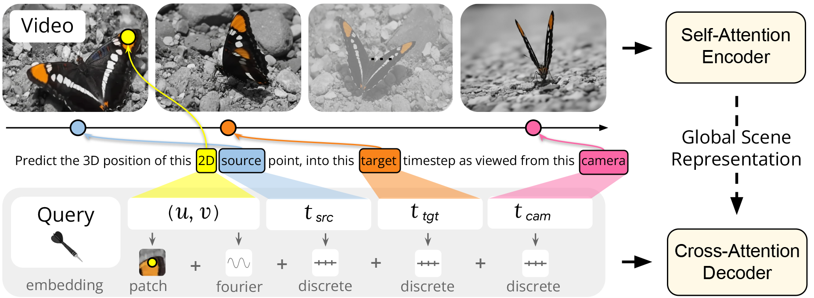

# 论文标题: Efficiently Reconstructing Dynamic Scenes One D4RT at a Time - arXiv 2025

### 一、引言与核心问题

**研究背景与重要性**
在计算机视觉和图形学领域，理解动态场景的几何结构和运动规律是一个长期存在的挑战。传统的3D重建往往试图一次性恢复“所有时间、所有地点”的几何信息，这种刚性的方法在处理动态世界时显得力不从心。现有的解决方案通常将问题分解为深度估计、相机位姿估计和运动分割等离散任务，或者依赖于昂贵的测试时优化（Test-Time Optimization）。DeepMind团队提出的D4RT（Dynamic 4D Reconstruction and Tracking）旨在通过一种统一的、前馈的（Feedforward）架构，高效地解决这一复杂的4D感知问题。

**核心任务定义**
D4RT试图解决的核心任务是从单目视频中联合推断深度、时空对应关系（Spatio-temporal Correspondence）以及相机参数。

*   **输入 (Input)**:
    模型接收一段单目RGB视频作为输入。
    *   **数据形态**: $V \in \mathbb{R}^{T \times H \times W \times 3}$。其中 $T$ 是帧数，$H, W$ 是空间分辨率，$3$ 代表RGB通道。
    *   **注**: 为了处理不同长宽比的视频，输入通常会被Resize到固定的正方形分辨率（如 $256 \times 256$），并将原始长宽比作为一个Token传入网络。

*   **输出 (Output)**:
    对于任意给定的时空查询（Query），模型输出该点在指定时间、指定相机坐标系下的3D属性。
    *   **数据形态**: $P \in \mathbb{R}^{N_{query} \times 13}$。
    *   这里的 $13$ 维输出不仅仅包含3D坐标 $(x, y, z)$，还包括辅助预测：2D投影坐标 $(u, v)$、可见性 logits (1)、运动向量 (3)、表面法向量 (3) 和置信度 (1)。

*   **应用场景**:
    该技术可广泛应用于视频编辑、AR/VR中的动态物体插入、机器人导航中的动态场景理解、以及无需人工标注的4D数据生成。

*   **当前任务的挑战 (Pain Points)**:
    1.  **计算复杂性与碎片化**: 现有方法如MegaSaM通常依赖多个特定任务的模型（单目深度、光流、分割）的拼接，不仅系统复杂，而且各模块间的几何一致性差，往往需要耗时的测试时优化来强制对齐。
    2.  **动态对应关系的缺失**: 许多前馈方法（如VGGT）虽然快，但无法建立动态部分的对应关系；而专门的追踪器（如SpatialTracker）虽然能追踪，但缺乏统一的场景几何理解，通常只能处理可见点，无法处理遮挡或新出现的区域。
    3.  **效率瓶颈**: 想要获得密集的4D重建，传统的逐帧解码方式计算量巨大，难以扩展。

*   **论文聚焦**:
    D4RT主要解决**效率**与**统一性**的矛盾。它通过设计一种新颖的“查询机制”（Querying Mechanism），避免了全分辨率的密集解码，允许按需（On-demand）获取时空信息，从而在保持高精度的同时大幅提升推理速度。

### 二、核心思想与主要贡献

**直观动机与设计体现**
本研究的直观动机是将“解码”过程从传统的“生成整张图”转变为“回答特定问题”。与其盲目地重建整个场景的所有体素或像素，不如让模型回答：“源帧 $t_{src}$ 中位置 $(u, v)$ 的这个点，在目标时间 $t_{tgt}$，相对于参考相机 $t_{cam}$ 的3D位置在哪里？”这种设计完全解耦了空间和时间，使得模型能够灵活地处理静态背景和动态物体。

**与相关工作的比较**
与**SpatialTrackerV2**等追踪模型相比，D4RT不仅能追踪，还能直接输出公制尺度的3D点云和相机参数，且是一个端到端的单一模型。与**VGGT**等生成式重建模型相比，D4RT引入了点级别的动态对应关系，并且不需要为深度、光流分别设计解码头，而是通过统一的查询接口解决所有问题。

**核心贡献**:
1.  **D4RT框架**: 提出了一种基于Transformer的统一架构，通过轻量级解码器和灵活的查询机制，实现了动态4D场景的高效前馈重建。
2.  **统一接口**: 展示了如何通过改变查询参数 $(u, v, t_{src}, t_{tgt}, t_{cam})$ 的组合，用同一个模型完成点云重建、3D追踪、深度图估计和相机参数估计等多种任务。
3.  **性能SOTA**: 在动态4D重建和追踪任务上刷新了State-of-the-Art，同时在速度上比现有方法快 18 到 300 倍。

### 三、论文方法论 (The Proposed Pipeline)

**整体架构概述**
D4RT采用Encoder-Decoder架构，灵感源自场景表示Transformer (SRT)。整个流程分为两步：首先，**Encoder** 处理整个视频，提取一个与视点无关的潜层“全局场景表示” (Global Scene Representation)；其次，**Decoder** 根据具体的查询，利用交叉注意力机制从全局表示中提取信息，独立预测每个查询点的3D属性。

**详细网络架构与数据流**

1.  **编码器 (Encoder): 全局场景捕捉**
    *   **输入**: $V \in \mathbb{R}^{T \times H \times W \times 3}$。
    *   **架构**: 采用 **ViT-g (Vision Transformer, Giant)** 变体，包含40层。
    * **时空处理**: 视频被切分为 $2 \times 16 \times 16$ 的时空Patch。Transformer层交替使用“帧内局部注意力”和“全局自注意力”。这种设计既捕捉了帧内的空间细节，又通过全局注意力建立了跨帧的时间关联。
    
      > $t=2$ (Temporal): 时间维度。意味着模型不是逐帧处理，而是将连续的2帧捆绑在一起处理。
    * **输出**: 全局场景表示 $F = E(V) \in \mathbb{R}^{N_{tokens} \times C}$。一旦计算完成，在解码不同查询时 $F$ 保持不变。
    
2.  **查询构建 (Query Construction)**
    这是本方法的精髓。一个查询 $q$ 由五元组定义：$(u, v, t_{src}, t_{tgt}, t_{cam})$。
    
    *   **几何嵌入**: 对归一化的2D坐标 $(u, v) \in [0, 1]^2$ 应用傅里叶特征编码 (Fourier Feature Embedding)。
    *   **时间嵌入**: 对 $t_{src}, t_{tgt}, t_{cam}$ 使用可学习的离散时间嵌入。
    *   **局部外观补丁 (Local Appearance Patch) [关键细节]**:
        *   为了保留高频细节（如头发丝、物体边缘），论文在消融实验和代码逻辑中强调了一个关键步骤：以 $(u, v)$ 为中心，在源帧 $t_{src}$ 上裁剪一个 $9 \times 9$ 的RGB Patch。
        *   这个Patch经过一个轻量级的MLP或CNN编码后，被加到Query的Embedding中。这极大地增强了模型对局部纹理的敏感度，使其能实现亚像素级的精度。
    *   **最终Query形状**: $Q \in \mathbb{R}^{N_{queries} \times D_{model}}$。
    
3.  **解码器 (Decoder): 独立点查询**
    *   **架构**: 一个轻量级的Transformer Decoder（约8层）。
    *   **机制**: **Cross-Attention**。Query作为 $Q$，全局场景表示 $F$ 作为 $K, V$。
    *   **独立性设计**: 重要的是，查询之间**没有** Self-Attention。这意味着每个点的解码是完全独立的。这不仅使得推理可以大规模并行化，还允许用户任意选择查询点的数量和分布（稀疏或密集），而不影响计算图的结构。
    *   **输出头**: 解码器的输出经过线性投影层，得到 $P \in \mathbb{R}^{13}$。

**损失函数 (Loss Function)**

训练采用加权求和的复合损失函数，主要包含以下部分：
1.  **3D位置损失 ($L_{3D}$)**: 这是核心损失。预测点 $P$ 与真值 $P_{gt}$ 之间的 $L_1$ 距离。
    *   **特殊处理**: 为了处理深度的尺度模糊性，应用了对数归一化变换：$sign(x) \cdot \log(1+|x|)$，并在计算前通过平均深度进行归一化。
2.  **2D重投影损失 ($L_{2D}$)**: 预测的3D点投影回相机平面应与输入的2D坐标一致。
3.  **表面法向损失 ($L_{normal}$)**: 预测法向量与真值的余弦相似度。
4.  **辅助损失**: 包括可见性判别的二元交叉熵损失 ($L_{vis}$)，运动向量损失 ($L_{disp}$) 和置信度损失 ($L_{conf}$)。
    *   **训练策略**: 采用了Curriculum Learning的思路，从易到难，且损失权重经过精细调节（如 $\lambda_{3D}=1.0, \lambda_{normal}=0.5$）。

**数据集 (Dataset)**
*   **混合训练**: 模型在极其庞大且多样化的数据集混合体上训练，包括 BlendedMVS, Co3Dv2, Kubric, ScanNet++, Waymo Open 等。这种混合涵盖了静态室内、动态室外、合成与真实数据，赋予了模型极强的泛化能力。
*   **采样策略**: 训练时并不是随机采样像素，而是使用 Sobel 算子预计算深度边缘和运动边界，**30% 的查询点采样自这些高频区域**。这种 Hard Example Mining 策略显著提升了边缘重建质量。

### 四、实验结果与分析

**核心实验结果**
D4RT在多个基准测试中展现了统治级的性能。

1.  **4D重建与追踪 (TAPVid-3D Benchmark)**:
    在本地相机坐标系和世界坐标系的追踪任务中，D4RT均优于 SpatialTrackerV2 和 CoTracker3 等基线。

    | 方法                                                         | 相机坐标系 APD (3D) $\uparrow$ | 世界坐标系 APD (3D) $\uparrow$ | L1 误差 $\downarrow$ |
    | :----------------------------------------------------------- | :----------------------------: | :----------------------------: | :------------------: |
    | SpatialTrackerV2                                             |             0.260              |             0.336              |        0.238         |
    | **D4RT (Ours)**                                              |           **0.345**            |           **0.319**            |      **0.096**       |
    | *解读*: 这里的 APD 是 Average Percent of Points within Delta，越高越好。L1误差的大幅下降（0.238 -> 0.096）证明了D4RT在绝对几何精度上的巨大优势。 |                                |                                |                      |

2.  **视频深度估计 (Sintel, ScanNet)**:
    D4RT在动态场景（Sintel）和静态场景（ScanNet）的深度估计误差（AbsRel）均达到最低，显著优于专用的重建模型 MegaSaM。

3.  **相机位姿估计**:
    通过对预测点云应用 Umeyama 算法，D4RT 甚至在相机位姿估计上也击败了 MapAnything 和 VGGT，证明其重建的点云具有极高的几何一致性。

**效率分析**
*   在生成全视频3D轨迹时，D4RT在 24 FPS 下能处理 **1570** 个轨迹，而 SpatialTrackerV2 仅能处理 84 个。这得益于解码器的独立查询设计，使得并行计算效率极高。

**消融研究解读**
*   **局部RGB Patch的作用**: 移除局部Patch后，Sintel上的深度误差（AbsRel）从 0.302 上升到 0.366。可视化显示，Patch对于恢复锋利的物体边界至关重要。
*   **Backbone规模**: 从 ViT-B 增加到 ViT-g，性能呈单调上升趋势，表明该方法能有效利用大模型的容量。

### 五、方法优势与深层分析

**架构设计优势**
1.  **解耦时空与相机 (Decoupling via Querying)**:
    D4RT最巧妙的设计在于其查询接口 $q = (u, v, t_{src}, t_{tgt}, t_{cam})$。
    *   通过分离 $t_{tgt}$（目标时间，决定点的物理状态）和 $t_{cam}$（参考相机，决定坐标系），模型隐式地学会了坐标变换。
    *   如果令 $t_{tgt}$ 变化而 $t_{cam}$ 固定，我们就得到了在统一世界坐标系下的**轨迹**（Tracking）。
    *   如果令 $t_{src}$ 遍历全图而 $t_{cam}$ 固定，我们就得到了完整的**点云**（Reconstruction）。
    这种灵活性使得一个模型能替代过去的一组模型栈。

2.  **计算效率的本质**:
    传统方法输出密集的体素网格或深度图，计算量与分辨率成平方/立方关系。D4RT的计算量主要集中在Encoder（只运行一次），Decoder的计算量与查询点数成线性关系 $O(N)$。对于不需要全像素精度的任务，或者只需要关注特定区域的任务，D4RT可以极快地给出结果。

**解决难点的实践**
针对“动态遮挡”难点，D4RT利用全局Attention Encoder聚合了整个视频的信息。即使某物体在第 $t$ 帧被遮挡，Encoder也能从 $t-k$ 或 $t+k$ 帧中提取特征，并通过查询机制在第 $t$ 帧“脑补”出其正确位置。这是单帧或纯序列模型难以做到的。

### 六、结论与个人思考

**结论回顾**
D4RT 证明了通过简单的 Transformer Encoder 和基于查询的 Decoder，可以高效、统一地解决复杂的动态4D重建问题。它摒弃了复杂的模块堆叠和测试时优化，仅凭大规模数据训练的前馈网络就达到了SOTA水平。

**潜在局限性**
1.  **长视频处理**: 虽然论文提到了通过分段拼接处理长视频，但 ViT-g 的 $O(T^2)$ 或 $O(TN)$ 复杂度在显存上依然是限制。对于分钟级的视频，纯粹的全局Attention可能难以为继。
2.  **计算资源门槛**: Encoder 使用了 ViT-g (1B 参数)，且训练需要 TPU 集群。对于普通研究者，复现或微调该模型的门槛极高。
3.  **对静态背景的依赖**: 虽然处理动态场景，但相机的相对位姿估计（Umeyama算法）在极端动态（如整个视野都在动）或缺乏纹理的场景下可能会失效，进而影响整体坐标系的统一性。

**对个人研究的启发**
D4RT 的核心启示在于 **"Query-based Representation"** 的强大潜力。在图形学中，我们习惯于显式的 Grid 或 Mesh，但在深度学习时代，将场景编码为隐式特征，并根据用户需求（Query）解码出几何信息，可能是比 NeRF 更灵活、更适合编辑的路线。此外，**将 $9 \times 9$ 局部 Patch 引入 Query** 这一看似简单的工程Trick，实际上弥补了 Transformer 可能会丢失高频信息的短板，这种 "Global Context + Local Detail" 的混合输入策略值得在其他生成任务中借鉴。