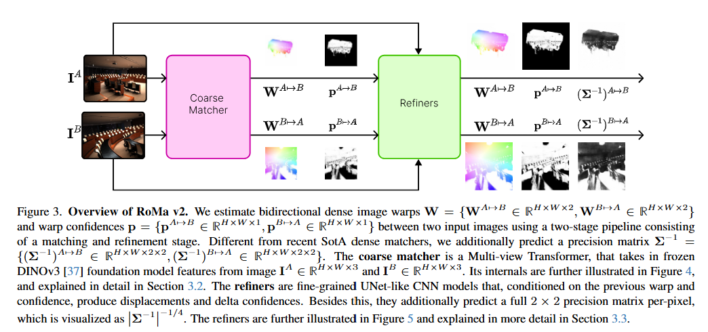
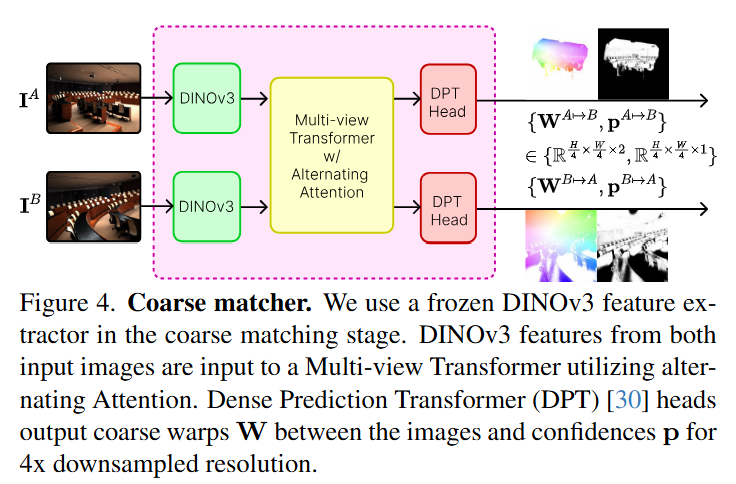
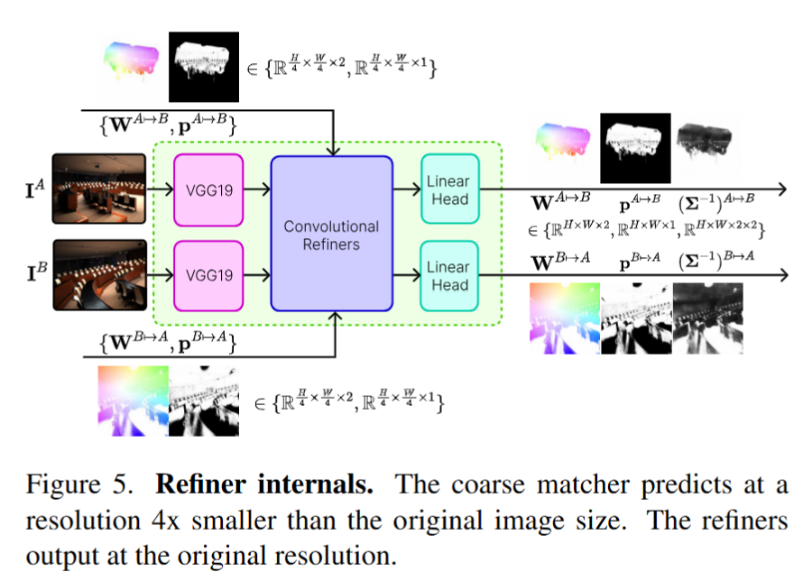

# RoMa v2: Harder Better Faster Denser Feature Matching - arXiv 2025

> **Paper**: [arXiv:2511.15706](https://arxiv.org/abs/2511.15706)  
> **Code**: [GitHub Link](https://github.com/Parskatt/romav2)

### 一、引言与核心问题

**研究背景**
稠密特征匹配（Dense Feature Matching）旨在为两幅图像中的每一个像素寻找对应关系，是三维重建（3D Reconstruction）、视觉定位（Visual Localization）等计算机视觉任务的基石。近年来，随着基于深度学习的方法（如RoMa, DKM）逐渐取代传统的稀疏特征点匹配（如SIFT+RANSAC），该领域的精度达到了新的高度。然而，现有的“黄金标准”方法往往面临着鲁棒性与效率的权衡：以RoMa为代表的高精度模型虽然对大视角变化鲁棒，但计算慢、显存占用高；以UFM为代表的快速模型虽然推理高效，但在极端外观变化下表现不佳。

**核心任务**

*   输入 (Input): 两幅图像 $I_A, I_B$。通常会被调整为特定的分辨率（如 $640 \times 640$ 或多尺度输入）。数据维度为 $[B, 3, H, W]$。
*   输出 (Output):
    *   稠密光流/Warp $W_{A \to B}$: 维度为 $[B, H, W, 2]$，表示图像A中每个像素在图像B中的对应坐标。
    *   置信度 (Confidence): 维度为 $[B, H, W, 1]$，表示该匹配是否有效（即两点是否共视）。
    *   不确定性/协方差 (Covariance): 维度为 $[B, H, W, 2, 2]$，表示预测误差的分布，用于下游任务加权。
*   当前痛点 (Pain Points):
    1.  极端视角与外观变化: 在大幅度旋转（如卫星图vs宇航员图）或纹理缺失区域，现有模型容易失效。
    2.  计算资源限制: 高精度模型往往包含繁重的Refinement步骤，导致推理速度慢，难以应用于实时SLAM或大规模重建。
    3.  精度与鲁棒性的两难: 很难同时兼顾大基线（Wide-baseline）的鲁棒性和小基线（Small-baseline）的亚像素精度。

### 二、核心思想与主要贡献

**直观动机**
RoMa v1 证明了冻结的基础模型（Foundation Model）特征对鲁棒性至关重要，而 UFM 证明了将匹配过程解耦为“粗匹配 + 精细化”可以大幅提升训练和推理效率。RoMa v2 的核心动机是博采众长：<u>保留 RoMa 的强鲁棒性特征提取，引入 UFM 的两阶段解耦设计，并针对计算瓶颈进行底层的算子优化。</u>

**核心贡献**

1.  架构升级: 提出了基于 DINOv3 和 多视角Transformer (Multi-view Transformer) 的新型粗匹配器，取代了 RoMa v1 中的高斯过程（GP）回归，显著提升了多视角上下文的理解能力。
2.  效率优化: 设计了解耦的精细化 (Refinement) 模块，配合自定义的 CUDA 局部相关性算子 和 2的幂次通道设计，在保持精度的同时将推理速度提升了 1.7 倍，并大幅降低显存占用。
3.  不确定性建模: 引入了像素级的预测协方差 (Predictive Covariance)，不仅给出匹配位置，还给出误差的分布估计，大幅提升了下游几何解算的精度。
4.  数据混合策略: 构建了包含宽基线（MegaDepth）和小基线（FlyingThings3D）以及航拍数据的混合训练集，打破了模型只能专精一类的限制。

### 三、论文方法论 (The Proposed Pipeline)

RoMa v2 采用 Coarse-to-Fine 的两阶段架构。首先由粗匹配器（Matcher）生成低分辨率的初始 Warp，然后由一系列精细化模块（Refiners）逐步优化至亚像素精度。

#### 1. 粗匹配器 (Coarse Matcher)

这是模型的“大脑”，负责在图像间建立全局对应关系。

*   **特征提取**: 输入图像经过冻结的 **DINOv3 ViT-L** 骨干网络。提取第 11 层和第 17 层的特征，拼接后通过线性层投影到 768 维。
    *   *Shape*: $[B, 3, H, W] \to [B, \text{patches}, 1024] \to [B, \text{patches}, 768]$。
*   **多视角 Transformer (Multi-view Transformer)**:
    *   这是 RoMa v2 相比 v1 的重大改进。它取代了 v1 的 GP 模块。
    *   采用 **ViT-B** 架构，交替使用 **全局注意力 (Global Attention)**（处理跨图像交互，无位置编码）和 **帧内轴向 RoPE (Rotary Positional Embeddings)**（处理空间结构）。
    *   输出增强后的特征 $f_{mv}^A, f_{mv}^B$。
*   **匹配嵌入 (Match Embeddings)**:
    *   计算特征间的余弦相似度矩阵 $S \in \mathbb{R}^{M \times N}$。
    *   利用 Softmax 归一化后的注意力图 $Attn_{AB}$ 对图像 B 的位置编码（Positional Embeddings）进行加权求和，得到图像 A 中每个 patch 的“匹配嵌入”。 $\chi_{A \to B}$ 是一个维度为 $D$ 的向量，它隐含了**预测的坐标信息**。

$$
\chi_{A \to B} = Attn_{AB} \cdot \chi_B
$$

*   **DPT Head**:
    *   输入融合了原始特征、增强特征和匹配嵌入：$f_{in} = f_{list}^A + f_{mv}^A + \chi_{A \to B}$。
    *   使用 **DPT (Dense Prediction Transformer)** 解码器，在 **Stride 4** 的分辨率下预测初始 Warp 和 Confidence。

#### 2. 精细化模块 (Refiners)

这是模型的“眼睛”，负责修正局部细节。训练时与 Matcher 解耦（Matcher 冻结）。

* 多尺度架构: 包含三个独立的卷积网络，分别处理 **Stride 4, 2, 1** 的分辨率。

  *   输入特征融合: 对于第 $i$ 级 Refiner，输入包括：

      *   图像 A 的 VGG 特征 $f_A^i$。
      *   根据当前 Warp 采样得到的图像 B 的特征 $f_B^i(W)$。
      *   当前 Warp 与网格的差值嵌入 (Displacement Embedding)。
      *   **局部相关性 (Local Correlation)**: 在当前预测点周围 $K \times K$ 窗口内计算特征相关性。

  *   卷积处理：观察输入数据，分析特征差异和相关性热力图。整个过程会在 Stride 4 -> Stride 2 -> Stride 1 三个分辨率上重复进行，每一次都基于上一次的修正结果。

  *   输出一个特征向量，然后分叉给两个 Linear Head（实际上是 $1 \times 1$ 卷积）进行最终预测。

      - Linear Head $\Delta$ Warp：输出一个 2 维向量 $(\Delta x, \Delta y)$，$W_{new} = W_{old} + \Delta W$.

      - Linear Head $\Delta$ Confidence

        - 输出置信度修正：$C_{new} = C_{old} + \Delta C$

        - 输出精度矩阵/协方差 ($\Sigma^{-1}$)：
          - 这是 RoMa v2 的新特性。它输出 3 个数值（对应 $2 \times 2$ 对称矩阵的参数）。
          - 直观理解: 如果椭圆很扁，说明在某个方向上很确定，另一个方向上不确定（比如在一条直线上，不知道具体在哪一点，但在垂直于线的方向很确定）。

* 优化设计:
  *   通道数优化: 精心设计每一层的通道数为 2 的幂次（如 512, 128, 32），以最大化 GPU 访存效率。
  *   Custom CUDA Kernel: 针对局部相关性计算编写了定制的 CUDA 算子，避免了 pytorch 原生实现中大量中间张量的显存开销，显著提升了速度。

* 预测目标: 输出 Warp 的残差 $\Delta W$ 和置信度的更新量。
  *   不确定性预测: 除了 Warp，Refiner 还预测一个 $2 \times 2$ 的精度矩阵 $\Sigma^{-1}$。为了保证正定性，网络预测 Cholesky 因子 $(z_{11}, z_{21}, z_{22})$，通过 Softplus 映射构建下三角矩阵 $L$，使得 $\Sigma^{-1} = LL^T$。

#### 3. 损失函数 (Loss Function)

*   **Matcher Loss**:
    *   **NLL Loss**: 最小化正确匹配 patch 的负对数似然：$L_{NLL} = -\sum \log(\text{Softmax}(S)_m \cdot \mathbb{1}_{GT})$。
    *   **Regression Loss**: 鲁棒回归损失，约束预测的 Warp 接近 GT。
*   **Refiner Loss**:
    *   **Warp Loss**: 广义 Charbonnier Loss，$$L_{warp} = ((W_{pred} - W_{gt})^2 + \epsilon^2)^{\alpha}$。
    *   **Overlap Loss**: 二元交叉熵 (BCE)，监督像素是否共视。
    *   **Precision Loss**: 最小化残差的负高斯对数似然，训练协方差矩阵：

$$
L_{precision} = \frac{1}{2} r^T \Sigma^{-1} r - \frac{1}{2} \log \det(\Sigma^{-1})
$$

#### 4. 数据集 (Data)
RoMa v2 强调数据多样性，混合了：
*   **Wide-baseline**: MegaDepth, AerialMD, BlendedMVS, TartanAir (鲁棒性)。
*   **Small-baseline**: FlyingThings3D, ScanNet++, Map-Free (高精度/细节)。

### 四、实验结果与分析

**1. 相对位姿估计 (Relative Pose Estimation)**
在 MegaDepth-1500 和 ScanNet-1500 两个权威榜单上，RoMa v2 击败了包括 MASt3R, VGGT, DKM, RoMa v1 在内的所有方法。

| Dataset       | Method      | AUC@5°   | AUC@10°  |
| :------------ | :---------- | :------- | :------- |
| **MegaDepth** | RoMa v1     | 62.6     | 76.7     |
|               | UFM         | 41.5     | 57.9     |
|               | **RoMa v2** | **62.8** | **77.0** |
| **ScanNet**   | RoMa v1     | 31.8     | 53.4     |
|               | UFM         | 31.3     | 54.1     |
|               | **RoMa v2** | **33.6** | **56.2** |

**2. 稠密匹配精度**
在包含极大视角变化的 AerialMegaDepth 数据集上，RoMa v2 的端点误差 (EPE) 仅为 4.12，而 RoMa v1 为 25.05，UFM 为 17.44。这证明了其在极端场景下的统治力。

**3. 速度与效率**
*   **Throughput**: RoMa v2 处理速度约为 30.9 pairs/s，是 RoMa v1 (18.5 pairs/s) 的 **1.7倍**。
*   **显存**: 显存占用与 RoMa v1 相当，但远低于未经优化的实现，这得益于定制的 CUDA Kernel。

**4. 可视化分析**
*   **细粒度细节**: 在 FlyingThings3D 等数据集中，RoMa v2 能清晰地恢复出极细小物体的轮廓，而 v1 往往会产生模糊的边缘。
*   **协方差图**: 可视化显示的协方差图能够准确反映运动模糊方向（各向异性）和纹理缺失区域（高不确定性），具有物理可解释性。

### 五、方法优势与深层分析

**1. 为什么“解耦训练”+“DINOv3”是制胜关键？**
RoMa v1 试图端到端训练整个网络，导致 refiner 的梯度会影响 backbone 的适应性，且训练极其昂贵。RoMa v2 采用两阶段策略：
*   **Matcher 阶段**：利用 DINOv3 强大的语义理解能力解决“去哪里找”（全局搜索）的问题。Transformer 的引入让模型能“看懂”两张图之间的几何关系，而不是像 GP 那样仅做局部平滑。
*   **Refiner 阶段**：专注于“找得准不准”（局部对齐）。通过冻结 Matcher，Refiner 可以专注于学习高频细节，且可以使用海量的合成数据（如 FlyingThings3D）进行低成本训练，无需担心破坏 Coarse 阶段的语义特征。

**2. 不确定性估计的价值**
大多数现有匹配器仅输出位置，忽略了“我有多确定”。RoMa v2 输出的 $\Sigma$ 实际上为后续的 RANSAC 或 Bundle Adjustment 提供了**加权依据**。实验表明，利用该协方差加权残差，可以在 Hypersim 数据集上将 AUC@1° 从 54.9 提升至 75.8，这是一个巨大的飞跃。

**3. 工程优化的胜利**
除了算法改进，RoMa v2 对显存和通道数的微调（Powers of 2 channels）以及手写 CUDA Kernel 体现了深度学习工程化的重要性。这些细节消除了高分辨率（High-Res）推理时的显存瓶颈，使得该方法在实际部署中更具可行性。

### 六、结论与个人思考

**结论**
RoMa v2 成功打破了稠密匹配领域“速度-精度-鲁棒性”的不可能三角。它通过架构上的解耦和工程上的极致优化，在提升精度的同时大幅加快了速度。其提出的概率化输出（协方差）为几何视觉任务提供了新的标准范式。

**潜在局限**
*   **多模态极端情况**: 虽然在 WxBS 榜单表现优异，但在红外-可见光（IR-RGB）等跨模态任务上，RoMa v2 的表现略逊于专门设计的网络（或 v1 的某些特定配置）。这可能源于 DINOv3 预训练数据的分布限制。
*   **依赖基础模型**: 模型性能高度依赖 DINOv3，这意味着骨干网络的计算开销是固定的，难以进一步轻量化到移动端极致水平。

**对研究的启发**
*   **不确定性是通用的接口**: 在设计从深度学习到传统几何优化的 pipeline 时，预测不确定性（Covariance）是连接两个世界的最佳桥梁。
*   **数据混合的重要性**: 不要只盯着单一任务的数据集（如只看 MegaDepth）。混合看起来不相关的合成数据（如 FlyingThings3D），利用其完美的 GT 和高频细节，可以显著弥补真实数据的不足。