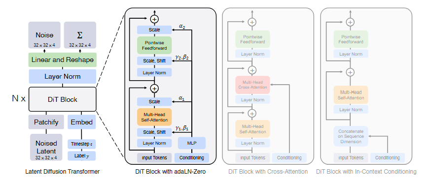

# 论文标题: Scalable Diffusion Models with Transformers - arXiv 2023

### 一、引言与核心问题

这篇论文探索了在扩散模型（[Diffusion Models](./202012_DDPMs.md)）中使用Transformer替代传统U-Net作为核心骨干网络的可行性与优势。扩散模型已在高质量图像生成任务中取得了顶尖水平，但其主流架构一直以来都严重依赖于具有强归纳偏置（Inductive Bias）的卷积U-Net网络。与此同时，Transformer架构凭借其卓越的可扩展性（Scalability）和对长距离依赖的建模能力，已经统一了自然语言处理和计算机视觉等多个领域。然而，在扩散模型领域，Transformer的应用相对滞后。因此，本文旨在填补这一空白，系统性地研究一种基于Transformer的扩散模型——DiT (Diffusion Transformer)，并验证其性能和扩展潜力。

> ## 前置内容：Diffusion Models
>
> #### 训练过程 (Training): 一种“随机访问”式的学习
>
> 扩散模型的训练过程**不是**一个从头到尾的、一步一步去噪的模拟。它巧妙地采用了一种“一蹴而就”的加噪方式和“一次性猜到底”的预测任务。对于训练中的每一步：
>
> 1. **随机选择一张干净图像 $z_0$**：从我们的数据集中取一张原始的、没有噪声的隐变量图像。
>
> 2. **随机选择一个时间步 $t$**：从总步数 $T$（例如1000）中随机挑选一个整数，比如 $t=732$。
>
> 3. **随机采样一个标准高斯噪声 $\epsilon$**：这个噪声 $\epsilon$ 的维度和 $z_0$ 完全一样，是从 $\mathcal{N}(0, I)$ 中采样得到的。**这个 $\epsilon$ 就是我们等下要让模型预测的“标准答案”**。
>
> 4. **一步加噪到位**：我们使用一个固定的数学公式，直接将干净的 $z_0$ 和噪声 $\epsilon$ 混合，一步就计算出在 $t=732$ 时刻应有的带噪图像 $z_{732}$。
>    $$
>    z_t = \sqrt{\bar{\alpha}_t}z_0 + \sqrt{1-\bar{\alpha}_t}\epsilon
>    $$
>    这里的 $\bar{\alpha}_t$ 是一个根据 $t$ 预先计算好的、固定的超参数，它决定了噪声和原始图像的混合比例。
>
> 5. **让模型预测**：我们将计算出的 $z_{732}$ 和时间步 $t=732$ 一起输入到DiT模型中，要求模型预测出我们在第3步中使用的那个**原始噪声 $\epsilon$**。
>
> 6. **计算损失**：计算模型预测的噪声 $\epsilon_{\theta}$ 和我们手上的标准答案 $\epsilon$ 之间的均方误差（MSE）。然后用这个误差来更新模型的权重。
>
> **关键点**：在训练中，模型看到的每一个样本 $(z_t, t)$ 都是独立生成的。它可能上一秒在学习如何从一个几乎全黑的图像 ($t=999$) 中预测噪声，下一秒就在学习如何从一个几乎清晰的图像 ($t=50$) 中预测噪声。**模型学习的不是“下一步该怎么走”，而是学习一个通用的函数：“给定任意噪声水平为 t 的图像，请告诉我它里面藏着的原始噪声是什么。”**
>
> #### 生成/采样过程 (Sampling/Inference): “层层递进”
>
> 当模型训练好之后，我们才会在**生成新图像时**使用“层层递进”的流程：
>
> 1. 从一个纯粹的高斯噪声图像 $z_T$ 开始 (比如 $T=1000$)。
> 2. 将 $z_{1000}$ 和 $t=1000$ 输入模型，得到一个对原始噪声的预测 $\epsilon_{\theta}$。
> 3. 使用这个预测值 $\epsilon_{\theta}$，通过一个数学公式，从 $z_{1000}$ 计算出一个稍微“干净”一点的图像 $z_{999}$。
>    - **预测的噪声 $\epsilon_{\theta}$**：告诉我们去噪的**方向**。它指明了为了让图像变清晰，我们应该朝着哪个方向前进。
>    - **预测的协方差 $\Sigma_{\theta}$**：告诉我们去噪的**步子大小和随机性**。它控制了我们朝这个方向前进时，每一步引入多少不确定性或“抖动”。
>      - 协方差的作用：让扩散模型变得更“聪明”，学会在不同阶段动态调整去噪的策略，用更少的步数生成更高质量的图像
>        1. **控制随机性**: 协方差越大，意味着在去噪的这一步中，会引入更多的随机噪声。协方差越小，这一步就越接近一个确定的、没有随机性的过程。
>        2. **提升样本质量**: 早期的扩散模型使用一个固定的、预先计算好的协方差。但后来的研究发现，**让模型自己学习这个协方差**可以显著提高生成图像的质量。
>    - 有了对 $z_0$ 的估计值 $\hat{z}_0 = \frac{1}{\sqrt{\bar{\alpha}_t}} (z_t - \sqrt{1-\bar{\alpha}_t}\epsilon_{\theta}(z_t, t))$、去噪步骤的均值$\mu_{t-1}(z_t, \hat{z}_0) = \frac{\sqrt{\bar{\alpha}_{t-1}}\beta_t}{1-\bar{\alpha}_t} \hat{z}_0 + \frac{\sqrt{\alpha_t}(1-\bar{\alpha}_{t-1})}{1-\bar{\alpha}_t} z_t$、协方差$\Sigma_{t-1}=\Sigma_{\theta}(z_t, t)$，可以采样得到$z_{t-1} = \mu_{t-1} + \sqrt{\Sigma_{t-1}} \cdot \mathbf{w}$（$\mathbf{w}$ 是一个新采样的标准高斯噪声（$\mathbf{w} \sim \mathcal{N}(0, \mathbf{I})$））
> 4. 将 $z_{999}$ 和 $t=999$ 输入模型，得到一个新的预测...
> 5. 重复这个过程1000次，直到我们得到最终的干净图像 $z_0$。

*   **论文试图解决的核心任务是什么？**
    该研究的核心任务是**类别条件下的图像生成 (Class-Conditional Image Generation)**。具体来说，模型学习在一个给定的类别标签下，通过一个去噪过程，从纯高斯噪声中逐步生成一张符合该类别内容的高质量图像。
    *   **输入 (Input)**: 模型的输入是多源的，主要包括：
        1.  **带噪的隐变量 (Noised Latent)**: 原始图像首先通过一个预训练的变分自编码器（VAE）的编码器 $E$ 压缩到一个低维的隐空间。对于一张 $256 \times 256 \times 3$ 的图像，其隐变量 $z$ 的维度为 `[Batch_size, 4, 32, 32]`。随后，根据扩散过程的时刻 $t$，向该隐变量添加对应强度的高斯噪声，得到带噪隐变量 $z_t$，其维度保持不变。
        2.  **扩散步数 (Timestep)**: 一个整数 $t$，表示当前在扩散/去噪过程中的时间步。它会被编码成一个向量嵌入。
        3.  **类别标签 (Class Label)**: 一个整数 $c$，表示目标图像的类别（例如，ImageNet中的1000个类别之一）。它同样会被编码成一个向量嵌入。
    *   **输出 (Output)**: 模型的主要输出是：
        1.  **预测的噪声 (Predicted Noise)**: 模型预测在时刻 $t$ 添加到干净隐变量 $z_0$ 上的高斯噪声 $\epsilon$。其**数据维度/Shape**与输入隐变量完全一致，即 `[Batch_size, 4, 32, 32]`。
        2.  **预测的协方差 (Predicted Covariance)**: 模型还需预测去噪过程中每一步的协方差对角线值，用于更精确的采样。其维度同样为 `[Batch_size, 4, 32, 32]`。因此，最终输出头的通道数是输入隐变量的两倍，即 `[Batch_size, 8, 32, 32]`。
    *   **任务的应用场景**: 该任务是生成式AI的核心，其应用场景非常广泛，包括艺术创作、内容生成、虚拟现实、数据增强、图像编辑与修复等。
    *   **当前任务的挑战 (Pain Points)**:
        1.  **架构设计的局限性**: 传统扩散模型依赖的U-Net架构虽然有效，但其基于卷积的局部感受野和层次化结构可能不是最优选择。如何设计一个更通用、更具扩展性的骨干网络是一个关键问题。
        2.  **计算复杂度与可扩展性**: 高分辨率图像生成需要巨大的计算资源。模型的性能如何随着计算资源（如模型参数量、计算量GFLOPs）的增加而提升，即模型的可扩展性，是衡量一个架构好坏的核心指标。U-Net的扩展性规律尚不如Transformer清晰。
    *   **论文针对的难点**: 本文主要聚焦于上述两大难点。它挑战了U-Net在扩散模型中的主导地位，提出用Transformer来构建一个全新的、具有更强可扩展性的生成模型骨干网络，并系统性地验证了这一设计的有效性。

### 二、核心思想与主要贡献

*   **直观动机与设计体现**: 本研究的直观动机是，既然Transformer在多个领域都展现出优于卷积网络的扩展性，那么它也应该能为扩散模型带来性能上的突破。论文的核心思想在于，U-Net架构中的卷积和层次化等归纳偏置对于扩散模型的成功并非不可或缺。一个设计良好的、通用的Transformer架构同样可以、甚至能够更好地完成去噪任务。这一思想体现在其模型设计上：论文完全摒弃了U-Net，将带噪的隐变量视为一个序列（一系列图像块），并使用标准的Vision Transformer (ViT) 模块来处理这个序列，从而预测噪声。

*   **与相关工作的比较与创新**: 本研究与Latent Diffusion Models (LDMs) 和 Vision Transformers (ViTs) 最为相关。
    *   相对于LDMs，本文保留了其在隐空间进行扩散的高效框架，但创新性地将其核心的U-Net骨干网络替换为了Transformer。
    *   相对于ViTs，本文借鉴了其将图像“块化”(Patchify)并用Transformer处理的思想，但创新地解决了如何将条件信息（如扩散步数$t$和类别标签$c$）有效融入Transformer架构的问题，并提出`adaLN-Zero`这一高效的条件注入机制。

*   **核心贡献与创新点**:
    1.  **提出DiT架构**: 首次成功地将一个标准的Transformer架构用作扩散模型的骨干网络，并将其命名为DiT (Diffusion Transformer)，为生成模型领域提供了一个全新的、强有力的架构选择。
    2.  **验证了Transformer在扩散模型中的卓越扩展性**: 通过大量的实验证明，DiT的性能（以FID指标衡量）随着模型计算量（GFLOPs）的增加而稳定提升，呈现出非常强的负相关性（Correlation: -0.93）。这表明增加模型规模或处理更多的图像块（tokens）是提升生成质量的关键，为未来构建更大、更强的生成模型指明了清晰的路径。
    3.  **刷新SOTA性能**: 凭借其卓越的扩展性，最大的DiT-XL/2模型在ImageNet 256x256和512x512的类别条件生成任务上，全面超越了当时所有的扩散模型和GANs，取得了新的SOTA（State-of-the-Art）性能，FID分数分别达到了2.27和3.04。

### 三、论文方法论 (The Proposed Pipeline)



* **整体架构概述**:
  DiT的整体流程建立在Latent Diffusion框架之上。首先，一个预训练的VAE编码器将输入图像压缩到低维隐空间。然后，标准的扩散过程对该隐变量进行加噪。DiT模型的核心任务是在每个去噪步骤 $t$ ，接收带噪隐变量 $z_t$ 、步数 $t$ 的嵌入和类别标签 $c$ 的嵌入，并预测出添加到 $z_t$ 中的噪声。最后，VAE解码器将从噪声中采样得到的“干净”隐变量解码回像素空间的图像。DiT本身是一个作用于隐变量序列的Transformer网络。

* **详细网络架构与数据流**:

  1.  **数据预处理 (Patchify)**:
      *   输入：一个带噪的隐变量 $z_t$，形状为 `[B, 4, 32, 32]`。
      *   Patchify：类似于ViT，这个 $32 \times 32$ 的空间网格被分割成一系列不重叠的 $p \times p$ 大小的Patches，共得到 $(32/p)^2$ 个图像块。
      *   线性Tokenize：每个图像块被一个线性层独立地嵌入到一个 $d$ 维的向量空间中，形成一系列图像tokens。例如，当 $p=2$ 时，我们得到 $16 \times 16 = 256$ 个图像tokens。
      *   形状变换：`[B, 4, 32, 32]` -> `[B, T, d]`，其中 $T = (32/p)^2$ 是tokens的数量。
      *   位置编码：为这些图像tokens添加标准的频率位置编码（sine-cosine version），以保留空间位置信息。

  2.  **条件信息注入(Conditioning)**:
      
      *   步数 $t$ 和类别标签 $c$ 分别被编码成两个 $d$ 维的向量。
      *   在最初的探索中（如in-context conditioning），这两个条件向量被当作额外的tokens拼接到图像token序列的开头，形成一个长度为 $T+2$ 的序列输入到Transformer中。
      *   **形状变换**: `[B, T, d]` -> `[B, T+2, d]`。
      
  3.  **DiT核心模块 (DiT Blocks)**:
      *   模型由 $N$ 个标准的Transformer模块（DiT Block）堆叠而成。每个模块内部包含多头自注意力（Multi-Head Self-Attention）和前馈网络（Feedforward Network），并通过残差连接（Residual Connections）和层归一化（Layer Normalization）进行连接。
      * **关键设计 (`adaLN-Zero`)**: 论文通过消融实验发现，最佳的条件注入方式是**自适应层归一化 (Adaptive Layer Norm, adaLN)**。具体来说，条件向量 $t$ 和 $c$ 的嵌入被相加，然后通过一个简单的MLP网络回归出所有层归一化层（Layer Norm）的缩放（scale, $\gamma$）和偏移（shift, $\beta$）参数。这样，条件信息就动态地调制了整个网络的激活值。
      
        > #### 背景：Layer Normalization (LN) 和 Adaptive LN (adaLN)
        >
        > ##### Layer Normalization (LN)
        >
        > - 在Transformer中，LN是标准组件，它对每个样本的特征进行归一化，使其均值为0，方差为1。
        > - 其数学形式通常为：$y = \gamma \odot \frac{x - \text{mean}(x)}{\text{std}(x)} + \beta$。
        > - 其中，$\gamma$ 和 $\beta$ 是可学习的缩放（scale）和偏移（shift）参数，用于在归一化后恢复模型的表达能力。
        >
        > ##### Adaptive Layer Normalization (adaLN)
        >
        > - `adaLN` 是一种常见的条件注入方法，尤其在GANs和扩散模型中被广泛使用。
        > - 与标准LN中 $\gamma$ 和 $\beta$ 直接作为可学习参数不同，`adaLN` 中的 $\gamma$ 和 $\beta$ 是**根据外部条件信息（例如扩散步数 $t$ 和类别标签 $c$）动态生成的**。
        > - 通常，条件信息（如 $t$ 和 $c$ 的嵌入向量）会被送入一个小的MLP，该MLP的输出就是当前的 $\gamma$ 和 $\beta$。
        > - 这样做的好处是，模型可以根据不同的条件（比如不同的噪声水平 $t$ 或不同的生成类别 $c$）来自适应地调整特征的统计特性，从而更好地控制生成过程。
        >
        > ##### adaLN-Zero
        >
        > - 在残差连接中引入了一个额外的**维度级联的缩放参数 $\alpha$**。这个参数是**由条件信息动态生成的**，就像 $\gamma$ 和 $\beta$ 一样。
        >
        >   标准Transformer Block中通常有残差连接，即输出是输入和模块处理结果之和：$x_{out} = x_{in} + \text{Module}(x_{in})$。引入$\alpha$后输出为：$x_{out} = x_{in} + \alpha \odot \text{Module}(x_{in})$。
        >
        > - 在模型训练的**初始阶段**，`adaLN-Zero` 会将所有动态生成的 $\alpha$ 参数**初始化为零**。
        >
        >   这是 `adaLN-Zero` 最为关键的特点。当 $\alpha$ 为零时，残差连接会变成：$x_{out} = x_{in} + 0 \odot \text{Module}(x_{in}) = x_{in}$。这意味着在训练开始时，包含 `adaLN-Zero` 的整个DiT Block几乎变成了一个**恒等函数 (Identity Function)**。
        >
        > - 使得模型在训练初期能够更容易地收敛（避免梯度爆炸/消失），并且可以训练更深更大的网络；模型可以首先学习到粗粒度的特征和映射，这种循序渐进的学习方式，使得模型能够更有效地利用其表达能力，最终达到了更低的FID（更好的生成质量）；相比于其他条件注入方法（如交叉注意力Cross-Attention）增加了更少的GFLOPs。
      * **`adaLN-Zero`**: 进一步地，该方法不仅回归$\gamma$和$\beta$，还为每个残差连接回归一个额外的缩放参数$\alpha$。这个$\alpha$被初始化为0。注意，这些 $d$ 维参数对于所有的DiT block是独立的。
      * **作用分析**: `adaLN-Zero`的设计使得每个DiT模块在训练初期近似于一个恒等函数（identity function），极大地稳定了大型模型的训练过程，并显著提升了性能。这是DiT成功的关键技术细节之一。
      * **形状变换**: 在每个DiT Block内部，数据的形状保持不变，即 `[B, T+2, d]` -> `[B, T+2, d]`。
      
  4.  **输出处理**:
      *   经过最后一个DiT Block后，移除序列开头的两个条件tokens，只保留图像tokens。
      *   **形状变换**: `[B, T+2, d]` -> `[B, T, d]`。
      *   应用最终的`adaLN`调制，并使用一个线性解码器将每个图像token解码回其对应的图像块表示。解码器的输出通道数是 $p \times p \times 2C$，其中 $C=4$是隐变量的通道数，2表示同时预测噪声和协方差。
      *   最后，将所有解码后的图像块重新排列组合（un-patchify），恢复成完整的隐变量空间形状。
      *   **形状变换**: `[B, T, d]` -> `[B, T, p*p*8]` -> `[B, 8, 32, 32]`。

* **损失函数 (Loss Function)**:
  *   **设计理念**: 论文采用了扩散模型中标准的混合损失函数。它由两部分构成：
      
      1. **噪声预测损失 ($L_{simple}$)**: 这是最主要的部分，采用简单的均方误差（MSE）来度量模型预测的噪声 $\epsilon_\theta(z_t, c, t)$ 和真实添加的噪声 $\epsilon$ 之间的差异。其数学形式为：
         $$
         L_{simple} = \mathbb{E}_{t, z_0, \epsilon} \left[ || \epsilon - \epsilon_\theta(\sqrt{\bar{\alpha}_t}z_0 + \sqrt{1-\bar{\alpha}_t}\epsilon, c, t) ||^2 \right]
         $$
         其中，$\mathbb{E}_{t, z_0, \epsilon}[\cdot]$ 表示对 $t$, $z_0$, $\epsilon$ 进行期望，在实际训练中通过随机采样 $t$, $z_0$, $\epsilon$ 并计算批次平均来近似。
      
      2. **协方差预测损失**: 遵循先前工作（如[ADM](./202106_ADMs.md)），模型还需要学习去噪过程的协方差。这部分通过优化变分下界（Variational Lower Bound, VLB）中的一个附加项来实现。
      
         > VLB是扩散模型理论推导的基石，它源于最大化数据对数似然 $\log p(z_0)$ 的目标。一个完整的VLB包含多个项，但通常在训练中会根据实际需要简化。其一般形式非常复杂，涉及多个时间步的 Kullback-Leibler (KL) 散度项和重建项。
         >
         > 一个简化版的VLB项通常用于训练模型预测**逆向过程的协方差**。在ADM和DiT中，这通常表现为：
         > $$
         > L_{VLB} = \mathbb{E}_{t, z_0, \epsilon} \left[ D_{KL}(q(z_{t-1}|z_t, z_0) || p_\theta(z_{t-1}|z_t)) \right]
         > $$
         > 其中：
         >
         > - $q(z_{t-1}|z_t, z_0)$: 从干净数据 $z_0$ 和当前带噪数据 $z_t$ 倒推出来的真实后验分布。这是无法直接计算的，但其均值和方差有解析解。
         > - $p_\theta(z_{t-1}|z_t)$: 模型学习的**逆向**扩散过程分布。
         > - $D_{KL}(\cdot||\cdot)$: Kullback-Leibler 散度，用于衡量两个概率分布之间的差异。$ D_{KL}(P || Q) = \sum_{i} P(i) \log\left(\frac{P(i)}{Q(i)}\right) $
         >
         > 实际意义：
         >
         > 1. 理论基础：VLB是扩散模型的**理论最优目标**。最大化VLB等价于最大化模型生成数据分布与真实数据分布的似然。这意味着，如果我们能完美地优化VLB，模型就能生成与真实数据一模一样的样本。
         > 2. 多项组成：完整的VLB通常包含三类项
         >    - **重建项 $L_0$**：衡量从 $z_1$ 到 $z_0$ 的最后一步去噪质量（即从轻微噪声中恢复原始图像的能力）。
         >    - **去噪匹配项 $L_t$ (或 $L_{simple}$)**：衡量模型逆向步骤 $p_\theta(z_{t-1}|z_t)$ 与真实后验 $q(z_{t-1}|z_t, z_0)$ 在均值上的匹配程度。**事实上，$L_{simple}$ 损失函数就是 $L_{VLB}$ 的一个简化和重新加权的变体，它主要关注了 VLB 中均值项的优化。**
         >    - **协方差匹配项**：衡量模型逆向步骤 $p_\theta(z_{t-1}|z_t)$ 与真实后验 $q(z_{t-1}|z_t, z_0)$ 在**协方差/方差**上的匹配程度。这通常是 $L_{VLB}$ 中除了 $L_{simple}$ 之外模型需要额外学习的部分。
         > 3. 为什么要用 VLB 的部分？：
         >    - 尽管 $L_{simple}$ 效果很好，但它主要优化了**均值**的预测，并没有直接优化逆向过程的**协方差**。
         >    - 研究发现，**让模型学习并预测逆向过程的协方差（而不是使用固定的协方差）可以显著提高生成图像的质量，尤其是在生成步数较少时**。
         >    - VLB 中的协方差匹配项就提供了这样一种优化目标：它鼓励模型预测的协方差尽可能接近真实后验的协方差。这就是为什么 DiT（以及 ADM 等模型）的输出不仅包括预测的噪声 $\epsilon_\theta$，还包括预测的协方差。
         > 4. 去噪的“不确定性”：VLB 主要负责学习去噪的**步长和随机性**，即如何从 $z_t$ 得到 $z_{t-1}$ 的方差/协方差 $\Sigma_{t-1}$。它允许模型在不同的去噪阶段，动态地调整每一步的随机性，从而生成更真实、更多样的图像。
      
  * **关注重点**: 该损失函数主要关注在隐空间中对噪声的精确回归，这是驱动整个去噪过程的核心。

  *   **对性能的贡献**: 这种损失函数设计是扩散模型的标准做法，其有效性已在大量先前工作中得到验证。论文的贡献不在于损失函数本身，而在于证明了Transformer架构能够在这种优化目标下取得优异的性能。

* **数据集 (Dataset)**:
  *   **所用数据集**: 论文在ImageNet 1K数据集上进行了类别条件的生成训练和评估。这是一个包含1000个类别、约128万张图像的大规模数据集。实验分别在 $256 \times 256$ 和 $512 \times 512$ 两种分辨率下进行。
  *   **特殊处理**: 论文使用了Stable Diffusion中预训练的VAE模型（encoder和decoder），并且在训练DiT时将其权重冻结。这使得模型可以在计算成本较低的隐空间中进行训练。

### 四、实验结果与分析

*   **核心实验结果**:
    DiT在ImageNet生成任务上取得了当时最先进的性能。以下是其在256x256分辨率下的核心结果对比（使用Classifier-Free Guidance），数据来源于论文Table 2：

    | 指标    | ADM-G (U-Net) | LDM-4-G (U-Net) | StyleGAN-XL | 本文方法 (DiT-XL/2-G) | 提升幅度 (vs LDM) |
    | ------- | ------------- | --------------- | ----------- | --------------------- | ----------------- |
    | FID (↓) | 4.59          | 3.60            | 2.30        | **2.27**              | **-36.9%**        |
    | IS (↑)  | 186.70        | 247.67          | 265.12      | **278.24**            | **+12.3%**        |

    **结果解读**: 从表中可以看出，DiT-XL/2在FID（Fréchet Inception Distance，越低越好，衡量生成图像的真实性和多样性）和IS（Inception Score，越高越好）两个核心指标上均超越了当时所有基于U-Net的扩散模型（ADM, LDM）以及强大的GAN模型（StyleGAN-XL），确立了新的技术标杆。

*   **消融研究解读**:
    *   **条件注入机制**: Figure 5的消融实验对比了四种条件注入方法。结果清晰地表明，`adaLN-Zero`机制在所有训练阶段都取得了最低的FID分数，性能远超简单的in-context或cross-attention方法，证明了其对于稳定训练和提升模型性能的关键作用。
    *   **可扩展性分析**: Figure 8是本文最具说服力的实验结果之一。它绘制了不同配置的DiT模型的计算量（GFLOPs）和最终FID分数的关系图。结果显示，两者之间存在**极强的线性负相关**（-0.93）。这意味着，无论是通过增加模型深度/宽度（如从DiT-S到DiT-XL），还是通过减小patch size来增加输入tokens的数量（如从DiT-XL/8到DiT-XL/2），只要增加了模型的总计算量，生成图像的质量（FID）几乎都会随之稳定提升。这有力地证明了DiT架构的卓越扩展性。

*   **可视化结果分析**:
    Figure 7中展示了12个不同配置的DiT模型生成的样本。可以非常直观地看到，随着Transformer尺寸的增加（从左到右）和patch size的减小（从上到下）——即GFLOPs的增加——生成图像的视觉保真度和细节都得到了显著改善。这为上述的量化结果提供了有力的视觉证据。

### 五、方法优势与深层分析

*   **架构/设计优势**:
    *   **优势详述**: DiT的主要优势在于其**无与伦比的可扩展性**。与U-Net相比，Transformer的结构更加同质化和通用，其性能与模型规模、计算量之间的关系（即Scaling Law）已经被广泛验证。DiT成功地将这一特性迁移到了扩散模型中。这意味着研究人员可以相对简单地通过增加计算预算来换取更好的生成质量，而无需进行复杂的网络结构搜索和调整。
    *   **原理阐释**: Transformer的核心是自注意力机制，它能够捕获输入序列中任意两个元素之间的长距离依赖关系。在DiT中，这意味着模型可以全局地考虑所有图像块之间的关系来预测噪声，而不是像卷积那样局限于一个局部邻域。这种全局建模能力对于生成结构复杂、内容连贯的图像至关重要。同时，`adaLN-Zero`的设计确保了这种大型、深层的Transformer网络可以被稳定地训练，是发挥其扩展性潜力的关键保障。

*   **解决难点的思想与实践**:
    论文通过**“以可扩展性换取性能”**的核心思想，解决了扩散模型架构设计的瓶颈。实践上，它采取了以下步骤：
    1.  **简化问题**: 借助LDM框架，将像素空间的复杂操作转移到更紧凑、更低维的隐空间。
    2.  **架构统一**: 放弃了具有强归纳偏置但设计复杂的U-Net，采用了结构更简单、扩展性更好的标准Transformer架构。
    3.  **关键适配**: 设计了`adaLN-Zero`这一高效的条件注入和初始化策略，解决了将条件信息融入Transformer并稳定训练的核心技术挑战。
    4.  **大力出奇迹**: 系统性地扩大模型规模和计算量，并用实验结果证明了这种“暴力美学”在DiT架构上的有效性，最终实现了性能的突破。

### 六、结论与个人思考

*   **论文的主要结论回顾**:
    本文成功证明了Transformer可以作为扩散模型的高效骨干网络。提出的DiT架构不仅可行，而且凭借其卓越的可扩展性，在性能上超越了所有先前基于U-Net的扩散模型，为图像生成领域树立了新的SOTA。论文最重要的发现是，模型计算量（GFLOPs）是决定DiT性能的关键因素。

*   **潜在局限性**:
    1.  **依赖高质量VAE**: DiT在隐空间进行操作，其最终生成图像的质量上限受制于VAE解码器的重建能力。如果VAE有缺陷，DiT生成得再好也无法完美还原到像素空间。
    2.  **计算成本高昂**: 虽然扩展性好，但达到SOTA性能的DiT-XL/2模型非常巨大，需要庞大的计算资源进行训练和推理，这限制了其在资源受限场景下的应用。
    3.  **未探索文生图**: 本文主要关注类别条件下的图像生成，并未探索更复杂的文本到图像（Text-to-Image）生成任务。如何将丰富的文本条件有效融入DiT架构是一个待解决的问题。

*   **未来工作方向**:
    1.  **进一步扩展**: 既然已经证明了DiT的扩展性，未来的工作可以继续探索更大规模的DiT模型，挑战更高分辨率和更高质量的图像生成。
    2.  **应用于文生图**: 将DiT架构扩展到文本到图像生成任务中，探索如何将文本嵌入有效地与`adaLN`等条件机制结合。（后续的研究，如Stable Diffusion 3，确实沿用了类似的思路）。
    3.  **视频生成**: 将DiT的思想扩展到视频领域，将视频帧序列视为一个更长的token序列，利用Transformer的时空建模能力进行视频生成。

### 七、代码参考与分析建议

* **仓库链接**: [https://github.com/facebookresearch/DiT](https://github.com/facebookresearch/DiT)

*   **核心模块实现探讨**: 建议读者查阅作者提供的代码，重点关注以下几个部分的实现，以深入理解其工作原理：
    
    ```python
    class DiTBlock(nn.Module):
        """
        A DiT block with adaptive layer norm zero (adaLN-Zero) conditioning.
        """
        def __init__(self, hidden_size, num_heads, mlp_ratio=4.0, **block_kwargs):
            super().__init__()
            self.norm1 = nn.LayerNorm(hidden_size, elementwise_affine=False, eps=1e-6)
            self.attn = Attention(hidden_size, num_heads=num_heads, qkv_bias=True, **block_kwargs)
            self.norm2 = nn.LayerNorm(hidden_size, elementwise_affine=False, eps=1e-6)
            mlp_hidden_dim = int(hidden_size * mlp_ratio)
            approx_gelu = lambda: nn.GELU(approximate="tanh")
            self.mlp = Mlp(in_features=hidden_size, hidden_features=mlp_hidden_dim, act_layer=approx_gelu, drop=0)
            self.adaLN_modulation = nn.Sequential(
                nn.SiLU(),
                nn.Linear(hidden_size, 6 * hidden_size, bias=True)
            )
    
        def forward(self, x, c):
            shift_msa, scale_msa, gate_msa, shift_mlp, scale_mlp, gate_mlp = self.adaLN_modulation(c).chunk(6, dim=1)
            x = x + gate_msa.unsqueeze(1) * self.attn(modulate(self.norm1(x), shift_msa, scale_msa))
            x = x + gate_mlp.unsqueeze(1) * self.mlp(modulate(self.norm2(x), shift_mlp, scale_mlp))
            return x
        
    class DiT(nn.Module):
        # ...
        def initialize_weights(self):
            # ...
            # Zero-out adaLN modulation layers in DiT blocks:
            for block in self.blocks:
                nn.init.constant_(block.adaLN_modulation[-1].weight, 0)
                nn.init.constant_(block.adaLN_modulation[-1].bias, 0)
    
            # Zero-out output layers:
            nn.init.constant_(self.final_layer.adaLN_modulation[-1].weight, 0)
            nn.init.constant_(self.final_layer.adaLN_modulation[-1].bias, 0)
            nn.init.constant_(self.final_layer.linear.weight, 0)
            nn.init.constant_(self.final_layer.linear.bias, 0)
    ```
    
    1.  **`DiTBlock`类的实现**: 在`models.py`文件中，可以找到`DiTBlock`的定义。这是模型的核心组件，可以清晰地看到多头自注意力、MLP以及残差连接的结构。
    2.  **`adaLN-Zero`机制的实现**: 同样在`DiTBlock`的`forward`方法中，可以看到模型如何接收条件嵌入，通过一个线性层（`adaLN_modulation`）生成 $\alpha, \gamma, \beta$ 等调制参数，并应用到`self.norm1`和`self.norm2`等层归一化模块上。这是理解论文关键技术细节的最佳途径。
    3.  **Patch Embedding和Positional Embedding**: 在`DiT`模型的`forward`方法开头，可以看到输入的隐变量`x`是如何通过`self.x_embedder`（即Patchify）和`self.pos_embed`进行处理，从而转换成Transformer可以处理的token序列的。