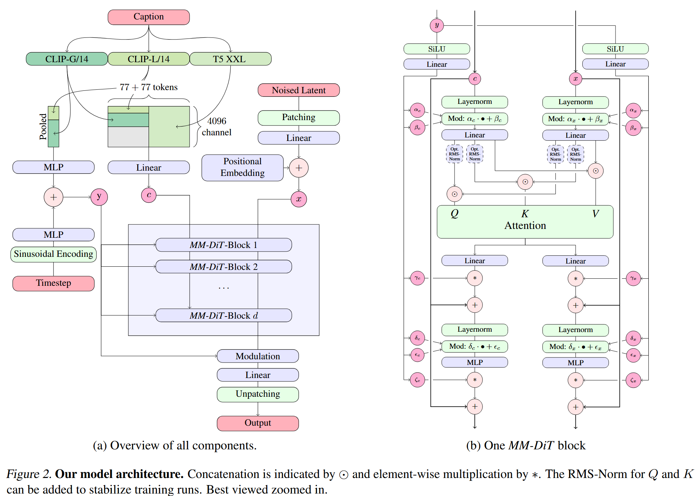

# 论文标题: Scaling Rectified Flow Transformers for High-Resolution Image Synthesis - arXiv 2024

### 一、引言与核心问题

这篇论文的研究背景是高分辨率的文本到图像（Text-to-Image）合成领域。近年来，扩散模型（Diffusion Models）已成为该领域的主流技术，但其固有的迭代采样过程导致推理速度较慢，计算成本高昂。与此同时，一种名为“修正流”（Rectified Flow, RF）的生成模型因其更优的理论特性（连接数据与噪声的路径是直线）而备受关注，这预示着其在实现高效率、少步数采样方面具有巨大潜力。然而，修正流在实践中，尤其是在大规模文本到图像合成任务上，尚未被充分验证和确立为标准范式。

*   **论文试图解决的核心任务是什么？**
    *   **输入 (Input)**: 输入是多模态的。
        
        1.  **文本描述 (Text Prompt)**: 一个自然语言字符串。该字符串被三个预训练且冻结的文本编码器处理，生成两种形式的表征：
            * 一个合并的池化向量 $C_{vec} \in \mathbb{R}^{2048}$，用于提供全局的文本语义信息。
            
              > 在处理文本或图像等序列数据时，模型通常会为序列中的每一个基本单元（例如文本中的一个单词或图像中的一个图块）生成一个向量表示，我们称之为“词元向量”（Token Vector）。这样，一段文本或一张图像就对应一个向量序列。池化向量是对这个向量序列进行聚合或总结，将其压缩成一个单一的向量。这个过程就叫做“池化”（Pooling）。
              >
              > - 目的：池化向量旨在捕捉整个序列的全局、概括性语义信息。就好比你读完一整篇文章后，用一句话总结出文章大意。这个“一句话总结”就是池化向量，而文章中的每个词、每句话就是词元向量序列。
              > - 如何生成：生成池化向量的方法有很多，常见的方式包括：
              >   - 对序列中所有词元向量取平均值（Average Pooling）。
              >   - 选取一个特殊的、专门用来学习全局信息的词元（如BERT模型中的 `[CLS]` 词元）所对应的向量。
              >   - 取序列中所有向量在各个维度上的最大值（Max Pooling）。
            * 一个上下文序列表示 $C_{ctxt} \in \mathbb{R}^{154 \times 4096}$，它由 CLIP 和 T5 编码器的序列输出拼接而成，保留了详细的、序列化的文本信息。
        2.  **噪声 (Noise)**: 一个从标准正态分布采样而来的噪声张量 $z_1 \in \mathbb{R}^{h \times w \times d}$，其维度与图像在隐空间（latent space）中的表示维度一致。
    *   **输出 (Output)**: 输出是一个符合文本描述的高分辨率RGB图像 $X \in \mathbb{R}^{H \times W \times 3}$。模型的核心部分直接生成的是图像的隐空间表示 $x \in \mathbb{R}^{h \times w \times d}$，该表示随后通过一个预训练的解码器（Decoder）被映射回像素空间，生成最终图像。在本文的实验中，隐空间的通道数 $d=16$，空间下采样因子为8。
    *   **任务的应用场景**: 该任务广泛应用于数字艺术创作、广告与媒体内容生成、创意设计、虚拟现实场景构建以及科学可视化等领域。
    *   **当前任务的挑战 (Pain Points)**:
        1.  **采样效率**: 传统扩散模型需要数百甚至上千步的迭代去噪过程才能生成高质量图像，推理延迟高，不适合实时应用。
        2.  **架构的可扩展性 (Scalability)**: 随着模型参数和数据规模的急剧增长，如何设计一种能够像自然语言处理领域的 Transformer 一样有效扩展、并持续提升性能的网络架构，是一个核心挑战。
        3.  **多模态信息融合**: 如何高效且深入地融合文本和图像这两种不同模态的信息是决定生成质量和文本遵循度的关键。简单的注意力机制可能成为信息流动的瓶颈。
        4.  **大规模训练的稳定性**: 训练数十亿参数的生成模型，尤其是在高分辨率和混合精度下，极易出现梯度爆炸、注意力熵坍塌等不稳定的问题，导致训练失败。
    *   **论文针对的难点**: 本文系统性地应对了上述所有挑战。它通过采用修正流来提升采样效率；提出一种新的多模态 Transformer 架构（MM-DiT）来解决可扩展性和信息融合问题；并引入 QK-Normalization 等技术来保障大规模训练的稳定性。

### 二、核心思想与主要贡献

*   **直观动机与设计体现**: 论文的直观动机在于，理论上更优越的修正流（RF）模型在实践中潜力未被完全发掘。研究者认为，通过系统的、大规模的实验，可以为修正流找到一种最佳的训练范式，并结合一个专为多模态设计的、具有良好扩展性的 Transformer 架构，从而将文本到图像合成技术推向新的高度。这一动机直接体现在论文的两大核心设计上：一是没有直接使用标准的均匀时间步采样来训练修正流，而是设计了新的采样策略（如Logit-Normal采样）；二是摒弃了通用的U-Net或标准DiT架构，设计了专门处理图文双流信息的MM-DiT架构。
*   **与相关工作的比较与创新**:
    *   相较于主流的 LDM (Latent Diffusion Models)，本文用修正流代替了传统的扩散过程。这使得从噪声到数据的转化路径变为直线，理论上单步即可完成生成，极大地提升了少步采样的性能。
    *   相较于 DiT (Diffusion Transformer)，DiT 主要用于类别条件生成，且将所有输入信息（类别、时间步、图像块）拼接后用一套共享的权重进行处理。本文提出的 **MM-DiT (Multimodal Diffusion Transformer)** 则是为图文多模态任务量身定制，它为文本和图像 tokens 设计了两套独立的权重流，仅在注意力计算的关键步骤进行信息交互，实现了更深度的双向信息融合。
*   **核心贡献与创新点**:
    1.  **修正流训练范式的优化**: 通过大规模的系统性研究，论文首次证明了带有定制化时间步采样策略的修正流模型，特别是Logit-Normal采样，其性能可以全面超越先前成熟的扩散模型（如 [LDM-Linear](./202204_LDMs.md) 和 EDM）。这为生成模型领域提供了一种更高效的训练范式。
    2.  **创新的多模态架构 (MM-DiT)**: 提出了一种新颖且可扩展的多模态 Transformer 架构。该架构通过为图像和文本流设置独立的参数，并在注意力机制中进行深度融合，显著提升了模型对文本的理解能力和生成图像的质量。
    3.  **大规模模型的可扩展性与稳定性验证**: 成功将模型扩展至80亿参数，并验证了其性能会随着模型大小和训练步数的增加而平滑、可预测地提升。同时，论文引入了 **QK-Normalization** 技术，有效解决了大模型在高分辨率下训练不稳定的问题。

### 三、论文方法论 (The Proposed Pipeline)

* **整体架构概述**:
  本文提出的方法是一个在隐空间中操作的、基于修正流的文本到图像生成模型。其流程可以概括为：首先，利用预训练的 VAE 编码器将图像压缩到低维的隐空间，并利用多个预训练的文本编码器提取输入文本的深层语义特征。接着，模型的核心——MM-DiT，在一个从纯噪声到目标图像隐空间表示的线性路径（即修正流）上，学习预测去除噪声的速度场（velocity field）。训练完成后，从一个随机噪声开始，通过数值积分（ODE solver），仅需几步即可生成高质量的图像隐空间表示，最后由 VAE 解码器将其还原为像素图像。

* **详细网络架构与数据流**:
  * **数据预处理**: 为了提升训练效率，论文对整个数据集的图像和文本进行了预编码。即，所有训练图像预先通过 VAE 编码器转化为隐空间表示；所有文本标题也预先通过 CLIP 和 T5 模型转化为 $C_{vec}$ 和 $C_{ctxt}$ 嵌入向量。这些预计算好的数据被存储起来，在训练时直接读取，避免了重复计算。

  *   **MM-DiT 架构解析**: 
      
      1. **输入准备**: 模型的输入包括加噪后的图像隐空间表示 $z_t$，经过正弦编码的时间步 $t$ 嵌入，以及文本嵌入 $C_{vec}$ 和 $C_{ctxt}$。
      
      2. **分块与序列化 (Patching & Sequencing)**: 图像隐空间表示 $z_t \in \mathbb{R}^{h \times w \times d}$ 被分割成 $2 \times 2$ 的图像块，然后线性展平为一个 token 序列。
      
      3. **双流处理 (Dual-Stream Processing)**: 这是 MM-DiT 的核心。网络内部存在两套独立的参数路径（可以理解为两个并行的 Transformer），分别用于处理图像 token 序列和文本 token 序列 ($C_{ctxt}$)。
      
         > #### Caption 处理流程
         >
         > 文本标题提供了生成图像内容的语义指导。
         >
         > 1. 多编码器编码：输入的Caption会被同时送入三个强大的预训练文本编码器：`CLIP-G/14`、`CLIP-L/14` 和 `T5 XXL`。
         > 2. 每个编码器都会输出两种形式的文本表示：
         >    - 词元向量序列 (Token Vector Sequence)：这是对文本中每个词元的详细向量化表示。例如，对于CLIP模型，它会输出一个长度为 77 的向量序列【$77\times768$, $77\times1280$（序列长度不足77则填充，超过则截断）】。这个序列保留了单词的顺序和局部信息。如图中 `77 + 77 tokens` 所示，模型将两个CLIP模型的词元序列拼接起来。T5模型也输出一个自己的词元序列【$77\times4096$（填充或截断）】。
         >    - 池化向量 (Pooled Vector)：这是对整个标题文本的单一向量总结。模型从两个CLIP编码器的输出中提取池化向量。【$1\times(768+1280)$】
         > 3. 两种表示的后续处理
         >    - 池化向量
         >      - 两个CLIP模型的池化向量被拼接（concatenate）在一起。
         >      - 然后通过一个 `MLP` (多层感知机) 网络进行处理。
         >      - 最终生成一个单一的条件向量，【加上时间步编码后】被标记为 **`y`**。
         >    - 词元向量序列
         >      - 来自CLIP和T5的词元向量序列经过 `Linear` (线性层) 转换，被映射到模型内部统一的维度（4096维）。
         >      - 处理后的序列准备好与图像序列进行信息交互。
         >
         > - 两种表示是该架构设计的精髓所在。
         >   - 池化向量 `y` 提供了全局、宏观的指导。这个全局信息会通过“调制”（Modulation）机制（见图(b)中的 `Mod` 模块）注入到模型的每一个计算模块（MM-DiT Block）中，确保整个生成过程不偏离主题。
         >   - 词元向量序列 则提供了局部、精细的细节和上下文关系。它能帮助模型理解更复杂的指令。这些细节信息通过注意力机制（Attention）与图像信息直接交互，从而实现对图像内容和空间布局的精确控制。
         >   - 为什么要用多个编码器？ 不同的文本编码器各有优势。CLIP擅长将文本和视觉概念对齐，而T5则是一个强大的通用语言模型，对复杂语法和长文本的理解能力更强。将它们结合起来可以产生更丰富、更鲁棒的文本理解。
         >
         > #### Timestep 处理流程
         >
         > 1. 输入：时间步 `t` 是一个标量数值，表示当前图像被添加了多少噪声。
         > 2. 正弦编码 (Sinusoidal Encoding)：将标量 `t` 通过不同频率的正弦和余弦函数，映射成一个高维向量。
         > 3. MLP处理：该高维向量再经过一个 `MLP` 网络处理，生成最终的时间步嵌入向量。
         >
         > - 神经网络直接处理标量数值 `t` 的效果不佳。正弦编码是一种标准技术，它能为每个时间步提供一个独特且平滑的向量表示，帮助模型更好地感知和区分不同的噪声水平。最终生成的时间步向量会和文本池化向量主元素相加成 `y` ，用于对模型进行调制。它告诉模型在当前这个噪声水平下，应该执行多大强度的去噪操作。
         >
         > #### Noised Latent 处理流程
         >
         > 1. 输入：这是一个在潜空间（Latent Space）中、被加了噪声的图像表示 `z_t`【采样的纯噪，$h \times w \times d$】。
         > 2. 分块 (Patching)：将这个二维的特征图切分成一系列不重叠的$2\times2$的图块。
         > 3. 展平与映射：每个小方块被展平成一个一维向量，然后通过一个 `Linear` 线性层，将其维度映射到与文本词元向量相同的维度（4096维）。
         > 4. 加入位置编码 (Positional Embedding)：为每个图块向量添加一个位置编码向量。这个编码向量包含了该图块在原始二维图像中的位置信息。
         >
         > - 为什么要分块？ Transformer架构最初是为处理一维序列数据（如文本）设计的。分块操作巧妙地将二维的图像数据转换成了一维的“图像词元”序列，从而可以应用Transformer模型。
         > - 为什么要加入位置编码？ 分块操作本身会丢失所有的空间位置信息。模型不知道哪个图块来自哪里。位置编码重新将这种至关重要的空间信息注入模型，让模型能够理解图像的结构和布局。
         
      4. **注意力融合 (Attention Fusion)**: 信息融合发生在每个 MM-DiT 块的自注意力模块中。具体来说，图像流和文本流分别使用各自的权重计算出 Query (Q)，Key (K) 向量。然后，**将两个流的 token 序列在序列维度上进行拼接**，形成一个统一的序列。注意力得分是在这个拼接后的大序列上计算的，这意味着每个图像 token 都会与所有其他图像 token 以及所有文本 token 进行交互，反之亦然，从而实现了彻底的**双向信息交流**。计算完注意力权重后，Value (V) 向量仍然由各自流的权重生成，并根据注意力权重进行加权求和。
      
         > #### RMS-Norm (Root Mean Square Normalization)
         >
         > - RMS-Norm 是一种相对较新的归一化方法，它只对输入向量的均方根（Root Mean Square）进行归一化，而不是像 Layer Normalization 那样同时归一化均值和方差（可以理解为简化版本）。其公式通常为：
         >
         >     $$
         >     \text{RMS-Norm}(x) = \frac{x}{\text{RMS}(x)} \cdot g
         >     $$
         >
         >     其中 $x$ 是输入向量，$\text{RMS}(x) = \sqrt{\frac{1}{N} \sum_{i=1}^N x_i^2}$ 是均方根，$g$ 是一个可学习的缩放参数（gain）。
         >
         > #### "Opt. RMS-Norm" 在论文中的具体应用
         >
         > 论文中提到的 "Opt. RMS-Norm" 实际上指的是 "Optional RMS-Norm"，即可选的 RMS-Norm。在 MM-DiT block 内部的多头自注意力机制中，它被用于对 Q (Query) 和 K (Key) 嵌入进行归一化。具体来说，是在计算注意力矩阵（Attention Matrix）之前。
         > 
         > - 为何是可选 (Optional)：这意味着研究人员在实验中发现，并非所有模型和所有训练阶段都需要它，但在特定情况下（特别是高分辨率和混合精度训练时）它能带来显著的稳定性提升。
         > 
         > #### "Opt. RMS-Norm" 的主要优势和作用
         >
         > 本质观点：对于深度神经网络，尤其是 Transformer 架构，激活值的尺度远比其中心位置更重要。
         >
         > 在本文的语境中，应用于Q和K的RMS-Norm具有以下几个核心优势
         >
         > 1. 防止注意力对数增长不稳定性 (Attention-Logit Growth Instability)：在大型Transformer模型中，特别是在高分辨率图像和混合精度训练时，Q和K之间的点积运算可能会产生非常大的数值，导致注意力分数（Attention Logits）急剧增长。这种过大的注意力分数会导致注意力分布变得“尖锐”（sharp），即少数几个词元的注意力权重非常高，而其他词元的权重接近于零。这使得模型很难从多样化的信息中学习。论文在Figure 5中展示了这一点，没有QK归一化时，最大注意力对数会失控增长，导致注意力熵（Attention Entropy）崩溃（即注意力分布变得过于集中）。通过归一化Q和K，可以限制点积的规模，从而抑制注意力对数的过快增长，使注意力分布更“平滑”，保持多样性。
         > 2. 稳定模型训练 (Stabilizes Model Training)：注意力对数的不稳定性直接导致训练过程的不收敛或损失发散（loss diverges）。在大型模型和复杂任务中，训练稳定性是一个巨大的挑战。通过对Q和K进行归一化，模型能够更稳定地学习，避免了在训练初期或中间阶段出现崩溃。论文明确指出，这种归一化是“能够实现bf16混合精度高效训练”的关键。
         > 3. 支持混合精度训练 (Enables Efficient Mixed-Precision Training)：混合精度训练（例如使用bf16浮点数）可以显著减少内存占用和加速训练。然而，较低的精度更容易出现数值溢出或下溢问题，使得模型训练不稳定。QK归一化通过将Q和K的数值范围限制在一个更稳定的区间，大大增强了模型在混合精度训练中的鲁棒性，使其能够充分利用bf16带来的性能提升。
         >4. 提高性能 (Improves Performance)：稳定、高效的训练最终会转化为更好的模型性能。虽然RMS-Norm本身可能不是直接的性能提升器，但它解决了导致性能受损的根本性稳定性问题。在Transformer中，Q、K、V的归一化研究已经表明，它不仅能提高稳定性，还能在某些情况下提升模型的泛化能力。
         > 
         >#### 总结
         > 
         > "Opt. RMS-Norm" 在这篇论文中是一个关键的训练稳定性技术。它通过在计算注意力矩阵之前对Query和Key向量进行均方根归一化，有效解决了大型Transformer模型在高分辨率和混合精度训练中可能出现的注意力对数不稳定性问题。这一创新使得模型能够更稳定、高效地训练，进而实现更优越的文本到图像生成性能。
         
      5. **条件注入 (Conditioning)**: 时间步嵌入 $t$ 和全局文本嵌入 $C_{vec}$ 通过一个调制（Modulation）机制（类似于DiT中的AdaLN-Zero）注入到每个 MM-DiT 块中，为网络提供时间和全局上下文信息。
      
      6. **形状变换**: 假设隐空间大小为 $32 \times 32$，通道为16，经过 $2 \times 2$ 分块后，图像序列长度为 $16 \times 16 = 256$。文本序列长度为154。在注意力模块中，处理的总序列长度即为 $256 + 154 = 410$。经过所有 $d$ 个 MM-DiT 块的处理后，输出的图像 token 序列被重新组合（Unpatching）成 $32 \times 32 \times 16$ 的形状，作为最终的噪声预测结果。
      
      7. **结合消融实验的作用分析**: 论文图4的实验清晰地表明，MM-DiT 的性能显著优于标准的 DiT（简单拼接所有输入）、CrossDiT（交叉注意力）和 UViT 架构。这证明了其独特的双流设计和注意力融合机制对于高效的多模态信息处理是至关重要的。
  
* **损失函数 (Loss Function)**:
  
  * **设计理念**: 论文采用了基于流匹配（Flow Matching）的损失函数，其目标是让模型预测的速度场 $v_\theta(z_t, t)$ 尽可能地匹配真实的速度场 $u_t(z_t)$。对于修正流，这个真实速度场 $u_t$ 非常简洁，就是 $z_1 - z_0$（噪声 - 图像）。这比传统扩散模型中复杂的得分匹配目标更直接。
  
    > #### 优化的 [Rectified Flow (RF)](https://alphaxiv.org/abs/2209.03003) 损失函数
    >
    > 传统的扩散模型（如Stable Diffusion 1.5/2.1）大多基于DDPM或LDM的 formulation，其去噪过程遵循一条“弯曲”的轨迹。而这篇论文做出了根本性的改变。
    >
    > 1. Rectified Flow (RF) 基础框架
    >
    >    -  RF是一种生成模型，旨在学习一个确定性的常微分方程 (ODE) 来描述从简单分布（如噪声）到复杂数据分布的“直线”传输路径。【传统DM的反向过程通常被建模为一个随机微分方程 (SDE) 或常微分方程 (ODE) 的离散近似，通常是弯曲且多步的】
    >
    >    - RF的具体实现：数据点 $x_0$ 是从真实数据分布中采样的一个清晰图像的潜变量；噪声点 $x_1$ 是一个预先采样好的、来自标准高斯分布 $\mathcal{N}(0, I)$ 的纯噪声向量。这个 $x_1$ 不是 $x_0$ 经过 $t$ 时间步加噪后的结果，而是另一个随机采样点。
    >
    >      - 路径定义：RF 假设数据点 $x_0$ 和噪声点 $x_1$ 之间存在一条直线轨迹。这条轨迹上的任意一点 $x_t$ 可以通过**线性插值** $x_t = (1-t)x_0 + t x_1 \quad \text{for } t \in [0, 1]$ 得到。
    >
    >      - 模型的任务是预测**速度**。对于一条从 $x_0$ 移动到 $x_1$ 的直线路径，其恒定的速度向量就是 $ 
    >        u = x_1 - x_0
    >         $ 。
    >
    >      - 将第2步中构建的 **$x_t$** 和时间步 $t$ 输入到MM-DiT模型中，输出一个预测的速度向量：$v_\theta(x_t, t)$。使用均方误差（MSE）来比较模型的预测和“正确答案”：
    >        $$
    >        L_{\text{RF}} = || v_\theta(x_t, t) - (x_1 - x_0) ||^2
    >        $$
    >        这个损失函数被称为 **Flow Matching Loss**。
    >
    >    - RF的巨大优势：采样效率极高【因为路径是直的，理论上从噪声到清晰图像只需要一步就能完成。虽然一步效果不够完美，但在极少的采样步数（4-8步）下就能生成高质量图像，远超传统扩散模型动辄20-50步的需求】、理论特性更优【直线的路径减少了数值积分的累积误差，使得采样过程更稳定】
    >
    > 2. 定制化的信噪比采样器 (Tailored SNR Samplers) 
    >
    >   - 缺陷：标准的RF训练会均匀地在 [0, 1] 的时间步上采样进行训练。但实验发现，路径的“中间地带”（t ≈ 0.5，图像既不完全是噪声也不完全清晰）是最难学习的，而两端（t ≈ 0 或 1）则相对简单。均匀采样在简单部分浪费了过多的训练精力。
    >
    >   - 解决方案：Logit-Normal 采样， Logit-Normal 概率分布的特点是，它会更频繁地采样中间区域的时间步，而较少采样两端的时间步。
    >
    >
    > ------
    >
    > #### 创新的训练方式
    >
    > 除了损失函数的选择与优化，论文还介绍了一整套为了实现SOTA性能而精心设计的训练方法和策略。
    >
    > 1. 改进数据表示 (Improving Data Representations)
    >
    >   - 更多通道的自动编码器 (Improved Autoencoders)：latent space的质量决定了最终图像质量的上限。之前模型使用的8通道潜空间会成为瓶颈。训练了一个16通道的自动编码器，为生成更高质量的图像打下了坚实基础。
    >
    >   - 更高质量的文本标题 (Improved Captions)：公共数据集的标题往往过于简单。作者效仿DALL-E 3的做法，使用强大的视觉语言模型 (CogVLM) 为数据集中的图片生成详细的、描述性的合成标题，并与原始标题以50/50的比例混合训练。
    >
    >
    > 2. 解决大规模训练的稳定性问题：QK-Normalization
    >
    > 3. 适配高分辨率训练的独特技巧
    >    - 分辨率依赖的时间步偏移 (Resolution-Dependent Timestep Shifting)：作者洞察到要用噪声完全“淹没”一张1024x1024的图像，比淹没一张256x256的图像需要“更多”的噪声。因此，在高分辨率上训练和采样时，噪声调度（即时间步 $t$ 的应用方式）应该有所不同。运用公式 $t_m = \frac{m \cdot t_n}{n + (m-n) \cdot t_n}$ 可以在高分辨率下对时间步进行“偏移”，以匹配在低分辨率下训练时的等效信噪比。【 在高分辨率下采样时，通过调整输入给模型的时间步 $t$ 值，来“欺骗”模型，让它在高分辨率图像上执行的去噪操作，能与它在低分辨率图像上学到的等效噪声水平相对应。这样，模型在高分辨率上也能更有效地去噪，而不需要改变总的采样步数。】
    >
    > 4. 后期与人类偏好对齐：直接偏好优化 (Direct Preference Optimization, DPO)
    
  * **关键创新 - 时间步加权**: 论文的核心发现不在于损失函数本身的形式，而在于对训练时间步 $t$ 的采样分布进行了优化。标准的修正流使用均匀分布 $t \sim U[0, 1]$ 进行采样。论文通过实验发现，这种均匀采样是次优的。因为在 $t$ 接近0（纯数据）和 $t$ 接近1（纯噪声）时，速度预测任务相对简单，而在中间区域（数据和噪声混合）任务最困难。
  
  * **Logit-Normal 采样**: 论文提出并验证了 Logit-Normal 采样策略是最佳选择。该策略的概率密度函数在 $t=0.5$ 附近形成一个峰值，而在两端则较低（见论文图11）。这意味着模型在训练时会更频繁地看到那些“半成品”状态的、最具挑战性的样本，从而被迫学习一个在整个生成轨迹上都非常鲁棒的速度场。
  
  * **对性能的贡献**: 表1的全局排序结果显示，采用 `rf/lognorm(0.00, 1.00)` 采样的修正流模型在所有配置中排名第一，远超使用均匀采样的标准修正流 (`rf`) 和其他经典的扩散模型 formulation (`eps/linear`, `edm`)。这证明了该采样策略是本文方法取得成功的关键因素之一。
  
* **数据集 (Dataset)**:
  *   **所用数据集**: 论文在一个大规模的内部数据集上进行训练，并使用公开的 ImageNet 和 CC12M 数据集进行方法对比和消融研究，使用 COCO-2014 数据集进行评估。
  *   **特殊处理**:
      1.  **标题增强 (Caption Enhancement)**: 使用了一个强大的视觉语言模型（VLM）CogVLM 为数据集中的图片生成更详细、更丰富的描述性标题。最终训练时，使用了 50% 的原始标题和 50% 的生成标题混合，表4证明这能显著提高模型的文本理解能力。
      2.  **数据去重与筛选 (Deduplication and Filtering)**: 为了防止模型单纯地“记忆”训练样本并提升生成内容的多样性和安全性，论文对训练数据进行了严格的预处理，包括：基于美学评分进行筛选、移除 NSFW 内容，以及使用基于 SSCD 的聚类方法来**检测并移除语义和感知上的重复图像**。

### 四、实验结果与分析

*   **核心实验结果**:
    论文在多个基准上展示了其模型的卓越性能。以 GenEval 基准为例（见论文表5），该基准全面评估模型在物体计数、位置关系、颜色属性等多方面的文本遵循能力。

    | 指标 (GenEval) | SDXL | DALL-E 3 | 本文方法 (8B, 1024^2, w/DPO) |
    | -------------- | ---- | -------- | ---------------------------- |
    | Overall Score  | 0.55 | 0.67     | **0.74**                     |
    | Single Object  | 0.98 | 0.96     | **0.99**                     |
    | Two Objects    | 0.74 | 0.87     | **0.94**                     |
    | Counting       | 0.39 | 0.47     | **0.72**                     |
    | Colors         | 0.85 | 0.83     | **0.89**                     |
    | Position       | 0.15 | 0.43     | **0.33**                     |
    | Attribution    | 0.23 | 0.45     | **0.60**                     |

    这些数据清晰地表明，本文提出的模型在综合性能上不仅超越了当前最强的开源模型 SDXL，也超越了以遵循复杂指令著称的闭源模型 DALL-E 3。特别是在计数、属性绑定和多物体关系等难点上，提升尤为显著。

*   **消融研究解读**:
    *   **流模型与采样策略**: 论文表1是对不同流模型（RF, EDM, LDM）和时间步采样策略进行的最重要的消融研究。结果明确指出，修正流（RF）结合Logit-Normal采样是性能最佳的组合。
    *   **网络架构**: 图4对比了MM-DiT与DiT、CrossDiT、UViT，证明了MM-DiT在验证集损失、CLIP Score和FID等多个指标上均具有明显优势。
    *   **训练稳定性**: 图5展示了QK-Normalization的效果。在没有该技术时，高分辨率训练会导致注意力logit值爆炸式增长，熵急剧下降，最终训练崩溃。而加入QK-Norm后，训练过程变得非常稳定。

*   **可视化结果分析**:
    论文图1展示的最终模型生成样本，在图像质量、细节丰富度、风格多样性以及复杂的空间构图和文字生成能力上都达到了极高的水准，直观地证明了方法的有效性。图13则展示了经过直接偏好优化（DPO）微调后，模型在拼写准确性和美学质量上得到进一步提升，验证了模型具备良好的可微调性。

### 五、方法优势与深层分析

*   **架构/设计优势**:
    *   **MM-DiT 的优势**: MM-DiT 的核心优势在于其**专业化分工与深度融合**的设计。通过为图像和文本分配独立的 Transformer 路径，模型可以学习到两种模态各自独特的内部表示和依赖关系。而在注意力层面的序列拼接融合，则打破了传统交叉注意力单向或浅层交互的限制，实现了全局的、双向的信息流动。这使得文本中的任何一个词都可以直接影响图像中的任何一个区域，反之亦然，从而极大地增强了模型处理复杂文本描述和空间关系的能力。
    *   **Logit-Normal 采样的优势**: 这种采样策略的优势在于它遵循了**“聚焦于难点”**的训练原则。它迫使模型将更多的学习资源投入到最具挑战性的中间去噪阶段，而不是在相对容易的初始和最终阶段浪费算力。这背后的原理类似于课程学习或难例挖掘，通过优化训练数据的分布，使得模型学习到的解（速度场）更加平滑和泛化，从而在推理时，尤其是在需要大幅跨越的少步采样中，表现更佳。

*   **解决难点的思想与实践**:
    论文的核心思想是**“系统优化 + 架构创新”**。它首先通过大规模的实证研究，将一个理论优越但实践中表现不佳的修正流模型，通过优化其训练采样策略，打造成了一个SOTA级别的生成范式。这是“系统优化”的体现。然后，它认识到现有 Transformer 架构在多模态融合上的不足，为此设计了专门的MM-DiT架构，这是“架构创新”的体现。最终，通过引入QK-Norm等工程技巧保障了这一复杂系统在大规模训练下的稳定性。这一系列组合拳，系统性地解决了从采样效率、模型性能到训练稳定性的全链路核心难点。

### 六、结论与个人思考

*   **论文的主要结论回顾**:
    本文成功地将修正流模型从理论优势转化为实践上的领先性能，并通过创新的MM-DiT架构和一系列训练优化技术，构建了一个当前最先进的文本到图像生成系统。研究证明，在正确的训练范式和网络架构下，生成模型的可扩展性潜力依然巨大，性能远未达到饱和。

*   **潜在局限性**:
    1.  **计算资源依赖**: 模型的训练和推理成本极高。训练动用了海量的计算资源（5e22 FLOPs），而80亿参数的模型即便是推理，也对硬件提出了极高的要求。
    2.  **数据依赖性**: 模型性能的提升很大程度上依赖于一个巨大的、经过精心筛选和增强的私有数据集。这使得其成功难以被社区完全复现。
    3.  **文本编码器瓶颈**: 模型性能高度依赖于冻结的文本编码器。尽管可以通过移除T5来降低推理成本，但这仍然是一个庞大的组件，并且其本身的理解能力上限也构成了整个系统的天花板。

*   **未来工作方向**:
    1.  **模型蒸馏与压缩**: 研究如何将这个巨大的8B模型蒸馏成一个参数量更小、推理速度更快，但性能损失不大的紧凑模型，以适应更广泛的应用场景。
    2.  **架构与流模型的进一步探索**: 将MM-DiT架构应用于视频、3D等多模态生成任务。同时，探索是否存在比修正流更优的、具有更好理论性质的流模型。
    3.  **可控性与编辑性**: 在当前高质量生成的基础上，进一步研究如何实现对生成图像的精细化、局部化编辑和可控生成。