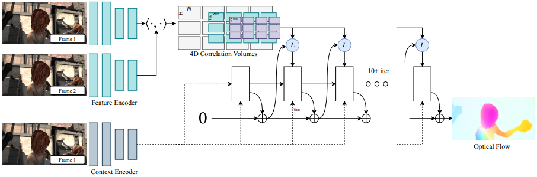

# 论文标题: RAFT: Recurrent All-Pairs Field Transforms for Optical Flow - ECCV 2020

### 一、引言与核心问题

本文介绍了一种名为RAFT（Recurrent All-Pairs Field Transforms）的新型深度学习架构，旨在解决计算机视觉中的一个基础且长期存在的任务：光流估计（Optical Flow）。光流任务旨在计算视频序列中连续两帧之间每个像素的运动位移，是理解动态场景的关键技术。尽管已有长足发展，精确、高效且鲁棒的光流估计仍然面临诸多挑战，尤其是在处理快速运动、遮挡、运动模糊以及无纹理区域时。传统的基于优化（Energy Minimization）的方法虽然在理论上很优雅，但在设计能够应对各种复杂场景的优化目标函数时遇到了瓶颈。近年来，深度学习方法，特别是基于卷积神经网络（CNN）的模型，展现了巨大的潜力，它们能够直接从数据中学习预测光流，在推理速度上远超传统方法。然而，这些方法自身也引入了新的问题，如架构设计的有效性、训练效率以及对新场景的泛化能力。

**论文试图解决的核心任务是什么？**

*   **输入 (Input)**: 模型的输入是连续的两帧RGB图像，$I_1$ 和 $I_2$。
    *   **数据维度/Shape**: `[Batch_size, 3, H, W]`，其中3代表RGB三个通道，H和W分别是图像的高度和宽度。

*   **输出 (Output)**: 模型的输出是一个稠密的光流场（dense displacement field）$f$。这个场为第一帧图像$I_1$中的每一个像素 $(u, v)$ 提供了一个位移向量 $(\Delta u, \Delta v)$，使其能够对应到第二帧图像$I_2$中的位置 $(u + \Delta u, v + \Delta v)$。
    *   **数据维度/Shape**: `[Batch_size, 2, H, W]`，其中2代表水平和垂直方向上的位移。

*   **任务的应用场景**: 光流估计是众多计算机视觉和图形学应用的基础，包括但不限于：
    *   视频编辑与特效（如运动插值、视频稳定）。
    *   三维重建与SLAM（同步定位与建图）。
    *   自动驾驶（动态障碍物感知）。
    *   动作识别与视频理解。

*   **当前任务的挑战 (Pain Points)**:
    1.  **精度与鲁棒性**: 在处理大位移、快速运动、遮挡、模糊以及弱纹理/重复纹理区域时，现有方法的精度会显著下降。
    2.  **Coarse-to-Fine架构的固有缺陷**: 以PWC-Net为代表的许多主流方法采用从粗到精（coarse-to-fine）的策略，即先在低分辨率下估计一个粗略光流，然后逐步上采样并精细化。这种方法的弊端在于：
        *   **错误传播**: 在粗糙分辨率上的估计错误会传递到后续更精细的层级，且难以修正。
        *   **丢失细节**: 容易忽略掉小的、快速移动的物体，因为它们在低分辨率下可能就消失了。
    3.  **效率与泛化性**: 一些模型为了追求精度，堆叠了大量模块，导致参数量巨大，训练周期漫长（例如，FlowNet2.0）。此外，在特定数据集上训练的模型往往难以泛化到其他不同分布的数据集上。

*   **论文针对的难点**: RAFT架构的设计旨在直接应对上述挑战。它摒弃了主流的coarse-to-fine金字塔结构，转而提出一种在单一高分辨率上进行迭代优化的新范式。其核心目标是：
    1.  **提升精度与泛化能力**: 通过一个更合理的架构来获得更精确的光流预测，并具备强大的跨数据集泛化能力。
    2.  **解决Coarse-to-Fine的缺陷**: 通过维护一个全分辨率的流场并迭代更新，来避免错误传播和细节丢失问题。
    3.  **提高效率**: 设计一个参数量少、推理速度快、训练迭代次数少的轻量级高效模型。

### 二、核心思想与主要贡献

*   **直观动机与设计体现**: RAFT的直观动机来源于传统的迭代优化算法。传统方法通常会初始化一个解，然后通过迭代逐步求精，直至收敛。RAFT将这一思想引入到深度学习架构中：它不一次性预测最终光流，而是从一个零流场开始，通过一个循环神经网络（Recurrent Neural Network）单元，在每一步迭代中产生一个更新量，逐步逼近真实光流。这一动机体现在其三大核心组件的设计上：
    1.  **特征提取器 (Feature Encoder)**: 学习从原始图像中提取丰富的、有利于匹配的像素级特征。
    2.  **4D相关性体 (4D Correlation Volume)**: 计算第一帧所有像素特征与第二帧所有像素特征的相似度（通过点积），构建一个包含“所有像素对”匹配信息的全局知识库。
    3.  **循环更新算子 (Recurrent Update Operator)**: 扮演着优化算法中“迭代步”的角色。它是一个基于GRU（Gated Recurrent Unit）的模块，在每一步中，它会根据当前的光流估计，从4D相关性体中“查询”相关的匹配信息，并预测一个光流的修正量。

*   **与相关工作的比较与创新**:
    *   **与Coarse-to-Fine方法 (如 PWC-Net) 的比较**: RAFT最大的不同在于它始终在单一的高分辨率上维护和更新光流场，而PWC-Net等是在一个图像金字塔上从低到高逐级计算。这使得RAFT能够更好地处理小物体，并避免了低分辨率下的错误累积。
    *   **与迭代求精方法 (如 IRR) 的比较**: 虽然IRR等工作也使用了迭代，但它们通常是堆叠多个独立的、不共享权重的网络模块，导致模型庞大。而RAFT的更新算子是**循环的（recurrent）**，即所有迭代步骤共享同一套权重。这极大地减少了参数量，并使网络学习到一个通用的“优化步骤”，增强了泛化能力。此外，RAFT的更新算子是一个轻量级的GRU单元，理论上可以迭代任意次，真正模拟了优化算法的收敛过程，而先前工作的迭代次数通常受限于网络深度。
    *   **与全局匹配方法 (如 DCFlow) 的比较**: 像DCFlow这样的方法也构建了4D成本体（cost volume），但它们依赖于不可微分的后处理步骤（如SGM算法）来提取光流，导致无法进行端到端的训练。RAFT则设计了一个完全可微分的、基于查询的更新模块，使得整个流程可以端到端地针对最终的光流误差进行优化，从而学习到更优的特征和更新策略。

*   **核心贡献与创新点**:
    1.  **新颖的架构范式**: 提出了一种全新的、用于光流估计的深度网络架构。该架构在单一高分辨率上，通过一个循环更新算子对光流场进行迭代优化，有效规避了传统coarse-to-fine方法的缺陷。
    2.  **All-Pairs 4D相关性金字塔**: 设计了一种高效构建和查询4D相关性体的方法。通过在特征维度上构建包含所有像素对匹配信息的全局相关性体，并在查询时利用金字塔池化来感知不同尺度的位移，使得模型既能处理大位移，也能精确捕捉小位移。
    3.  **SOTA性能与高效率**: 在Sintel和KITTI等主流光流基准测试上取得了当时最先进的（State-of-the-Art）性能，相比之前最佳结果有显著的错误率降低（例如，在Sintel final pass上降低30%）。同时，模型在参数量、训练速度和推理时间上都表现出极高的效率和强大的跨数据集泛化能力。

### 三、论文方法论 (The Proposed Pipeline)

* **整体架构概述**: RAFT的整体流程可以清晰地分解为三个阶段。首先，**特征提取阶段**，一个特征编码器和一个上下文编码器从输入图像对中提取密集的像素级特征。其次，**视觉相似度计算阶段**，通过计算所有特征对的点积来构建一个4D相关性体，并对其进行池化形成一个多层次的相关性金字塔，该金字塔存储了全局的匹配信息。最后，**迭代更新阶段**，一个基于GRU的循环更新算子，从一个零光流场开始，在每次迭代中，根据当前光流估计从相关性金字塔中查询局部匹配信息，并结合上下文信息，预测出一个光流更新量，逐步求精光流场。所有阶段都是完全可微分的，构成了一个端到端可训练的架构。

  

*   **详细网络架构与数据流**:
    *   **1. 特征提取 (Feature Extraction)**:
        
        *   **模块设计**: 包含两个结构相同但权重独立的CNN编码器：
            *   **特征编码器 ($g_\theta$)**: 应用于$I_1$和$I_2$两张图像，旨在提取用于像素匹配的底层特征。它由6个残差块（Residual Blocks）组成，分别在1/2、1/4和1/8的下采样分辨率上进行特征提取。
            *   **上下文编码器 ($h_\theta$)**: **仅**应用于第一张图像$I_1$，旨在提取更高级的场景上下文信息，这些信息在后续的更新步骤中被直接注入，以帮助网络理解运动的整体背景。
        *   **形状变换**: 输入图像`[B, 3, H, W]`经过两个编码器后，均输出一个在1/8分辨率下的特征图。
            *   **Shape**: `[B, 3, H, W]` $\rightarrow$ `[B, 256, H/8, W/8]`。其中特征维度$D=256$。
        *   **作用分析**: 特征编码器是匹配的基础，而上下文编码器是一个关键设计。消融实验（Table 2, Context vs. No Context）表明，移除上下文网络后，模型性能在Sintel和KITTI上均有下降。这证明了将高级场景信息直接注入更新算子，有助于网络更好地整合空间信息，尤其是在处理运动边界时。
        
    *   **2. 计算视觉相似度 (Computing Visual Similarity)**:
        
        *   **4D相关性体 (4D Correlation Volume)**: 将$g_\theta(I_1)$和$g_\theta(I_2)$的特征图进行矩阵乘法，计算出所有像素对之间的点积相似度，形成一个4D的相关性体 $\mathcal{C}$。
            *   **Shape**: $\mathcal{C}$ 的维度为 `[B, H/8, W/8, H/8, W/8]`。
        *   **相关性金字塔 (Correlation Pyramid)**: 由于完整的4D体非常巨大，直接操作效率低下。RAFT通过对$\mathcal{C}$的后两个维度（对应于$I_2$的维度）进行不同尺度的平均池化（average pooling），构建了一个4层的金字塔 $\{\mathcal{C}_1, \mathcal{C}_2, \mathcal{C}_3, \mathcal{C}_4\}$。
            *   **池化核大小**: 分别为 1x1, 2x2, 4x4, 8x8。
            *   **金字塔各层Shape**: $\mathcal{C}_k$ 的维度为 `[B, H/8, W/8, H/(8*2^(k-1)), W/(8*2^(k-1))]`。
            *   **作用分析**: 这个金字塔结构非常巧妙。它在不降低第一帧图像分辨率（前两个维度始终是H/8, W/8）的前提下，提供了关于不同大小位移的信息。查询$\mathcal{C}_1$可以获得精细的局部匹配信息（对应小位移），而查询$\mathcal{C}_4$则可以获得大范围的平滑匹配信息（对应大位移）。消融实验（Table 2, Correlation Pooling）证明，移除池化后性能显著下降，说明捕获多尺度位移信息至关重要。
        *   **相关性查询 (Correlation Lookup)**: 给定第k次迭代的光流估计 $f_k$，对于$I_1$中的每个像素 $\mathbf{x}=(u, v)$，其在$I_2$中的估计对应点为 $\mathbf{x}' = (u+f_k^1(\mathbf{x}), v+f_k^2(\mathbf{x}))$。查询操作以$\mathbf{x}'$为中心，在相关性金字塔的每一层上采样一个大小为 $(2r+1) \times (2r+1)$ 的局部邻域（使用双线性插值，因为$f_k$不为整数），并将所有层查询到的特征（即相似度向量，维度为$4\times9\times9\rightarrow324$）拼接起来。
            *   **查询半径 (Lookup Radius) $r$**: 论文中设为4。
            *   **作用分析**: 这是连接当前光流估计和全局匹配信息的桥梁。它为更新算子提供了“数据驱动”的证据，告诉它当前估计点的周围匹配情况如何。消融实验（Table 2, Lookup Radius）显示，随着查询半径从0增加到4，性能持续提升，证明了利用局部邻域信息来指导更新的有效性。
        
    *   **3. 迭代更新 (Iterative Updates)**:
        
        *   **更新算子 (Update Operator)**: 这是一个基于卷积GRU（ConvGRU）的循环单元。它接收一个输入$x_t$和上一时刻的隐藏状态$h_{t-1}$，输出新的隐藏状态$h_t$。
            
            *   **输入 $x_t$**: 由三部分特征**拼接(concatenate)**而成：1) 上一步从相关性金字塔中查询到的特征；2) 当前光流估计$f_k$（经过两层卷积编码后的特征，从2维变为高维）；3) 从上下文网络$h_\theta(I_1)$中提取的特征。
            *   **ConvGRU内部结构**: 使用卷积层替代了传统GRU中的全连接层，以保持空间结构。其更新公式如下：
                $$
                \begin{align}
                z_t &= \sigma(\text{Conv}_{3\times3}([h_{t-1}, x_t], W_z)) \quad &\text{(Update Gate)} \\
                r_t &= \sigma(\text{Conv}_{3\times3}([h_{t-1}, x_t], W_r)) \quad &\text{(Reset Gate)} \\
                \tilde{h_t} &= \tanh(\text{Conv}_{3\times3}([r_t \odot h_{t-1}, x_t], W_h)) \quad &\text{(Candidate Hidden State)} \\
                h_t &= (1 - z_t) \odot h_{t-1} + z_t \odot \tilde{h_t} \quad &\text{(New Hidden State)}
                \end{align}
                $$
            *   其中，$[h_{t-1}, x_t]$就是把$h_{t-1}$和$x_t$拼接成维度`[Batch, C_h + C_x, H/8, W/8]`的张量，$\sigma$是Sigmoid激活函数，$\odot$是元素级乘法。
            *   **作用分析**: 这是模型的核心“大脑”。消融实验（Table 2, Update Op.）表明，使用GRU比简单的级联卷积层（Conv）效果好得多，因为门控机制能更好地控制信息流动，使得迭代序列更容易收敛。同时，权重绑定（Tied Weights）比不绑定权重的版本性能更好，参数更少，这证明了学习一个通用的更新规则是有效的。
        *   **光流预测 (Flow Prediction)**: 隐藏状态$h_t$经过两个卷积层，预测出光流的**更新量** $\Delta f$。
        *   **光流更新**: $f_{k+1} = f_k + \Delta f$ (残差连接)。初始光流$f_0$为0。
        *   **上采样 (Upsampling)**: 以上所有计算都在1/8分辨率下进行。为了得到全分辨率光流，RAFT设计了一个**凸组合上采样 (Convex Upsampling)**模块。该模块为一个在1/8分辨率下的$H/8 \times W/8$光流图，预测出一个$H/8 \times W/8 \times (8 \times 8 \times 9)$的上采样权重掩码。对于每一个粗糙网格的像素，其对应的高分辨率$8 \times 8$区域内的每一个精细像素，其最终光流值是通过其粗糙网格邻域（$3 \times 3$）的9个光流向量的凸组合（小型的CNN，输入是最终隐藏状态$h$，输出是`[B, 8×8×9, H/8, W/8]`的张量，即对于每一个精细像素$i$，都有粗窗口像素$j$的权重$w_{ij}$，通过softmax归一化使9个值和为1）得到的。
            
            *   **作用分析**: 消融实验（Table 2, Upsampling）证明，这种学习到的上采样方法远优于简单的双线性插值，尤其在运动边界附近能产生更锐利、更准确的结果。
    
*   **损失函数 (Loss Function)**:
    
    *   **设计理念**: 监督整个迭代产生的光流预测序列 $\{f_1, f_2, ..., f_N\}$，而不仅仅是最终的预测。损失函数是所有迭代步预测的光流与真实光流（ground truth）$f_{gt}$之间$L_1$距离的加权和。
    *   **数学形式**:
        $$
        \mathcal{L} = \sum_{i=1}^{N} \gamma^{N-i} ||f_{gt} - f_i||_1
        $$
        其中，$N$是训练时的迭代次数（论文中为12次），$\gamma$是一个指数权重系数，论文中设为0.8。
    *   **关注重点**: 这种损失函数设计鼓励模型在迭代的早期阶段就快速产生一个合理的估计，并在后续迭代中持续优化。指数递增的权重$\gamma^{N-i}$使得后面的迭代步骤的误差对总损失的贡献更大，迫使模型学习收敛到一个更精确的解。
    
*   **数据集 (Dataset)**:
    *   **训练数据集**: 使用了合成数据集进行预训练，包括FlyingChairs和FlyingThings3D。这是光流领域训练深度模型的标准做法，因为合成数据集能提供海量的、具有精确GT的数据。
    *   **微调与评估数据集**:
        *   **Sintel**: 一个包含复杂非刚体运动和电影特效的合成数据集，是评估模型泛化能力的重要基准。
        *   **KITTI**: 一个源于真实世界自动驾驶场景的数据集，特点是刚体运动较多，但GT较为稀疏。
        *   为了在Sintel上取得更好性能，微调时还混合了KITTI和HD1K数据集。
    *   **数据增强 (Data Augmentation)**: 论文中提到了广泛的数据增强，包括：
        *   **光度增强**: 随机扰动亮度、对比度、饱和度和色调。
        *   **空间增强**: 随机缩放和拉伸图像。
        *   **遮挡增强**: 在第二张图像$I_2$中随机擦除矩形区域，以模拟遮挡。这些增强对于提升模型的鲁棒性和泛化能力至关重要。

### 四、实验结果与分析

*   **核心实验结果**: RAFT在Sintel和KITTI两个主流排行榜上均取得了第一名。以下是与当时代表性工作的关键数据对比（数据来自论文Table 1）：
    *   **Sintel (test)**: End-Point-Error (EPE) 越低越好。
        | 方法        | Training     | Clean Pass (EPE) | Final Pass (EPE) |
        |-------------|--------------|------------------|------------------|
        | PWC-Net+    | C+T+S+K+H    | 2.55 (reported)  | 4.60             |
        | MaskFlowNet | C+T+S+K+H    | 2.52             | 4.17             |
        | **RAFT (2-view)** | C+T+S+K+H    | **1.94**         | **3.18**         |
        | **RAFT (warm-start)** | C+T+S+K+H    | **1.61**         | **2.86**         |
    *   **KITTI-15 (test)**: F1-all (%) 越低越好。
        | 方法        | Training  | F1-all (%) |
        |-------------|-----------|------------|
        | PWC-Net+    | K         | 7.72       |
        | MaskFlowNet | Sintel finetuned | 6.10       |
        | **RAFT (2-view)** | Sintel finetuned | **5.10**       |

    从数据可以看出，RAFT在各项指标上都大幅领先于当时的SOTA方法。例如，在Sintel Final Pass上，RAFT (warm-start) 的EPE为2.86，相比MaskFlowNet的4.17，错误率降低了约31.4%。`warm-start`版本利用前一帧的光流作为初始化，进一步提升了性能，这展示了RAFT迭代框架的灵活性。

*   **消融研究解读**: 论文的Table 2提供了详尽的消融实验，验证了各个设计选择的必要性：
    *   **Update Operator**: ConvGRU显著优于简单的卷积层，证明了门控循环单元对于稳定迭代的重要性。
    *   **Weight Tying**: 权重共享（Tied Weights）比不共享权重的版本性能更好，且参数量从32.5M骤降至4.8M，证明了学习一个通用更新规则的有效性。
    *   **Context Network**: 移除上下文网络后，性能下降，说明直接注入$I_1$的高级特征有助于聚合运动边界内的空间信息。
    *   **Correlation Pooling**: 使用多尺度池化构建相关性金字塔，对于处理不同大小的位移至关重要。
    *   **Upsampling**: 学习到的凸组合上采样模块，相比双线性插值，能显著提升最终全分辨率光流的精度。

*   **可视化结果分析**: 论文中的Figure 3和Figure 4展示了RAFT在Sintel和KITTI上的预测结果。与其他方法相比，RAFT生成的光流场在运动边界处更加清晰锐利，对细节的捕捉能力更强（例如，人物肢体的精细运动），并且在弱纹理区域（如墙壁）也能产生平滑且合理的预测。Figure 9的可视化对比清晰地显示了凸组合上采样相比双线性插值在恢复精细结构（如飞鸟）上的巨大优势。

### 五、方法优势与深层分析

*   **架构/设计优势**:
    *   **单一尺度迭代的鲁棒性**: 通过在单一高分辨率（1/8）上维护和迭代光流场，RAFT避免了coarse-to-fine方法中从低分辨率传递到高分辨率的累积误差。这使得它对小而快的物体不那么敏感，并且在迭代早期出现错误时有修正的机会。
    *   **全局信息与局部查询的结合**: All-pairs相关性体为模型提供了全局的匹配信息库。在每次迭代中，模型根据当前估计，自适应地查询（lookup）最相关的局部信息。这种“全局存储，局部查询”的策略，兼顾了处理大范围运动的可能性和局部精细优化的需求。
    *   **高效且通用的更新算子**: 轻量级的循环更新单元（ConvGRU）和权重共享机制，使得模型能够以很少的参数学习到一个通用的、鲁棒的“光流优化步骤”。这不仅大大提高了训练和推理效率，也是其强大泛化能力的关键所在。
    *   **高质量的上采样**: 学习到的凸组合上采样模块是一个重要的“最后一公里”工程。它使得模型能够在低分辨率下进行高效计算，同时在最终输出时恢复出高精度的、边界清晰的全分辨率光流场。

*   **解决难点的思想与实践**:
    *   **核心思想**: RAFT的核心思想是将传统优化领域的“迭代求精”思想，用一个端到端可学习的循环神经网络范式来实现。它没有像传统方法那样去手动设计复杂的数据项和正则项，而是让网络自己从数据中学习如何根据当前的匹配证据（correlation lookup）来最好地更新光流估计。
    *   **实践手段**:
        1.  **针对Coarse-to-Fine缺陷**: 设计了单一分辨率的迭代更新框架。
        2.  **针对大位移和小位移的权衡**: 提出了相关性金字塔，在不损失原始分辨率的情况下感知多尺度位移。
        3.  **针对模型效率和泛化性**: 采用了权重共享的循环更新算子（ConvGRU）。
        4.  **针对端到端学习**: 设计了全可微分的相关性查询和更新模块，并使用监督整个序列的损失函数来指导训练。

### 六、结论与个人思考

*   **论文结论回顾**: RAFT提出了一种新颖、高效且性能强大的光流估计算法。通过结合全局相关性匹配和循环迭代优化，它在多个标准数据集上刷新了记录，同时在模型效率和泛化性方面也设立了新的标杆。

*   **潜在局限性**:
    *   **计算与内存**: 尽管比许多前辈高效，但构建完整的4D相关性体在内存和计算上仍然是昂贵的，尤其是在处理更高分辨率的视频时（尽管论文提出了一个备选的on-demand计算方案）。
    *   **迭代次数**: 虽然推理时可以迭代更多次来提升性能，但这会增加推理时间。如何在精度和速度之间取得最佳平衡点是一个需要根据应用场景调整的问题。
    *   **对对称纹理的挑战**: 像所有基于局部特征匹配的方法一样，在面对大面积的重复或对称纹理时，相关性查询可能会产生歧义，导致错误的匹配。

*   **未来工作方向**:
    *   **更高效的相关性表示**: 探索使用稀疏化、低秩分解或其他技术来表示全局相关性，以降低计算和内存开销。
    *   **结合Transformer**: RAFT的查询机制与注意力有相似之处，后续工作可以探索将Transformer架构更深度地融合到更新算子中，以实现更长距离的依赖建模。
    *   **跨任务应用**: RAFT的迭代优化思想可以被借鉴到其他稠密预测任务中，如立体匹配、场景流估计、视频修复等。

### 七、代码参考与分析建议

*   **仓库链接**: [https://github.com/princeton-vl/RAFT](https://github.com/princeton-vl/RAFT)
*   **核心模块实现探讨**: 该代码库质量很高，是学习光流领域实现的优秀资源。建议读者查阅作者提供的代码，重点关注以下模块的实现，以理解其具体工作方式和参数配置：
    *   `raft.py`: 包含了整个RAFT模型的主体结构。
    *   `corr.py`: 实现了高效的相关性体构建和查询（Correlation / Lookup）。这是模型的核心创新之一，其CUDA实现值得关注。
    *   `update.py`: 包含了更新算子（Update Block）和ConvGRU的具体实现。
    *   `utils/utils.py`: 包含了凸组合上采样（`convex_upsample`）的实现，这对于理解如何从低分辨率恢复高质量输出至关重要。