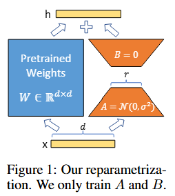

# 论文标题: LoRA: Low-Rank Adaptation of Large Language Models - ICLR 2022

### 一、引言与核心问题

本文研究的背景是大型预训练语言模型（Large Language Models, LLMs）在自然语言处理（NLP）领域取得的巨大成功。这些模型通常在大规模通用语料上进行预训练，然后针对特定的下游任务（如文本分类、问答、摘要生成等）进行微调（Fine-Tuning）。然而，随着模型规模的急剧增长（例如，GPT-3拥有1750亿参数），对整个模型进行微调变得越来越不可行。

**论文试图解决的核心任务是什么？**

核心任务是**参数高效地微调（Parameter-Efficient Fine-Tuning, PEFT）**大型语言模型。传统的全量微调（Full Fine-Tuning）方法会为每个下游任务训练并存储一份完整的模型副本，这导致了巨大的存储开销和部署困难，尤其是在需要服务多个定制化模型的场景下。LoRA旨在解决这一问题，实现一种既能达到与全量微调相媲美的性能，又能显著减少可训练参数数量和存储需求的微调范式。

*   **输入 (Input)**: 与原始的预训练模型（如GPT、RoBERTa）保持一致。通常是经过分词（Tokenization）后的文本序列。
    *   **数据维度/Shape**: `[Batch_size, Sequence_length]`，其中每个元素是词汇表中的一个整数索引。在送入模型后，会通过嵌入层转换为 `[Batch_size, Sequence_length, d_model]` 的张量，其中 `d_model` 是模型的隐藏层维度。

*   **输出 (Output)**: 也与原始模型在特定任务下的输出保持一致。
    *   **数据维度/Shape**: 取决于具体任务。例如，对于分类任务，可能是 `[Batch_size, Num_classes]` 的logits；对于文本生成任务，则是 `[Batch_size, Sequence_length, Vocab_size]` 的logits分布。

*   **任务的应用场景**:
    *   **多任务部署**: 为大量客户或任务提供定制化的模型服务，每个模型都需要针对特定数据进行微调。
    *   **快速任务切换**: 在单个GPU上高效地切换不同的微调模型，而无需卸载和重新加载庞大的基础模型。
    *   **资源受限环境**: 在计算和存储资源有限的设备上进行模型微调。

*   **当前任务的挑战 (Pain Points)**:
    *   **存储成本高**: 为每个任务存储一个完整的模型副本（例如，GPT-3的副本大小约为350GB），成本极高。
    *   **训练开销大**: 微调全部参数需要大量的GPU内存来存储模型参数、梯度和优化器状态（如Adam中的一阶和二阶矩），硬件门槛高。
    *   **部署不灵活**: 在服务中动态加载和切换多个大型模型非常耗时，影响服务效率。

*   **论文针对的难点**:
    本文明确聚焦于上述**存储成本高**和**训练开销大**的难点，旨在设计一种新的微调方法，在不牺牲模型性能和引入推理延迟的前提下，将可训练参数的数量级降低数千甚至上万倍。

### 二、核心思想与主要贡献

*   **直观动机与设计体现**:
    本文的直观动机来源于一个关键的假设：大型语言模型在过参数化的同时，其在适应下游任务时权重的**变化量（Weight Update, ΔW）**具有很低的“内在秩”（Intrinsic Rank）。这意味着尽管模型权重矩阵 `W` 是高维且满秩的，但其更新量 `ΔW` 实际上可以被一个低秩矩阵很好地近似。
    这一动机直接体现在LoRA的设计中：它没有直接优化 `ΔW`，而是将其分解为两个低秩矩阵的乘积，即 `ΔW = BA`，其中 `A` 和 `B` 是两个可训练的“适配器”矩阵。在微调过程中，原始的预训练权重 `W₀` 保持冻结，只有低秩矩阵 `A` 和 `B` 参与训练和更新。

*   **与相关工作的比较与创新**:
    LoRA与**Adapter Tuning**和**Prefix-Tuning**等参数高效微调方法最为相关。
    *   **与Adapter的比较**: Adapter方法在Transformer的每个块中插入小型的前馈神经网络模块。这种串行结构不可避免地会引入额外的**推理延迟（Inference Latency）**，因为每次前向传播都必须经过这些新增的层。LoRA的创新在于，它的低秩矩阵是与原始权重并行计算的（`h = W₀x + BAx`），并且在推理时，可以将学习到的 `BA` 直接加回到 `W₀` 上（`W = W₀ + BA`），从而完全恢复原始模型的网络结构，**不引入任何额外的推理延迟**。
    *   **与Prefix-Tuning的比较**: Prefix-Tuning通过在输入序列前添加可训练的连续提示（Continuous Prompts）来引导模型，这本质上改变了输入层的激活。这种方法的一个缺点是它会减少可用于处理下游任务信息的有效序列长度。LoRA则直接作用于模型权重，不占用输入序列长度，被证明在性能上更稳定且更优。

*   **核心贡献与创新点**:
    1.  **提出LoRA（Low-Rank Adaptation）**: 一种高效、低延迟的模型微调方法。通过冻结预训练权重，并注入可训练的低秩分解矩阵来近似权重更新，将可训练参数数量减少了高达10,000倍，GPU内存需求减少了3倍。
    2.  **实现无推理延迟的参数高效微调**: LoRA的设计允许在部署时将低秩矩阵与原始权重合并，完全消除了由适配器引入的额外计算，解决了Adapter等方法存在的推理延迟问题。
    3.  **实证有效性**: 通过在RoBERTa、DeBERTa、GPT-2、GPT-3等多种模型和GLUE、E2E NLG等多种任务上的大量实验，证明LoRA的性能与全量微调相当甚至更优，并且显著优于其他参数高效微调方法。

### 三、论文方法论 (The Proposed Pipeline)

* **整体架构概述**:
  LoRA的整体流程非常简洁。对于一个预训练的权重矩阵 $W_0 \in \mathbb{R}^{d \times k}$，LoRA不直接更新它，而是通过一个低秩分解来表示其更新量 $\Delta W$。具体而言，修改后的前向传播过程表示为：
  $$
  h = W_0 x + \Delta W x = W_0 x + B A x
  $$
  其中，$W_0$ 是冻结的预训练权重，$x \in \mathbb{R}^{k}$ 是输入。$B \in \mathbb{R}^{d \times r}$ 和 $A \in \mathbb{R}^{r \times k}$ 是两个可训练的低秩适配矩阵，它们的秩 $r$ 远小于 $d$ 和 $k$（$r \ll \min(d, k)$）。在训练期间，只有 $A$ 和 $B$ 会被优化器更新。

* **详细网络架构与数据流**:
  *   **数据预处理**: 与原始模型完全相同。
  *   **逐层/逐模块解析**: LoRA主要应用于Transformer架构中的**自注意力模块（Self-Attention）**的权重矩阵，即查询（Query）、键（Key）、值（Value）和输出（Output）的线性投影层（$W_q, W_k, W_v, W_o$）。
      *   **层/模块类型**: 将原始的 `torch.nn.Linear` 层替换为 `loralib.Linear` 层。
      *   **设计细节**:
          *   `loralib.Linear` 继承自 `torch.nn.Linear`，内部额外维护了两个线性层 `lora_A` 和 `lora_B`，分别对应低秩矩阵 $A$ 和 $B$。
          *   **初始化**: $A$ 采用随机高斯分布初始化，而 $B$ 初始化为全零。这使得在训练开始时，$\Delta W = BA = 0$，保证了微调模型在初始阶段与预训练模型完全一致，有助于稳定训练。
          *   **缩放因子**: 输出会经过一个缩放操作 `(alpha / r)`，其中 `alpha` 是一个常数超参数。这类似于调整学习率，可以减少在改变秩 `r` 时重新调整超参数的需求。
      *   **形状变换 (Shape Transformation)**:
          1.  输入 $x$ 的形状为 `[Batch_size, Seq_len, in_features]`。
          2.  原始权重 $W_0$ 的计算路径：$W_0 x$ 的输出形状为 `[Batch_size, Seq_len, out_features]`。
          3.  LoRA 适配器路径：
              *   $x$ 首先通过 `lora_A`，形状从 `[..., in_features]` 变为 `[..., r]`。
              *   然后通过 `lora_B`，形状从 `[..., r]` 变为 `[..., out_features]`。
          4.  两个路径的结果相加，最终输出形状仍为 `[Batch_size, Seq_len, out_features]`。
      *   **结合消融实验的作用分析**:
          *   论文中的消融实验（Table 5）表明，并非所有权重矩阵都需要应用LoRA。在参数预算有限的情况下，同时适配 $W_q$ 和 $W_v$ 的性能最佳。这表明对于下游任务，调整模型如何从上下文中提取信息（Value）以及如何形成查询（Query）是最为关键的。
          *   实验（Table 6）还显示，一个非常小的秩 $r$（如1或2）就能达到非常有竞争力的性能，证明了权重更新确实具有低秩特性。

* **损失函数 (Loss Function)**:
  *   **设计理念**: LoRA在损失函数层面**没有进行任何修改**。它完全沿用针对特定下游任务的标准损失函数。例如，对于分类任务使用交叉熵损失，对于生成任务使用语言模型损失（即下一个词预测的交叉熵）。
  *   **关注重点**: 这种设计哲学体现了LoRA旨在成为一个通用的、与具体任务解耦的适配方法。它只改变模型的参数化方式，而不改变优化目标本身。
  *   **训练实施**: 训练时，通过 `loralib.mark_only_lora_as_trainable(model)` 函数，将模型中所有不含 "lora_" 字符串的参数的 `requires_grad` 属性设置为 `False`，确保只有低秩矩阵 $A$ 和 $B$ 的参数会被计算梯度和更新。

* **数据集 (Dataset)**:
  *   **所用数据集**: 论文使用了多个公开的NLP基准数据集进行评估。
      *   **NLU (自然语言理解)**: GLUE Benchmark (包括MNLI, SST-2, MRPC, CoLA, QNLI, QQP, RTE, STS-B)。
      *   **NLG (自然语言生成)**: E2E NLG Challenge, DART, WebNLG。
      *   **大规模模型验证**: WikiSQL 和 SAMSum 用于GPT-3的实验。
  *   **特殊处理**: 论文遵循了之前工作的标准数据处理流程，没有进行特殊的数据集处理，以保证公平比较。

### 四、实验结果与分析

*   **核心实验结果**:
    LoRA在多个基准测试中展现了与全量微调相当甚至更优的性能，同时可训练参数极少。

    **RoBERTa-large 在 GLUE 上的平均分对比:**
    | 指标            | 基线方法 (Fine-Tune) | 本文方法 (LoRA) | 可训练参数量   |
    | --------------- | -------------------- | --------------- | -------------- |
    | GLUE Avg. Score | 88.9                 | **89.0**        | 0.8M vs 355.0M |

    **GPT-3 175B 在 SAMSum (摘要) 上的 ROUGE-L 分数对比:**
    | 指标    | 基线方法 (Fine-Tune) | 本文方法 (LoRA) | 可训练参数量   |
    | ------- | -------------------- | --------------- | -------------- |
    | ROUGE-L | 44.5                 | **45.9**        | 4.7M vs 175.2B |

    这些结果清晰地表明，LoRA在性能上毫不逊色，甚至略有超越，但其参数效率极高。

*   **消融研究解读**:
    *   **适配哪些矩阵**: 实验表明，在固定的参数预算下，将参数分配给更多的矩阵类型（如同时适配 $W_q$ 和 $W_v$）比将所有参数用于提升单一矩阵类型（如仅适配 $W_q$）的秩更有效。
    *   **秩 $r$ 的选择**: 令人惊讶的是，即使秩 $r$ 非常小（如 $r=1$），LoRA也能取得很好的性能，特别是在同时适配 $W_q$ 和 $W_v$ 时。这强有力地支持了论文的核心假设——权重更新的内在秩非常低。随着 $r$ 的增加，性能趋于饱和，表明过高的秩并无必要。

*   **可视化结果分析**:
    论文通过可视化不同秩（$r=8$ vs $r=64$）下学习到的低秩子空间的相似性（Figure 3），发现秩较高的矩阵所学习到的最重要的方向（Top singular vector directions）与秩较低的矩阵高度重合。这表明，增加秩所带来的额外维度主要是在捕捉“噪声”或次要信息，而核心的、有用的适应性信息确实存在于一个非常低维的子空间中。

### 五、方法优势与深层分析

*   **架构/设计优势**:
    *   **参数高效性**: 最显著的优势。通过仅训练低秩矩阵 $A$ 和 $B$，将需要存储和优化的参数量减少了几个数量级。例如，对于GPT-3，一个微调后的模型副本从350GB减少到仅35MB。
    *   **无推理延迟**: 这是相对于Adapter等方法的关键优势。由于LoRA的并行结构可以在推理时被合并回主干网络，因此不会增加任何计算步骤，推理速度与原始模型完全相同。这对于对延迟敏感的生产环境至关重要。
    *   **任务切换高效**: 在部署时，可以保持一个庞大的基础模型在内存中，并通过加载不同的、极小的LoRA权重（几十MB）来快速切换任务，极大提升了服务的灵活性和效率。
    *   **通用性与正交性**: LoRA是一种通用的方法，可以应用于任何具有密集层（如`nn.Linear`）的神经网络。它还可以与其他方法（如Prefix-Tuning）结合使用，提供互补的性能提升。

*   **解决难点的思想与实践**:
    论文的核心思想是**“分离变与不变”**。它假设预训练模型学到的通用知识是“不变”的（体现在冻结的权重 $W_0$），而对下游任务的适应是“变”的，并且这种变化是低秩的。
    在实践中，LoRA通过以下方式将这一思想付诸实现：
    1.  **冻结 $W_0$**: 保留了模型绝大部分的知识，避免了灾难性遗忘，并大大减少了计算和内存开销。
    2.  **低秩参数化 $ \Delta W = BA$**: 将复杂的、高维度的权重更新问题，转化为一个更简单、低维度的优化问题。这不仅减少了参数，也可能起到了正则化的作用，防止模型在小数据集上过拟合，从而在某些任务上获得比全量微调更好的泛化性能。
    3.  **零初始化 $B$**: 保证了训练的稳定性，使得微调过程从一个良好的起点（即预训练模型的性能）开始平滑过渡。

### 六、结论与个人思考

*   **论文的主要结论回顾**:
    LoRA是一种非常有效且实用的参数高效微调技术。它通过低秩分解假设，成功地在保持甚至超越全量微调性能的同时，将可训练参数的数量和存储需求降低了数千倍，并且解决了其他方法引入的推理延迟问题，为大规模语言模型的实际应用和部署提供了重要的解决方案。

*   **潜在局限性**:
    *   秩 $r$ 和 `alpha` 等超参数仍需要根据具体任务进行调整，虽然论文表明其对 $r$ 不太敏感，但在追求极致性能时仍需要搜索。
    *   该方法主要在Transformer的注意力权重上进行了验证。虽然理论上可应用于任何密集层，但在其他类型的网络或层（如MLP层）上的最佳实践和性能增益仍需进一步探索。

*   **未来工作方向**:
    *   **自适应秩分配**: 研究如何根据不同层或不同任务的重要性，自动地、动态地分配秩 $r$，而不是使用固定的秩。
    *   **与其他PEFT方法融合**: 深入探索LoRA与知识蒸馏、量化、剪枝等其他模型压缩和加速技术的结合，以实现更极致的效率。
    *   **理论分析**: 更深入地从理论上分析为什么权重更新呈现低秩结构，以及这种结构与模型泛化能力之间的关系。

*   **对个人研究的启发**:
    LoRA的成功启发我们，在处理大型过参数化模型时，直接优化整个参数空间可能不是最高效或最有效的方式。识别并参数化关键的、低维的变化子空间，是一种极具潜力的思想。这种“抓大放小”、关注“变化量”而非“存量”的哲学，不仅适用于模型微调，也可能启发模型设计、持续学习和可解释性等其他研究领域。