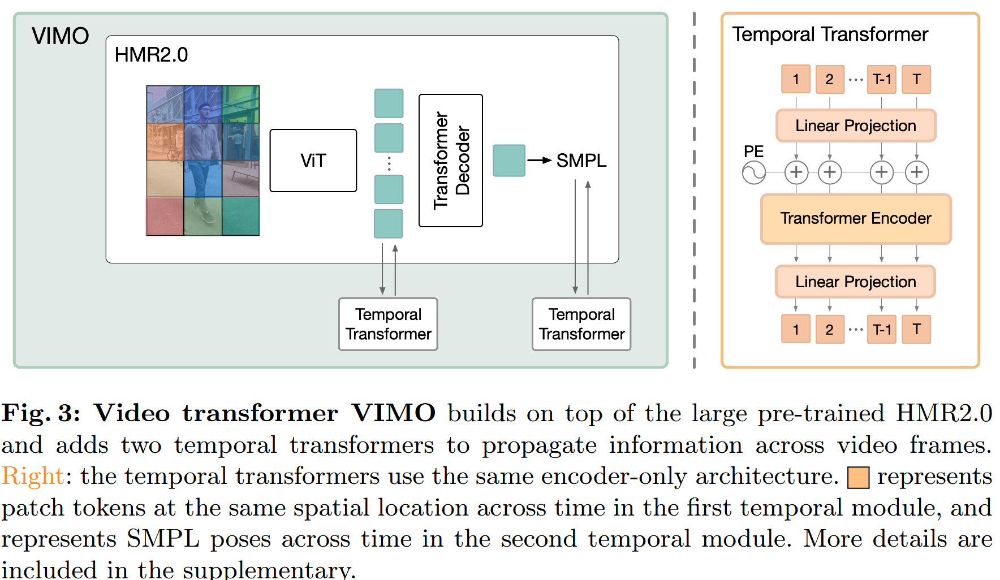

# 论文笔记: TRAM: Global Trajectory and Motion of 3D Humans from in-the-wild Videos - arXiv 2024

### 一、引言与核心问题

本研究探讨了计算机视觉中的一个基础且极具挑战性的任务：从移动相机在非受控环境（in-the-wild）下拍摄的单目视频中，重建出人体完整的三维运动。此任务的重要性在于，它不仅要求恢复人体的局部关节运动（kinematic body motion），还需精确捕捉其在真实世界坐标系下的全局移动轨迹（global trajectory）。实现这一目标将极大推动人机交互、运动分析、虚拟/增强现实等下游应用的发展，使得机器能够真正理解人类在环境中的行为。

#### 论文试图解决的核心任务是什么？

*   **输入 (Input)**:
    *   一个单目（monocular）、非受控的RGB视频序列。
    *   数据形态为一系列图像帧，其**数据维度 (Shape)** 为 `[T, 3, H, W]`，其中 `T` 是视频帧数，`3` 代表RGB三通道，`H` 和 `W` 分别是图像的高度和宽度。

*   **输出 (Output)**:
    *   人体的完整三维运动信息，这被分解为两个部分：
        1.  **全局轨迹 (Global Trajectory)**: 人体根节点在世界坐标系下的 `SE(3)` 变换序列 `{H_t}`，描述了人体随时间的全局位置和朝向。其**数据维度 (Shape)** 可表示为 `[T, 4, 4]` 的齐次变换矩阵序列。
        2.  **局部运动 (Local Motion)**: 以人体为中心、在相机坐标系下描述的身体姿态和形态变化。通常由参数化模型（如SMPL）的参数序列表示，其**数据维度 (Shape)** 为 `[T, D_smpl]`，其中 `D_smpl` 包含了姿态参数 `θ`、体型参数 `β` 等。

*   **任务的应用场景**:
    *   **运动科学与医疗健康**: 在真实环境中进行无标记步态分析、康复评估。
    *   **电影与游戏制作**: 降低动作捕捉的成本，从普通视频中生成逼真的虚拟角色动画。
    *   **机器人与自动驾驶**: 使机器人能够更好地预测和理解周围行人的运动意图，实现更安全的交互。
    *   **AR/VR**: 将真实人物的动态三维分身实时融入虚拟世界。

*   **当前任务的挑战 (Pain Points)**:
    1.  **运动歧义性**: 在输入视频中，观察到的像素位移是相机运动和人体自身运动的混合结果。从单目视频中解耦这两种运动是一个病态问题 (ill-posed problem)。
    2.  **SLAM系统的局限性**: Simultaneous Localization and Mapping (SLAM) 是估计相机轨迹的常用工具，但在本任务中面临两大难题：
        *   **动态物体干扰**: SLAM通常假设场景是静态的。视频中大幅度运动的人体会严重违反这一假设，导致相机轨迹估计产生巨大误差甚至彻底失败。
        *   **尺度不确定性**: 单目SLAM只能恢复出相机轨迹和场景结构的相对尺度，无法得到具有真实物理单位（如米）的绝对尺度。没有绝对尺度，就无法将人体置于真实大小的世界空间中。
    3.  **时间一致性**: 传统上，逐帧进行3D人体姿态估计的方法常常导致输出的动作序列在时间上不连贯，出现抖动 (jitter)。而现有的基于视频的模型虽能提升平滑度，但在单帧重建精度上往往落后于图像模型。

*   **论文针对的难点**:
    TRAM论文的设计全面地、系统性地瞄准了上述所有核心难点。它提出了一套完整的解决方案，旨在鲁棒地处理动态人体干扰，解决单目SLAM的尺度不确定性，并在此基础上实现高精度、高时序一致性的人体运动重建。

### 二、核心思想与主要贡献

*   **直观动机与设计体现**:
    本文的核心动机源于一个清晰的观察：如果能将复杂的“相机-人体”联合运动估计问题分解为两个相对独立的、更易于解决的子问题，那么任务的难度将大大降低。这一动机直接体现在其设计的**两阶段 (Two-Stage)** 解耦框架中：
    1.  **第一阶段，专注相机**: 既然运动的人体是SLAM的“麻烦制造者”，那么就想办法在估计相机轨迹时“无视”人体。通过仅利用场景中的静态背景信息，可以得到一个不受人体运动干扰的、干净的相机轨迹。
    2.  **第二阶段，专注人体**: 在获得了可靠的相机轨迹后，相机坐标系就成了一个稳定的参考系。此时，任务简化为在已知的相机视角下，从视频中恢复人体的局部运动。
    通过最后将两个阶段的结果进行合成，即可恢复出人体在世界坐标系下的完整运动。

*   **与相关工作的比较与创新**:
    本文与SLAHMR [95]和WHAM [70]等工作最为相关，它们都试图解决相似的问题。
    *   **相较于SLAHMR**: SLAHMR等方法也采用SLAM，但它们依赖于一个从MoCap数据中学到的**人体运动先验模型**来推断相机运动的尺度。这种做法的局限性在于，当现实世界中的人体运动（如跑酷、滑板）超出MoCap数据集的覆盖范围时，模型会失效。**TRAM的创新在于，它完全抛弃了对人体运动先验的依赖，转而从场景的几何语义（利用深度估计网络）中推断尺度，从而获得了对复杂运动更好的泛化能力。**
    *   **相较于WHAM**: WHAM是一个强大的端到端回归模型，但它在处理复杂、长距离的弯曲轨迹时会产生显著的漂移。**TRAM的创新在于，它利用SLAM强大的几何约束能力来提供一个非常精确的相机轨迹作为参考，极大地减少了全局轨迹的累积误差，在RTE指标上实现了数量级的提升。**

*   **核心贡献与创新点**:
    1.  **提出TRAM框架**: 提出一个全新的、高效且准确的两阶段框架，用于从单目视频中恢复人体的全局轨迹和局部运动，大幅刷新了该任务的SOTA性能。
    2.  **鲁棒且度量准确的SLAM**: 提出了一套名为“**Masked DROID-SLAM**”的技术方案，通过创新的**双重掩码 (Dual Masking)** 策略，使SLAM系统能够鲁棒地处理动态人体。同时，结合最先进的单目深度估计网络和巧妙的鲁棒优化策略，首次实现了在不依赖人体运动先验的情况下，对相机轨迹进行精确的**公制尺度估计 (Metric Scale Estimation)**。
    3.  **提出VIMO模型**: 提出了一个名为**VIMO (Video Transformer for Human Motion)** 的新型视频transformer模型。该模型通过在强大的预训练图像模型（HMR2.0）之上嫁接两个**时序Transformer模块**，并保持主干网络冻结，以一种高效且可扩展的方式实现了业界领先的视频人体姿态和体型重建精度与平滑度。

### 三、论文方法论 (The Proposed Pipeline)

TRAM的整体流程被清晰地划分为两个核心阶段，最终将结果进行融合。

*   **整体架构概述**:
    给定一段输入视频，TRAM首先并行地处理两个阶段。**阶段一：相机轨迹估计**。该阶段使用经过特殊改造的Masked DROID-SLAM来处理视频帧，输出一个仅由背景信息决定的、鲁棒的相机轨迹。随后，利用一个度量深度估计网络（ZoeDepth）对该轨迹进行尺度标定，得到具有真实物理单位的相机位姿序列`{G_t}`。**阶段二：局部人体运动估计**。该阶段将相同的视频帧输入到VIMO模型中，VIMO模型负责回归出人体在相机坐标系下的姿态、体型参数序列`{Θ_t}`以及相对相机的根位移`{T_t}`。最后，通过简单的刚体变换复合$H_t = G_t \circ T_t$，将局部的人体运动转换到世界坐标系中，得到最终的完整三维运动。

*   **详细网络架构与数据流**:

    #### 阶段一: 相机轨迹估计 (Camera Trajectory Estimation)
    
    1.  **Masked DROID-SLAM**:
        *   **基础模型**: 该模块基于DROID-SLAM [80]，一个先进的基于深度学习的视觉SLAM系统，它通过对稠密光流进行迭代优化（称为Dense Bundle Adjustment, DBA）来联合估计相机位姿和场景深度。
        *   **核心问题**: DROID-SLAM的DBA优化目标函数 $E(G, \mathbf{d}) = \sum_{(i,j)} \left\| \mathbf{p}_{ij} - \Pi(G_{ij} \circ \Pi^{-1}(\mathbf{p}_i, d_i)) \right\|_{\Sigma_{ij}}^2 \quad \text{where} \quad \Sigma_{ij} = \text{diag}(\mathbf{w}_{ij})$ 依赖于静态场景假设。运动的人体（前景）会提供错误的运动线索，污染整个优化过程。
        *   **TRAM的解决方案 (Dual Masking)**:
            1.  **置信度掩码 (Confidence Masking)**: 首先，使用现成的目标检测器（YOLOv7）和分割模型（Segment Anything）精确地分割出每一帧中的人体区域。然后，在DBA过程中，将属于人体区域像素的**置信度权重 `w_ij` 强制设为0**。这相当于直接从优化目标中剔除了这些动态点，使得相机位姿的求解完全依赖于静态的背景像素。
            2.  **输入图像掩码 (Input Masking)**: 作者发现，仅仅掩码置信度还不够。DROID-SLAM的编码器会提取全局特征，大面积的运动人体仍然会影响这些特征的质量。因此，在将图像送入编码器之前，也对图像本身进行掩码（例如，将人体区域像素值设为0）。
        *   **Shape Transformation**: `[T, 3, H, W]` 的视频帧经过Masked DROID-SLAM处理后，输出两部分：(1) 一个无尺度的相机位姿序列 `{G'_t}` (SE(3) poses)；(2) 一个无尺度的场景深度图序列 `{d_t}`，其shape为 `[T, H, W]`。
        
    2.  **轨迹尺度估计 (Trajectory Scale Estimation)**:
        *   **设计理念**: 既然不能依赖人体运动先验，就从场景的几何结构中寻找线索。现实世界中的物体（如建筑、车辆）具有相对固定的尺寸，一个预训练好的度量深度估计网络可以提供关于场景绝对尺度的宝贵信息。
        *   **具体实现**:
            *   使用**ZoeDepth** [5]网络为每个关键帧 `I_i` 预测一个具有公制单位（米）的深度图 `D_i`。
            *   现在有了两个深度图：SLAM输出的无尺度深度`d_i`和ZoeDepth输出的公制深度`D_i`。目标是求解一个全局尺度因子 `α`，使得 `α * d_i` 与 `D_i` 尽可能对齐。
            *   **鲁棒优化**: 考虑到ZoeDepth的预测可能存在噪声（尤其在天空等无纹理区域），TRAM采用了一种非常稳健的策略：
                *   对于**每一帧**，通过最小化一个鲁棒损失函数（German-McClure Loss）$E(\alpha) = \sum_{(h,w)} \rho(\alpha d_{h,w} - D_{h,w}) = \sum_{(h,w)} \frac{(\alpha d_{h,w} - D_{h,w})^2}{c^2 + (\alpha d_{h,w} - D_{h,w})^2}$ 来求解一个独立的尺度因子 `α_i`。在优化时，会预先剔除深度值较大（通过阈值）的远距离区域。
                *   在得到所有关键帧的尺度估计 `{α_i}` 后，取其**中位数 (median)** 作为最终的全局尺度因子 `α_final`。这种做法能有效抵抗个别帧预测失败带来的影响。
        *   **最终输出**: 将 `α_final` 应用于无尺度的相机轨迹 `{G'_t}`，得到最终的公制度量相机轨迹 `{G_t}`。

    #### 阶段二: 局部人体运动估计 (VIMO)

    * **VIMO模型架构**:
    
      
    
      *   **基础模型**: VIMO建立在强大的**HMR2.0** [17]之上，该模型使用一个ViT-Huge作为主干网络，在单图像人体三维重建上表现优异。
      *   **核心设计**: VIMO的巧妙之处在于，它**冻结了ViT-Huge主干网络**以保留其强大的图像表征能力，仅在其上添加了两个轻量级的**时序Transformer模块**并进行微调。
      *   **数据流**:
          1.  **图像特征提取 (ViT Backbone)**: `[T, 3, H, W]` 的视频帧被逐帧独立地送入冻结的ViT，为每一帧提取出一系列patch tokens，形状为 `[T, N_p, D_f]` (T帧, N_p个patch, D_f维特征)。
          2.  **时序Transformer I (图像/Token域)**: 这是第一个创新点。该模块对来自ViT的特征进行时序信息融合。它对**每个空间位置的patch token**在**时间维度`T`上**应用自注意力机制。这使得模型能在回归最终结果前，就利用相邻帧的外观和运动线索来提纯和增强每个patch的特征。
          3.  **HMR2.0回归头 (Decoder)**: 经过时序增强的特征 `[T, N_p, D_f]` 被送入HMR2.0原有的Transformer解码器，回归出初始的SMPL参数序列 `{Θ'_t}`。
          4.  **时序Transformer II (运动/Pose域)**: 这是第二个创新点。该模块直接以回归出的SMPL姿态参数序列 `{Θ'_t}` 作为输入。它本质上是一个**运动去噪/平滑模块**，通过学习自然人体运动的时序先验，来修正和润滑第一步回归出的可能存在抖动的姿态序列，输出最终平滑且精确的局部运动参数 `{Θ_t}`。
      *   **消融实验分析**: Table 5的消融实验清晰地证明了这两个时序模块的价值：
          *   移除**时序模块I** (Tokens Attention) 会导致重建**精度**下降（PA-MPJPE从35.6上升到37.0），说明在特征层面融合时序信息对于准确理解姿态至关重要。
          *   移除**时序模块II** (Motion Attention) 会导致运动**平滑度**急剧恶化（加速度误差Accel从4.9飙升至14.8），说明该模块在保证运动自然流畅方面扮演了关键角色。
    
*   **损失函数 (Loss Function)**:
    *   VIMO的训练采用了一系列在人体三维重建领域广泛使用的损失项的加权和：`L = λ_2D * L_2D + λ_3D * L_3D + λ_SMPL * L_SMPL + λ_V * L_V`
    *   **构成与关注点**:
        *   `L_2D`: 2D关节点重投影损失，确保恢复出的3D模型投影回2D图像后与2D检测的关节点对齐。
        *   `L_3D`: 3D关节点损失，在有3D真值标注的数据集上，直接监督3D关节点位置。
        *   `L_SMPL`: SMPL参数损失，直接监督模型的姿态和体型参数回归。
        *   `L_V`: 顶点损失，监督模型生成的Mesh顶点与真值顶点之间的距离。
    *   **训练实施**: 这些损失被用于VIMO模型的端到端微调（ViT主干除外）。通过这些多方面的监督，模型学会了从视频中重建出几何精确且外观一致的人体模型。

*   **数据集 (Dataset)**:
    *   **训练集**: 3DPW, Human3.6M, BEDLAM。这些数据集的组合提供了丰富的室内外场景、多样的动作以及带有3D标注的数据，是训练一个泛化能力强的模型的关键。
    *   **评估集**: EMDB (The Electromagnetic Database)。该数据集尤其关键，因为它提供了带有**相机位姿真值**的户外人体运动序列，是评估TRAM全局轨迹恢复能力的最理想基准。

### 四、实验结果与分析

TRAM在实验部分取得了令人信服的结果，系统性地验证了其各个模块的有效性。

*   **核心实验结果**:
    下表总结了TRAM在关键任务——**全局人体轨迹恢复**上的表现，并与当前最先进的方法WHAM [70]进行了对比。

    | 指标 (EMDB 2)            | TRACE [78] | GLAMR [96] | SLAHMR [95] | WHAM [70] | **TRAM (本文)** | 提升效果      |
    | ------------------------ | ---------- | ---------- | ----------- | --------- | ------------------- | ------------- |
    | **RTE (%) ↓**            | 17.7       | 11.4       | 10.2        | 4.6       | **1.4**             | **降低了69.5%** |
    | WA-MPJPE₁₀₀ (mm) ↓     | 529.0      | 280.8      | 326.9       | 133.3     | **76.4**            | **降低了42.7%** |
    | W-MPJPE₁₀₀ (mm) ↓      | 1702.3     | 726.6      | 776.1       | 343.9     | **222.4**           | **降低了35.3%** |

    *   **结果解读**: **RTE (Root Trajectory Error)** 是衡量全局轨迹准确度的核心指标，数值越低越好。TRAM将此误差从之前最好的4.6%**大幅降低至1.4%**，这是一个决定性的进步，证明了其两阶段解耦框架的巨大成功。其他指标（如WA-MPJPE，衡量对齐后的世界坐标系下的姿态误差）也显示出全面的领先。

*   **消融研究解读**:
    *   **相机轨迹恢复 (Table 1 & 2)**:
        *   在EMDB上，默认的DROID-SLAM的平均轨迹误差(ATE)为2.42米，而**Masked DROID**则降至**0.32米**，验证了双重掩码策略对于处理动态人体的极端有效性。
        *   在使用TRAM的尺度估计方法后，ATE-S（使用估计尺度的ATE）为**0.66米**，与使用真值尺度的0.32米相差不大，这表明其尺度估计算法是准确且可靠的。
    *   **VIMO模块 (Table 5)**: 如前文所述，消融实验清晰地展示了VIMO中两个时序Transformer模块各自在提升精度和平滑度方面的关键作用。

*   **可视化结果分析**:
    *   **Figure 5 & 6** 提供了非常有说服力的可视化对比。相较于WHAM，TRAM恢复的轨迹（蓝色实线）与真值（灰色虚线）高度吻合，尤其是在转弯等复杂路径上。WHAM在这些情况下会出现明显的漂移。
    *   特别地，Figure 6展示了在行走下楼梯、滑板等非标准MoCap数据覆盖的动作上，TRAM依然能够准确重建，而依赖运动先验的方法则会失效。这直观地证明了TRAM方法设计的优越性和泛化能力。

### 五、方法优势与深层分析

*   **架构/设计优势**:
    1.  **解耦与分治 (Decouple and Conquer)**: TRAM最大的优势在于其清晰的解耦思想。它将一个高度耦合的、困难的联合优化问题，分解为两个独立的、各自领域都有成熟解决方案的子问题（SLAM和人体姿态估计）。这种“分而治之”的策略降低了问题的复杂性，并允许对每个子问题使用最专门、最强大的工具。
    2.  **鲁棒性源于背景**: TRAM的鲁棒性根植于一个简单而深刻的洞察：背景是静态的，因此是可靠的。通过Masked DROID-SLAM，它强制模型仅从稳定的背景中学习相机运动，从而免疫了前景动态物体的干扰，这是其能够处理长视频和复杂场景的关键。
    3.  **泛化能力源于几何**: TRAM的泛化能力来自于它不依赖特定的人体运动先验。尺度估计是基于通用的场景几何（通过ZoeDepth理解），而非特定的动作模式。这使得TRAM能够处理任何类型的人类活动，只要背景是相对静态的。
    4.  **效率与性能的平衡 (VIMO)**: VIMO的设计体现了一种在性能和效率之间取得平衡的智慧。它通过冻结庞大的ViT主干，重用了其强大的预训练知识，仅微调了轻量级的时序模块，从而以较低的训练成本实现了SOTA级别的视频人体姿态估计性能。

*   **解决难点的思想与实践**:
    *   **针对“动态物体干扰”**: 核心思想是**“前景/背景分离”**。实践上，通过**双重掩码**机制，在几何优化（DBA）和特征提取（Encoder）两个层面彻底清除了动态人体对SLAM的负面影响。
    *   **针对“尺度不确定性”**: 核心思想是**“从场景几何推断尺度”**。实践上，利用预训练的**度量深度网络ZoeDepth**作为“尺度先验”，并通过**鲁棒的中位数优化策略**来抵抗单帧预测噪声，从而稳健地求解全局尺度。
    *   **针对“时间一致性”**: 核心思想是**“在特征域和运动域双重时序建模”**。实践上，VIMO模型通过**两个分工明确的时序Transformer**，分别在特征层面融合运动线索以提升精度，在姿态参数层面进行平滑去噪以保证动作连贯。

### 六、结论与个人思考

*   **论文主要结论回顾**:
    TRAM成功地提出并验证了一个两阶段方法，能够从单目视频中高效、准确地恢复人体的全局轨迹和局部运动。通过巧妙地结合并改进SLAM和深度学习模型，它在标准基准上取得了突破性的性能，尤其是在全局轨迹精度方面，为该领域树立了新的标杆。

*   **潜在局限性**:
    1.  **对相机内参的依赖**: 如作者所述，当前SLAM系统大多需要预先知道相机的焦距等内参。这在完全“in-the-wild”的应用中可能是一个限制。
    2.  **深度估计的失效场景**: ZoeDepth这类深度估计网络在面对极端光照、低纹理、透明/反光表面或非常规的相机视角（如鱼眼镜头）时，其性能可能会下降，从而影响尺度估计的准确性。
    3.  **分离式优化的次优性**: 虽然两阶段分离式方法效果显著，但它本质上是一个次优解。一个端到端的联合优化框架，在理论上可能找到更好的全局最优解，例如，在人体姿态和相机轨迹之间进行微调和对齐。
    4.  **单人场景限制**: 当前论文的框架主要针对单人场景设计。在多人拥挤的场景中，人与人之间的遮挡，以及多个动态物体对背景的遮挡，会给分割和SLAM带来新的、更严峻的挑战。

*   **未来工作方向**:
    1.  **联合优化框架**: 探索在TRAM强大的两阶段初始化结果之上，构建一个轻量级的联合优化或精调（fine-tuning）层，可能会进一步提升精度。
    2.  **无内参SLAM**: 结合能够在线估计相机内参的SLAM技术（如FlowMap [72]），以摆脱对已知焦距的依赖。
    3.  **多人场景扩展**: 将TRAM的思想扩展到多人场景，需要解决更复杂的实例分割、数据关联以及遮挡处理问题。

### 七、代码参考与分析建议

*   **仓库链接**: 作者在摘要中提供了项目主页链接: [https://yufu-wang.github.io/tram4d/](https://yufu-wang.github.io/tram4d/)，通常可以在该页面找到GitHub代码仓库。
*   **核心模块实现探讨**: 若代码开源，强烈建议读者查阅作者提供的代码，重点关注以下几个模块的实现，以深入理解其工作方式和参数配置：
    1.  **`Masked DROID-SLAM`的集成**: 关注作者是如何将YOLOv7/SAM的分割掩码集成到DROID-SLAM的DBA流程中的。具体来说，是查看他们如何修改置信度图的部分。
    2.  **`Trajectory Scale Estimation`的优化脚本**: 查看实现鲁棒尺度估计的具体代码，特别是German-McClure损失的应用、远景剔除的阈值设定以及取中位数的逻辑。
    3.  **`VIMO`的模型定义文件**: 详细阅读VIMO的网络结构定义，特别是两个时序Transformer模块是如何在前向传播中被调用的，以及ViT主干是如何被设置为冻结状态的。