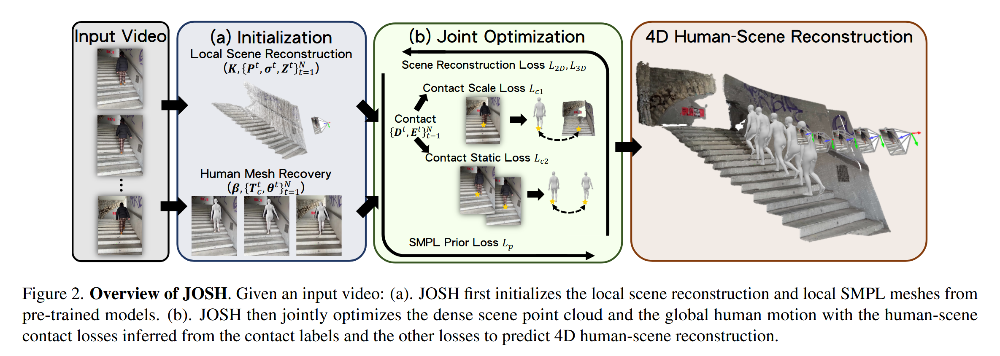
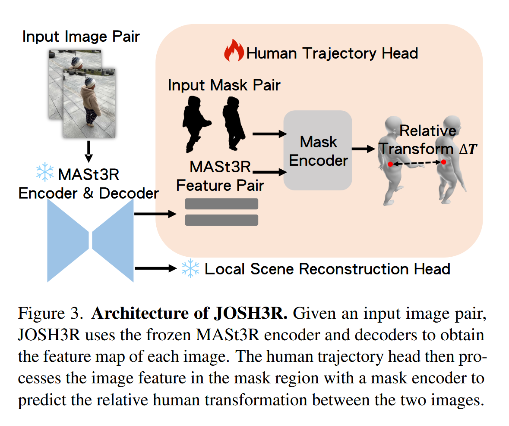

# 论文标题: Joint Optimization for 4D Human-Scene Reconstruction in the Wild - CVPR 2025

### 一、引言与核心问题

这篇论文探讨了在不受控的“野外”环境下，仅通过单目视频（monocular video）同时重建三维场景和人体四维动态（4D，即3D + time）的复杂问题。这项技术对于理解人与环境的交互至关重要，例如在自动驾驶中预测行人行为，或在城市规划中设计更合理的公共空间。

*   **论文试图解决的核心任务是什么？**
    *   **输入 (Input)**: 单个单目RGB视频，即一个图像序列。
        *   **数据形态**: 一系列图像帧 $\{I^t \in \mathbb{R}^{H \times W \times 3}\}$，其中 $t$ 代表时间步，$N$ 是视频总帧数。
    *   **输出 (Output)**: 一个完整的4D人-场景表示。
        *   **数据形态**: 这包括多个耦合的参数：
            *   **场景几何**: 一个稠密的3D点云或深度图 $\{Z^t \in \mathbb{R}^{H \times W}\}$，以及全局尺度因子 $\{\sigma^t\}$。
            *   **相机参数**: 相机内参 $K \in \mathbb{R}^{3 \times 3}$ 和每帧的相机外参（位姿）$\{P^t \in \text{SE}(3)\}$。
            *   **人体动态 (4D Human Motion)**: 使用**SMPL (Skinned Multi-Person Linear Model)**模型进行参数化表示。SMPL是一个经典的人体模型，通过少量参数（体型`shape`、姿态`pose`）即可生成一个带蒙皮的、可摆出各种姿势的3D人体网格（mesh）。
                *   人体体型参数 $\beta \in \mathbb{R}^{10}$ (在视频中保持不变)。
                *   每帧的人体姿态参数 $\{\theta^t \in \text{SO}(3)^{23}\}$ (23个身体关节的局部旋转)。
                *   每帧的人体在世界坐标系下的全局变换（位置和朝向）$\{T_g^t \in \text{SE}(3)\}$。

    *   **任务的应用场景**:
        *   **自动驾驶**: 精准分析行人在人行横道或路边的行为，以实现更安全的路径规划。
        *   **城市规划与建筑设计**: 分析人们如何与公共空间（如广场、长椅、楼梯）互动，以优化人流、鼓励社交并创造更具包容性的环境。
        *   **增强现实/虚拟现实 (AR/VR)**: 将逼真的虚拟数字人无缝地融入到真实世界的重建场景中。
        *   **机器人学**: 使机器人能够理解并预测人类在共享空间中的动作。

    *   **当前任务的挑战 (Pain Points)**:
        *   **尺度模糊性 (Scale Ambiguity)**: 从单目视频中重建3D场景或物体，其绝对物理尺度是未知的。一个远处的大物体和一个近处的小物体在图像上可能看起来一样大。
        *   **运动解耦困难**: 在一个移动相机拍摄的视频中，图像上物体的运动是相机运动和物体自身运动的叠加。要准确地将人体在世界坐标系中的真实运动（global motion）从相机运动中分离出来，极具挑战性。
        *   **缺乏联合约束**: 传统的做法通常是将场景重建和人体姿态估计作为两个独立的任务来处理。例如，先用SLAM（即时定位与地图构建）估计相机轨迹和场景点云，再将人体模型拟合进去。这种分离式的方法忽略了人与场景之间至关重要的物理交互，如脚踩在地面上、手扶着墙壁等，导致重建结果可能不真实（例如，脚浮空或穿入地下）且精度不高。
        *   **野外环境的复杂性**: 真实世界的视频包含复杂多变的背景、光照、遮挡和多样的人体动作，这给重建带来了巨大困难。

    *   **论文针对的难点**: 本文的核心目标是解决**联合约束缺乏**的问题。它认为，人与场景的**接触 (Contact)** 是连接这两个独立任务的强力纽带。通过将场景几何、人体动态和相机位姿纳入一个**统一的联合优化框架**中，并利用接触信息作为核心约束，可以同时解决**尺度模糊性**和**运动解耦**的难题。

### 二、核心思想与主要贡献

*   **直观动机与设计体现**: 本研究的直观动机非常清晰：**人不能穿墙，脚踏实地**。当一个人与环境发生接触时（如脚踩地面），接触点在人和场景上应是同一点，并且在物理上保持一致（例如，脚不会在地面上滑动）。这一简单的物理常识为解决复杂的几何重建问题提供了强大的线索。论文将这一动机体现在其核心的**联合优化 (Joint Optimization)** 框架（名为**JOSH**）中，设计了专门的**接触损失函数 (Contact Losses)**，强制约束人体模型和场景模型在接触点上保持空间和时间上的一致性。

*   **与相关工作的比较与创新**:
    *   **与独立人体运动估计算法 (如WHAM, TRAM) 的比较**: 这些方法通常只关注人体运动的重建，而忽略了场景。因此，重建出的人体虽然姿态可能正确，但却悬浮在一个空洞的环境中，缺乏与现实世界的“接地感”。JOSH通过同时重建场景，为人体运动提供了坚实的物理基础。
    *   **与独立场景重构算法 (如MASt3R) 的比较**: 这些方法专注于从视频中重建静态场景，但通常会将动态物体（如行人）视为噪声或直接忽略。JOSH将人体明确地建模进来，实现了动态人体与静态背景的共同重建。
    *   **创新**: 最大的创新在于提出了一个**联合优化**的理念和框架。它不是简单地将两个问题的结果拼接在一起，而是让场景的几何信息和人体的运动信息在优化过程中**相互引导、相互修正**。场景为人体提供了物理边界和尺度参考，而人体的运动（特别是与场景的接触）则反过来帮助消除场景重建中的尺度模糊性并细化相机轨迹。

*   **核心贡献与创新点**:
    1.  **JOSH框架**: 提出了一种新颖的、基于优化的方法JOSH，通过利用人-场景接触作为核心约束，**联合优化**场景几何、人体全局运动和相机位姿，首次在“野外”环境下实现了高质量的4D人-场景重建。
    2.  **JOSH3R模型**: 设计了一个名为JOSH3R的高效、端到端的模型变体。该模型无需迭代优化，可以实现实时推断，极大地提升了处理大规模视频数据的效率。它通过在JOSH生成的伪标签上进行训练，成功地将优化过程的知识蒸馏到了一个前馈网络中。
    3.  **SOTA性能**: 实验结果表明，JOSH在多个公开数据集（EMDB, SLOPER4D, RICH）上，无论是在人体全局运动估计还是在场景重建精度方面，都显著优于此前的SOTA方法。

### 三、论文方法论 (The Proposed Pipeline)

JOSH的流程分为两个主要阶段：**初始化**和**联合优化**。

* **整体架构概述 (JOSH)**:

  

  1.  **初始化 (Initialization)**: 首先，使用现成的、预训练好的模型，为场景、人体和相机参数提供一个合理的初始估计。这一步是为后续的精细化调整做准备。
  2.  **联合优化 (Joint Optimization)**: 其次，将所有初始化参数（场景点云、人体SMPL参数、相机位姿）放入一个统一的优化器中，通过最小化一个精心设计的复合损失函数，对它们进行联合迭代更新，最终得到一个物理一致、几何精确的4D人-场景重建结果。

*   **详细网络架构与数据流**:
    
    *   **阶段一：初始化 (Sec 4.1)**
        *   **数据预处理**: 使用视频分割模型 (如[34]) 将视频中的动态前景（人体）与静态背景分离开，生成每帧的人体掩码 $M^t$。
        *   **场景初始化**: 在**剔除了人体区域**[DEVA]的图像上运行 **MASt3R-SfM [12]**。这是一个先进的Structure-from-Motion模型，它可以从图像序列中估计出：
            *   初始相机内参 $K$ 和外参 $\{P^t\}$。
            *   初始场景深度图 $\{Z^t\}$ 和对应的3D点云 $\{X^t\}$。
            *   这样做的好处是避免了动态人体对静态场景重建的干扰。
        *   **人体初始化**: 使用一个先进的视频人体姿态估计算法 (如[TRAM], [Humans in 4d])，从原始视频中估计出每帧人体在**相机坐标系**下的初始SMPL参数：体型 $\beta$、局部姿态 $\theta^t$ 和局部变换 $T_c^t$。
        *   **接触点初始化**: 使用一个预训练的接触预测器 (如[4])，为人体模型的每个顶点预测其是否与场景发生接触的标签。
    
    *   **阶段二：联合优化 (Sec 4.2)**
        *   **优化目标**: 将初始化阶段得到的所有参数，包括场景点云 $X^t$、相机位姿 $P^t$、全局尺度 $\sigma^t$，以及人体的全局变换 $T_g^t$ (由$P^t$和$T_c^t$计算得到) 等，全部视为可优化的变量。
        *   **数据流动**: 在每次优化迭代中，根据当前的参数计算损失函数，然后通过梯度下降（论文使用Adam）更新所有参数。这个过程反复进行，直到损失收敛。
    
*   **损失函数 (Loss Function, Eq. 6)**:
    这是JOSH方法的核心。总损失 $L$ 由多个部分加权构成：$L = w_{3D} \cdot L_{3D} + w_{2D} \cdot L_{2D} + w_{c1} \cdot L_{c1} + w_{c2} \cdot L_{c2} + w_p \cdot L_p$
    *   **设计理念与构成**:
        *   **场景重建损失 ($L_{3D}$, $L_{2D}$)**: 这部分继承自MASt3R-SfM，用于确保场景几何的正确性。
            *   $L_{3D}$ (Eq. 1): 3D对应点损失。惩罚在不同视角下重建出的同一个3D场景点之间的距离，确保三维结构的一致性。
            *   $L_{2D}$ (Eq. 2): 2D重投影损失。将3D场景点重新投影回2D图像，惩罚其与原始图像中对应特征点之间的像素距离，确保相机位姿的准确性。
        *   **人-场景接触损失 ($L_{c1}$, $L_{c2}$)**: 这是论文的关键创新。
            *   **接触尺度损失 $L_{c1}$ (Eq. 4)**: $\max(0, \|x_h^t - x_s^t\|^2 - \Delta_{c1})$。它要求当人体上的一个顶点 $x_h^t$ 与场景发生接触时（在初始化时预测），它在3D空间中对应的场景点 $x_s^t$ 必须非常接近（通过 $\text{argmin}$ 比较二维距离寻找）。这个损失**极其重要**，因为它直接关联了人体和场景的几何，是解决**尺度模糊性**的关键。例如，如果初始估计中场景过小，那么脚接触点和地面点在3D空间中就会有很大距离，$L_{c1}$会产生一个大的梯度来“推大”整个场景的尺度，直到它们对齐。
            *   **接触静态损失 $L_{c2}$ (Eq. 5)**: $\max(0, \|x_s^t - x_s^{t+1}\|^2 - \Delta_{c2})$。它要求当一个接触点在连续帧中保持接触时（如脚站立不动），该接触点在**世界坐标系**中应该是静止的。这个损失可以有效防止重建出的人体在地面上“滑冰”的现象，使运动更真实。
        *   **SMPL先验损失 ($L_p$)**: $\|T_c^t - T_{c, \text{init}}^t\|^2$。这是一个正则化项，惩罚优化后的人体局部变换 $T_c^t$ 与其初始值 $T_{c, \text{init}}^t$ 偏离过大，确保人体姿态的合理性，并为整个系统提供关于人体尺度的初始信息。

*   **JOSH3R架构 (Sec 4.3)**:
    为了实现实时性，JOSH3R将联合优化的过程“编译”进了一个深度网络中。
    
    
    
    *   它使用一个**冻结的MASt3R作为特征提取主干**。
    *   在其之上增加了一个**新的人体轨迹头 (Human Trajectory Head)**。该模块接收来自MASt3R的图像特征和人体掩码，直接回归（predict）出连续两帧之间人体的**相对变换 (Relative Transformation) $\Delta T$**。
    *   通过从第一帧开始，迭代地累乘这个相对变换 $T_g^t = T_g^{t-1} \cdot \Delta T$，就可以快速地计算出整个人体轨迹，从而避免了耗时的迭代优化。
    
* **数据集 (Dataset)**:
  *   **评估数据集 (Sec 5.1)**: EMDB, SLOPER4D, RICH。这些是包含移动相机拍摄的、带有精确3D人体运动和/或场景几何真值的标准基准数据集。
  *   **JOSH3R训练数据集 (Appendix B)**: 由于缺乏大规模的用于训练端到端模型的野外4D人-场景交互数据集，作者们采取了一种**自监督/伪标签**的策略。他们从YouTube上收集了13个城市的街景漫步视频，然后用他们自己提出的**JOSH方法**为这些视频生成了约46万帧的**伪标签 (pseudo-labels)**。最后，用这些伪标签来训练JOSH3R模型。这是一个非常聪明的工程实践，展示了如何利用一个精确但缓慢的优化方法来赋能一个快速但需要大量数据的深度学习模型。

### 四、实验结果与分析

*   **核心实验结果**:
    JOSH在所有任务和数据集上都取得了当前最佳（SOTA）性能。
    *   **人体运动估计 (Table 1)**: 在EMDB数据集上，JOSH的$\text{WA-MPJPE}$（世界坐标系下的平均关节位置误差）为68.9mm，远低于之前最好的方法TRAM的76.4mm。在更具挑战性的SLOPER4D数据集上，JOSH的误差仅为120.0mm，比之前最好的WHAM（297.7mm）降低了超过一倍，优势巨大。
    *   **场景重建 (Table 2)**: 在SLOPER4D上，JOSH的相机轨迹ATE（绝对轨迹误差）为7.4cm，点云CD（倒角距离）为7.38，均显著优于其他基线方法，如TRAM*和MASt3R*。这证明了联合优化确实能提升场景重建的质量。

| 数据集     | 指标             | TRAM* [9] | MASt3R* [13] | MonST3R* [32] | JOSH (ours) |
| ---------- | ---------------- | --------- | ------------ | ------------- | ----------- |
| **SLOPER4D** | ATE (cm)↓        | 124.8     | 28.0         | 20.8          | **7.4**     |
|            | CD (m)↓          | 59.70     | 29.64        | 10.21         | **7.38**    |
| **RICH**     | ATE (cm)↓        | N/A       | N/A          | N/A           | N/A         |
|            | CD (m)↓          | 4.77      | 3.96         | 5.43          | **2.81**    |

*   **消融研究解读 (Table 3)**: 消融实验清晰地展示了JOSH各组件的贡献。
    1.  **基线 (w/o opt)**: 仅使用初始化结果，性能最差 ($\text{WA-MPJPE}$ 314.3)。
    2.  **+ $L_{c1}$, opt scene**: 加入接触尺度损失 $L_{c1}$ 并只优化场景，性能得到**巨大提升** ($\text{WA-MPJPE}$ 降至 148.9)。这证明 $L_{c1}$ 是解决尺度模糊和对齐人与场景的关键，是整个方法中最重要的贡献。
    3.  **+ opt human**: 在此基础上再加入对人体的优化，性能进一步提升 ($\text{WA-MPJPE}$ 降至 121.2)。
    4.  **+ $L_{c2}$**: 最后加入接触静态损失 $L_{c2}$，性能有微小但稳定的提升 ($\text{WA-MPJPE}$ 降至 120.0)，主要作用是减少了运动伪影（如滑动）。

*   **可视化结果分析 (Fig. 4, 5)**: 可视化结果直观地展示了JOSH的优越性。与其他方法相比，JOSH重建的人体轨迹和场景点云不仅在几何上更精确，而且物理上更一致。例如，在Fig. 5中，MASt3R*的尺度完全错误，而MonST3R*的点云不一致，只有JOSH成功重建出了与真值（Ground Truth）非常接近的、具有正确尺度的连贯场景。

### 五、方法优势与深层分析

*   **架构/设计优势**:
    *   **协同优化的力量**: JOSH的核心优势在于其**协同优化 (Synergistic Optimization)** 的设计理念。它没有将问题分解，而是将所有变量置于一个统一的框架下。这使得信息可以在不同部分之间自由流动和相互约束。场景的刚性结构为相机和人体的定位提供了稳定的锚点；而人体的先验知识（如大致身高）和与场景的接触行为，则为整个系统提供了宝贵的尺度信息和几何约束。这种“1+1>2”的效应是分离式方法无法企及的。
    *   **物理先验的有效利用**: 该方法巧妙地将高级的物理语义（人与场景的接触）转化为简单而有效的数学损失函数（$L_{c1}$, $L_{c2}$）。这些损失函数直接作用于3D空间，比单纯依赖2D图像的像素信息或特征信息要鲁棒得多，能够更有效地指导优化过程朝向物理真实解。

*   **解决难点的思想与实践**:
    *   **思想**: 核心思想是**“以接触为桥梁，实现人与场景的联合推断”**。
    *   **实践**:
        *   **针对尺度模糊**: 通过$L_{c1}$损失，强制人体接触点和场景接触点在3D空间中对齐，直接约束了整个系统的绝对尺度。
        *   **针对运动解耦**: 通过联合优化相机位姿 $P^t$ 和人体全局变换 $T_g^t$，并辅以$L_{2D}$重投影损失和$L_{c2}$静态接触损失，使得系统能够更准确地区分哪些运动来自相机，哪些来自人体。
        *   **针对数据稀缺 (JOSH3R)**: 通过“JOSH生成伪标签 -> 训练JOSH3R”的两步走策略，成功地为端到端模型提供了大规模、高质量的训练数据，解决了野外环境下标注数据不足的瓶颈。

### 六、结论与个人思考

*   **论文的主要结论回顾**:
    这篇论文成功地提出了一种名为JOSH的新方法，通过联合优化框架和人-场景接触约束，显著提升了从单目视频中进行4D人-场景重建的精度和真实感。其高效变体JOSH3R也展示了将这种优化思想蒸馏到实时深度模型中的巨大潜力。

*   **潜在局限性**:
    *   **依赖初始化**: JOSH是一个基于优化的方法，其最终结果的好坏在一定程度上依赖于初始化模型的质量。如果初始的场景或人体估计错得离谱，优化过程可能陷入局部最优解。
    *   **依赖可见接触**: 该方法的核心依赖于可观测到的接触点。在接触点被严重遮挡，或者视频中几乎没有人与场景的接触（例如，在开阔地奔跑）的情况下，方法的优势会减弱。

*   **未来工作方向**:
    *   **提升鲁棒性**: 研究如何减少对初始化的依赖，或者设计更鲁棒的全局优化策略。
    *   **处理更复杂交互**: 将模型从简单的“接触”扩展到更复杂的交互，如坐、躺、推、拉等，甚至包括与动态物体或其他人的交互。
    *   **改进JOSH3R**: 使用更多样化、更真实的数据（而非伪标签）来训练JOSH3R，有望进一步缩小其与JOSH之间的性能差距，并提升其泛化能力。

### 七、代码参考与分析建议

*   **仓库链接**: [https://genforce.github.io/JOSH/](https://genforce.github.io/JOSH/)
*   **核心模块实现探讨**: 建议读者查阅作者提供的代码（如果开源），重点关注以下部分：
    *   **JOSH的优化循环**: 关注其主优化脚本，理解作者是如何将场景点云、SMPL参数、相机参数等不同来源的变量整合到同一个PyTorch优化器中，并如何计算总损失函数（特别是$L_{c1}$和$L_{c2}$）及其梯度。
    *   **JOSH3R的`Human Trajectory Head`**: 检查这一新模块的具体网络结构（论文附录图7提到它包含Mask Encoder和MLP头），理解它是如何从图像特征中回归出相对变换$\Delta T$的。
    *   **数据处理流程**: 查看数据加载和预处理部分，了解作者如何集成多个模型的输出（分割、姿态估计、场景重建）作为JOSH的初始化输入。