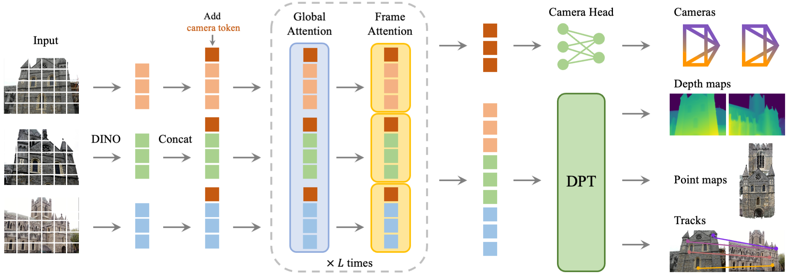

# 论文笔记：VGGT: Visual Geometry Grounded Transformer

**论文**: VGGT: Visual Geometry Grounded Transformer - CVPR 2025
**链接**: [https://arxiv.org/abs/2503.11651](https://arxiv.org/abs/2503.11651)

---

### 一、引言与核心问题

#### 研究背景与重要性
从多张二维图像中重建三维场景信息是计算机视觉和图形学的核心问题，其应用涵盖了从机器人导航、增强现实到数字孪生等众多领域。传统方法，如基于**Structure-from-Motion (SfM)**和**Bundle Adjustment (BA)**的几何优化流程，虽然精度较高，但通常计算成本高昂、流程复杂且依赖于迭代优化。近年来，深度学习方法开始崭露头角，但许多现有工作（如DUSt3R）仍需依赖昂贵的后处理优化步骤才能获得可用结果，限制了其在实时或大规模场景中的应用。

#### 核心任务
本文试图解决的核心任务是：**利用一个纯前馈（feed-forward）的神经网络，直接从一系列图像中一次性地、高效地联合估计出场景的全部关键三维几何属性。**

*   **输入 (Input)**:
    *   一系列（$N$张）关于同一静态场景的RGB图像。$N$的范围可以从1到数百。
    *   **数据形态**: $I = \{I_1, I_2, ..., I_N\}$, 其中每张图像 $I_i \in \mathbb{R}^{3 \times H \times W}$。
    *   **特殊设计**: 输入图像的顺序是任意的，但第一张图像被约定为参考坐标系。模型被设计为对除第一张外的所有图像具有**置换等变性（permutation equivariant）**。

*   **输出 (Output)**:
    *   针对输入的每一张图像，模型都会输出一组对应的三维属性。
    *   **数据形态**: $O = \{(g_i, D_i, P_i, T_i)\}_{i=1}^N$，具体包括：
        *   **相机参数 (Camera Parameters)** $g_i \in \mathbb{R}^9$: 包含相机外参（旋转四元数$q \in \mathbb{R}^4$和平移向量$t \in \mathbb{R}^3$）和内参（视场角$f \in \mathbb{R}^2$）。
        *   **深度图 (Depth Maps)** $D_i \in \mathbb{R}^{H \times W}$。
        *   **点图 (Point Maps)** $P_i \in \mathbb{R}^{3 \times H \times W}$: 每个像素对应的三维空间点坐标，且所有点图都在第一帧相机的坐标系下表示，实现了**视点不变性（viewpoint invariant）**。
        *   **追踪特征 (Tracking Features)** $T_i \in \mathbb{R}^{C \times H \times W}$: 用于下游任务（如特征点追踪）的稠密特征图。

*   **任务应用场景**:
    *   快速三维重建、SLAM（同步定位与建图）、机器人视觉导航、新视角合成、视频编辑中的动态点追踪。

*   **当前任务的挑战 (Pain Points)**:
    *   **计算效率**: 传统方法和一些深度学习方法依赖的迭代优化（如BA或全局对齐）非常耗时，通常需要数秒到数分钟。
    *   **系统复杂性**: 传统SfM管线包含特征匹配、三角化、捆绑调整等多个独立阶段，系统复杂且容易出错。
    *   **任务割裂**: 多数现有模型专注于单一任务（如仅深度估计或相机姿态估计），难以实现对场景的全面理解。
    *   **泛化能力**: 在非约束的“in-the-wild”图像（如光照变化剧烈、无重叠区域、重复纹理甚至艺术画作）上表现不佳。

*   **论文针对的难点**:
    *   本文主要聚焦于**效率**和**系统简洁性**，旨在用一个统一的、无需迭代优化的前馈模型，直接、快速地完成多种三维重建任务。同时，它也致力于提升模型在复杂、非约束场景下的**泛化能力**。

### 二、核心思想与主要贡献

#### 直观动机与设计体现
本文的直观动机源于自然语言处理和计算机视觉领域大模型的成功范式：**通过在一个庞大且多样化的数据集上训练一个高容量的Transformer模型，可以使其在不依赖过多特定任务归纳偏置（inductive biases）的情况下，学习到强大的通用表示**。

这一动机体现在其技术设计上：VGGT是一个拥有12亿参数的巨大Transformer，它几乎没有内置任何传统三维几何的硬约束（如对极几何），而是通过“暴力”学习海量带有三维标注的数据，让网络自行发现和内化这些几何规律。其核心的**交替注意力（Alternating-Attention）**机制也体现了这一思想，即让模型自主地在单帧图像的局部信息和多帧图像的全局信息之间进行推理和整合。

#### 与相关工作的比较与创新
*   **与DUSt3R/MASt3R的比较**: DUSt3R等工作在处理多于两张视图时，依赖于成对预测的融合和昂贵的全局对齐后处理。而VGGT可以一次性处理数百张图像，在一个前馈通路中直接输出全局一致的三维结构，无需任何后处理优化，速度和精度都大大超越前者。
*   **与VGGSfM的比较**: VGGSfM将可微分的BA模块整合进网络，虽然实现了端到端训练，但本质上仍保留了显式的几何优化步骤。VGGT则更进一步，几乎完全摒弃了显式的几何优化，尝试让神经网络直接回归最终结果，实现了所谓的“神经优先（neural-first）”方法。

#### 核心贡献与创新点
1.  **提出VGGT模型**: 这是一个大型的前馈Transformer模型，能够从一系列图像中高效地（0.2秒内）一次性预测出相机参数、深度图、点图和追踪特征等多种一致的三维属性。
2.  **验证了“神经优先”的可行性**: 实验证明，一个足够大的、在多样化数据上训练的模型，其直接预测的结果可以超越依赖昂贵几何后处理的SOTA方法，为三维视觉任务提供了一个更简洁、高效的解决范式。
3.  **强大的特征表示能力**: 证明了预训练的VGGT可以作为通用的三维视觉特征主干（backbone），在微调后能够显著提升下游任务（如新视角合成和动态点追踪）的性能。

### 三、论文方法论 (The Proposed Pipeline)

#### 整体架构概述
VGGT的整体流程遵循一个清晰的编码器-解码器思想。首先，输入的多张图像被一个预训练的视觉模型（DINOv2）编码为一系列图像特征令牌（Token）。为了预测相机参数，每组图像令牌都额外附加了一个可学习的“相机令牌”。这些混合令牌随后被送入核心的VGGT Transformer进行深度特征融合。该Transformer的核心是**交替注意力（Alternating-Attention）**机制，它在逐帧的自注意力（Frame-wise Attention）和跨所有帧的全局自注意力（Global Attention）之间交替进行，从而有效整合单视图的细节和多视图的一致性信息。最后，经过Transformer处理后的令牌被送入不同的预测头（Prediction Heads）：相机令牌用于回归相机参数，而图像令牌则通过一个类似DPT的结构上采样，生成稠密的深度图、点图和追踪特征。

#### 详细网络架构与数据流

1.  **数据预处理与令牌化 (Tokenization)**:
    *   **输入**: $N$张图像 $\{I_i\}_{i=1}^N$，形状为 `[N, 3, H, W]`。
    *   **模块**: 使用一个**冻结的DINOv2**作为图像编码器。
    *   **操作**: 每张图像$I_i$被切分成多个Patch，并被DINOv2编码成$K$个特征令牌$t_i^I$。同时，为每张图$i$引入一个可学习的相机令牌$t_i^c$和四个寄存器令牌$t_i^R$。
    *   **形状变换**:
        `[N, 3, H, W]` (图像)
        $\rightarrow$ `[N, K, C]` (图像令牌$t_i^I$)
        $\rightarrow$ `[N, 1+K+4, C]` (拼接相机和寄存器令牌后)
    *   **特殊处理**: 为了确立参考坐标系，第一帧的相机令牌$t_1^c$和寄存器令牌$t_1^R$使用与其他帧不同的、独立学习的参数。

2.  **核心Transformer骨干 (Alternating-Attention Backbone)**:
    *   **模块类型**: 由$L=24$个交替注意力模块堆叠而成。
    *   **设计细节**: 每个模块包含两个核心部分：
        *   **逐帧自注意力 (Frame-wise Self-Attention)**: 注意力计算被限制在每一帧自己的令牌内部（`[1, 1+K+4, C]`范围内）。此步骤负责提炼单张图像内的空间信息。
        *   **全局自注意力 (Global Self-Attention)**: 注意力计算扩展到所有帧的所有令牌上（`[N, 1+K+4, C]`范围内）。此步骤负责在不同视点间建立对应关系和融合信息。
    *   **形状变换**: 数据形状在Transformer内部保持为 `[N, 1+K+4, C]`，但特征被不断提炼。
    *   **作用分析 (结合消融实验)**: 论文的Table 5有力地证明了该设计的优越性。相比于“仅全局注意力”（性能下降）和传统的“交叉注意力”（性能大幅下降），**交替注意力**在整合多视图信息和保持计算效率之间取得了最佳平衡，是模型成功的关键。

3.  **预测头 (Prediction Heads)**:
    *   **输入**: Transformer输出的精炼令牌 $(\hat{t}_i^I, \hat{t}_i^c)_{i=1}^N$。
    *   **相机参数预测**:
        *   **模块**: 将输出的相机令牌 $(\hat{t}_i^c)_{i=1}^N$送入一个由4个自注意力层和1个线性层构成的轻量级**相机头**。
        *   **输出**: 相机参数$g_i$，形状为`[N, 9]`。
    *   **稠密预测 (深度/点图/追踪特征)**:
        *   **模块**: 将输出的图像令牌 $(\hat{t}_i^I)_{i=1}^N$送入一个**DPT解码器**。
        *   **操作**: DPT将令牌特征重新排列并上采样为稠密的特征图$F_i \in \mathbb{R}^{C' \times H \times W}$，随后通过独立的3x3卷积层分别生成最终的深度图、点图和追踪特征。
        *   **输出**: $D_i$ (`[N, H, W]`), $P_i$ (`[N, 3, H, W]`), $T_i$ (`[N, C, H, W]`)。

#### 损失函数 (Loss Function)
损失函数的设计体现了多任务学习的思想，通过联合监督所有输出来迫使网络学习内在的几何一致性。
*   **数学形式**: $L = L_{camera} + L_{depth} + L_{pmap} + \lambda L_{track}$
*   **设计理念与关注重点**:
    *   $L_{camera}$: 对相机内外参使用**Huber损失**进行监督，对离群值更鲁棒。
    *   $L_{depth}$ 和 $L_{pmap}$: 采用了结合**aleatoric uncertainty**的损失函数。它不仅惩罚预测值与真值的差异，还惩罚预测值梯度与真值梯度的差异，同时鼓励模型对其预测的不确定性（$\Sigma$）进行合理估计。这使得模型能够学习到在困难区域（如无纹理、遮挡）给出更高的不确定性，从而在训练中动态调整这些区域的损失权重。
    *   $L_{track}$: 对追踪点的坐标使用L2损失，并额外增加了一个可见性分类损失。
*   **对性能的贡献**: Table 6的消融实验表明，这种多任务联合训练至关重要。移除任何一项损失都会导致点图估计精度的下降，特别是移除相机参数损失$L_{camera}$时性能下降最为明显。这证明了**显式地监督相机参数**对于模型学习正确的场景几何结构至关重要，即使这些信息在理论上可以从点图中推断出来。

#### 数据集 (Dataset)
VGGT的成功在很大程度上归功于其庞大且多样化的训练数据。论文使用了一个包含多种来源的数据集集合，涵盖了室内、室外、真实世界和合成场景。具体包括：Co3Dv2, BlendMVS, MegaDepth, ScanNet, Kubric, Habitat, Replica等十余个数据集。这种大规模、多样化的训练策略是模型获得强大泛化能力的基础。

### 四、实验结果与分析

#### 核心实验结果
VGGT在多个基准测试中取得了SOTA或极具竞争力的结果，尤其是在其纯前馈模式下，展现了卓越的效率和精度。

*   **相机姿态估计 (Table 1)**: 在具有挑战性的RealEstate10K（未见过）和CO3Dv2数据集上，VGGT的表现如下表所示。

| 数据集      | 方法           | AUC@30 (↑) | 运行时间 |
|-------------|----------------|------------|----------|
| RealEstate10K | DUSt3R [129]   | 67.7       | ~7s      |
|             | VGGSfM v2 [125]| 78.9       | ~10s     |
|             | **VGGT (本文)**  | **85.3**   | **~0.2s**  |
|             | **VGGT+BA (本文)** | **93.5**   | **~1.8s**  |

*   **解读**: 在纯前馈模式下，VGGT不仅比依赖优化的VGGSfM快了约50倍，而且精度更高。这证明了其作为一种高效重建方案的巨大潜力。当结合BA后处理时，精度进一步大幅提升，表明其输出可以作为传统优化流程的优质初始化。

*   **多视图深度估计 (Table 2)**: 在DTU数据集上，在不使用真实相机参数的情况下，VGGT的Overall误差（Chamfer distance）为**0.382**，远优于DUSt3R的**1.741**，甚至可以媲美一些使用了真实相机参数的SOTA方法。

#### 可视化结果分析
论文中的Figure 3展示了VGGT在极具挑战性的“in-the-wild”图像上的定性结果。它能够成功地从一幅油画、两张完全没有重叠区域的图像以及充满重复纹理的场景中重建出合理的三维点云。这些结果直观地展示了模型强大的泛化能力和对场景几何的深刻理解，远超出了传统方法和一些现有深度学习方法的能力范围。

### 五、方法优势与深层分析

#### 架构/设计优势
VGGT的成功并非偶然，其优势根植于以下几个关键设计：

1.  **高容量模型与大规模数据**: 这是VGGT成功的基石。12亿参数的Transformer有足够的能力从海量数据中“记住”和“推理”出复杂的几何关系，从而摆脱对硬编码几何先验的依赖。
2.  **交替注意力机制**: 这是其高效处理多视图信息的核心。通过在单帧和全局信息之间动态切换，模型能够同时关注图像的局部细节（如纹理、边缘）和场景的全局结构（如物体间的位置关系、相机运动），实现了信息的有效融合。
3.  **多任务过完备监督**: 如前文所述，同时预测相机、深度、点图等相互关联但又冗余的量，实际上是一种非常强的正则化手段。它迫使网络的内部表示必须在几何上高度自洽，才能同时满足所有任务的监督信号。
4.  **智能的子问题分解**: Table 3的实验揭示了一个有趣的现象：通过（预测的）深度图和相机参数反投影得到的点云，比模型专门的点图预测头输出的点云更精确。这表明，将复杂的三维点图估计任务分解为**深度估计**和**位姿估计**两个相对更简单的子问题，并让网络分别学习，可能是一种更有效的策略。

#### 解决难点的思想与实践
VGGT通过**“以数据驱动的暴力美学，取代精巧的几何约束”**这一核心思想来解决传统方法的痛点。
*   **针对效率和简洁性**: 它用一个单一的、端到端的前馈网络取代了传统SfM复杂的多阶段流程，将数分钟的计算缩短到亚秒级。
*   **针对泛化能力**: 它不依赖于任何特定的几何假设（如对极约束），而是通过在极其多样化的数据上学习，获得了处理非理想、非结构化场景的强大能力，这在处理油画、无重叠图像等极限案例时得到了充分体现。

### 六、结论与个人思考

#### 论文结论回顾
VGGT成功地展示了一种构建高效、通用三维视觉系统的新范式。它证明了通过大规模数据训练的大型Transformer模型，可以在不依赖显式几何优化的情况下，直接、快速且准确地解决复杂的三维重建任务，为该领域的发展开辟了新的道路。

#### 潜在局限性
*   **输入图像类型**: 目前模型不支持鱼眼或全景等非针孔相机模型。
*   **极端视角变化**: 在输入图像之间存在极端旋转时，性能会下降。
*   **非刚性场景**: 模型假设场景是刚性的，无法处理存在显著非刚性形变的场景。

#### 未来工作方向
*   **扩展模型能力**: 通过在特定数据集上微调，可以相对容易地将模型扩展以支持上述局限性场景（如全景图像、非刚性物体）。
*   **无监督/自监督学习**: 探索将计算昂贵的可微分BA作为一种无监督信号，用于在没有真值标注的大规模数据上进行训练，这可能是一个非常有前景的方向。

### 七、代码参考与分析建议

*   **仓库链接**: [https://github.com/facebookresearch/vggt](https://github.com/facebookresearch/vggt)
*   **核心模块实现探讨**: 建议读者查阅作者提供的代码，重点关注以下模块的实现，以深入理解其工作原理：
    *   **交替注意力模块 (Alternating-Attention)**: 查看其如何实现Frame-wise和Global两种不同的注意力模式，以及它们之间如何切换。
    *   **多头预测架构**: 分析代码中相机头和DPT稠密预测头是如何从Transformer的输出令牌中分离并进行独立预测的。
    *   **损失函数实现**: 检查`L_depth`和`L_pmap`中包含不确定性和梯度项的损失是如何具体编码实现的。