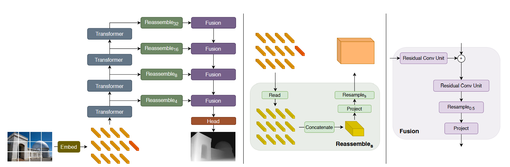

# 论文笔记: Vision Transformers for Dense Prediction - arXiv 2021

### 一、引言与核心问题

这篇论文发表于2021年，是探索将Transformer架构应用于计算机视觉领域，特别是密集预测任务（Dense Prediction Tasks）的开创性工作之一。在当时，绝大多数用于密集预测（如语义分割、深度估计）的模型都基于全卷积网络（FCNs）。尽管FCNs取得了巨大成功，但其固有的设计——通过连续的卷积和池化层来逐步扩大感受野——也带来了明显的弊端：在编码器的深层阶段，特征图的分辨率被严重降低，导致细粒度的空间信息丢失，而这些信息对于需要逐像素预测的密集任务至关重要。尽管后续的空洞卷积、U-Net的跳层连接等设计试图缓解这一问题，但它们仍然受限于卷积操作的局部性。

这篇论文敏锐地洞察到，刚刚在图像分类任务上大放异彩的Vision Transformer (ViT)架构可能为解决这一难题提供了新的途径。ViT在处理过程中保持了恒定的“特征分辨率”（即token数量不变），并且其自注意力机制在每一层都提供了全局感受野。这些特性与密集预测任务的需求天然契合。因此，本研究的核心目标就是设计一个有效的框架，将ViT作为骨干网络，以充分利用其优势来提升密集预测任务的性能。

*   **论文试图解决的核心任务是什么？**
    *   **任务**: 两类密集预测任务，**单目深度估计 (Monocular Depth Estimation)** 和 **语义分割 (Semantic Segmentation)**。
    *   **输入 (Input)**: 单张RGB图像。其数据维度为 `[Batch_size, 3, Height, Width]`。在训练中，图像被处理成特定的分辨率，例如，对于深度估计，训练时使用 `384x384` 的随机裁剪。
    *   **输出 (Output)**: 与输入图像对齐的密集预测图。
        *   对于**深度估计**，输出是单通道的深度图，维度为 `[Batch_size, 1, Height, Width]`。
        *   对于**语义分割**，输出是多通道的类别概率图，维度为 `[Batch_size, Num_Classes, Height, Width]`，其中每个像素点的值代表其属于对应类别的概率或logit。
    *   **任务的应用场景**: 这类任务是计算机图形学和计算机视觉的基石，广泛应用于自动驾驶（场景理解）、增强现实（虚实遮挡）、机器人导航（避障）、三维重建以及图像编辑等领域。
    *   **当前任务的挑战 (Pain Points)**:
        1.  **空间信息丢失**: 传统CNN编码器通过下采样来增大感受野和减少计算量，但这不可避免地牺牲了空间分辨率，导致精细结构（如物体边缘、细小物体）的细节信息丢失，而这些信息在解码器中难以完全恢复。
        2.  **有限的感受野**: 单个卷积核的感受野是局部的。即使通过堆叠大量卷积层，模型也只能逐步地、间接地建立全局上下文联系。在处理需要长距离依赖的大场景或大物体时，这种方式效率不高，可能导致预测结果缺乏全局一致性（例如，对大片天空或路面的分割不连贯）。
    *   **论文针对的难点**: 论文明确地针对上述两个核心难点。它旨在利用ViT的**全局感受野**来提升预测的全局一致性，并利用其**保持恒定数量token**的特性来避免传统CNN中的信息瓶颈，从而生成更精细、更准确的预测结果。

### 二、核心思想与主要贡献

*   **直观动机与设计体现**: 本研究的直观动机非常清晰：既然CNN的局部性和下采样是密集预测的瓶颈，那么就用一种具有全局性和高“分辨率”的架构来取代它。ViT正是这样的架构。论文的设计完美体现了这一动机：它将ViT用作一个强大的编码器，用于提取具有全局上下文的特征；然后，创新性地设计了一个“重组”（Reassemble）模块，将ViT输出的一系列非结构化的token重新排列组合成多尺度的、类似图像的特征图；最后，再将这些特征图送入一个轻量级的卷积解码器中，逐步融合并上采样，生成最终的密集预测。这种“ViT编码器 + 重组模块 + 卷积解码器”的设计，我们称之为**密集预测变换器 (Dense Prediction Transformer, DPT)**。

*   **与相关工作的比较与创新**:
    *   **与FCNs (如DeepLab, U-Net) 的比较**: FCNs是“卷积到底”的思路。DPT则是用Transformer作为特征提取主干，从根本上改变了特征表示的方式，从局部的、分层的特征图变为了全局关联的、扁平化的token序列。
    *   **与ViT for Classification的比较**: 原始ViT为分类任务设计，它只利用最终输出序列中的一个特殊`[CLS]` token来做全局预测，并丢弃了所有的patch token。DPT的创新之处在于，它认识到所有patch token都包含了丰富的空间信息，是密集预测任务的宝贵财富。因此，DPT的核心创新是设计了如何**重新利用**这些被分类任务忽略的patch token，并将它们有效地转换为解码器能够理解的多尺度特征图。

*   **核心贡献与创新点**:
    1.  **提出了DPT架构**: 首次成功地将纯Transformer架构（ViT）作为骨干网络应用于通用的密集预测任务，并展示了其巨大潜力。
    2.  **设计了Token重组机制 (Reassemble operation)**: 提出了一种有效的方法，能够将ViT在不同深度（Transformer层）输出的token序列，转换回多个2D图像形式的特征图。这是连接ViT编码器和卷积解码器的关键桥梁。
    3.  **刷新了技术水平 (SOTA)**: 在多个极具挑战性的密集预测基准上（如单目深度估计的`MIX 6`数据集和语义分割的`ADE20K`数据集），DPT显著超越了当时所有基于CNN的方法，取得了新的SOTA性能，有力地证明了该架构的优越性。

### 三、论文方法论 (The Proposed Pipeline)

* **整体架构概述**: DPT是一个经典的编码器-解码器模型。编码器是一个预训练好的ViT（ViT-Base, ViT-Large或其混合版本ViT-Hybrid），负责将输入图像转换为一系列包含丰富上下文信息的特征token。一个新颖的`Reassemble`操作从编码器的不同阶段提取这些token，并将它们转换为多个不同分辨率的特征图。最后，一个基于卷积的解码器（借鉴了RefineNet的设计）逐步融合这些特征图，并将其上采样以生成最终的全分辨率密集预测。

  

*   **详细网络架构与数据流**:
    
    *   **1. 编码器 (ViT Encoder)**:
        *   **输入**: 图像 `I ∈ R^(H×W×3)`。
        *   **Patch化与嵌入**: 图像被分割成一系列不重叠的 `p×p` (论文中`p=16`) 的小块(patches)。每个patch被展平并通过一个线性投影层，映射成一个`D`维的向量，称为token。
            *   **形状变换**: `[B, 3, H, W]` → `[B, N_p, p*p*3]` → `[B, N_p, D]`，其中 `N_p = HW/p²` 是patch的数量，`D`是token的维度（ViT-Base为768，ViT-Large为1024）。
        *   **位置编码**: 由于Transformer本身不处理序列的顺序信息，一个可学习的位置编码 `E_pos ∈ R^((N_p+1)×D)` 被加到token序列上，以注入空间位置信息。
        *   **Readout Token**: 一个额外的可学习的 `readout` token (等同于ViT中的`[CLS]` token)被拼接到序列的开头，用于聚合全局信息。此时token序列的形状为 `[B, N_p+1, D]`。
        *   **Transformer层**: 该token序列被送入`L`个标准的Transformer编码器层。每个层由一个多头自注意力（MHSA）模块和一个MLP模块组成。
            *   **关键特性**: 在所有`L`层中，token序列的形状 `[B, N_p+1, D]` 保持不变。这意味着模型在整个编码过程中都工作在一个恒定的特征维度和“空间分辨率”（由`N_p`决定）上。
    
    *   **2. 重组模块 (Reassemble)**: 这是连接编码器和解码器的核心。
        *   **多阶段特征提取**: DPT并不只使用ViT最后一层的输出。它从编码器的4个不同深度阶段（例如，对于ViT-Base，从第3, 6, 9, 12层）提取token序列 `t^l`。
        *   对于从第`l`层提取的token序列 `t^l ∈ R^((N_p+1)×D)`，执行以下操作：
            1.  **`Read`**: 处理`readout` token。论文的最佳实践（`Read_proj`）是将`readout` token `t_0` 与每个patch token `t_i` 进行拼接（concatenate），然后通过一个MLP层将其投影回`D`维。这一步旨在将全局信息（由`readout` token捕获）分发给每个patch token。
                *   **形状变换**: `[B, N_p+1, D]` → `[B, N_p, D]`。
            2.  **`Concatenate` (Reshape)**: 将处理后的 `N_p` 个patch token重新排列成一个2D的特征图。
                *   **形状变换**: `[B, N_p, D]` → `[B, D, H/p, W/p]`。
        *   通过在4个不同阶段应用`Reassemble`操作，我们得到了4个来自不同语义层次的特征图。
    
    *   **3. 解码器 (Convolutional Decoder)**:
        *   **渐进式融合与上采样**: 解码器由一系列融合模块组成。它从最深层（语义信息最丰富）的特征图开始，通过一个融合模块（包含卷积操作）将其与次深层的特征图融合，然后将结果上采样2倍。这个过程不断重复，直到所有4个特征图都被融合。
        *   **输出头**: 在解码器的最后，一个特定于任务的输出头（由几个卷积层构成）被用来生成最终的预测图，其分辨率通常是输入图像的一半，最后通过双线性插值恢复到原始分辨率。
    
*   **损失函数 (Loss Function)**:
    *   **设计理念**: 论文针对不同任务采用了领域内成熟的损失函数。
    *   **深度估计**: 使用了一种在先验工作[30]中提出的**尺度和位移不变损失 (scale- and shift-invariant loss)**。其核心思想是在逆深度空间中计算预测与真值之间的差异，这使得损失函数对预测结果的绝对尺度和偏移不敏感，更专注于学习场景的相对结构关系，这对于单目深度估计这一病态问题至关重要。
    *   **语义分割**: 采用了标准的**交叉熵损失 (Cross-Entropy Loss)**。此外，还引入了一个辅助损失（auxiliary loss），将它应用在倒数第二个融合层的输出上，这是一种在分割任务中被证明有效的、促进深度监督的技巧。

*   **数据集 (Dataset)**:
    *   **训练数据集**: 论文强调了Transformer模型对大规模数据的依赖。对于深度估计，他们构建了一个名为`MIX 6`的超大规模混合数据集，整合了10个不同的公开数据集，总共包含约140万张图像。对于语义分割，他们使用了具有挑战性的`ADE20K`数据集。
    *   **评估数据集**: 除了在混合数据集上进行评估外，论文还在多个标准基准上进行了评估和微调，如`NYUv2`, `KITTI`（用于深度估计）和`Pascal Context`（用于分割），以验证模型的泛化能力和在小规模数据集上的有效性。

### 四、实验结果与分析

论文的实验结果极具说服力，清晰地展示了DPT架构的优越性。

*   **核心实验结果**:
    *   **单目深度估计 (Zero-Shot Cross-Dataset Transfer)**: 在不进行微调，直接将在`MIX 6`上训练的模型用于评估其他数据集时，DPT表现出惊人的泛化能力。如下表（数据摘自原论文Table 1，括号内为相对MiDaS的性能提升百分比），DPT在所有指标上都大幅超越了之前的SOTA模型MiDaS。
        | 模型         | 训练集 | DIW WHDR ↓ | ETH3D AbsRel ↓ | Sintel AbsRel ↓ | KITTI δ>1.25 ↑ |
        |--------------|--------|------------|----------------|-----------------|----------------|
        | MiDaS [30]   | MIX 5  | 12.46      | 0.129          | 0.327           | 23.90          |
        | **DPT-Large**| MIX 6  | **10.82** (-13.2%)| **0.089** (-31.2%) | **0.270** (-17.5%)| **8.46** (-64.6%) |
        | **DPT-Hybrid**| MIX 6  | 11.06 (-11.2%)| 0.093 (-27.6%) | 0.274 (-16.2%)| 11.56 (-51.6%) |

    *   **语义分割**: 在ADE20K验证集上，DPT-Hybrid同样取得了新的SOTA，mIoU达到了49.02%，超过了当时所有基于CNN和ResNeSt等强大骨干网的方法。

*   **消融研究解读**:
    *   **Skip Connections的位置 (Table 6)**: 实验表明，最佳性能来自于连接编码器中**浅层和深层**的组合。例如，从{3, 6, 9, 12}层提取特征的效果优于只从深层{9, 10, 11, 12}提取。这验证了一个直观的猜想：浅层Transformer层保留了更多低级、精细的特征，而深层则捕获了更高级的语义信息，二者结合才能达到最佳效果。
    *   **Readout Token的处理方式 (Table 7)**: 对比忽略、相加、投影三种方式，**投影 (`project`)** 取得了最佳性能。这表明`readout` token中捕获的全局信息对于提升每个局部patch token的表示质量是有益的，而`project`操作是分发这种全局信息的最有效方式。
    *   **骨干网络的选择 (Table 8)**: ViT-Large和ViT-Hybrid均优于ViT-Base和强大的CNN基线ResNeXt101-WSL。ViT-Hybrid在性能和参数量之间取得了很好的平衡，使其成为一个极具吸引力的选择。

*   **可视化结果分析 (Figure 2 & 3)**:
    *   可视化结果直观地证实了DPT的优势。与基于CNN的MiDaS相比，DPT生成的深度图展现出**更强的全局一致性**（例如，天空区域的深度平滑且一致，没有奇怪的伪影）和**更丰富的精细细节**（例如，能够清晰地分辨出远处树木的枝干）。同样，在语义分割结果中，DPT能够生成更清晰、更贴合物体轮廓的边界。

### 五、方法优势与深层分析

*   **架构/设计优势**:
    *   **优势详述**: DPT的成功主要源于其ViT骨干网络的两大内在优势：
        1.  **全局上下文建模**: 传统的CNN需要通过很深的层次结构才能缓慢地构建起全局感受野。而DPT中的自注意力机制在**每一层**都能让每个token与所有其他token直接交互。这意味着模型从一开始就拥有全局视野，能更好地理解场景的整体布局和物体间的长距离依赖关系。这就是为什么DPT在处理大面积同质区域（如天空）或需要全局推理的场景时表现得更鲁棒。
        2.  **保留高分辨率信息**: DPT的编码器在整个处理流程中保持token数量`N_p`不变，避免了CNN中因下采样而导致的信息瓶颈。虽然token网格的“空间分辨率”是固定的（如H/16），但每个token都是一个高维（如D=768）的向量，它从原始图像patch中被投影而来，有能力保留原始patch内的精细信息。解码器随后能从这些信息丰富的token中重构出高质量的特征图，从而保留了最终预测的细节。

*   **解决难点的思想与实践**:
    *   论文的核心思想是**“用全局关联替代局部归纳”**。它通过实践证明，将视觉任务从“在像素网格上做局部卷积”的范式，转变为“在token集合上做全局关系推理”的范式，可以有效克服传统方法的局限性。
    *   在实践中，它通过以下设计落实了这一思想：
        1.  **ViT编码器**: 直接用ViT替换CNN骨干，引入了全局自注意力。
        2.  **多阶段Token重组**: 设计了`Reassemble`模块，巧妙地将ViT中不同层次的、适用于序列处理的token表示，转换回了适用于卷积解码器的、分层的2D特征图表示。这个模块是连接两种不同计算范式的关键。
        3.  **大规模数据预训练**: 认识到Transformer的“数据饥渴”特性，通过在一个巨大的`MIX 6`数据集上进行预训练，充分激发了DPT模型的潜力。

### 六、结论与个人思考

*   **论文结论回顾**: 论文成功地引入了DPT，一种利用ViT进行密集预测的新型架构。实验证明，与传统的FCN相比，DPT能够产生更精细、全局一致性更好的预测结果，并在大规模数据集上训练时充分释放其潜力，在单目深度估计和语义分割任务上均取得了当时最先进的成果。

*   **潜在局限性**:
    *   **计算和数据成本高**: ViT模型本身参数量巨大，计算复杂度高（尤其是自注意力部分，与token数量的平方成正比），并且严重依赖于大规模预训练数据集，这限制了其在资源受限场景下的应用。
    *   **归纳偏置较弱**: 相比于CNN的平移不变性等强归纳偏置，Transformer的归纳偏置较弱，这导致其需要更多数据来学习这些基本规律。

*   **未来工作方向**:
    *   **效率提升**: 研究更高效的Transformer变体（如线性注意力、稀疏注意力），以降低计算复杂度，使其适用于更高分辨率的输入或实时应用。
    *   **架构探索**: 探索不同的解码器设计，或者将Transformer的思想也引入解码器中，构建一个全Transformer的密集预测模型。
    *   **更广泛的应用**: 将DPT的思想推广到其他密集预测任务，如光流估计、表面法线估计、全景分割等。

### 七、代码参考与分析建议

*   **仓库链接**: [https://github.com/intel-isl/DPT](https://github.com/intel-isl/DPT)
*   **核心模块实现探讨**: 对于希望深入理解DPT的读者，强烈建议查阅作者提供的官方代码。应重点关注以下几个部分的实现：
    *   **`DPT`模型的主体结构**: 查看`DPT`类是如何将`ViT`骨干网络和解码器的各个部分（`Reassemble`层、`RefineNet`融合块）整合在一起的。
    *   **`Reassemble`模块**: 这是论文的核心创新之一。在代码中找到该模块的实现，理解它是如何具体地处理`readout` token，并将token序列`reshape`成2D特征图的。
    *   **模型变体（`DPT-Hybrid`）**: 如果对混合模型感兴趣，可以查看`DPT-Hybrid`的实现，了解它是如何使用ResNet作为初始特征提取器，并将ResNet的输出特征图送入Transformer的。